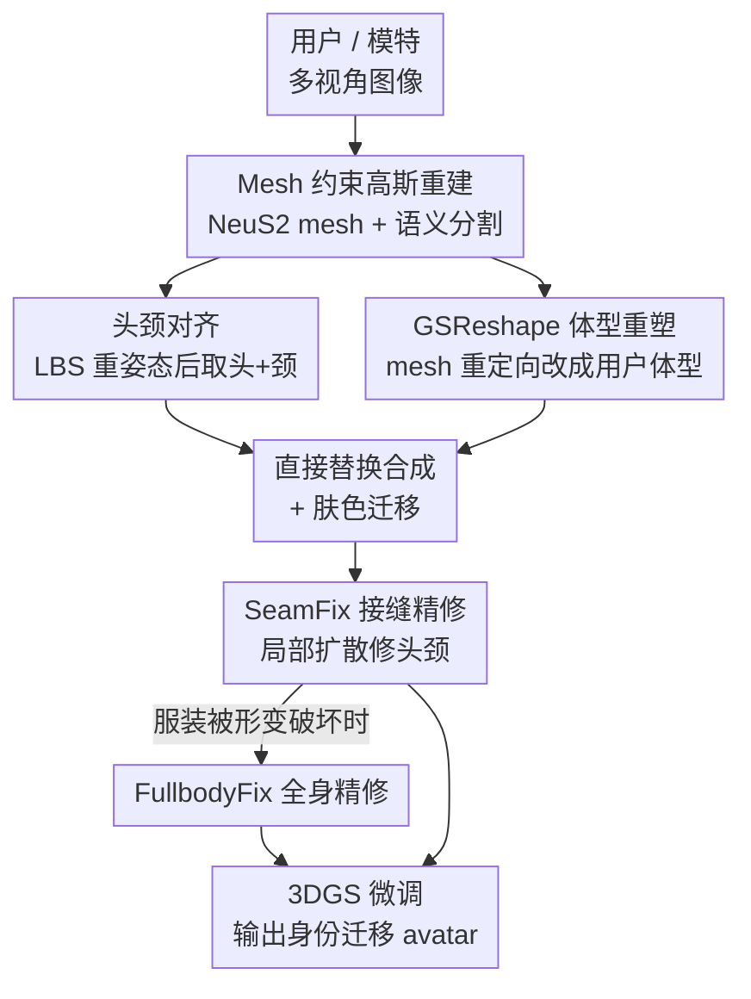

# AvatarMix: Identity-Preserving Cross-Avatar Composition for Outfit Personalization

**会议**: CVPR 2026  
**arXiv**: [2606.03506](https://arxiv.org/abs/2606.03506)  
**代码**: https://larsph.github.io/avatarmix/ (项目主页)  
**领域**: 3D视觉 / 3D高斯avatar / 虚拟试衣  
**关键词**: 3D Gaussian Avatar, 身份迁移, 跨avatar合成, 服装个性化, 扩散精修

## 一句话总结
AvatarMix 把"用户头部 + 模特着装身体"两个高保真 3DGS avatar 直接拼接成一个新 avatar，再用 mesh 重定向把模特身体改成用户体型、用两级扩散模块缝合接缝并修复变形后的服装，从而在保住服装质量和用户身份的前提下做 3D 服装个性化，DINO 相似度和用户偏好都大幅超过现有方法。

## 研究背景与动机

**领域现状**：随着 3D 高斯泼溅（3DGS）让逼真人体 avatar 重建变得平价，"给 avatar 换装/个性化"成了 VR、电商、数字内容的关键子任务。现有做法分两类：① 把 2D 服装图贴到 3D avatar 上做虚拟试衣（VTON），② 在两个已有 3D avatar 之间把衣服当独立图层迁移。

**现有痛点**：这两条路都掉进各自的坑。2D-to-3D 提升类（如 VTON360）依赖 2D 生成模型逐视角编辑再升 3D，缺乏显式 3D 空间约束，结果常出现纹理退化、细节幻觉、几何不准、多视角不一致。图层建模类（如 LayGA）把身体和衣服建成两层，几何复杂度高，极易产生**穿模交叉**（intersection），需要繁琐的几何正则和后处理碰撞检测，而且当两件衣服的身体覆盖范围差很多时还渲染不好裸露皮肤。

**核心矛盾**：两类方法的共同病根是——它们都要**重新生成或重新建模**目标区域的外观，于是输入 avatar 的高保真质量在输出里被破坏，产生"输入清晰、输出模糊"的质量落差。

**本文目标**：定义一个相关但不同的任务——**3D avatar 身份迁移做服装个性化**：把用户 avatar 的身份（头部、体型、肤色）迁移到提供全身服装的模特 avatar 上，且两侧的质量都不能损失。

**切入角度**：作者反问——既然两个 avatar 都已经是高保真 3DGS，为什么还要"生成"？不如**直接把零件拼起来**：头从用户拿、着装身体从模特拿。这种显式 3D 合成天然保住了双方原始的几何和纹理，也从设计上避免了穿模。

**核心 idea**：用"直接组合两个高保真高斯 avatar 的部件"代替"2D 生成或分层建模"，把质量退化和穿模问题从根上绕开；剩下的只是两个收尾问题——头身接缝怎么缝得自然、模特身体怎么改成用户体型——再用 mesh 重定向 + 两级扩散精修分别解决。

## 方法详解

### 整体框架
AvatarMix 接收用户和模特两组多视角图像，目标是输出一个"用户的脸+体型+肤色、模特的衣服"的合成 avatar，可自由视角渲染。整条 pipeline 分三大阶段：先把两个 avatar 都重建成 **mesh 约束的高斯表示**（高斯被绑在重建 mesh 表面，这样既能逼真渲染又能做几何形变）；再做**跨 avatar 几何合成**——把用户头颈对齐到模特姿态、用 GSReshape 把模特着装身体改成用户体型，然后直接用用户头颈替换掉重塑身体的头部区域得到合成 avatar；最后做**两级扩散精修**——SeamFix 局部修头颈接缝、FullbodyFix（可选）修被形变破坏的全身服装，二者都作用在"已经 3D 一致"的高斯 avatar 渲染图上，最后用精修后的多视角图反过来微调 3DGS。

### 关键设计

**1. 直接拼接的组合式范式：用"取零件"取代"重生成"**

现有方法无论 2D 提升还是分层建模，都要在目标区域重新生成/重建外观，于是输入的高保真在输出里被磨没了，还要花大力气处理穿模。AvatarMix 的反直觉之处是干脆不生成：从用户高斯 avatar $\mathcal{A}_u$ 直接抠出头部（提供面部身份），从模特高斯 avatar $\mathcal{A}_m$ 直接拿走整个着装身体（提供服装），在 3D 空间里把两块高斯拼成合成 avatar $\mathcal{A}_c=\{\mathcal{M}_c,\mathcal{G}_c\}$。因为衣服那块高斯是原封不动搬过来的，其几何和纹理就是原始重建质量，没有任何退化；又因为身体始终是"一整块"而非身体层+服装层，根本不存在两层交叉穿模的问题。这一步把前人最头疼的两个病（质量落差、穿模）从设计层面直接消除，把问题压缩成"接缝"和"体型"两个可控的局部问题

**2. GSReshape：把服装重定向搬到高斯 avatar 上做体型适配**

直接拼接保住了模特服装，但模特和用户体型不同，硬拼会让衣服不合身、失去用户的身体身份。作者选用 mesh 约束的高斯表示（沿用 SplattingAvatar，每个 mesh 顶点 $\mathbf{v}_i$ 绑一个高斯 $\mathcal{G}_i$），就是为了能把成熟的**服装 mesh 重定向**方法（Huang et al.）迁过来：把模特着装身体 mesh $\mathcal{M}_m^{\text{body}}$（含衣服和裸露皮肤）形变到用户 SMPL-X mesh $\mathcal{M}_u^{\text{SMPL}}$ 代表的体型，绑着的高斯随 mesh 一起变形。把"为裸体配衣服"的重定向改造成"为高斯 avatar 改体型"会冒出三个工程难题，作者逐一解决：(a) **手部感知的皮肤贴合**——原方法对皮肤顶点用高贴合权重会把 mesh 往 SMPL 身体上压，手这类高曲率关节处即便 mesh 看着合理、绑的高斯也会严重畸变；用低权重又会出现手"套手套"般不跟随体型的效果。作者的折中是把 SMPL-X mesh 里的手几何**直接删掉**（让基于 SDF 的屏障能量不再把手往外推），同时对手部顶点用低贴合权重，代价是不建模手形适配。(b) **无交叉初始化**——重定向要求衣服 mesh 和 SMPL 骨架初始不相交，而着装 avatar 比纯衣服更容易在四肢处和骨架穿插；作者用 ARAP 形变优化 SMPL 骨架顶点，通过负 SDF 值保证骨架在着装 avatar 内部、同时维持骨架刚性。(c) **算力**——在简化 mesh 上做重定向，再用最近表面点把形变传回高分辨率 mesh

**3. 两级扩散精修在"3D 一致渲染"上修，从源头压住多视角不一致**

拼接和重塑后还有两类残留瑕疵：头身边界（尤其头发、脖子）的接缝伪影，以及体型形变把服装外观搞坏。关键洞察是：与其像 2D 提升方法那样**先独立编辑每张 2D 图再升 3D**（这会引入视角间打架），不如直接在**已经 3D 一致的高斯 avatar 渲染图**上做精修，这样多视角不一致从一开始就被约束住。具体分两级：**SeamFix** 只对头发和颈部区域做局部扩散精修，保住脸和衣服的原始质量；它的训练对靠**双交换（double-swap）**自造——从 avatar A、B 出发先 A→B 合成、再 B→A 换回，二次换回的结果与 ground truth 在几何上对齐却带有真实的接缝伪影，于是可拿双交换渲染当带噪输入、ground truth 当监督，无需人工标注，还故意用第二次交换的 2D 分割 mask（常含缺失颈部像素）做增强以模拟真实分割失败。**FullbodyFix**（可选）用双交换的全身渲染训练，学的是整幅身体外观的修复（不与 ground truth 身体拼合），当形变明显破坏服装时手动触发。二者都建在 Difix3D+ 上，冻结原始 Difix 的 LoRA，只新增两套可训练 LoRA（UNet + VAE 解码器），SeamFix 用 rank-8、FullbodyFix 用 rank-16

### 损失函数 / 训练策略
SeamFix 与 FullbodyFix 都基于以 Stable Diffusion Turbo 为骨干的 Difix 模型，采用 LoRA 微调：冻结原始 Difix 的全部 LoRA 权重，新增 UNet 与 VAE 解码器各一套 LoRA（VAE 解码器统一用 rank-4，UNet 上 SeamFix rank-8、FullbodyFix rank-16）。监督信号来自双交换流程——以二次交换渲染为带噪输入、原始 ground truth avatar 渲染为目标，SeamFix 在头颈 portrait 裁剪上训练（artifact 颈部 + GT 脸/身体在 2D mask 下拼合），FullbodyFix 在全身渲染上训练。GSReshape 沿用 Huang et al. 默认超参，但对手部顶点用降低的贴合权重 + 相似项，并保留其 SDF 骨架正则。

## 实验关键数据

### 主实验
数据集为 THUman2.0（526 个着装人体，按 VTON360 划分用 110 个做测试），每对 user–model 渲染 36 个视角，对比 VTON360（2D 提升虚拟试衣）和 TIP-Editor（局部 3DGS 编辑/换头）。

| 方法 | Edit. Tar. DINO ↑ | Head+Neck DINO ↑ | Warp. RMSE ↓ | Overall 偏好 ↑ | Consist. 偏好 ↑ | Facial 偏好 ↑ |
|------|------|------|------|------|------|------|
| VTON360 | 0.633 | 0.786 | 0.0276 | 8.70% | 10.43% | 7.83% |
| TIP-Editor | N/A | 0.356 | 0.0388 | 2.61% | 2.61% | 0% |
| **AvatarMix（本文）** | **0.883** | **0.818** | **0.0175** | **88.69%** | **86.96%** | **92.17%** |

- Editing Target DINO（衡量被编辑区域保真，VTON360 看上装、本文看着装身体）从 0.633 提到 0.883；Head+Neck DINO（面部身份+接缝质量）0.818 为最高；Warping-based RMSE（多视角一致性，邻视角对齐后的 RMSE）降到 0.0175，明显优于 2D 提升的 VTON360 和局部编辑的 TIP-Editor。
- 用户研究：23 名参与者、每人 15 次强制选择，在 Overall / Consistency / Facial 三维上 AvatarMix 都拿到约 87%–92% 的偏好，与客观指标趋势一致。

### 消融实验
消融以定性图（Fig.5）呈现，结论如下：

| 配置 | 观察到的效果 | 说明 |
|------|---------|------|
| w/o SeamFix | 头颈接缝处残留高斯伪影 | SeamFix 负责清理头发/脖子接缝 |
| + SeamFix | 接缝干净、脸和衣服细节保留 | 局部扩散只动头颈区 |
| w/o FullbodyFix | 体型形变后服装外观退化 | 形变破坏的褶皱/纹理未修复 |
| + FullbodyFix | 恢复服装外观且不伤脸/衣物细节 | 全身扩散修复（可选） |
| w/o GSReshape | 模特身体未适配、衣服不贴合用户体型 | 体型/服装合身明显变差 |
| + GSReshape | 身体精确改成用户体型、衣服自然贴合 | mesh 重定向驱动 |

### 关键发现
- GSReshape 是身份保持的关键：去掉它身体就停留在模特体型，用户的"身体身份"丢失；两级精修则决定视觉无瑕——SeamFix 管接缝、FullbodyFix 管形变后的服装。
- 在"3D 一致渲染图"上做精修是低 Warping RMSE 的来源：相比 2D 逐视角编辑再升 3D，这条路从机制上压住了多视角打架。
- 难点集中在手部：作者坦言为避免高斯畸变删掉了 SMPL-X 手几何，导致手形不随体型适配（见局限）。

## 亮点与洞察
- **"不生成、直接拼"的反直觉范式**：当两侧都是高保真 3DGS 时，重新生成纯属自损质量；直接搬运高斯既保真又免穿模，把难题从"全局生成"缩成"局部接缝+体型"两个小问题，这个问题重构很漂亮。
- **双交换自造训练对**：A→B→A 二次合成后与 ground truth 几何对齐却自带真实伪影，免标注就拿到了"带瑕疵输入 / 干净监督"的配对，是精修类任务里很可复用的数据构造 trick。
- **mesh 约束高斯是连接点**：之所以能把服装重定向、ARAP、SDF 这套成熟 mesh 工具搬到高斯 avatar 上，全靠"高斯绑 mesh 顶点"这一表示选择——表示决定了能复用哪些工具，值得迁移到其他需要几何形变的 3DGS 编辑任务。
- **在 3D 一致表示上精修**：把"先 2D 编辑后升 3D"反过来成"先有一致 3D 再渲染精修"，从源头约束多视角一致性，对任何 3DGS 编辑精修都有启发。

## 局限与展望
- **手形不适配**（作者承认）：为防止高斯畸变删除了 SMPL-X 手几何并用低贴合权重，手部保持干净但不随用户体型变化，补充材料给了消融。
- **FullbodyFix 需人工触发**（作者承认）：当前靠肉眼判断是否质量退化才手动启用，没有自动触发机制，妨碍全自动化与规模化。
- **依赖高质量多视角重建**：方法以两个已重建好的高保真 3DGS avatar 为前提，重建本身（NeuS2 + SplattingAvatar）质量差会直接传导到结果；评测只在 THUman2.0 单一数据集，野外采集/单图重建场景未验证。
- **改进思路**：给 FullbodyFix 加自动质量评估触发器；把手几何用更鲁棒的关节感知重定向纳入而非删除；扩展到动态/可驱动 avatar 的换装。

## 相关工作与启发
- **vs VTON360（2D 提升虚拟试衣）**：它逐视角用 2D 生成贴上装再升 3D，缺显式 3D 约束导致纹理退化和视角不一致；本文直接搬高斯不生成，Editing Target DINO 0.883 vs 0.633、Warp RMSE 0.0175 vs 0.0276，但 VTON360 能从 2D 服装图试衣、本文需要现成的 3D 模特 avatar。
- **vs LayGA（分层高斯建模）**：它把身体和衣服建成独立高斯层，需几何正则和碰撞后处理且易穿模、覆盖差异大时裸露皮肤渲染差；本文用整块搬运从设计上免穿模。
- **vs TIP-Editor（局部 3DGS 编辑/换头）**：它能做局部场景编辑配置成换头，但只动头、不做体型适配，Head+Neck DINO 仅 0.356、用户偏好近乎为零；本文换头之外还用 GSReshape 适配体型。
- **vs 2D 身份迁移（catalog 换头）**：2D 方法靠参数化图像 warp 改身体语义属性；本文改的是底层 3D mesh 几何并用 3D 重定向，真正做到自由视角下的体型适配。
- **vs Difix3D+ / GSFix3D（通用 3DGS 精修）**：它们修的是稀疏视角重建/新视角的一般伪影、填不了大洞，也不管服装接缝；本文在其上微调出 SeamFix/FullbodyFix 两个 avatar 专用精修模块。

## 评分
- 新颖性: ⭐⭐⭐⭐⭐ 把"组合式范式"系统地引入 3D 高斯 avatar 换装，重构了问题、绕开了两类前人病根
- 实验充分度: ⭐⭐⭐⭐ 客观指标+用户研究+三组定性消融都到位，但只在 THUman2.0 单数据集、消融偏定性
- 写作质量: ⭐⭐⭐⭐⭐ 动机推导清晰，三阶段 pipeline 和三个 GSReshape 难题讲得很透
- 价值: ⭐⭐⭐⭐ 对 3D 数字试衣/虚拟形象个性化有直接落地价值，受限于需现成高保真 avatar 和手形不适配

<!-- RELATED:START -->

## 相关论文

- [\[ICCV 2025\] Identity Preserving 3D Head Stylization with Multiview Score Distillation](../../ICCV2025/3d_vision/identity_preserving_3d_head_stylization_with_multiview_score_distillation.md)
- [\[CVPR 2025\] Identity-preserving Distillation Sampling by Fixed-Point Iterator](../../CVPR2025/3d_vision/identity-preserving_distillation_sampling_by_fixed-point_iterator.md)
- [\[AAAI 2026\] PFAvatar: Pose-Fusion 3D Personalized Avatar Reconstruction from Real-World Outfit-of-the-Day Photos](../../AAAI2026/3d_vision/pfavatar_pose-fusion_3d_personalized_avatar_reconstruction_from_real-world_outfi.md)
- [\[CVPR 2026\] EmoTaG: Emotion-Aware Talking Head Synthesis on Gaussian Splatting with Few-Shot Personalization](emotag_emotion-aware_talking_head_synthesis_on_gaussian_splatting_with_few-shot_.md)
- [\[CVPR 2026\] CMAG: Concept-Scaffolded Retrieval for Marketplace Avatar Generation](cmag_concept-scaffolded_retrieval_for_marketplace_avatar_generation.md)

<!-- RELATED:END -->
