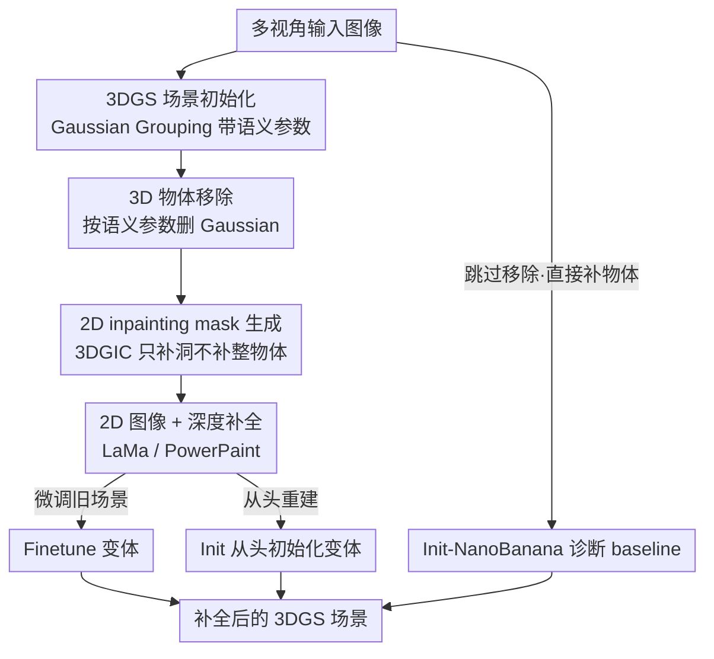

# Benchmarking Single-Step Inpainting Methods for Multi-Object 3D Gaussian Splatting Scenes

**会议**: CVPR2026  
**arXiv**: [2605.30987](https://arxiv.org/abs/2605.30987)  
**代码**: 无（论文未提供）  
**领域**: 3D视觉 / 3D Gaussian Splatting / 场景编辑与补全  
**关键词**: 3DGS inpainting、物体移除、single-step、多视角一致性、benchmark

## 一句话总结
这是一篇关于 **3D Gaussian Splatting 场景物体移除 + 补全** 的系统性 benchmark：作者把"每张图只 inpaint 一次"的 single-step 思路拆成 7 种 pipeline 变体，横向比较 LaMa / PowerPaint / Nano Banana 三种 2D inpainter 在 3D 里的表现，得出两个反直觉结论——**重建式 inpainter（LaMa）在 3D 一致性上反而打败生成式扩散模型**、**从头重建整个场景比微调旧场景质量更高**——并贡献了一个带真实拍摄 GT 的多物体遮挡场景 "Living Room"。

## 研究背景与动机
**领域现状**：NeRF / 3DGS 让静态场景的高精度重建变得容易，但一旦涉及场景编辑（删掉一个物体），就会在场景里留下一个"洞"。2D 里这是经典的 image inpainting 问题，但 3D 里多了一个硬约束——补出来的内容必须在所有相机视角下保持一致（multi-view consistency），否则换个视角就穿帮。

**现有痛点**：主流 3DGS inpainting 方法（如 3DGIC、Gaussian Grouping）走的是**迭代精修**路线——在场景优化过程中反复用 latent diffusion 对同一视角的 2D inpainting 结果做 cross-view 一致性约束。这条路复杂、慢，而且引入了 projection-based 的一致性损失。与此同时，2D inpainting 领域近两年突飞猛进（PowerPaint、Nano Banana 等），一个自然的问题是：**这些 SOTA 2D inpainter 单次产出的图，质量是不是已经好到可以直接拿去初始化 3D 场景，从而绕开迭代精修？**

**核心矛盾**：2D 视觉保真度（generative 模型强）与 3D 多视角一致性（要求各视角补出来的内容互相对得上）之间存在张力——生成式模型在每个视角会**幻觉出不同的细节**，这些细节在 3D 融合时互相打架变成模糊；而重建式模型（LaMa）产出平滑、少细节，反而更容易在 3D 里对齐。

**本文目标**：(1) 系统评测 single-step 方法把 2D inpainting 翻译到 3D 的效果；(2) 搞清楚"先删物体再补洞" vs "直接在物体上 inpaint"哪个对；(3) 补上 360° 场景缺真实 GT、缺遮挡难例的数据空白。

**核心 idea**：把 single-step 3DGS inpainting 分解成可控的 pipeline 变体（微调 / 从头初始化 × 不同 2D inpainter），用一套带真实 GT 的 benchmark 量化比较，并用一个"故意不删物体直接补"的诊断 baseline（Init-NanoBanana）反证 pipeline 中"先移除物体"这一步不可或缺。

## 方法详解

### 整体框架
论文把通用的 3D 场景 inpainting 流程拆成 5 个子任务，再在最后一步分叉出 3 种"场景补全"变体。整体是：输入多视角图像 → 用 Gaussian Grouping 建带语义参数的 3DGS 场景 → 借语义参数删掉目标物体 → 在洞处生成 inpainting mask → 用 2D inpainter 补 RGB 和深度图 → 用补好的图完成 3D 场景。最后这一步是全文的胜负手，分三条路：**微调旧场景**、**从头初始化新场景**、以及一个**故意省掉物体移除步骤**的诊断 baseline。命名记法为 `[Finetune | Init]-2DInpainter(参考视角数)`，例如 `FT-LM(3)` 表示用 LaMa 微调、3 个参考视角，`Init-PP` 表示用 PowerPaint 从头初始化。

### 关键设计

**1. Single-step 范式与 5 子任务 pipeline：把"补一次就够吗"这个问题做成可控实验**

现有 3DGIC 把同一视角反复送进 LDM 迭代精修，流程绕且引入 cross-view 投影损失。本文反其道而行，定义 **single-step**——每张图只用 2D inpainter 补一次，绝不迭代。为了让对比公平可控，作者把流程固定成 5 个子任务：Gaussian Grouping 建带语义参数的场景 → 用语义参数删物体的所有 Gaussian → 用 3DGIC 的方法对洞（而非整个物体）生成 inpainting mask → 用 2D inpainter 补 RGB 和深度 → 完成场景。关键的工程细节是 **mask 只覆盖"洞"而不是整个物体**，这样背景里已知的部分不会被重画；而 LaMa 经验上需要比洞**更大的 mask**，所以对它额外做了 dilation，并对 LaMa / PowerPaint / BrushNet 统一用同一套 mask 保证可比。这套固定 pipeline 让"换 2D inpainter""换补全方式"成为唯一变量，benchmark 的结论才站得住

**2. Finetune vs Init-from-scratch：从头重建反而打败微调**

最后一步的两条路是全文核心对照。**Finetune** 沿用 Gaussian Grouping / 3DGIC 的思路——冻结原场景已有 Gaussian、只在洞处新增并优化 Gaussian，参考视角用 masked $\mathcal{L}_1$ RGB 损失、非参考视角用 LPIPS 感知损失，并分 3 个参考视角和全部视角两档（`FT-2DInpainter(3)` / `(All)`）。**Init** 则是本文新提的做法：直接把所有视角补好的图当作输入，**重跑一遍 Gaussian Grouping 从头初始化整个场景**。直觉上从头重建更费时（要重跑一次 Gaussian Grouping），但实测它在大多数指标上反超微调——原因在于微调方法受困于深度表示：3DGIC 用"手动前景深度范围"能把洞的前景深度补得准，但代价是**背景 Gaussian 全被压到同一个平面**、深度错位；而从头初始化让整个场景的几何重新协商，背景保真和补全质量都更高。论文实测 Init 场景约 86 万个 Gaussian、Finetune 约 94 万个，前者更紧凑

**3. Init-NanoBanana 诊断 baseline：用"故意不删物体"反证移除步骤的必要性**

为了证明"先移除物体再补洞"这一步不能省，作者特意搭了一个对照组：用 Google 的 Nano Banana（Gemini 2.5 Flash Image）**直接在原图里把物体 inpaint 掉**——不做 3D 物体移除、不生成洞的 mask、不微调，只把补好的所有视角图喂给 Gaussian Grouping 跑一次。它的特点是单视角 2D 质量极高（masked 区域指标很有竞争力），但**完全没有 3D 感知**：物体背后的内容只能靠各视角幻觉，不同视角对不上。在多物体遮挡的 Living Room 场景里这个缺陷被放大——被移除物体背后的小物件（黑盒子、苹果、卷笔刀）在物体遮住它们的视角里直接消失，俯视才出现。这个 baseline 用反例说明：3D inpainting 必须**先在 3D 里移除物体、把"洞背后能从别的视角看到的信息"利用起来**，单纯靠 2D 生成补不出几何一致的背后内容

**4. Living Room 多物体遮挡场景：补上 360° 真实 GT 与遮挡难例的数据空白**

评测层面的贡献。已有数据集要么有真实 GT 但只是前向场景（SPIn-NeRF），要么是 360° 全角度但**只有合成 GT、没有真实拍摄 GT**（Mip-NeRF 360、InNeRF360）。本文录制了一个新的 360° 客厅场景：待移除物体是个明显比周围物件大的白色毛绒玩具，**大到能从很多视角完全遮住周围小物体**，构成困难遮挡难例；同时作者把玩具搬走后**重新拍摄了一遍真实场景**作为 ground truth，比合成 GT 更贴近现实。这个场景专门用来暴露"没有 3D 感知就会丢失被遮挡物体"的问题

### 损失函数 / 训练策略
微调变体的损失只在新增 Gaussian 上优化，原场景 Gaussian 冻结。重建损失按视角分两类：

$$\mathcal{L}_{recon}=\begin{cases}\mathcal{L}_1^{M}(I_{in}, I) & v\in V_{ref}\\ \mathcal{L}_{LPIPS}(I_{in}, I) & \text{otherwise}\end{cases}$$

其中 $V_{ref}$ 是参考视角集合，$\mathcal{L}_1^{M}$ 是 masked L1 损失，$I_{in}$ 是 2D 补好的图、$I$ 是当前 3D 场景投影回该视角的图。深度损失为 $\mathcal{L}_{depth}=\mathcal{L}_{L1}^{M}(I_{in}^{D}, I^{D})$。总损失 $\mathcal{L}=\mathcal{L}_{3D}+\mathcal{L}_{id}+\mathcal{L}_{recon}+\mathcal{L}_{depth}$，其中 $\mathcal{L}_{3D}$ 和 $\mathcal{L}_{id}$ 是 Gaussian Grouping 自带的两个损失。相比 3DGIC 作者**刻意简化**，去掉了基于投影的 cross-view 一致性损失（这也是作者承认自己 3D 质量不及 3DGIC 原文的原因之一）。

## 实验关键数据

### 主实验
在 bear（InNeRF360）、kitchen（Mip-NeRF 360）、新建 Living Room 三个场景上评测，指标含 PSNR / SSIM / LPIPS / FID 及各自的 masked 版本（m-*，只在补全区域内计算），下表为三场景平均：

| 方法 | PSNR ↑ | m-PSNR ↑ | SSIM ↑ | LPIPS ↓ | m-LPIPS ↓ | FID ↓ | 运行时间 |
|------|--------|----------|--------|---------|-----------|-------|----------|
| FT-LM (3) | 17.84 | 18.41 | 0.688 | 0.4136 | 0.0663 | 126.12 | 4h22min |
| FT-PP (3) | 16.43 | 17.84 | 0.6647 | 0.459 | 0.072 | 241.85 | 3h40min |
| FT-LM (All) | 18.76 | 19.59 | 0.7103 | 0.4016 | 0.0588 | 142.88 | 4h24min |
| FT-PP (All) | 15.35 | 18.01 | 0.5575 | 0.5392 | 0.0761 | 291.77 | 3h43min |
| **Init-LM** | **19.41** | 19.31 | **0.7301** | **0.3767** | **0.0556** | **117.88** | 5h22min |
| Init-PP | 19.68 | 19.44 | 0.7279 | 0.3814 | 0.0589 | 123.57 | 4h47min |
| Init-NB | 17.88 | **19.8** | 0.5865 | 0.4408 | 0.0575 | 131.86 | **1h27min** |

> 注：Init-PP 的 PSNR(19.68) 略高于 Init-LM(19.41)，但论文综合多数指标（SSIM/LPIPS/FID/masked）判定 **Init-LaMa 整体最优**；Init-NB 的 m-PSNR(19.8) 最高但整图指标差，体现"masked 区域锐利但物体背后失真"。

### 消融实验
| 配置 / 对照 | 关键现象 | 说明 |
|------|---------|------|
| Init vs Finetune | Init 系普遍优于 FT 系 | 从头重建背景保真和补全质量都更高，与 2D inpainter 无关 |
| LaMa vs PowerPaint | LaMa 系几乎全面胜出 | 生成式 PowerPaint 幻觉伪影多，2D 保真高但 3D 一致性差 |
| FT-LM(3) vs FT-LM(All) | All 更好（18.76 vs 17.84 PSNR） | 全视角 RGB 损失提升训练视角保真，但不保证跨视角一致 |
| FT-PP(3) vs FT-PP(All) | 反而 3 更好（16.43 vs 15.35） | 用 PowerPaint 时多视角损失反伤质量 |
| Init-NanoBanana | 整图指标差、masked 指标有竞争力 | 没 3D 感知，物体背后遮挡内容丢失 |
| BrushNet | 2D 结果极差，未进 3D 评测 | 主要训练目标是生成新前景物体，不适合"抹平背景" |

### 关键发现
- **重建式 > 生成式（在 3D 里）**：LaMa 这种平滑、少细节的重建式 inpainter，在 3D 多视角一致性上反而打败 PowerPaint / Nano Banana 这类高保真生成模型——因为生成模型每个视角幻觉的细节不同，融合到 3D 就互相打架变模糊。这是全文最反直觉的结论。
- **从头初始化 > 微调**：Init 系约 86 万 Gaussian、FT 系约 94 万；Init 更紧凑且质量更高，微调受困于"背景 Gaussian 被压到同一深度平面"的深度表示缺陷。
- **运行时间**：PowerPaint 平均 37 分钟补完一个场景的所有图，LaMa 要 71 分钟；Init-NB 只跑一次 Gaussian Grouping、不删物体不微调，最快（约 1.5 小时，但未含 Nano Banana 外部 API 时间）。测试硬件为 RTX 6000 Ada（48GB）。
- **遮挡难例致命**：Init-NanoBanana 在 Living Room 里，被遮住的小物体（黑盒子、苹果、卷笔刀）在遮挡视角下直接消失，俯视才出现——直接证明"先 3D 移除物体"的必要性。

## 亮点与洞察
- **反直觉的核心结论很有价值**：在"生成式模型横扫一切"的当下，作者用扎实的 benchmark 指出生成式 inpainter 的高 2D 保真在 3D 场景里是把双刃剑——视角间幻觉不一致反而拖累 3D 质量，平平无奇的 LaMa 因为"平滑、确定性强"成了更好的选择。这个洞察对做 3D 编辑的人有直接指导意义。
- **诊断 baseline 设计巧妙**：Init-NanoBanana 不是为了刷点，而是作为反例——故意省掉"3D 物体移除"这一步，用它的失败精准定位 pipeline 中哪一步不可或缺。这种"用消融式 baseline 证明 pipeline 结构合理性"的思路可迁移到任何多步 pipeline 的论文里。
- **真实拍摄 GT 的数据贡献**：360° 场景普遍只有合成 GT，作者把物体搬走重拍一遍得到真实 GT，并刻意构造"大物体遮住小物体"的难例，让评测能暴露 3D 感知缺失问题——这种数据集构造方式比单纯堆数量更有针对性。

## 局限与展望
- **作者承认的局限**：本文 3D 质量不及 3DGIC 原文，因为(1) 只做 single-step 每视角补一次、(2) 简化掉了 3DGIC 的 cross-view 一致性损失。这是为了"可控对比"主动付出的代价，但也意味着结论是在"简化设定"下成立的。
- **评测规模偏小**：只有 3 个场景（bear / kitchen / living room），且新场景只有 1 个，统计上略单薄；Living Room 只做了定性分析，没进主表的定量平均（用最近视角图当 GT 近似）。
- **Nano Banana 是闭源 API**：运行时间无法计入、prompt 需场景定制（论文附了三套手写 prompt），可复现性和公平性都打折扣。
- **改进思路**：可以把"Init-from-scratch + LaMa"和"3D 物体移除 + 适度的 cross-view 约束"结合，既保留从头重建的背景保真，又补上 single-step 缺失的一致性约束；也可探索"深度感知的 mask 生成"解决微调方法背景深度被压平的问题。

## 相关工作与启发
- **vs 3DGIC**：3DGIC 走迭代精修路线（同视角反复用 LDM 精修 + cross-view 投影损失），本文走 single-step（每视角只补一次 + 简化损失）。3DGIC 质量更高但流程复杂慢；本文牺牲一点质量换取可控的 benchmark 对比，并发现"从头初始化"这条 3DGIC 没探索的路反而更好。
- **vs Gaussian Grouping**：本文的 3D 物体移除和场景初始化都建在 Gaussian Grouping 的"带语义参数 Gaussian"之上，但把它从单纯的编辑工具扩展成 inpainting pipeline 的骨架，并对比了"微调既有场景"和"重跑 Gaussian Grouping 从头初始化"两种用法。
- **vs 2D inpainter（LaMa / PowerPaint / Nano Banana / BrushNet）**：这些都是 2D 方法，本文的贡献是系统评估它们"翻译到 3D"的能力——结论是 2D 强不等于 3D 强，重建式的 LaMa 因确定性平滑输出在 3D 里最稳，BrushNet 因偏向生成新前景物体直接不适合移除任务。

## 评分
- 新颖性: ⭐⭐⭐ benchmark 性质，无全新方法，但"重建式>生成式""从头>微调"两个反直觉结论和真实 GT 数据集有实在价值
- 实验充分度: ⭐⭐⭐ 7 种变体 × 多指标 × masked 评测较系统，但仅 3 场景、新场景只 1 个且只定性，规模偏小
- 写作质量: ⭐⭐⭐⭐ 问题定义清晰、记法统一、诊断 baseline 逻辑漂亮，结论可读性强
- 价值: ⭐⭐⭐⭐ 对做 3DGS 场景编辑的人有直接的"选哪个 inpainter / 用哪种补全方式"的实操指导

<!-- RELATED:START -->

## 相关论文

- [\[CVPR 2025\] IMFine: 3D Inpainting via Geometry-guided Multi-view Refinement](../../CVPR2025/3d_vision/imfine_3d_inpainting_via_geometry-guided_multi-view_refinement.md)
- [\[ICLR 2026\] Stylos: Multi-View 3D Stylization with Single-Forward Gaussian Splatting](../../ICLR2026/3d_vision/stylos_multi-view_3d_stylization_with_single-forward_gaussian_splatting.md)
- [\[CVPR 2026\] FastGS: Training 3D Gaussian Splatting in 100 Seconds](fastgs_training_3d_gaussian_splatting_in_100_seconds.md)
- [\[CVPR 2026\] Generalizable Human Gaussian Splatting via Multi-view Semantic Consistency](generalizable_human_gaussian_splatting_via_multi-view_semantic_consistency.md)
- [\[CVPR 2026\] 3D-Fixer: Coarse-to-Fine In-place Completion for 3D Scenes from a Single Image](3d-fixer_coarse-to-fine_in-place_completion_for_3d_scenes_from_a_single_image.md)

<!-- RELATED:END -->
