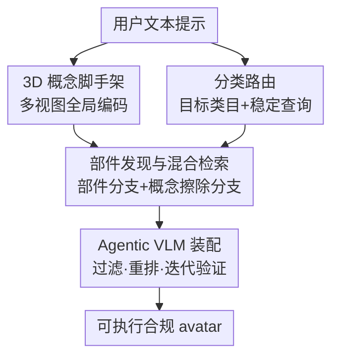

# CMAG: Concept-Scaffolded Retrieval for Marketplace Avatar Generation

**会议**: CVPR 2026  
**arXiv**: [2605.18680](https://arxiv.org/abs/2605.18680)  
**代码**: 无（Roblox 内部生产数据，未开源）  
**领域**: 3D视觉 / 检索式生成 / 多模态VLM / Agent  
**关键词**: 虚拟形象生成, 概念脚手架, 分类路由, 文本接地分割, 低秩概念擦除

## 一句话总结
针对"用一句话从市场目录里拼出一个合规 3D 虚拟形象"这个任务，CMAG 先用提示词生成一个粗糙的中间 3D 概念脚手架当作全局视觉先验，再配合分类路由、视图感知部件分割、低秩概念擦除检索和 agentic VLM 装配验证，把模糊文本对齐到平台分类体系下的离散资产，在 200 条复杂组合提示上把 Text-to-3D 对齐从 43.0 拉到 47.0。

## 研究背景与动机

**领域现状**：元宇宙平台（如 Roblox）是创作者驱动的市场——虚拟形象不是凭空生成的网格，而是从一堆"打了分类标签、受拓扑约束"的离散 3D 资产（上衣、裤子、鞋、配饰……）里挑选、拼装出来的。用户越来越希望像聊天一样描述需求（"赛博朋克街头风：黑卫衣 + 工装裤 + 战术耳机"），但平台又必须保证产物落在真实可售的目录资产上，以维持创作者经济。

**现有痛点**：两条主流路线都不够用。① 全生成式 text-to-3D 能快速出形象，但产出的是不受约束的网格／神经场，绕过了市场、破坏创作者激励，且不满足平台特定的拓扑、绑定、分类约束，**不可执行**。② 检索式拼装天然满足可执行性，但"纯文本"是用户意图与离散目录之间一座很不可靠的桥：市场元数据稀疏、口语化、多语种、风格各异，用户提示又含糊。

**核心矛盾**：自由语言到平台分类体系的映射**不是一对一**。一个"hoodie"可能对应 sweater 也可能对应 jacket，不同类目还共享重叠的文字描述。于是纯文本 embedding 检索经常返回"看着像、分类却错"的资产、漏掉必需部件、或者各类目独立检索导致风格／几何互不兼容。

**本文目标**：在保留市场经济与可执行性的前提下，同时解决三件事——(i) 语义到分类的对齐；(ii) 在遮挡与噪声元数据下稳健地抽取视觉证据；(iii) 平台拓扑约束下的跨类目兼容。

**切入角度**：作者借鉴传统 3D 工作流——艺术家总是先立一个全局概念稿，再细化各部件。由此提出**视觉上下文才是抗歧义检索缺失的那个信号**：与其只靠文本，不如先从提示词实例化一个粗糙的 3D 概念脚手架，它不是最终产物，而是提供轮廓、服装布局、配饰位置的全局视觉先验，给下游检索定调。

**核心 idea**：用一个"中间 3D 概念脚手架 + 分类路由 + 概念擦除检索 + VLM 验证"的多阶段 agentic 流水线，把纯文本资产搜索改造成 3D 感知的组合式装配。

## 方法详解

### 整体框架

CMAG 要解决的是"自由文本 → 平台合规离散资产组合"的检索装配问题。整条流水线是 coarse-to-fine 的五模块串联，但在工程上可归为四个有贡献的环节：先从提示词生成一个**3D 概念脚手架**并渲染多视图，拿到全局视觉 embedding；同时由**分类路由**把模糊概念扩展成"目标类目集合 + 每类稳定化的检索查询"，确保类目覆盖与拓扑一致；随后**视图感知部件发现 + 混合检索**对每个类目做检索——有可用部件 crop 时走"部件 embedding + 文本先验"的精确分支，部件证据不可靠时走"全局特征正交擦除非目标类目"的召回分支，两路取并集去重；最后由**agentic VLM** 对候选过滤、跨类目重排、组合装配，并跑迭代验证回环修补缺件／几何冲突，输出可执行 avatar。

### 关键设计

**1. 3D 概念脚手架：用一张粗糙 3D 草稿当全局视觉先验消歧**

这是本文的核心创新，针对的是"纯文本对离散目录映射不唯一、容易检索漂移"的痛点。给定提示词，CMAG 用 LoRA 微调的 Trellis text-to-3D 先合成一个带纹理的中间 3D 网格——注意它**不是最终输出**，只用来锚定全局外观线索（轮廓、粗略服装几何、配饰摆位）。接着对脚手架渲染**四个正交视图**，各自用 CLIP（ViT-B/16）图像编码器独立编码得到全局视图 embedding 集合 $\mathcal{G}=\{\mathbf{g}_v\}_{v\in\mathcal{V}}$。这里有个刻意设计：**不做跨视图池化／平均**，因为不同类目最佳可见视角不同（背部配饰从后视最清楚、面部配饰必须正视），平均会抹掉这种非对称可见性。这些全局 embedding 在缺乏精细视觉证据时充当"类目条件先验"，并为后续部件发现提供全局空间上下文——消融显示去掉脚手架后 Text-to-3D 对齐从 47.0 掉到 41.0

**2. 提示词条件分类路由：把"语义概念"对齐到"平台类目体系"**

纯靠 embedding 相似度检索的最大失败源是**分类不匹配**：一个概念可能对应多个合法类目，下游分割还可能整类漏掉。CMAG 在检索之前先跑一个提示词条件的分类路由 agent（GPT-5-mini 实现），输入提示词、目录分类体系和先验分解结果，输出两样东西：① 一个目标类目集合 $\mathcal{C}_p$，圈定"为满足提示且视觉完整必须检索哪些类目"；② 每个 $c\in\mathcal{C}_p$ 的检索查询 $q_c$，专门为 CLIP 隐空间对齐而构造——抽出关键名词再追加材质／颜色／风格主题等判别性修饰词。路由遵循两条原则：歧义时**保召回**（一个概念可能映射多个类目就全收，避免过早剔除合法资产）、互斥拓扑决策时**保一致**（jacket vs sweater 这类二选一时确定性地选拓扑一致的那个，防止下游几何穿插）。$q_c$ 同时也作为部件分割的稳定文本条件，消融去掉它对齐直接从 47.0 暴跌到 40.0，是掉点最狠的模块

**3. 视图感知部件发现 + 混合检索与低秩概念擦除：双路兜底地凑齐每个类目的高召回候选池**

虚拟形象描述天然是组合式的（"战术耳机""工装裤"），需要把连续文本意图映射到局部视觉证据。部件发现模块由三步组成：先用 VLM 把提示词分解成受目标分类约束的原子可分割短语；再按类目选最优观察视角（背部配饰用后视、腰部配饰用侧视）以压低假阴；最后在最优视图上做开放词表的文本接地分割（用 SAM 3），把类目 crop 过 CLIP 得到部件 embedding $\{\mathbf{p}_c\}$，分割失败则用更宽的分类关键词回退。

拿到部件证据后，检索引擎对每个路由类目建独立 FAISS 索引，并走两条分支取并集。**部件分支**在有有效 crop 时把局部视觉证据和文本先验线性融合 $\mathbf{q}^{\text{part}}_c=\alpha\,\mathbf{p}_c+(1-\alpha)\,\mathbf{t}_c$ 做精确检索。**概念擦除分支**用于部件发现失败兜底召回：对每个类目预先用 SVD 在目录 embedding 协方差上取 top-$r$ 主方向得到低秩投影矩阵 $\mathbf{P}_k$，推理时把全局视图特征 $\mathbf{g}$ 迭代正交化到所有非目标类目子空间的正交补，得到类目条件残差

$$\mathbf{r}_c\leftarrow\mathbf{g},\qquad \mathbf{r}_c\leftarrow\mathbf{r}_c-\mathbf{P}_k\,\mathbf{r}_c\quad\forall k\in\mathcal{C},\,k\neq c.$$

这一步主动**抑制对抗性的多概念噪声**——比如身体 bundle 检索时全局表征常被显眼的服装／配饰线索主导，正交掉别的类目方向后才能隔离出"身体专属"线索。再把残差与文本先验融合 $\mathbf{q}^{\text{cr}}_c=\beta\,\mathbf{r}_c+(1-\beta)\,\mathbf{t}_c$ 做高召回检索。两路结果按最大相似度去重、top-$K$ 截断，得到一个"过度包容、高召回"的缓冲池

**4. Agentic VLM 装配与迭代验证：把高召回候选拼成拓扑一致的可执行形象**

高召回池里仍混着错类目、风格不兼容、几何冲突的资产，需要 VLM 把关。每个类目的候选以缩略图网格呈现，先由 VLM 预过滤掉低质／meme 类（文字占满、不可穿戴的缩略图）；再把过滤后的网格连同渲染的概念稿和用户提示一起交给 VLM，让它每类**至多选一件**、以文本为先、概念稿当风格布局先验，拼出一套连贯 outfit。因为 2D 缩略图评估保证不了 3D 拓扑成功，CMAG 跑一个**迭代 VQA 回环**：把组合后的 avatar 渲染出来对照文本和概念稿评估对齐度、完整性、几何一致性（如网格穿插），不达标时 VLM 给出具体编辑（加缺件／删不合身件／同网格换件），重组重评直到满意或达到预设最大迭代次数。最后为避免重复输出，按每资产／每 bundle 使用次数上限生成多套候选，再用批量 VLM 比较逐轮淘汰，选出单一最佳 look

### 损失函数 / 训练策略

CMAG 本身不训练新网络，是个推理期 agentic 流水线：仅用 LoRA 微调 Trellis 生成概念脚手架，CLIP（ViT-B/16）、SAM 3 均用预训练权重，所有 agentic 组件（提示分解、分类路由、候选过滤、VQA 精修）由 GPT-5-mini 驱动，外部评测用 GPT-5.2。融合权重默认 $\alpha=\beta=0.7$；检索每类合并两分支后去重保 top-40 候选，视觉-语言门控 agent 再保留每类 top-20 语义正确且风格兼容的资产供装配。

## 实验关键数据

### 主实验

评测在 200 条复杂组合提示上进行，检索目录为含 **10 万件**创作者生成 3D 资产的生产级目录。对比两个 baseline：AVATAR-AGENT（SOTA 多 agent 形象生成）和语义检索 baseline（CLIP 文本+图像线性组合相似度搜索）。指标为 CLIPScore、Text-to-3D 对齐（GPT-5.2 当外部评委）和 Aesthetics。

| 方法 | CLIPScore ↑ | Text-to-3D 对齐 ↑ | Aesthetics ↑ |
|------|------|------|------|
| Semantic Retrieval | 30.2 | 33.9 | 79.0 |
| AVATAR-AGENT | 30.4 | 43.0 | 82.0 |
| **CMAG (Ours)** | **30.7** | **47.0** | **82.0** |

CMAG 三项指标整体最强。相对 AVATAR-AGENT，视觉质量相当（Aesthetics 同为 82.0），但 Text-to-3D 对齐从 43.0 提到 47.0；相对语义检索 baseline 差距更大，对齐从 33.9 拉到 47.0、Aesthetics 从 79.0 到 82.0。对齐提升说明 CMAG 更可靠地满足复杂提示属性与组合约束。

### 消融实验

| 配置 | CLIPScore | Text-to-3D 对齐 | Aesthetics | 说明 |
|------|------|------|------|------|
| w/o 分类路由 agent | 30.0 | 40.0 | 80.0 | 换成"每概念选单一最佳类目"的朴素策略 |
| w/o 3D 概念脚手架 | 30.2 | 41.0 | 81.0 | 关掉 prompt-to-3D，退化为纯文本检索 |
| w/o 特征抑制 | 30.5 | 43.0 | 82.0 | 身体类目用未正交化的融合全局 embedding |
| **CMAG (Full)** | **30.7** | **47.0** | **82.0** | 完整模型 |

### 关键发现

- **分类路由贡献最大**：去掉后 Text-to-3D 对齐从 47.0 暴跌到 40.0（掉 7 个点），同时出现错检 wing 类目、漏掉 halo 配饰、漏掉 neon 风格——印证"语义到分类对齐"是检索失败的首要源头。
- **概念脚手架是第二关键模块**：去掉后对齐掉到 41.0，纯文本检索在歧义下出现"检索漂移"——例子里把请求的"金发 + 黑耳机 + Lifestyle 衬衫 + 灰牛仔"错成"蓝耳机 + 黑夹克"。
- **特征抑制专治身体 bundle 检索**：去掉后对齐 43.0、CLIPScore 30.5，问题集中在身体 bundle 被显眼服装／配饰线索主导而选错身份；正交掉非目标类目方向后才隔离出身体专属线索。
- 三个指标里 **Text-to-3D 对齐对模块增删最敏感**，CLIPScore 区分度小（各方法都在 30.0–30.7 的窄带内），说明 CLIPScore 不足以衡量组合正确性。

## 亮点与洞察

- **"先立概念稿再拼件"把生成式先验和检索式合规性嫁接在一起**：脚手架只当一次性视觉先验、不当产物，既吃到了 text-to-3D 的全局消歧能力，又不破坏"产物必须是真实目录资产"的市场约束——是这篇最让人"啊哈"的折中。
- **拒绝多视图池化**这个细节很对：不同部件最佳可见视角不同，平均会抹掉非对称可见性，保留 per-view embedding 才能按类目挑视角，这个观察可迁移到任何"多视图特征 + 部件级任务"的场景。
- **低秩概念擦除当检索兜底**很巧：借鉴 IP-Composer／GLoCE 的子空间擦除思路，用 SVD 子空间正交化把"被强势类目噪声污染的全局特征"净化成目标类目残差，思路可迁移到"多概念检索互相干扰"的通用场景。
- **分类路由把歧义显式建模成"保召回 vs 保拓扑一致"两条规则**，比"选单一最佳类目"的朴素做法掉点少 7 个，提示检索式系统里"先做类目规划再检索"远比"直接检索"稳。

## 局限与展望

- 作者承认：当前 CLIP embedding 本质是 2D 的，把 3D 几何投到有限渲染视图会丢掉深度、关节、结构附着语义；CLIP 对渲染因素（尺度、姿态、背景）敏感，会给小件／遮挡资产引入检索噪声。
- 自己看到的局限：整条流水线**重度依赖闭源 GPT-5-mini／GPT-5.2** 当 agent 和评委，Text-to-3D 对齐又恰恰用 GPT-5.2 评，虽然作者声称"解耦生成与评测、减少自评偏差"，但生成端 agent 与评测端同源大模型，潜在评测偏好仍值得警惕 ⚠️。
- 评测规模偏小（200 提示、两个 baseline），且核心指标 CLIPScore 区分度低；缺少对脚手架质量、迭代验证轮数、检索召回率等中间环节的定量分析。
- 作者给的方向：发展 3D-native、视角鲁棒的表征，显式编码形象组合结构与附着语义（区分腰部 vs 背部配饰、预测部件间几何冲突），以替代 2D CLIP。

## 相关工作与启发

- **vs 全生成式 text-to-3D（DreamFusion / Trellis 等）**：它们直接从文本生成无约束网格，视觉保真高但不满足平台拓扑／分类约束、绕过市场；CMAG 只把生成式脚手架当中间先验，产物锁定为真实目录资产，牺牲一点生成自由度换可执行性与创作者经济。
- **vs AVATAR-AGENT**：同是多 agent 形象装配，但 CMAG 额外引入 3D 概念脚手架 + 分类感知检索 + 低秩概念擦除，显式针对"提示歧义下的语义-分类对齐"，Text-to-3D 对齐高 4 个点。
- **vs 纯语义检索 baseline**：后者只做 CLIP 文本+图像线性组合相似度搜索，在歧义提示下大幅漂移；CMAG 用脚手架视觉先验 + 路由 + 擦除把对齐从 33.9 拉到 47.0，差距最大。
- **vs IP-Composer / GLoCE（低秩概念操控）**：它们在扩散生成里做子空间擦除／合成，CMAG 把同样的低秩正交化思想搬到**检索**侧，用来净化全局 embedding 里的跨类目干扰，是个不错的跨任务迁移。

## 评分
- 新颖性: ⭐⭐⭐⭐ "3D 概念脚手架当检索视觉先验"是新颖且自洽的折中，单个组件多借鉴已有工作但组合方式针对市场约束很贴题
- 实验充分度: ⭐⭐⭐ 消融清楚指出三模块各自贡献，但 baseline 仅两个、提示 200 条、核心指标区分度低、且评测器与生成 agent 同源
- 写作质量: ⭐⭐⭐⭐ 动机链条清晰、五模块职责分明、公式与失败案例配图都到位
- 价值: ⭐⭐⭐⭐ 直击"创作者市场合规 + 自由文本控制"的真实工业痛点，落地性强（基于 Roblox 10 万资产生产目录）

<!-- RELATED:START -->

## 相关论文

- [\[AAAI 2026\] Open-World 3D Scene Graph Generation for Retrieval-Augmented Reasoning](../../AAAI2026/3d_vision/open-world_3d_scene_graph_generation_for_retrieval-augmented_reasoning.md)
- [\[CVPR 2026\] AvatarMix: Identity-Preserving Cross-Avatar Composition for Outfit Personalization](avatarmix_identity-preserving_cross-avatar_composition_for_outfit_personalizatio.md)
- [\[CVPR 2026\] UIKA: Fast Universal Head Avatar from Pose-Free Images](uika_fast_universal_head_avatar_from_pose-free_images.md)
- [\[CVPR 2026\] DINO Eats CLIP: Adapting Beyond Knowns for Open-set 3D Object Retrieval](dino_eats_clip_adapting_beyond_knowns_for_open-set_3d_object_retrieval.md)
- [\[CVPR 2026\] Hybrid eTFCE–GRF: Exact Cluster-Size Retrieval with Analytical p-Values for Voxel-Based Morphometry](hybrid_etfcegrf_exact_clustersize_retrieval_with_a.md)

<!-- RELATED:END -->
