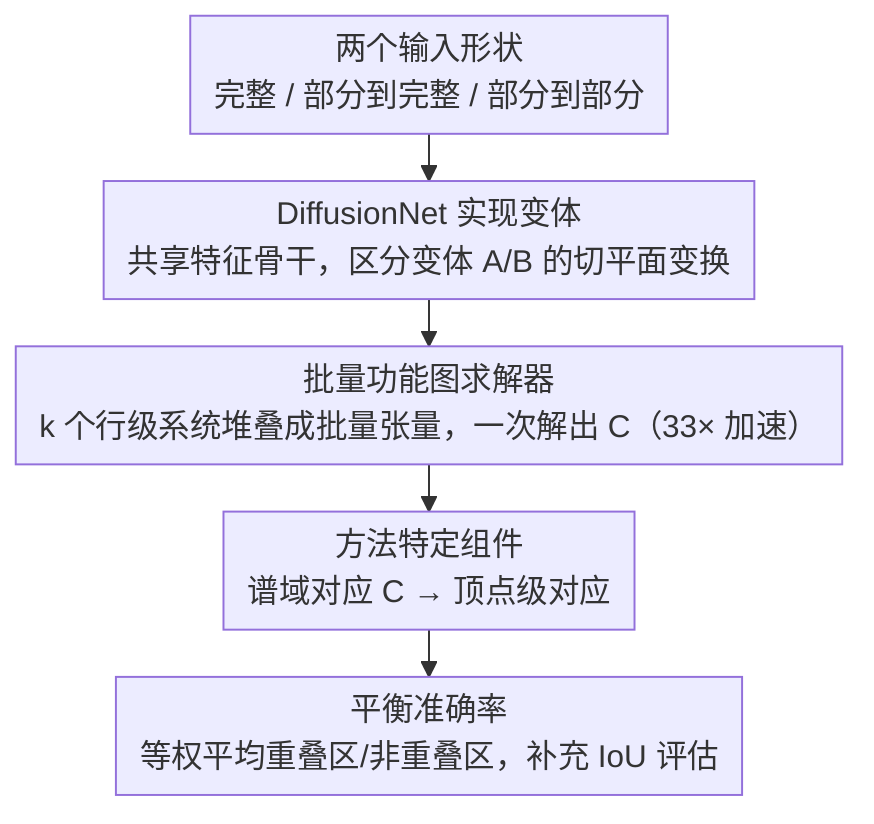

# DeepShapeMatchingKit: Accelerated Functional Map Solver and Shape Matching Pipelines Revisited

**会议**: CVPR 2026  
**arXiv**: [2604.10377](https://arxiv.org/abs/2604.10377)  
**代码**: [https://github.com/xieyizheng/DeepShapeMatchingKit](https://github.com/xieyizheng/DeepShapeMatchingKit)  
**领域**: 3D视觉/形状匹配  
**关键词**: 功能图, 形状匹配, 加速求解器, DiffusionNet, 开源工具包

## 一句话总结

本文提出了功能图求解器的向量化重构实现33倍加速，识别并记录了DiffusionNet的两个未记录实现变体，引入平衡准确率作为部分匹配评估的补充指标，并发布了统一的开源代码库。

## 研究背景与动机

**领域现状**：深度功能图方法是非刚性3D形状匹配的基础范式，结合学习的特征提取器和谱域对应求解器。但标准实现串行求解k个独立线性系统，在高谱分辨率下成为计算瓶颈。

**现有痛点**：(1) 功能图求解器的串行循环随k增大变慢；(2) DiffusionNet存在两个静默分歧的实现变体（参数化不同族的切平面变换），未被文献记录；(3) 部分匹配中IoU指标受重叠比影响，跨实例比较困难。

**核心矛盾**：在整合多个深度形状匹配方法到统一框架的过程中，发现了上述三个横跨效率、正确性和评估的问题。

**本文目标**：(1) 加速功能图求解器；(2) 记录DiffusionNet变体差异；(3) 改善部分匹配评估；(4) 发布统一开源代码库。

**切入角度**：通过重构数学形式将k个独立线性系统合并为单个批量张量求解。

**核心idea**：单次kernel调用求解所有系统，保持精确解的同时实现33倍加速。

## 方法详解

### 整体框架

这篇论文不是提出一个新的匹配方法，而是把多种深度功能图（deep functional map）pipeline 整合进同一套代码库时，顺手解决了三个横跨效率、正确性、评估的实践问题。一条典型 pipeline 是这样转的：两个形状各自过共享的特征骨干 DiffusionNet 提特征 → 把特征送进功能图求解器解出谱域对应矩阵 $C$ → 再由各方法特定的组件把 $C$ 转成顶点级对应。整套框架同时覆盖完整匹配、部分到完整、部分到部分三种设定。本文的三个贡献分别落在这条链路的求解器（加速）、特征骨干（变体歧义）和最终评估（指标）上。

### 关键设计

**1. 批量功能图求解器：把串行的 k 个线性系统合成一次批量求解**

痛点在求解器这一环：自 GeomFmaps 起，求解 $k\times k$ 的功能图 $C$ 的标准做法是把它**拆成 $k$ 个互相独立的行级最小二乘系统**，每一行 $c_i$ 单独解一个带 Laplacian 交换性正则的小线性方程，然后用一个 Python 循环串行解完 $k$ 行。随着谱分辨率 $k$ 越用越大（社区趋势是上调 $k$），这个串行循环就成了显著瓶颈。本文的观察很简单：这 $k$ 个系统虽然各自的正则项不同，但结构同构，可以堆叠成一个批量张量、用现代 GPU 的批量线性代数一次性解出来，

$$\{c_i\}_{i=1}^{k} \;=\; \texttt{batched\_solve}\big(\{M_i\}_{i=1}^{k},\,\{b_i\}_{i=1}^{k}\big)$$

得到的解与逐行串行解**逐元素完全一致**——这是数学等价的重构，不是近似。正因为单次 kernel 调用替掉了 $k$ 次串行调用，高 $k$ 下实测 33 倍加速。

> ⚠️ 行级最小二乘的具体矩阵形式以原文为准，此处仅示意"逐行独立系统 → 批量张量求解"的重构思路。

**2. DiffusionNet 实现变体：把两个被默默混用的特征计算口径摆到台面上**

问题出在特征骨干这一环。DiffusionNet 计算空间梯度特征时，要对学习到的缩放与旋转做处理，而这一步在不同实现里有两种细微不同的写法——本文称之为变体 A 和变体 B，二者实际上参数化了**不同族的切平面变换**。麻烦在于：不同论文各用其一却都没在文中明说，导致跨论文的结果不可直接比较、预训练 checkpoint 也互不兼容。本文把这两个变体显式记录下来并做了对照实验，让后续工作至少知道自己用的是哪一支、为什么和别人对不上。

**3. 平衡准确率：给部分匹配换一个不随重叠比漂移的评估口径**

问题落在评估这一环。部分到部分匹配常用 IoU 衡量重叠区域预测的好坏，但 IoU 对重叠比敏感——两个形状重叠得多时 IoU 天然偏高，于是不同重叠比的实例之间没法公平横比。本文借用不平衡分类里成熟的平衡准确率（balanced accuracy），对"重叠区"和"非重叠区"的预测质量**等权平均**，

$$\text{BalAcc} \;=\; \tfrac{1}{2}\big(\text{TPR} + \text{TNR}\big)$$

这样得到的分数基本独立于重叠比，可以跨实例直接比较。它不替代 IoU，而是作为补充指标一起报。

### 损失函数 / 训练策略

本文不改任何现有方法的训练目标：批量求解器是数学等价的重构，输出与原求解器逐元素相同，因此不影响训练结果；变体记录和平衡准确率也都只作用在评估侧。换句话说，这是一份"换实现、换评估口径，不换学习算法"的工作。

## 实验关键数据

### 主实验

| 谱分辨率k | 标准求解器(ms) | 批量求解器(ms) | 加速比 |
|----------|--------------|--------------|-------|
| 低k | 快 | 快 | ~1x |
| 中k | 中 | 快 | ~10x |
| 高k | 慢 | 快 | 33x |

### 消融实验

| 配置 | 关键发现 |
|------|---------|
| DiffusionNet变体A vs B | 不同变形设置下表现互补 |
| IoU vs 平衡准确率 | 平衡准确率对重叠比更不敏感 |

### 关键发现

- 33倍加速在高谱分辨率下最为显著，且保持精确解（非近似）
- DiffusionNet两个变体在不同基准上表现不同，选择需根据具体场景
- 平衡准确率确实提供了IoU无法提供的跨重叠比比较能力

## 亮点与洞察

- **"精确加速"而非近似加速**：重构后的解与原始完全一致，这是最理想的加速方式
- **社区贡献的实用性**：识别未记录的实现分歧并提供统一代码库，对整个形状匹配社区有直接价值
- **平衡准确率的引入**：从分类领域引入的简单而有效的补充指标

## 局限与展望

- 加速仅针对求解器本身，整个pipeline中其他瓶颈未处理
- DiffusionNet变体的理论分析有限
- 平衡准确率在极端重叠比下的行为需要更多研究

## 相关工作与启发

- **vs GeomFmaps**: 本文的批量求解器可作为GeomFmaps求解器的直接替代
- **vs Scalable Dense Maps**: 该方法用可微精炼替代显式求解器，牺牲了精度

## 评分

- 新颖性: ⭐⭐⭐ 工程优化为主，但影响深远
- 实验充分度: ⭐⭐⭐⭐ 多基准验证加速和变体分析
- 写作质量: ⭐⭐⭐⭐ 技术细节清晰
- 价值: ⭐⭐⭐⭐ 开源工具包的社区价值高

<!-- RELATED:START -->

## 相关论文

- [\[CVPR 2025\] Denoising Functional Maps: Diffusion Models for Shape Correspondence](../../CVPR2025/3d_vision/denoising_functional_maps_diffusion_models_for_shape_correspondence.md)
- [\[ICLR 2026\] Splat Feature Solver](../../ICLR2026/3d_vision/splat_feature_solver.md)
- [\[CVPR 2026\] FunREC: Reconstructing Functional 3D Scenes from Egocentric Interaction Videos](funrec_reconstructing_functional_3d_scenes_from_egocentric_interaction_videos.md)
- [\[CVPR 2026\] Unified Primitive Proxies for Structured Shape Completion](unified_primitive_proxies_for_structured_shape_completion.md)
- [\[CVPR 2026\] PromptStereo: Zero-Shot Stereo Matching via Structure and Motion Prompts](promptstereo_zero-shot_stereo_matching_via_structure_and_motion_prompts.md)

<!-- RELATED:END -->
