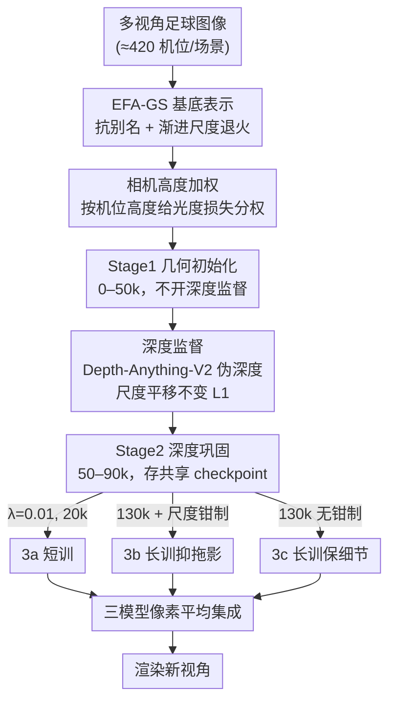

# DENSER: Depth-Guided Ensemble with Staged EFA-GS Reconstruction for Soccer Novel View Synthesis

**会议**: CVPR 2026  
**arXiv**: [2606.01419](https://arxiv.org/abs/2606.01419)  
**代码**: 无（SoccerNet-NVS challenge 数据见 https://github.com/SoccerNet/sn-nvs）  
**领域**: 3D视觉 / 新视角合成 / 高斯泼溅  
**关键词**: 高斯泼溅, 新视角合成, 单目深度监督, 模型集成, 足球转播

## 一句话总结
DENSER 把无别名高斯泼溅 EFA-GS 拿来打 SoccerNet 足球新视角合成挑战赛，加了「按相机高度加权 + 单目深度监督 + 三模型像素平均集成」三件套，在 5 个测试场景上拿到 PSNR 29.89 dB，比 3DGS 基线高 +3.15 dB。

## 研究背景与动机
**领域现状**：足球转播的新视角合成（NVS）要在一组真实机位的多视角图像上重建球场，再渲染任意虚拟机位。主流路线是 3D Gaussian Splatting (3DGS) 及其无别名改进版 Mip-Splatting / EFA-GS——用一堆 3D 高斯椭球表示场景，靠光度损失（photometric loss）拟合各视角图像。

**现有痛点**：足球场景对通用 3DGS 很不友好。其一，SoccerNet-NVS 的机位高度分布极不均衡——地面机位（转播最看重的视角）数量上被大量高空俯拍机位淹没，无约束训练会欠拟合这些地面视角；其二，球场含大片**无纹理区域**（草坪、天空、看台），光度损失在这些区域几乎没有梯度信号，高斯椭球摆放位置失控，容易产生漂浮物和颜色斑块；其三，单模型在长训练后会让少数高斯长成大椭球，投影成广告牌、边线上的彩色拖影（streak）。

**核心矛盾**：光度损失既是唯一信号又是不可靠信号——它在有纹理处够用，但在无纹理大区域和不均衡机位分布下会系统性失配，单靠它无法同时兼顾「地面视角质量」「无纹理几何」「抑制拖影」。

**本文目标**：在不改 EFA-GS 主干、不做逐场景调参的前提下，针对足球场景的这三个失配点各打一个补丁，并用集成把不同补丁的互补误差抵消掉。

**核心 idea**：用「相机高度加权」纠正机位偏置、用「单目深度监督」补无纹理区几何、用「从同一基底分叉出三个差异化模型做像素平均」把单模型的系统误差互相抵消。

## 方法详解

### 整体框架
DENSER 以 EFA-GS 为基底表示（EFA-GS 本身是 Mip-Splatting 的改进：用 3D 平滑核抗别名，再加「低频优先初始化 + 渐进尺度退火」消除漂浮高斯）。在此之上，整个 pipeline 是「**两个共享阶段打地基 + 三个分叉分支做微调 + 像素平均集成**」：先从零训 EFA-GS 建立粗几何（全程开相机高度加权），再引入深度监督巩固几何并存一个共享 checkpoint；从这个 checkpoint 分叉出三个训练时长/尺度约束各异的模型（3a/3b/3c），最后把三者各自渲染再像素平均得到最终结果。从同一基底分叉的好处是：三个成员共享同一套良好初始化的几何，但在后期误差上最大化差异，平均时能互相抵消各自独有的系统误差。

### 关键设计

**1. 相机高度加权：让训练别被高空机位带偏**

针对「地面机位被高空机位数量淹没、训练欠拟合最重要视角」这个偏置。每个场景约 420 个训练机位，按世界坐标系的 Y 值分成四个高度带（COLMAP 约定下 Y 越小物理位置越高）：地面（$Y>-5$）权重 5.0、边线（$-12<Y\le-5$）3.0、中段（$-20<Y\le-12$）3.0、高空（$Y\le-20$）1.0。给每个机位的光度损失乘上对应权重，让地面视角在总损失里占更大份额。关键细节是**权重按均值归一化**，使有效学习率不变——这样只改变各视角的相对重视程度，不会顺带把整体步长放大造成不稳定。

**2. 单目深度监督：给无纹理区补几何信号**

针对「草坪/天空/看台等无纹理区光度梯度太弱、高斯摆放失控」。作者用 Depth-Anything-V2-Large（ViT-L 编码器）离线生成每帧的单目伪深度图，从第 1000 次迭代起、每 5 次迭代施加一次**尺度平移不变 L1 损失**：

$$\mathcal{L}_{\text{depth}}=\lambda_{\text{depth}}\cdot\min_{s,t}\|s\cdot\hat{D}+t-D_{\text{gt}}\|_{1}$$

其中 $\hat{D}$ 是渲染深度、$D_{\text{gt}}$ 是伪深度。之所以要对 $s,t$ 取最小（即尺度 $s$、平移 $t$ 自由），是因为单目深度只有相对结构、没有绝对尺度（metric ambiguity），逐像素硬比绝对值会被尺度差异主导；让 $s,t$ 自由对齐后，损失只惩罚相对几何的不一致。这给无纹理大区域提供了光度损失给不出的梯度，把高斯锚定到正确的相对深度上。

**3. 两阶段共享 + 三分支分叉的分阶段训练：先打地基再制造差异**

这是把上述两个补丁按正确时序组织起来、并为集成准备差异化成员的调度策略。**Stage 1（0–50k）几何初始化**：从零训 EFA-GS，全程开相机高度加权，尺度退火让高斯初始 max scale 从 2.0 退到 1.0（先大块覆盖再逐步细化）；**此阶段故意不开深度监督**——对随机初始化的场景过早施加伪深度，会在光度信号还没建立粗几何前就把高斯锚到错误位置。**Stage 2（50–90k）深度巩固**：粗几何收敛后引入深度监督（$\lambda_{\text{depth}}=0.05$）纠正残余深度歧义，并在 50001–55000 做一轮致密化（梯度阈值 $\tau=0.0002$）填补深度信号暴露出的欠重建区，在 90k 存下三分支共用的 checkpoint。这种「先光度后深度」的顺序是本文反复强调的关键：深度监督是强信号，必须等粗几何立住了才能用，否则适得其反。

**4. 三分支差异化微调 + 像素平均集成：用互补误差互相抵消**

从 90k 的共享 checkpoint 分叉出三个误差画像互补的成员，再等权像素平均：

$$I_{\text{ens}}=\tfrac{1}{3}\bigl(I_{\text{3a}}+I_{\text{3b}}+I_{\text{3c}}\bigr)$$

**3a 短训（90–110k）**：再训 20k，降低深度权重到 $\lambda_{\text{depth}}=0.01$；因为 90001–97000 又做了一轮致密化（$\tau=0.0002$，最小不透明度 0.01）生出一批光度上还不成熟的新高斯，此时若深度信号太强会把它们锚到错位置，所以要调弱。**3b 长训 + 尺度钳制（90–130k）**：与 3a 同设置但延长到 130k，且在每个致密化步硬钳制高斯最大尺度为 2.0；不钳制的话，长训会让少数高斯长成细长椭球、投影成广告牌和边线上的彩色拖影。**3c 长训无钳制（90–130k）**：与 3b 完全相同但不钳制尺度——无约束的高斯能更忠实地拟合大片同质区域，代价是偶发拖影。于是 3b 和 3c 形成互补误差画像：平均二者既压住拖影、又保留无约束模型的重建质量；3a 则贡献被深度强正则、更干净的短训版本。像素平均降低各模型的逐像素噪声，并部分抵消各分支独有的系统误差。

### 损失函数 / 训练策略
总损失 = 光度损失（含 $\lambda_{\text{DSSIM}}=0.2$ 的 D-SSIM 项）+ 相机高度加权 + 分阶段的深度损失。优化器 Adam（$\epsilon=10^{-15}$），位置学习率 $1.6\times10^{-4}$，致密化百分比 0.01，球谐阶数 3，3D 平滑核 0.1，半分辨率（2048×1080）训练。所有五个场景用**完全相同**的 pipeline、无逐场景调参，单卡 NVIDIA A10G 24GB 训练。

## 实验关键数据

### 主实验
SoccerNet-NVS 挑战赛测试集，5 个 held-out 场景。基线数字由赛事方提供。

| 方法 | PSNR ↑ | SSIM ↑ | LPIPS ↓ |
|------|--------|--------|---------|
| 3DGS (baseline) | 26.74 | 0.750 | 0.410 |
| Triangle Splat (baseline) | 26.43 | 0.757 | 0.359 |
| **DENSER (Ours) Mean** | **29.885** | **0.7911** | 0.3656 |

逐场景结果（DENSER）：

| 场景 | PSNR ↑ | SSIM ↑ | LPIPS ↓ |
|------|--------|--------|---------|
| Scene 1 | 30.016 | 0.7819 | 0.3976 |
| Scene 2 | 29.742 | 0.8028 | 0.3476 |
| Scene 3 | 29.821 | 0.7866 | 0.3359 |
| Scene 4 | 29.514 | 0.8095 | 0.3591 |
| Scene 5 | 30.334 | 0.7747 | 0.3878 |

DENSER 平均 PSNR 比 3DGS 高 **+3.15 dB**、比 Triangle Splat 高 **+3.46 dB**，五个场景 SSIM 全面提升。LPIPS（0.366）比 Triangle Splat（0.359）略高——这是集成平均的常见 trade-off：平滑高频细节的同时抑制了结构性伪影。

### 消融实验
> ⚠️ 本文是挑战赛技术报告，正文**未给出逐组件的定量消融表**（如 w/o 深度监督、w/o 集成各掉多少分）。下表为根据正文设计动机整理的定性归因，非原文消融数据，定量结论以原文为准。

| 组件 | 作用 | 说明（定性） |
|------|------|------|
| 相机高度加权 | 纠正机位偏置 | 提升地面转播视角拟合质量 |
| 深度监督 | 补无纹理区几何 | 草坪/天空/看台等弱梯度区几何更稳 |
| 尺度钳制 (3b) | 抑制拖影 | 防止高斯长成细长椭球产生彩色拖影 |
| 三模型集成 | 抵消系统误差 | 3b 抑拖影、3c 保细节，平均取两者之长 |

### 关键发现
- 集成是质量与细节的取舍：像素平均显著抑制结构性伪影、抬升 PSNR/SSIM，但会平滑高频，导致 LPIPS 反而略逊于单模型基线 Triangle Splat。
- 深度监督的**时序**比有无更关键：Stage 1 故意不开深度、等粗几何立住后再在 Stage 2 引入，是为了防止伪深度在早期把高斯锚到错位置。
- 3b 与 3c 仅差「是否钳制尺度」却产生互补误差画像，是集成有效的根本原因——成员要「错得不一样」平均才有意义。

## 亮点与洞察
- **用「同基底分叉」造集成多样性**：不重新随机初始化三个模型，而是从同一 90k checkpoint 分叉，仅靠训练时长和尺度钳制制造差异。共享良好几何、只让后期误差发散，比独立训三个模型更省算力也更可控。
- **尺度平移不变深度损失是落地单目深度的关键 trick**：单目伪深度无绝对尺度，直接监督会被尺度差主导；对 $s,t$ 取 min 只罚相对结构，这个写法可直接迁移到任何「用单目深度正则化 3DGS」的场景。
- **把领域先验编码进损失权重**：相机高度加权本质是把「转播最看重地面视角」这个业务先验直接写进损失，且用均值归一化保持学习率不变——一个很轻量但对症的工程化设计。

## 局限性 / 可改进方向
- **无定量消融**：报告没给逐组件消融，无法判断三件套各自贡献多少、集成相对单模型的净增益有多大，难以指导取舍。
- **集成代价**：三个模型各自训练（其中两个训到 130k）再逐像素渲染平均，训练和推理成本约为单模型三倍，对实时转播渲染不友好。
- **LPIPS 退化**：集成平滑高频，感知细节反而比单模型基线差，说明「指标全面 SOTA」并未达成。
- **强依赖外部深度模型**：几何质量受 Depth-Anything-V2 伪深度质量制约，且伪深度需离线预生成，未端到端。
- 改进方向：把三分支蒸馏回单模型以省推理成本；或用可学习的集成权重替代等权平均，平衡 PSNR 与 LPIPS。

## 相关工作与启发
- **vs EFA-GS（基底）**：EFA-GS 解决的是通用场景的漂浮高斯问题（低频优先 + 尺度退火）；DENSER 在其上叠加足球场景专用的三件套（高度加权 / 深度监督 / 集成），是面向特定数据集的适配而非新表示。
- **vs 3DGS / Mip-Splatting**：3DGS 是基底范式，Mip-Splatting 加 3D 平滑核抗别名；DENSER 继承这条无别名路线，差异在于针对不均衡机位和无纹理区做了损失层面的补丁。
- **vs Triangle Splat**：同为本挑战赛基线，Triangle Splat LPIPS 更优（0.359）但 PSNR/SSIM 明显低于 DENSER；DENSER 用集成换取了结构指标的领先，代价是高频细节。

## 评分
- 新颖性: ⭐⭐⭐ 三个组件都是已有技术（高度加权、单目深度监督、像素平均集成）的针对性组合，工程价值高于方法创新。
- 实验充分度: ⭐⭐ 只有 5 场景主结果，无定量消融、无逐组件归因，作为挑战赛报告够用但科学性不足。
- 写作质量: ⭐⭐⭐⭐ 短小清晰，分阶段训练的时序动机讲得很透。
- 价值: ⭐⭐⭐ 对足球/体育转播 NVS 落地有直接参考价值，「同基底分叉集成」和「尺度平移不变深度损失」两个 trick 可复用。

<!-- RELATED:START -->

## 相关论文

- [\[CVPR 2026\] GeodesicNVS: Probability Density Geodesic Flow Matching for Novel View Synthesis](geodesicnvs_probability_density_geodesic_flow_matching_for_novel_view_synthesis.md)
- [\[CVPR 2026\] PR-IQA: Partial-Reference Image Quality Assessment for Diffusion-Based Novel View Synthesis](pr-iqa_partial-reference_image_quality_assessment_for_diffusion-based_novel_view.md)
- [\[CVPR 2026\] Splatent: Splatting Diffusion Latents for Novel View Synthesis](splatent_splatting_diffusion_latents_for_novel_view_synthesis.md)
- [\[CVPR 2026\] Physically Inspired Gaussian Splatting for HDR Novel View Synthesis](physically_inspired_gaussian_splatting_for_hdr_novel_view_synthesis.md)
- [\[CVPR 2026\] Cross-View Splatter: Feed-Forward View Synthesis with Georeferenced Images](cross-view_splatter_feed-forward_view_synthesis_with_georeferenced_images.md)

<!-- RELATED:END -->
