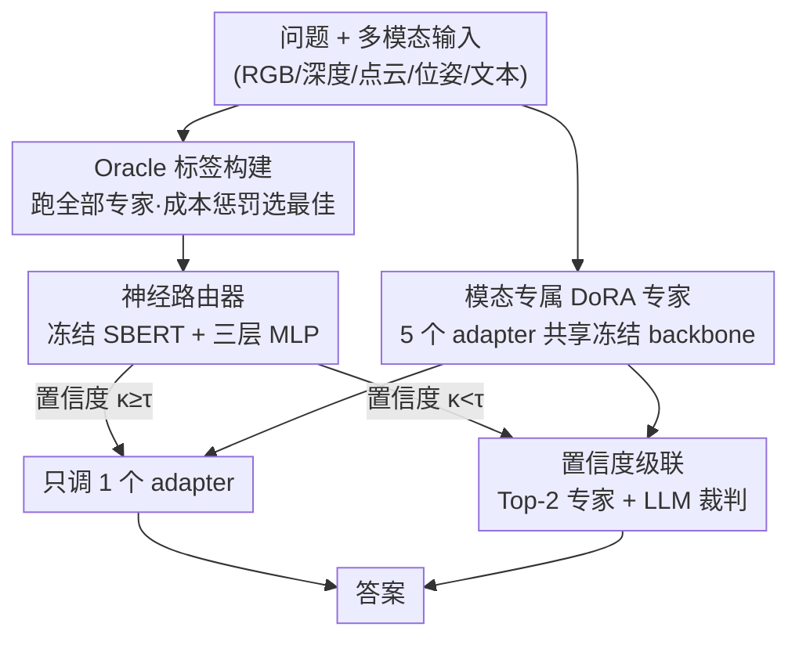

# MASER: Modality-Adaptive Specialist Routing for Embodied 3D Spatial Intelligence

**会议**: CVPR 2026 (FMEA Workshop)  
**arXiv**: [2606.02463](https://arxiv.org/abs/2606.02463)  
**代码**: 无  
**领域**: 3D视觉 / 具身智能 / 多模态VLM  
**关键词**: 模态路由, 具身3D VQA, DoRA adapter, MoE, 速度-精度权衡

## 一句话总结
针对具身 3D 问答里"不同问题最适合不同模态"的事实，MASER 给一个冻结的 VLM backbone 训练 5 个模态专属 DoRA adapter，再用一个轻量神经路由器（冻结 SBERT + 三层 MLP）根据问题文本选出最该激活的那一个 adapter，在 Open3D-VQA 上以**每问只调一次 adapter** 的代价拿到最低延迟（1.56 s/Q）和优于多数单模态 adapter 的精度。

## 研究背景与动机

**领域现状**：具身智能体在 3D 场景里回答空间问题（"那栋高楼在标牌左边吗？""20 米内有几辆车？"），输入天然是多模态混合——自然语言、RGB 图、点云、深度图、相机位姿。现有 VLM 通常只在**单一模态**上微调。

**现有痛点**：在单模态上微调，等于默认所有问题都该用同一种模态回答，这完全忽略了**问题语义本身可能更偏向另一种模态**。论文的实证发现戳破了"某一模态万能"的假设：在 Open3D-VQA 上，点云回答最优的占比也只有 51.5%，深度、文本、位姿、图像各占一块，没有任何单模态能覆盖全部。

**核心矛盾**：既然要多模态，最直接的两个极端都不行——把 5 个 adapter 全跑一遍再聚合，模态一多计算开销爆炸；随机挑一个 adapter 便宜但精度不稳。所以**真正缺的是一条"问题→最佳模态 adapter"的路由策略**，要在精度和成本之间找到可控的工作点。

**本文目标**：(1) 让一个共享 backbone 高效地"专才化"成 5 个模态专家；(2) 学一个轻量、只看问题就能选对模态的路由器；(3) 给出可调的速度-精度权衡。

**切入角度**：问题的措辞本身带有强烈的模态信号——问"距离/数量"偏几何（点云/深度），问"是什么/读文字"偏图像或文本。既然信号在问题文本里，那只用一个冻结句向量编码器就能把问题映射到模态分布，路由几乎不增加推理成本。

**核心 idea**：用"共享 backbone + 5 个模态 DoRA 专家 + 文本驱动的神经路由器 + 置信度级联"替代"单模态微调"，把多模态推理从"全跑或瞎猜"变成"按问题精准点名一个专家"。

## 方法详解

### 整体框架
MASER 是一条三阶段流水线：**先把一个冻结的 Qwen2-VL-2B backbone 训成 5 个模态专家（image / depth / pc / pose / text），再收集"哪个专家答对了"的 oracle 标签去训一个只看问题的神经路由器，最后推理时由路由器点名一个 adapter、低置信时才级联到第二个**。整条链路的关键是：5 个 adapter 共享同一份 backbone 权重，推理时只切换 DoRA 旁路，所以"多专家"几乎不增加显存；路由器又只吃问题文本，所以选模态这一步本身近乎免费。

### 关键设计

**1. 模态专属 DoRA 专家：用一份 backbone 养出五个专才**

痛点是单模态微调浪费了其它模态、而全量微调 5 个独立模型又太重。MASER 给冻结 backbone $f_\theta$ 训练 5 个独立的 DoRA adapter $\phi_m$（$m\in\mathcal{M}=\{\texttt{image},\texttt{depth},\texttt{pc},\texttt{pose},\texttt{text}\}$），每个 adapter 只加约 36M 可训练参数（约占 2B backbone 的 1.8%），推理时按需切换旁路、backbone 权重始终复用。为了让一个本是视觉-语言的 VLM 能"吃下"非图像模态，作者做了**模态工程**：图像 resize 到 $416\times416$ 直接进视觉编码器；点云被概括成一段结构化文本串，编码质心、点数和垂直跨度 $\Delta z$；原始深度图 min-max 归一化到 $[0,255]$ 再转成三通道灰度图喂给视觉编码器；位姿和文本不额外加工。选 DoRA 而非 LoRA/IA3，是因为它把权重拆成幅度和方向、收敛更稳，在作者的预实验里一致更优

**2. 成本惩罚的 Oracle 标签：教路由器"又准又快"地选模态**

要训路由器得先有监督信号——到底哪个模态对某个问题是"最佳"。作者在路由训练集（Open3D-VQA 的 15%）上对每个问题 $q_i$ **跑全部 5 个 adapter**，用一个混合裁判给每个回答打 0/1 分 $s_{i,m}=\text{Judge}(\hat a_{i,m},a_i^*)$（先精确匹配，失败再用 Qwen2.5-1.5B-Instruct 判语义等价）。但只看准确率会偏向慢的视觉专家，所以最佳模态被定义成**成本惩罚后**的赢家：

$$m_i^* = \arg\max_{m\in\mathcal{M}}\bigl(s_{i,m}-\lambda\cdot c_{i,m}\bigr),\quad \lambda=0.01$$

其中 $c_{i,m}$ 是 adapter $m$ 在问题 $i$ 上的延迟，$\lambda$ 调节精度-效率天平。这套标签直接暴露了"没有万能模态"——oracle 分布为点云 51.5%、文本 19.2%、位姿 15.2%、深度 7.9%、图像 6.2%，正是路由存在的理由。代价是这个惩罚项把慢的图像/深度专家系统性压低，后面会反噬端到端精度

**3. 文本驱动的神经路由器：只看问题就点名专家**

既然问题措辞已带模态信号，路由器就**只吃问题文本**、不碰场景输入，从而几乎零额外开销。流程是用冻结的 SBERT 句向量编码器把问题编成单位归一化的 384 维语义向量 $\mathbf{e}_i=\text{SentEnc}(q_i)\in\mathbb{R}^{384}$，再过一个三层 MLP 得到 5 个 adapter 的 logits：

$$g(\mathbf{e}_i)=W_3\,\sigma(W_2\,\sigma(W_1\mathbf{e}_i))$$

$\sigma$ 为 GELU，$W_1\in\mathbb{R}^{256\times384}$、$W_2\in\mathbb{R}^{64\times256}$、$W_3\in\mathbb{R}^{|\mathcal{M}|\times64}$，每层后接 Dropout（0.2 / 0.1），全部可训参数仅约 100K。因为 oracle 标签严重不均衡（点云占一半），训练用**类别加权交叉熵** $\mathcal{L}_{\text{router}}=-\sum_i w_{m_i^*}\log p_\theta(m_i^*\mid\mathbf{e}_i)$，权重 $w_m\propto N/(|\mathcal{M}|\cdot n_m)$ 补偿少数类。和 Random-Forest 词法特征基线对比，SBERT 语义向量是更好的路由特征：RF 训练 78.5%→测试 43.5% 严重过拟合，而 MLP 是 54.59%→51.33% 泛化稳定

**4. 置信度级联：低置信时才花第二次推理**

路由器有时也会犹豫，硬选一个可能出错。MASER 据此做**置信度级联**：取路由器最大概率作为置信度 $\kappa_i=\max_m p_\theta(m\mid\mathbf{e}_i)$，当 $\kappa_i\geq\tau$ 时只激活点名的那个 adapter $\hat m_i$；当 $\kappa_i<\tau$ 时同时激活 Top-2 专家、把两个回答交给 LLM 裁判仲裁。阈值 $\tau$ 在路由验证集上调。这样设计的本意是"绝大多数问题一次搞定、少数难题才付双倍代价"，但实测路由器过于自信（94% 的问题 $\kappa_i\geq\tau$），级联几乎不触发，端到端精度与纯 top-1 完全相同——这反过来说明 MLP 路由器很决断，也提示 $\tau$ 该调得更激进

## 实验关键数据

### 主实验

端到端 VQA（Open3D-VQA 测试集 15%，11,000 样本），JudgeAcc = 混合裁判准确率，Lat = 每问平均延迟，Adapters/Q = 每问平均 adapter 调用数：

| 方法 | JudgeAcc | Lat (s/Q) | Adapters/Q |
|------|----------|-----------|------------|
| Baseline VLM（无 adapter） | 39.0% | 1.88 | 0 |
| Image-only Adapter | **63.5%** | 1.64 | 1.0 |
| Depth-only Adapter | 54.0% | 1.58 | 1.0 |
| Text-only Adapter | 44.0% | 1.87 | 1.0 |
| Pointcloud-only Adapter | 44.0% | 1.88 | 1.0 |
| Pose-only Adapter | 40.0% | 1.68 | 1.0 |
| MASER router (top-1) | 47.0% | **1.56** | 1.0 |
| MASER + cascade | 47.0% | 1.57 | 1.0 |

MASER 拿到**最低延迟 1.56 s/Q**，精度（47.0%）超过文本、位姿、点云三个单模态 adapter，但**不及 Image-only 的 63.5%**——作者归因于图像 adapter 在冻结 VLM 上学到了密集空间信息，而 oracle 的成本惩罚又系统性地少给图像路由（只 11.5% 问题路由给图像，低于随机的 20%）。

### 消融实验

路由器对比（oracle 路由划分，Table 1）：

| 路由器 | Train Acc | Val/Test Acc |
|--------|-----------|--------------|
| Majority class (pc) | — | 51.5% |
| Random selection | — | 20.0% |
| RF（6 个词法特征） | 78.5% | 43.5% |
| MASER（MLP + SBERT） | 54.59% | **51.33%** |

逐类召回（Table 2，routing split）：

| 模态 | Support | Recall | F1 |
|------|---------|--------|-----|
| pc | 515 | 0.53 | 0.62 |
| text | 192 | **0.74** | 0.57 |
| pose | 152 | 0.53 | 0.40 |
| depth | 79 | **0.00** | 0.00 |
| image | 62 | 0.16 | 0.15 |
| 加权平均 | 1,000 | 0.51 | 0.50 |

### 关键发现
- **没有万能模态**：oracle 最佳模态分布最高的点云也只占 51.5%，这是整篇工作的实证基石，也是路由存在的根本理由。
- **语义向量 > 词法特征**：RF 用 6 个词法特征严重过拟合（78.5%→43.5%），MLP 用 SBERT 语义向量泛化稳定（54.59%→51.33%），证明问题语义才是更好的路由信号。
- **文本/位姿好路由、深度/图像难路由**：文本 0.74、位姿 0.53 召回，因为这类问题语言特征鲜明；而 depth 召回 0.00、image 0.16，说明只看问题文本无法判断"场景点云是否稀疏 / RGB 视角是否清晰"，这正是视觉模态被错判的根源，也是级联本想救场的地方。
- **级联几乎没触发**：路由器对 94% 的问题置信度就过阈，第二专家罕被调用，所以级联 JudgeAcc 与 top-1 持平。

## 亮点与洞察
- **"问题语义即模态先验"的实证**：第一次在高模态数的具身 3D VQA 上量化了"哪个模态最优"的分布，并证明它强可预测——这个观察本身比具体网络更有价值，可迁移到任何多传感器具身任务的调度。
- **成本写进监督信号**：把延迟 $\lambda\cdot c_{i,m}$ 直接塞进 oracle 标签定义，让路由器从训练起就"懂"速度-精度权衡，而不是事后再加规则——这是个可复用的 trick，但也带来副作用（系统性回避慢而准的图像专家）。
- **极致轻量的路由器**：冻结 SBERT + 100K 参数 MLP，路由开销近乎为零，却能逼近 oracle 一致性（51.33% vs 多数类 51.5%），说明"先专才化 backbone、再用小模型调度"是个高性价比的工程范式。
- **诚实的负结果**：作者明确承认精度不及 Image-only、级联没起作用，并把原因（成本惩罚压制图像、路由器只看文本）分析透——这种自洽的失败分析比刷点更有参考性。

## 局限与展望
- **路由器只看问题、看不见场景**：无法判断点云稀疏、RGB 视角好坏，导致视觉模态（depth/image）召回极低；作者提议给路由器加一个视觉特征编码器来消歧。
- **精度天花板被成本惩罚压住**：$\lambda$ 惩罚让 oracle 偏向便宜模态、系统性少路由给最强的图像 adapter，最终端到端精度被锁在 47%、明显低于 Image-only 的 63.5%——这是为追求低延迟付出的真实代价。⚠️ 也就是说当前 MASER 更像"延迟优先"工作点，而非全面 SOTA。
- **oracle 标签把模态和 adapter 质量混为一谈**：作者承认应把 oracle 标签定义成相对 base model 的提升，才能解耦"这个模态本身强"和"这个 adapter 训得好"。
- **样本与编码偏弱**：路由器只用 1,000 样本训练（为算力效率），扩到全量 10,998 样本预期更好；点云仅用质心/点数/$\Delta z$ 的粗糙数值描述，换成 PointBERT 等学习式 3D 编码器可能给出更丰富特征。
- **级联形同虚设**：$\tau$ 太松、94% 直接过阈，需要更激进或按场景特征自适应地调阈值才能真正发挥级联价值。

## 相关工作与启发
- **vs 单模态微调 VLM**：现有 VLM 在单一模态上 PEFT，默认所有问题用同一模态；MASER 用 5 个模态专家 + 路由器按问题选模态，优势是承认"模态偏好随问题变"，劣势是路由器只看文本时会错判视觉问题。
- **vs 全跑聚合 / 随机选择**：全跑 5 个 adapter 再聚合精度高但开销随模态线性增长；随机选便宜但只有 20% 一致性。MASER 居中——每问只 1.0 次 adapter 调用，路由一致性 51.33%，是成本可控的折中。
- **vs LoRAMoE / MoLoRA 等 LoRA-MoE**：这些方法在**单个模型内部**对 token 级别 gate 多个 LoRA 矩阵；MASER 是**样本级（按整个问题）**在 5 个模态 adapter 间路由，且 gate 信号来自外部冻结 SBERT 而非模型内部隐状态，路由解释性更强、训练更解耦。
- **vs DoRA / LoRA / IA3**：MASER 把 DoRA 当作模态专才化的底层手段（预实验里 DoRA > LoRA > IA3），创新点不在 PEFT 本身，而在"多个 PEFT 专家 + 文本路由 + 成本感知"的组合。

## 评分
- 新颖性: ⭐⭐⭐⭐ "问题语义即模态先验"的实证 + 成本写进 oracle 标签的组合很清新，但单个组件（DoRA/MoE 路由/SBERT）都现成。
- 实验充分度: ⭐⭐⭐ 单一基准 Open3D-VQA、路由器仅 1,000 样本训练、级联未真正生效，规模偏小（workshop paper）。
- 写作质量: ⭐⭐⭐⭐ 动机清晰、公式完整、负结果分析诚实自洽。
- 价值: ⭐⭐⭐⭐ 给"边缘机器人/实时 UAV 等延迟敏感场景"提供了一个低延迟可用的模态路由范式，思路可迁移。

<!-- RELATED:START -->

## 相关论文

- [\[CVPR 2026\] UniSplat: Learning 3D Representations for Spatial Intelligence from Unposed Multi-View Images](unisplat_3d_representations_unposed.md)
- [\[ICCV 2025\] Towards Scalable Spatial Intelligence via 2D-to-3D Data Lifting](../../ICCV2025/3d_vision/towards_scalable_spatial_intelligence_via_2d-to-3d_data_lifting.md)
- [\[CVPR 2026\] Wanderland: Geometrically Grounded Simulation for Open-World Embodied AI](wanderland_geometrically_grounded_simulation_for_open-world_embodied_ai.md)
- [\[CVPR 2026\] MSGNav: Unleashing the Power of Multi-modal 3D Scene Graph for Zero-Shot Embodied Navigation](msgnav_unleashing_the_power_of_multi-modal_3d_scene_graph_for_zero-shot_embodied.md)
- [\[CVPR 2026\] SPAN: Spatial-Projection Alignment for Monocular 3D Object Detection](span_spatial-projection_alignment_for_monocular_3d_object_detection.md)

<!-- RELATED:END -->
