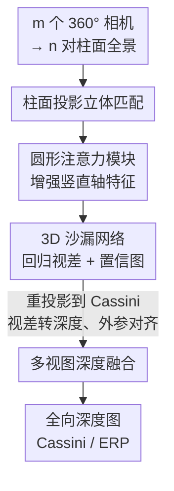

# MCPDepth: Practical Omnidirectional Depth Estimation from Multiple Cylindrical Panoramas via Stereo Matching

**会议**: CVPR 2026  
**arXiv**: [2408.01653](https://arxiv.org/abs/2408.01653)  
**代码**: https://github.com/Qjizhi/MCPDepth (有)  
**领域**: 3D视觉 / 全景深度估计 / 立体匹配  
**关键词**: 全景深度估计, 柱面投影, 立体匹配, 圆形注意力, 多视图融合

## 一句话总结
MCPDepth 把全景立体匹配从主流的球面/Cassini 投影换成**柱面投影**，配上一个只沿竖直轴算注意力的**圆形注意力模块**，在不用任何定制卷积核的前提下，于 Deep360 和 3D60 上把深度 MAE 分别降低 18.8% 和 19.9%，且能直接导出 ONNX 部署到嵌入式设备。

## 研究背景与动机

**领域现状**：全景（360°）深度估计是机器人感知和 3D 场景理解的关键，主流做法把全景图投影成 ERP（等距柱状）或 Cassini 投影，再用 CNN 做单目或立体深度估计。为了对抗投影带来的几何畸变，很多方法引入了定制卷积——可变形卷积、EquiConvs、球面卷积（SphereNet）等。

**现有痛点**：这些定制卷积有两个硬伤。一是**部署难**：球面卷积无法导出到 ONNX 这类通用格式，在 NVIDIA 平台要写 TensorRT 的 CUDA 插件，换个嵌入式设备又要重写，资源受限的机器人平台根本扛不动。二是**畸变重**：SOTA 方法 MODE 用的 Cassini 投影在两极附近畸变剧烈且不均匀，直接拉低深度图质量；而 SweepNet / OmniMVS 这类多视图鱼眼方案则受径向畸变和盲区拖累，球面代价体存在不连续。

**核心矛盾**：投影方式本身决定了畸变形态和能否用标准卷积，但**投影方法对特征提取和下游任务的影响一直没被系统研究**——大家默认在球面/Cassini 域里硬扛畸变，却没问过"是不是换个投影就能既减畸变又用回标准网络"。

**本文目标**：找到一种既保留线性对极几何（方便立体匹配）、又畸变小、还能用标准 2D 卷积（方便部署和迁移）的投影，并解决它残留的竖直方向畸变。

**切入角度**：作者系统对比了 ERP、Cassini、Cubic、Cylindrical 四种投影的对极几何、畸变分布与卷积兼容性，发现**柱面投影**恰好是甜点：水平方向无畸变、竖直方向均匀畸变、且视差定义与透视图完全一致。

**核心 idea**：用柱面投影替代球面/Cassini 投影做全景立体匹配，让透视图训练的标准立体网络直接迁移过来，再用轻量的竖直轴圆形注意力补掉残留的竖直畸变。

## 方法详解

### 整体框架

MCPDepth 是一个**两阶段框架**：先在多对柱面全景图上做立体匹配得到视差，再把多视图深度图鲁棒融合成最终的全向深度图。给定 $m$ 个 360° 相机（$m\geq 3$），可组成 $n=\binom{m}{2}$ 对已校正的柱面全景对；Deep360 用 $m=4,n=6$，3D60 用 $m=3,n=3$。

第一阶段（立体匹配）：每对柱面全景送入立体匹配网络，在特征提取和代价体之间插入圆形注意力模块增强特征，再经 3D 堆叠沙漏网络回归视差，同时输出置信图（取视差概率分布中最近三个假设的概率和）。视差图被重投影到 180° 水平 FoV 的 Cassini 域并转成深度图，用外参对齐到参考视图 $I^1_L$。第二阶段（深度融合）：把多视图深度图、置信图、参考全景一起送入两个 2D 编码器，再经单个带跳连的解码器融合，在 Cassini 域生成最终全向深度图（可转回 ERP）。融合阶段结构沿用 MODE。

### 关键设计

**1. 柱面投影做立体匹配：用对的投影从源头减畸变**

痛点是球面/Cassini 投影既畸变重又逼着用定制卷积。作者从对极几何和畸变两方面论证柱面投影最适合：柱面投影保留线性对极约束，且视差-深度关系与透视图完全一致，$\rho_l = \frac{B\cdot f}{|x_l - x_r|}$（$B$ 为基线，$f=R=H/2\pi$ 为柱面半径即焦距），而球面投影是角视差 $d=|\phi_l-\phi_r|$，关系非线性。更关键的是畸变形态：在柱面投影下水平方向像素位移 $\Delta u = \frac{f}{\rho}\Delta X$ 严格成立、竖直方向 $\Delta v \approx \frac{f}{\rho}\Delta Y$ 在物体不太大太远时近似成立，意味着物体外观**与其位置无关**（shift-invariant），这正是 CNN 高效学习的前提；反观球面投影中物体随 $\theta$ 轴位置变形，标准卷积失效。

这样换投影带来三重收益：视差定义与透视图一致 → 可直接复用 Scene Flow 上预训练的透视立体网络做迁移；只在竖直方向有残留畸变 → shift-invariance 更好；全程标准 2D 卷积 → 能导出 ONNX、无需 CUDA 插件，部署友好。实验也证实把 PSMNet/IGEV/CREStereo 的透视预训练权重直接喂柱面全景，比喂 Cassini 全景误差明显更低

**2. 圆形注意力模块：只沿竖直轴补回 360° 长程依赖**

柱面投影的唯一软肋是竖直轴残留畸变，而普通卷积感受野有限，吃不下 360° 竖直 FoV。全局自注意力虽能建长程依赖，但 $\mathcal{O}(h^2w^2)$ 的代价在全景分辨率下不可承受。作者把自注意力的感受野限制到一个 $1\times m$ 的局部竖直条带、**只沿竖直轴计算**，并加入相对位置编码：

$$y_o=\sum_{p\in\mathcal{N}_{1\times m}(o)}\text{softmax}_p\Big(q_o^Tk_p+q_o^Tr^q_{p-o}+k_p^Tr^k_{p-o}\Big)(v_p+r^v_{p-o})$$

其中 $r^q,r^k,r^v$ 是查询/键/值的可学习相对位置编码。这一限制把复杂度从 $\mathcal{O}(h^2w^2)$ 降到 $\mathcal{O}(hwm)$。Deep360 上特征图 $256\times128\times32$，跨度取 $m=256$ 以覆盖整条竖直轴，用 8 头各输出 $256\times128\times4$，拼接后经 $1\times1$ 卷积再与原特征逐元素相加。之所以有效：它精准对准柱面投影"畸变只在竖直方向"的特性，在最该补长程依赖的轴上扩大感受野，又因只算一维条带而几乎不增计算；且因保持输入维度，可即插即用到不同投影和不同立体网络上

**3. 两阶段框架与多视图深度融合：用置信度鲁棒地拼出全向深度**

单对全景视野和遮挡导致单/双视图深度不可靠，单个柱面全景水平 FoV 也不足 180°，至少要 3 个相机才能拼满 360°。框架因此先逐对匹配、再融合：第一阶段每对柱面全景输出视差和**置信图**（衡量视差可靠性，由视差假设概率分布中最近三个假设的概率和得到），重投影到 Cassini 域转深度并用外参对齐到参考视图；第二阶段把多视图深度、对应置信图和参考全景送入双 2D 编码器，再经单解码器逐尺度跳连融合。置信图让融合阶段知道每个视图哪里可信、哪里是盲区/遮挡（图中黑区），从而鲁棒地补全完整全向深度，避免鱼眼方案那种盲区不连续

### 损失函数 / 训练策略

立体匹配阶段用 $\ell_1$ 损失监督视差。置信图在推理时计算（最近三个视差假设的概率和），用于第二阶段融合。柱面/Cubic 的视差图泛化用最近邻插值、全景图泛化用双线性插值，均由球面输入推导得到。立体匹配阶段评测 Cassini 域中央水平 FoV $=2\arctan(\pi/2)\approx105°$ 的区域，融合阶段评测完整 360°×180° 全向深度图。

## 实验关键数据

数据集：Deep360（室外，4 相机水平方形排列，1024×512）、3D60（室内，3 相机竖直直角三角排列，512×256）。指标：立体匹配用 MAE/RMSE/Px1,3,5/D1；深度估计用 MAE/RMSE/AbsRel/SqRel/SILog/$\delta1,2,3$。

### 主实验

全向深度估计 SOTA 对比（Table 4，MAE/RMSE 越低越好，$\delta1$ 越高越好）：

| 数据集 | 方法 | 卷积类型 | MAE ↓ | RMSE ↓ | AbsRel ↓ | δ1% ↑ |
|--------|------|---------|-------|--------|----------|-------|
| Deep360 | UniFuse | 标准 | 3.9193 | 28.8475 | 0.0546 | 96.03 |
| Deep360 | MODE | 球面 | 3.2483 | 24.9391 | 0.0365 | 97.96 |
| Deep360 | **MCPDepth** | 标准 | **2.6384** | **21.6692** | **0.0304** | **98.26** |
| 3D60 | UniFuse | 标准 | 0.1868 | 0.3947 | 0.0799 | 93.29 |
| 3D60 | MODE | 球面 | 0.0713 | 0.2631 | 0.0224 | 99.13 |
| 3D60 | **MCPDepth** | 标准 | **0.0571** | **0.1903** | **0.0199** | **99.39** |

相比此前最好（MODE），Deep360 MAE 从 3.2483 → 2.6384（降 18.8%），3D60 MAE 从 0.0713 → 0.0571（降 19.9%），且 MCPDepth 用的是标准卷积而 MODE 用球面卷积。值得注意的是消融里 Ours+Cubic（MAE 5.0309）远差于 Ours（柱面，2.6384），印证柱面投影才是关键。

立体匹配 SOTA 对比（Table 3，Deep360）：MCPDepth（柱面+标准卷积）MAE 0.2112，优于 MODE（Cassini+球面卷积）0.2309、PSMNet 0.2703、360SD-Net 0.5262、AANet 0.3427。3D60 上 MCPDepth MAE 0.1773 同样优于 MODE 0.2258。

### 消融实验

投影方式（Table 5，视差误差）与圆形注意力（Table 6）：

| 配置 | MAE ↓ | Px1(%) ↓ | D1(%) ↓ | 说明 |
|------|-------|----------|---------|------|
| PSMNet · Cassini | 0.2703 | 3.3556 | 1.1708 | 球面域基线 |
| PSMNet · Cylindrical | 0.2179 | 2.6489 | 1.0236 | 仅换柱面投影 |
| PSMNet · Cylindrical + CA | 0.2112 | 2.5713 | 0.9828 | 完整模型 |
| IGEV · Cylindrical | 0.3278 | 4.7958 | 1.7276 | 换柱面投影 |
| IGEV · Cylindrical + CA | 0.2265 | 2.9581 | 1.1052 | 加圆形注意力 |
| MODE · Cassini + CA | 0.2210 | 2.7537 | 0.9881 | CA 跨投影也有效 |

### 关键发现
- **投影方式贡献最大**：PSMNet 仅把 Cassini 换成柱面投影，MAE 就从 0.2703 → 0.2179（降约 19%），是单项最大增益；圆形注意力再额外降到 0.2112。
- **圆形注意力跨投影、跨网络通用**：即便给 MODE 的 Cassini 球面方案加 CA，MAE 也从 0.2309 → 0.2210；给 IGEV 柱面方案加 CA，MAE 从 0.3278 大幅降到 0.2265，说明这个轻量模块普适。
- **柱面投影对迁移特别友好**：透视预训练的 CREStereo 直接测柱面全景 MAE 2.1241，远好于测 Cassini 的 4.6836，证明柱面投影保住了透视图的视差关系。

## 亮点与洞察
- **把"对抗畸变"问题转成"选对投影"问题**：与其在球面域里堆定制卷积硬扛畸变，不如换柱面投影从源头让畸变只剩竖直一维、且让标准网络可用——这是典型的"换坐标系把难题变简单"的思路，值得迁移到其他全景视觉任务。
- **圆形注意力是"按畸变形态定制感受野"的范例**：因为柱面投影畸变只在竖直方向，注意力就只沿竖直轴算，既补对了地方又把复杂度从 $\mathcal{O}(h^2w^2)$ 压到 $\mathcal{O}(hwm)$，是"先分析数据结构再设计模块"的好例子。
- **部署导向的研究价值**：坚持只用标准 2D 卷积、能导出 ONNX，直击机器人/嵌入式落地痛点，这类"为部署做减法"的取舍在偏理论的全景深度方向里少见且实用。

## 局限与展望
- **作者承认的局限**：柱面全景单个无法覆盖完整 180° 水平 FoV，因此至少需要 3 个相机才能拼满 360°，相机数与算力是个权衡；未来可探索优化柱面全景的水平 FoV。
- **自己发现的局限**：竖直方向仍有残留畸变，圆形注意力只是缓解而非消除；融合阶段直接沿用 MODE 结构，缺少对融合模块本身的设计创新。推理时间只在补充材料给出"与 MODE 相当"，正文没列具体数字，难以独立判断效率优势。
- **改进思路**：可探索可变 FoV 柱面或多柱面拼接以减少相机数；把圆形注意力推广到融合阶段或单目分支；在更多真实数据上验证（目前真实场景只有定性鱼眼结果）。

## 相关工作与启发
- **vs MODE**：两者都是两阶段（立体匹配 + 多视图融合），但 MODE 用 Cassini 投影 + 球面卷积，两极畸变重且无法导出 ONNX；MCPDepth 改用柱面投影 + 标准卷积，畸变更小、部署更友好，同等结构下 MAE 更低。
- **vs 360SD-Net / CSDNet**：它们是球面全景立体的早期端到端方案，依赖球面几何或 Mesh CNN 处理畸变；MCPDepth 用柱面投影直接复用透视立体网络，迁移性和精度都更好。
- **vs SweepNet / OmniMVS**：同为多视图，但用鱼眼图，受径向畸变和盲区导致深度不连续；MCPDepth 用柱面全景对 + 置信度融合，覆盖更完整。
- **vs Shimamura 等的柱面立体**：早期也用柱面全景做立体匹配，但靠拼接 12 张透视图、不用 CNN 也没分析柱面投影性质；MCPDepth 首次系统论证柱面投影优势并端到端训练。

## 评分
- 新颖性: ⭐⭐⭐⭐ 把全景立体匹配从球面/Cassini 系统性地转向柱面投影，并配套竖直轴圆形注意力，视角新颖且有理论支撑。
- 实验充分度: ⭐⭐⭐⭐ 两数据集、立体匹配与深度估计双任务、跨投影跨网络消融齐全，但真实场景仅定性、效率只在补充材料。
- 写作质量: ⭐⭐⭐⭐ 投影对比的理论分析（对极几何/畸变/部署）清晰有条理，公式与表格自洽。
- 价值: ⭐⭐⭐⭐ 标准卷积 + ONNX 可部署直击落地痛点，柱面投影思路对其他全景视觉任务有迁移价值。

<!-- RELATED:START -->

## 相关论文

- [\[CVPR 2025\] Helvipad: A Real-World Dataset for Omnidirectional Stereo Depth Estimation](../../CVPR2025/3d_vision/helvipad_a_real-world_dataset_for_omnidirectional_stereo_depth_estimation.md)
- [\[CVPR 2026\] Lite Any Stereo: Efficient Zero-Shot Stereo Matching](lite_any_stereo_efficient_zero-shot_stereo_matching.md)
- [\[CVPR 2026\] PIP-Stereo: Progressive Iterations Pruner for Iterative Optimization based Stereo Matching](pip-stereo_progressive_iterations_pruner_for_iterative_optimization_based_stereo.md)
- [\[AAAI 2026\] Cheating Stereo Matching in Full-Scale: Physical Adversarial Attack against Binocular Depth Estimation](../../AAAI2026/3d_vision/cheating_stereo_matching_in_full-scale_physical_adversarial_attack_against_binoc.md)
- [\[CVPR 2025\] DEFOM-Stereo: Depth Foundation Model Based Stereo Matching](../../CVPR2025/3d_vision/defom-stereo_depth_foundation_model_based_stereo_matching.md)

<!-- RELATED:END -->
