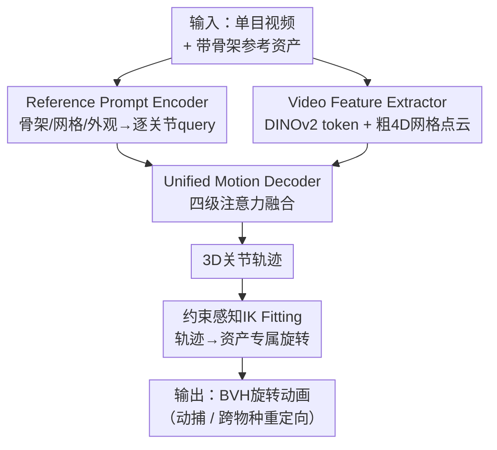

# MoCapAnything: Unified 3D Motion Capture for Arbitrary Skeletons from Monocular Videos

**会议**: CVPR2026  
**arXiv**: [2512.10881](https://arxiv.org/abs/2512.10881)  
**代码**: https://animotionlab.github.io/MoCapAnything/ (项目页)  
**领域**: 3D视觉 / 动作捕捉  
**关键词**: 类别无关动捕, 任意骨架, 单目视频, 逆向运动学, 跨物种重定向

## 一句话总结
给定一段单目视频和一个带骨架的任意 3D 资产（人/动物/机器人/玩具）作为 prompt，MoCapAnything 先预测逐关节的 3D 轨迹、再用约束感知的逆向运动学（IK）解出该资产自身骨架的旋转动画（如 BVH），从而在异构骨架间做到统一的动捕与跨物种重定向，在 Truebones Zoo 上把 unseen 物种的 MPJPE 从 7.42cm 压到 1.76cm。

## 研究背景与动机
**领域现状**：单目动作捕捉是内容创作的底座，但主流管线几乎都"绑死"在某一个物种/模板上。人体方向回归 SMPL/SMPL-X 系列参数（HMR、VIBE、HMR2.0 等），只在固定的人体拓扑里好用；动物方向多基于 SMAL，仅覆盖少数四足类；类别无关关键点检测（CAPE）虽能用支持样例泛化到新类别，但只产出 2D 静态关键点，离"可直接驱动资产的 3D 动画"还差很远。

**现有痛点**：真实生产里创作者需要把人/动物的动作重定向到非生物骨架（机器人、机甲、玩具、铰接道具）、批量驱动游戏里大量异构资产、给频繁换拓扑的虚拟形象/VTuber 做动画、为 IP 角色快速起骨架——这些都要求"换一个资产就能用"，而现有方法每碰到一个新物种几乎都要重建一套参数化模型。

**核心矛盾**：旋转是定义在资产局部坐标系里的量，不同资产的 rest pose 各异，**直接跨异构骨架回归关节角度非常脆弱**；单目证据本身欠约束（深度与相机运动会把局部旋转纠缠在一起）；而且密集 RGB 特征与"点云式"的关节空间之间存在模态鸿沟，硬对齐会掉精度。

**本文目标**：形式化一个新任务 CAMoCap（Category-Agnostic Motion Capture）——输入单目视频 $V=\{I_t\}_{t=1}^T$ 与任意带骨架资产 $A=(\mathcal{M},\mathcal{S},\mathcal{I}_A)$，输出能直接驱动 $A$ 的逐帧关节旋转序列 $\{\mathbf{R}_t\}$，其中 $R_{t,j}\in\mathrm{SO}(3)$。

**核心 idea**：与其直接回归各资产相关的旋转，不如把动作恢复**因式分解**为"先估计与资产无关、几何上更可学的 3D 关节轨迹，再用轻量 IK 把轨迹翻译成各资产自己的旋转"，并引入**参考 prompt** 注入目标骨架信息、引入**粗 4D 网格**作为辅助模态来弥合 RGB 与关节空间的鸿沟。

## 方法详解

### 整体框架
MoCapAnything 是一个 reference-guided、因式分解的框架：输入是"单目视频 + 一个带骨架的参考资产（网格/骨架/外观图集）"，输出是该资产自身 rig 约定下的旋转动画。它的关键决策是把问题**拆成两半**——前半段三个可学习模块协同预测 3D 关节轨迹 $\{\widehat{\mathbf{x}}_{t,j}\}$，后半段一个无需训练的轻量 IK 阶段把轨迹解算成旋转 $\{R_{t,j}\}$。轨迹是几何量、跨骨架可共享、时序上连续，所以比直接回归角度稳得多；旋转则交给尊重层级、骨长、关节限位与时序平滑的 IK 收尾。

具体地，参考资产先经 **Reference Prompt Encoder** 蒸馏成逐关节 query；视频经 **Video Feature Extractor** 抽出 DINOv2 视觉 token 和一段粗 4D 形变网格点云；二者送入 **Unified Motion Decoder**，用多分支注意力融合结构/视觉/几何线索，逐帧输出 3D 关节坐标；最后 **IK Fitting** 把坐标转成资产专属旋转。因为参考资产和视频主体可以相同也可以不同，这个管线天然同时支持动捕（同骨架）和重定向（异骨架）。

### 关键设计

**1. Reference Prompt Encoder：把任意资产蒸馏成逐关节 query，注入目标骨架先验**

痛点是"模型怎么知道要预测的是哪套骨架"。该编码器把参考资产的三种模态融成逐关节 query $Q=\{\mathbf{q}_j\}_{j\in\mathcal{J}}$：每个关节 $j$ 先由坐标的正弦位置编码加可选关节名嵌入得到初始 query $\mathbf{q}_j^{(0)}=\mathbf{W}_p[\mathrm{pe}(\mathbf{x}_j);\mathbf{e}_{\text{name}}(\ell(j))]+\mathbf{b}_p$，再过 $L$ 个融合块，每块依次做三件事：(i) 带**骨架拓扑偏置**的图多头自注意力（Graph-MHA），即 $\mathrm{Attn}(\mathbf{q}_i,\mathbf{q}_j)\propto \tfrac{\langle\mathbf{W}_Q\mathbf{q}_i,\mathbf{W}_K\mathbf{q}_j\rangle}{\sqrt d}+\mathbf{B}_{ij}$，其中 $\mathbf{B}_{ij}=f_{\text{topo}}(\mathcal{E},i,j)$ 由骨架边与运动学距离算出，让消息沿运动学树传播（沿用 AnyTop）；(ii) 对网格采样点 $\{\mathbf{g}_u\}$ 做交叉注意力，学习关节与局部表面几何的隐式 skinning 关系；(iii) 对外观图集的冻结 DINOv2 token 做交叉注意力，用外观线索消解对称/相似部件的歧义。关节数可变靠二值 mask $\mathbf{m}$ 把 padding 关节在所有注意力里清零，从而对绝对关节数不变。这样一个编码器就能给"任意拓扑"产出结构感知的 prompt

**2. Video Feature Extractor：用粗 4D 形变网格弥合 RGB 与点云式关节空间的模态鸿沟**

直接拿密集 RGB token 去回归点云式的关节，会因模态不匹配而掉精度。作者给视频开两条互补的流：视觉流用冻结 DINOv2 对每帧编码出密集 token $\mathbf{A}_t$ 作为外观/纹理线索；几何流用现成的 image-to-3D 重建器把视频转成一段粗糙的形变表面序列 $\widehat{\mathcal{M}}=\{\widehat{\mathcal{M}}_t\}$，每帧随机下采到 $U=1024$ 个点 $(\mathbf{p}_{t,u},\mathbf{n}_{t,u})$，嵌成 $\mathbf{g}_{t,u}=\mathbf{W}_m[\mathrm{pe}(\mathbf{p}_{t,u});\mathbf{n}_{t,u};\mathrm{pe}(t)]$。这段 4D 网格点 token 与 Reference Prompt Encoder 里的网格特征同构，天然带拓扑/几何信号、形态上又贴近关节的点云结构，于是充当 RGB 与关节空间之间的"中间桥"，稳定并提升后续 3D 关键点估计——消融里去掉 mesh 在 unseen 上 MPJPE 从 1.76 升到 3.16，是掉点最狠的一项

**3. Unified Motion Decoder：四级注意力把结构/视觉/几何线索融成时序连贯轨迹**

把 query、骨架、视频特征喂进来后，需要既尊重运动学树、又利用视频外观、还要消歧深度并保证时序平滑。解码器把逐关节 query 沿时间 tile、加时序编码、配 mask，每层顺序跑四级注意力：(i) **帧内图自注意力**——带 $\mathcal{E}$ 的拓扑偏置，让更新遵循运动学树和局部肢体耦合；(ii) **时序视频交叉注意力**——对每个关节在邻帧滑窗里取视觉 token，补遮挡/运动模糊下的细节、稳住快速运动；(iii) **时序点云交叉注意力**——从对应的 4D 网格滑窗聚合几何证据，消解深度与自遮挡、捕捉非刚性形变；(iv) **逐关节时序自注意力**——沿时间轴混合每个关节的过去/未来状态，强制长程一致、抑制抖动。堆 $L$ 层后由轻量 MLP 头输出逐帧关节坐标 $\widehat{\mathbf{x}}_{t,j}\in\mathbb{R}^3$。四级的分工正好对应"结构对齐 + 外观补全 + 几何消歧 + 时序去抖"四类需求

**4. 约束感知 IK Fitting：无需训练地把轨迹翻译成各资产自己的旋转**

因式分解的后半段——这一步实现了"轨迹→旋转"的翻译，也是 CAMoCap 能跨异构骨架的关键。它分两阶段：先做逐帧**几何 IK 初始化**，沿每条运动学链把 rest-pose 骨向与观测到的关节位置对齐，闭式地给出尊重层级的稳定旋转估计；再用一个小型**可微 IK 优化**精修，最小化 FK 重建关节与预测 3D 位置的差异、同时把解正则化到几何初始化附近，并用上一帧 warm-start 来保证时序稳定、抑制多余 twist。整套混合策略以极低算力产出准确又平滑的旋转，且因为只依赖目标资产自己的骨长/层级/限位，换任何 rig 都直接出该 rig 约定下的动画

### 损失函数 / 训练策略
训练只监督解码器的关节位置，用 mask 的 L1 位置回归损失：把所有序列 pad 到 $|\mathcal{J}_{\max}|$ 个关节、用有效性 mask $m_j$ 屏蔽 padding，
$$\mathcal{L}_{\text{pos}}=\frac{1}{\sum_{t}\sum_j m_j}\sum_{t=1}^{T}\sum_j m_j\,\big\|\widehat{\mathbf{x}}_{t,j}-\mathbf{x}_{t,j}\big\|_1.$$
训练阶段**不施加旋转空间损失，也不加显式时序损失**——网络只预测关节位置，旋转完全交给之后的 IK 阶段恢复。训练数据为 Truebones Zoo 1,038 段中划出的 978 段（外加 1000 个 Objaverse 随机样本支持类人 rig），骨架配置选了平衡的 4 编码层 / 12 解码层。

## 实验关键数据

### 主实验
在 Truebones Zoo-test（60 段，按训练数据量分成 Seen / Rare / Unseen 三档）上评 3D 关键点。所有 baseline 都在同一训练集、统一骨架表示下重训，指标单位 cm，越低越好。

| 物种档位 | 指标 | 本文 | GLoT(次优) | VIBE | ViTPose |
|--------|------|------|----------|------|---------|
| Seen | MPJPE ↓ | **1.06** | 3.98 | 4.46 | 9.19 |
| Seen | MPJVE ↓ | **0.44** | 1.37 | 0.83 | 1.73 |
| Rare | MPJPE ↓ | **1.28** | 3.58 | 4.03 | 9.33 |
| Unseen | MPJPE ↓ | **1.76** | 7.42 | 8.72 | 23.37 |
| Unseen | MPJVE ↓ | **0.36** | 2.18 | 0.95 | 2.15 |

本文在三档上全面领先，且越是 unseen 物种领先越夸张：MPJPE 从次优 GLoT 的 7.42 压到 1.76（降约 76%），说明类别无关设计在新物种上的泛化是结构性优势而非过拟合训练集。

### 消融实验
| 配置 | Seen MPJPE | Rare MPJPE | Unseen MPJPE | 说明 |
|------|-----------|-----------|-------------|------|
| Full model | 1.06 | 1.28 | 1.76 | 完整模型 |
| w/o image | 1.34 | 1.56 | 2.85 | 去外观图集编码 + 交叉注意力 |
| w/o mesh | 1.88 | 2.25 | 3.16 | 去参考与视频两侧的网格特征 |
| w/o GMHA | 1.08 | 1.49 | 1.82 | 去骨架图多头注意力 |

层数配置消融（编码/解码层）：Variant1(1/12) unseen MPJPE 2.18、Variant2(2/12) 2.00、Variant3(4/16) 1.85、本文(4/12) 1.76——加深大体提升，但 Variant3 用更多算力在 rare/unseen 上收益有限，故选 4/12 的平衡配置。

### 关键发现
- **mesh 分支贡献最大**：去掉网格特征在 unseen 上从 1.76 涨到 3.16，是掉点最狠的一项，印证"4D 网格桥接模态鸿沟"是泛化到新物种的核心。
- **外观与图注意力主要救 rare/unseen**：w/o image 与 w/o GMHA 在 seen 上几乎不掉（1.06→1.34 / 1.08），但在 unseen 上明显变差，说明显式拓扑与外观线索是稀缺物种的"救命稻草"。
- **加深有收益但边际递减**：解码层从 1 加到 12 在 unseen 上 2.18→1.76，再把编码加到 4/16 反而略劣于 4/12，模型容量够用即可。

## 亮点与洞察
- **因式分解是稳训核心**：把"脆弱的跨资产旋转回归"换成"几何可共享的 3D 轨迹回归 + 无训练 IK 解旋转"，既绕开了 rest-pose 各异导致的角度 ill-posed，又让一个模型天然兼容动捕与重定向——这套思路可迁移到任何"目标参数定义在局部坐标系、但中间量是全局几何"的回归问题。
- **把粗 4D 网格当"模态桥"很巧**：不直接拿 RGB token 硬怼关节，而是先重建一段廉价的形变点云，让点云结构去贴近关节的点云本质，消融证明这是泛化到新物种的最大功臣。
- **逐关节 query + mask 实现"任意骨架一个模型"**：用二值 mask 屏蔽 padding 关节，使模型对绝对关节数不变，这是它能 prompt 任意 rig 的工程关键，可复用于任何变长结构（如不同原子数的分子、不同节点的图）。

## 局限与展望
- **依赖现成 4D 重建器质量**：几何流来自预训练 image-to-3D 重建器，定量评测时为避免干扰用的是 GT mesh 算关节位置，可视化才用预测 mesh——真实 in-the-wild 下重建网格的质量会直接影响精度，论文未给"预测 mesh 下的定量数"。
- **正文只评 3D 关键点、旋转评测搬去附录**：IK 后的旋转级误差只在补充材料里，正文无表，旋转动画的定量质量读者无法从主文判断。⚠️ 旋转端的量化对得上与否以原文补充材料为准。
- **测试集偏小**：test 仅 60 段，且 Truebones Zoo 以动物为主，类人/非生物 rig 的定量评测主要靠 Objaverse 的定性展示，跨域重定向尚缺系统性数字。
- **可改进**：把 IK 做成端到端可微并联合训练旋转损失，或引入物理/接触约束，或许能进一步压低 jitter 并给出可信的旋转级指标。

## 相关工作与启发
- **vs SMPL/SMPL-X 系人体动捕（HMR、VIBE、HMR2.0）**: 它们回归固定人体模板的参数，换物种就失效；本文不绑模板、用参考 prompt + 轨迹因式分解兼容任意骨架，代价是放弃了人体先验带来的强约束。
- **vs SMAL 系动物动捕**: SMAL 是物种特定的参数化四足模型，只覆盖少数类别；本文不需为每个物种建参数模型，靠骨架/网格/外观 prompt 即可泛化。
- **vs CAPE（POMNet、CapeFormer、Pose Anything、CapeX）**: CAPE 同样追求类别无关，但停在 2D 静态关键点；本文把它推进到 3D 轨迹 + 时序一致 + 可直接驱动资产的旋转动画。
- **vs 直接旋转回归 baseline**: 作者论证单目下直接回归角度因参数化歧义、欠约束证据、逐帧角度时序差而脆弱，故改走"轨迹→IK"两段式，这是本文相对朴素端到端方案的关键取舍。

## 评分
- 新颖性: ⭐⭐⭐⭐⭐ 形式化 CAMoCap 新任务 + 首个跨异构骨架的统一动捕框架，因式分解与 4D 网格桥接都站得住。
- 实验充分度: ⭐⭐⭐⭐ 三档泛化 + 多组消融扎实，但测试集偏小、旋转级定量评测搬去附录、未给预测 mesh 下的数字。
- 写作质量: ⭐⭐⭐⭐ 任务动机、挑战、模块分工讲得清楚，公式与记号统一。
- 价值: ⭐⭐⭐⭐⭐ 直击游戏/虚拟制作/IP 角色批量动画的真实痛点，prompt 化任意资产动捕的可扩展路径价值高。

<!-- RELATED:START -->

## 相关论文

- [\[CVPR 2026\] Learning Explicit Continuous Motion Representation for Dynamic Gaussian Splatting from Monocular Videos](learning_explicit_continuous_motion_representation_for_dynamic_gaussian_splattin.md)
- [\[CVPR 2026\] NeoVerse: Enhancing 4D World Model with in-the-wild Monocular Videos](neoverse_enhancing_4d_world_model_with_in-the-wild_monocular_videos.md)
- [\[CVPR 2026\] RHINO: Reconstructing Human Interactions with Novel Objects from Monocular Videos](rhino_reconstructing_human_interactions_with_novel_objects_from_monocular_videos.md)
- [\[CVPR 2026\] Recovering Physically Plausible Human-Object Interactions from Monocular Videos](recovering_physically_plausible_human-object_interactions_from_monocular_videos.md)
- [\[CVPR 2026\] Differentiable Adaptive 4D Structured Illumination for Joint Capture of Shape and Reflectance](differentiable_adaptive_4d_structured_illumination_for_joint_capture_of_shape_an.md)

<!-- RELATED:END -->
