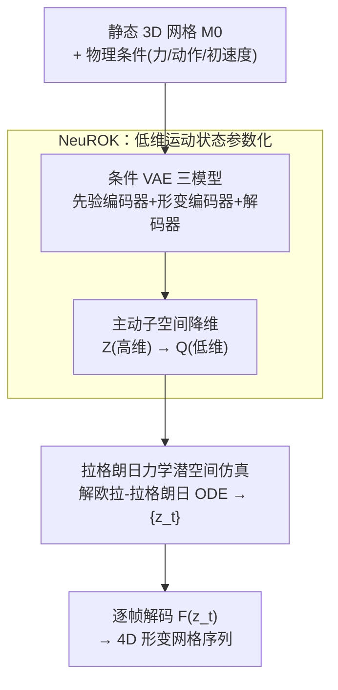

# NeuROK: Generative 4D Neural Object Kinematics

**会议**: CVPR 2026  
**arXiv**: [2605.30347](https://arxiv.org/abs/2605.30347)  
**代码**: https://chen-geng.com/neurok (项目主页)  
**领域**: 3D视觉 / 4D生成  
**关键词**: 4D 动力学生成, 运动状态参数化, 拉格朗日力学, 条件 VAE, 网格形变

## 一句话总结
NeuROK 把"给静态 3D 物体生成物理合理的 4D 形变"这件原本依赖类别专属物理模型的事，改写成"学一个低维潜在运动状态空间 + 在这个空间里用拉格朗日力学解一条 ODE"，从而无需任何物理标注、无需类别先验，就能对弹性体、布料、连续体、铰接物等各类物体统一生成 4D 动态，用户研究偏好率达 81%。

## 研究背景与动机

**领域现状**：数据驱动的方法已经把静态 3D 物体的重建和生成做得很成熟（transformer 一把梭）。但要生成"4D 仿真动态"——即静态物体在外力、动作、初速度等物理条件下随时间演化的真实形变——目前主流仍是"两步走"：先为目标类别挑一个预定义物理模型（弹性体用 MPM、铰接物预测关节、布料用专门的衣物模型），再用 system identification 估计这个模型的参数。

**现有痛点**：这套范式只在它假设的类别里好使。换个动力学结构完全不同的物体就垮，更要命的是它无法扩展到包含多种异质动态结构的大规模 4D 数据集上——每加一类物体就要重新设计一套物理方程和约束。

**核心矛盾**：问题的根子在一个长期被忽视的环节——**运动状态参数化（kinematic state parameterization）**。现有方法直接沿用物体形状表示天然带来的参数化（比如从网格离散化出来的稠密粒子集），这是个**过参数化、欠约束**的系统：$\mathbb{R}^{3n}$ 里随便采一个形变向量几乎一定是不合理的姿态。为了让这个冗余系统不至于"解不出来"，就必须塞进类别专属的物理约束。约束 ↔ 通用性之间形成死结。

**本文目标**：能不能不引入任何类别专属归纳偏置，就造一个通用的 4D 动态生成器？

**切入角度**：作者观察到一个经验事实——某个动态物体所有"合理形变"对应的顶点向量，其实只构成嵌在 $\mathbb{R}^{3n}$ 里的一个**低维流形** $\mathcal{V}^{k_{\text{int}}}$，本征自由度 $k_{\text{int}} \ll 3n$。既然合理姿态本来就只占低维子空间，那就别用稠密粒子那种冗余参数化，直接**从数据里学一个低维、紧凑、可解码的参数化**。

**核心 idea**：学一个潜在流形 $\mathcal{Z}$ 加一个解码器 $\mathcal{F}$，让从 $\mathcal{Z}$ 里采的任意潜向量都能解码成一个合理形变的网格——这对 $(\mathcal{Z}, \mathcal{F})$ 就叫 Neural Object Kinematics (NeuROK)。有了它，物理系统被极大简化：不用再写粒子间的物理方程去维持形状合理性（因为任何潜向量解出来都合理），只需要在低维潜空间里，从经典拉格朗日力学的视角去建模状态之间的转移。

## 方法详解

### 整体框架
NeuROK 的整条流水线分两个相对独立的阶段。**第一阶段（学参数化）**：给定一个动态物体的静态 3D 快照网格 $\mathcal{M}_0$，用一个 transformer 编码器把它编码成一个实例专属的潜在运动状态空间 $\mathcal{Z}(\mathcal{M}_0)$——这个空间上的每个潜向量都能被解码器映射成该物体的一个合理形变姿态。这一步通过训练一个**条件 VAE** 实现（三个模型协同），训练只需要 4D 几何轨迹监督，完全不需要物理参数或动作标注。**第二阶段（解动力学）**：原始问题"生成一串形变网格 $\{\mathcal{M}_1,\dots,\mathcal{M}_T\}$"被等价改写成"在 $\mathcal{Z}(\mathcal{M}_0)$ 里生成一串潜向量 $\{\mathbf{z}_1,\dots,\mathbf{z}_T\}$"。因为学到的 NeuROK 正好可以当作这个物体中心物理系统的**广义坐标**，于是给系统定义一个拉格朗日量 $L$，解欧拉-拉格朗日方程这条 ODE，就得到潜向量的演化轨迹，再逐帧解码回网格。

下图把两个阶段串起来：左半是训练/推理出 NeuROK 的生成式学习，右半是拿到 NeuROK 后在潜空间里做物理仿真。

### 关键设计

**1. NeuROK：把"运动状态参数化"从形状继承改为数据学习**

这是全文的立论支点，直接针对"稠密粒子参数化过参数化、欠约束、必须靠类别物理约束兜底"这个痛点。作者把参数化形式化为一对 $(\mathcal{Z}, \mathcal{F})$：$\mathcal{Z}$ 是潜在流形，$\mathcal{F}$ 是把采样潜向量映射到顶点配置（合理形变网格）的解码器。关键在于，**只要 $\mathcal{F}$ 学好了，潜空间里任意一点都对应一个合理姿态**——这就把"保持形状合理"从一堆显式物理约束（粒子间方程）里彻底解放出来，让后续可以把整个系统当作一个低维整体来研究其状态能量地形。和 MPM/弹簧质点/铰接预测那些 geometry-derived 参数化相比，NeuROK 不依赖任何动态结构先验，因此对弹性体、布料、连续体、多体甚至异质组合物体一视同仁。

**2. 三模型条件 VAE：用代理任务"形变场分布"把潜空间学出来**

直接对"运动状态"建模没有监督信号，作者把它转成一个代理任务——学物体 $\mathcal{M}_0$ 上所有合理**形变场** $\phi(\mathbf{x}):\mathbb{R}^3\to\mathbb{R}^3$ 的生成分布 $p_{\mathcal{M}_0}(\phi)$。为此训三个 transformer（都用 perceiver 架构 + 可学习 token，以适配可变点采样数）：① **运动先验编码器** $\mathcal{E}_{\text{cond}}(\mathcal{M}_0)$ 只吃静态网格（表面采点云 + 3DShape2Vecset 位置嵌入），输出实例专属先验 $p_{\mathcal{M}_0}(\mathbf{z})=\mathcal{N}(\mu_{\text{cond}}, \mathbf{I})$——这是推理时唯一用到的模型；② **变分形变编码器** $\mathcal{E}_{\text{VAE}}(\phi, \mathcal{M}_0)$ 额外吃一个形变场（顶点位移 $\delta_{\mathbf{z}}=V_{\mathbf{z}}-V_0$ 用对偶四元数参数化、重心插值到采样点），输出后验 $q_{\mathcal{M}_0}(\mathbf{z}\mid\phi)=\mathcal{N}(\mu_{\text{VAE}}, \sigma_{\text{VAE}})$；③ **形变解码器** $\mathcal{D}(\mathbf{z}, \mathcal{M}_0)$ 把潜 token 与 query 点云一起过自/交叉注意力，预测每点形变向量，再按 $K_{\text{drive}}$ 近邻平均驱动网格顶点。训练完后取先验分布的高密度区当作 $\mathcal{Z}(\mathcal{M}_0)$、用概率解码器当作映射 $\mathcal{F}$。

**3. 主动子空间降维：把原始潜空间再压一档，换来平滑可解的配置空间**

VAE 学出的原始潜空间维度 $k$ 仍偏高，作者用 **Active Subspace Method** 把 $\mathcal{Z}\subseteq\mathbb{R}^k$ 进一步压到 $\mathcal{Q}\subseteq\mathbb{R}^{k_q}$（$k_q\ll k$）。做法是构造代理函数 $\mathcal{G}(\mathbf{z})=g(A\mathbf{z}+\epsilon(\mathbf{z}))$，其中 $A\in\mathbb{R}^{k_q\times k}$，$A$ 各行张成的空间标出"对 $\mathcal{G}$ 真正重要的方向"。作者把 $G$ 定义为预测形变 $\delta_{\text{pred}}$ 的 2-范数，从而让降维专门保留"对形变影响最大"的方向。这一步不是锦上添花——消融里它是掉点最狠的模块（见下），因为后续要在这个空间上算雅可比、解 ODE，维度过高既慢又不稳。

**4. 拉格朗日力学潜空间仿真：把 NeuROK 当广义坐标，解一条 ODE 生成动态**

有了 NeuROK，生成动态就等于在 $\mathcal{Z}(\mathcal{M}_0)$ 里生成轨迹 $\{\mathbf{z}_i\}$。作者把 $\mathbf{z}$ 直接当作系统的**广义坐标**，定义拉格朗日量 $L(\mathbf{z},\dot{\mathbf{z}})=T(\mathbf{z},\dot{\mathbf{z}})-V(\mathbf{z})$（动能减势能），解欧拉-拉格朗日方程 $\frac{\mathrm{d}}{\mathrm{d}t}\frac{\partial L}{\partial\dot{\mathbf{z}}}=\frac{\partial L}{\partial\mathbf{z}}$。展开成可数值求解的形式：

$$mG(\mathbf{z})\ddot{\mathbf{z}} + C(\mathbf{z},\dot{\mathbf{z}}) + \nabla_{\mathbf{z}}V = 0,$$

其中 $G(\mathbf{z})=J_{\mathbf{z}}^TJ_{\mathbf{z}}$、$J_{\mathbf{z}}$ 是解码器 $\mathcal{F}$ 的雅可比，$C_i=m\sum_{j,k}\Gamma_{ijk}(\mathbf{z})\dot{\mathbf{z}}_j\dot{\mathbf{z}}_k$、$\Gamma_{ijk}$ 是 Christoffel 符号（即潜空间因 $\mathcal{F}$ 诱导的度规带来的"测地修正"项）。外部动作/初速度等条件通过**边界条件**注入：优化初始 $(\mathbf{z}_0,\dot{\mathbf{z}}_0)$ 使 $\|\mathbf{x}_0-\mathcal{F}(\mathbf{z}_0)\|_2^2+\|\dot{\mathbf{x}}_0-J_{\mathbf{z}}\dot{\mathbf{z}}_0\|_2^2$ 最小，再以此为初值数值求解 ODE。这套做法的妙处在于，它把"物理合理性"分到了两个层面：形状合理性由 NeuROK 的解码器保证，运动合理性（如能量守恒）由拉格朗日框架天然保证。

### 损失函数 / 训练策略
三个模型在大规模 4D 形变网格数据集上**同时训练**，数据集由已有工作（PartNet-Mobility 等）和物理仿真整理而来。每个 iteration 随机抽一个实例、抽该实例形变序列里的两帧（共享拓扑），第一帧作 $\mathcal{M}_0$、第一→第二帧的形变作 $\delta_{\text{sample}}$，过三模型得到重建 $\delta_{\text{pred}}$。监督用标准条件 VAE 目标：

$$\mathcal{L}=\|\delta_{\text{sample}}-\delta_{\text{pred}}\|_2^2 + \lambda D_{KL}\big(q_{\mathcal{M}_0}(\mathbf{z}\mid\phi)\,\|\,p_{\mathcal{M}_0}(\mathbf{z})\big),$$

即"重建项 + KL 对齐后验与实例先验"，$\lambda=0.01$。推理时只用 $\mathcal{E}_{\text{cond}}$ 拿先验、采样、再用 $\mathcal{D}$ 解码。

## 实验关键数据

### 主实验

**逆运动学优化（学到的运动空间紧不紧、平不平滑）**——给定物体和它的一个目标姿态，估计最优潜状态向量去匹配，在 PartNet-Mobility 测试集上用 Chamfer 距离和 IoU 评估：

| 方法 | Chamfer (L1)↓ | Chamfer (L2)↓ | IoU↑ |
|------|---------------|---------------|------|
| NeuralDeformationGraphs | 0.670 | 0.724 | 0.289 |
| SINGAPO | 0.313 | 0.200 | 0.091 |
| FreeArt3D | 0.169 | 0.139 | 0.354 |
| CANOR | 0.082 | 0.067 | 0.568 |
| KeyPointDeformer | 0.067 | 0.067 | 0.570 |
| **NeuROK (ours)** | **0.028** | **0.028** | **0.764** |

NeuROK 在所有指标上大幅领先，Chamfer 比次优的 KeyPointDeformer 再降一半多，IoU 从 0.570 提到 0.764。

**物理启发的 4D 生成（生成动态质量）**——给单个形状 + 条件动作生成 4D 运动，105 人用户研究 + VBench + WorldScore 指标，覆盖 8 类物体：

| 方法 | 对齐偏好↑ | 真实感偏好↑ | AQ↑ | DD↑ | IQ↑ | CLIP↑ | MM↑ |
|------|----------|------------|-----|-----|-----|-------|-----|
| PhysDreamer | 5.95% | 5.36% | 0.362 | 0.500 | 48.43 | 0.716 | 0.783 |
| OmniPhysGS | 1.67% | 0.48% | 0.380 | 0.625 | 48.94 | 0.690 | 0.544 |
| Pixie | 5.12% | 4.17% | 0.392 | 0.625 | 46.18 | 0.659 | 0.857 |
| AnimateAnyMesh | 5.83% | 6.67% | 0.450 | 0.625 | 48.37 | 0.730 | 0.889 |
| **NeuROK (ours)** | **81.43%** | **83.33%** | **0.483** | **0.750** | **51.10** | **0.761** | **2.343** |

> 指标说明：AQ 美学质量、DD 动态程度、IQ 成像质量、CLIP 为 CLIP score、MM 运动幅度（Motion Magnitude）。用户研究的"对齐/真实感偏好"是各方法被选为最佳的比例。

NeuROK 在用户研究中以 81%+ 的压倒性偏好胜出，所有自动指标也全面领先；MM 高达 2.343（远超基线），说明它生成的运动幅度更大、更接近真实物理响应而非细微抖动。

### 消融实验
消融与主实验共用 Tab. 1（逆运动学设定）：

| 配置 | Chamfer (L1)↓ | Chamfer (L2)↓ | IoU↑ | 说明 |
|------|---------------|---------------|------|------|
| **Full NeuROK** | **0.028** | **0.028** | **0.764** | 完整模型 |
| w/o Model Reduction | 0.045 | 0.059 | 0.711 | 去掉主动子空间降维，掉得最多 |
| w/o Data Augmentation | 0.036 | 0.041 | 0.724 | 去掉训练数据增广 |
| w/o Dual-Quaternion | 0.033 | 0.037 | 0.728 | 形变改用普通参数化而非对偶四元数 |

### 关键发现
- **降维（Model Reduction）贡献最大**：去掉后 Chamfer L1 从 0.028 涨到 0.045（+60%）、IoU 从 0.764 掉到 0.711，是三项里最敏感的——印证了"在过高维潜空间上算雅可比/解 ODE 会既不稳又不准"，紧凑配置空间是后续物理仿真能work的前提。
- **能量守恒可验证**：分析实验（Fig. 8）显示拉格朗日建模下生成轨迹的总能量近似恒定，说明物理合理性不是靠监督硬凑，而是框架天然带来的。
- **能泛化到未见类别**：只在 PartNet-Mobility 类别上训的 NeuROK 变体，对训练集里完全没有的新物体类别仍能生成合理动态（Fig. 9）；还能直接仿真真实扫描场景（如桌上笔记本电脑的合盖运动，Fig. 7）。
- **基线各有专长但都不通用**：物理类方法（PhysDreamer/OmniPhysGS/Pixie）只在各自材料类别内好使，端到端方法（AnimateAnyMesh）缺乏细粒度条件控制、对罕见物体类型乏力。

## 亮点与洞察
- **把"参数化选择"提到方法论高度**：论文开篇就引 Landau 力学里"坐标不必是笛卡尔坐标、换个坐标问题更好解"那句话——核心洞察是 4D 生成难，难在沿用了形状继承来的冗余坐标；换成数据学的低维广义坐标，难题自动消解。这种"重新选坐标系"的思路可迁移到任何被过参数化困住的逆问题。
- **物理合理性的两层分工很优雅**：形状合理性交给 NeuROK 解码器（数据先验保证），运动合理性交给拉格朗日 ODE（经典力学保证），各管一层、互不干涉，这是它能"无物理标注却仍物理合理"的关键。
- **可学习参数化 + 经典力学的混搭范式**：不是用神经网络去拟合 PDE 解或学本构律，而是让神经网络只负责"学一个好坐标系"，物理推演仍交给解析的欧拉-拉格朗日方程——既享受数据驱动的泛化性，又保留经典物理的可解释性与守恒律。
- **用 Active Subspace Method 做潜空间降维**这个 trick 本身可复用：当下游要在潜空间上做基于雅可比的物理/优化时，用"对输出影响最大的方向"做降维比 PCA 更对症。

## 局限与展望
- **单帧本质欠定，只生成一条合理解**：单个 3D 快照无法确定物体真实物理参数，方法只承诺生成"满足某一组合理物理配置、符合人类直觉"的一条 4D 序列，而非唯一正确答案；对需要精确物理参数反演的场景不适用。
- **依赖共享拓扑的网格序列监督**：训练要求同一实例不同帧共享网格拓扑（取两帧算形变），这限制了可用数据——拓扑变化（如撕裂、断裂、流体合并分离）的动态难以纳入。
- **拉格朗日量 $T,V$ 的设定仍需人工**：虽然框架通用，但具体物理系统的动能/势能形式、外部条件如何编码进边界条件，正文交代较略（多处指向补充材料），不同物体是否需要不同 $L$ 的设计尚不清晰。
- **"object-centric"假设**：方法明确假设大部分运动来自单个主导可形变物体，对多物体强耦合交互、接触主导的场景（如多体碰撞、抓取）适用性存疑。

## 相关工作与启发
- **vs PhysDreamer / OmniPhysGS / Pixie（物理启发 4D 生成）**：它们走"预定义类别物理模型 + system identification 估参数"的两步范式，本文不假设任何动态结构、纯数据学参数化。优势是跨类别通用、能上大规模数据集；它们的优势是在自己专精的材料类别内物理精度可能更可控。
- **vs AnimateAnyMesh（端到端 4D 生成）**：同样是大规模 4D 数据训练，但它端到端直接生成、缺乏细粒度物理条件控制，对罕见物体乏力；NeuROK 把"学参数化"和"解动力学"解耦，条件（力/动作/初速度）通过边界条件精确注入。
- **vs Reduced-Order Simulation（降阶仿真）**：图形学里的模型降阶也学低维运动空间，但目标是给已知物理系统**加速**、且通常是逐实例训练；NeuROK 目标是**通用性**，学的是跨实例摊销推理的可泛化先验。
- **vs Lagrangian Neural Networks 类工作**：它们用网络从合成数据学系统的拉格朗日量；本文反过来——拉格朗日量沿用经典定义，网络只学"数据驱动的运动状态参数化"，把神经网络的活儿压到最小、最可控的环节。

## 评分
- 新颖性: ⭐⭐⭐⭐⭐ 把"运动状态参数化"重新提为方法论核心，用数据学广义坐标 + 经典拉格朗日力学解 ODE，是 4D 生成里少见的范式级思路。
- 实验充分度: ⭐⭐⭐⭐ 逆运动学定量 + 4D 生成用户研究/VBench/WorldScore 多维评估，覆盖多类物体并验证未见类别泛化与真实物体；但许多物理设定细节（$L$、边界条件、数据集构成）压在补充材料。
- 写作质量: ⭐⭐⭐⭐⭐ 立论清晰、用力学经典引言点睛，formulation 严谨，从痛点到方案的推导很顺。
- 价值: ⭐⭐⭐⭐⭐ 为构建具身/机器人所需的 3D 世界模型提供了一条无需物理标注、跨类别通用的 4D 仿真生成路径，范式有较强延展性。

<!-- RELATED:START -->

## 相关论文

- [\[CVPR 2026\] CARI4D: Category Agnostic 4D Reconstruction of Human-Object Interaction](cari4d_category_agnostic_4d_reconstruction_of_human_object_interaction.md)
- [\[ICLR 2026\] Scaling Sequence-to-Sequence Generative Neural Rendering](../../ICLR2026/3d_vision/scaling_sequence-to-sequence_generative_neural_rendering.md)
- [\[CVPR 2026\] ArtHOI: Taming Foundation Models for Monocular 4D Reconstruction of Hand-Articulated-Object Interactions](arthoi_taming_foundation_models_for_monocular_4d_reconstruction_of_hand-articula.md)
- [\[AAAI 2026\] 4DSTR: Advancing Generative 4D Gaussians with Spatial-Temporal Rectification for High-Quality and Consistent 4D Generation](../../AAAI2026/3d_vision/4dstr_advancing_generative_4d_gaussians_with_spatial-tempora.md)
- [\[CVPR 2026\] BrickNet: Graph-Backed Generative Brick Assembly](bricknet_graph-backed_generative_brick_assembly.md)

<!-- RELATED:END -->
