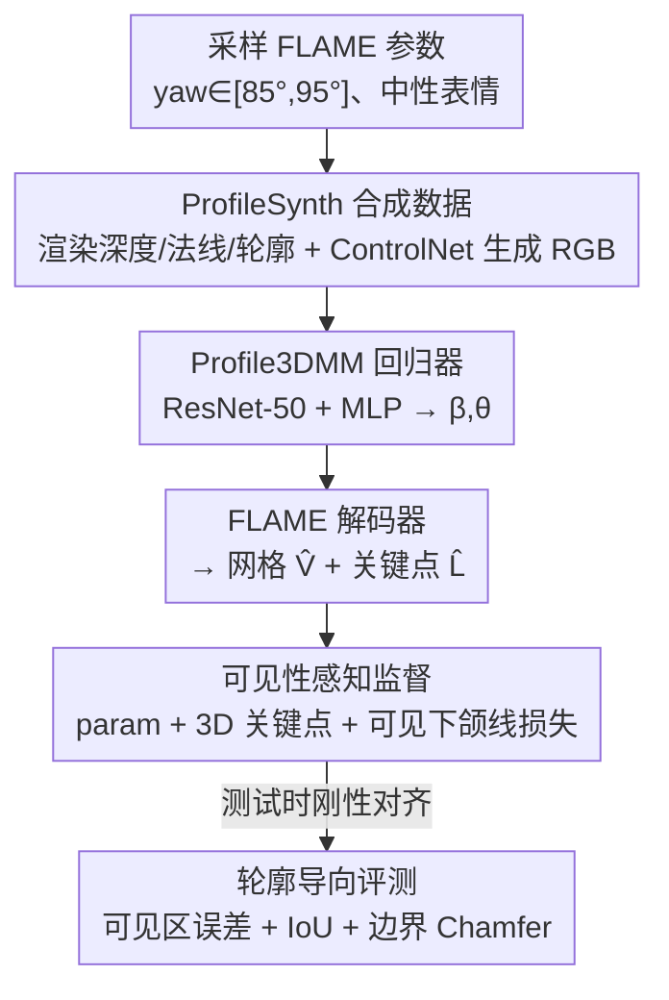

# Profile-Specific 3DMM Regression from a Single Lateral Face Image

**会议**: CVPR 2026  
**arXiv**: [2605.01746](https://arxiv.org/abs/2605.01746)  
**代码**: 无（论文提到 Data and code availability，但未给出链接）  
**领域**: 3D视觉  
**关键词**: 单图3D人脸重建, FLAME, 极端侧脸, 合成数据, 头影测量

## 一句话总结
针对偏航角 ≈90° 的极端侧脸单图，作者用"几何条件扩散生成的合成数据集 ProfileSynth + 一个简单的 FLAME 回归基线 + 可见性感知的下颌线监督"补上了"侧脸 × 3DMM"这块长期缺数据缺评测的空白，在合成测试集上把可见区误差和轮廓误差相比最强基线 DECA 降低 2.5~6 倍。

## 研究背景与动机

**领域现状**：单图 3D 人脸重建（回归 3DMM / FLAME 参数）已经是计算机视觉的成熟任务，DECA、EMOCA、MICA、Pixel3DMM 等都是强基线。但这些方法几乎都在**近正脸到中等偏转**的视角上开发和评测——正脸下五官、纹理等外观线索丰富，重建相对容易。

**现有痛点**：当偏航角逼近 90°（严格侧脸）时，半张脸完全自遮挡，稠密对应关系基本消失，可用信号几乎只剩**轮廓（silhouette）和下颌线（jawline）** 这类边界线索。正脸偏置的训练信号（稠密顶点损失、光度监督）在这里要么不可靠、要么会对"看不见的几何"过度惩罚，导致下巴投影、下颌角、轮廓一致性这些"侧脸关键区域"误差集中。

**核心矛盾**：这个 regime 缺三样东西同时卡住——(i) 严格侧脸 + 准确 3D 标注的成对数据极度稀缺（in-the-wild 数据集几乎不给侧脸的精确 3D 真值）；(ii) 训练目标没对齐"可见的侧脸证据"；(iii) 评测协议用全局表面距离，会淡化最关键的轮廓信号。

**本文目标**：把"侧脸 × 3DMM"这个被忽视的设定系统化地立起来——提供可扩展的成对数据、对齐可见证据的学习目标、强调轮廓/下颌保真度的评测协议。

**切入角度**：作者的医学动机很具体——正畸里的**头影测量（cephalometric analysis）** 一直依赖侧位 X 光，频繁拍 X 光对（尤其青少年）患者有累积辐射风险；如果能从侧位 RGB 照片可靠重建 3D 人脸几何，就能做"无辐射"的诊断。现有从侧位 RGB 找关键点的方法只用 2D 外观特征，没利用底层 3D 几何，精度不够。

**核心 idea**：与其发明新的稠密对应网络，不如**针对完整侧脸设定，专门定制三件套——训练数据分布、监督信号、评测协议**，先把这条 baseline 立扎实。

## 方法详解

### 整体框架
整篇工作是一个"以数据和评测为中心"的侧脸专用研究，围绕三个组件搭起来：**(1) ProfileSynth 合成数据集**——用几何条件扩散在极端偏航角下批量生成"照片级 RGB ↔ 精确 FLAME 真值"成对样本；**(2) Profile3DMM 回归器**——一个刻意做得很简单的 ResNet-50 + MLP 直接回归 FLAME 参数的基线；**(3) 可见性感知的下颌线监督 + 轮廓导向评测协议**——训练时只监督看得见的几何、评测时专门量轮廓保真度。

任务定义：给一张偏航角 ∈ [85°, 95°] 的侧脸 RGB 图 $I$，回归 FLAME 形状参数 $\beta$ 和头姿参数 $\theta$，再由 FLAME 解码器得到网格 $\hat V$ 和关键点 $\hat L$：

$$(\hat\beta,\hat\theta)=g(f(I')),\quad (\hat V,\hat L)=\mathrm{FLAME}(\hat\beta,\hat\theta)$$

为隔离极端姿态本身带来的歧义，作者把表情固定为中性、并通过水平翻转把侧脸方向统一到正偏航。

### 关键设计

**1. ProfileSynth：用几何条件扩散造"侧脸 × 精确 3D 真值"的成对数据**

这是全文的地基，直接针对"严格侧脸 + 准确 3D 标注极度稀缺"这个痛点。做法是：先从截断高斯 $\mathcal N(0,0.7^2)$（裁到 $[-2,2]$）采样 FLAME 形状参数、从 $[85°,95°]$ 均匀采样偏航、其余姿态分量同样高斯采样、表情固定为 0；对每个样本用 PyTorch3D 在固定透视相机（距离 0.8、FoV 20°）下渲染出深度图、法线图、轮廓 mask、2D/3D 关键点（1024×1024）；最后以**渲染的深度 + 法线作为条件**，用 Stable Diffusion v1.5 + ControlNet 生成照片级 RGB 图。每张生成图都天然配上精确的 FLAME 参数和几何信号。最终得到 10 万样本（80k/10k/10k）。

关键在于**几何—外观一致性**：扩散生成可能"画"出和条件几何对不上的外观，造成噪声监督。作者做了一个 sanity check——把 GT 轮廓边界附近开一条窄带，在带内提取生成 RGB 的强 Sobel 边缘，量"边界到边缘"的距离；并用一个把 GT 轮廓平移 +16 px 的"错位对照"做负样本。结果匹配轮廓的平均距离 10.05 px、2 px 内覆盖率 56.7%，明显优于错位对照的 32.21 px / 30.7%，说明合成 RGB 的几何—外观一致性是非平凡的（即标签可信）。

**2. Profile3DMM 回归器：刻意做"简单基线"而非新网络**

作者明确说自己**不发明新的稠密对应公式**，而是把一个最朴素的直接回归器专门化到侧脸。结构是 ImageNet 预训练的 ResNet-50 提全局特征 $z=f(I')$，接一个两层、1024 维隐层的 MLP 头 $g$ 回归出 300 个形状参数 + 6 个姿态参数（FLAME 全局旋转 3 维 + 颈部旋转 3 维，轴角表示），不回归表情（与中性表情设定一致）。输入预处理为 512×512、归一化到 [0,1] 再做 ImageNet 通道归一化，并做人脸居中裁剪。这样设计的意图是：把变量收敛到"数据分布 + 监督信号"上，让这条 baseline 干净可复现，方便后续工作在同一坐标系下系统比较。

**3. 可见性感知的下颌线监督：只监督看得见的几何，避免惩罚被遮挡区域**

侧脸下轮廓和下颌线主导视觉感知，但大片自遮挡区域会让朴素顶点监督变得不稳定。作者先用 GT 网格 + GT 相机在 256×256 下光栅化得到可见性 mask：一个下颌线顶点只要属于至少一个可见三角形就算可见，得到可见子集 $J_{vis}\subset J$（$J$ 是从下巴到耳朵的 65 个下颌线顶点）。总损失是三项加权和：

$$\mathcal L=w_p\mathcal L_{param}+w_l\mathcal L_{lm3d}+w_j\mathcal L_{jaw}$$

其中 $\mathcal L_{param}=\|\hat\beta-\beta\|_2^2+\|\hat\theta-\theta\|_2^2$ 是 FLAME 参数 L2；$\mathcal L_{lm3d}=\frac1K\sum_k\|\hat L_k-L_k\|_2^2$ 是 3D 关键点 L2（用的是 FLAME **静态**关键点，因为动态关键点嵌入只为 |yaw|≤39° 的近正脸设计，侧脸下失效；且从标准 68 点里**剔除 17 个轮廓点**、只监督剩下 51 个，避免轮廓点在侧脸下乱跳）；$\mathcal L_{jaw}=\frac{1}{|J_{vis}|}\sum_{i\in J_{vis}}\|\hat V_i-V_i\|_2^2$ 是**只在可见下颌线顶点上**算的顶点损失。权重设为 $(w_p,w_l,w_j)=(1,100,10)$。注意训练里**完全不放轮廓项**，轮廓只用于评测——这是为了让评测信号和训练信号解耦、避免"训练对着指标刷分"。

**4. 轮廓导向的评测协议：用可见区 + 轮廓指标补全全局表面距离的盲区**

因为很多基线不显式预测姿态/相机，作者在**评测时**对预测网格估一个刚性变换 $(R,t)\in SE(3)$ 对齐 GT（最小化可见顶点上的 L2），再在对齐后的网格上算指标——这个刚性对齐只在评测时用，不进训练/推理。指标分两类：3D 网格误差报全局 $E_{all}$、可见区 $E_{vis}$、下颌带 $E_{jaw}$ 及其可见变体 $E_{jaw,vis}$（侧脸下以可见变体为主指标）；轮廓指标报 silhouette IoU（$\mathrm{IoU}=\frac{|S\cap\hat S|}{|S\cup\hat S|}$）和 **boundary Chamfer**（提轮廓→转 2D 点集→算对称 Chamfer 距离、用图像对角线归一化）。真实域评测则在 NoW 的 26 张侧脸子集上按官方 7 点刚性对齐协议报 mm 误差。

### 损失函数 / 训练策略
总损失即上面的 $\mathcal L=w_p\mathcal L_{param}+w_l\mathcal L_{lm3d}+w_j\mathcal L_{jaw}$，$(w_p,w_l,w_j)=(1,100,10)$。训练 30 epoch，AdamW，batch 64，开启 AMP；backbone 初始学习率 $1\times10^{-5}$、MLP 头 $1\times10^{-4}$，weight decay $1\times10^{-4}$；按验证损失最低选 checkpoint，固定种子 42，单张 RTX 4090 训练。

## 实验关键数据

### 主实验

ProfileSynth 测试集（N=10,000，刚性对齐后；误差为 FLAME 坐标单位）——本文方法全面领先：

| 方法 | $E_{vis}$↓ | $E_{jaw,vis}$↓ | IoU↑ | B-Chamfer↓ |
|------|-----------|---------------|------|-----------|
| DECA（最强基线） | 0.004225 | 0.007189 | 0.945 | 0.007064 |
| EMOCAv2 | 0.004384 | 0.007544 | 0.940 | 0.007880 |
| MICA | 0.004344 | 0.005153 | 0.935 | 0.008757 |
| Pixel3DMM | 0.007344 | 0.008876 | 0.901 | 0.013370 |
| **Ours (Profile3DMM)** | **0.001672** | **0.001758** | **0.986** | **0.001186** |

相比最强基线 DECA：$E_{vis}$ 降 2.53×、$E_{jaw,vis}$ 降 4.09×、IoU +0.041、boundary Chamfer 降 5.95×。

NoW 侧脸子集（n=26，mm，官方 7 点对齐）——真实域结果"偏好但混合"：

| 方法 | Median↓ | Mean↓ |
|------|---------|-------|
| DECA | 1.6147 | 2.0081 |
| EMOCAv2 | 1.7138 | 2.1651 |
| MICA | **0.9432** | **1.1606** |
| 3DDFA_V2 | 1.4363 | 2.0531 |
| SynergyNet | 1.3449 | 1.6747 |
| Pixel3DMM（n=19，7 张检测失败） | 1.4768 | 2.3471 |
| Ours (Profile3DMM) | 1.3688 | 1.7060 |

本文优于 DECA / EMOCAv2 / 3DDFA_V2 / Pixel3DMM，但 MICA、SynergyNet 整体误差更低。作者强调样本小、各方法预处理不统一，只当"指示性"结果；并认为全局 scan-based 指标可能没充分反映轮廓改进（佐证了在 ProfileSynth 上做轮廓导向评测的必要性）。补充材料里在 2,277 张验证过的临床侧位照片上做的"轮廓 proxy"评测，下颌轮廓误差低于 DECA / EMOCAv2，进一步支持真实域迁移。

### 消融实验

ProfileSynth 测试集、**对齐前**误差（各变体都在同一 FLAME 标准帧内预测，无需跨方法姿态归一）：

| 配置 | 3D LM L2↓ | $E_{vis}$↓ | $E_{jaw,vis}$↓ | IoU↑ | B-Chamfer↓ |
|------|-----------|-----------|---------------|------|-----------|
| Baseline (param + 3D lm + jaw) | 0.003782 | 0.003558 | 0.003420 | 0.9794 | 0.002114 |
| w/o 3D landmark loss | 0.004019 | 0.003653 | 0.003649 | 0.9796 | 0.002096 |
| w/o jawline loss | 0.003786 | 0.003558 | 0.003436 | 0.9794 | 0.002112 |
| Param-only supervision | 0.003908 | 0.003591 | 0.003562 | 0.9796 | 0.002083 |
| High jawline weight (×30) | 0.003835 | 0.003583 | 0.003484 | 0.9795 | 0.002099 |

### 关键发现
- **3D 关键点监督是最关键的几何约束**：去掉它，3D LM L2 涨 ~6.3%、$E_{vis}$ 涨 ~2.7%、$E_{jaw,vis}$ 涨 ~6.7%——稀疏 3D 关键点在严重自遮挡下提供了有效的几何锚点。
- **下颌线监督效果微弱且非单调**：去掉它几乎不变（$E_{jaw,vis}$ 0.003420→0.003436），把权重加大 30× 也没有单调改善（0.003484）。作者据此指出：单纯给"3D 下颌顶点"目标加权不足以稳定提升侧脸重建，需要**轮廓感知**的目标——把下颌几何更直接地耦合到可见轮廓边界。
- **只用参数监督不够**：param-only 的可见 3D 精度变差（$E_{vis}$ 0.003591、$E_{jaw,vis}$ 0.003562），但轮廓指标反而略好——揭示了极端侧脸下的"指标 trade-off"：轮廓对齐可以在不改善 3D 几何保真度的情况下提升，因此显式几何监督仍不可或缺。

## 亮点与洞察
- **把"造数据"作为一等公民解决无标注难题**：用几何条件（深度+法线）的 ControlNet 生成照片级侧脸，天然获得精确 FLAME 真值，绕开了 in-the-wild 严格侧脸无 3D 标注的死结；并配一个轻量的"边界—边缘距离" sanity check 量化标签可信度，这个验证套路可迁移到任何"几何条件生成训练数据"的场景。
- **可见性感知监督的工程直觉很正**：只在可见三角形上算下颌顶点损失、剔除侧脸下失效的 17 个轮廓关键点、用静态而非动态 FLAME 关键点——这些都是"别去监督看不见/不可靠的东西"的具体落地，值得借鉴到任意大姿态/遮挡重建任务。
- **诚实地把方法定位成 baseline**：作者反复强调"简单"、"complementary 而非取代稠密对应"，并把主比较刻意限制在共享刚性对齐的形状层面，这种克制反而让这条侧脸 baseline 更可复现、可被后续工作站着比。
- **消融给出一个有价值的负面结论**：加大下颌顶点权重不单调改善，指向"3D 顶点目标 ≠ 轮廓目标"，为后续设计 contour-aware loss 指明方向。

## 局限与展望
- 作者承认：只限**中性表情、固定相机、真实评测集很小**；ProfileSynth 虽可控，但合成—真实 gap 仍在，尤其侧脸下的检测、裁剪、外观变化容易失败。需要更大的、专门针对严格侧脸的真实 benchmark 才能下更确定的结论。
- NoW 侧脸子集只有 26 张、各方法预处理不统一，且 MICA/SynergyNet 在该子集上误差更低——真实域优势并不稳固，主要优势集中在自家合成域。
- 评测时所有方法都做刚性对齐，等于把姿态/相机预测的难度"洗掉"了，只比形状；而极端侧脸里姿态估计本身就是难点之一，这块没被纳入主比较。
- 改进思路（部分作者已点出）：把下颌/轮廓损失从"3D 顶点"改为直接耦合可见轮廓边界的 contour-aware 目标；扩展到带表情、多相机；做更大规模真实侧脸标注。

## 相关工作与启发
- **vs DECA / EMOCA / MICA / Pixel3DMM（正脸偏置的 FLAME 回归）**：它们在近正脸上很强，但极端侧脸下可见区误差和轮廓误差被本文大幅拉开（合成域 2.5~6×）；本文不改网络，只改数据分布 + 监督 + 评测，说明"把训练分布对齐目标 regime"在这里比"换更强的网络"更管用。
- **vs 3DDFA_V2 / SynergyNet / PRNet / DAD-3DNet（大姿态/稠密对应）**：这一线靠 3D 形状先验 + 姿态感知监督或稠密预测来扛大姿态；本文是**互补**的——不提新的稠密对应公式，而是专门化直接 FLAME 回归器、数据分布和监督信号到完整侧脸设定。
- **vs SynthFace / 通用合成人脸管线**：同样用渲染到真实的合成策略，但本文聚焦极端侧脸 regime（yaw≈90°），服务侧脸专用 3DMM 回归与评测，而非通用人脸分析。
- **启发**：医学动机（无辐射头影测量）驱动的"侧脸 3D 几何"是一个被 CV 主流忽视但有明确临床价值的细分方向；"几何条件生成数据 + 可见性感知监督 + 轮廓导向评测"这套组合拳，可推广到任何"目标视角下监督信号稀缺且被遮挡主导"的重建问题。

## 评分
- 新颖性: ⭐⭐⭐⭐ 不在网络结构上创新，但把"侧脸 × 3DMM"这个被忽视的设定连同数据集/监督/评测一起立起来，组合有价值。
- 实验充分度: ⭐⭐⭐ 合成域对比 + 消融扎实，但真实域只有 26 张小子集且结果混合，刚性对齐又洗掉了姿态难度，说服力打折。
- 写作质量: ⭐⭐⭐⭐ 动机—方法—评测逻辑清晰，对"baseline 定位"和指标局限都很诚实，消融给出有价值的负面结论。
- 价值: ⭐⭐⭐⭐ 为无辐射头影测量等临床应用提供了可复现的侧脸重建 baseline 和评测协议，后续工作可直接站着比。

<!-- RELATED:START -->

## 相关论文

- [\[ICCV 2025\] FaceLift: Learning Generalizable Single Image 3D Face Reconstruction from Synthetic Heads](../../ICCV2025/3d_vision/facelift_learning_generalizable_single_image_3d_face_reconstruction_from_synthet.md)
- [\[CVPR 2026\] Human Interaction-Aware 3D Reconstruction from a Single Image](human_interaction-aware_3d_reconstruction_from_a_single_image.md)
- [\[CVPR 2026\] CrowdGaussian: Reconstructing High-Fidelity 3D Gaussians for Human Crowd from a Single Image](crowdgaussian_reconstructing_high-fidelity_3d_gaussians_for_human_crowd_from_a_s.md)
- [\[CVPR 2026\] Pano3DComposer: Feed-Forward Compositional 3D Scene Generation from Single Panoramic Image](pano3dcomposer_feed-forward_compositional_3d_scene_generation_from_single_panora.md)
- [\[CVPR 2026\] 3D-Fixer: Coarse-to-Fine In-place Completion for 3D Scenes from a Single Image](3d-fixer_coarse-to-fine_in-place_completion_for_3d_scenes_from_a_single_image.md)

<!-- RELATED:END -->
