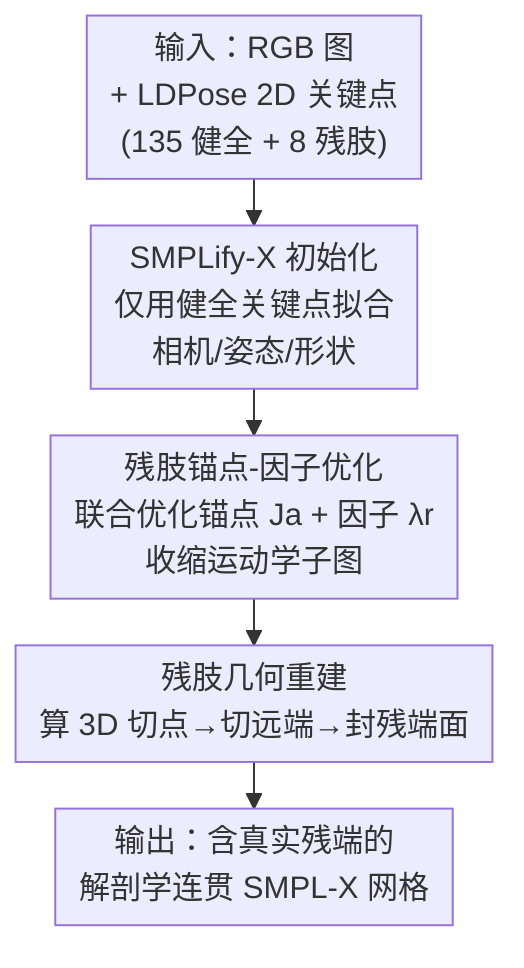

# ResiHMR: Residual-Limb Aware Single-Image 3D Human Mesh Recovery for Individuals with Limb Loss

**会议**: CVPR 2026  
**arXiv**: [2604.28025](https://arxiv.org/abs/2604.28025)  
**代码**: 无（论文提及 project page，未给出仓库）  
**领域**: 3D视觉 / 人体理解  
**关键词**: 人体网格重建、残肢、截肢者、拓扑自适应优化、SMPL-X

## 一句话总结
ResiHMR 是首个针对截肢人群的单图 3D 人体网格重建框架：它用「残肢锚点-因子优化」把 SMPL-X 的固定骨架裁剪到只覆盖实际存在的肢体，再用「残肢几何重建」显式切除远端网格并封出光滑残端面，把残肢 2D MPJPE 从 73.61 px 大幅降到 23.19 px（HSMR backbone）。

## 研究背景与动机
**领域现状**：单图人体网格重建（HMR）靠 SMPL / SMPL-X 这类参数化人体模型，把姿态和形状压进低维空间，再用优化（SMPLify-X）或回归（HMR2.0、HSMR）拟合 2D 关键点，已经能从一张 RGB 图恢复出可控的 3D 人体网格，服务动画、运动分析、康复监测等。

**现有痛点**：所有主流模型都内置「完整肢体先验」——骨架图、顶点连接、姿态先验全是按健全人解剖学定义的固定拓扑（fixed topology）。一旦遇到截肢者，模型无法表达残肢表面，只会幻想出一条完整的大腿小腿（hallucinate intact limbs），或把残端硬塞到最近的健全关节上。论文 Figure 2 给的左侧大腿截肢例子里，SMPL-X 凭空补全了整条腿；HSMR 因为回归全身生物力学骨架，残肢处的误差还会反向干扰骨架、把对侧好腿也带偏。

**核心矛盾**：固定拓扑模型的关节图是写死的，没有「残肢端点」这个概念，所以截肢处既无几何可表达、优化又在缺失肢体附近不稳定。已有的截肢相关工作（AJAHR）只做「关节是否存在」的判断、仍依赖完整 SMPL 拓扑，残端只能落在最近的健全关节；LDPose 虽然定义了 2D 残肢端点关键点，但没有 3D 监督也没有参数化人体表示。

**本文目标**：把 2D 残肢端点抬升成解剖学上有意义的 3D 肢体终止位置，同时保持全局姿态和身体比例与健全关键点一致，让每条残肢有显式 3D 几何，而不是隐式地缩短或省略。

**切入角度**：作者观察到——残肢长度其实和健全段长度有人体测量学（anthropometric）相关性，于是不去重训模型，而是在 SMPL-X 参数空间和骨架结构上做拓扑自适应优化，把「残肢终止在哪」压缩成沿运动学链的一个比例因子 $\lambda_r$。

**核心 idea**：用「锚点关节 + 残肢比例因子」重新定义运动学子图来止住幻想肢体，再用显式网格裁剪 + 封口造出真实残端面——即「裁拓扑 + 造残端」代替「在完整拓扑里删关节」。

## 方法详解

### 整体框架
ResiHMR 输入一张 RGB 图 + LDPose 格式的全身 2D 关键点（135 个健全 OpenPose WholeBody 点 + 8 个残肢端点），输出一个解剖学连贯、含真实残端几何的 SMPL-X 网格。它**完全基于优化、不需要任何训练数据**，整条流水线分三步串行：

1. **初始化**：先只用健全关键点按标准 SMPLify-X 目标拟合出 SMPL-X 的相机、姿态、形状（此时残肢处仍是幻想的完整肢体）；
2. **残肢锚点-因子优化（Residual Anchor-Factor Optimization）**：在残肢端点监督下，为每条残肢联合优化一个锚点关节 $\mathbf{J}_a$ 和残肢比例因子 $\lambda_r$，把运动学图收缩到实际存在的肢体子图；
3. **残肢几何重建（Residual-Limb Reconstruction）**：拿上一步求得的 $(\mathbf{J}_a^\star,\lambda_r^\star)$ 在网格上算出 3D 切点，切掉远端几何，再封出光滑、凸、闭合（watertight）的残端面。

关键之处在于这是一个**即插即用**设计：它直接作用在 SMPL-X 参数空间（相机/姿态/形状）和骨架结构上，任何输出 SMPL-X 参数的 HMR pipeline 都能接（论文同时在优化式 SMPLify-X 和回归式 HSMR 两个 backbone 上验证）。

### 关键设计

**1. 残肢锚点-因子优化：把「残肢止于何处」压成一个比例因子**

针对的是固定拓扑下「残端被塞到最近健全关节、且优化在截肢处不稳定」这个痛点。作者把每条残肢的端点参数化为锚点关节 $\mathbf{J}_a$（截肢段根部的远端关节，如膝或肘）到其上游关节 $\mathbf{J}_t$ 连线上的一点：

$$\mathbf{R}_r=\mathbf{J}_a+\lambda_r(\mathbf{J}_t-\mathbf{J}_a),\quad \lambda_r\in[0,1]$$

$\lambda_r=0$ 表示肢体完整、$\lambda_r=1$ 表示完全截除。这种线性插值给出了一个低维、且锚在运动学链上的残肢表示——它保持原肢段方向，只让优化器用单个因子调残肢长度，全局骨架结构仍和 SMPL-X 一致。对每个可见残肢端点，联合优化 $(\mathbf{J}_a,\lambda_r)$ 的损失为

$$\mathcal{L}=\mathcal{L}_{\text{reproj}}+\alpha\mathcal{L}_{\text{reg}}+\mu\mathcal{L}_{\text{len}}$$

其中重投影项 $\mathcal{L}_{\text{reproj}}=\|\pi(\mathbf{R}_r)-\mathbf{k}_r^{2D}\|^2$ 拉残端去对齐 2D 观测；正则项 $\mathcal{L}_{\text{reg}}=\|\mathbf{J}_a-\mathbf{J}_a^{\text{init}}\|^2$ 惩罚锚点偏离 SMPLify-X 初始位置，让健全关节别乱动；长度项 $\mathcal{L}_{\text{len}}=(\|\mathbf{J}_t-\mathbf{J}_a\|-\|\mathbf{J}_t-\mathbf{J}_a^{\text{init}}\|)^2$ 保留 SMPLify-X 给的肢段长度、编码人体测量学先验，保证残段在生物力学上合理。这正是作者「健全段长度与残肢长度相关」观察的落地：只调终止点、不动原始肢段长度先验。

**2. 残肢几何重建：从参数到网格，显式切除并封出残端面**

锚点-因子优化只给了端点位置，网格上那条幻想的远端肢体还在——这一步把参数转成真实几何。先用上一步的解算结果在原 SMPL-X 骨架上算 3D 切点 $\mathbf{p}_r=\mathbf{J}_a^\star+\lambda_r^\star(\mathbf{J}_t^{\text{init}}-\mathbf{J}_a^\star)$，后续所有操作只限制在对应肢体子网格上，分三道工序：

- **分割引导的粗剪**：套用 SMPL-X 身体部件分割，直接删掉残肢对应的远端部件标签（如前臂+手、或脚），得到粗远端 mask，先砍掉明显超出残段的顶点、缩小搜索空间；
- **精细几何切割**：在保留段（如上臂/大腿）内，找到离 $\mathbf{p}_r$ 最近的面，沿切平面长出一圈连通顶点环。切平面法向 $\hat{\mathbf{n}}=\frac{\mathbf{J}_a^\star-\mathbf{J}_t^{\text{init}}}{\|\mathbf{J}_a^\star-\mathbf{J}_t^{\text{init}}\|}$，对每个保留顶点算带符号距离 $\phi(\mathbf{v})=\langle\mathbf{v}-\mathbf{p}_r,\hat{\mathbf{n}}\rangle$，$\phi$ 超过小阈值、又不在保护环里的顶点判为远端几何删除——这样得到光滑交线、对局部曲面噪声鲁棒；
- **边界清理与封口**：提取重数为 1 的边界顶点，迭代剪掉低度数边界点去毛刺，再拟合局部平面、沿法向 $\pm h$ 生成两圈同心顶点环，边界与环之间三角化，封出光滑、凸、闭合的残端面。

最终网格 $\mathbf{M}_r(\Theta)$ 保持闭合、且在视觉上符合肢体终止解剖学，可直接用于临床评估、假肢对齐与下游分析。

### 损失函数 / 训练策略
ResiHMR 无需训练，纯优化。锚点-因子优化用 L-BFGS（strong Wolfe line search）求解，$\lambda$ 初始化为 0.5、每步 clip 到 $[\lambda_{\min},\lambda_{\max}]$；权重 $\alpha,\mu$ 按每个实例的初始拟合误差自适应缩放。每条残肢独立优化，仅当残端重投影误差低于阈值（实测 15 px）才接受解（见 Algorithm 1）。

## 实验关键数据

### 主实验
在自建的 **LDPose-LimbLoss Evaluation Dataset**（255 张真实截肢者图像，含 17 标准身体关键点 + 8 残肢端点 + 逐人分割 mask）上评测。指标为 2D MPJPE（重投影逐关节误差，分 Body / Res-Limb / Intact 三套）和 mIoU（重建网格渲染 mask 与人工标注 mask 的交并比）。对非 ResiHMR 方法，残肢精度用「肢段中点代理」统一打分。

| 方法 | Body Kpts MPJPE↓ | Res-Limb MPJPE↓ | Intact Kpts MPJPE↓ | mIoU↑ |
|------|------|------|------|------|
| TokenHMR [CVPR24] | 34.79 | 102.34 | 31.73 | 0.717 |
| CameraHMR [3DV25] | 29.26 | 78.13 | 25.56 | **0.752** |
| PromptHMR [CVPR25] | 51.07 | 102.48 | 46.88 | 0.751 |
| HSMR [CVPR25] | 28.27 | 73.61 | 24.56 | 0.705 |
| SMPLify-X [CVPR19] | 47.67 | 129.59 | 41.32 | 0.662 |
| **ResiHMR (SMPLify-X)** | 41.77 | 98.36 | 37.40 | 0.703 |
| **ResiHMR (HSMR)** | **24.75** | **23.19** | 24.87 | 0.741 |

要点：① ResiHMR 在两个 backbone 上都改善了 base 方法——SMPLify-X 下 Intact Kpts 从 41.32→37.40 px、mIoU 0.662→0.703；HSMR 下 Body Kpts 28.27→24.75 px、Res-Limb 73.61→**23.19** px、mIoU 0.705→0.741，Intact 基本持平（24.56→24.87）。② ResiHMR (HSMR) 拿下 Body / Res-Limb 双料最优；CameraHMR 的 mIoU 最高（0.752）。③ 残肢定位上 ResiHMR 是唯一显式建模残端、而非用固定中点代理的方法，这解释了它在 Res-Limb 上的巨大优势。

### 消融实验
论文未提供逐模块开关的独立消融表，但通过「base backbone vs +ResiHMR」的对照可读出每个组件的边际贡献：

| 配置 | Res-Limb MPJPE | mIoU | 说明 |
|------|------|------|------|
| HSMR（base，固定拓扑 + 中点代理） | 73.61 | 0.705 | 不显式建残端 |
| ResiHMR (HSMR) | **23.19** | 0.741 | 加拓扑自适应 + 残端重建后残肢误差降 ~68% |
| SMPLify-X（base） | 129.59 | 0.662 | 优化式 base |
| ResiHMR (SMPLify-X) | 98.36 | 0.703 | 残肢误差降 ~24%、mIoU 升 |

### 关键发现
- **残端显式建模是残肢定位大幅领先的根因**：拓扑自适应优化只是减少「逼完整模型解释缺失肢体」带来的全局畸变（改善 Body / Intact），而残肢 MPJPE 的断崖式下降来自唯一显式预测残端、而非中点代理。
- **拓扑自适应对全局也有正反馈**：把骨架收缩到合法子图后，截肢处不再反向干扰对侧健全肢体，HSMR 下 Body Kpts 同步改善。
- **残余误差来源**：主要来自初始化不完美 + 255 张图的大尺度变化放大了像素级 MPJPE。

## 亮点与洞察
- **把「残肢长度」降维成单个比例因子 $\lambda_r$**：既锚在运动学链上保证解剖学合理，又只用一维参数就让优化器可控地调残端，是整个方法稳定的关键——这种「沿骨链插值 + 只动终止点」的参数化可迁移到任何需要在固定骨架上做局部拓扑编辑的场景。
- **参数空间即插即用**：不碰 backbone、只在 SMPL-X 参数和骨架上动手，使同一套方法能同时套优化式（SMPLify-X）和回归式（HSMR），对「如何无痛扩展现有 HMR 系统」很有借鉴价值。
- **几何切割 + 封口造残端**：用切平面带符号距离 + 保护环 + 双同心环封口造出 watertight 残端面，是一套纯几何、对网格噪声鲁棒的后处理，可复用在任何需要从参数化网格上「截肢并封口」的图形任务。
- **最 "啊哈" 的点**：截肢重建不必重训模型——把临床里「健全段长度 ∝ 残肢长度」的人体测量学先验直接编码进 loss，纯优化就能拿到 SOTA 级残端定位。

## 局限与展望
- **缺 3D 真值监督**：作者承认领域还没有截肢人群的 ground-truth 3D 数据集，评测只能在 2D 重投影/mask 层面做，无法直接衡量真实 3D 残端误差。
- **纯优化、逐残肢独立求解**：依赖良好初始化和 2D 关键点质量（残端重投影 >15 px 直接拒绝），推理偏慢、对关键点噪声敏感；评测集仅 255 张、自遮挡受限，泛化到复杂遮挡/穿戴假肢场景未知。
- **未与 AJAHR 对比**：投稿时 AJAHR 未开源，论文未纳入对比，截肢专用方法之间的横向位置尚不清晰。
- **改进方向**：作者建议引入多视角/标记点采集做强监督，或用生成/扩散模型直接从数据学残端几何、软组织与残肢-接受腔界面先验，减少对优化的依赖。

## 相关工作与启发
- **vs AJAHR**：AJAHR 做「关节是否存在」预测来做截肢感知的 SMPL 拟合，但仍依赖完整 SMPL 拓扑，残端只能落在最近健全关节、缺残肢端点；ResiHMR 显式定义残端、并把拓扑收缩到合法子图，残端落在真实观测位置。
- **vs LDPose**：LDPose 提供了截肢者的 2D 残肢端点关键点系统，但没有 3D 监督也无参数化人体表示；ResiHMR 正是把 LDPose 的 2D 端点抬升成 3D 残端几何的「3D 化」延伸。
- **vs SMPLify-X / HSMR（固定拓扑 HMR）**：它们继承 SMPL/SMPL-X 的完整肢体拓扑，遇截肢只会幻想远端或畸变对侧；ResiHMR 作为即插即用模块，在不改 backbone 的前提下让它们支持解剖学连贯的截肢重建。

## 评分
- 新颖性: ⭐⭐⭐⭐⭐ 首个显式重建残肢表面 + 拓扑自适应优化的单图 HMR 框架，填补了截肢人群 3D 重建的空白
- 实验充分度: ⭐⭐⭐⭐ 两个 backbone + 5 个 baseline 对比扎实，但缺逐模块独立消融表与 3D 真值、评测集仅 255 张
- 写作质量: ⭐⭐⭐⭐ 问题动机清晰、方法公式完整、临床意义讲得透，个别 backbone（HSMR）细节留待 project page
- 价值: ⭐⭐⭐⭐⭐ 面向假肢对齐、康复、步态分析等真实临床工作流，包容性人体建模方向价值高

<!-- RELATED:START -->

## 相关论文

- [\[CVPR 2026\] Human Interaction-Aware 3D Reconstruction from a Single Image](human_interaction-aware_3d_reconstruction_from_a_single_image.md)
- [\[CVPR 2026\] Anny-Fit: All-Age Human Mesh Recovery](anny-fit_all-age_human_mesh_recovery.md)
- [\[CVPR 2026\] OnlineHMR: Video-based Online World-Grounded Human Mesh Recovery](onlinehmr_video-based_online_world-grounded_human_mesh_recovery.md)
- [\[CVPR 2026\] Fall Risk and Gait Analysis using World-Spaced 3D Human Mesh Recovery](fall_risk_gait_analysis_hmr.md)
- [\[ICCV 2025\] AJAHR: Amputated Joint Aware 3D Human Mesh Recovery](../../ICCV2025/3d_vision/ajahr_amputated_joint_aware_3d_human_mesh_recovery.md)

<!-- RELATED:END -->
