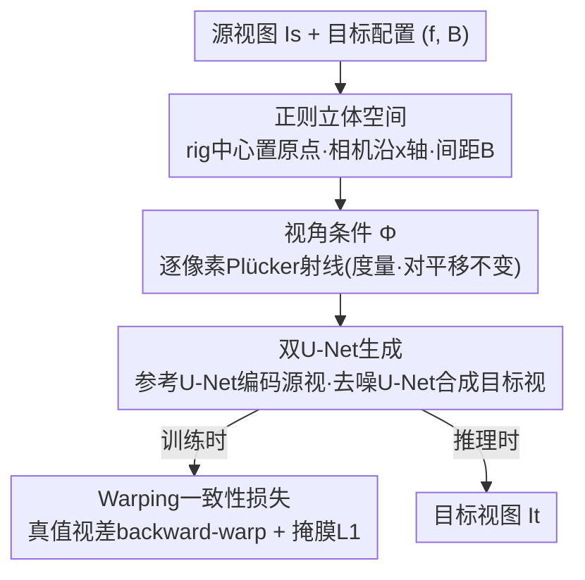

# StereoSpace: Depth-Free Synthesis of Stereo Geometry via End-to-End Diffusion in a Canonical Space

**会议**: CVPR 2026  
**arXiv**: [2512.10959](https://arxiv.org/abs/2512.10959)  
**代码**: https://hf.co/spaces/prs-eth/stereospace (项目页)  
**领域**: 3D视觉 / 新视角合成 / 扩散模型  
**关键词**: 单目转立体, 视角条件扩散, 正则化立体空间, Plücker射线, 免深度

## 一句话总结
StereoSpace 把"单目图像生成立体对"重新表述为**纯视角条件的扩散生成任务**——不估深度、不做显式 warp，而是把相机相对标定 $(f,B)$ 编码成一个度量化的"正则立体空间"喂给 Stable Diffusion，让模型端到端地推断对应关系并补全遮挡，在多层 / 非朗伯场景上显著超过 warp-and-inpaint、latent-warping、warped-conditioning 三类方法。

## 研究背景与动机
**领域现状**：把单目图转成立体对（左右眼图像）是 3D 影视 / VR / AR 把存量 2D 内容转 3D 的关键技术。当前主流做法几乎都走同一条捷径：先用单目深度估计器恢复深度，再按视差把像素 forward-warp 到右相机，最后用扩散先验把 warp 后的空洞 inpaint 掉。于是一个本质是 3D 生成的问题被降格成了"补洞"问题（warp-and-inpaint），另有 latent-warping（在扩散隐空间直接做视差平移）和 warped-conditioning（把 warp 后的坐标嵌入作为去噪条件）两类变体。

**现有痛点**：所有这些方法都把深度估计当作前置必需品，因此**继承了深度估计器的全部失败模式**。最严重的是**多层深度**场景——玻璃、透明 / 半透明表面、镜面反射时，单张视差图根本无法同时描述"玻璃本身"和"透过玻璃看到的背景墙"两个深度层，warp 会把背景物体错误地拖到前景层，inpaint 又只能在错误几何上补，导致几何漂移和补偿性模糊。

**核心矛盾**：单一视差图蕴含"场景只有一个连续表面"的假设，而真实世界普遍存在分层 / 非朗伯光学，二者根本冲突；只要 pipeline 里有"显式 warp"这一步，这个矛盾就绕不开。

**本文目标**：彻底去掉深度估计这个前置步骤，把立体生成做成**图像条件的 3D 生成**，并且要能让用户在推理时**直接以物理单位（cm）设定立体基线 $B$**，做到可预测的视角控制与跨基线泛化。

**切入角度**：在矫正（rectified）立体设置下，极线是水平的，视差只沿 x 轴变化——也就是说从源视到目标视的映射**完全由相对标定 $(f,B)$ 决定**，与相机在世界中的绝对位姿无关。关键变量是相机间几何，而非空间绝对位置。既然扩散模型已被证明能胜任稠密预测（深度 / 法向），它的表征能力也应足以直接学会立体视角合成。

**核心 idea**：把任意矫正立体对**重新表达到一个共享的、度量化的"正则立体空间"**里（立体装置中心固定在原点、两相机约束在 x 轴上、间距为基线 $B$），用视角条件（Plücker 射线）注入几何，让扩散模型端到端学出对应与补全——几何通过"条件变量 + 正则坐标系"注入，而非通过显式 3D 重建。

## 方法详解

### 整体框架
StereoSpace 接收一张矫正后的源视图 $I_s$ 和目标立体配置（焦距 $f$、度量基线 $B$），输出水平位移后的目标视图 $I_t$。整条流程的核心是把"几何"从一个需要显式重建的中间产物，变成一组喂给扩散模型的条件信号。

具体分三件事串起来：(1) **正则化**——把这一对立体相机的外参重写到共享坐标系（rig 中心在原点、相机沿 x 轴、间隔 $B$），使训练分布集中到"立体引起的外观变化 + 极线一致的对应"上，不必再解释任意世界位姿带来的变化；(2) **视角条件注入**——把目标相机的逐像素 Plücker 射线（编码内外参、对平移不变、保持度量）作为条件 $\Phi$ 注入扩散过程，从而支持以物理单位设基线、单模型跨多基线 / 多焦距工作；(3) **双 U-Net 生成 + 几何监督**——用从 Stable Diffusion 2.0 初始化的双 U-Net（参考分支编码源视语义、去噪分支合成目标视），并在训练时额外用源视真值视差通过可微 backward-warp 提供一致性监督。整个模型免深度估计器，几何只靠条件和正则坐标系。

### 关键设计

**1. 正则立体空间：把"绝对位姿"问题压成"相机间几何"问题**

痛点是：若直接让模型在世界坐标里合成视角，它得同时解释"相机在哪"和"立体怎么变"两件事，训练分布被无关的世界位姿稀释。StereoSpace 的做法是把任意矫正立体对的外参重新表达到一个固定坐标系——立体 rig 的中心钉在原点，两台相机被约束在 x 轴上、相距基线 $B$，所有相机只沿这条公共度量基线水平移动。这样一来，模型不再需要解释任意世界位姿带来的变化，可以把全部表征容量集中在"立体引起的外观改变"和"极线一致的对应关系"上。这正是利用了矫正立体的本质——源到目标的映射只由 $(f,B)$ 决定，与绝对位姿无关，所以"正则化掉绝对位姿"是无损的，却让学习问题大幅收窄。

**2. Plücker 射线视角条件：以物理单位精确控基线、且天然跨基线泛化**

正则空间需要一种"几何感知、保尺度"的方式告诉模型目标相机长什么样。本文把视角条件 $\Phi$ 实现为目标相机的**逐像素归一化 6D Plücker 向量**（矩 + 方向），它沿每条视线编码了内外参、对沿射线方向的平移保持不变 [30]。因为正则空间里距离保持度量，Plücker 射线也就保留度量结构，扩散过程拿到的是一个保尺度的目标相机描述——这直接带来两个好处：用户可以在推理时**直接用世界单位（cm）设定基线 $B$**，得到可预测的控制；同一个模型能在训练见过的多基线 / 多焦距间工作，并泛化到训练外配置，无需绑死某个标定 rig。作者强调方法不依赖具体参数化，PRoPE 式投影注意力、文本提示编码基线等都能替换（见消融），Plücker 只是默认选项（因为它显式暴露内参且省去额外文本编码器）。

**3. 双 U-Net + Plücker 双重注入：在语义保持与几何适配间取得可学习的分工**

立体生成既要保住源图的外观语义、又要按几何把像素"挪对"。本文沿用双 U-Net 扩散骨干 [59]：参考 U-Net 把源视编码成语义丰富的特征，去噪 U-Net 在这些特征的条件下合成目标视，二者通过端到端 cross-attention 让目标合成直接利用源视特征，从而在"语义保持 vs 几何适配"间形成天然权衡。两个 U-Net 都从 SD checkpoint 初始化以迁移大规模预训练的语义 / 结构先验。视角信息 $\Phi$ 以**两种方式同时注入**：通过 Adaptive Layer Normalization 注入两个 U-Net 的 ResNet 块，并 concat 到输入隐变量，让去噪过程能直接 attend 到底层 3D 射线配置。实现上把每个分支首层卷积改成 10 通道（4 维 VAE 隐变量 + 6 维 Plücker 射线），新通道零初始化以保住预训练权重；参考 U-Net 最高分辨率 up-block 冻结以稳住外观特征。

**4. Warping 一致性损失：只在训练期借真值视差注入几何，推理仍免深度**

本文与所有 warping 方法的根本区别在于——模型本身**不以视差为条件**，真值视差 $d_s$ 只在训练时作为监督注入显式几何。具体地，DDIM 采样在 $t=0$ 有干净样本的闭式解，可解释为预测的目标视图 $\widehat{I}_t$；先用结合 SSIM 与逐像素 $\ell_1$ 的光度损失监督它：

$$\mathcal{L}_{\mathrm{pix}}=\alpha\bigl(1-\mathrm{SSIM}(\widehat{I}_t,I_t)\bigr)+(1-\alpha)\,\|\widehat{I}_t-I_t\|_1$$

再定义可微 backward-warp 算子 $\mathcal{W}_{d_s}$，用源视真值视差 $d_s$ 和已知相机几何把 $\widehat{I}_t$ 映回源帧，配二值有效性掩膜 $M$（剔除出界 / 左右一致性检验失败的像素，避免惩罚遮挡与无效区），得到掩膜 $\ell_1$ 残差：

$$\mathcal{L}_{\mathrm{warp}}=\frac{1}{\|M\|_1}\,\big\|M\odot\big(\mathcal{W}_{d_s}(\widehat{I}_t)-I_s\big)\big\|_1$$

它的作用是给生成的目标视图施加一个"按几何回投应当与源图对齐"的硬约束，把场景几何显式注入学习，但因为只发生在训练期、推理时完全不需要视差或深度，模型整体仍是 depth-free。

### 损失函数 / 训练策略
总目标是速度参数化的扩散损失 $\mathcal{L}_{\mathrm{vel}}=\mathbb{E}[\|v-v_\theta(z_t,t;I_s,\Phi)\|^2]$ 加上上述两项：

$$\mathcal{L}_{\mathrm{total}}=\mathcal{L}_{\mathrm{vel}}+\lambda_{\mathrm{pix}}\mathcal{L}_{\mathrm{pix}}+\lambda_{\mathrm{warp}}\mathcal{L}_{\mathrm{warp}},\quad \lambda_{\mathrm{pix}}=1.0,\ \lambda_{\mathrm{warp}}=0.3$$

训练用约 750K 单基线立体对（12 个合成 / 真实数据集，如 TartanAir 306K、Dynamic Replica 145K、IRS 103K）混合，**关键差异是额外引入多基线数据**：NeRF-Stereo 的 27K 多视元组 + SceneSplat-7K 的 5K（从高斯泼溅恢复训练相机、约束虚拟视点在几何凸包内、按朝向聚类得到局部一致的极线组，再沿立体方向渲染短虚拟基线堆栈），每个元组含 5-7 个共基线方向的矫正视图、生成 10-21 个立体对，用来教模型"基线变化如何改变立体几何"。小数据集重采样到最大集的 10%、多基线元组按 $10\times\#\text{tuples}$ 加权以平衡。图像短边缩放并中心裁到 $768\times768$ 保住矫正几何；AdamW，lr $1\times10^{-5}$，有效 batch $6\times N_\text{GPU}$（$N_\text{GPU}=12$）；DDIM 速度参数化 + zero-SNR；推理 50 步、guidance scale 1.5。

## 实验关键数据

### 评测协议（本文的一个独立贡献）
作者指出现有协议两大问题：(1) 只用 PSNR/SSIM/LPIPS 这类光度指标，反而给"过平滑、把高频细节和深度边缘洗掉"的预测打高分；(2) 存在**测试期泄漏**——很多协议在推理时用真值视差作条件，等于免去了预测几何。本文改用两个正交的下游相关指标，并严格端到端评测（测试期不接触任何真值 / 代理几何）：

- **MEt3R（↓，几何一致性）**：用 DINO+FeatUp 把逐像素语义特征提升到 MASt3R 预测的共同 3D 帧，再重投影回两个视图，计算对称余弦相似度图 $S$，$\mathrm{MEt3R}(\mathbf{I}_1,\mathbf{I}_2)=1-\tfrac12\big(S(\mathbf{I}_1,\mathbf{I}_2)+S(\mathbf{I}_2,\mathbf{I}_1)\big)$。
- **iSQoE（↓，感知舒适度）**：一个在 VR 偏好数据上训练的立体 QoE 预测器，把左右对映射成单一标量。

为应对单目尺度歧义，对每个方法 / 场景做逐场景标定：粗到精搜索基线（本文）或深度-视差尺度，使生成立体对与真值在 SGBM 视差 RMSE 上最优对齐，再固定该尺度算所有指标，公平拉平各方法难度。

### 主实验（单层几何：Middlebury / DrivingStereo）

| 方法 | 类别 | 推理深度 | Middlebury iSQoE↓ | Middlebury MEt3R↓ | Driving iSQoE↓ | Driving MEt3R↓ |
|------|------|------|------|------|------|------|
| StereoDiffusion | warp-and-inpaint | DAv2 | 0.7475 | 0.1933 | 0.7887 | 0.1015 |
| ZeroStereo | latent warping | DAv2 | 0.7423 | 0.2057 | 0.7964 | 0.0798 |
| GenStereo | warped conditioning | DAv2 | 0.6933 | 0.1339 | 0.7850 | 0.0728 |
| Lyra | 3DGS 生成 | MoGe-2 | 0.7184 | 0.1163 | 0.7891 | 0.0949 |
| **StereoSpace** | **depth-free** | **无** | **0.6829** | **0.0893** | **0.7829** | **0.0717** |

Middlebury 上 MEt3R 相对 GenStereo 提升 >30%、相对 Lyra >20%；DrivingStereo 因驾驶场景几何更简单，各方法差距收窄但本文仍双指标最优。

### 多层 / 非朗伯几何（Booster / LayeredFlow）

| 方法 | Booster iSQoE↓ | Booster MEt3R↓ | LayeredFlow iSQoE↓ | LayeredFlow MEt3R↓ |
|------|------|------|------|------|
| StereoDiffusion | 0.7248 | 0.2011 | 0.8046 | 0.3074 |
| ZeroStereo | 0.7503 | 0.3171 | 0.8108 | 0.3630 |
| GenStereo | 0.6901 | 0.1457 | 0.7678 | 0.2275 |
| Lyra | 0.6989 | 0.1293 | 0.7802 | 0.1877 |
| **StereoSpace** | **0.6764** | **0.1013** | **0.7489** | **0.1619** |

在透明 / 分层场景上 StereoSpace **大幅领先**：这些场景违反 warping pipeline 的单表面假设，单视差图无法同时建模半透明层、镜面高光与视角相关反射，导致几何漂移与补偿模糊；把立体推理嵌进生成器则对非理想光学与分层几何鲁棒。

### 用户研究
70 名被试、1.4K 次成对比较。StereoSpace 对各方法的胜率、Bradley-Terry 胜率与排名都与 MEt3R/iSQoE 趋势一致：对最强对手 Lyra 约 60-40 取胜，其余方法明显落后。

## 消融实验要点

| 配置 | Middlebury iSQoE↓ | Middlebury MEt3R↓ | 说明 |
|------|------|------|------|
| GenStereo（基线） | 0.6933 | 0.1339 | 参照 |
| w/ text 条件 | 0.6841 | 0.0907 | 文本提示编码基线 |
| w/ Plücker（默认） | **0.6823** | 0.0901 | iSQoE 最优 |
| w/ PRoPE | 0.6865 | 0.0937 | 投影注意力注入相机视锥 |
| w/ Plücker+PRoPE | 0.6828 | 0.0945 | 叠加条件无增益 |
| wo/ multi-baseline | 0.6907 | 0.1095 | 去掉多基线数据，明显掉点 |
| w/ warping loss | 0.6829 | **0.0893** | MEt3R 最优，iSQoE 略降 |

### 关键发现
- **任意一种视角条件单独用就已超过 GenStereo**（iSQoE 和 MEt3R 都赢），说明"视角条件扩散"这个框架本身有效，而非靠某种特定参数化。
- **叠加条件没用**：Plücker 之上再加 PRoPE 不带来提升，说明这个 regime 里堆多种条件信号无益；Plücker 单用最好，且显式暴露内参、省一个文本编码器，故选作默认。
- **多基线数据贡献明显**：去掉 NeRF-Stereo/SceneSplat 后（语料退化到与 GenStereo 同级）两指标都明显变差，但仍优于 GenStereo——印证视角条件设计本身的鲁棒性。
- **warping loss 是几何 vs 舒适度的权衡**：开启后 MEt3R 取得最优（更强几何对齐），代价是 iSQoE 轻微下降——与"视差监督加强几何对齐但略损主观观看舒适度"的假设一致。
- **传统指标会误导**：定性图里 GenStereo 的 PSNR/SSIM 反而比本文高（因 depth-warping 与真值像素对齐更紧），但其前景背景错误重叠、阴影 / 遮挡明显失真——印证 PSNR/SSIM 不适合给此任务排感知真实度。

## 亮点与洞察
- **"几何即条件"而非"几何即中间产物"**：最核心的范式转变是把深度 / 视差从 pipeline 的显式步骤，降级为只在训练期出现的监督信号，推理时几何完全由 Plücker 条件 + 正则坐标系隐式承担——这让模型绕开了深度估计器的失败模式，尤其是单视差图无法表达的多层几何。
- **正则化是"无损降维"**：利用矫正立体"源→目标映射只由 $(f,B)$ 决定、与绝对位姿无关"这一事实，把绝对位姿正则化掉是数学上无损的，却把训练分布从"任意世界位姿 × 立体变化"压缩到只剩立体变化，是一个很漂亮的"先验即约束"设计，可迁移到其他有已知几何约束的条件生成任务。
- **度量基线控制**：因为 Plücker 在度量正则空间里保尺度，用户能直接以 cm 设基线、跨基线泛化，这对真实 3D 影视生产（不同屏幕 / 观看距离需不同视差）很实用。
- **评测协议本身是贡献**：iSQoE+MEt3R+严格端到端（杜绝真值视差泄漏）这套协议，戳破了"PSNR/SSIM 高 = 立体质量好"的假象，对整个单目转立体方向的公平评测有方法论价值。

## 局限性
- **依赖训练期真值视差**：warping loss 需要源视真值视差作监督，意味着训练数据必须有几何真值；虽然推理免深度，但训练对带视差 / 深度的合成 + 真实立体数据有较强依赖。
- **仅静态单帧立体**：方法面向单张图生成一对立体图，作者也指出未来才扩展到立体视频生成——当前不处理时序一致性。
- **多基线数据靠渲染合成**：多基线监督来自 NeRF-Stereo / 高斯泼溅渲染，其几何质量上限受这些 NVS 技术约束，渲染伪影可能被学进先验。
- **per-scene 标定才能比指标**：评测需逐场景搜最优基线 / 尺度来对齐真值，说明绝对度量尺度仍有歧义；实际部署时如何自动定标基线是开放问题。
- **改进思路**：把 warping loss 换成自监督光度一致性以摆脱真值视差依赖；引入时序注意力做立体视频；探索单图同时输出多基线立体堆栈以适配不同观看条件。

## 相关工作与启发
- **vs GenStereo（warped conditioning）**：GenStereo 仍依赖单目深度先验，在隐空间用 warp 后的标准坐标嵌入作条件，几何被深度估计器锁死；本文完全去掉 warp 与深度条件，靠视角条件端到端学几何。单层场景上本文 iSQoE/MEt3R 全面更优，多层场景优势更大（GenStereo 在玻璃栏杆处把墙上画作错误分裂到前景层）。
- **vs StereoDiffusion（latent warping）/ ZeroStereo（warp-and-inpaint）**：二者都把任务降成隐空间视差平移或补洞，前者产生过平滑单色补全（拉高像素相似度却伤观看舒适度），后者 inpaint 区域常不一致；本文在所有数据集上双指标领先，尤其多层场景大幅领先。
- **vs Lyra（3DGS 生成式 NVS）**：Lyra 是开放世界视频扩散自蒸馏的 feed-forward 3D 模型，靠模拟沿 x 轴小平移近似右视；其开放世界能力使它不针对立体设置特化，多数场景与 GenStereo 争第二，本文以 60-40 胜率领先。
- **启发**：把"已知几何关系"显式正则化进生成模型的条件，而不是让模型从头学几何，是处理结构化条件生成（立体 / 多视 / 可控相机）的有效范式；而"训练期用真值几何做硬约束、推理期纯条件驱动"的分工，也为"免昂贵中间表征"的生成式预测提供了通用模板。

## 评分
- 新颖性: ⭐⭐⭐⭐⭐ 把单目转立体从"warp+inpaint"彻底重构为"视角条件扩散 + 正则立体空间"，范式级转变且解决了多层几何这一硬骨头。
- 实验充分度: ⭐⭐⭐⭐ 四个真实数据集 + 三类基线 + 用户研究 + 自建无泄漏评测协议，覆盖单层 / 多层；略欠缺立体视频与真实采集立体的验证。
- 写作质量: ⭐⭐⭐⭐⭐ 动机推导清晰，正则空间 / Plücker / warping loss 三件套讲得自洽，对传统指标失效的剖析有说服力。
- 价值: ⭐⭐⭐⭐⭐ 直击 2D 转 3D 影视的真实痛点（透明 / 分层场景），度量基线控制与评测协议都有落地价值。

<!-- RELATED:START -->

## 相关论文

- [\[AAAI 2026\] FoundationSLAM: Unleashing the Power of Depth Foundation Models for End-to-End Dense Visual SLAM](../../AAAI2026/3d_vision/foundationslam_unleashing_the_power_of_depth_foundation_models_for.md)
- [\[CVPR 2026\] Fast3Dcache: Training-free 3D Geometry Synthesis Acceleration](fast3dcache_training-free_3d_geometry_synthesis_acceleration.md)
- [\[CVPR 2025\] End-to-End Implicit Neural Representations for Classification](../../CVPR2025/3d_vision/end-to-end_implicit_neural_representations_for_classification.md)
- [\[CVPR 2025\] End-to-End HOI Reconstruction Transformer with Graph-based Encoding](../../CVPR2025/3d_vision/end-to-end_hoi_reconstruction_transformer_with_graph-based_encoding.md)
- [\[CVPR 2025\] Rethinking End-to-End 2D to 3D Scene Segmentation in Gaussian Splatting](../../CVPR2025/3d_vision/rethinking_end-to-end_2d_to_3d_scene_segmentation_in_gaussian_splatting.md)

<!-- RELATED:END -->
