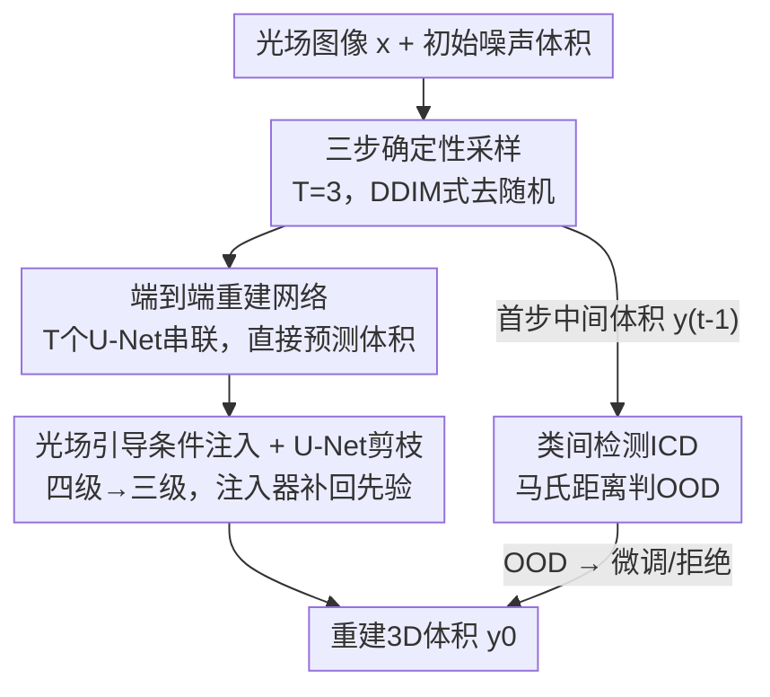

# Three-Step Conditional Diffusion 3D Reconstruction for Light-Field Microscopy

**会议**: CVPR 2026 (Findings)  
**arXiv**: [2605.24959](https://arxiv.org/abs/2605.24959)  
**代码**: 无  
**领域**: 3D视觉 / 扩散模型 / 计算成像  
**关键词**: 光场显微镜, 3D重建, 条件扩散, 确定性采样, 分布外检测

## 一句话总结
把扩散模型用于光场显微镜（LFM）的 3D 体积重建，通过 DDIM 式确定性采样把上百步反向去噪压到 3 步、并将整条采样轨迹改成端到端直接预测体积，再配上光场条件注入 + U-Net 剪枝的轻量骨干和一个类间检测（ICD）模块，做到推理快两个数量级（0.062s/样本）的同时重建精度（PSNR 41.72）超过现有 SOTA。

## 研究背景与动机
**领域现状**：光场显微镜（LFM）能用单次曝光（single-shot）捕获生物样本的多角度信息，支持对活体样本的实时体积成像，特别适合神经活动、胚胎发育、细胞动力学这类时间敏感的观测。从光场 2D 测量恢复 3D 体积，目前主要三条路线：① 基于波动光学的物理算法（如 Richardson-Lucy 反卷积 RLD），靠点扩散函数（PSF）矩阵迭代优化；② 学习类方法（VCDNet、LFMNet、CWFA），用神经网络直接把光场图映射到 3D 体积；③ 扩散模型（DDPM），用迭代去噪生成高保真结构。

**现有痛点**：物理算法可解释性强，但依赖精确光学建模和复杂迭代，难抗真实噪声、空间分辨率受限、伪影严重、计算开销极大（RLD 单样本推理 195s）。学习类方法推理快、精度也不错，但**泛化能力差**，换一种样本类型或成像条件就掉点。扩散模型生成质量高，但**采样要几百步**，DDPM 单样本推理 4.26s，根本无法用于实时 3D 成像——质量和效率之间存在天然 trade-off。

**核心矛盾**：扩散模型的高保真来自上百步的马尔可夫链迭代去噪，而实时成像要求毫秒级推理；同时纯 DDPM 只训练噪声估计器、推理时还要叠加随机噪声维持多样性，这对"确定的重建任务"既慢又引入不必要的随机性。

**本文目标**：让扩散模型既保住高保真重建，又快到能实时——具体拆成：把采样步数压到极少、把"预测噪声"改成"直接预测体积"、把骨干网络做轻、再加一个机制识别分布外样本以提升泛化稳定性。

**切入角度**：作者注意到 DDIM 的确定性采样可以跳过完整马尔可夫链；既然重建是确定性任务，干脆把"少步采样 + 去随机"推到极致——只用 3 步，并把这 3 步展开成一个端到端可训练的网络，让模型直接对最终重建目标做监督。

**核心 idea**：用"3 步确定性采样 + 端到端体积预测"重构扩散过程，配上光场条件注入的剪枝 U-Net，把扩散模型从"上百步生成器"改造成"快速精确的体积重建器"。

## 方法详解

### 整体框架
TCD（Three-Step Conditional Diffusion）的输入是光场图像 $\mathbf{x}$ 和一个初始噪声体积，输出是重建的 3D 体积 $\mathbf{y}_0 \in \mathbb{R}^{D\times H\times W}$。整条流程建立在 DDPM 的前向加噪/反向去噪范式上，但作者在三个地方做了根本性改造：① 把反向去噪从几百步压成 **3 步确定性采样**（DDIM 式，去掉随机项）；② 把这 3 步**展开成 T 个串联的 U-Net 模块组成的端到端网络**，训练目标从"预测噪声"换成"直接预测最终体积"；③ 把 U-Net 骨干**从四级剪枝成三级**减参，再用一个轻量的**光场条件注入器**把物理先验补回来弥补精度损失。此外，TCD 从首个去噪步产出的中间体积 $\mathbf{y}_{t-1}$ 分出一条 **ICD（类间检测）支路**，用马氏距离判定测试样本是否落在训练分布内，对分布外（OOD）样本触发微调或拒绝，提升泛化稳定性。

### 关键设计

**1. 三步确定性采样：把上百步去噪压成 3 步**

针对扩散模型"采样要几百步、推理 4s 起"的致命慢点，作者借鉴 DDIM 的确定性采样思路，用固定时间步的确定性更新替代随机噪声采样。每一步分两步走：先从当前噪声体积 $\mathbf{y}_t$ 和预测噪声 $\boldsymbol{\epsilon}_\theta$ 估出干净体积

$$\mathbf{y}_{0|t}=\frac{1}{\sqrt{\bar{\alpha}_t}}\left(\mathbf{y}_t-\sqrt{1-\bar{\alpha}_t}\cdot\boldsymbol{\epsilon}_\theta(\mathbf{y}_t,\mathbf{x},t)\right)$$

再把它重新加噪到上一时间步 $\mathbf{y}_{t-1}=\sqrt{\bar{\alpha}_{t-1}}\cdot\mathbf{y}_{0|t}+\sqrt{1-\bar{\alpha}_{t-1}}\cdot\boldsymbol{\epsilon}_\theta(\mathbf{y}_t,\mathbf{x},t)$。和 DDPM/DDIM 不同，整个过程构造出一个**确定性的等价反向过程**，绕开完整马尔可夫链，把采样重写成一个 3D 优化的展开网络。步数 $T=3$ 是实验定下来的最优折中（见消融）：相比 DDPM 减少 90%+ 采样开销，仍保住精度。

**2. 端到端重建网络：从"预测噪声"改成"直接预测体积"**

传统 DDPM 只训练噪声估计器 $\boldsymbol{\epsilon}_\theta$，推理时一步步去噪，误差会沿轨迹累积。作者把上面 3 步采样**展开成 T 个串联的 U-Net 模块** $F=F_1\circ F_2\circ\cdots\circ F_T$，每个 $F_t(\mathbf{y}_t,\mathbf{x},t)$ 对应一个完整采样步，整条采样轨迹一起优化。训练目标也从"逼近真噪声"换成直接对最终体积做重建监督：

$$\mathcal{L}_{\mathrm{recon}}=\left\|\mathbf{y}_{\mathrm{gt}}-\mathbf{y}_0\right\|_2^2$$

这等于把概率扩散和监督学习桥接起来——模型不再绕着"噪声"这个代理目标转，而是直接对准最终重建目标做端到端优化，表征能力和训练稳定性都更好。消融里这一项（Ours T=3, E2E）把 PSNR 从 DDPM-500 的 33.65 直接拉到 37.86，是涨点的主力。

**3. 光场引导条件注入 + U-Net 剪枝：减参 70% 又把精度补回来**

串联多个 U-Net 会让网络容量随模块数线性膨胀，显存和算力吃不消。作者先**把 U-Net 骨干从常规四级结构剪成三级**，参数量和计算大幅下降（消融里从 114.5M 降到 31.9M，约 −70%）。但剪枝会削弱表征能力、拉低保真度，于是再引入一个**紧凑的条件信息注入器**把物理先验补回来：条件编码器从光场输入 $\mathbf{x}$ 抽多尺度特征，经上采样、归一化、平均后形成条件嵌入 $\mathbf{c}_{\text{emb}}$，再通过轻量注入融进 U-Net 的隐藏特征图 $\mathbf{h}$：

$$\mathbf{y}_{\text{cond}}=\operatorname{SiLU}\big(\operatorname{Conv}(\mathbf{h})+\mathbf{c}_{\text{emb}}\big)$$

注入器只增加约 0.6M 参数，却恰好抵消了剪枝带来的精度损失——消融里"E2E+剪枝"是 37.64，再加注入器（完整模型）回到 38.41，几乎追平不剪枝的 38.46，但参数从 115.7M 压到 32.5M。剪枝降本、注入器保质，二者配合得到一个物理感知的高效去噪框架。

**4. 类间检测 ICD 模块：用马氏距离守住分布外样本**

学习类 LFM 重建默认测试样本和训练分布相近，但真实显微场景里光学设置、噪声水平、样本类型一变，泛化就崩。ICD 复用 TCD **首个去噪步产出的中间体积 $\mathbf{y}_{t-1}$**——它近似服从高斯分布且已含结构信息，适合做分布建模。对每个训练样本，计算 3D 体积的统计描述子（均值、标准差、方差、L1/L2 范数），把所有训练样本聚合成一个多元高斯 $p(\mathbf{f})=\mathcal{N}(\boldsymbol{\mu},\boldsymbol{\Sigma})$ 表示类间特征空间，训练后固定 $\boldsymbol{\mu}, \boldsymbol{\Sigma}$ 作为异常检测基线。测试时对输入算它到 ID 分布的马氏距离作为分数：

$$\text{Score}=D_M(\mathbf{f}_t)=\sqrt{(\mathbf{f}_t-\boldsymbol{\mu})^\top\boldsymbol{\Sigma}^{-1}(\mathbf{f}_t-\boldsymbol{\mu})}$$

阈值取训练样本马氏距离分布的某分位（如第 85 百分位）。$\text{Score}<\text{ths}$ 判为 ID，走标准 TCD 重建；否则标为潜在 OOD，触发"加入训练集微调"或"拒绝不可靠输出"。因为复用了 TCD 自己的中间体积，ICD 和 TCD 协同性很强，而把同样的 ICD 接到 LFMNet 上就分不开 ID/OOD。

### 损失函数 / 训练策略
核心训练目标即端到端重建损失 $\mathcal{L}_{\mathrm{recon}}=\|\mathbf{y}_{\mathrm{gt}}-\mathbf{y}_0\|_2^2$（MSE，直接监督最终体积）。前向加噪沿用 VP-SDE 的累积形式 $\mathbf{y}_t=\sqrt{\bar{\alpha}_t}\mathbf{y}_0+\sqrt{1-\bar{\alpha}_t}\cdot\boldsymbol{\epsilon}$；采样步固定 $T=3$。所有实验在单张 NVIDIA RTX 3090 上完成，训练耗时约 2.6h。数据由 5 类生物 3D 体积（Tubulin / Vessel / Mito / Dendrite / Bcell）裁剪重采样后，用基于物理的前向投影模拟生成光场图像作为监督对。

## 实验关键数据

### 主实验
五类生物结构上各自训练/测试的 PSNR/SSIM 对比（Table 1，加粗为最优）：

| 场景 | RLD | VCDNet | LFMNet | CWFA | DDPM | **TCD (本文)** |
|------|------|--------|--------|------|------|------|
| Tubulin | 27.60 / 0.749 | 35.58 / 0.981 | 36.28 / 0.979 | 34.44 / 0.686 | 34.32 / 0.966 | **38.41 / 0.985** |
| Vessel | 28.88 / 0.662 | 35.15 / 0.800 | 35.56 / 0.814 | 35.86 / 0.806 | 30.26 / 0.409 | **36.04 / 0.825** |
| Bcell | 37.02 / 0.773 | 40.60 / 0.786 | 47.49 / 0.972 | 33.63 / 0.629 | 41.03 / 0.875 | **47.54 / 0.981** |
| Mito | 42.05 / 0.926 | 35.96 / 0.643 | 44.99 / 0.949 | 33.19 / 0.679 | 38.20 / 0.889 | **45.77 / 0.957** |
| Dendrite | 35.59 / 0.724 | 35.58 / 0.570 | 37.60 / 0.866 | 30.87 / 0.735 | 37.79 / 0.808 | **38.85 / 0.872** |

TCD 在全部 5 类场景的 PSNR 和 SSIM 上都取得最优。效率对比（Table 3，五类平均）：

| 方法 | PSNR↑ | SSIM↑ | 训练(h)↓ | 参数(M)↓ | 推理(s)↓ |
|------|-------|-------|---------|---------|---------|
| RLD | 34.63 | 0.767 | — | — | 194.991 |
| VCDNet | 36.17 | 0.756 | 2.0 | 18.8 | 0.042 |
| LFMNet | 40.38 | 0.916 | 2.0 | 22.0 | 0.021 |
| CWFA | 33.20 | 0.707 | 2.6 | 43.5 | 0.214 |
| DDPM | 36.32 | 0.789 | 2.2 | 37.9 | 4.256 |
| **TCD (本文)** | **41.72** | **0.924** | 2.6 | 32.5 | 0.062 |

精度领先所有方法的同时，推理比 DDPM 快约 68 倍（4.256s → 0.062s），比 RLD 快三千多倍；推理速度虽不及最轻的 LFMNet（0.021s），但精度高 1.3+ dB。跨样本泛化（Table 2）：在 Dendrite 单数据集训练做跨样本测试时 TCD 取得最优/次优；在五类混合数据集训练时则全面领先（如混合训练下 Tubulin 达 37.861/0.965，远超 VCDNet 33.977/0.690）。

### 消融实验
在 Tubulin 上逐组件消融（Table 4；EPI = 边缘保持指数 ↑，越高边缘越锐利；LPIPS ↓ 为学习感知相似度）：

| 配置 | T | E2E | 注入 | 剪枝 | PSNR | SSIM | EPI | Inf.(s) | Param.(M) |
|------|---|-----|------|------|------|------|-----|---------|-----------|
| DDPM | 500 | ✗ | ✗ | ✗ | 33.65 | 0.961 | 0.673 | 5.101 | 37.9 |
| DDIM | 50 | ✗ | ✗ | ✗ | 33.17 | 0.957 | 0.649 | 0.552 | 37.9 |
| Ours | 3 | ✓ | ✗ | ✗ | 37.86 | 0.971 | 0.879 | 0.076 | 114.5 |
| Ours | 3 | ✓ | ✗ | ✓ | 37.64 | 0.963 | 0.865 | 0.062 | 31.9 |
| Ours | 3 | ✓ | ✓ | ✗ | 38.46 | 0.985 | 0.893 | 0.075 | 115.7 |
| **Ours (Full)** | 3 | ✓ | ✓ | ✓ | 38.41 | 0.985 | 0.892 | 0.062 | 32.5 |

### 关键发现
- **端到端 + 3 步采样是涨点主力**：从 DDPM-500 的 33.65 到 Ours(T=3,E2E) 的 37.86，PSNR 涨 4.2 dB，同时推理从 5.1s 降到 0.076s（两个数量级加速），证明"直接预测体积 + 确定性少步"对重建任务远优于"预测噪声 + 长链随机采样"。
- **剪枝降本、注入补质，二者必须配对**：单独剪枝（31.9M）会把 PSNR 从 37.86 拉到 37.64；加上注入器后完整模型回到 38.41、参数仍只有 32.5M（相比不剪枝的 115.7M 减约 72%），注入器仅 +0.6M 就抵消了剪枝损失。
- **步数 T=3 是甜区**：$T<3$ 时重建质量随步数显著上升，$T>3$ 后增益饱和而计算近线性增长，故选 $T=3$。
- **ICD 与 TCD 强协同**：以 Bcell 为 ID，TCD+ICD 能有效区分大多数 ID/OOD 样本，而 LFMNet+ICD 分不开；ICD 引导的微调把达到 $10^{-3}$ 损失的时间相比从头训练缩短约一半。

## 亮点与洞察
- **把扩散模型"逆向用"成确定性重建器**：扩散本是为生成多样性服务（靠随机项），而重建要的是确定性——本文干脆去掉随机、压到 3 步、把整条轨迹展开成端到端网络直接监督最终体积，这一"反着用扩散"的视角是首次进入 LFM 3D 重建，很值得借鉴到其他确定性逆问题（去模糊、超分、CT 重建）。
- **剪枝 + 轻量条件注入的"减一加一"组合拳很优雅**：先大刀剪枝省 70% 参数，再用 0.6M 的注入器把物理先验精准补回，几乎零精度损失换来巨大省本，是把"压缩"和"先验注入"配对使用的好范例。
- **OOD 检测复用扩散中间产物零额外成本**：ICD 直接拿首步去噪体积 $\mathbf{y}_{t-1}$（已近高斯）做马氏距离，不需要额外网络或前向，"顺手"实现分布监测——这种"复用管线中间态做副任务"的思路可迁移到任何带迭代过程的模型。

## 局限与展望
- 作者承认 **ICD 模块尚不通用**，目前和 TCD 强绑定，接到别的模型（如 LFMNet）就失效，还没建立更通用的重建管线。
- 对**大尺度/宏观生物结构**的重建适配仍待优化（未来方向之一）。
- 训练**未显式引入物理模型约束**（如 PSF 建模、光学先验），作者提出未来可在无监督/弱监督下加入以进一步提精度和鲁棒性。
- 自己发现的局限：$T=3$ 是在 Tubulin 上凭实验定的经验值，是否对所有样本类型都最优、对更复杂结构是否需要更多步，缺乏跨场景的步数敏感性分析；测试集仅各类取 5 个典型样本，规模偏小；光场图像由物理前向投影"仿真"得到而非真实采集，真实噪声/标定误差下的表现需进一步验证。

## 相关工作与启发
- **vs 物理算法 RLD/ADMM**: 它们靠波动光学 + PSF 矩阵迭代优化，可解释但抗噪差、分辨率受限、推理极慢（RLD 195s）；TCD 用数据驱动的扩散网络，精度和速度全面碾压，代价是失去显式物理可解释性（作者也把"加 PSF 约束"列为未来方向）。
- **vs 学习类 VCDNet/LFMNet/CWFA**: 它们直接回归映射、推理快，但泛化弱；TCD 借扩散的迭代去噪 + ICD 分布监测，把跨样本/混合训练的泛化拉起来，混合训练下显著领先。LFMNet 推理更快（0.021s）但精度低约 1.3 dB，且无法和 ICD 协同。
- **vs DDPM/DDIM**: DDPM 几百步、推理 4.26s 且 SSIM 在某些场景崩（Vessel 仅 0.409）；DDIM 50 步仍 0.552s 且精度不如本文。TCD 把步数压到 3、去掉随机项、改端到端体积监督，在精度（+4.2 dB over DDPM-500）和速度（两个数量级）上同时胜出。
- **vs 通用 OOD 检测 ODIN / Mahalanobis**: 它们在常规 CV 任务有效，但直接用在高维光场数据 + 复杂光学条件下不稳；ICD 把马氏距离接到扩散中间体积上，针对 LFM 重建定制，和主干天然协同。

## 评分
- 新颖性: ⭐⭐⭐⭐ 首次把扩散模型引入 LFM 3D 重建，"3 步确定性 + 端到端体积监督"的改造视角清晰；单看组件（DDIM 少步、剪枝、条件注入、马氏 OOD）多为已知技术的组合。
- 实验充分度: ⭐⭐⭐⭐ 五类样本 + 单/混合训练 + 效率 + 逐组件消融 + ICD 都覆盖，结论自洽；但测试集偏小、光场为仿真生成、缺真实采集验证。
- 写作质量: ⭐⭐⭐⭐ 公式与流程交代清楚，图表配套；个别地方（确定性采样的"等价反向过程"推导）略简。
- 价值: ⭐⭐⭐⭐ 把扩散重建做到 0.062s/样本且精度 SOTA，对实时活体显微成像有实用价值，"反向用扩散做确定性逆问题"的范式可迁移性强。

<!-- RELATED:START -->

## 相关论文

- [\[NeurIPS 2025\] From Pixels to Views: Learning Angular-Aware and Physics-Consistent Representations for Light Field Microscopy](../../NeurIPS2025/3d_vision/from_pixels_to_views_learning_angular-aware_and_physics-consistent_representatio.md)
- [\[CVPR 2026\] Neural Field-Based 3D Surface Reconstruction of Microstructures from Multi-Detector Signals in Scanning Electron Microscopy](neural_field-based_3d_surface_reconstruction_of_microstructures_from_multi-detec.md)
- [\[ICLR 2026\] LiTo: Surface Light Field Tokenization](../../ICLR2026/3d_vision/lito_surface_light_field_tokenization.md)
- [\[CVPR 2025\] ProbeSDF: Light Field Probes for Neural Surface Reconstruction](../../CVPR2025/3d_vision/probesdf_light_field_probes_for_neural_surface_reconstruction.md)
- [\[CVPR 2026\] EMGauss: Continuous Slice-to-3D Reconstruction via Dynamic Gaussian Modeling in Volume Electron Microscopy](emgauss_continuous_slice-to-3d_reconstruction_via_dynamic_gaussian_modeling_in_v.md)

<!-- RELATED:END -->
