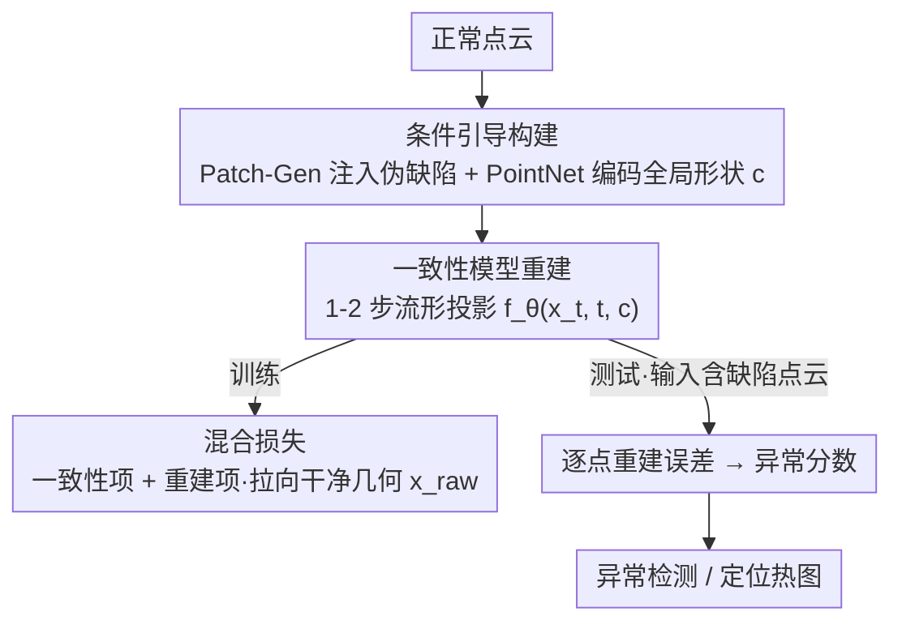

# Two Steps Are All You Need: Efficient 3D Point Cloud Anomaly Detection with Consistency Models

**会议**: CVPR 2026  
**arXiv**: [2605.05372](https://arxiv.org/abs/2605.05372)  
**代码**: 无  
**领域**: 3D视觉 / 工业异常检测 / 生成模型  
**关键词**: 点云异常检测, 一致性模型, 重建式检测, 边缘部署, 扩散加速

## 一句话总结
把扩散式 3D 点云异常检测重述为「单步流形投影」问题，用一致性模型（consistency model）配合一种显式把重建拉向干净几何的混合损失，把推理从几十步迭代降到 1–2 步前向，在 Raspberry Pi / Jetson Nano 这类无 GPU 设备上比 SOTA（R3D-AD）快约 80×，同时在 Anomaly-ShapeNet 上还反超 1.3% I-AUROC。

## 研究背景与动机
**领域现状**：3D 点云异常检测（工业质检的核心环节）目前的强势路线是「重建式」——只用正常样本训练一个生成模型，测试时让它把含缺陷的点云"修复"成一个无异常版本，再用输入与重建之间的逐点误差作为异常分数来定位缺陷。其中扩散模型路线（代表作 R3D-AD）效果最好：直接在点云上跑 PointNet backbone，迭代地预测逐点修正，并用 Patch-Gen 合成训练用的缺陷样本。

**现有痛点**：扩散模型天生被「迭代去噪」卡住——一次推理要跑几十甚至上百步网络前向。这让现有 3D 方法几乎都默认有 GPU 级硬件、离线处理，被困在学术实验室里。作者强调：到本文写作时，还没有任何方法专门为「低延迟、资源受限的边缘设备」设计。可实测下来 R3D-AD 在 Raspberry Pi 4 上单样本要 **424 秒**，对高吞吐在线质检完全不可用。

**核心矛盾**：重建式检测的精度依赖一个表达力够强的生成模型把缺陷"抹平"，而表达力强的扩散模型又必须靠多步迭代——**精度与推理延迟之间被去噪步数死死绑定**。要上边缘设备，就得在不退回到弱生成器的前提下砍掉迭代。

**本文目标**：在保持重建质量（从而保持检测精度）的同时，把推理压到一两步前向，使其能跑在无 GPU 的边缘平台上。

**切入角度**：一致性模型（Song et al.）本就是为「绕过迭代去噪」而生的——它在概率流 ODE（PF-ODE）的任意噪声点上直接学一个映射到干净数据的函数，因此天然支持单步/少步采样。作者的观察是：异常检测里"把缺陷点云投影回正常流形"恰好就是一致性模型擅长的「一步投影」，二者动机高度契合。

**核心 idea**：把异常检测重述为「单步流形投影」，用条件引导的一致性模型替换扩散去噪；并额外设计一个混合损失，显式逼模型重建到"干净点云"而非"自洽地复刻输入"，从而既快又干净。

## 方法详解

### 整体框架
CM3D-AD（Consistency Models based 3D Anomaly Detection）整体仍是"训练学正常 → 测试看重建残差"的重建式范式，只是把生成器从扩散换成一致性模型。**训练阶段**：先用 Patch-Gen 在正常点云上注入局部几何扰动造出伪缺陷样本，把它送进 PointNet 编码器得到一个全局形状嵌入 $c$ 作为条件，再让一致性模型在 Karras 噪声调度下学会"无论从哪个噪声水平出发，都把点云一步映射回干净几何"——这一步的关键是混合损失：既要满足一致性（同一条 ODE 轨迹上相邻时刻的预测要一致），又要把两个网络的输出都直接拉向"干净点云" $x_{\text{raw}}$。**测试阶段**：把含缺陷点云喂给训练好的网络，用两步采样得到一个无异常重建，逐点计算输入与重建的误差当作异常分数，定位缺陷区域（I-AUROC 打分时用 FAISS 最近邻 scorer）。

### 关键设计

**1. 条件引导构建：Patch-Gen 伪缺陷 + 全局形状编码，让模型"只学正常、又懂整体"**

重建式检测有两个先天难题：训练集里没有缺陷样本（无监督）；以及模型必须"看懂物体整体形状才能判断哪里不对"。作者用两个组件一起解决。其一是沿用 R3D-AD 的 Patch-Gen 在正常点云上合成缺陷：随机选一个枢轴点 $\mathcal{P}_v$，沿法向把局部一簇点鼓起来，$\mathcal{P}_n = \mathcal{P}_n + S\cdot\mathrm{normalize}(\mathcal{P}_n-\mathcal{P}_v)\odot\mathcal{T}$，其中 $S$ 是缩放超参、$\mathcal{T}$ 是高斯平移矩阵——这样就有了"缺陷输入 / 干净目标"的成对训练样本。其二是把这个（带缺陷的）点云过一个联合训练的 PointNet 编码器得到全局形状嵌入 $c$，作为一致性网络的条件。作者特别指出：受隐空间瓶颈维度限制，$c$ 学到的是**全局几何、对局部扰动（即异常）不敏感**——这正是想要的，它告诉网络"这个物体大体长什么样"，但不会把缺陷信息也编进去，否则网络就会照着缺陷重建了。

**2. 一致性模型重建：把异常检测变成 1–2 步的流形投影**

这是延迟瓶颈的正面解法。扩散依赖沿 PF-ODE 的多步去噪，而一致性模型学的是从轨迹上任意噪声点 $\mathbf{x}_t$ 直接映射到干净数据的函数，因此一步或两步就能采样。作者采用从零训练的一致性训练范式（consistency training，**不需要**预训练扩散模型做师生蒸馏），用在线网络 $f_\theta$ 和 EMA 目标网络 $f_{\theta^-}$ 两套权重；$f_\theta$ 是带 6 层 ConcatSquashLinear 的 PointwiseNet。噪声调度用 Karras 的非线性插值 $t_i=\big(T^{1/\rho}+\frac{i}{N-1}(\epsilon^{1/\rho}-T^{1/\rho})\big)^{\rho}$（$\rho=7$，把更多步集中在低噪声端）；网络按一致性模型的边界条件参数化为 $f_\theta(x,t,c)=c_{\text{skip}}(t)\cdot x+c_{\text{out}}(t)\cdot F_\theta(c_{in}\cdot x,t,c)$，三个系数（式 8–10）保证在 $t=\epsilon$ 处输出恰好等于输入、在高噪声端平滑过渡，其中 $\sigma_{\text{data}}$（取 0.5）平衡"贴近噪声输入"与"贴近干净重建"。采样用两步策略：作者实测**两步显著优于单步，但超过两步只有边际提升**（消融 4.6.2 验证），这正是标题"Two Steps Are All You Need"的来源。

**3. 混合损失：显式把重建拉向"干净几何"，而非自洽地复刻输入**

这是本文真正的新意所在。标准一致性训练只约束"同一轨迹上相邻时刻的两个预测要一致"（consistency loss），但一致性本身并不规定收敛到哪——直接套用的话，模型很可能自洽地把"含缺陷的输入"原样重建出来，那异常残差就消失了，检测失效。作者因此提出混合损失 $\mathcal{L}_{\text{Hybrid}}=\mathcal{L}_{\text{CT}}(\theta,\theta^-)+\lambda\cdot\mathcal{L}_{\text{Recons}}$（实验中 $\lambda=1$）。其中一致性项 $\mathcal{L}_{\text{CT}}=\lambda(t)\,d\big(f_\theta(\mathbf{x}_{t_{n+1}},t_{n+1},c),\,f_{\theta^-}(\mathbf{x}_{t_n},t_n,c)\big)$ 用 L2 距离、时间权重 $\lambda(t)=\frac{1}{t^2}+\frac{1}{\sigma_{\text{data}}^2}$；重建项 $\mathcal{L}_{\text{Recons}}=\mathcal{L}_{\text{Online}}+\mathcal{L}_{\text{Target}}$ 是把**在线网络和 EMA 目标网络的输出都对齐到干净点云** $x_{\text{raw}}$ 的 MSE（式 15–16）。关键就在于重建项的监督目标是 $x_{\text{raw}}$（无异常版本）而不是带噪输入——这等于强行把"投影终点"钉在正常流形上，逼模型把缺陷抹掉。消融显示：只保留单边重建项（$\mathcal{L}_{\text{CT}}+\mathcal{L}_{\text{Online}}$ 得 0.725、$+\mathcal{L}_{\text{Target}}$ 得 0.689）都不如同时监督两个网络的完整版（0.762），说明同时把两套权重都拉向干净几何确实更有效。

### 损失函数 / 训练策略
- **总损失**：$\mathcal{L}_{\text{Hybrid}}=\mathcal{L}_{\text{CT}}+\lambda\cdot(\mathcal{L}_{\text{Online}}+\mathcal{L}_{\text{Target}})$，$\lambda=1$，距离度量用 L2。
- **自适应调度 + EMA**：噪声级数 $N(k)$ 随训练步 $k$ 从 $s_0{=}2$ 涨到 $s_1{=}1025$（早期粗、后期细）；目标网络按自适应衰减 $\mu(k)=\exp\!\big(\frac{s_0\log\mu_0}{N(k)}\big)$（$\mu_0=0.95$）做 EMA 更新。
- **关键超参**：学习率 $2{\times}10^{-4}$ 起、前 1 万步恒定，随后 79 万步退火到 $5{\times}10^{-6}$，末 1 万步恒定，共 80 万步/类别；$T{=}80.0$、$\epsilon{=}0.002$、$\rho{=}7$、batch 128。点云先归一化到 $[-1,1]$ 并据此设 $\sigma_{\text{data}}{=}0.5$。
- **训练成本**：2× A100(40GB)，Anomaly-ShapeNet 每类约 3.5 GPU 小时、Real3D-AD 每类约 5.5 小时，混合精度 BF16/FP32。

## 实验关键数据

### 主实验
在 Anomaly-ShapeNet（40 类、1,600 样本，6 种缺陷类型）与 Real3D-AD（12 类工业高精样本）上，以 image-level AUROC（I-AUROC）评测，主要对标 SOTA 扩散方法 R3D-AD：

| 数据集 | 指标 | CM3D-AD（本文） | R3D-AD（SOTA） | 差距 |
|--------|------|------|----------|------|
| Anomaly-ShapeNet | 平均 I-AUROC | **0.762** | 0.749 | +1.3% |
| Real3D-AD | 平均 I-AUROC | 0.728 | **0.734** | −0.6% |

边缘设备效率对比（Table 2，无 GPU 加速下的实测）：

| 平台 | 指标 | CM3D-AD | R3D-AD | 提升 |
|------|------|---------|--------|------|
| — | 模型大小 | 20.91 MB | 17.01 MB | 略大 |
| — | FLOPs | 1.721×10⁹ | 135.039×10⁹ | **78× 更少** |
| Raspberry Pi 4 | 单样本延迟 | 6.34s | 424.51s | **≈80× 更快** |
| Raspberry Pi 4 | RAM | 305.5 MB | 487.9 MB | 省约 180 MB |
| Jetson Nano | 单样本延迟 | 1.91s | 101.32s | **≈53× 更快** |
| Jetson Nano | RAM | 555 MB | 1022 MB | 省约 467 MB |

要点：CM3D-AD 用 2 步采样换来一两个数量级的延迟/显存下降，I-AUROC 基本不掉（ShapeNet 还涨），Pareto 前沿全面占优。

### 消融实验
| 配置 | 平均 I-AUROC | 说明 |
|------|---------|------|
| $\mathcal{L}_{\text{CT}}+\mathcal{L}_{\text{Online}}$ | 0.725 | 只监督在线网络 |
| $\mathcal{L}_{\text{CT}}+\mathcal{L}_{\text{Target}}$ | 0.689 | 只监督 EMA 目标网络 |
| $\mathcal{L}_{\text{Hybrid}}$（完整） | **0.762** | 同时监督两个网络 |
| 单步采样 | 较差 | 重建质量明显更弱（图 2/图 5） |
| 两步采样 | 最优 | 显著优于单步 |
| >两步 | ≈两步 | 仅边际提升 |

跨类/跨数据集泛化（Table 5）：同数据集换类别（ashtray0→bowl1）仍达 0.815 I-AUROC、(headset0→headset1) 0.725；Real3D-AD 训练的模型迁到 ShapeNetCore.v2 同类物体上 Chamfer 距离低至 0.016–0.032，显示重建能力可泛化。

### 关键发现
- **混合损失的两个重建项缺一不可**：去掉任一边都掉点（0.725 / 0.689 vs 0.762），说明把两套权重都钉向干净几何比只靠一致性约束更有效。
- **两步是甜点**：单步重建质量不足、>两步收益边际，验证了标题主张，也是延迟可压到极低的根本原因。
- **效率收益几乎免费**：80×/53× 的加速并未带来有意义的 AUROC 退化，瓶颈纯粹来自扩散的迭代去噪而非模型容量。

## 亮点与洞察
- **把"加速生成器"的技术红利精准接到"异常检测"上**：一致性模型本是为图像快速采样而生，作者识别出"异常检测=往正常流形做一步投影"与一致性模型"一步映射到干净数据"的同构性，迁移得很自然——这种"任务重述以匹配高效工具"的思路可复用到其它重建式检测（如 2D 工业质检、医学异常）。
- **混合损失是点睛之笔**：纯一致性训练会自洽地复刻输入（连缺陷一起重建），检测就废了；把重建项的监督目标显式设成 $x_{\text{raw}}$（干净版本）而非带噪输入，是让"快"不以"准"为代价的关键，思路简单但击中要害。
- **真·边缘友好**：作者没停在理论 FLOPs，而是真把模型搬上 Raspberry Pi 4 / Jetson Nano 实测延迟、RAM、CPU/GPU 占用，对工业落地很有说服力。

## 局限与展望
- **Real3D-AD 上轻微掉点**（−0.6%）：在更高分辨率、更真实的工业样本上，两步重建相比多步扩散略有精度损失，对极端高精质检场景是否够用需进一步验证。
- **依赖 Patch-Gen 合成缺陷**：训练用的伪异常是几何鼓包式扰动，与真实缺陷形态（裂纹、孔洞、弯折等更复杂形貌）的分布差异可能限制对某些缺陷类型的敏感度；论文未深入分析不同缺陷类型上的逐类表现差异。
- **打分仍依赖最近邻 scorer**：I-AUROC 评测用 FAISS-NN 在训练集里检索，意味着部署时仍需保留正常样本库，内存与该库规模相关，纯重建残差能否完全替代值得探究。
- **模型略大于 R3D-AD**（20.91 MB vs 17.01 MB）：参数量上并不占优，效率优势完全来自步数而非模型瘦身，未来可结合压缩进一步降本。

## 相关工作与启发
- **vs R3D-AD（扩散式 SOTA）**：两者同为点云上的重建式检测、都用 Patch-Gen 造缺陷、都基于 PointNet。区别在于 R3D-AD 用迭代扩散去噪（几十步），本文用一致性模型（1–2 步）+ 混合损失把重建钉向干净几何。本文优势是延迟/显存低一两个数量级、ShapeNet 还略胜；劣势是 Real3D-AD 略低、模型稍大。
- **vs 记忆库类方法（M3DM / PatchCore / Reg3D-AD）**：它们靠把测试特征与正常 patch 记忆库比对来检测，需要维护并检索大特征库；本文是生成-重建路线，检测信号来自重建残差，在两个 benchmark 上平均 I-AUROC 明显更高（如 ShapeNet 0.762 vs 0.55–0.57）。
- **vs 图像扩散一致性模型（Song et al.）**：本文把一致性训练、Karras 调度、EMA 目标网络等成熟范式迁到 3D 点云，核心增量是面向异常检测语义的混合损失与"全局形状条件 + 局部不敏感"的编码设计。

## 评分
- 新颖性: ⭐⭐⭐⭐ 一致性模型迁到点云本身是已有工具的组合，但"重述为单步流形投影 + 混合损失把重建拉向干净几何"的设计针对异常检测确有原创点。
- 实验充分度: ⭐⭐⭐⭐ 双 benchmark 逐类 I-AUROC + 真实边缘设备多维效率实测 + 损失/采样步数消融 + 跨类跨数据集泛化，较完整；缺逐缺陷类型细分与分割级指标。
- 写作质量: ⭐⭐⭐⭐ 动机与方法清晰，公式与算法伪代码完整，标题点题。
- 价值: ⭐⭐⭐⭐⭐ 把扩散式 3D 质检从"实验室 GPU"真正推到"无 GPU 边缘设备"，80× 加速且精度不退，工业落地价值高。

<!-- RELATED:START -->

## 相关论文

- [\[CVPR 2026\] APC: Transferable and Efficient Adversarial Point Counterattack for Robust 3D Point Cloud Recognition](apc_adversarial_point_counterattack.md)
- [\[CVPR 2026\] ConsisVLA-4D: Advancing Spatiotemporal Consistency in Efficient 3D-Perception and 4D-Reasoning for Robotic Manipulation](consisvla-4d_advancing_spatiotemporal_consistency_in_efficient_3d-perception_and.md)
- [\[ICCV 2025\] Efficient Spiking Point Mamba for Point Cloud Analysis](../../ICCV2025/3d_vision/efficient_spiking_point_mamba_for_point_cloud_analysis.md)
- [\[ICML 2026\] SIMPC: Learning Self-Induced Mirror-Point Consistency for Unsupervised Point Cloud Denoising](../../ICML2026/3d_vision/simpc_learning_self-induced_mirror-point_consistency_for_unsupervised_point_clou.md)
- [\[CVPR 2026\] Foundry: Distilling 3D Foundation Models for the Edge](foundry_distilling_3d_foundation_models_for_the_edge.md)

<!-- RELATED:END -->
