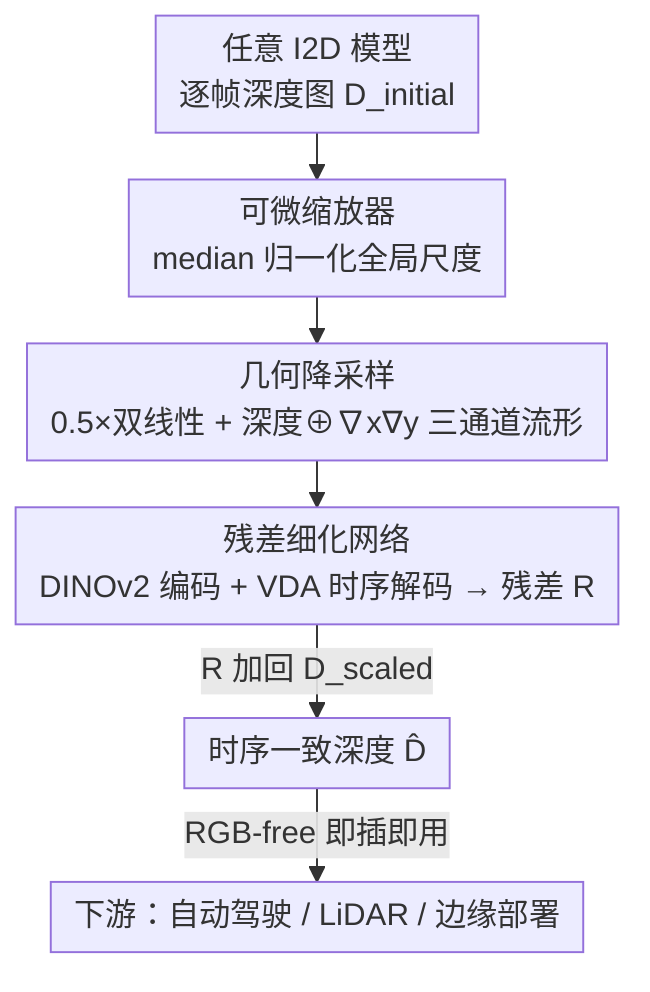

# VDPP: Video Depth Post-Processing for Speed and Scalability

**会议**: CVPR2026  
**arXiv**: [2604.06665](https://arxiv.org/abs/2604.06665)  
**代码**: https://github.com/injun-baek/VDPP  
**领域**: 3D视觉 / 视频深度估计  
**关键词**: 视频深度估计、后处理、残差学习、几何细化、边缘部署

## 一句话总结
VDPP 把"视频深度稳定"从重量级的场景重建任务重构成**纯几何的残差修正**任务——在低分辨率深度图上用"深度+法向"三通道表征做残差细化，不依赖 RGB，从而以 >43.5 FPS（Jetson Orin Nano）的速度即插即用地给任意单图深度模型补上时序一致性，精度和时序稳定性追平端到端 SOTA。

## 研究背景与动机
**领域现状**：视频深度估计要从 2D 视频里恢复时序一致的 3D 结构，是自动驾驶、机器人、混合现实的基础能力。目前性能最强的是端到端（E2E）模型，如 Video Depth Anything（VDA），它把空间精度和时序稳定性都做到了 SOTA。

**现有痛点**：E2E 模型是"紧耦合"系统，带来两个硬伤。其一是**适配滞后（adaptation lag）**：单图深度估计器（I2D，如 Depth Anything V2）日新月异，但每出一个更强的 I2D，E2E 框架都无法直接吸收，必须全量重训才能升级 backbone，代价高昂。其二是**算力过重**：注意力的显存随分辨率平方增长 $(H\times W)^2$，在 Jetson 这类边缘设备上直接 OOM 跑不起来。而最朴素的替代——逐帧跑 I2D——空间精度高，但帧间完全没有时序约束，会产生严重的闪烁（flickering）。

**核心矛盾**：插件式的后处理方法（如 NVDS）本来是为了解耦——把"视频稳定"和"单帧深度估计"拆开，从而能即插即用地接入任意 I2D。但现有后处理方法慢、糙、依赖 RGB：NVDS 推理时间比 E2E 长一个数量级，空间细节还退化，且必须读 RGB，在隐私敏感或纯深度传感器（LiDAR/ToF）场景下用不了。于是后处理在"速度、精度、实用性"上都没追上 E2E，沦为鸡肋。

**本文目标 / 切入角度**：作者的关键观察是——**逐帧深度图本身的 3D 结构已经基本正确，只是时序上不稳定**。所以根本不需要"从颜色上下文重建整个 3D 场景"，只需要"修正不稳定的那部分几何"。这把任务从"视频重建问题"降维成"结构修正问题"。

**核心 idea**：用**低分辨率几何空间里的残差学习**代替**全分辨率 RGB 场景重建**，在深度+法向的几何流形上预测一张残差图加回去，做到 RGB-free、轻量、即插即用。

## 方法详解

### 整体框架
VDPP 是一条纯后处理流水线：输入是任意 I2D 模型逐帧产出的深度图 $D_{\text{initial}}^{(t)}$，输出是时序一致的精修深度 $\hat{D}^{(t)}$，全程不碰 RGB。流水线分三步走——先用可学习的**可微缩放器**把每帧的全局尺度对齐（消除尺度漂移这一主要闪烁源），再把尺度归一化后的深度图**降采样**并拼成"深度+法向"的**三通道几何流形**喂给网络，最后由 **DINOv2 编码器 + 时序解码器**在低分辨率上预测一张**残差图**，加回缩放后的深度得到最终输出。整条链路的精髓是"残差学习 + 几何降采样"：网络只需学"哪里需要修、修多少"，而不是从头生成深度，优化更平滑、算力极省。

### 关键设计

**1. 可微缩放器（Differentiable Scaler）：用 median 软对齐每帧尺度，掐灭主要闪烁源**

逐帧深度估计的一大不稳定来源是**全局尺度在帧间漂移**——同一个物体在相邻帧被估成不同的绝对深度，视觉上就是闪烁。VDPP 用一个可学习的归一化模块 $\mathcal{H}_{\text{scale}}$ 来预测每帧的自适应尺度因子：

$$D_{\text{scaled}}^{(t)}=\mathcal{H}_{\text{scale}}\Big(\underset{i,j}{\text{median}}\big(D_{\text{initial}}^{(t)}[i,j]\big)\Big)\cdot D_{\text{initial}}^{(t)},\quad \mathcal{H}_{\text{scale}}(m)=\exp\big(\tanh(-a\cdot m+b)\big)$$

其中 $a,b$ 是可学习参数。关键在于用**中位数（median）而非均值**作为代表性统计量：均值容易被异常值带偏，比如一个近乎无穷远的天空像素就能把均值拉飞，但拉不动中位数。$\exp(\tanh(\cdot))$ 的形式保证尺度因子恒正且有界，是一种"软调整"，在残差细化之前就先把帧间尺度抹平，给后面的网络减负。消融显示去掉它 AbsRel 明显变差，而换成简单的 average pooling 虽然更快但精度更糟，印证了"鲁棒统计量"是必要的。

**2. 几何降采样 + 三通道几何流形：低分辨率也能保住结构，算力砍到几毫秒**

RGB 模型必须用高分辨率输入才能把几何从外观（光照、纹理）里拆出来，但 VDPP 的输入已经是深度图、不含外观，所以可以**激进降采样**。作者用 0.5 倍双线性插值把 $D_{\text{scaled}}^{(t)}$ 降到低分辨率 $D_{\text{down}}^{(t)}$，让 Transformer 编码和时序注意力都在小图上跑——注意力显存是分辨率平方级的，这一步直接把计算和显存瓶颈砍掉，是后处理模块只增加 1.4–8.6 ms 开销、并且能在边缘设备跑起来的根本原因。

但降采样会丢精细结构，作者用**三通道几何流形**补回来：把降采样深度和它的两个空间梯度（Sobel 算子求 $\nabla_x,\nabla_y$，即表面法向）拼接：

$$I_{\text{down}}^{(t)}=\text{concat}\big(D_{\text{down}}^{(t)},\,\nabla_x D_{\text{down}}^{(t)},\,\nabla_y D_{\text{down}}^{(t)}\big)$$

法向显式地把"局部表面朝向"喂给网络，让它聚焦于局部几何而非外观线索，收敛更快、精度更高。消融里去掉 surface normal 后时序一致性（TGSE）变差，说明法向对几何细节的保留确有贡献。

**3. 误差空间的残差细化网络：只学"差多少"，不学"是多少"**

最后一步用 DINOv2 backbone 作编码器抽特征 $\mathbf{f}_t$，再接一个从 VDA 改造来的**时空解码器** $\mathcal{H}_{\text{temporal}}$，它靠内在的时序注意力融合一个时间窗口（窗长 $k$，如 $k=16$）内的特征，**直接输出逐像素的残差修正** $R^{(t)}$：

$$R^{(t)}=\mathcal{H}_{\text{temporal}}(\mathbf{f}_t,\dots,\mathbf{f}_{t+k}),\qquad \hat{D}^{(t)}=D_{\text{scaled}}^{(t)}+R^{(t)}$$

残差通过 shortcut 直接加回缩放后的深度。这一设计的妙处在于**把学习任务从"全重建"简化成"修偏差"**：因为逐帧深度的 3D 结构本来就大体正确，网络只需在误差空间里学一张小幅修正图，优化曲面更平滑，模型容量能集中去修那些细微的时序伪影，而不是浪费在重新生成已经对的部分。消融中去掉 residual prediction 后 TGSE 显著恶化（1.56→1.80），证明残差学习是时序一致性的主要贡献者。

**4. RGB-free 解耦范式：换 backbone 不用重训，还能直接吃 LiDAR**

以上三步全程只在深度域操作，没有任何 RGB 依赖。这带来两个工程价值。一是**真·即插即用的可扩展性**：VDPP 与具体 I2D 解耦，将来出了更强的单图深度模型，直接换 backbone 就能享受提升，无需重训细化网络，根治了 E2E 的适配滞后。论文实测 DPT-L / DAv2-B / DAv2-L 三种 backbone 都能无缝接入。二是**传感器无关**：因为不读 RGB，VDPP 能直接精修 LiDAR/ToF 这类纯深度传感器的输出——在 KITTI 上，把稀疏 LiDAR 点云补全成稠密深度后再过 VDPP，能显著减少 LiDAR 扫描造成的水平条纹伪影、改善物体边界和远处的一致性，这是 RGB-dependent 方法做不到的。

### 损失函数 / 训练策略
训练用空间+时序的联合损失。**空间损失** $\mathcal{L}_{\text{spatial}}$ 是仿射不变（affine-invariant）损失，统一了尺度-平移匹配（follow MiDaS）：$\mathcal{L}_{\text{spatial}}=\frac{1}{HW}\sum_{i,j}\rho(\hat{D}(i,j),D(i,j))$，$\rho$ 为仿射不变绝对误差。**时序损失** $\mathcal{L}_{\text{temporal}}$ 采用 VDA 的时序梯度匹配（TGM）损失，在多个时间尺度上比较预测序列与 GT 序列的帧间变化：$\mathcal{L}_{\text{temporal}}=\frac{1}{T-1}\sum_{t=1}^{T-1}\|\nabla_t\hat{D}-\nabla_t D\|_1$，让运动和时序变化与 GT 一致。总损失 $\mathcal{L}_{\text{total}}=\alpha\mathcal{L}_{\text{spatial}}+\beta\mathcal{L}_{\text{temporal}}$，$\alpha,\beta$ 控制空间精度与时序一致性的权衡。训练/测评在 RTX A6000 上，边缘部署在 Jetson Orin Nano（8GB），每段视频采样 16 帧。

## 实验关键数据

> 评测自定义指标 **TGSE（Temporal Gradient Square Error，时序梯度平方误差）**：用 L2 度量预测与 GT 的帧间深度变化之差，专门重罚剧烈闪烁。定义为 $\mathrm{TGSE}=\sum_{i,j}\big(\nabla_t\hat{D}^{(t)}(i,j)-\nabla_t D^{(t)}(i,j)\big)^2$，其中 $\nabla_t D^{(t)}(i,j)=D^{(t+1)}(i,j)-D^{(t)}(i,j)$。值越小时序越稳。空间精度用 AbsRel（越小越好）和阈值准确率 $\delta_1$（越大越好）。

### 主实验
精度与时序一致性（A6000，三个基准；括号为相对 backbone baseline 的变化，绿=改善红=退化）：

| 数据集 | 方法 | AbsRel↓ | δ₁↑ | TGSE↓ |
|--------|------|---------|------|-------|
| NYUv2 | VDA-L（E2E SOTA） | 0.0924 | 0.9312 | 1.058 (×10²) |
| NYUv2 | DAv2-L + NVDS | 0.226 (+62%) | 0.620 (-25%) | 3.369 |
| NYUv2 | **DAv2-L + VDPP** | **0.132 (-5%)** | **0.845 (+2.4%)** | **1.789** |
| Bonn | VDA-L | 0.0387 | 0.9886 | 5.215 (×10⁵) |
| Bonn | DAv2-L + NVDS | 0.099 (+85%) | 0.918 | 4.629 |
| Bonn | **DAv2-L + VDPP** | **0.042 (-21%)** | **0.986 (+1.2%)** | 5.636 |
| Sintel | VDA-L | 0.3816 | 0.6722 | 1.277 (×10²) |
| Sintel | DAv2-L + NVDS | 0.500 (+9%) | 0.574 (-7%) | 2.231 |
| Sintel | **DAv2-L + VDPP** | **0.412 (-10%)** | **0.656 (+5.8%)** | **1.563** |

关键观察：NVDS 接到 backbone 上**普遍把精度做负**（AbsRel 大涨、δ₁ 大跌），VDPP 则几乎全面正向提升 backbone，且时序一致性追平甚至超过 E2E 的 VDA。

速度对比（FPS，越大越好；后处理模块只加 1.4–8.6 ms）：

| 方法 | NYUv2 FPS | Bonn FPS | Sintel FPS |
|------|-----------|----------|------------|
| VDA-L（E2E） | 1 | 9 | 6 |
| DAv2-L + NVDS | 3 | 4 | 2 |
| DAv2-B + VDPP | 47 | 68 | 63 |
| DAv2-L + VDPP | 34 | 44 | 36 |

相同 backbone（DAv2-L）下 VDPP 比 NVDS **快至多约 34×**，且 DAv2-B+VDPP 的速度甚至超过端到端的 VDA-S/VDA-L。

### 消融实验
Sintel 数据集，输入为 DAv2-L 深度图：

| 配置 | AbsRel↓ | δ₁↑ | TGSE↓ (×10²) | 说明 |
|------|---------|------|------|------|
| Full Model | 0.4142 | 0.6464 | 1.5616 | 完整模型 |
| w/o Diff. Scaler | 0.4276 | 0.6335 | 1.5667 | 去掉可微缩放器，空间精度明显掉 |
| w/ Average Pooling | 0.4325 | 0.6463 | 1.5623 | 用均值池化替代 median，AbsRel 更差 |
| w/o Surface Normal | 0.4431 | 0.6476 | 1.6500 | 去法向，AbsRel 最差、时序变差 |
| w/o Residual Pred. | 0.4375 | 0.6443 | 1.8042 | 去残差，TGSE 暴涨（时序最差） |

### 关键发现
- **残差预测对时序一致性贡献最大**：去掉后 TGSE 从 1.56 飙到 1.80，是所有组件里时序退化最严重的，印证"误差空间残差学习"是稳定性的核心。
- **median 缩放优于 average pooling**：均值池化虽更快但 AbsRel 更糟，说明对天空等异常深度的鲁棒统计是必要的，不是可有可无的优化。
- **降采样是边缘部署的"必需品"而非优化项**：在 Jetson Orin Nano 上，VDPP 以 43.5 FPS、约 5.5 GB 显存跑通，而 NVDS、VDA-L、甚至 VDA-S 全部因 OOM（>7 GB）崩溃；一旦关掉 VDPP 的降采样组件，它自己也跑不起来。
- **scalability 实证**：DPT-L / DAv2-B / DAv2-L 三种 backbone 即插即用都能被 VDPP 提升，无需重训；并能零样本迁移到 SVD 立体视频和 KITTI LiDAR。

## 亮点与洞察
- **"重建→修正"的任务降维**是全文最"啊哈"的地方：抓住"逐帧深度结构已基本正确、只是不稳"这个观察，把昂贵的视频重建问题改写成低成本的残差修正问题——一个 reframing 同时换来速度、精度、可扩展性三赢。
- **RGB-free 是被低估的工程杀手锏**：去掉 RGB 依赖不仅省算力，还顺手解锁了"换 backbone 不重训"和"直接精修 LiDAR/ToF"两个 E2E 和 NVDS 都做不到的能力，把时序一致性做成了一个传感器无关的通用插件。
- **几何流形（深度⊕法向）补降采样信息损失**的思路可迁移：凡是"输入已是某种结构图、想激进降分辨率省算力"的任务，都可以考虑用显式梯度/法向通道把降采样丢掉的局部结构补回来。
- median 替代 mean 做尺度归一化是个朴素但有效的 trick——对深度图里的天空/远景异常值天然鲁棒。

## 局限性 / 可改进方向
- **后处理 baseline 太少**：作者自己承认，可比的即插即用后处理方法几乎只有 NVDS，对比维度单薄，VDPP 的相对优势缺少更多同类参照。
- **依赖 backbone 的空间精度上限**：VDPP 只做时序+几何修正，不重建深度，最终空间精度受限于所接 I2D 模型；若 backbone 在某场景本身估错，残差细化难以无中生有地纠正大结构错误。
- **法向是 trade-off 而非纯增益**：消融里 w/o Surface Normal 的 δ₁ 反而略升，说明法向对空间和时序是一种平衡取舍，在某些只看空间精度的场景未必最优。
- **窗口式时序融合**：解码器靠固定窗口（k=16）的时序注意力，超长视频或大运动下窗口边界处的一致性如何、是否需要重叠/流式处理，论文未深入。

## 相关工作与启发
- **vs VDA（端到端 SOTA）**：VDA 直接处理 RGB 视频片段，精度和时序都强但紧耦合、重、换 backbone 要全量重训、边缘 OOM。VDPP 解耦成后处理插件，精度/时序追平 VDA 而速度反超、能上边缘设备；代价是空间精度上限受 backbone 牵制。
- **vs NVDS（现有后处理 SOTA）**：NVDS 也是即插即用，但依赖 RGB、只做粗糙全局修正、慢一个数量级且常把精度做负。VDPP 改成 RGB-free + 低分辨率几何残差细化，相同 backbone 下快至多 34×、精度时序全面反超，并能处理纯深度传感器。
- **vs 逐帧 I2D（如 DAv2）**：逐帧跑空间精度高但严重闪烁。VDPP 正是给这类 I2D 补时序一致性的轻量插件，几毫秒开销换来时序稳定，且随 I2D 进步而水涨船高。
- **启发**：当强基模型已经把"主体能力"做好、只剩某个维度（这里是时序一致性）不达标时，与其端到端重训一个大模型，不如设计一个解耦的、在残差/误差空间工作的轻量后处理器——既保住基模型红利，又获得即插即用的可扩展性。

## 评分
- 新颖性: ⭐⭐⭐⭐ "重建→残差修正"的任务重构 + RGB-free 几何后处理范式，组合很巧，但单个组件（median 缩放、残差学习、法向通道）多为已有技术的精准搭配。
- 实验充分度: ⭐⭐⭐⭐ 三基准 × 多 backbone × 速度/精度/时序/显存四维度 + 边缘设备 + LiDAR 迁移，覆盖充分；唯一短板是后处理对比基线只有 NVDS。
- 写作质量: ⭐⭐⭐⭐ 动机链条清晰、Table 1 范式对比一目了然，公式与消融对应明确；个别句子有笔误。
- 价值: ⭐⭐⭐⭐⭐ 直击边缘实时视频深度的真实痛点，RGB-free + 即插即用对工程落地价值极高，是个能立刻用起来的实用 baseline。

<!-- RELATED:START -->

## 相关论文

- [\[CVPR 2025\] Video Depth Without Video Models](../../CVPR2025/3d_vision/video_depth_without_video_models.md)
- [\[CVPR 2025\] Video Depth Anything: Consistent Depth Estimation for Super-Long Videos](../../CVPR2025/3d_vision/video_depth_anything_consistent_depth_estimation_for_super-long_videos.md)
- [\[CVPR 2026\] Color-Encoded Illumination for High-Speed Volumetric Scene Reconstruction](color-encoded_illumination_for_high-speed_volumetric_scene_reconstruction.md)
- [\[ECCV 2024\] FutureDepth: Learning to Predict the Future Improves Video Depth Estimation](../../ECCV2024/3d_vision/futuredepth_learning_to_predict_the_future_improves_video_depth_estimation.md)
- [\[ICCV 2025\] FlashDepth: Real-time Streaming Video Depth Estimation at 2K Resolution](../../ICCV2025/3d_vision/flashdepth_real-time_streaming_video_depth_estimation_at_2k_resolution.md)

<!-- RELATED:END -->
