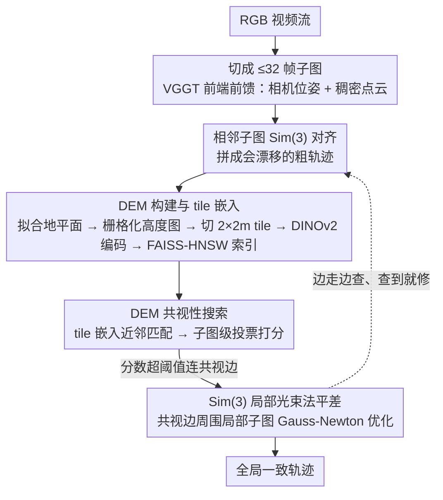

# VGGT-SLAM++: Visual SLAM with DEM-Based Covisibility and Local Bundle Adjustment

**会议**: CVPR 2026  
**arXiv**: [2604.06830](https://arxiv.org/abs/2604.06830)  
**代码**: 无  
**领域**: 3D视觉  
**关键词**: SLAM、数字高程图、Transformer里程计、环路检测、局部光束法平差

## 一句话总结

VGGT-SLAM++ 在 VGGT 前馈 Transformer 里程计基础上，引入数字高程图（DEM）作为紧凑的几何保持表示，利用 DINOv2 嵌入实现高效环路检测和共视图构建，配合高频 Sim(3) 局部光束法平差修正短期漂移，在 TUM RGB-D 上 ATE 降低 45%（0.079m→0.036m）。

## 研究背景与动机

1. **领域现状**：基于 Transformer 的前馈视觉里程计（如 VGGT、DPV-SLAM）可以快速预测相机位姿和深度，但缺乏全局一致性保证——没有回环检测和后端优化，长序列会累积严重漂移。
2. **现有痛点**：(1) VGGT 的 Sim(3) 里程计在 KITTI 上平均 ATE 81m，远高于传统 ORB-SLAM2 的 55m；(2) 经典 SLAM 方法（如 DROID-SLAM）有完整后端但前端依赖特征匹配，在复杂场景下可能失败；(3) 缺乏连接 Transformer 前端和传统后端的高效中间表示。
3. **核心矛盾**：Transformer 前端速度快但无全局优化；传统后端有全局优化但前端脆弱。需要一种能桥接两者的方案。
4. **本文目标**：为 VGGT 添加空间修正后端，在保持前端高速推理的同时实现全局一致性。
5. **切入角度**：数字高程图（DEM）是一种紧凑的2.5D表示——将3D点云投影到地平面上的高度图，既保留几何信息又大幅压缩数据量，天然适合作为回环检测和空间索引的中间表示。
6. **核心 idea**：DEM + DINOv2 嵌入做共视性估计 → 构建共视图 → Sim(3) 流形上的姿态图优化。

## 方法详解

### 整体框架

VGGT-SLAM++ 想把"快但会漂"的 Transformer 前端和"慢但全局一致"的优化后端缝在一起，关键是找一个既轻量又保几何的中间表示来连接两者。它的做法是：RGB 视频先被切成不超过 32 帧的子图，VGGT 前端一次前馈就吐出每个子图内的相机位姿和稠密点云；相邻子图通过 Sim(3) 对齐拼成一条粗轨迹。真正的创新在后端——每个子图的点云被压成一张数字高程图（DEM），用 DINOv2 编码成嵌入并塞进 FAISS-HNSW 索引；新子图进来时立刻去索引里查谁和它空间重叠，一旦查到共视关系就在 Sim(3) 流形上做一次局部光束法平差，把累积漂移就地拉回。整条链路里，DEM 既是"地图的指纹"也是"空间索引的钥匙"，让前端的速度和后端的一致性同时成立。

### 关键设计

**1. DEM 构建与 tile 嵌入：把稠密点云压成可检索的地图指纹**

VGGT 前端吐出的是稠密点云，直接拿来做场所识别又慢又占内存。这一步先用 RANSAC+SVD 从点云里拟合出全局地平面 $\Pi$，把整片点云变换到以地面为基准的规范坐标系，再栅格化成一张高度图——这就是 DEM。同一格子里常有多层高度（比如桌面和桌下地面），用温度 $\tau=0.02$ 的 softmax 聚合，让占主导的那层高度胜出而不是简单取均值。高度图按 2×2m 切成 tile，每个 tile 过 DINOv2 得到嵌入 $v_k$，并叠加 Gaussian 位置权重和 Sobel 边缘增强来突出结构边界。结果是每个 tile 只占约 1MB、比原始点云紧凑 10–100 倍，却仍保留了足够的几何与纹理用来认地方——这正是后端能跑得快的前提。

**2. DEM 共视性搜索：用嵌入匹配代替点云配准，亚线性时间找重叠子图**

判断两个子图是否看到了同一块场景，如果直接在点云上做空间配准会慢到不可接受。这里改成在 DEM tile 嵌入上做近邻匹配：新子图的每个 tile 嵌入 $v_q$ 去 FAISS-HNSW 索引里查最近邻，然后把命中投票汇聚成子图级别的分数

$$\text{Score}(S) = \sum_{\tau_k \in S} \frac{v_q^\top v_k}{\lVert v_q \rVert\, \lVert v_k \rVert}$$

分数超过阈值 $\tau_s$（或落在 top-K）的子图就被判为共视。HNSW 的近似最近邻把检索压到亚线性时间，所以即便地图越来越大，找重叠仍然很快——这是它能"高频"修正而不拖垮前端的关键。

**3. Sim(3) 局部光束法平差：每检测到一次共视就修一次漂移，而不是等回环**

传统 SLAM 通常要等到一个完整回环闭合才触发姿态图优化，漂移在闭环前会一直累积。本方法的不同在于：只要共视性搜索新连上一条边，就立刻在 Sim(3) 流形（7 自由度：平移+旋转+尺度）上做一次 Gauss-Newton 优化

$$\min_{T_i \in \mathrm{Sim}(3)} \sum_{(i,j) \in E} \big\lVert \log_{\mathrm{Sim}(3)}\!\big(T_j^{-1} T_i \hat{T}_{ij}\big) \big\rVert^2_{\Sigma_{ij}}$$

其中 $\hat{T}_{ij}$ 是共视边给出的相对位姿约束。因为优化只涉及当前共视到的局部子图集合而非全图，每次代价很小，可以高频执行；带尺度的 Sim(3) 还能顺带纠正单目里程计固有的尺度漂移。效果上，漂移在累积成大误差之前就被一次次按住，而不是攒到回环时再一次性硬掰。

### 一个完整示例

以论文自采的 GoPro 序列（总路径 406.8m）为例走一遍：相机一边走一边把视频流切成若干 ≤32 帧的子图，VGGT 逐个吐出位姿和点云，子图首尾相接拼出一条会缓慢漂移的粗轨迹。每拼好一个子图，它的点云就被压成 DEM、切成 2×2m tile、编码进 FAISS 索引。当相机绕回先前走过的区域，新子图的 tile 嵌入在索引里查到了早先子图的高分命中，共视性搜索判定两者重叠并连上一条边；系统立刻在这条边周围的局部子图集合上做一次 Sim(3) 光束法平差，把这一段漂移拉回。整段序列走完，这种"边走边查、查到就修"的高频修正把最终轨迹误差压到约 18±2m，证明该后端在真实手持采集下可用。
> ⚠️ 示例中的逐步流程为依据论文 pipeline 的重构，具体每步命中数量以原文为准。

### 损失函数 / 训练策略

无额外训练，VGGT 和 DINOv2 均使用预训练权重。前端 ~16 FPS，后端 ~1.89 FPS，GPU 占用 ~20GB VRAM。

## 实验关键数据

### 主实验

| 方法 | KITTI ATE(m)↓ | TUM ATE(m)↓ | 7-Scenes ATE(m)↓ |
|------|--------------|-------------|-----------------|
| ORB-SLAM2 w/LC | 54.82 | - | - |
| DROID-SLAM | - | 0.038 | 0.050 |
| MASt3R-SLAM | - | 0.030 | 0.047 |
| DPV-SLAM++ | 25.75 | 0.054 | - |
| VGGT-SLAM (Sim3) | 81.22 | 0.079 | 0.067 |
| **VGGT-SLAM++** | **64.94** | **0.036** | **0.064** |

### 消融实验

| DEM 配置 | KITTI Avg ATE(m) | 说明 |
|----------|-----------------|------|
| Softmax τ=0.02（默认） | 64.94 | 默认配置 |
| Mean reducer | 65.07 | 基本相同 |
| Half resolution (45k px) | **58.89** | 低分辨率反而更好 |
| High resolution (180k px) | 66.00 | 过多细节干扰匹配 |
| No edge enhancement | 64.71 | 影响微小 |

### 关键发现

- TUM 上 45% 改进最显著（0.079→0.036m），因为室内场景回环多、DEM 匹配效果好
- KITTI 上 20% 改进（81.22→64.94m），户外长距离场景回环机会少
- 7-Scenes 仅 5% 改进，因为场景小、原始漂移就不大
- DEM 分辨率存在最优点——45k pixels 反而比 90k/180k 更好，过多细节可能干扰全局匹配
- 自定义 GoPro 数据：406.8m 路径 ATE 18±2m，证明实际部署可行

## 亮点与洞察

- **DEM 作为桥接表示**：将 3D 点云"降维"到 2.5D 高度图的思路在 SLAM 中并不常见，但它在存储效率和几何保持之间取得了很好的平衡
- **高频局部优化 vs 仅回环优化**：传统方法等到完整回环才修正，本方法利用共视性做高频修正，能更早限制漂移
- **DINOv2 在几何表示上的多功能性**：原本用于自然图像的自监督特征在 DEM（人工渲染的高度图）上仍然有效

## 局限与展望

- 灰度/单色图像效果差（EuRoC），因为 VGGT 仅在 RGB 上训练
- 部分 KITTI 序列仍远不如经典 ORB-SLAM2，Transformer 前端的运动估计在某些场景下仍有质量短板
- DEM 假设场景中存在主导平面结构，高度杂乱环境下可能失效
- 对非常长序列的内存增长虽亚线性但仍显著

## 相关工作与启发

- **vs DROID-SLAM**: DROID 有完整的稠密光流+BA 后端，精度仍领先（TUM 0.038 vs 0.036 在竞争范围）。但 VGGT-SLAM++ 前端速度更快
- **vs MASt3R-SLAM**: MASt3R 在 TUM 上 0.030m 仍更优，但 VGGT-SLAM++ 的 DEM 后端思路与 MASt3R 的稠密匹配正交，有融合潜力
- **vs DPV-SLAM++**: 类似的"学习前端+优化后端"架构，但使用不同的中间表示

## 评分

- 新颖性: ⭐⭐⭐⭐ DEM表示和DINOv2环路检测的组合有新意
- 实验充分度: ⭐⭐⭐⭐⭐ 5个标准benchmark+自定义硬件+详细DEM超参消融
- 写作质量: ⭐⭐⭐⭐ 系统描述完整但部分数学符号较密
- 价值: ⭐⭐⭐⭐ 为Transformer-based SLAM添加后端是重要方向

<!-- RELATED:START -->

## 相关论文

- [\[CVPR 2026\] Unblur-SLAM: Dense Neural SLAM for Blurry Inputs](unblur-slam_dense_neural_slam_for_blurry_inputs.md)
- [\[CVPR 2026\] DROID-W: DROID-SLAM in the Wild](droid-slam_in_the_wild.md)
- [\[CVPR 2026\] SGAD-SLAM: Splatting Gaussians at Adjusted Depth for Better Radiance Fields in RGBD SLAM](sgad-slam_splatting_gaussians_at_adjusted_depth_for_better_radiance_fields_in_rg.md)
- [\[ECCV 2024\] Deep Patch Visual SLAM](../../ECCV2024/3d_vision/deep_patch_visual_slam.md)
- [\[CVPR 2026\] VarSplat: Uncertainty-aware 3D Gaussian Splatting for Robust RGB-D SLAM](varsplat_uncertainty-aware_3d_gaussian_splatting_for_robust_rgb-d_slam.md)

<!-- RELATED:END -->
