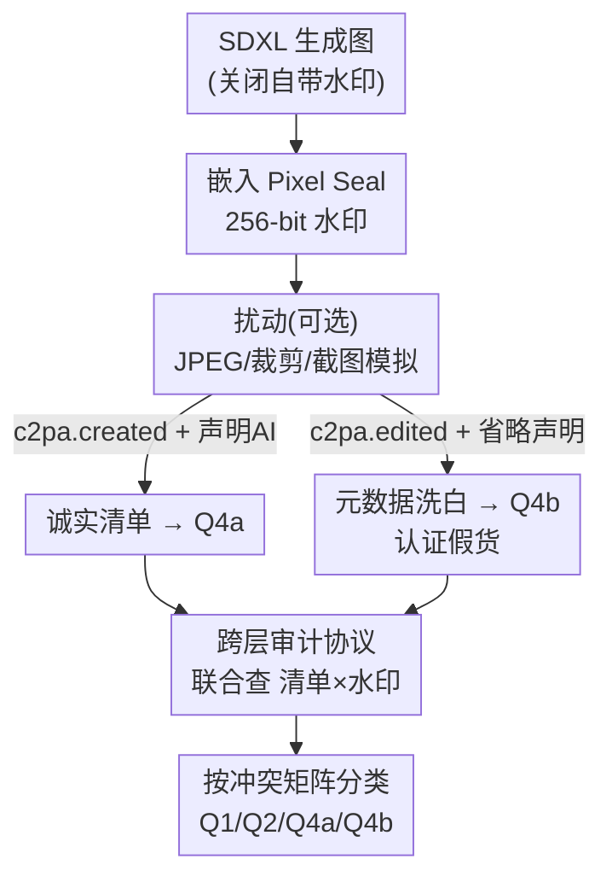

# Authenticated Contradictions from Desynchronized Provenance and Watermarking

**会议**: CVPR 2026  
**arXiv**: [2603.02378](https://arxiv.org/abs/2603.02378)  
**代码**: https://github.com/ANCP2021/integrity-clash (有)  
**领域**: AI安全 / 内容溯源 / 数字水印  
**关键词**: C2PA、不可见水印、内容真实性、跨层审计、AI生成检测

## 一句话总结
本文揭示并形式化了 **Integrity Clash（完整性冲突）**：一张图可以同时携带一个加密有效、声称"人类创作"的 C2PA 溯源清单，和一个标识其为 AI 生成的像素级水印，两个验证层各自单独检查时都通过——作者用标准编辑流水线构造出这种"认证假货"，并提出一个把两层联合起来核对的审计协议，在 3500 张测试图、四种冲突状态、三种扰动下做到 **100% 分类准确率**。

## 研究背景与动机

**领域现状**：面对以假乱真的 AI 生成图像，业界主推两条平行的"内容真实性"防线。一条是基于密码学的溯源标准 **C2PA**（Coalition for Content Provenance and Authenticity），把创作/编辑历史写进一个**数字签名的元数据清单（manifest）**，附在文件上；另一条是**不可见水印**（如 Google SynthID、Meta 的 Pixel Seal），把来源信号直接嵌进**像素数据**。C2PA 已进入 Photoshop、Nikon、Leica、Sony 固件，水印也由 Google、Meta 平台级部署。官方与平台都把二者宣传为"互补的纵深防御"。

**现有痛点**：所谓"互补"掩盖了一个结构性漏洞——**两层技术上完全独立**。C2PA 验证是对元数据做一次密码学签名校验；水印检测是对像素做一次信号解码。**两者谁都不以对方的输出为条件**。于是同一张图完全可以：清单加密有效、声称是人编辑的，而像素里的水印却在喊"我是 AI 生成的"，两边各自单测都 pass。只看一层的验证者拿到的是一份残缺的来源报告。

**核心矛盾**：C2PA 的签名只证明"元数据自签名后没被篡改、且能归属到某把密钥"，**并不证明断言的语义为真**——一份声称人类创作的清单，哪怕底下像素是 AI 生成的，照样可以是密码学有效的。而水印绑定在像素上、能扛住重压缩/换格式/剥元数据。两个"各自都对"的层放一起，就能在同一资产上产出**语义互相矛盾**的验证结论，却没有任何已部署系统去裁决它们。

**本文目标**：(1) 把这种跨层矛盾形式化成可复现的、规范层面的漏洞；(2) 证明它能用现成工具、零密码学攻破地造出来；(3) 给出一个能可靠检出它的检测协议。

**切入角度**：作者注意到，造假者**不需要伪造签名**，只需在签名时**省略一个断言字段**（AI 来源声明）——而 C2PA 规范本身**并不强制**签名者声明生成式来源。漏洞因此不是密码分析层面的，而是**流程/规范层面**的。

**核心 idea**：用一个"冲突矩阵"把（清单状态 × 水印状态）穷举成四象限，定位出 **Q4b（认证假货）** 这个矛盾态；再用一个同时查两层、按矩阵规则比对的**跨层审计协议**把它揪出来。

## 方法详解

### 整体框架

本文不是提出新模型，而是**搭一套受控实验流水线来"制造 + 检测"漏洞**。同一组 500 张 SDXL 生成的基图，被送进若干条只在"加不加水印 / 用哪种清单签名"上不同的流水线，分别落到冲突矩阵的不同象限；最后用审计协议对所有产物分类，和已知 ground truth 对账。整体可看作三块：**(1) 冲突矩阵**——给所有(清单,水印)组合定坐标；**(2) 元数据洗白**——通过合法签名流程把 AI 水印图洗成"人类编辑"，落进 Q4b；**(3) 跨层审计**——联合两层信号、按矩阵规则判定，把 Q4b 翻出来。

### 关键设计

**1. 冲突矩阵：把"两层信号"穷举成可判定的四象限**

痛点在于：人们模糊地说"溯源和水印互补"，却没有一个框架说清"两层组合到底有几种状态、哪种是矛盾"。作者沿两个二元维度——**是否有有效 C2PA 清单**、**是否检出 AI 水印**——划出四象限。**Q1 Silent Zone**：两层皆无，无任何机器可读真实性信号；**Q2 Fragile Provenance**：无/无效清单但检出水印，有合成证据却无元数据上下文；**Q3 Authenticated Content**：清单有效但无水印，符合人类创作 + 有效凭证；**Q4 Dual Signal**：清单有效且检出水印，两层同在，矛盾与否取决于清单内容。Q4 再裂成 **Q4a Verified Synthetic**（清单如实声明 AI，水印佐证，这是真实性流水线本该有的样子）和 **Q4b Authenticated Fake**（清单隐瞒 AI、水印却检出合成）——后者就是 Integrity Clash。关键洞察是：造假者若改去剥水印（退到 Q3）或删清单（退到 Q2），都会在某一层留下"可见的缺席"；唯独 **Q4b 因为两层都完整且各自 pass，最难检测**

**2. 元数据洗白：靠"省略单一断言字段"零密码学造出认证假货**

威胁模型里造假者能力很弱——能用公开模型生成图、用开源工具嵌/保水印、把图过 C2PA 合规签名流程，但**不能伪造签名、不能攻破 CA、不能破密码学原语**。漏洞因此是**程序性**而非密码分析性的。具体做法（provenance laundering）：拿一张已嵌 Pixel Seal 水印的 AI 图，用两份只差一个字段的清单模板签名。**诚实模板**声明 `c2pa.created` 动作、`digitalSourceType = trainedAlgorithmicMedia`、软件代理 `StableDiffusionXL/1.0`；**误导模板**声明 `c2pa.edited`、软件代理 `PhotoEditor/2.0`，并**完全省略 `digitalSourceType` 字段**——而 C2PA 规范不强制声明生成式来源。两份清单用同一把证书、同一时间戳签名，密码学上都有效。换句话说，**"如实标注的 AI 图"和"认证假货"之间的全部距离，就是少写一个断言字段**。作者用自签 ECDSA P-256 证书链 + DigiCert 时间戳完成签名，自签是故意的——漏洞是语义省略而非证书伪造，自签链走的是和商用可信凭证完全相同的验证路径

**3. 跨层审计协议：联合两层、按矩阵规则比对，无需任何新基础设施**

既有流程把两层各管各的，Q4b 对双方都是隐形的。审计协议对每张图抽两个信号：**(1)** 是否存在密码学有效的 C2PA 清单，若有，其断言是否含 AI 来源声明（即 `digitalSourceType` 是否为 `trainedAlgorithmicMedia`）；**(2)** 水印比特准确率（bit accuracy，正确恢复的 256-bit 占比）是否超过检测阈值 **0.75**。阈值取 0.75 是因为它正好是随机解码（256-bit 期望 $\approx 0.50$）与完美恢复（$1.0$）的中点，对扰动下的退化更公平。然后按矩阵规则落子：两者皆无→Q1；仅检出水印→Q2；仅有效清单无水印→Q3；两者都有则看清单内容——声明 AI 为 Q4a，否则为 **Q4b（正类，即检出跨层矛盾）**。妙在它**不需要任何超出现有设施的东西**：一个 C2PA 清单验证器 + 一个水印检测器本就都存在，协议的全部贡献是那段**联合比对逻辑**，去交叉引用两个输出、标出单层永远暴露不出的语义不一致

### 一个完整示例

拿同一张 AI 生成、已嵌水印的图，提交给已部署的 **Content Credentials Verify** 工具，三种条件：(a) 不附清单——工具报"无内容凭证"；(b) 附诚实清单——工具正确识别为 AI 生成并显示生成模型；(c) 附误导清单——工具显示为"人类编辑"、只字不提 AI。**输出完全由附带的元数据决定，工具根本没有机制去查像素里的水印**。两次签名情形下，唯一警告只关于证书签发者（因研究用自签证书不在信任库里）——而换成 CA 签发的可信证书，这条警告会消失，底下的语义矛盾却依然无人察觉。这一例直观说明：现实验证器看的是"签名可信吗"，不是"元数据和像素一不一致"。

## 实验关键数据

数据集：500 张 SDXL-Base-1.0 在 $1024\times1024$ 生成的 PNG，提示词取自 Parti-Prompts 并按 round-robin 均衡覆盖类别；显式关闭 SDXL 自带水印，确保下游水印只来自受控嵌入步骤。水印用 Pixel Seal（Meta Seal 套件最强模型），嵌入固定 256-bit 载荷。

### 主实验：四条核心流水线

| 流水线 | $N$ | C2PA 有效率(%) | 平均比特准确率 | 最低比特准确率 | 正确分类(%) | 象限 |
|--------|-----|---------------|---------------|---------------|-------------|------|
| Baseline（无水印无清单） | 500 | 0.0 | 0.502 | 0.410 | 100.0 | Q1 |
| Watermarked（仅水印） | 500 | 0.0 | 0.999 | 0.973 | 100.0 | Q2 |
| Honest Manifest（如实声明） | 500 | 100.0 | 0.999 | 0.973 | 100.0 | Q4a |
| Misleading Manifest（误导） | 500 | 100.0 | 0.999 | 0.973 | 100.0 | Q4b |

Baseline 均值 0.502、最低 0.410，远低于 0.75 阈值，证明检测器对无水印内容不误报；三条带水印流水线比特准确率统计完全一致（均值 0.999、最低 0.973），证明 **C2PA 签名只动文件级元数据、不改像素**。核心结果是 Misleading 流水线：500 张全部携带加密有效、只声称"人类编辑"的清单，却同时带着标识 AI 的水印——它和 Honest 流水线输入的是**同一批水印图**，唯一差别就是签名时用了哪个模板。

### 跨层审计协议评估（含扰动鲁棒性）

扰动在签名前施加于水印图：(i) JPEG 质量 80；(ii) 中心裁剪 10% 后缩放回 $1024\times1024$；(iii) 截图模拟（降到 75% 分辨率 → JPEG 质量 70 → 升回原尺寸）。每种扰动独立作用于全部 500 图，新增 1500 个测试样本。

| 状态 / 条件 | 正确分类(%) | 说明 |
|------------|-------------|------|
| Q1 Silent Zone | 100.0 | 500 图 |
| Q2 Fragile Provenance | 100.0 | 500 图 |
| Q4a Verified Synthetic | 100.0 | 500 图 |
| Q4b 无扰动 | 100.0 | 正类 |
| Q4b + JPEG Q80 | 100.0 | 最低比特准确率 0.973 |
| Q4b + 裁剪10%+缩放 | 100.0 | 最低比特准确率 0.902 |
| Q4b + 截图模拟 | 100.0 | 最低比特准确率 0.906，扩散最宽 |

合计 2000 个 Q4b 实例（无扰动 + 三种扰动各 500）全部检出，Q4b 作为正类 **TPR=1.000、FPR=0.000、Accuracy=1.000**。

### 关键发现
- **水印够鲁棒是审计能成立的前提**：三种扰动下每张图的比特准确率都稳在 0.75 阈值以上（最低 0.902），矛盾信号才能存活到被联合核对。截图模拟退化最重但仍 min=0.906。
- **100% 准确率高度依赖 Pixel Seal 的强鲁棒性**：作者诚实指出，若换成更弱的水印方案，扰动后可能跌破阈值——那时误导清单成了唯一信号、无任何反证，这种失效**比 Integrity Clash 本身更危险**，因为连跨层审计都无能为力。
- **漏洞是组织性而非技术性的**：两套验证基础设施由不同社区、不同标准机构、不同集成点各自发展，没有任何规范要求一层以另一层为条件——所以"补上"在技术上极其直接（只需让验证器查两层并比对）。

## 亮点与洞察
- **"零密码学攻破"的攻击叙事很有冲击力**：不碰签名、不碰 CA，只少写一个规范允许省略的字段，就把"如实 AI 图"洗成"认证假货"——把矛头从密码学强度精准引向规范的语义空洞，定位极准。
- **冲突矩阵是个干净的分析脚手架**：把模糊的"两层互补"压缩成四象限 + 一个被裂开的 Q4，既能讲清漏洞、又能直接当审计协议的判定规则，分析框架和检测方法天然同构。
- **防御方案"几乎零成本"是最强论点**：审计协议不引入任何新组件，只加一段联合比对逻辑——这把"该不该修"从技术可行性问题变成了纯粹的意愿/规范问题，论证非常有力。
- **可迁移性**：这套"两个各自正确的验证层因互不条件化而产生联合矛盾，用穷举状态矩阵 + 跨层一致性核对来兜底"的思路，可推广到视频/音频溯源、乃至任何多签名/多证书并存的真实性系统。

## 局限与展望
- **单一水印方案**：核心实验只用 Pixel Seal，鲁棒性最强但不代表所有部署方案；更弱的水印在相同扰动下可能失效，导致审计也失灵（作者明确承认这是更危险的失效模式）。
- **自签证书**：用研究自签证书导致验证器报"签发者不可信"警告；换商用可信证书会消除警告，但语义矛盾依旧——这反而说明警告挡不住真实攻击。
- **平台测试不完整**：只对 Content Credentials Verify 网站验证，未测平台级审核流水线（可能有清单验证之外的额外启发式）。
- **受控且限于图像**：签名与检测都由作者控制，仅图像模态。未来应扩到视频/音频；并设计**向终端用户传达跨层冲突**的界面；最根本的是修改 C2PA 规范，**要求签名应用在出清单前先检查像素中是否已有水印**，把语义缺口堵在签名点而非依赖下游审计。

## 相关工作与启发
- **vs 单层水印鲁棒性研究（WAVES、Tree-Ring、对抗去水印）**：他们研究水印在压缩/裁剪/对抗下能否存活、能否被生成式重建抹掉；本文不攻水印本身，而是利用"水印存活 + 清单可隐瞒"的并存，制造跨层矛盾——视角从"单层强度"转到"层间一致性"。
- **vs 单层 C2PA 安全分析（清单剥离、重签名、软绑定碰撞）**：他们枚举溯源层自身的威胁；本文强调即使每层都"正确工作"，规范允许的语义省略仍会在**层间**产出矛盾，是规范层面而非实现层面的漏洞。
- **vs 已有多信号一致性框架（Origin Lens、媒体完整性、agent 取证流水线）**：他们或指出生态碎片化（如审计显示仅 38% 生成器有充分水印、仅 18% 接入 C2PA 标注），或倡议"对齐多信号"，但**没人把跨层矛盾做成可复现的规范级漏洞、也没给出针对它的检测协议**；本文同时补上"构造攻击"与"评估防御"两端。

## 评分
- 新颖性: ⭐⭐⭐⭐⭐ 首次把 C2PA 与水印的跨层矛盾形式化为可复现的规范级漏洞并命名 Integrity Clash，视角独到
- 实验充分度: ⭐⭐⭐⭐ 3500 图、四象限、三扰动、对接真实验证器，闭环完整；但仅单一水印方案、单一模态、受控环境
- 写作质量: ⭐⭐⭐⭐⭐ 威胁模型—冲突矩阵—攻击—审计逻辑链清晰，对 100% 准确率的依赖条件交代得很诚实
- 价值: ⭐⭐⭐⭐⭐ 直指已部署内容真实性基础设施的真实盲点，且给出近乎零成本的修补路径，对标准制定有现实影响

<!-- RELATED:START -->

## 相关论文

- [\[CVPR 2026\] RecoverMark: Robust Watermarking for Localization and Recovery of Manipulated Faces](recovermark_robust_watermarking_for_localization_and_recovery_of_manipulated_fac.md)
- [\[CVPR 2026\] Who Gets Flagged? The Pluralistic Evaluation Gap in AI Content Watermarking](who_gets_flagged_the_pluralistic_evaluation_gap_in_ai_content_watermarking.md)
- [\[CVPR 2026\] ClusterMark: Towards Robust Watermarking for Autoregressive Image Generators with Visual Token Clustering](clustermark_towards_robust_watermarking_for_autoregressive_image_generators_with.md)
- [\[AAAI 2026\] Robust Watermarking on Gradient Boosting Decision Trees](../../AAAI2026/ai_safety/robust_watermarking_on_gradient_boosting_decision_trees.md)
- [\[CVPR 2026\] AdvMark: Decoupling Defense Strategies for Robust Image Watermarking](decoupling_defense_strategies_for_robust_image_watermarking.md)

<!-- RELATED:END -->
