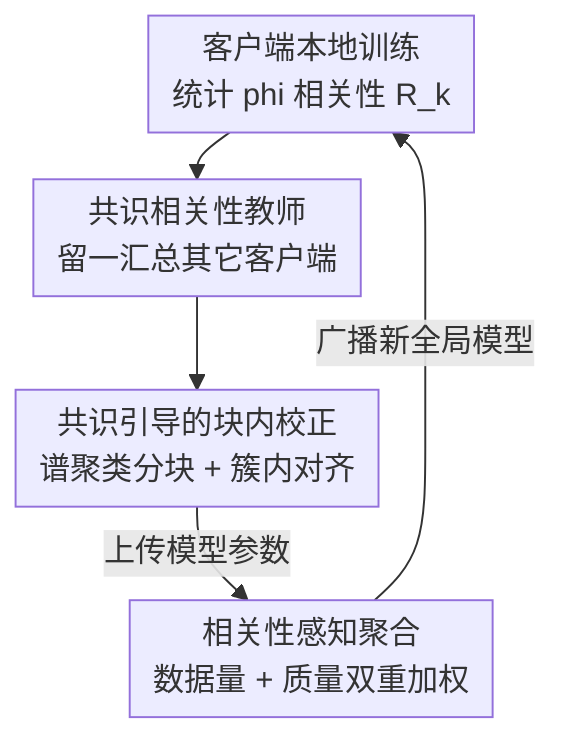

# FedHarmony: Harmonizing Heterogeneous Label Correlations in Federated Multi-Label Learning

**会议**: CVPR 2026  
**arXiv**: [2604.28024](https://arxiv.org/abs/2604.28024)  
**代码**: 无  
**领域**: 联邦学习 / 多标签学习 / 隐私保护  
**关键词**: 联邦多标签学习, 标签相关性漂移, 共识相关性, 相关性感知聚合, 块内优化

## 一句话总结
针对联邦多标签学习中各客户端只见到局部标签空间、学出的标签相关性互相打架（标签相关性漂移）的问题，FedHarmony 用"多数客户端的共识相关性"当全局教师在本地训练时纠偏，并在服务器聚合时同时按数据量和相关性质量给客户端加权，在 FLAIR / COCO-80 / VOC2007 三个非 IID 联邦基准上一致超过现有 SOTA（FLAIR mAP +11.4）。

## 研究背景与动机
**领域现状**：多标签学习（MLL）的核心是建模标签共现关系（如"街道"常和"建筑""行人"一起出现），近年用 GCN、Transformer 显式编码标签关系能显著提升预测。隐私需求推动 MLL 走向联邦学习框架（FedMLL）：多个客户端各持私有多标签数据、不共享原始数据协同训练，目标是让中心服务器从分散数据中还原出全局标签依赖结构。

**现有痛点**：异构数据分布下这个目标很难实现，作者指出两个具体问题。其一，各客户端的标签共现频率天差地别——在 FLAIR 上"户外"和"设备"在 Client 1 高度共现、在 Client 2 却很低，每个客户端只看到完整标签空间的一个子集，本地学出的相关性必然带偏，且偏离全局真实结构。作者把这种现象命名为**标签相关性漂移（label correlation drift）**。其二，现有方法（FedAvg 系）只按训练数据量给客户端加权平均，完全忽略学到的相关性质量——一个数据多但相关性学得烂的客户端反而拿到过高的聚合权重，把全局模型往坏处带。

**核心矛盾**：没有任何单个客户端能掌握真实的标签关系，但"被大多数客户端一致认同的相关性"更可能反映底层全局语义。现有聚合机制既不纠正本地的偏，也不区分客户端的好坏。

**本文目标**：（1）让本地学到的标签相关性在训练中持续向全局共识对齐；（2）让聚合阶段能识别并偏向相关性学得好的客户端。

**切入角度**：从"群体共识"假设出发——对某个目标客户端，把其它所有客户端的相关性矩阵汇总成一个"共识相关性"，作为它看不到的全局视角。

**核心 idea**：用"留一式共识相关性"当全局教师纠正本地偏差，再用"数据量 + 相关性质量"的双重加权做聚合，从源头上调和异构标签相关性。

## 方法详解

### 整体框架
FedHarmony 是一个标准的"客户端本地训练 ↔ 服务器聚合"联邦循环，但在两端各塞进了对标签相关性的处理。每轮通信里：客户端先用当前模型对本地数据打分，统计出一个 $C\times C$ 的 phi 相关性矩阵 $R_k^{(t)}$ 并上传；服务器对每个客户端用"留一法"把其它所有客户端的相关性汇总成专属的**共识相关性** $R_{\exp,k}^{*(t)}$ 发回；客户端把它当教师，对本地相关性做**共识引导的块内校正**；最后服务器在聚合时不再只看数据量，而是用**相关性感知聚合**——同时考虑数据量和该客户端相关性的学习质量来加权。三者环环相扣，形成"统计相关性 → 共识纠偏 → 质量加权聚合"的闭环。

### 关键设计

**1. 共识相关性教师：用多数人的共识当全局视角纠本地偏差**

痛点是单个客户端只见局部标签空间，本地相关性必然带偏，可它又没有别的参照系知道自己偏在哪。FedHarmony 的做法是：客户端 $k$ 在第 $t$ 轮用当前模型 $f_k$ 对本地数据打分得到 $F_k^{(t)}\in[0,1]^{N_k\times C}$（软标签出现概率），从中估计边缘概率 $\hat p_{k,c}$ 和联合概率 $\hat p_{k,cc'}$，再算出 phi 型相关系数衡量两标签依赖强度：

$$R_{k,cc'}^{(t)}=\frac{\hat p_{k,cc'}^{(t)}-\hat p_{k,c}^{(t)}\hat p_{k,c'}^{(t)}}{\sqrt{\hat p_{k,c}^{(t)}(1-\hat p_{k,c}^{(t)})\,\hat p_{k,c'}^{(t)}(1-\hat p_{k,c'}^{(t)})}+\varepsilon}$$

关键在于"教师"怎么来：对目标客户端 $k$，共识相关性 $R_{\exp,k}^{*(t)}$ 由**除它之外**所有客户端的相关性矩阵 $\{R_j^{(t)}\}_{j\neq k}$ 经汇总算子 $\mathcal{A}_t$ 聚合得到（leave-one-out）。这样有效是因为：任何单客户端都不知道真实标签关系，但被多数客户端共同认同的相关性更可能是真的；用"留一"避免客户端自己污染自己的教师，让教师真正代表"别人眼中的全局共识"

**2. 共识引导的块内校正：只对齐高相关的标签簇，省算力还几乎不掉点**

有了教师，本地相关性要向它对齐，最朴素的做法是对整张 $C\times C$ 矩阵做对齐损失 $\mathcal{L}^{\mathrm{align}}=\lambda\,\Psi(R_i^{(t)},R_{\exp,i}^{*(t)})$（$\Psi$ 是相关性空间里固定的距离/散度）。但作者观察到标签相关性矩阵是**稀疏且近似块结构**的——每个标签只和少数标签真正相关。于是把矩阵拆成 $G$ 个近似低秩的子块、只在簇内对齐：

$$\mathcal{L}^{\mathrm{align}}_{i,t}=\lambda\sum_{g=1}^{G}\Psi\!\Big(R_i^{(t)}[\mathcal{S}_g,\mathcal{S}_g],\,R_{\exp,i}^{*(t)}[\mathcal{S}_g,\mathcal{S}_g]\Big)$$

分簇用对专家相关性 $R_{\exp}^{*}$ 做谱聚类（取绝对值对称化成亲和矩阵 → 归一化拉普拉斯 → 取 $G$ 个最小特征向量 → 行归一化后 $k$-means）。论文给了两条定理支撑：Theorem 2.1 证明簇内对齐的曲率从 $\gamma_{\mathrm{out}}$ 提到 $\gamma_{\mathrm{in}}$（且 $\gamma_{\mathrm{in}}\gg\gamma_{\mathrm{out}}$），因而收敛的线性速率严格更快；Theorem 2.2 证明忽略跨簇项最多带来 $\|\Gamma_{\mathrm{out}}\circ E\|_F^2$ 的额外损失，当共识近似块对角或跨簇权重小时可忽略。一句话：把对齐聚焦到稠密、高信号的子空间，既加速又几乎不丢信息

**3. 相关性感知聚合：早期信数据量、后期信结构质量**

针对"数据多但相关性烂的客户端被过度加权"的痛点，聚合权重不再只看数据量。对客户端 $i$ 先算它和共识的块结构差异 $s_i^{(t)}=\sum_g\Psi(R_i^{(t)}[\mathcal{S}_g,\mathcal{S}_g],R_{\exp,i}^{*(t)}[\mathcal{S}_g,\mathcal{S}_g])$，经单调递减变换映射成质量分 $q_i^{(t)}=\exp(-\gamma s_i^{(t)})$（差异越小、质量越高）。把归一化数据量 $\bar n_i$ 和归一化质量 $\bar q_i^{(t)}$ 用一个随轮次衰减的系数 $\alpha^{(t)}=\max(0,1-t/T_0)$ 线性混合：

$$w_i^{(t)}=\alpha^{(t)}\,\bar n_i+(1-\alpha^{(t)})\,\bar q_i^{(t)}$$

这样有效在于它顺应了训练动态：早期（$\alpha\approx1$）本地相关性还不可靠，规则退化为按数据量加权的 FedAvg，稳住训练；后期（$\alpha\downarrow0$）相关性对齐得好的客户端（$q$ 大）主导聚合，防止劣质相关性污染全局模型

### 损失函数 / 训练策略
本地分类用二元交叉熵（多标签），叠加上面的簇内对齐损失 $\mathcal{L}^{\mathrm{align}}_{i,t}$。骨干为 ViT-B/16 + $C$ 路 sigmoid 头；每轮本地训练 5 个 epoch，Adam，学习率 $10^{-4}$，batch size 16，总通信轮数 $T=50$；对数量倾斜（如 FLAIR）采用按本地数据量成比例的非均匀客户端采样。8 张 RTX 4090 训练。

## 实验关键数据

### 主实验
三个非 IID 联邦多标签基准上 FedHarmony 在全部 8 个指标上都最优，FLAIR 上 mAP 比最强基线高 11 个点以上。

| 数据集 | 指标 | FedHarmony | 之前最强基线 | 提升 |
|--------|------|-----------|-------------|------|
| FLAIR | mAP | **51.0** | 39.6 (FedProx) | +11.4 |
| FLAIR | OF1 | **75.1** | 65.8 (FedProx) | +9.3 |
| COCO-80 | mAP | **71.4** | 64.5 (FedLGT) | +6.9 |
| VOC2007 | mAP | **86.9** | 78.3 (FedRDN) | +8.6 |
| VOC2007 | O-mAP | **89.1** | 72.2 (FedRDN) | +16.9 |

注：部分基线在某些数据集上崩溃（如 FedNova 在 COCO-80 mAP 仅 4.3），FedHarmony 在严苛非 IID 下稳定性明显更好。

### 消融实验
Table 5，Base = FedAvg，A = 专家引导相关性损失（ECL），B = 相关性感知聚合（CAA）。

| 配置 | COCO-80 mAP | FLAIR mAP | 说明 |
|------|-------------|-----------|------|
| Base (FedAvg) | 63.4 | 35.4 | 纯参数平均 |
| +A (ECL) | 69.5 | 46.4 | 加共识相关性教师纠偏，COCO +6.1 / FLAIR +11.0 |
| +A+B (ECL+CAA) | **71.2** | **47.0** | 再加质量感知聚合，进一步 +1.7 / +0.6 |

块内优化（C）的影响单列：性能上 No-Block vs Block-Optimized 在三基准 8 指标差异普遍仅 0.3%–0.5%，Wilcoxon 检验 $p$ 值均 >0.05（COCO 0.382 / VOC 0.148 / FLAIR 0.547），无显著差异；但训练效率显著提升——到第 10 轮 FLAIR 累计训练时间降低 28.3%（56:19 → 40:22）、VOC2007 降低 31.7%（17:09 → 11:43）。

### 关键发现
- 贡献最大的是共识相关性教师（A）：单加它 FLAIR mAP 就从 35.4 暴涨到 46.4（+11.0），说明纠正本地相关性漂移是核心增益来源，远比单纯参数平均有效。
- 相关性感知聚合（B）是锦上添花的稳定增益（+0.6~1.7），把"质量好的客户端"权重抬上来。
- 块内优化（C）是纯效率优化：几乎不掉点（统计上不显著）却省下约 30% 训练时间，验证了"标签相关性矩阵近似块对角"这一假设的实用价值。
- 定性上 FedHarmony 重建的相关性矩阵最接近 ground-truth（如 equipment–material 关系 0.43 vs GT 0.42），而 FedRDN / FedNova 产出的矩阵把多数相关性塌缩到零。

## 亮点与洞察
- **"留一式共识当教师"很巧妙**：联邦场景天然有多个客户端的相关性可用，用 leave-one-out 既造出了目标客户端缺失的全局视角，又避免自我污染——把"群体智慧"直接做成了无需额外标注的免费监督信号。
- **把"稀疏块结构"先验做成可证明的加速**：从"标签相关性矩阵近似块对角"这个观察，推出簇内对齐曲率更大 → 线性收敛更快（Theorem 2.1），且跨簇损失可忽略（Theorem 2.2），是难得的"观察 → 理论 → 实测省 30% 时间"完整链条。
- **聚合权重随训练动态调度**的思路可迁移：早期信数据量稳训练、后期信质量提精度，这种 $\alpha^{(t)}$ 时间退火的混合权重对任何"早期局部估计不可靠"的联邦任务都适用。

## 局限与展望
- 共识相关性是"多数即真理"的假设，若数据异构到大多数客户端都偏向某个错误共现（系统性偏差而非随机偏差），教师本身就是错的，纠偏会把模型带偏——论文未讨论这种对抗/系统偏差场景。
- 聚合质量分 $q_i$ 依赖客户端如实上传相关性矩阵，存在被恶意客户端伪造高质量分操纵聚合权重的风险，缺少鲁棒性/隐私泄露分析（相关性矩阵本身也可能泄露标签分布信息）。
- 块内优化的簇数 $G$、聚合的转移轮数 $T_0$、温度 $\gamma$ 等超参敏感性未在正文充分给出；块内优化几乎不提升精度（统计不显著），其价值纯在效率，对小规模标签集收益有限。
- 实验局限在视觉多标签（最多 80~1628 类）+ ViT-B/16，未验证在更大标签空间或文本/医学等其它多标签模态上的表现。

## 相关工作与启发
- **vs FedAvg / FedProx**：它们做参数层面的加权平均（仅按数据量），完全不建模标签相关性；FedHarmony 在客户端-服务器两端都显式处理相关性结构，FLAIR mAP 51.0 vs 35.4/39.6，证明对齐相关性结构比单纯参数平均对多标签更有效。
- **vs FedCurv / SphereFed**：它们做曲率/几何感知的优化校正；论文指出曲率校正不足以解决异构标签依赖带来的语义不一致，二者在三基准上仅边际提升。
- **vs FedLGT / FedRDN**：FedLGT 是专门的联邦多标签方法、FedRDN 用特征级增强缓解分布倾斜；FedHarmony 把"相关性结构对齐"作为更鲁棒的归纳偏置，在严苛非 IID 下更稳定（VOC2007 mAP 86.9 vs 78.3）。

## 评分
- 新颖性: ⭐⭐⭐⭐ 首次系统研究 FedMLL 中的"标签相关性漂移"，留一式共识教师 + 双重加权聚合的组合有创意。
- 实验充分度: ⭐⭐⭐⭐ 三基准 8 指标全面对比 + 三组件消融 + 效率/统计检验/定性矩阵，较扎实；但缺超参敏感性和更大标签空间验证。
- 写作质量: ⭐⭐⭐⭐ 动机（两张图说清两个痛点）和方法叙述清晰，理论与方法衔接好。
- 价值: ⭐⭐⭐⭐ 为隐私约束下的多标签协同学习提供了可落地、带理论保证的相关性调和方案。

<!-- RELATED:START -->

## 相关论文

- [\[CVPR 2025\] Infighting in the Dark: Multi-Label Backdoor Attack in Federated Learning](../../CVPR2025/ai_safety/infighting_in_the_dark_multi-label_backdoor_attack_in_federated_learning.md)
- [\[CVPR 2026\] FedRE: A Representation Entanglement Framework for Model-Heterogeneous Federated Learning](fedre_a_representation_entanglement_framework_for_model-heterogeneous_federated_.md)
- [\[AAAI 2026\] Rethinking Target Label Conditioning in Adversarial Attacks: A 2D Tensor-Guided Generative Approach](../../AAAI2026/ai_safety/rethinking_target_label_conditioning_in_adversarial_attacks_a_2d_tensor-guided_g.md)
- [\[CVPR 2026\] FedDAP: Domain-Aware Prototype Learning for Federated Learning under Domain Shift](feddap_domain-aware_prototype_learning_for_federated_learning_under_domain_shift.md)
- [\[CVPR 2026\] FedAFD: Multimodal Federated Learning via Adversarial Fusion and Distillation](fedafd_multimodal_federated_learning_via_adversarial_fusion_and_distillation.md)

<!-- RELATED:END -->
