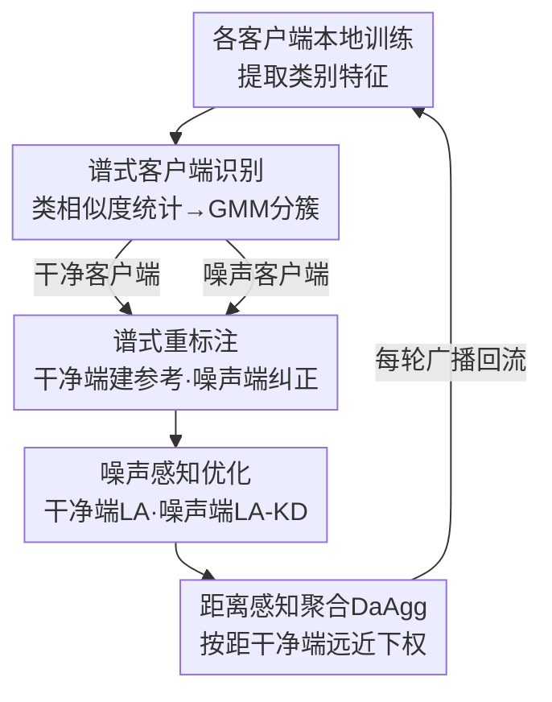

# FedSIR: Spectral Client Identification and Relabeling for Federated Learning with Noisy Labels

**会议**: CVPR 2026  
**arXiv**: [2604.20825](https://arxiv.org/abs/2604.20825)  
**代码**: https://github.com/sinagh72/FedSIR (有)  
**领域**: 联邦学习 / 噪声标签 / 鲁棒优化  
**关键词**: 联邦学习, 噪声标签, 谱结构, 客户端识别, 标签纠正

## 一句话总结
FedSIR 不再依赖 loss 轨迹或模型预测来对抗联邦学习里的噪声标签，而是利用各客户端"类别特征子空间"的谱结构——先用类间相似度统计 + GMM 把客户端分成干净/噪声两组，再让干净客户端提供谱参考、用"主方向 + 残差子空间"双判据保守地给噪声客户端重标注，最后配合 logit 调整 + 知识蒸馏 + 距离感知聚合稳住训练，在 CIFAR-10/100 各种噪声率与非 IID 设置下都超过 FedNoRo、FedELC 等 SOTA。

## 研究背景与动机
**领域现状**：联邦学习（FL）让多个客户端在不共享原始数据的前提下协同训练模型，但模型质量仍受制于本地数据质量。现实中客户端数据常在不受控环境采集，标签存在错误（noisy labels），会显著拖垮联邦模型。针对噪声标签，主流做法要么设计 noise-tolerant 损失函数，要么利用训练过程中的 loss 动态（small-loss 样本更可能是干净的）或模型预测来筛样本、纠标签。

**现有痛点**：把这些信号搬到 FL 里会失灵。FL 自带数据异构（non-IID）、聚合策略、部分客户端参与等系统特性，使得 loss 轨迹和客户端表现变得不可靠——你很难分清一个客户端表现差到底是因为标签脏，还是因为它的数据分布本来就偏。此外，很多方法依赖服务器端有一份干净验证集（如 [18]）或要估计噪声转移矩阵，这在隐私受限、分布异构的联邦场景里往往拿不到也估不准。

**核心矛盾**：噪声标签的影响和 FL 系统特性的影响**纠缠在一起**，只要还从训练动态（loss/预测）里取信号，就甩不掉这种纠缠。

**本文目标**：找一个**不依赖训练动态、不需要干净验证集、不需要噪声转移矩阵**的信号，既能判断哪些客户端脏，又能纠正脏样本的标签。

**切入角度**：作者观察到一个谱几何现象——在早期训练的模型下，同类样本在特征空间里会聚成相对集中的方向。干净客户端的各类别"主方向"彼此分得开（类间相似度低）；而标签被污染后，不同类的样本混进同一个标签集合，会把这个类的主方向拉得和其他类对齐，导致类间相似度升高，且噪声率越高这种串扰越严重。这正好是一个不依赖 loss 的结构性信号。

**核心 idea**：用客户端**类别特征子空间的谱结构**（主奇异向量的两两相似度）代替 loss 动态，来识别噪声客户端并纠正噪声标签。

## 方法详解

### 整体框架
FedSIR 是一个三阶段联邦框架，输入是 $K$ 个各自持有可能含噪本地数据集 $\mathcal{D}_k=\{(x_i,\tilde{y}_i)\}$ 的客户端，输出是一个对标签噪声鲁棒的全局模型。三个阶段依次是：**Stage I 客户端识别**（从类别谱结构把客户端分干净/噪声两组）→ **Stage II 谱式重标注**（用干净客户端的谱参考给噪声客户端纠标签）→ **Stage III 噪声感知优化**（干净端用 LA 损失、噪声端用 LA-KD 混合损失训练，最后用 DaAgg 聚合）。其中识别只做一次，重标注每 $R$ 轮做一次，优化与聚合每轮都做，干净客户端的更新单独平均出一个"干净参考模型" $\phi_{\mathrm{clean}}$ 供下一次重标注提特征。

### 关键设计

**1. 谱式客户端识别：用类间相似度统计 + GMM 替代 loss 信号区分干净/噪声客户端**

针对"loss 动态在 FL 里不可靠"这个痛点，作者把判别信号换成纯结构性的谱量。对客户端 $k$ 的每个类别 $c$，把所有标注为 $c$ 的样本特征堆成矩阵 $\mathbf{Z}_{k,c}\in\mathbb{R}^{n_{k,c}\times d}$，做 SVD 取首个右奇异向量 $\mathbf{v}_{k,c}$ 作为该类的"主方向"。类间相似度定义为主方向夹角的余弦绝对值 $[\mathbf{S}_k]_{c,c'}=|\mathbf{v}_{k,c}^\top\mathbf{v}_{k,c'}|$，构成一张 $C\times C$ 的类相似度矩阵。干净客户端各类方向分得开、off-diagonal 偏小；噪声客户端因为跨类混入而 off-diagonal 偏大。作者用两个标量概括 off-diagonal 结构——均值 $\mu_k$ 和能量（平方均值）$e_k$：

$$\mu_k=\frac{1}{|\mathcal{C}_k|(|\mathcal{C}_k|-1)}\sum_{c\neq c'}[\mathbf{S}_k]_{c,c'},\qquad e_k=\frac{1}{|\mathcal{C}_k|(|\mathcal{C}_k|-1)}\sum_{c\neq c'}[\mathbf{S}_k]_{c,c'}^2$$

然后在所有客户端的描述子 $(\mu_k,e_k)$ 上拟合一个**两分量高斯混合模型（GMM）**，自动把客户端切成干净集 $\mathcal{K}_{\mathrm{clean}}$ 和噪声集 $\mathcal{K}_{\mathrm{noisy}}$。妙处在于：这套计算完全本地完成，客户端只需上传两个标量 + 梯度，通信开销极小，既不碰原始数据也不需要服务器端干净集，识别只做一次（Stage I 各客户端先本地训 $E_1=5$ epoch）

**2. 谱式重标注：用"主方向对齐"与"残差子空间投影"双判据一致才改标签**

光识别出脏客户端不够，还要纠正它们的脏样本。作者让干净客户端贡献谱参考：对每个类 $c$，按样本数加权聚合干净客户端的主方向外积 $\mathbf{M}_c^{(r)}=\frac{1}{W_c}\sum_{k\in\mathcal{K}_{\mathrm{clean}}}w_{k,c}\mathbf{v}_{k,c}\mathbf{v}_{k,c}^\top$，取其主特征向量得到**共识主方向** $\bar{\mathbf{v}}_c^{(r)}$；同理用与主方向正交的残差方向聚合出**共识残差子空间** $\bar{\mathbf{V}}_c^{(n)}$（取 top $L=12$ 个特征向量）。对噪声客户端的每个样本特征 $\mathbf{z}_i$，算两个互补分数：主方向对齐 $S^{(r)}(i,c)=|\mathbf{z}_i^\top\bar{\mathbf{v}}_c^{(r)}|$（越大越像类 $c$），残差投影能量 $S^{(n)}(i,c)=\frac{1}{\sqrt{L}}\|\mathbf{z}_i^\top\bar{\mathbf{V}}_c^{(n)}\|_2$（越小越像类 $c$，因为真属于该类时能量应集中在主方向、残差里剩得少）。两个判据各给一个预测：

$$\hat{y}_i^{(r)}=\arg\max_c S^{(r)}(i,c),\qquad \hat{y}_i^{(n)}=\arg\min_c S^{(n)}(i,c)$$

关键是**一致性门控**：只有当 $\hat{y}_i^{(r)}=\hat{y}_i^{(n)}$ 时才接受改标签，否则保留原标签 $\tilde{y}_i$。这种"两个独立证据互相印证才动手"的保守策略，避免了单判据误纠把更多噪声引进来——消融里它确实比只用 $S^{(r)}$ 或只用 $S^{(n)}$ 都更好。重标注每 $R=20$ 轮做一次，特征由当前干净参考模型 $\phi_{\mathrm{clean}}$ 提取

**3. 噪声感知优化：干净端 LA、噪声端 LA-KD 混合，让脏客户端同时听硬标签和全局软标签**

识别+重标注之后所有客户端继续参与 FL，但本地目标按身份分流。干净客户端只用 **logit-adjusted（LA）损失**：按本地类先验 $\pi_{k,c}$ 给 logits 加偏置 $m_{k,c}=\beta\log(\pi_{k,c}+\epsilon)$ 再算交叉熵 $\mathcal{L}_{\mathrm{LA}}=\mathrm{CE}(f_{\phi_k}(x)+\mathbf{m}_k,\tilde{y})$，补偿异构带来的类别不平衡。噪声客户端则用 **LA-KD 混合目标**：既学重标注后的硬标签 $y_i^\star$，又跟全局模型蒸馏——以全局模型软预测 $\mathbf{p}_i=\mathrm{softmax}(f_{\phi_{global}}/\tau)$ 为教师，$\mathcal{L}_{\mathrm{LA\text{-}KD}}=w_{\mathrm{KD}}\,\mathrm{KL}(\mathbf{p}_i\|\mathbf{q}_i)+(1-w_{\mathrm{KD}})\,\mathrm{CE}$。两路信号互补：当重标注证据强、明显纠出错标时硬标签提供强监督；当本地标签仍可疑、重标注证据弱时，全局软标签捕捉类间关系、起正则作用防止过拟合到不可靠目标

**4. 距离感知聚合 DaAgg：按"离最近干净客户端有多远"对噪声客户端更新下权**

即便经过重标注和 KD，部分噪声客户端的更新仍可能偏离干净群体。DaAgg（借鉴 RSCFed）在标准按样本量加权之上，额外用模型参数距离压制这些更新。对噪声客户端 $k$，取它到干净集里**最近**那个客户端的 $\ell_2$ 距离 $d_k=\min_{j\in\mathcal{K}_{\mathrm{clean}}}\|\phi_k^{(t)}-\phi_j^{(t)}\|_2$（用 min 而非到干净均值，是因为异构下一个有用的噪声更新可能只像某个干净客户端的子集）。最终聚合权重 $\alpha_k=\frac{a_k\exp(-d_k)}{\sum_j a_j\exp(-d_j)}$（干净客户端 $d_k=0$）。它不是把噪声客户端踢掉，而是软性下权——离干净群体越远权重越小，既保留有用信息又抑制不可靠更新

### 损失函数 / 训练策略
全程 $T=100$ 通信轮，ImageNet 预训练 ResNet-18 作骨干，Adam 优化。Stage I 每客户端本地 $E_1=5$ epoch（LR $5\times10^{-5}$、WD $2\times10^{-2}$）算谱描述子做 GMM 分簇并以干净客户端 FedAvg 得到 $\phi^{(1)}$；Stage II–III 每轮本地 $E_2=1$ epoch（LR $3\times10^{-4}$、WD $5\times10^{-4}$），每 $R=20$ 轮触发一次谱重标注（残差子空间维度 $L=12$），干净端 $\mathcal{L}_{\mathrm{LA}}$、噪声端 $\mathcal{L}_{\mathrm{LA\text{-}KD}}$，最后 DaAgg 聚合得 $\phi^{(t+1)}$、并单独 FedAvg 干净端得 $\phi_{\mathrm{clean}}^{(t+1)}$。

## 实验关键数据

实验在 CIFAR-10 / CIFAR-100 上做，10 个客户端，对称标签噪声 30%–90%，用 Dirichlet 分布（$\alpha$ 越小越非 IID）模拟数据异构。

### 主实验（CIFAR-10，对称噪声，测试准确率 %）

| 设置 | 噪声率 | FedSIR(本文) | FedELC | FedNoRo | FedAvg |
|------|--------|------|--------|---------|--------|
| $\alpha{=}0.1$ | 30% | **78.65** | 77.71 | 77.65 | 73.67 |
| $\alpha{=}0.1$ | 90% | **77.90** | 77.72 | 76.11 | 68.90 |
| $\alpha{=}0.5$ | 30% | **84.13** | 82.85 | 82.65 | 83.14 |
| $\alpha{=}0.5$ | 90% | **83.15** | 77.74 | 81.41 | 40.24 |
| $\alpha{=}2$ | 30% | **85.72** | 84.00 | 84.93 | 84.61 |
| $\alpha{=}2$ | 90% | **84.40** | 79.73 | 82.59 | 40.90 |

在几乎所有噪声率 × 异构组合下 FedSIR 都拿到最优。最能说明问题的是**高噪声（90%）**：$\alpha{=}0.5$ 时 FedSIR 83.15 比 FedELC 77.74 高 5.4 点、比 FedNoRo 81.41 高 1.7 点；而 FedAvg 直接崩到 40.24。说明可靠的客户端识别 + 保守重标注在严重污染下尤为关键。

> ⚠️ 正文写"$\alpha{=}0.1, 0.5, 2$ 的干净客户端数分别为 3、3、5"，但 Table 1 表头标的是 5、3、3，二者不一致，以原文为准。

### 消融实验（CIFAR-10，$\alpha{=}1$，3 个干净客户端，准确率 %）

| 配置 | 30% | 60% | 90% | 说明 |
|------|-----|-----|-----|------|
| Ours（完整） | 85.21 | 84.68 | **84.51** | 完整模型 |
| w/o relabeling | 85.13 | 83.90 | 80.00 | 去谱重标注，90% 掉 4.51（最大） |
| w/o LA | 84.93 | 84.38 | 84.14 | 去 logit 调整，全段小幅掉 |
| w/o KD | 85.49 | 84.63 | 84.37 | 去蒸馏，多数噪声率略掉 |
| w/o DaAgg | 85.65 | 84.41 | 83.73 | 低噪声反而略升、高噪声掉 |

### 重标注判据消融（Table 4，$\alpha{=}1$，3 干净端，准确率 %）

| 判据 | 30% | 60% | 90% |
|------|-----|-----|-----|
| 仅 $S^{(r)}$ 主方向 | 84.73 | 84.07 | 84.06 |
| 仅 $S^{(n)}$ 残差 | 84.43 | 84.34 | 83.89 |
| 一致性（本文） | **85.21** | **84.68** | **84.51** |

### 关键发现
- **谱重标注是绝对主力**：去掉它在 90% 噪声下从 84.51 暴跌到 80.00（−4.51），是所有组件里掉点最多的；噪声越重它越重要。
- **双判据一致性优于单判据**：Agreement 在所有噪声率上都压过只用 $S^{(r)}$ 或只用 $S^{(n)}$，印证"互相印证才改"的保守策略确实减少误纠。
- **DaAgg 是高噪声的安全阀而非通用增益**：低噪声（30%）下 w/o DaAgg 反而 85.65 > 85.21，但高噪声（90%）下完整模型 84.51 > 83.73——它主要在严重污染时挡住跑偏的客户端更新。
- CIFAR-100 上结论一致，作者指出强非 IID（小 $\alpha$）时每个客户端类别更少，需要更多干净客户端来保证类覆盖、才能构出可靠谱参考。

## 亮点与洞察
- **换信号源的思路很值**：把"loss/预测动态"这个在 FL 里被系统特性污染的信号，换成"类别特征子空间的谱几何"这个不依赖训练过程的结构信号，直接绕开了"噪声影响 vs 系统影响纠缠不清"的根本矛盾。这个换轨思路可迁移到其他需要在异构联邦下做样本/客户端质量评估的任务。
- **只传两个标量做识别**：用 off-diagonal 均值 $\mu_k$ + 能量 $e_k$ 两个标量 + GMM 就完成客户端分簇，通信开销极低，对联邦场景非常友好。
- **"双证据一致才动手"的保守纠错范式**：主方向（argmax 对齐）和残差子空间（argmin 投影能量）是两个互补且独立的判据，要求一致才改标签，把误纠风险压到很低——这种"多判据投票门控"的纠错模式可复用到任何伪标签/自训练场景。
- **DaAgg 用"到最近干净客户端"的 min 距离**而非到干净均值，照顾了异构下"好的噪声更新可能只像一部分干净客户端"的现实，比简单中心距离更鲁棒。

## 局限与展望
- **只验证了对称（完全随机）噪声**：作者明确把扩展到非对称噪声（asymmetric noise，类别相关的系统性误标）列为未来工作；现实里的标注错误往往是非对称的，谱串扰假设是否仍成立存疑。
- **假设干净客户端"足够多且覆盖各类"**：Stage II 要求干净集合能提供各类别可靠谱参考；强非 IID 下每客户端类别少，作者自己也承认需要更多干净客户端，否则谱参考可能不全。
- **依赖早期模型的特征质量**：谱结构基于"早期训练模型下同类聚成方向"的现象，若预训练骨干（ImageNet ResNet-18）与目标域差距大，特征本身分不开，识别与重标注都会退化。
- **只在 CIFAR-10/100 + ResNet-18 上验证**：未涉及更大数据集、更复杂任务或真实联邦标注噪声，泛化性待验证。
- **超参偏多**（$\beta$、$\tau$、$w_{\mathrm{KD}}$、$R$、$L$、GMM 等），论文未给充分敏感性分析，实际部署调参成本可能不低。

## 相关工作与启发
- **vs FedNoRo [20]**：FedNoRo 也是多阶段、也用 DaAgg，但它靠**每类 loss 值**识别噪声客户端、并用全局模型 KD 引导噪声客户端（不显式重标注）。FedSIR 把识别信号换成谱结构、且显式做"双判据一致"的标签纠正——在 90% 高噪声下优势明显（如 $\alpha{=}0.5$：83.15 vs 81.41）。
- **vs FedELC [8]**：FedELC 沿用 FedNoRo 的噪声客户端检测，在第二阶段把每个噪声样本的真标签建成可微软分布与网络联合优化。FedSIR 不做软分布联合优化，而是用谱参考一致性硬纠错，高噪声下更稳（$\alpha{=}2$ 90%：84.40 vs 79.73）。
- **vs FedCorr [21]**：FedCorr 用 local intrinsic dimension 度量预测空间差异来分干净/噪声客户端，仍属"预测空间"信号；FedSIR 用更底层的特征子空间谱结构，且不依赖预测。
- **vs RoFL [22] / RHFL [4]**：RoFL 用全局聚合的类中心做样本选择+伪标签，RHFL 按估计的标签质量重加权客户端聚合权重；二者在本文实验里高噪声下表现都较弱（RHFL 在 $\alpha{=}0.1$ 仅 20–27%）。FedSIR 的谱信号更稳健。
- **启发**：把"类别主方向两两相似度"当作数据/标签质量的结构性探针，是一个轻量、隐私友好且不依赖训练动态的工具，值得迁移到联邦下的客户端异常检测、数据估值等问题。

## 评分
- 新颖性: ⭐⭐⭐⭐ 用类别特征子空间谱结构替代 loss/预测信号来识别噪声客户端并纠标签，角度新颖；但组件（LA、KD、DaAgg）多为已有技术拼装。
- 实验充分度: ⭐⭐⭐⭐ CIFAR-10/100 × 多噪声率 × 多异构 + 组件消融 + 判据消融，较系统；但只验证对称噪声、单骨干、单数据规模，缺敏感性分析。
- 写作质量: ⭐⭐⭐⭐ 动机与三阶段方法讲得清楚、算法伪代码完整；干净客户端数在正文与表格不一致是小瑕疵。
- 价值: ⭐⭐⭐⭐ 在高噪声 FL 下稳定超过 FedNoRo/FedELC，且通信开销低、不需服务器干净集，实用价值好。

<!-- RELATED:START -->

## 相关论文

- [\[ICCV 2025\] Client2Vec: Improving Federated Learning by Distribution Shifts Aware Client Indexing](../../ICCV2025/ai_safety/client2vec_improving_federated_learning_by_distribution_shifts_aware_client_inde.md)
- [\[CVPR 2025\] FedAWA: Adaptive Optimization of Aggregation Weights in Federated Learning Using Client Vectors](../../CVPR2025/ai_safety/fedawa_adaptive_optimization_of_aggregation_weights_in_federated_learning_using_.md)
- [\[CVPR 2026\] FedDAP: Domain-Aware Prototype Learning for Federated Learning under Domain Shift](feddap_domain-aware_prototype_learning_for_federated_learning_under_domain_shift.md)
- [\[CVPR 2026\] Domain-Skewed Federated Learning with Feature Decoupling and Calibration](domain-skewed_federated_learning_with_feature_decoupling_and_calibration.md)
- [\[CVPR 2026\] FedAFD: Multimodal Federated Learning via Adversarial Fusion and Distillation](fedafd_multimodal_federated_learning_via_adversarial_fusion_and_distillation.md)

<!-- RELATED:END -->
