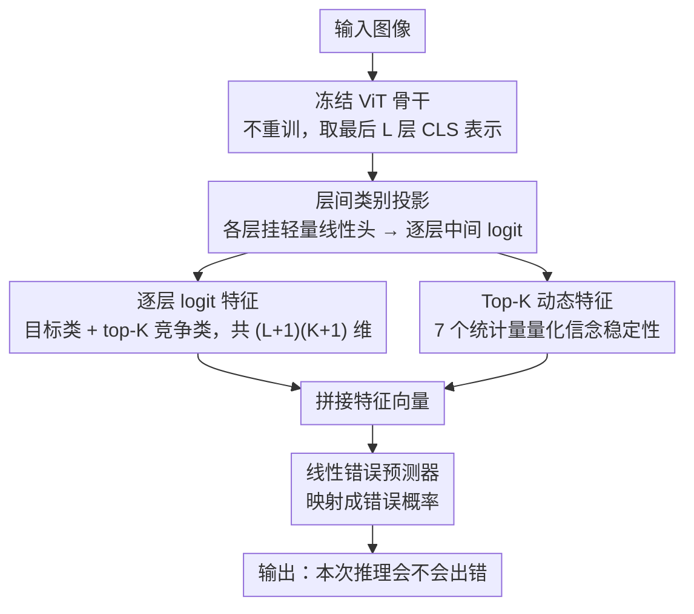

# LogitDynamics: Reliable ViT Error Detection from Layerwise Logit Trajectories

**会议**: CVPR 2026  
**arXiv**: [2604.10643](https://arxiv.org/abs/2604.10643)  
**代码**: 无  
**领域**: AI安全/可靠性  
**关键词**: 错误预测, 置信度估计, Vision Transformer, 层间动态, 幻觉检测

## 一句话总结
LogitDynamics 通过在 ViT 各层附加轻量分类头，提取层间 logit 轨迹和 top-K 竞争动态特征，训练线性探针来预测模型错误，在跨数据集泛化上优于现有方法。

## 研究背景与动机

**领域现状**：可靠的置信度估计对高风险场景至关重要。现有方法包括贝叶斯不确定性估计（MC Dropout、深度集成）和基于 logit/softmax 的后验方法。

**现有痛点**：现代模型即使错误时也可能过度自信，分布偏移下更加明显。单一最终层 logit 忽略了类别证据在网络深度上的演化过程。

**核心矛盾**：最终层的置信度分数是一个静态快照，无法反映模型在推理过程中"信念"的变化稳定性。

**本文目标**：利用 ViT 内部层间信号来更好地预测模型何时会犯错。

**切入角度**：受 LLM 幻觉检测中利用内部信号的启发，检验 ViT 中是否存在类似的深度方向信号。

**核心 idea**：正确预测往往表现出稳定的 top-K 结构，错误预测则伴随 top 类别的剧烈波动——捕获这种层间动态可以预测错误。

## 方法详解

### 整体框架
LogitDynamics 想回答一个问题：能不能在不改动、不重训 ViT 的前提下，预判它这一次推理会不会出错？它的做法是把骨干网络冻住，只在最后 L 层各挂一个轻量线性头，让每一层的 CLS 表示都能投影出一组"假如现在就分类会得到什么"的中间 logit。把这些层间 logit 沿深度方向拼成一条轨迹，再从轨迹里抽出两类信息——每层的目标类与竞争类 logit、以及 top-K 类别随层变化的稳定性统计量——合成一个特征向量，最后喂给一个线性探针输出"会不会错"的概率。整条管线推理时只多花几个线性头的前向，不碰原模型的权重。

### 关键设计

**1. 层间类别投影：把"中间想法"显式读出来**

最终层那一个 softmax 只是模型推理的终点快照，看不到证据是怎么一层层累积或反复横跳的。这里对最后 L 层的 CLS token 各训一个轻量线性头，于是每一层都能产出一份 logit，相当于把 ViT 每一层"如果现在就下结论"的中间想法显式读出来。从每层取出目标类 logit 和 top-K 竞争类 logit，再接上最终分类器对应的那一份，拼成 $(L+1)(K+1)$ 维特征。这样做的依据是：已有研究发现中间层预测会跨层漂移、甚至出现"想太多"（overthinking）反而把对的答案改错的现象，而这种漂移模式本身就携带着"靠不靠谱"的信息——把它喂给错误预测器，比只看终点 logit 信息量大得多。

**2. Top-K 动态特征：用 7 个统计量量化"信念稳不稳"**

光有逐层 logit 还不够，关键在于刻画 top 假设沿深度方向到底稳不稳。作者从层间轨迹里算出 7 个统计量来概括这件事：Top-1 切换率、Top-K 加权 Jaccard 相似度、唯一 Top-K 计数、Top-1 众数频率、Top-1 熵、Top-1 唯一计数、Top-1 锁定深度。直觉很直接——预测对的时候，模型往往很早就锁定某个类别、之后各层都稳稳保持它；预测错的时候，top 类别会在层间反复争夺、迟迟定不下来。这组统计量恰好把这种"早锁定 vs 反复横跳"的差异编码成数字，而且它捕获的是一种鲁棒性信号：在分布偏移下，单看终点置信度容易被过度自信骗到，但"信念抖不抖"这件事更难伪装，跨数据集时尤其有用。

**3. 线性错误预测器：保持后验方法的轻量**

有了上面这套特征，最后只用一个简单的线性分类器把它映射成错误概率。之所以坚持用线性而不是更花哨的网络，是为了守住和传统后验置信度估计同一档的效率——骨干完全冻结，推理时只需一次前向加几个线性头加一点统计计算。换句话说，它把"读模型内部信号"这件本来需要重训或复杂架构的事，压缩成了几乎零额外成本的后处理，却换来了更丰富的判别依据。

### 损失函数 / 训练策略
层间线性头用标准交叉熵训练（骨干冻结），错误预测器用二元交叉熵训练。

## 实验关键数据

### 主实验

| 数据集 | 指标(AUCPR) | LogitDynamics | Top-K logits | 提升 |
|--------|-------------|---------------|-------------|------|
| ImageNet | AUCPR | 0.6458 | 0.6098 | +0.036 |
| CIFAR-100 | AUCPR | 0.4430 | 0.4164 | +0.027 |
| Places365 | AUCPR | 0.7232 | 0.7283 | -0.005 |

### 消融实验

| 配置 | 域内均值 | 跨域均值 | 说明 |
|------|---------|---------|------|
| w/ dynamics | 基线 | +0.0155 | 动态特征改善跨域迁移 |
| w/o dynamics | 基线 | 基线 | 域内略好但跨域差 |

### 关键发现
- 动态特征在域内贡献不大（-0.0107），但在跨数据集迁移时显著改善（+0.0155），起到鲁棒性信号的作用
- LLM 幻觉检测方法（线性探测、ACT-ViT）直接迁移到视觉任务效果不佳
- logit-based 方法整体优于激活-based 方法，表明视觉和语言模型的内部信号特性不同

## 亮点与洞察
- **跨模态启发**：从 LLM 幻觉检测迁移思路到视觉模型，发现视觉模型有独特的 logit 动态模式
- **简洁高效**：方法极其简单（线性探针+7 个统计量），但在跨域泛化上显著优于复杂方法

## 局限与展望
- 仅在 ViT-Large 上验证，未测试其他架构
- 需要额外训练层间线性头
- 未来可探索在更多架构和任务上的适用性

## 相关工作与启发
- **vs ACT-ViT**: ACT-ViT 用 ViT 风格架构处理激活张量，过于复杂且跨域泛化差
- **vs Mahalanobis**: 特征空间距离方法在错误预测任务上效果较差（AUCPR 0.32）

## 评分
- 新颖性: ⭐⭐⭐⭐ 跨模态启发新颖，方法简洁但有效
- 实验充分度: ⭐⭐⭐⭐ 域内外评估完整，消融清晰
- 写作质量: ⭐⭐⭐⭐ 动机清晰，结构规范
- 价值: ⭐⭐⭐ 方向有意义但改进幅度有限

<!-- RELATED:START -->

## 相关论文

- [\[CVPR 2026\] Enhancing Out-of-Distribution Detection with Extended Logit Normalization](enhancing_out-of-distribution_detection_with_extended_logit_normalization.md)
- [\[NeurIPS 2025\] Revisiting Logit Distributions for Reliable Out-of-Distribution Detection](../../NeurIPS2025/ai_safety/revisiting_logit_distributions_for_reliable_out-of-distribution_detection.md)
- [\[CVPR 2026\] FecalFed: Privacy-Preserving Poultry Disease Detection via Federated Learning](fecalfed_privacy-preserving_poultry_disease_detection_via_federated_learning.md)
- [\[CVPR 2026\] Tutor-Student Reinforcement Learning: A Dynamic Curriculum for Robust Deepfake Detection](tutor-student_reinforcement_learning_a_dynamic_curriculum_for_robust_deepfake_de.md)
- [\[NeurIPS 2025\] SPROD: Spurious-Aware Prototype Refinement for Reliable Out-of-Distribution Detection](../../NeurIPS2025/ai_safety/spurious-aware_prototype_refinement_for_reliable_out-of-distribution_detection.md)

<!-- RELATED:END -->
