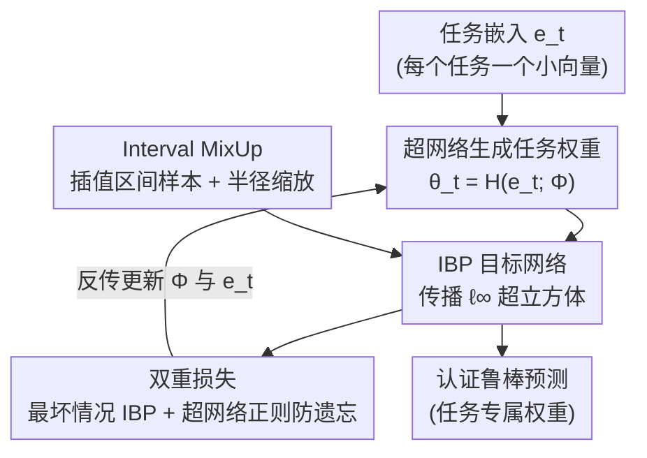

# SHIELD: Secure Hypernetworks for Incremental Expansion Learning Defense

**会议**: CVPR 2026  
**arXiv**: [2506.08255](https://arxiv.org/abs/2506.08255)  
**代码**: https://github.com/pkrukowski1/SHIELD (有)  
**领域**: AI安全 / 持续学习 / 对抗鲁棒性  
**关键词**: 可认证鲁棒性、超网络、区间界传播(IBP)、持续学习、Interval MixUp

## 一句话总结
SHIELD 把区间界传播(IBP)塞进超网络架构，用一个共享超网络从紧凑任务嵌入生成每个任务的鲁棒子模型，再配上专为区间运算设计的 Interval MixUp 训练策略，第一次在持续学习场景下做到「不存回放缓冲、不存梯度日志，还能给出可认证的对抗鲁棒性」，在 PGD / AutoAttack 等强白盒攻击下平均精度刷到 SOTA。

## 研究背景与动机
**领域现状**：持续学习(continual learning)和对抗鲁棒性(adversarial robustness)长期被当成两个孤立问题各自研究。持续学习这边主流是用回放缓冲、梯度投影(GPM/DGP)、正则化(EWC/SI)来对抗灾难性遗忘；对抗鲁棒这边则有对抗训练、可认证防御(如 IBP)。但现实里的智能系统——自动驾驶、机器人、医疗——既要持续适应新环境，又要在整个生命周期里抵御对抗扰动，两者必须同时满足。

**现有痛点**：少数想同时做两件事的工作都有硬伤。AIR 用无监督数据增强提升鲁棒性，但只在很短的任务序列上验证过，扛不住复杂 benchmark；DGP(Double Gradient Projection)靠约束权重更新来保鲁棒，却要为每个任务存大量梯度信息，既不适配大规模数据/现代架构，存梯度本身又带来隐私问题。更尴尬的是，DGP 作者自己发现：他们的投影策略虽然提升了持续学习性能，反而让模型更容易被对抗攻击——保留旧知识和保证鲁棒之间存在一个根本性的 trade-off。

**核心矛盾**：① 要可扩展、要隐私，就不能存回放/梯度/全模型快照；② 要可认证鲁棒，就得对最坏扰动给出形式化保证；③ 还得不遗忘旧任务。现有方法顶多满足其中一两个，没人能三者兼得，而且几乎没人在这个交叉点上用过超网络(hypernetwork)。

**本文目标**：造一个统一框架，让持续学习的每个任务模型都「天生可认证鲁棒」，同时不依赖任何需要存储历史数据的机制。

**切入角度**：超网络的妙处是——不直接训练目标网络，而是训练一个共享元网络 $\mathcal{H}$，让它从一个小小的任务嵌入 $\boldsymbol{e}_t$ 生成该任务的全部权重。这样所有任务知识都压缩进同一个超网络里，新任务只需学一个新嵌入，天然规避了存回放/快照。把 IBP 接到超网络生成的目标网络上，就能让每个任务模型自带认证鲁棒。

**核心 idea**：用「共享超网络生成 IBP 目标网络」替代「存历史数据的持续学习」，再用 Interval MixUp 解决 IBP 在大扰动半径下界过松、训练不稳的老毛病。

## 方法详解

### 整体框架
SHIELD 要解决的是「一串任务顺序到来、每个任务模型都要可认证鲁棒、还不能遗忘旧任务、更不能存历史数据」。整体只有两个主部件：一个**超网络** $\mathcal{H}$（带参数 $\boldsymbol{\Phi}$）负责把第 $t$ 个任务的可训练嵌入 $\boldsymbol{e}_t$ 映射成目标网络权重 $\boldsymbol{\theta}_t = \mathcal{H}(\boldsymbol{e}_t;\boldsymbol{\Phi})$；一个**目标网络** $f_{\boldsymbol{\theta}_t}$ 不直接训练、而是接收输入的 $\ell_\infty$ 超立方体并用 IBP 逐层传播区间界，从而对该任务给出认证鲁棒预测。

训练时，对每个任务，超网络生成目标网络权重 → 目标网络以 Interval MixUp 构造的「虚拟区间样本」做前向 + IBP 区间传播 → 用最坏情况交叉熵(IBP loss)训鲁棒、用超网络正则项 $\mathcal{L}_{\text{out}}$ 防遗忘。推理时只要给出任务 id，超网络当场生成对应权重，无需任何历史存储。下图给出从嵌入到认证输出的整条流向：

### 关键设计

**1. 超网络生成任务权重：把所有任务知识压进一个共享元网络**

这一步直接针对「不能存回放/梯度/快照，但又要不遗忘」的痛点。SHIELD 不直接训练目标网络，而是让超网络 $\mathcal{H}(\boldsymbol{e}_t;\boldsymbol{\Phi})=\boldsymbol{\theta}_t$ 为每个任务现场生成一套权重，每个任务只对应一个可训练嵌入 $\boldsymbol{e}_t\in\mathbb{R}^N$。于是分类器写成 $f_{\boldsymbol{\theta}_t}(\cdot)=f\big(\cdot;\mathcal{H}(\boldsymbol{e}_t;\boldsymbol{\Phi})\big)$。所有任务的信息都被编码进同一份超网络参数 $\boldsymbol{\Phi}$ 和一组紧凑嵌入里，训练完单个元模型就能产出各任务专属权重——这就是它能「零历史存储」做持续学习的根本原因，相比 DGP 那种存每任务梯度的做法，既省存储又规避隐私问题。

**2. IBP 目标网络：传播区间而非单点，换来可认证鲁棒**

针对「要对最坏扰动给形式化保证」。目标网络不吃单个输入点 $x$，而是吃一个以 $x$ 为中心、半径 $\varepsilon$ 的 $\ell_\infty$ 超立方体 $I_\varepsilon(x)=[x_1-\varepsilon,x_1+\varepsilon]\times\dots\times[x_d-\varepsilon,x_d+\varepsilon]$，然后用 IBP 逐层把这个盒子传过去。为高效传播，采用中点-半径表示：对仿射层 $z_k=W_k z_{k-1}+b_k$，有

$$\mu_k = W_k\mu_{k-1}+b_k,\qquad r_k=|W_k|\,r_{k-1},\qquad \underline{z}^\star_k=\mu_k-r_k,\;\bar{z}^\star_k=\mu_k+r_k,$$

其中 $|\cdot|$ 是逐元素绝对值；再过单调非减激活 $g$ 得 $\underline{z}_k=g(\underline{z}^\star_k),\bar{z}_k=g(\bar{z}^\star_k)$。只要满足**认证鲁棒条件**——真类的下界 logit 大于所有其他类的上界 logit：$\underline{z}^{(K)}_{y_{\text{true}}}(x;\boldsymbol{\theta})>\max_{j\neq y_{\text{true}}}\bar{z}^{(K)}_j(x;\boldsymbol{\theta})$——就保证整个 $\varepsilon$-邻域内预测类别不变。这给了 SHIELD 不靠经验对抗训练、而是数学上可证的鲁棒性。

**3. Interval MixUp：插值「区间盒子」而非样本点，并按距离缩放半径**

这是本文最核心的创新，专治「IBP 在大扰动半径 $\varepsilon$ 下梯度不稳、区间界过松、过度近似」的老毛病。标准 MixUp 在两个样本点之间线性插值，但直接搬到认证训练里行不通——给远离数据流形的虚拟点套大扰动半径既没必要又有害。Interval MixUp 改成在两个 $\ell_\infty$ 超立方体的中点间插值，得到一个新的虚拟超立方体；关键是它的半径按「离原始数据多远」自适应缩放：

$$\varepsilon' = |2\lambda - 1|\cdot\varepsilon,$$

其中 $\lambda\in[0,1]$ 是 MixUp 混合系数。当 $\lambda$ 接近 0 或 1（虚拟点贴近某个原始点）时半径最大；当 $\lambda=0.5$（虚拟点恰在两点正中、离数据最远）时半径缩到 0。这样既在数据流形附近保住鲁棒、又让决策边界被推得平滑。另一个关键副作用：因为插值出的超立方体半径更小，前向/反向都只在这些小盒子上跑，显著**缓解了 wrapping effect**——区间穿过非线性层时会越胀越大、越来越偏离真实可达集，导致界过于保守；小盒子让界保持更紧更有信息量。Interval MixUp 还故意**不插值标签**，而是在 loss 层面用 $\lambda$ 给两类的交叉熵加权，保持与认证训练的兼容。

**4. 双重损失：最坏情况 IBP 损失训鲁棒 + 超网络正则防遗忘**

针对「同时要鲁棒和不遗忘」。鲁棒侧采用最坏情况 logit：真类取下界、其余类取上界，得到最悲观的预测向量 $\hat{z}_{K,\hat{y}}$，再过 softmax 和交叉熵。为避免界太松，沿用 IBP 的混合损失 $\mathcal{L}_{\text{IBP}}=\kappa\,\mathcal{L}_{\text{CE}}(\sigma(\hat{y}),y_{\text{true}})+(1-\kappa)\,\mathcal{L}_{\text{CE}}(\sigma(\hat{z}_{K,\hat{y}}),y_{\text{true}})$，$\kappa$ 在干净损失与认证最坏损失间权衡（$\varepsilon=0$ 时退化为标准交叉熵）。遗忘侧加一个超网络正则项，把「学当前任务前生成的旧任务权重」和「更新后再生成的旧任务权重」拉近：

$$\mathcal{L}_{\text{out}}=\frac{1}{t_c-1}\sum_{t=1}^{t_c-1}\big\|\mathcal{H}(\mathbf{e}_t;\boldsymbol{\Phi}^*)-\mathcal{H}(\mathbf{e}_t;\boldsymbol{\Phi}+\Delta\boldsymbol{\Phi})\big\|^2.$$

论文还从理论上证明(Theorem 3.1)：只要参数更新 $\boldsymbol{h}$ 引起的 logit 变化不超过认证间隔的一半 $\Delta_{\max}^{(s,t)}(x;\boldsymbol{h})\le\frac{1}{2}M(x,y_{\text{true}};\boldsymbol{\theta}_{s,t})$，旧任务的认证鲁棒就能被保住——所以这个正则项不光防遗忘，还顺带**保住了旧任务的鲁棒证书**。

### 损失函数 / 训练策略
- **总损失**（标准 IBP 版）：$\mathcal{L}_{\text{total}}=\mathcal{L}_{\text{IBP}}+\beta\cdot\mathcal{L}_{\text{out}}$，$\beta>0$ 控制超网络稳定性/防遗忘强度。
- **总损失**（Interval MixUp 版，记作 SHIELD$_{\text{IM}}$）：把 $\mathcal{L}_{\text{IBP}}$ 换成 Interval MixUp 损失 $\mathcal{L}_{\text{IMixUp}}=\kappa\,\mathcal{L}_{\text{MixUp}}(\tilde{x},y_a,y_b)+(1-\kappa)\,\hat{\mathcal{L}}_{\text{MixUp}}([\tilde{x}-\varepsilon',\tilde{x}+\varepsilon'],y_a,y_b)$，其中干净项和区间项都按 $\lambda,1-\lambda$ 对两类 $y_a,y_b$ 加权，最终 $\mathcal{L}_{\text{total}}=\mathcal{L}_{\text{IMixUp}}+\beta\cdot\mathcal{L}_{\text{out}}$。
- **关键超参**：$\kappa$ 在训练中采用 annealing 退火调度以稳定优化；$\varepsilon$ 训练半径越大越鲁棒但越伤干净精度，Interval MixUp 正是用来缓解这个 trade-off。
- **设定**：主实验在 Task-Incremental Learning(任务 id 已知)下做，方法也自然扩展到 Class-Incremental Learning(CIL)并保留相当鲁棒性。

## 实验关键数据

### 主实验
四个标准 benchmark：Permuted MNIST、Rotated MNIST、Split CIFAR-100、Split miniImageNet；强白盒攻击 AutoAttack / PGD / FGSM + 干净样本。指标：平均精度 AA $=\frac{1}{T}\sum_t R_{T,t}$ 与后向迁移 BWT $=\frac{1}{T-1}\sum_t (R_{T,t}-R_{t,t})$（衡量遗忘）。

| 数据集 | 指标 | SHIELD | SHIELD$_{\text{IM}}$ | 之前最好(DGP) |
|--------|------|--------|------|----------|
| Rotated MNIST | AutoAttack AA | **85.64** | 82.91 | 81.6 |
| Rotated MNIST | PGD AA | 92.94 | **97.88** | 82.6 |
| Rotated MNIST | 干净 AA | 95.62 | **98.32** | 98.1 |
| Split CIFAR-100 | AutoAttack AA | 60.91 | **63.08** | 36.6 |
| Split CIFAR-100 | PGD AA | 59.77 | **62.39** | 39.2 |
| Split miniImageNet | AutoAttack AA | 56.22 | **57.9** | 32.1 |
| Split miniImageNet | PGD AA | 56.8 | **58.47** | 33.8 |
| Split miniImageNet | 干净 AA | 59.52 | **62.67** | 44.8 |

要点：在最难的 Split miniImageNet 上，SHIELD 把对抗 AA 从 DGP 的 32.1%(AutoAttack) 拉到 56~58%，干净 AA 从 44.8% 拉到 59.5~62.7%，几乎全面翻倍且全任务领先；遗忘 BWT 控制在 -0.16/-0.18，远好于多数 baseline。

### 消融实验
核心消融就是「有没有 Interval MixUp」(SHIELD vs SHIELD$_{\text{IM}}$)，体现在上表两列对比：

| 配置 | 现象 | 说明 |
|------|------|------|
| SHIELD (纯 IBP) | AutoAttack 已 SOTA | 超网络 + IBP 本身就压过所有 baseline |
| SHIELD$_{\text{IM}}$ (+Interval MixUp) | PGD/干净/复杂数据集普涨 | Rotated MNIST PGD 92.94→97.88、干净 95.62→98.32；CIFAR-100 与 miniImageNet 各指标普遍再提升 |
| Verified accuracy 对比 | IM 显著高于纯 IBP | Interval MixUp 训练的模型 verified accuracy 接近其 classical accuracy，证明界更紧 |

### 关键发现
- **Interval MixUp 是把鲁棒-精度 trade-off 解开的关键**：纯 IBP 在大 $\varepsilon$ 下会牺牲干净精度，IM 通过按距离缩半径($\varepsilon'=|2\lambda-1|\varepsilon$)同时抬高对抗和干净 AA，在越复杂的数据集(CIFAR-100/miniImageNet)上收益越明显。
- **半径缩放缓解 wrapping effect**：插值出的小盒子让区间传播时不会过度膨胀，verified accuracy 因此逼近 classical accuracy（Fig. 3）。
- **FGSM 结果相对偏低**：作者解释为测试 $\varepsilon_{\text{attack}}$ 与训练 $\varepsilon$ 不匹配所致，不是方法本身缺陷——这是个诚实但需注意的 caveat。
- **可扩展到 CIL**：SM 显示在 Class-Incremental Learning 下 SHIELD 仍稳定超过强 baseline，是首个在 CIL 下展示实质认证鲁棒的方法。

## 亮点与洞察
- **用超网络当「鲁棒持续学习的载体」是漂亮的解耦**：把「记住所有任务」交给共享超网络 + 紧凑嵌入，「鲁棒」交给 IBP 目标网络，一个架构同时拿下零存储、防遗忘、可认证三件事，思路干净。
- **Interval MixUp 的半径缩放 $\varepsilon'=|2\lambda-1|\varepsilon$ 是真正的点睛之笔**：它精准识别出「离数据越远的虚拟点越不该套大扰动」这一直觉，并用一个极简公式落地，顺带缓解了区间运算的 wrapping effect——这个「插值区间盒子而非样本点」的思路可迁移到任何 IBP/可认证训练场景。
- **不插值标签、改在 loss 层加权**：保住了与认证训练的数学兼容性，是把 MixUp 嫁接到区间方法上的关键工程细节。
- **Theorem 3.1 把「防遗忘正则」和「保鲁棒证书」统一**：证明只要更新幅度小于认证间隔的一半就同时保住旧任务精度和鲁棒，给了正则项一个鲁棒性意义上的理论解释。

## 局限性 / 可改进方向
- **作者承认**：IBP 虽高效，但产生的输出界可能过于保守(过宽)，在高维场景下会同时拖累鲁棒性和计算效率。
- **FGSM 偏低暴露 $\varepsilon$ 敏感**：训练半径与攻击半径不匹配会明显掉点，说明方法对 $\varepsilon$ 的选择和泛化到未知攻击强度仍有脆弱性。
- **依赖任务 id**：主实验在 Task-IL 下做（任务身份训练/测试都已知），虽然能扩到 CIL 但仍以 Task-IL 为主战场，真实开放世界里任务边界往往不清晰。
- **改进思路**：换更紧的认证传播方法(如 CROWN/混合界)替代纯 IBP 来缓解过宽界；或把 Interval MixUp 的半径缩放函数(线性/二次/对数/余弦，SM H 已初探)做成可学习的，进一步自适应不同任务难度。

## 相关工作与启发
- **vs DGP / GPM（梯度投影类）**：它们靠存每任务梯度/子空间投影防遗忘，DGP 作者自己发现投影反而削弱鲁棒；SHIELD 不存任何梯度、用超网络生成权重，且把鲁棒做成可认证而非经验对抗训练，存储和隐私上都更优。
- **vs AIR（无监督增强做鲁棒持续学习）**：AIR 不是 attack-agnostic、只在短任务序列有效；SHIELD 任务无关、attack-agnostic，且在 SM 对比中即便假设更宽松仍超过 AIR。
- **vs 经典持续学习(EWC/SI/GEM/A-GEM)**：这些几乎不显式处理对抗鲁棒，在 AutoAttack 下精度崩到 10~45%；SHIELD 把鲁棒当一等公民，对抗 AA 普遍翻倍。
- **vs 标准 IBP / MixUp**：SHIELD 首次把 IBP 接进超网络做持续学习，并把 MixUp 从「插值样本点」改造成「插值区间盒子 + 按距离缩半径」，既保认证又缓解 wrapping effect。

## 评分
- 新颖性: ⭐⭐⭐⭐⭐ 首个把超网络 + IBP + 区间化 MixUp 统一起来、做可认证鲁棒持续学习的框架，Interval MixUp 的半径缩放是真创新。
- 实验充分度: ⭐⭐⭐⭐ 四个 benchmark、三种强攻击 + 干净、Task-IL/CIL 都覆盖且大幅领先；扣分在 seed 数偏少(部分 2~5)、FGSM 偏低需 caveat。
- 写作质量: ⭐⭐⭐⭐ 动机、方法、理论(Theorem 3.1)链条清晰；公式密集但解释到位，部分细节(annealing、半径函数选择)挪到 SM。
- 价值: ⭐⭐⭐⭐⭐ 把持续学习与可认证鲁棒这两条长期割裂的线第一次扎实接起来，对自动驾驶/机器人这类需「边学边抗攻击」的安全攸关场景有直接意义。

<!-- RELATED:START -->

## 相关论文

- [\[ACL 2026\] On the (In-)Security of the Shuffling Defense in the Transformer Secure Inference](../../ACL2026/ai_safety/on_the_in-security_of_the_shuffling_defense_in_the_transformer_secure_inference.md)
- [\[CVPR 2026\] AdvMark: Decoupling Defense Strategies for Robust Image Watermarking](decoupling_defense_strategies_for_robust_image_watermarking.md)
- [\[CVPR 2026\] All Vehicles Can Lie: Efficient Adversarial Defense in Fully Untrusted-Vehicle Collaborative Perception via Pseudo-Random Bayesian Inference](all_vehicles_can_lie_efficient_adversarial_defense_in_fully_untrusted-vehicle_co.md)
- [\[CVPR 2025\] Dynamic Integration of Task-Specific Adapters for Class Incremental Learning](../../CVPR2025/ai_safety/dynamic_integration_of_task-specific_adapters_for_class_incremental_learning.md)
- [\[CVPR 2026\] FedDAP: Domain-Aware Prototype Learning for Federated Learning under Domain Shift](feddap_domain-aware_prototype_learning_for_federated_learning_under_domain_shift.md)

<!-- RELATED:END -->
