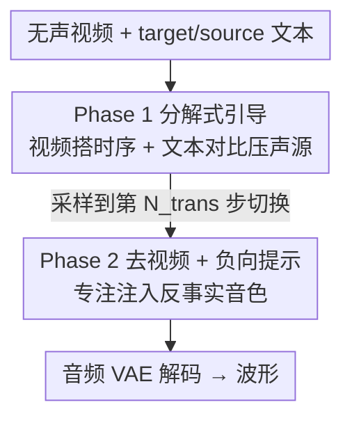

# CounterFlow: A Two-Phase Inference-Time Sampling for Counterfactual Video Foley Generation

**会议**: CVPR 2026  
**arXiv**: [2605.18916](https://arxiv.org/abs/2605.18916)  
**代码**: https://gyubin-lee.github.io/counterflow-demo/ (有, demo+code)  
**领域**: 音频生成 / 视频配音 / 扩散与 flow-matching  
**关键词**: 反事实配音, Video-to-Audio, Flow Matching, 推理时引导, 分解式 guidance

## 一句话总结
针对"给无声视频配上一个与画面物体相矛盾的声音（如猫的动作配狮吼）"这一反事实配音任务，本文提出 **CounterFlow**——一种无需重训、只在推理时介入预训练 flow-matching VT2A 模型的**两阶段采样**方法：前期用视频建立时间结构、后期丢掉视频专注塑造目标音色，并配一个基于 FLAM 共嵌入空间的新指标 $\Delta$FLAM，在 VGGSound-Sparse 上把目标声替换成功率从 0.83 提到 0.92。

## 研究背景与动机
**领域现状**：拟音（Foley）配音本质上是一个**可控**过程——事件的时机来自视频，但"该听到什么声音"往往是音效设计师的主观选择。现有的 Video&Text-to-Audio（VT2A）模型如 MMAudio、HunyuanVideo-Foley 同时吃视频和文本条件，但它们的训练目标是生成**与画面一致**的声音。

**现有痛点**：当视频内容和文本提示**相互矛盾**时（视频里是猫，文本要求"狮吼"），这些模型会"锚定"在视频隐含的声源上，文本控制被压制。即使是专门处理冲突的可控拟音方法（CAFA、MultiFoley），其采样轨迹仍常常被视频隐含声源牵着走，反事实替换不可靠。

**核心矛盾**：在预训练 flow-matching 模型里，**视觉条件主导了整条采样轨迹**，从而在整个推理过程中削弱了文本控制力。视频特征里嵌入了大量物体特定的身份信息（identity），这正是替换失败的根源。

**本文目标**：给定无声视频 $V$、描述画面声源的 source 文本 $T_{\mathrm{src}}$、与之冲突的 target 文本 $T_{\mathrm{tar}}$，生成既保留视频时间动态、又呈现 target 声源身份的音频。拆成两个子问题：(1) 保留视频的时序结构（什么时候响）；(2) 注入 target 身份并抑制视频隐含声源（响的是什么）。

**切入角度**：作者借用扩散/flow 采样的一个已知规律——**早期采样步决定宏观结构（音频时序），晚期步决定身份与细节（音色/声源）**。既然时机和身份在采样过程中本就由不同阶段负责，那就把"听视频"和"听文本"在时间轴上**解耦**到不同阶段。

**核心 idea**：把采样过程一刀切成两段——Phase 1 开着视频条件、用分解式 guidance 搭时间骨架并压制视频声源，Phase 2 关掉视频、只靠 target/source 文本对比来塑造反事实音色。

## 方法详解

### 整体框架
CounterFlow 是一个**纯推理时**方法，不在新的 $(c_{\mathrm{vid}}, c_{\mathrm{tar}}, c_{\mathrm{src}})$ 三元组上重训 backbone。给定预训练 flow-matching VT2A 模型，它预测音频隐空间里的速度场 $v_\theta(Z_t, c_{\mathrm{vid}}, c_{\mathrm{txt}}, t)$，其中视频条件和文本条件都能用各自的 null embedding（$\emptyset_{\mathrm{vid}}$, $\emptyset_{\mathrm{txt}}$）独立关闭。整条 ODE 采样从 $Z_{t_0}\sim\mathcal{N}(0,I)$ 出发，在 $\{t_i\}_{i=0}^{N}$ 网格上行进，**在第 $N_{\mathrm{trans}}$ 步处发生相位切换**：之前是 Phase 1，之后是 Phase 2，最终隐变量经音频 VAE 解码成波形。

### 关键设计

**1. 两阶段采样切分：把"建时序"和"定身份"在时间轴上解耦**

痛点是视频条件全程主导轨迹、压住文本。CounterFlow 不去改模型权重，而是利用"早期步定宏观时序、晚期步定身份细节"的采样规律，在第 $N_{\mathrm{trans}}=17$ 步（总 $N=25$ 步）处把采样切成两段：前 17 步保留视频条件来确定"声音何时发生"，后 8 步彻底移除视频条件、把容量全部让给文本对比来确定"该响哪种声源"。这样视频只在它擅长（提供时机）的阶段起作用，避免它在身份注入阶段继续干扰。消融里把两个 phase 对调（Phase swap）后，$\Delta$FLAM 几乎不变但 FAD 从 23.55 暴涨到 52.33、DeSync 从 0.67 恶化到 1.00，直接证明"先建时序、后注身份"的顺序不可颠倒

**2. Phase 1 分解式 guidance：把冲突条件拆开，避免模型预测"四不像"速度场**

普通 CFG 写成 $v_i(\emptyset,\emptyset)+w\big(v_i(c_{\mathrm{vid}},c_{\mathrm{tar}})-v_i(\emptyset,\emptyset)\big)$，问题是它把视频和 target 文本**绑在一起**送进网络，而二者语义冲突，网络会输出低保真度的速度场。本文把引导项**分解**为视频和文本两条独立通路：

$$v_i^{(1)} = v_i(\emptyset_{\mathrm{vid}},\emptyset_{\mathrm{txt}}) + w_{\mathrm{vid}}\big(v_i(c_{\mathrm{vid}},\emptyset_{\mathrm{txt}})-v_i(\emptyset_{\mathrm{vid}},\emptyset_{\mathrm{txt}})\big) + w_{\mathrm{txt}}\big(v_i(\emptyset_{\mathrm{vid}},c_{\mathrm{tar}})-v_i(\emptyset_{\mathrm{vid}},c_{\mathrm{src}})\big)$$

第二项（权重 $w_{\mathrm{vid}}=3.0$）只用视频搭建时序结构；第三项（$w_{\mathrm{txt}}=5.0$）是文本对比项，**正向推 target、负向减 source**，在搭骨架的同时就开始压制视频隐含声源。关键在于网络从不需要同时接收冲突的 $(c_{\mathrm{vid}}, c_{\mathrm{tar}})$，绕开了"四不像"预测。消融显示，若 Phase 1 退回普通 CFG（w/o decomp.），$\Delta$FLAM 直接塌到 0.0278、CLAP 塌到 0.089——证明在冲突条件下不分解就根本注入不了 target 身份

**3. 全程负向 source 提示：靠"减掉 source"持续把声源往 target 方向拽**

仅靠分解还不够。视频特征本身就携带视觉事件的身份信息，光开正向 target 提示，生成结果还会回漂到画面声源。因此本文在两个 phase 都保留 source 提示作为**负向项**：Phase 1 用 $w_{\mathrm{txt}}(v_i(\emptyset,c_{\mathrm{tar}})-v_i(\emptyset,c_{\mathrm{src}}))$，Phase 2 用 $v_i^{(2)}=v_i(\emptyset,\emptyset)+w_{\mathrm{cfg}}\big(v_i(\emptyset,c_{\mathrm{tar}})-v_i(\emptyset,c_{\mathrm{src}})\big)$（$w_{\mathrm{cfg}}=4.5$）。$\Delta$FLAM 指标恰好惩罚"target 和 source 都响"的模型，因此负向 source 项直接对应替换质量。消融里 Phase 1 去掉负向 source（w/o P1 neg.）后，即便 Phase 2 仍开着负向提示，$\Delta$FLAM 也掉到 0.0534、CLAP 掉到 0.26；而完整模型去掉 Phase 2 负向（w/o P2 neg.）时，音质/对齐略升但 $\Delta$FLAM 从 0.2641 退到 0.2373——说明 Phase 2 持续压 source 才能在骨架定好后稳稳把声音注入 target、不回漂

**4. 切换步 $N_{\mathrm{trans}}$ 作为"替换 vs 对齐"的旋钮**

$N_{\mathrm{trans}}$ 不是简单调大就好，它控制一个 trade-off：越早切换（小 $N_{\mathrm{trans}}$）越偏向声源替换（$\Delta$FLAM 高），越晚切换越偏向时间对齐（DeSync 好）。随 $N_{\mathrm{trans}}$ 增大，DeSync 持续改善而 $\Delta$FLAM 单调下滑。作者选 $N_{\mathrm{trans}}=17$，因为它落在权衡曲线的"膝点"，既保住强替换性能、又收回大部分时间对齐收益

### 损失函数 / 训练策略
本方法**无任何训练/微调**，纯推理时介入。Backbone 为预训练 MMAudio large_44k_v2，确定性 Euler 采样 $N=25$ 步，生成 8 秒音频；关键超参 $N_{\mathrm{trans}}=17$、$w_{\mathrm{vid}}=3.0$、$w_{\mathrm{txt}}=5.0$、$w_{\mathrm{cfg}}=4.5$。

## 实验关键数据

数据集为 VGGSound-Sparse Clean 子集：451 个单声源测试视频、12 个独特声源 caption；每个视频用标注 caption 作 source，与其余 11 个配成 target，共 **4,961 个 $(c_{\mathrm{vid}}, c_{\mathrm{tar}}, c_{\mathrm{src}})$ 三元组**，强制制造视频物体与目标声源的冲突。指标含：FAD↓/IS↑（音质与多样性）、CLAP↑（target 身份相关度）、DeSync↓（视音对齐），以及本文新提的 $\Delta$FLAM↑ 与正比例 $r_{>0}$↑。

### 主实验
| 方法 | FAD↓ | IS↑ | $\Delta$FLAM↑ | (+)Ratio↑ | CLAP↑ | DeSync↓ |
|------|------|-----|---------------|-----------|-------|---------|
| CAFA | 24.81 | 5.931 | 0.1289 | 0.8258 | 0.2371 | 0.5888 |
| CAFA + neg. | 31.46 | 7.606 | 0.2573 | 0.8835 | 0.1801 | 0.6431 |
| ReWaS | 75.18 | 4.223 | 0.0560 | 0.6184 | 0.1084 | 1.078 |
| ReWaS + neg. | 79.52 | 4.703 | 0.1905 | 0.7130 | 0.0947 | 1.103 |
| **CounterFlow** | **23.55** | **7.915** | **0.2641** | **0.9200** | **0.2840** | 0.6695 |
| w/o P2 neg. | 23.29 | 7.790 | 0.2373 | 0.9170 | 0.2849 | 0.6261 |

CounterFlow 在替换质量（$\Delta$FLAM 0.2641、成功率 0.92）、音质（FAD 23.55、IS 7.915）、身份相关度（CLAP 0.284）上全面领先，时间对齐（DeSync 0.67）保持有竞争力。外部 baseline 给 source 加负向提示虽能提 $\Delta$FLAM，但 CLAP 和 DeSync 同步恶化——单靠负向提示会一并削弱 target 和视频的条件，整体可控性下降。

### 消融实验
| 配置 | FAD↓ | $\Delta$FLAM↑ | DeSync↓ | CLAP↑ | 说明 |
|------|------|---------------|---------|-------|------|
| CounterFlow（完整） | 23.55 | 0.2641 | 0.6695 | 0.2840 | 完整模型 |
| w/o P1 decomp. CFG | 24.36 | 0.0278 | 0.2390 | 0.0894 | Phase 1 退回普通 CFG，身份注入彻底失败 |
| w/o P1 neg. | 21.00 | 0.0534 | 0.4362 | 0.2608 | Phase 1 去负向 source，替换塌掉 |
| Phase swap (P1↔P2) | 52.33 | 0.2367 | 0.9989 | 0.2817 | 两阶段对调，音质与对齐严重恶化 |

> ⚠️ 注：DeSync 在简化变体里偏低（看似对齐更好）并非真好，而是模型根本没偏离原始视觉声源、退化成了"照搬视频"。

### 关键发现
- **分解式 Phase 1 guidance 贡献最大**：去掉它（w/o decomp.）$\Delta$FLAM 从 0.2641 塌到 0.0278、CLAP 塌到 0.089——证明冲突条件下若不把视频/文本拆开，预训练 backbone 会无脑优先视频、压根注入不进 target 身份。
- **负向 source 提示是替换成功的必要条件**：Phase 1 去负向后 $\Delta$FLAM 仅 0.0534，说明视频特征自带声源身份、必须显式压制。
- **阶段顺序不可逆**：Phase swap 后 $\Delta$FLAM 几乎不变，但 FAD 翻倍到 52.33、DeSync 到 1.00，强力印证"早期视频定时序、晚期文本定身份"的直觉。
- **切换步是 trade-off 旋钮**：$N_{\mathrm{trans}}$ 增大时 DeSync 改善但 $\Delta$FLAM 单调下降，非单调最优，需取膝点 17。

## 亮点与洞察
- **训练-free 的"分时复用"思路**：把一条采样轨迹按"宏观结构 vs 身份细节"的物理分工切两段，让冲突的两个条件在时间上错开作用，避免它们在同一步互相打架——这个"时间轴解耦"思路可迁移到任何带冲突条件的扩散/flow 编辑任务（图像换风格保结构、视频换主体保运动）。
- **分解式 guidance 的精髓**：核心是永远不让网络同时吃 $(c_{\mathrm{vid}}, c_{\mathrm{tar}})$ 这对冲突，而是各自相对 null 取差再线性叠加，从而绕开"低保真四不像"预测；这是对 CFG 在多冲突条件下失效的一个干净修补。
- **$\Delta$FLAM 指标设计巧妙**：传统 CLAP 是 clip 级、只看"像不像 target"，会被"target 和 source 都响"的模型骗高分；本文借 FLAM 的**帧级**事件检测做 target 与 source 的差分 $P_{\mathrm{FLAM}}(c_{\mathrm{tar}})-P_{\mathrm{FLAM}}(c_{\mathrm{src}})$，专门惩罚"两个声都生成"的泄漏，把"替换"和"叠加"区分开——这是评测反事实/编辑类生成的一个可复用范式。

## 局限与展望
- **静默区间会漏声**：作者承认 CounterFlow 偶尔在视频静默期仍生成声音，说明缺乏严格的时间门控；未来可通过显式训练把生成锚定到活跃视觉线索上。
- **依赖单一 backbone 验证**：实验只在 MMAudio 上做，方法虽号称 model-agnostic，但尚未在 HunyuanVideo-Foley 等其他 VT2A backbone 上验证泛化性（作者列为未来工作）。
- **超参需手调**：$N_{\mathrm{trans}}$、三个 guidance 权重都是人工选的膝点/经验值，缺乏自适应机制；不同 backbone 或任务可能需重新调。
- **评测局限于单声源**：VGGSound-Sparse Clean 是干净单声源 benchmark，多声源混合、复杂场景下的替换效果未知。

## 相关工作与启发
- **vs CAFA / MultiFoley（可控拟音）**：它们也尝试处理冲突的视频-文本，但采样轨迹仍被视觉隐含声源拖住，常常 target 和 source 一起响（CLAP 高但 $\Delta$FLAM 低）；CounterFlow 通过时间轴解耦 + 分解 guidance 把声源彻底替换，$\Delta$FLAM 0.2641 vs CAFA 0.1289。
- **vs ReWaS**：ReWaS 从视频预测能量曲线再配文本声源，但音质（FAD 75）和对齐（DeSync 1.08）都差很多，本质上不是为冲突场景设计的。
- **vs 朴素负向提示（naive negative prompting）**：直接给 source 加负向能提 $\Delta$FLAM，但会连带削弱 target 与视频条件，CLAP/DeSync 双双恶化；CounterFlow 的"分阶段施加负向"才能在不牺牲整体可控性的前提下抑制泄漏。
- **vs 标准 CFG**：普通 CFG 把视频和 target 绑在一起送网络，冲突时产生低保真速度场；本文的分解式 guidance 是对 CFG 在多冲突条件下的针对性改造。

## 评分
- 新颖性: ⭐⭐⭐⭐ 反事实视频配音任务定义 + 推理时两阶段解耦 + 分解 guidance + 帧级差分指标，组合新颖且切中冲突条件痛点
- 实验充分度: ⭐⭐⭐ 消融严谨（四组关键消融逐一印证设计直觉），但只在单一 backbone、单声源 benchmark 上验证，规模偏小
- 写作质量: ⭐⭐⭐⭐ 方法直觉清晰、公式与消融一一对应，逻辑链条完整
- 价值: ⭐⭐⭐⭐ 训练-free 即插即用，对影视/游戏音效设计的"换声不换画"有直接实用价值，时间轴解耦思路可迁移

<!-- RELATED:START -->

## 相关论文

- [\[CVPR 2026\] Echoes Over Time: Unlocking Length Generalization in Video-to-Audio Generation Models](echoes_over_time_unlocking_length_generalization_in_video-to-audio_generation_mo.md)
- [\[CVPR 2025\] MultiFoley: Video-Guided Foley Sound Generation with Multimodal Controls](../../CVPR2025/audio_speech/video-guided_foley_sound_generation_with_multimodal_controls.md)
- [\[CVPR 2026\] OmniSonic: Towards Universal and Holistic Audio Generation from Video and Text](omnisonic_towards_universal_and_holistic_audio_generation_from_video_and_text.md)
- [\[CVPR 2026\] Gesture2Music: A Low-Latency Real-Time Framework for Continuous Gesture-Driven Music Generation](gesture2music_a_low-latency_real-time_framework_for_continuous_gesture-driven_mu.md)
- [\[CVPR 2026\] MMAudio-LABEL: Audio Event Labeling via Audio Generation for Silent Video](mmaudio-label_audio_event_labeling_via_audio_generation_for_silent_video.md)

<!-- RELATED:END -->
