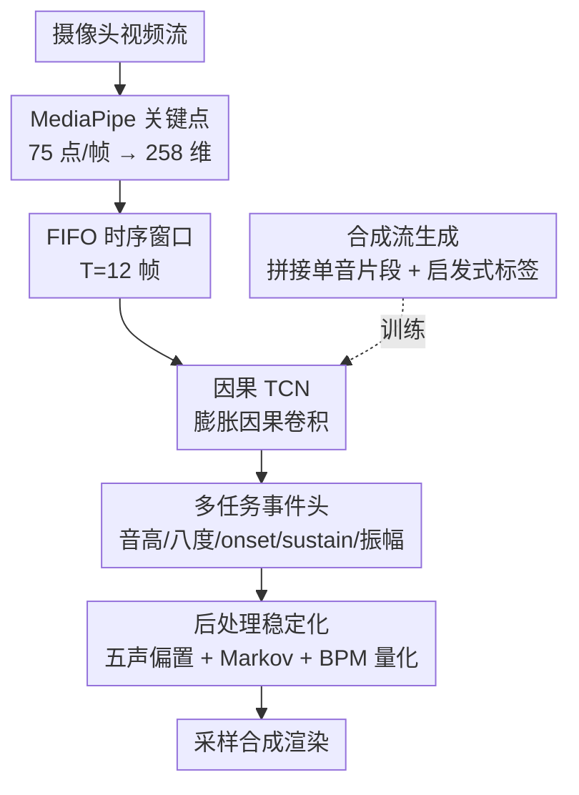

# Gesture2Music: A Low-Latency Real-Time Framework for Continuous Gesture-Driven Music Generation

**会议**: CVPR 2026  
**arXiv**: [2511.00793](https://arxiv.org/abs/2511.00793)  
**代码**: 无（demo 视频在补充材料）  
**领域**: 音频/音乐生成 · 手势交互（HCI）  
**关键词**: 手势驱动音乐生成, 因果 TCN, 流式事件预测, 低延迟实时, 合成流训练

## 一句话总结
把"摄像头手势 → 音乐"重新建模成**连续流式事件预测**（而非孤立手势分类），用因果 TCN 实时预测音高/八度/onset/sustain/振幅等音符级控制事件，配合合成流训练和三重音乐后处理稳定化，做到 25–30 ms 推理延迟、60–70 ms 端到端回路延迟的实时演奏。

## 研究背景与动机
**领域现状**：手势驱动音乐生成是一种"无接触、可表达"的人机交互范式——用户挥手、摆手就能发出音符。已有做法主要分两类：要么把手势当成孤立分类问题（每个手势独立映射到一个标签/命令），要么先预测 MIDI 等符号输出、再交给下游单独的渲染阶段出声。

**现有痛点**：这两类做法都把"理解手势"和"出声"切成了两段。孤立分类只关心"这一帧是什么手势"，没有对音符的**起音（onset）、延音（sustain）、释放、过渡**这些时序动态建模；MIDI + 后渲染的两段式则让时序连续性和实时响应都受制于拼接环节。结果是：一个在离线分类上准确率很高的模型，放到实时演奏里却会出现音符抖动、切换错乱、听感不连贯。

**核心矛盾**：手势本质是**连续的运动流**（带速度、加速度、力度调制等细粒度运动线索），但现有 pipeline 把它当成离散符号在处理，丢掉了"运动如何随时间演化为音乐"的连续性。再加上数据层面的硬伤——公开的手势-音符数据集几乎都是**孤立单音录制**，每个手势对应一个目标音，根本没有带时序事件标注的连续演奏序列可供训练流式模型。

**本文目标**：在严格实时约束下，从单一网络摄像头直接生成连续、稳定、音乐上连贯的音频；同时解决"没有连续训练数据"这个数据缺口。

**核心 idea**：把手势驱动音乐生成**从离散分类问题重构为流式事件预测问题**——用因果时序模型把关键点序列直接映射成音符级控制事件，再用合成流构造训练数据、用音乐启发式后处理压住抖动。

## 方法详解

### 整体框架
系统输入是实时网络摄像头视频，输出是连续流式音频，整条流水线分六个阶段：① 用 MediaPipe 从每帧提取身体+双手关键点；② 用 FIFO 滚动缓冲维护最近 $T=12$ 帧的关键点窗口；③ 用**因果 TCN** 对窗口做时序编码；④ 用**多任务事件头**预测音符级控制事件（音高、八度、onset、sustain、活动状态、振幅）；⑤ 推理期用三重**音乐后处理**稳定化原始预测；⑥ 用基于采样的渲染引擎把事件转成连续音频。其中真正的两大贡献是"事件化流式建模 + 因果 TCN"和"合成流训练 + 后处理稳定化"——前者解决建模范式问题，后者解决"没有连续数据 + 预测会抖"的工程问题。

形式化地，给定长度 $T$ 的因果观测窗口 $I_{t-T+1:t}$，模型学习因果映射 $f_\theta: I_{t-T+1:t} \rightarrow \mathcal{E}_t$，其中控制状态 $\mathcal{E}_t = \{\hat{\mathbf{p}}_t, \hat{\mathbf{o}}_t, \hat{u}_t, \hat{s}_t, \hat{c}_t, \hat{a}_t\}$ 同时含离散（音高分布 $\hat{\mathbf{p}}_t\in\mathbb{R}^7$、八度分布 $\hat{\mathbf{o}}_t\in\mathbb{R}^3$）与连续（振幅 $\hat{a}_t$）成分。

### 关键设计

**1. 因果 TCN backbone：用只看过去的膨胀卷积换实时性**

痛点是实时演奏不能"等未来帧"——任何用到后续帧的模型在部署时都会引入额外延迟。本文用因果 TCN：堆叠**深度可分离时序卷积块**，膨胀因子 $d\in\{1,2,4,8\}$ 逐层翻倍以扩大感受野，每个块 $\mathbf{H}^{(k)}=\phi(\text{Conv}_{\text{causal},d_k}(\mathbf{H}^{(k-1)}))$，并用**左侧零填充**保证每个时刻的预测只依赖过去观测，最后池化得到隐表示 $\mathbf{z}_t=\text{Pool}(\mathbf{H}^{(K)})$。相比 GRU/LSTM 这类循环结构需要顺序展开、难并行，膨胀因果卷积能一次性覆盖短时上下文且天然并行，更适合短时手势动态建模——消融里 TCN 把音高准确率从 GRU/LSTM 的 94% 量级抬到 97.9%

**2. 事件化多任务预测：把"是什么手势"升级成"音符现在处于什么状态"**

孤立分类只输出一个类别标签，丢掉了音符的时序生命周期。本文从共享隐表示 $\mathbf{z}_t$ 引出多个任务头，把音乐拆成可独立调控的控制维度：音高 $\hat{\mathbf{p}}_t=\text{softmax}(W_p\mathbf{z}_t+b_p)$ 和八度 $\hat{\mathbf{o}}_t=\text{softmax}(W_o\mathbf{z}_t+b_o)$ 走分类（七声 Do–Ti、三个八度）；onset $\hat{u}_t$、sustain $\hat{s}_t$、活动状态 $\hat{c}_t$ 走 sigmoid 二分类，分别管音符的"起音/延音/在不在响"；振幅 $\hat{a}_t=\sigma(W_a\mathbf{z}_t+b_a)$ 走回归管响度。这样把"音乐状态预测"和"最终音频播放"彻底解耦——同一套事件可以喂给钢琴、小提琴、长笛等不同音色库而不用改手势表示，渲染因此是乐器无关的；更关键的是 onset/sustain/active 让模型显式表达"音符正在起、正在延、刚停"，这是孤立分类完全没有的时序结构

**3. 合成流生成：没有连续演奏数据，就把单音片段缝成伪连续流**

最大的数据缺口是：手势-音符数据集只有孤立单音录制，没有带时序事件标注的连续演奏。作者自采了 21 类手势-音符（7 声 × 3 八度），然后**把孤立片段之间插入短"中性停顿段"拼接成更长的伪连续序列**，并用启发式规则反推时序监督：onset 标在每段的起始攻击部分，sustain 标在中段稳态，振幅按归一化的 **attack–sustain–release 包络**生成并缩放到 $[0,1]$；插入的停顿段则标 onset=0、sustain=0、振幅=0、状态 inactive。这让网络在训练时就见过音符边界、短延音模式和不断变化的手势上下文，更接近真实流式交互，而不是只在"一个手势一个音"的离线场景里刷高分

**4. 推理期音乐后处理稳定化：用音乐先验压住神经预测的抖动**

即便预测准，逐帧原始输出仍会出现刺耳的错音和乱切换。推理期叠三重启发式：**置信度感知五声偏置**在低置信时用五声音阶先验拉偏，降低不和谐音的概率；**过渡稳定化**把当前预测和一阶 Markov 转移先验混合，$\bar{\mathbf{p}}_t=(1-\eta)\hat{\mathbf{p}}_t+\eta\mathbf{T}_{n_{t-1}}$，用最近音符历史鼓励音乐上连贯的过渡、抑制乱跳；**BPM 量化**用 120 BPM 的节拍同步队列，只在节拍边界、且某音符稳定预测超过 $k$ 帧后才触发发声，让节奏整齐。这三步把神经网络"看时序"和音乐"听感稳定"之间的鸿沟补上——训练期还有时序一致性损失帮忙，但后处理是实时听感稳定的最后一道闸

### 损失函数 / 训练策略
总损失把分类、事件、回归、时序正则加权相加：
$$\mathcal{L}=\lambda_p\mathcal{L}_{pitch}+\lambda_o\mathcal{L}_{octave}+\lambda_{on}\mathcal{L}_{onset}+\lambda_s\mathcal{L}_{sustain}+\lambda_a\mathcal{L}_{amp}+\lambda_c\mathcal{L}_{active}+\lambda_t\mathcal{L}_{temp}+\lambda_{sp}\mathcal{L}_{spec}$$
其中音高/八度用交叉熵，onset/sustain/active 用二元交叉熵，振幅用平均绝对误差（MAE）。**时序一致性正则** $\mathcal{L}_{temp}=\frac{1}{B(T-1)C}\sum_b\sum_{t=2}^T\sum_c(\hat{y}_{b,t,c}-\hat{y}_{b,t-1,c})^2$ 惩罚相邻帧预测的突变以压抖动（实际作用在音高和八度序列上）；此外还有**频谱代理损失** $\mathcal{L}_{spec}$ 鼓励事件预测与稳定音频行为对齐。损失权重靠小规模验证集扫参经验选定。需要注意：当前公式没有显式建模各输出变量之间的条件依赖，时序依赖完全靠共享 backbone + 一致性损失隐式承载。

## 实验关键数据

数据集：5 名志愿者、网络摄像头 30 fps、7 声 × 3 八度 = 21 类，每类每人 30 样本 → 每人 630、合计 **3150** 段原始片段，再转成合成流训练。每帧 75 个关键点编码成 258 维向量，窗口 $T=12$。基线为同协议下的 GRU、LSTM 循环流式模型。

### 主实验（backbone + 输入表示对比）

| 模型变体 | 输入 | 验证音高 Acc (%) | 验证八度 Acc (%) |
|----------|------|-----------------|-----------------|
| **TCN** | Pose+Hands | **97.90** | **97.89** |
| GRU | Pose+Hands | 94.26 | 95.68 |
| LSTM | Pose+Hands | 94.70 | 96.39 |
| TCN | Hands Only | 96.39 | 96.56 |

因果 TCN 在相同窗口下显著优于循环基线（音高 97.90 vs GRU 94.26 / LSTM 94.70）；去掉上半身姿态、只用双手，音高从 97.90 掉到 96.39，说明上半身姿态提供了消歧手臂位置/全局运动的上下文。

### 消融实验（时序窗口大小）

| 窗口 $T$ | 音高 Acc (%) | 八度 Acc (%) | 说明 |
|----------|-------------|-------------|------|
| 8 | 97.1 | 97.0 | 上下文不足，略降 |
| **12** | **97.9** | **97.9** | 最佳，最终采用 |
| 16 | 97.6 | 97.4 | 相比 12 无明显提升，反增延迟 |

### 关键发现
- **backbone 贡献最大**：换成 TCN 比 GRU/LSTM 在音高上高约 3.2–3.6 个百分点，是单项改动里增益最明显的。
- **窗口 12 是甜区**：8 帧上下文不够、16 帧不增益还增延迟，最终取 12 平衡上下文与流式延迟。
- **延迟达标**：神经推理 25–30 ms，端到端回路 60–70 ms，都远低于 HCI 公认的 100 ms 实时阈值；瓶颈在感知+渲染而非模型本身。
- **混淆集中在相邻类**：音高上 Do/Re/Fa/La 100%、Mi 99%，主要错在 So↔Mi（6%）、Ti↔La（6%）这类手势轨迹相近的音；八度错误集中在相邻八度（高↔中 4%、中↔低 2%）。
- **活动头偏饱和**：时序可视化里活动概率长时间贴近 1.0，说明"静音/音符停止"建模得不如音高/八度好——是作者承认的弱点。

## 亮点与洞察
- **问题重构本身是最大亮点**：把"手势分类 + 后渲染"两段式改成"流式事件预测"，让 onset/sustain/active 这些时序事件成为一等公民——这思路可迁移到任何"连续运动 → 离散+连续混合输出"的实时交互任务（如手势打字、体感游戏配乐）。
- **合成流训练巧在用启发式包络造监督**：没有连续数据就用 attack–sustain–release 包络 + 中性停顿段拼出伪连续流，并自动派生 onset/sustain/振幅标签，是"数据稀缺下造时序监督"的可复用 trick。
- **乐器无关渲染**：因为预测的是符号事件而非波形，同一套手势模型可换任意音色库，解耦得很干净。
- **训练期一致性损失 + 推理期后处理双保险**：时序稳定不全压在网络上，而是训练正则 + 音乐先验后处理各管一段，工程上务实。

## 局限与展望
- **数据是拼接的伪连续流，非真实演奏**：作者承认这无法完整刻画 articulation、micro-timing、演奏者个人风格等表达性变化；启发式时序标签也未必代表真实音乐计时。
- **活动/静音建模偏弱**：活动头长期饱和，停顿与释放过渡建模不如音高/八度，需更好的停顿时序监督。
- **缺正式用户研究**：只有定性证明手势能影响音高与计时，learnability、controllability、演奏者适应性等 HCI 可用性指标尚未做正式 user study。
- **规模小**：仅 5 名志愿者、21 类，跨人群/跨录制条件的鲁棒性待验证。
- **输出变量无显式条件依赖**：当前各头独立预测，音高-八度-事件之间的联合结构靠共享 backbone 隐式承载，可考虑显式建模（如自回归/结构化输出）。

## 相关工作与启发
- **vs 孤立手势分类 [11][12]**：它们每个手势独立映射到标签/命令，没有音符时序动态；本文做流式事件预测，显式建模 onset/sustain/release，实时连续性更好。
- **vs MIDI + 后渲染两段式 [13]**：它们预测符号事件后交给独立下游渲染，拼接环节限制了连续性；本文事件预测与采样渲染端到端协同，且渲染乐器无关。
- **vs GRU/LSTM 循环流式基线**：本文用因果 TCN，膨胀因果卷积并行性好、短时上下文建模更优，音高准确率高约 3 个百分点且延迟更低。

## 评分
- 新颖性: ⭐⭐⭐⭐ 把手势音乐生成重构为流式事件预测 + 合成流造监督，范式清晰但单项技术（TCN/MediaPipe/启发式后处理）多为成熟件组合
- 实验充分度: ⭐⭐⭐ 有 backbone/输入/窗口三组消融和延迟分析，但数据集小（5 人 21 类）、缺真实连续演奏与正式用户研究
- 写作质量: ⭐⭐⭐⭐ pipeline 与公式交代清晰，六阶段结构和算法流程完整易读
- 价值: ⭐⭐⭐⭐ 低延迟实时、乐器无关、合成流训练 trick 实用，对无接触音乐交互/康复创意场景有落地潜力

<!-- RELATED:START -->

## 相关论文

- [\[ACL 2026\] RTCFake: Speech Deepfake Detection in Real-Time Communication](../../ACL2026/audio_speech/rtcfake_speech_deepfake_detection_in_real-time_communication.md)
- [\[CVPR 2026\] Echoes Over Time: Unlocking Length Generalization in Video-to-Audio Generation Models](echoes_over_time_unlocking_length_generalization_in_video-to-audio_generation_mo.md)
- [\[CVPR 2026\] CounterFlow: A Two-Phase Inference-Time Sampling for Counterfactual Video Foley Generation](counterflow_a_two-phase_inference-time_sampling_for_counterfactual_video_foley_g.md)
- [\[NeurIPS 2025\] VITA-1.5: Towards GPT-4o Level Real-Time Vision and Speech Interaction](../../NeurIPS2025/audio_speech/vita-15_towards_gpt-4o_level_real-time_vision_and_speech_interaction.md)
- [\[CVPR 2025\] HOP: Heterogeneous Topology-based Multimodal Entanglement for Co-Speech Gesture Generation](../../CVPR2025/audio_speech/hop_heterogeneous_topology-based_multimodal_entanglement_for_co-speech_gesture_g.md)

<!-- RELATED:END -->
