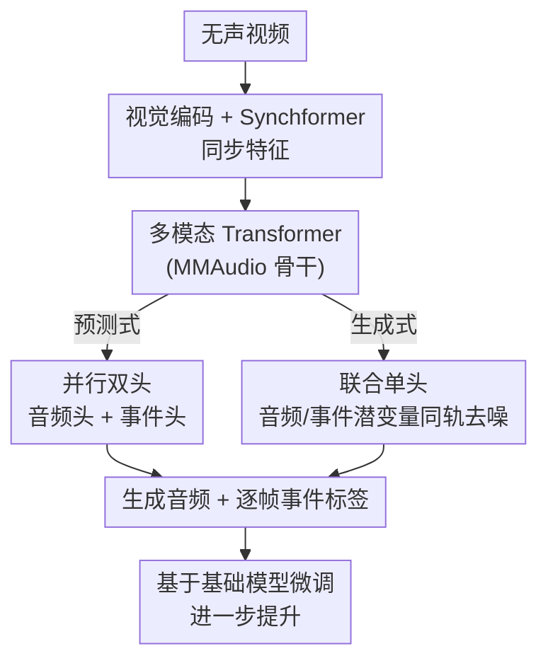

# MMAudio-LABEL: Audio Event Labeling via Audio Generation for Silent Video

**会议**: CVPR 2026  
**arXiv**: [2605.00495](https://arxiv.org/abs/2605.00495)  
**代码**: 待确认  
**领域**: 音频/语音 · 视频到音频生成 (V2A)  
**关键词**: 视频到音频生成、声音事件检测、流匹配、联合建模、基础模型微调

## 一句话总结
把"从无声视频生成音频"和"逐帧声音事件标注（事件类型 + 发声时刻）"放进同一个潜空间里联合建模，作者在 MMAudio 基础模型上探索了并行双头和联合单头两种结构，发现把事件 logit 当作连续潜变量与音频潜变量一起做流匹配去噪的"联合单头"最好，在 Greatest Hits 上把起音检测准确率从 46.7% 提到 75.0%、材质分类从 40.6% 提到 61.0%。

## 研究背景与动机
**领域现状**：从无声视频生成声音（video-to-audio, V2A）近年进展很快，MMAudio 这类模型已经能从视频里抽取语义线索和细粒度时序动态，生成与画面同步、语义合理的音频。

**现有痛点**：但现实的内容制作（如拟音/Foley、配音）不只要"一段音频"，还需要明确的**声音事件标签**——什么声音、在哪个时刻发生，这样创作者才能高效地在无声视频里放置和校验音效。现有 V2A 模型只盯着生成质量和可控性，并不暴露和视频时间轴对齐的事件级信息。

**核心矛盾**：要补事件信息，最直接的办法是给生成好的音频再接一个标准声音事件检测器（post-hoc 流水线）。但这条路天生有缺陷：检测阶段和生成阶段是解耦的，会丢掉视觉上下文、产生误差累积，而且对声学相似的事件（如脚步声 vs 敲击声）容易混淆。另一条路用目标检测先抽视觉离散线索再生成，可图像识别定义的类别又和声音事件对不上。

**本文目标**：用一个框架同时输出高质量音频 + 时间分辨的声音事件标签，且二者语义、时序都对齐。

**切入角度**：作者的假设是——如果让"音频生成"和"事件预测"共享同一套潜表示一起学，时间结构会被迫对齐，两个任务互相促进，比事后拼一个分类器更准也更可解释。

**核心 idea**：把声音事件标签塞进音频生成的潜空间里**联合生成**，而不是事后检测。

## 方法详解

### 整体框架
MMAudio-LABEL 整体沿用 MMAudio 的结构：输入一段无声视频，先用视觉编码器抽语义内容，再用 Synchformer 抽高帧率同步特征并逐层注入多模态 Transformer，在音频潜空间里用流匹配（flow matching）做生成。本文在此之上加了一条"事件预测"出口，目标是输出**与音频同时间分辨率**的逐帧多类事件 logit 图。作者探索了两种把事件预测接进来的结构：并行双头（预测式）和联合单头（生成式），核心结论是后者更好。

### 关键设计

**1. 联合建模音频生成与事件标注：用共享潜空间替代事后检测**

针对"post-hoc 检测器和生成解耦、误差累积、丢视觉上下文"这个痛点，本文不再在生成完的音频上外挂分类器，而是让模型在生成音频的同时直接吐出逐帧、逐类的事件预测。直觉是：要把"哪一帧发生了什么事件"预测准，模型必须形成时序结构化的表示，而这种表示恰好也有利于音频生成本身，于是两个目标互相强化。实验也印证了这点——联合学习不仅事件预测更准，连音频质量（MCD）都比纯生成基线更好

**2. 并行双头（Parallel Heads）：在生成头旁边并联一个事件预测头**

这是直觉上最朴素的做法（图 2a）：保留 MMAudio 的音频生成头，再并联一个独立的事件预测头。为了让事件预测和生成出来的音频表示绑得更紧，作者把最后一个音频生成 Transformer 块的输出**拼接**进事件头的输入。事件头是个三层 MLP，用二元交叉熵（BCE）监督。它本质上仍是"预测式"——音频走流匹配、事件走分类，两条支路损失加权相加：

$$\mathcal{L} = \mathcal{L}_{\text{flow}} + w\,\mathcal{L}_{\text{bce}}$$

其中 $w$ 是权重因子（实验取 $w=1$）。这一版已经大幅超过基线，但事件和音频终究是两套出口，耦合不够彻底

**3. 联合单头（Joint Heads）：把事件 logit 当连续潜变量，与音频潜变量同轨流匹配**

这是本文最核心、效果最好的设计（图 2b）。痛点是并行双头里事件预测和音频生成仍走不同范式、不在同一条生成轨迹上。作者干脆把事件 logit **当作连续变量**纳入生成过程：训练时给真值事件标签加上随时间步变化的噪声得到"事件潜变量"，与音频潜变量**拼接**后一起喂进多模态 Transformer，流匹配头一次性预测二者，最后按维度把输出切回音频部分和事件 logit 部分。流匹配目标为

$$\mathcal{L}_{\text{flow}} = \mathbb{E}_{t,\,q(x_0),\,q(x_1,\mathbf{C})}\left\|v_\theta(t,\mathbf{C},x_t)-(x_1-x_0)\right\|^2$$

其中 $x_t = t\,x_1 + (1-t)\,x_0$ 是噪声 $x_0$（标准正态）与目标潜变量 $x_1$ 的线性插值，$\mathbf{C}$ 是视频条件。推理时从带噪音频潜变量 + 带噪事件 logit 出发，沿生成轨迹迭代去噪：音频部分经 VAE 解码成谱图再过声码器得波形，事件部分过 $\text{sigmoid}$ 得逐帧逐类概率。因为把 0/1 标签做 logit 变换会遇到 $\log(0)$，作者给真值标签加了个小常数 $\epsilon=1\times10^{-5}$。这样事件和音频真正在同一潜空间、同一条去噪轨迹里被联合生成，时序分辨率和类结构都被保住——这正是它全面胜出并行双头的原因

**4. 作为基础模型的下游微调：从 MMAudio 检查点 finetune 再上一个台阶**

作者把 MMAudio-LABEL 当作基础模型的一个下游任务来验证：联合单头既可以从零训练，也可以从 MMAudio small-16k 检查点微调。微调版在两个任务上都拿到最高分（材质分类从 scratch 的 51.9% 提到 61.0%），说明大规模多模态预训练学到的先验能迁移到这个细粒度事件标注任务上，进一步增强表现

### 损失函数 / 训练策略
- 生成用条件流匹配损失 $\mathcal{L}_{\text{flow}}$；并行双头额外加 BCE 事件损失，总损失 $\mathcal{L}=\mathcal{L}_{\text{flow}}+w\mathcal{L}_{\text{bce}}$，$w=1$。
- 联合单头把事件 logit 噪声化后与音频潜变量拼接，统一由流匹配头预测，logit 变换处加 $\epsilon=1\times10^{-5}$ 防数值问题。
- 音频从 20 维潜变量解码成 16 kHz 波形；联合单头把潜变量维度按事件类数扩展——起音检测用 21 维（20 音频 + 1 事件）、材质分类用 37 维（20 + 17）。
- 单卡 NVIDIA RTX A6000，AdamW，初始学习率 $1\times10^{-4}$，前 1,000 步线性 warm-up，50,000 步起衰减到 $1\times10^{-5}$，共训练 100,000 步，batch size 16。
- 模型在 8 秒片段上训练；2 秒测试集会先循环拼接到 8 秒再推理，取前 2 秒的预测评估。

## 实验关键数据

数据集为 Greatest Hits（用鼓槌敲击各种材质的视频，自带音轨和材质标签）。评测两个任务：起音检测（onset detection，预测敲击发生时刻）和材质分类（17 类）。

### 主实验

起音检测（±0.1 s 容差；Count match / Acc / AP 越高越好，MCD 越低越好）：

| 模型 | 训练 | Count match(%) ↑ | Acc(%) ↑ | AP(%) ↑ | MCD ↓ |
|------|------|------|------|------|------|
| CondFoley | Scratch | 30.0 | 46.7 | 63.5 | 8.85 |
| MMAudio small-16k | Pretrain | 20.6 | 24.8 | 65.1 | 9.95 |
| Event Head Only | Scratch | 17.5 | 22.0 | 74.4 | 无音频 |
| Parallel Heads | Scratch | 49.0 | 70.5 | 89.3 | 8.31 |
| Joint Heads | Scratch | 53.1 | 71.3 | 90.0 | 8.27 |
| **Joint Heads (finetune)** | Finetune | **54.6** | **75.0** | **91.6** | **8.22** |

材质分类（17 类，clip 级准确率）：

| 模型 | 训练 | 输入 | 输出 | Acc(%) ↑ |
|------|------|------|------|------|
| VGGish Classifier | Scratch | audio | label | 40.6 |
| Event Head Only | Scratch | visual | label | 39.0 |
| Parallel Heads | Scratch | visual | label + audio | 43.9 |
| Joint Heads | Scratch | visual | label + audio | 51.9 |
| **Joint Heads (finetune)** | Finetune | visual | label + audio | **61.0** |

起音检测 Acc 从基线 CondFoley 的 46.7% 提升到 75.0%；材质分类 Acc 从 VGGish 的 40.6%（且 VGGish 用的是真值音频）提升到 61.0%。

### 消融实验

上表本身就是消融阶梯，把"事件预测 + 音频生成"的耦合程度逐级加强：

| 配置 | 起音 Acc(%) | 材质 Acc(%) | 说明 |
|------|------|------|------|
| Event Head Only | 22.0 | 39.0 | 只预测事件、不生成音频，最弱 |
| Parallel Heads | 70.5 | 43.9 | 并联事件头 + 生成音频 |
| Joint Heads (scratch) | 71.3 | 51.9 | 事件与音频同潜空间联合生成 |
| Joint Heads (finetune) | 75.0 | 61.0 | 再叠加基础模型微调，最佳 |

### 关键发现
- **联合生成 > 事后预测**：从 Event Head Only → Parallel → Joint，耦合越紧效果越好，且 Joint Heads 不仅事件预测更准，连音频质量 MCD（8.27 vs 并行 8.31）都更好——印证"联合学习让两个任务互相促进"。
- **同时输出音频对事件预测有帮助**：材质分类里"label + audio"输出（43.9%）明显高于"只输出 label"（39.0%），说明生成音频这个辅助目标反过来帮模型抽到更有用的视觉线索。
- **微调放大收益**：从 51.9% → 61.0% 的提升来自基础模型先验，尤其对 carpet、drywall、glass 这类形状不显著、难分辨的材质改善明显。

## 亮点与洞察
- **把离散事件标签连续化塞进流匹配轨迹**：联合单头把 0/1 的事件 logit 当连续潜变量加噪、和音频潜变量拼接同轨去噪，是个很轻巧的"统一生成"trick——不用额外分类损失、不用额外出口，就把检测任务"翻译"成了生成任务。这个思路可迁移到任何"生成主任务 + 逐帧标注副任务"的场景（如视频生成 + 动作标签）。
- **生成质量和判别精度可以双赢**：通常会担心多任务互相拖累，但这里联合建模让 MCD 和事件准确率同时变好，提示共享时序潜表示是关键。
- **基础模型下游验证的范式**：论文同时把自己当成 MMAudio 这个 V2A 基础模型的一个下游任务案例，展示了"细粒度事件标注"也能靠微调吃到大规模预训练红利。

## 局限与展望
- **数据集单一且受控**：只在 Greatest Hits（鼓槌敲击、起音清晰、材质明确）上验证，泛化到真实开放场景的复杂声音事件（重叠声、连续声、多事件）还未知。
- **难材质仍是瓶颈**：carpet / drywall / glass 这类形状不显著的材质即便微调后也较难，说明纯视觉线索对某些材质天然信息不足。
- **类别需预先定义、维度随类数膨胀**：联合单头要把潜变量维度按事件类数扩展（17 类 → 37 维），类别多时维度和训练成本会上升，且事件类是封闭集，难以处理未见类。
- **测试要循环拼接补齐时长**：模型在 8 秒片段训练，2 秒测试集需循环拼到 8 秒，这种时长适配在更短/更长片段上的稳健性值得进一步检验。

## 相关工作与启发
- **vs MMAudio**：MMAudio 是本文的骨干和基础模型，只做高质量视频到音频生成、不暴露事件级信息；本文在其流预测网络上加事件预测出口，把"生成"扩成"生成 + 逐帧事件标注"。
- **vs CondFoley（Conditional Foley）**：CondFoley 是起音检测/材质任务的主要基线（条件式 Foley 生成）；本文用联合生成在 Count match / Acc / AP 上全面超过它（如起音 Acc 46.7% → 75.0%）。
- **vs post-hoc 声音事件检测**：传统做法是"先生成音频、再接独立 SED 分类器"，本文指出其误差累积、丢视觉上下文、混淆相似声的缺陷，用端到端联合建模规避。
- **vs 基于目标检测的视觉线索方案**：那类方法先用目标检测抽视觉离散线索再生成，但图像类别和声音事件对不上；本文直接在声音事件的标签空间里联合建模，语义更匹配。

## 评分
- 新颖性: ⭐⭐⭐⭐ 把事件 logit 当连续潜变量纳入流匹配、与音频同轨联合生成的统一视角很巧，虽是建立在 MMAudio 上的扩展。
- 实验充分度: ⭐⭐⭐ 两个任务 + 清晰的耦合度消融阶梯说服力够，但只在单一受控数据集上验证，缺开放场景和更多数据集。
- 写作质量: ⭐⭐⭐⭐ 动机—两种结构—结论的脉络清晰，图表对应明确（看起来像短文/工作坊论文，篇幅紧凑）。
- 价值: ⭐⭐⭐⭐ 直击拟音/内容制作里"既要音频又要可解释事件标签"的实用需求，联合建模的思路有迁移性。

<!-- RELATED:START -->

## 相关论文

- [\[CVPR 2026\] OmniSonic: Towards Universal and Holistic Audio Generation from Video and Text](omnisonic_towards_universal_and_holistic_audio_generation_from_video_and_text.md)
- [\[ECCV 2024\] Label-Anticipated Event Disentanglement for Audio-Visual Video Parsing](../../ECCV2024/audio_speech/label-anticipated_event_disentanglement_for_audio-visual_video_parsing.md)
- [\[CVPR 2026\] Echoes Over Time: Unlocking Length Generalization in Video-to-Audio Generation Models](echoes_over_time_unlocking_length_generalization_in_video-to-audio_generation_mo.md)
- [\[CVPR 2026\] CounterFlow: A Two-Phase Inference-Time Sampling for Counterfactual Video Foley Generation](counterflow_a_two-phase_inference-time_sampling_for_counterfactual_video_foley_g.md)
- [\[ICLR 2026\] AC-Foley: Reference-Audio-Guided Video-to-Audio Synthesis with Acoustic Transfer](../../ICLR2026/audio_speech/ac-foley_reference-audio-guided_video-to-audio_synthesis_with_acoustic_transfer.md)

<!-- RELATED:END -->
