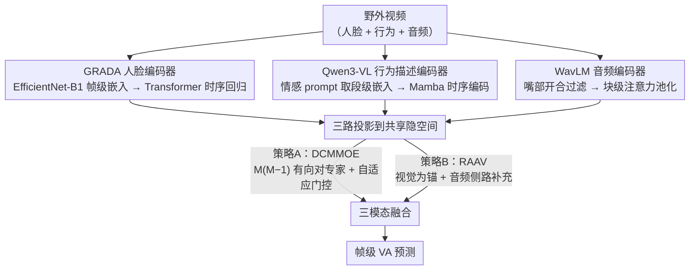

# Team RAS in 10th ABAW Competition: Multimodal Valence and Arousal Estimation Approach

**会议**: CVPR 2026 (ABAW Workshop)  
**arXiv**: [2603.13056](https://arxiv.org/abs/2603.13056)  
**代码**: [GitHub](https://github.com/SMIL-SPCRAS/CVPRW-26)  
**领域**: 音频语音  
**关键词**: 效价-唤醒估计, 多模态融合, VLM行为描述, Mamba, ABAW竞赛

## 一句话总结

首次将 VLM（Qwen3-VL-4B-Instruct）提取的情感行为描述嵌入作为独立第三模态，与 GRADA 人脸编码器和 WavLM 音频特征通过 DCMMOE 和 RAAV 两种融合策略组合，在 Aff-Wild2 上达到连续 VA 估计 CCC 0.658（dev）/ 0.62（test），验证了 VLM 行为语义对连续情感识别的价值。

## 研究背景与动机

**领域现状**：连续效价-唤醒（VA）估计在野外条件下仍然困难——外观变化大、头部姿态多样、遮挡频繁、音频噪声大。ABAW 挑战赛是该领域最权威基准，此前 SOTA 方法主要使用人脸+音频+跨注意力融合管线。

**现有痛点**：现有多模态方法仅用传统特征提取器（EfficientNet 视觉 + VGGish/WavLM 音频），无法捕捉丰富的行为级语义——面部表情变化趋势、手势含义、身体姿态与情境的关系。VLM 在视频理解中展现强大上下文捕捉能力，但尚未用于连续 VA 估计。

**核心矛盾**：传统帧级视觉特征只编码外观，缺乏对行为语义和情境上下文的理解。VLM 能提供这种高层语义，但其输出是段级而非帧级，且时间分辨率、信息密度与传统模态差异巨大，如何有效整合是关键挑战。

**本文目标** (1) VLM 段级输出如何与帧级视觉/音频对齐？(2) 噪声严重的野外音频如何可靠利用？(3) 三种时间分辨率和信息密度差异巨大的模态如何自适应融合？

**切入角度**：用 Qwen3-VL 处理视频段并通过情感导向 prompt 提取行为级嵌入→Mamba 建模段级时序→帧级展开；用嘴部开合做音频可靠性过滤；设计 DCMMOE 和 RAAV 两种融合策略。

**核心 idea**：VLM 行为描述嵌入作为第三模态 + 两种非对称融合策略（DCMMOE/RAAV），将 VLM 的行为理解能力注入连续情感估计。

## 方法详解

### 整体框架

这篇竞赛技术报告要解决的是野外连续效价-唤醒（VA）估计：在 Aff-Wild2 这种外观多变、姿态遮挡频繁、音频噪声大的视频里，逐帧预测被试的情感效价和唤醒度。整体管线先用三路**互相独立**的单模态编码器把视频拆成人脸、行为语义、音频三股表示——GRADA 人脸编码器走 Transformer 时序回归，Qwen3-VL 行为描述走 Mamba 时序编码，WavLM 音频走块级注意力池化，三者各自带独立的时序建模器并投影到共享隐空间。随后这三股表示进入**两种可选的融合策略**（DCMMOE 或 RAAV）之一，最终输出帧级 VA 预测。三个编码器的真正新意在于第二路：把 VLM 提取的行为描述当成一个独立的第三模态，补上传统人脸/音频特征看不见的高层语义。

### 关键设计

**1. GRADA 人脸编码器 + Transformer 时序回归：把帧级外观情感拉成连续时序**

人脸是 VA 估计最直接的信号，但单帧情感嵌入只是离散快照，缺乏短/中期的动态趋势。这一路先用一个在 10 个情感数据集上多任务微调的 EfficientNet-B1（仅 7.9M 参数）输出 256 维帧级情感嵌入——之所以选 B1，是它在多个骨干的横向评比里泛化与效率的折中最好；上游用 YOLO 做人脸检测、辅以手动身份标注，保证一段视频里锁定的是同一个目标。拿到帧级嵌入后，用一个 Transformer 回归模型在长度 $L=400$、步长 $S=150$ 的滑动窗口上建模时序：投影块（FC+LN+Dropout）先对齐维度，再过 $N=5$ 层、$H=16$ 头的 Transformer，最后经回归头（FC+LN+GELU+Dropout+FC）出 VA。滑动窗口设计同时保住了时序连续性、又通过窗口重叠变相扩充了训练样本。

**2. Qwen3-VL 行为描述编码器 + Mamba 时序编码：用 VLM 补上传统特征看不见的行为语义**

传统帧级视觉特征只编码外观，捕捉不到"面部表情在往哪个方向变、手势是什么含义、身体姿态和场景的关系"这类行为级语义，而这恰恰是判断情感的重要线索。这一路让 Qwen3-VL-4B-Instruct 每次处理 16 帧的视频段，配一段情感导向 prompt（显式引导模型关注面部表情、头部动作、手势、姿态与场景），取最后隐藏层 token 作为段级嵌入 $e \in \mathbb{R}^d$。这里有个关键区分：**纯视觉嵌入**只用视觉 token，**多模态嵌入**则用视频+文本联合 token——消融显示后者（CCC 0.539）远超前者（0.401），说明 prompt 引导出的文本上下文才是行为理解的关键，光靠 VLM 的视觉 token 直接回归几乎不work。段级嵌入随后过 Mamba 编码器建模时序（纯视觉版 4 层、hidden=128、state=8、kernel=3；多模态版 12 层、hidden=256、state=8、kernel=5），最后把段级预测通过"段到帧展开 + 重叠平均"还原成帧级 VA。

**3. WavLM 音频编码器 + 嘴部开合可靠性过滤：先用视觉信号筛掉噪声音频段**

Aff-Wild2 的野外音频噪声极大，很多片段根本没有有效语音，硬喂给模型反而是污染。这一路的巧思是用一个**近零成本的跨模态过滤**先把音频质量筛一遍：用 MediaPipe 检测每段的嘴部开合，只保留"张嘴时长 + 标注覆盖率"都超阈值的段——嘴在动是被试正在说话（即音频里有有效语音）的简单有效近似。过滤后的音频按 4 秒一段、2 秒重叠切分，喂给只微调顶部 4 层的 WavLM-Large（基于 MSP-Podcast 预训练）；每个 4 秒段再分成 4 个时间块，每块用注意力统计池化（加权均值 + 加权标准差）聚合，最后回归头输出 VA。

**4. DCMMOE 融合：把每一对模态的有向交互都当成一个专家，再自适应加权**

三个模态时间分辨率、信息密度差异巨大，简单拼接会抹掉它们之间的非对称关系（A 看 B 和 B 看 A 不是一回事）。DCMMOE（Directed Cross-Modal Mixture-of-Experts）的做法是：先把各模态投影到共享 $d_h$ 维空间，再为**所有有序对** $(q,k)$ 各建一个交叉注意力专家，共 $|\mathcal{E}|=M(M-1)$ 个（$M$ 个模态），每个专家是 $N$ 层 $H$ 头的交叉注意力，以模态 $q$ 当 query、模态 $k$ 当 key/value。哪个专家更重要不是固定的，而是由门控网络从平均多模态状态 $\bar{\mathbf{h}}_l$ 算出来的数据依赖权重：

$$\mathbf{g}_l = \mathbf{W}_g \bar{\mathbf{h}}_l + \mathbf{b}_g, \qquad \mathbf{z}_l = \sum_{(q,k)} \text{softmax}(\mathbf{g}_{(q,k),l})\, \mathbf{Z}_{(q,k),l}$$

这样既显式建模了"query 和 context 不对称"的有向跨模态交互，又能按当前样本自适应地决定信任哪条交互路径。

**5. RAAV 融合：以视觉为锚的非对称融合，音频只当补充上下文**

VA 估计本质上视觉主导、音频辅助，DCMMOE 对所有模态一视同仁并不完全贴合这个任务特性。RAAV（Reliability-Aware Audio-Visual fusion）改成**帧中心**的非对称设计：先在每一帧把人脸和行为特征通过 masked、可靠性感知的门控融合成视觉表示 $\mathbf{z}_{\text{vis},l} = \sum_m \alpha_l^{(m)} \mathbf{h}_l^{(m)}$，其中权重 $\alpha$ 由一个学习到的评分函数加模态先验共同决定（哪个模态此刻更可靠就给更高权重）。融合后的视觉序列再通过 bottleneck 交叉注意力从音频 token $\mathbf{B}_a$ 里抽取补充上下文：

$$\mathbf{Z}_0 = \text{LN}\big(\mathbf{Z}_\text{vis} + \text{CrossAttn}(\mathbf{Z}_\text{vis}, \mathbf{B}_a, \mathbf{B}_a)\big)$$

由视觉模态确定时间分辨率、音频只做侧路补充，正好对上"视觉决定主信号、音频提供情境"的任务直觉——实验里 RAAV 在 arousal 维度尤其强。

### 损失函数 / 训练策略

- 混合 CCC 损失 + 可选 MAE 项，valence/arousal 可独立加权
- AdamW，lr=1e-4，batch=8，ReduceLROnPlateau
- 人脸骨干 lr=5e-6，头 lr=2e-4；WavLM 微调顶部 4 层；50 epoch

## 实验关键数据

### 主实验

| ID | 配置 | Valence CCC | Arousal CCC | Avg CCC | Test Avg |
|----|------|-------------|-------------|---------|----------|
| 1 | 人脸 GRADA+Transformer | 0.587 | 0.651 | 0.619 | 0.54 |
| 2 | 行为 Qwen3 视觉+Mamba | 0.250 | 0.552 | 0.401 | - |
| 3 | 行为 Qwen3 多模态+Mamba | 0.429 | 0.648 | **0.539** | - |
| 4 | 音频 WavLM+块池化 | 0.342 | 0.464 | 0.403 | - |
| 5 | 人脸+音频 DCMMOE | 0.625 | 0.667 | 0.646 | 0.58 |
| 7 | 人脸+行为(多)+音频 DCMMOE | 0.610 | 0.688 | 0.649 | 0.61 |
| 8 | 人脸+行为(多)+音频 **RAAV** | 0.608 | **0.707** | **0.658** | **0.62** |

### 消融实验

| 对比 | Avg CCC | 差异 | 说明 |
|------|---------|------|------|
| Qwen3 多模态 vs 纯视觉 | 0.539 vs 0.401 | +0.138 | prompt 引导文本上下文至关重要 |
| 三模态 vs 双模态(人脸+音频) | 0.649 vs 0.646 | +0.003 | VLM 模态带来一致但小幅提升 |
| RAAV vs DCMMOE (三模态) | 0.658 vs 0.649 | +0.009 | RAAV 在 arousal 上优势明显 |
| 融合 vs 最佳单模态 | 0.658 vs 0.619 | +0.039 | 融合一致优于单模态 |

### 关键发现

- Qwen3 多模态嵌入（0.539）大幅优于纯视觉（0.401），差距 0.138 CCC——VLM 纯视觉特征直接做回归效果很差，必须有文本上下文引导
- 三模态融合一致优于双模态和单模态，但 VLM 增量收益仅 +0.003，可能受限于段级→帧级展开的时间分辨率损失
- RAAV 在 arousal 上特别强（0.707 vs 0.688），DCMMOE 在 valence 上稍优（0.625 vs 0.608），反映不同融合策略对不同维度的偏好
- Dev（0.658）到 test（0.62）下降 0.038 提示泛化性仍有改进空间

## 亮点与洞察

- **首次将 VLM 行为描述作为独立模态**用于连续 VA——多模态 vs 纯视觉嵌入的巨大差距（0.539 vs 0.401）清晰展示了 prompt 引导行为语义的价值。思路可推广到动作识别、社交信号处理等
- RAAV 的非对称设计（视觉决定时间分辨率，音频提供补充上下文）合理反映 VA 估计的任务特性
- 嘴部开合做音频可靠性过滤是简单但有效的跨模态策略——利用视觉信号预筛音频质量，成本近零
- DCMMOE 的 $M(M-1)$ 有向对专家 + 自适应门控比简单拼接更精细地建模模态间非对称交互

## 局限与展望

- Qwen3 段级嵌入→帧级展开存在时间分辨率硬损失，token-level 嵌入可能改善
- VLM 推理成本高（Qwen3-VL-4B），实时部署困难
- Aff-Wild2 约 3M 帧但仅 584 受试者，个体差异可能主导结果
- Dev(0.658)到 test(0.62)下降表明跨受试者泛化不足
- 未探索将 VLM 输出直接作为帧级描述而非段级嵌入

## 相关工作与启发

- **vs Yu et al. (9th ABAW 冠军)**：使用 ResNet + VGGish/LogMel + TCN + 跨模态注意力。本文增加 VLM 行为模态，用 Mamba 替代 TCN，CCC 有竞争力（0.62 test）
- **vs Praveen et al. (8th ABAW)**：GR-JCA 做双模态融合。本文 DCMMOE 建模所有有向对 + 自适应门控，融合粒度更细
- **vs Lee et al. (9th ABAW)**：Time-aware Gated Fusion。本文创新在于引入 VLM 行为模态

## 评分

⭐⭐⭐⭐

- **新颖性** ⭐⭐⭐⭐：首次将 VLM 行为描述用于连续 VA，多模态 vs 视觉嵌入对比有洞察
- **实验充分度** ⭐⭐⭐⭐：8 种配置系统对比，两种融合策略，单/双/三模态全覆盖
- **写作质量** ⭐⭐⭐⭐：结构清晰，融合策略公式化完整
- **价值** ⭐⭐⭐⭐：对情感计算 + VLM 交叉领域有参考价值

<!-- RELATED:START -->

## 相关论文

- [\[CVPR 2026\] Solution for 10th Competition on Ambivalence/Hesitancy (AH) Video Recognition Challenge using Divergence-Based Multimodal Fusion](solution_for_10th_competition_on_ambivalencehesitancy_ah_video_recognition_chall.md)
- [\[CVPR 2026\] Echoes Over Time: Unlocking Length Generalization in Video-to-Audio Generation Models](echoes_over_time_unlocking_length_generalization_in_video-to-audio_generation_mo.md)
- [\[CVPR 2026\] SAVE: Speech-Aware Video Representation Learning for Video-Text Retrieval](save_speech-aware_video_representation_learning_for_video-text_retrieval.md)
- [\[CVPR 2026\] Tri-Subspaces Disentanglement for Multimodal Sentiment Analysis](tri-subspaces_disentanglement_for_multimodal_sentiment_analysis.md)
- [\[CVPR 2026\] UniM: A Unified Any-to-Any Interleaved Multimodal Benchmark](unim_a_unified_any-to-any_interleaved_multimodal_benchmark.md)

<!-- RELATED:END -->
