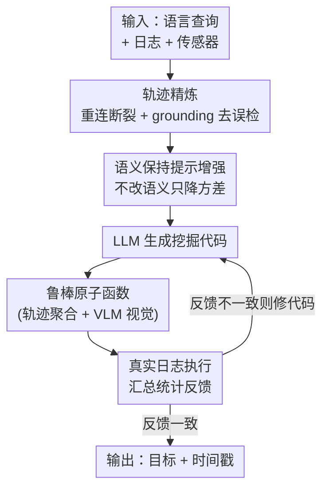

# AutoMine Solution for AV2 2026 Scenario Mining Challenge

**会议**: CVPR2026  
**arXiv**: [2606.11874](https://arxiv.org/abs/2606.11874)  
**代码**: 无  
**领域**: 自动驾驶 / 场景挖掘 / LLM+VLM  
**关键词**: 场景挖掘, Argoverse 2, 原子函数, 提示增强, 执行反馈自精炼

## 一句话总结
这是小米 EV 团队在 CVPR 2026 Argoverse 2 场景挖掘挑战赛上的技术报告：用 LLM 把自然语言查询翻译成「原子函数」程序去挖掘驾驶日志中的目标场景，并通过轨迹精炼、语义保持的提示增强、VLM 视觉原子函数、以及基于真实执行反馈的自精炼循环来对抗感知噪声和 LLM 提示敏感性，最终拿下 Timestamp BA 榜单第 1（77.21）、HOTA-Temporal 榜单第 3（36.38）。

## 研究背景与动机
**领域现状**：自动驾驶日志规模巨大，但真正稀有、关乎安全、对规划有价值的场景非常稀疏。场景挖掘（Scenario Mining）的任务是：给一句自然语言描述（如「正在超车的车辆」），从海量日志里检索出匹配的日志、时间戳和 3D 目标。近期 RefProg/RefAV 这类工作证明，LLM 可以把自然语言描述翻译成可组合的「原子函数」调用（如判断方向、相对位置、运动状态），从而做可解释的、基于轨迹的场景挖掘。

**现有痛点**：把 LLM 一把梭直接生成挖掘代码有两个硬伤。其一，**LLM 对提示极其敏感**——同样语义、换种措辞，LLM 就可能选错类别、把关系方向写反（passing 当成 overtaking）、或加上错误约束，一次性生成的代码经常系统性出错。其二，**手工定义的原子函数难以覆盖开放世界的视觉概念**（红绿灯状态、路面、行人动作、车上挂载物），这些信息光看 3D 轨迹根本拿不到；而且 Argoverse 2 的检测/跟踪轨迹本身有 ID 跳变、断裂、漏检、误检、重复框等噪声，直接喂给原子函数会污染时间定位和目标选择。

**核心矛盾**：要既保留「符号程序执行」的可解释性和精确性，又要应对「自然语言歧义 + 感知噪声 + 开放世界视觉」三重不确定性。一次性 LLM 生成的代码无法自己发现自己错在哪。

**本文目标**：构建一个多模态、对语言歧义和感知噪声都鲁棒的场景挖掘框架，且能自己修复系统性错误。

**核心 idea**：在 LLM 生成程序的前后都加「护栏」——前端用语义保持的提示增强降低 LLM 方差、用更鲁棒的轨迹/VLM 原子函数对抗噪声，后端用真实日志的执行反馈驱动代码自精炼，让程序在「跑一遍 → 看输出 → 修代码」的循环里收敛。

## 方法详解

### 整体框架
AutoMine 的输入是「一句自然语言描述 + 驾驶日志 + 传感器数据」，输出是「被指代的目标（referred actors）+ 有效的时间戳」。整条流水线可以看成「先洗轨迹、再稳输入、然后让 LLM 写程序、最后用执行反馈反复修」四步串行：先把 Le3DE2E 给出的初始 3D 轨迹做精炼（重连断裂片段、删误检），再把原始查询做语义保持的改写，接着 LLM 把改写后的描述翻译成由「鲁棒轨迹原子函数 + VLM 视觉原子函数」组合而成的挖掘代码，最后在真实日志上执行该代码、把观察到的统计反馈给 LLM 来修复系统性错误，形成闭环。

### 关键设计

**1. 轨迹精炼：把噪声 3D 轨迹洗干净再喂给原子函数**

挖掘的第一性问题是输入轨迹本身不可靠——Le3DE2E 的检测/跟踪结果虽强，但有 ID 跳变、片段断裂、漏检、误检、重复框，这些直接污染时间定位和目标选择。AutoMine 借鉴 Immortal Tracker 的思路：不立刻终止未匹配的短 tracklet，而是让它「续命」，再用空间、时间、类别、尺寸四重一致性把兼容的碎片重连起来；同时做反向跟踪（backward tracking），从更靠后的帧反推、找回早期更难关联的片段。此外用 Qwen3.5-27B 的 grounding 能力在相机视图里核验投影框，删掉额外误检。消融显示这一步对 HOTA-Track 的提升（+4.9 到 35.96）远大于 HOTA-Temporal，说明它主要是**延长了已经正确的目标轨迹的生命周期**，而非扩大新场景的时间窗

**2. 语义保持的提示增强：在改写里降 LLM 方差，但一个字的语义都不许改**

针对 LLM 对措辞敏感这个痛点，AutoMine 在生成代码前先对查询做改写，但这个改写是**带镣铐跳舞**：改写提示明确要求保留所有实体、类别、数量、方向、道路上下文、时空关系、数值和被指代目标不变，并显式禁止一批「不安全替换」——passing $\neq$ overtaking、braking $\neq$ slowing、changing lanes $\neq$ merging、stopped $\neq$ parked、near $\neq$ next to。还加了约束防止主宾互换、把被指代目标降级成修饰语、改变类别粒度或引入有歧义的代词，并限制改写长度避免堆砌冗余形容词。它的作用不是给 LLM 新能力，而是**降低语义等价改写之间的方差**——所以消融里它单独加在裸 baseline 上只有边际收益，但叠在已优化的强流水线之上才真正显效，因为下游越强，减少提示噪声的收益被放大得越明显

**3. 鲁棒轨迹原子函数 + VLM 视觉原子函数：用时序聚合抗噪、用视觉补 3D 看不到的概念**

这是把场景逻辑落地为可执行程序的核心，分两条腿。**轨迹侧**：由于预测轨迹有噪声，作者把运动和关系函数重构为基于「时序聚合证据」而非脆弱的单帧测量——方向和空间关系在多个有效帧上评估、放宽连续性检查、用自车相对几何；并通过对所有描述做 LLM 聚类找出 baseline 未覆盖的函数类别，补上 U 形掉头、三点掉头、侧方停车、特殊停车、目标交互、地图感知道路约束等以规划为中心的行为。**视觉侧**：提供 11 个 VLM 增强原子函数（如 `is_specific_object_type()`、`in_environment()`、`pedestrian_action()`、`at_traffic_lights()`、`is_occluded_by()` 等，统一用 Qwen3.5-27B 推理），覆盖细粒度类型、视觉属性、环境、路面、区域、行人动作、红绿灯、遮挡、挂载物等开放世界概念。一个工程细节是：做视觉推理时**在原图上画投影 3D 框而不是裁剪**，以在投影噪声下保留上下文；环境类条件用一张代表性前视图（每段日志很短、环境稳定），路面/区域类则把候选可见帧拼成带相机名和时间戳索引的面板让 VLM 返回有效时间戳。消融里这一组（Robust + VLM）带来单步最大跳升（HOTA-Temporal 24.04→31.46），且两侧在不相交的查询子集上失败、互补性强

**4. 执行驱动的自精炼：让代码在真实日志上跑一遍、看统计、再自我修复**

LLM 生成的挖掘代码常以系统性方式出错：选错被指代类别、关系函数参数写反、漏掉 `reverse_relationship`、阈值过严、把前后/左右几何判断反。这些错误光看代码很难发现。AutoMine 因此引入执行反馈循环：每一轮，代码生成器产出挖掘代码，执行器在最多 `max_logs` 条日志上用轨迹和 VLM 原子函数运行它，然后**汇总它到底检索到了什么**——逐 track 的类别、时间覆盖、尺寸、自车-目标几何，以及被指代类别分布、空日志比例、相关目标分布等跨日志统计。这些诊断量直接暴露类别混淆、噪声短轨迹、过约束逻辑、关系方向错误。下一轮的精炼提示带上原始描述、函数库、类别定义、上一版代码、结构化反馈，以及来自 `REFERRED_DICT` 的被指代类别作为**硬约束**：若反馈一致则保持代码不变，否则修复函数选择、参数顺序、反向关系、阈值、类别过滤或空间推理。消融显示它修复了 round-0 代码里三类反复出现的错误（漏 `reverse_relationship`、过严阈值导致零候选、错误类别被 `REFERRED_DICT` 抓住），各项指标继续上升（HOTA-Temporal 31.46→33.96）

## 实验关键数据

### 数据集与评测
基于 CVPR 2026 Argoverse 2 场景挖掘挑战赛官方基准（Argoverse 2 Sensor Dataset）：1,000 段日志（700 训练 / 150 验证 / 150 测试），约 4.2 小时驾驶数据，每段约 15 秒；传感器含两个 32 线 LiDAR（10 Hz）、9 个全局快门相机（20 fps）、高精地图、6-DOF 自车位姿；提供 10,000 条以规划为中心的自然语言查询。主指标 **HOTA-Temporal**（只在描述成立的时间窗上计算）：$\text{HOTA}_{\alpha}=\sqrt{\text{DetA}_{\alpha}\cdot\text{AssA}_{\alpha}}$，再对一组定位阈值 $A=\{0.05,0.10,\dots,0.95\}$ 取平均；每条 prompt 在 10 个召回候选阈值里取最大 HOTA。**Timestamp BA** 是帧级检索指标（某帧是否含被指代目标），$\text{Timestamp BA}=\frac{1}{2}\left(\frac{\text{TP}}{\text{TP}+\text{FN}}+\frac{\text{TN}}{\text{TN}+\text{FP}}\right)$；**Log BA** 是其日志级对应版本；**HOTA-Track** 把任何一帧被标为 referred 的 track 在整条生命周期内都算 referred。

### 榜单结果（测试集）

| 榜单 | 指标 | AutoMine | 名次 | 榜内最高 |
|------|------|----------|------|---------|
| HOTA-Temporal 赛道 | HOTA-Temporal | 36.38 | 第 3 | HYU_OASIS 38.50 |
| HOTA-Temporal 赛道 | HOTA-Track | 49.32 | — | MTL 55.11 |
| Timestamp BA 赛道 | Timestamp BA | 77.21 | **第 1** | AutoMine 自己 |

注：AutoMine 在 HOTA-Temporal 主指标上排第 3，但 Timestamp BA（时间定位准确性）拿到全场第 1，体现其在时间定位上的优势。

### 消融实验（验证集，逐步叠加）

| 配置 | HOTA-Temporal | HOTA-Track | Timestamp BA | Log BA |
|------|---------------|------------|--------------|--------|
| Claude-Sonnet-4.6 单查询 baseline | 22.14 | 31.05 | 67.17 | 67.97 |
| + 轨迹精炼 | 24.04 | 35.96 | 67.51 | 71.59 |
| + 原子函数优化（鲁棒 + VLM） | 31.46 | 41.86 | 74.61 | 76.98 |
| + 执行驱动自精炼 | 33.96 | 44.95 | 75.98 | 80.04 |
| + 语义保持提示增强 | 34.99 | 45.91 | 77.87 | 79.83 |

LLM backbone 对比（单查询 baseline）：gpt-5.3-codex-9 仅 15.72、Gemini-2.5-Pro 21.32、Claude-Sonnet-4.6 22.14，作者选 Claude-Sonnet-4.6 作默认代码生成器，因其在关系参数排序和细粒度类别选择上最稳。

### 关键发现
- **原子函数优化是单步最大贡献**（HOTA-Temporal +7.4，24.04→31.46）：时序聚合的关系谓词吸收了方向类查询的逐帧朝向噪声，VLM 函数补上 3D 框看不到的属性（红绿灯、路面、挂载物），两者在不相交的查询子集上失败、互补。
- **轨迹精炼主要涨 HOTA-Track 而非 HOTA-Temporal**：重连断裂片段延长的是已正确目标的生命周期，而非扩大新场景的时间窗。
- **提示增强单加在裸 baseline 上几乎无用，叠在强流水线上才显效**：它降的是语义等价改写之间的方差，不是给新能力，下游越强收益被放大越明显。
- **自精炼修复的是系统性错误**：漏 `reverse_relationship`、过严阈值致零候选、错误被指代类别——这些靠 `REFERRED_DICT` 硬约束和执行统计才抓得住。

## 亮点与洞察
- **「LLM 写程序」前后都加护栏的思路很可迁移**：前端降方差（语义保持改写）、后端用执行反馈自修，本质是把不可靠的一次性生成变成可观测、可收敛的闭环——这套范式可迁到任何「自然语言 → 可执行 DSL」的任务。
- **执行反馈用的是「统计诊断量」而非简单报错**：逐 track 类别/时序覆盖/几何、跨日志类别分布/空日志比例，这些聚合统计能直接暴露「类别混淆、过约束、关系反向」等代码层面看不出来的系统性 bug，比单纯看 traceback 信息量大得多。
- **VLM 调用「画框不裁剪」的工程细节**：在原图上画投影 3D 框保留上下文，比裁剪小图在投影噪声下更鲁棒——这是把 VLM 接进感知流水线时容易踩的坑。
- **诚实的消融解读**：作者没把每个模块都说成「全面提升」，而是逐一指出各组件**通过不同机制**起作用（精炼涨 Track、提示增强降方差），这种分析比堆数字更有说服力。

## 局限性 / 可改进方向
- **依赖外部强轨迹**：初始轨迹直接用 Le3DE2E，整套方法是在其之上做精炼，端到端的检测/跟踪质量天花板没动。
- **重度依赖闭源大模型**：代码生成用 Claude-Sonnet-4.6、视觉推理用 Qwen3.5-27B，单查询多轮自精炼 + 大量 VLM 调用，推理成本和可复现性是隐忧；报告未给出运行时/调用次数等成本数据。
- **HOTA-Temporal 仍排第 3**：HOTA-Track 49.32 明显低于前两名（52.63 / 55.11），说明被指代目标的全生命周期关联仍有差距，时间定位强但目标关联偏弱。
- **作为 challenge 报告，无独立学术对照**：原子函数库的具体实现、`max_logs` 等关键超参、各 VLM 函数的单独贡献都未充分展开。

## 相关工作与启发
- **vs RefProg / RefAV**：RefProg 证明 LLM 能把自然语言翻译成可组合原子函数做可解释轨迹挖掘，但手工原子函数难扩展到开放世界视觉概念、且一次性代码易错。AutoMine 在其基础上补三块——VLM 视觉原子函数（扩开放世界）、语义保持提示增强（降 LLM 方差）、执行驱动自精炼（修系统性错误）。
- **vs Immortal Tracker**：借用其「短 tracklet 不立即终止、续命再重连」的思想做轨迹精炼，但叠加了类别/尺寸一致性、反向跟踪和 VLM grounding 去误检，服务于下游挖掘而非单纯跟踪。
- **vs 提示敏感性研究（Sclar et al. 2024）**：该工作量化了 LLM 对提示格式等虚假特征的敏感性，AutoMine 把这一发现工程化为「语义保持改写」这一具体护栏。

## 评分
- 新颖性: ⭐⭐⭐ 组合式创新（轨迹精炼 + 提示增强 + VLM 原子函数 + 执行自精炼），单点都不算全新，但拼成鲁棒挖掘流水线很扎实。
- 实验充分度: ⭐⭐⭐⭐ 逐步叠加的消融清晰、LLM backbone 对比到位、双榜单结果完整，但缺成本/超参细节。
- 写作质量: ⭐⭐⭐⭐ 作为 challenge 报告结构清楚、消融解读诚实（指出各组件机制不同）。
- 价值: ⭐⭐⭐⭐ Timestamp BA 拿榜单第 1，「LLM 写程序 + 执行反馈闭环」的范式对场景挖掘和更广的 NL→DSL 任务都有借鉴意义。

<!-- RELATED:START -->

## 相关论文

- [\[CVPR 2026\] Composing Driving Worlds through Disentangled Control for Adversarial Scenario Generation](composing_driving_worlds_through_disentangled_cont.md)
- [\[ICLR 2026\] Steerable Adversarial Scenario Generation through Test-Time Preference Alignment (SAGE)](../../ICLR2026/autonomous_driving/steerable_adversarial_scenario_generation_through_test-time_preference_alignment.md)
- [\[CVPR 2025\] Scenario Dreamer: Vectorized Latent Diffusion for Generating Driving Simulation Environments](../../CVPR2025/autonomous_driving/scenario_dreamer_vectorized_latent_diffusion_for_generating_driving_simulation_e.md)
- [\[ICCV 2025\] Long-term Traffic Simulation with Interleaved Autoregressive Motion and Scenario Generation](../../ICCV2025/autonomous_driving/long-term_traffic_simulation_with_interleaved_autoregressive_motion_and_scenario.md)
- [\[CVPR 2025\] CompoSIA: Composing Driving Worlds through Disentangled Control for Adversarial Scenario Generation](../../CVPR2025/autonomous_driving/composing_driving_worlds_through_disentangled_control_for_adversarial_scenario_g.md)

<!-- RELATED:END -->
