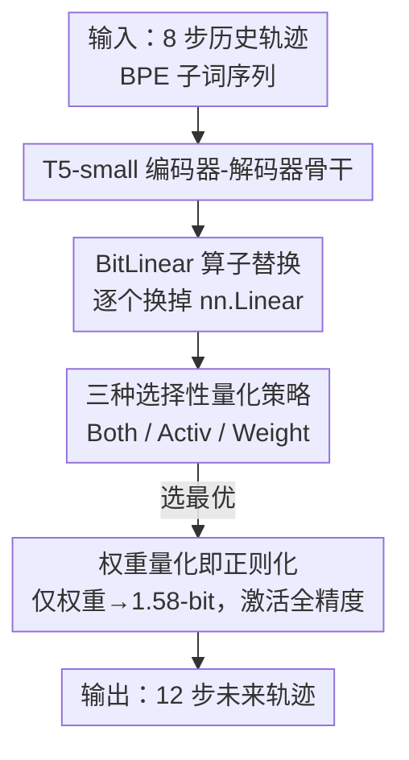

# BitTP: The Lightweight Trajectory Prediction Model with BitLLM for Edge-Devices

**会议**: CVPR 2026  
**arXiv**: [2605.29705](https://arxiv.org/abs/2605.29705)  
**代码**: https://github.com/MintCat98/BitTP (有)  
**领域**: 自动驾驶 / 轨迹预测 / 模型量化  
**关键词**: 轨迹预测, 1.58-bit 量化, BitNet, 边缘部署, Seq2Seq

## 一句话总结
把基于 LLM 的轨迹预测器 T5-small 里的所有 `nn.Linear` 换成 BitLinear，并系统对比"只量权重 / 只量激活 / 两者都量"三种策略，发现**只把权重压到 1.58-bit、激活保持全精度**（BitTP-Weight）不但不掉点，反而把 ADE/FDE 平均降了 14.29%/20.97%，同时省下近一半显存。

## 研究背景与动机
**领域现状**：轨迹预测是自动驾驶和机器人导航里连接"感知"和"规划"的桥梁，需要对多智能体的意图与交互做推理。近年开始用 LLM 来做这件事——把轨迹、意图、场景描述编码成"类语言"序列，借助 LLM 强大的上下文推理能力得到可解释、场景一致的预测。其中 Seq2Seq（编码器-解码器）结构被证明比 decoder-only 更适合该任务（如 LMTraj-SUP）。

**现有痛点**：LLM-based 预测器极度吃显存和算力，autoregressive 推理动辄要数 GB 显存和 tera 级 FLOPs，根本塞不进车载/机器人这类资源受限的边缘设备，而这些场景恰恰要求实时、低功耗。

**核心矛盾**：量化是压缩 LLM 的常用手段，但现有量化研究几乎全集中在 **decoder-only** 的 LLaMA 系——结论是"只量权重能保住精度、量激活会显著掉点"。这个结论在 **Seq2Seq 编码器-解码器**结构上是否成立，从没人验证过。Seq2Seq 的编码器和解码器共同参与生成，量化的"位置敏感性"可能完全不同。

**本文目标**：(1) 把 Seq2Seq 轨迹预测器压到能上边缘设备的极低比特；(2) 系统回答——在编码器-解码器结构下，权重和激活该量哪个、量到几位才是最优 trade-off。

**切入角度**：选用能压到 1.58-bit 极限的 BitNet b1.58 做量化基座，因为它的激进压缩能同时作用于编码器和解码器，对 Seq2Seq 减体积特别划算；再把 BitNet 原本"权重+激活一起量"的设计拆开，分成三条策略逐一实证。

**核心 idea**：用"选择性量化"代替 BitNet 的"全量化"——只量权重不量激活，让极端压缩反而充当一种正则化器，在保住时空推理能力的同时把模型塞进边缘设备。

## 方法详解

### 整体框架
BitTP 不改任务、不改骨干网络结构，只做一件事：把 T5-small 里所有标准 `nn.Linear` 层动态替换成自定义的 BitLinear 模块，然后在三种"量哪部分"的策略里选出最优解。输入是 8 步历史轨迹（3.2s，经 BPE 子词 tokenizer 编码成类语言序列），输出是 12 步未来轨迹（4.8s）；中间的 T5 编码器-解码器照常做时空推理，唯一变的是线性层的算子精度。

整条流水线是：T5-small 骨干 → 用替换算法把 `nn.Linear` 逐个换成 BitLinear → 在 BitLinear 内部按所选策略对权重/激活做缩放与量化 → 三种策略横向对比 → 选出 BitTP-Weight（只量权重）作为最终模型。

### 关键设计

**1. BitLinear 算子替换：把量化做成"即插即换"而非重训新模型**

痛点是：要在不破坏 T5 已学到的时空推理能力的前提下引入低比特运算。BitTP 写了一个递归替换函数 `replace_linear_with_quantization`，遍历 T5 的模块树，把每一个 `nn.Linear` 实例就地换成 BitLinear，并把原权重 $\theta_B \leftarrow \theta_L$ 直接搬过来。替换目标由一个 `target` 字符串控制——若含 Activation 就用 AbsMax 测量激活、若含 Weight 就用 AbsMean 测量权重，从而用同一套训练/评估流水线公平对比三种策略。T5-small 逻辑上有 97 个 `nn.Linear`（编码器 36、解码器 60、LM Head 1），但因为 HuggingFace 把 Q/K/V 等投影合并实现，实际被替换的唯一对象是 73 个。这个设计的价值在于：量化变成对骨干的"非侵入式改造"，骨干结构、tokenizer、训练管线全不动，只换算子，因此能干净地隔离出"量化位置"这一个变量

**2. 三种选择性量化策略：把 BitNet 的"全量化"拆成可控对照实验**

BitNet b1.58 原本是权重和激活一起量，BitTP 把它拆成三条对照路径来定位"该量哪"。先对输入激活做 LayerNorm 得 $x_{\text{norm}}=\text{LN}(x)$，再算两个缩放因子：8-bit 激活用 AbsMax 缩放 $\gamma = \frac{127}{\max(|x_{\text{norm}}|)+\epsilon}$，1.58-bit 三值权重 $\{-1,0,1\}$ 用 AbsMean 缩放 $\beta = \frac{1}{\text{mean}(|W|)+\epsilon}$；核心量化 $\text{Quant}_Q(z)$ 用 Round-Clamp 把缩放后的值映到目标整数区间，反向传播靠 STE 保持梯度。三条策略对应三个公式：

$$y_{\text{Both}}=\frac{\text{Quant}_8(\gamma\cdot\text{LN}(x))\cdot\text{Quant}_{1.58}(\beta\cdot W)^T+b}{\beta\cdot\gamma}$$

$$y_{\text{Activ}}=\frac{\text{Quant}_8(\gamma\cdot\text{LN}(x))\cdot W^T+b}{\gamma},\qquad y_{\text{Weight}}=\frac{x\cdot\text{Quant}_{1.58}(\beta\cdot W)^T+b}{\beta}$$

即 Both 同时量权重和激活（最激进、理论最省）、Activ 只量激活、Weight 只量权重并保留全精度激活。这一拆解之所以关键，是因为它把"Seq2Seq 该不该跟 decoder-only 一样只量权重"这个未解问题变成了可量化对比的三组数

**3. 权重量化即正则化：只量权重反而把精度做得比全精度更高**

实证结论是三条策略表现天差地别——Weight 最好、Both 次差、Activ 最差。原因在于编码器-解码器结构对量化位置极其敏感：量激活会直接扭曲中间特征分布、破坏注意力传播（Activ 的早期激活失真会放大梯度方差、毁掉特征流一致性），而联合量化（Both）会让编码器-解码器两侧的噪声累积、训练不稳定。相反，只量权重既减少了参数冗余、又不碰激活的时空信息，作者据此提出"精心设计的量化充当了有效的正则化器"——把权重压到三值 $\{-1,0,1\}$ 相当于给模型加了强约束，抑制过拟合，于是 BitTP-Weight 的 ADE/FDE（0.30/0.49）反而优于自己复现的 BF16 baseline（0.35/0.62）。更稳的是：在 1e-4/2e-4/4e-4 三档学习率下 Weight 都稳定且持续超过 BF16，说明 BitNet 在 decoder-only 上观察到的"高学习率鲁棒性"也自然推广到了 Seq2Seq

### 损失函数 / 训练策略
沿用 LMTraj-SUP 的语言式轨迹预测训练目标（在 BPE 像素级轨迹 token 上做序列预测），不引入额外 loss。优化器 AdamW，初始学习率 $1\times10^{-4}$，线性 scheduler 无 warmup，8 个 epoch，batch size 128 或 256，梯度裁剪 $\|g\|_{max}=1.0$。推理用 temperature=0.7 的随机解码、关闭 top-k 采样。单卡 RTX 3090 训练。

## 实验关键数据

### 主实验
ETH/UCY 五场景 leave-one-out，指标 ADE/FDE（米，越低越好）。$\Delta$ 相对复现的 BF16 baseline（LMTraj-SUP††），负值表示更好。

| 模型 | ETH | UNIV | ZARA2 | AVG (ADE/FDE) | $\Delta$ |
|------|-----|------|-------|---------------|----------|
| SocialVAE | 0.41/0.58 | 0.21/0.36 | 0.13/0.22 | 0.21/0.33 | - |
| LMTraj-SUP†† (BF16 复现) | 0.56/0.82 | 0.49/0.98 | 0.26/0.50 | 0.35/0.62 | 0.0/0.0 |
| LMTraj-SUP-int8 | 0.47/0.67 | 0.49/0.98 | 0.26/0.49 | 0.34/0.59 | -0.01/-0.03 |
| LMTraj-SUP-int4 | 0.47/0.71 | 0.49/0.97 | 0.28/0.54 | 0.34/0.60 | -0.01/+0.02 |
| BitTP-Both | 1.73/1.41 | 1.13/1.11 | 0.97/0.94 | 1.27/1.13 | +0.92/+0.51 |
| BitTP-Activation | 2.89/4.86 | 1.36/2.47 | 1.40/2.55 | 1.84/3.12 | +1.49/+2.50 |
| **BitTP-Weight** | **0.46/0.62** | **0.42/0.80** | **0.22/0.39** | **0.30/0.49** | **-0.05/-0.13** |

BitTP-Weight 平均 ADE/FDE = 0.30/0.49，相对 BF16 baseline 误差降低 14.29%（ADE）和 20.97%（FDE），且优于所有量化版 LMTraj-SUP。

### 消融实验：量化位置 + 推理成本（Tab.3，以 BitTP-Both 为 100% 基准）

| 配置 | ADE | FDE | 显存 % | 推理 % | 说明 |
|------|-----|-----|--------|--------|------|
| BitTP-Both | 1.27 | 1.13 | 100.00 | 100.00 | 权重+激活全量化，参照基线 |
| BitTP-Activation | 1.84 | 3.12 | 91.09 | 74.68 | 只量激活，省得少还精度崩 |
| **BitTP-Weight** | **0.30** | **0.49** | **53.58** | **63.12** | 只量权重，省一半显存且精度最好 |

### 学习率敏感性（Tab.4，batch=256）

| 学习率 | BitTP-Weight (ADE/FDE) | LMTraj-SUP†† (ADE/FDE) |
|--------|------------------------|------------------------|
| 1e-4 | **0.42/0.57** | 0.47/0.67 |
| 2e-4 | 0.51/0.79 | 0.54/0.81 |
| 4e-4 | 0.52/0.75 | 0.62/0.96 |

### 关键发现
- **量化位置比量化位数更重要**：同样是低比特，只量权重（Weight）比只量激活（Activation）在 FDE 上好了一个数量级（0.49 vs 3.12）。激活承载着时空特征流，一旦量化就破坏注意力传播，这是 Seq2Seq 的"红线"。
- **权重量化是正则化器，不是有损压缩**：BitTP-Weight 不但没掉点，反而超过全精度 BF16 baseline，三值权重约束抑制了参数冗余/过拟合。
- **省显存与省算力不对称**：Activation 量化只省 8.91% 显存却把精度毁掉；Weight 量化省 46.42% 显存、36.88% 推理成本，因为 Transformer 大部分计算量本就来自权重矩阵。
- **高学习率鲁棒性可迁移**：BitNet 在 decoder-only 上的"高 lr 更稳"现象在编码器-解码器上同样成立，Weight 在所有 lr 下都超 BF16。

## 亮点与洞察
- **"全量化拆成三条对照"的实验设计很干净**：通过非侵入式算子替换把"量哪部分"隔离成唯一变量，结论（$\text{Weight} \gg \text{Both} \gg \text{Activation}$）极有说服力，可直接复用到其他 Seq2Seq 量化研究。
- **最 "啊哈" 的点是"压缩反而涨点"**：把权重压到三值竟优于 BF16，把量化重新定义成正则化手段，而非单纯的部署妥协——这对"小数据轨迹预测易过拟合"的场景尤其受用。
- **可迁移思路**：把 decoder-only 的量化经验"先拆开再实证"地搬到新架构（编码器-解码器、多模态 encoder 等），而不是默认照搬，是一个通用的方法论模板。

## 局限与展望
- **任务/数据集单一**：只在 ETH/UCY 行人轨迹（五个小场景）上验证，没有车辆/混合交通、nuScenes 等大规模自动驾驶 benchmark，结论的普适性待确认。
- **骨干仅 T5-small**：是否能推广到更大的 Seq2Seq（T5-base/large）或其他编码器-解码器骨干没验证，"权重量化即正则化"在大模型上是否仍成立存疑。
- **激活全精度限制了极限压缩**：保留全精度激活意味着推理时激活仍占带宽，真正端到端的极限低比特（含激活）在该任务上仍是开放问题。
- **缺真机延迟数据**：正文以相对百分比报告显存/推理成本，无 GPU 的边缘部署放在补充材料，正文未给绝对时延/功耗数字。

## 相关工作与启发
- **vs BitNet b1.58**: BitNet 在 decoder-only LLM 上权重+激活一起量；本文把它拆成三策略并发现 Seq2Seq 上**只能量权重**，否则激活量化让时空推理崩溃——是对 BitNet 适用边界的关键补充。
- **vs LMTraj-SUP**: LMTraj-SUP 是本文的全精度骨干（语言式 Seq2Seq 轨迹预测）；BitTP 在其上做选择性量化，省 46% 显存的同时反超其精度。
- **vs LLaMA 系量化研究 (GPTQ/AWQ 等)**: 它们结论是 decoder-only 上"量权重 OK、量激活掉点"；本文首次验证该结论在编码器-解码器结构上同样成立，并量化了"激活量化"在 Seq2Seq 上的灾难性后果。

## 评分
- 新颖性: ⭐⭐⭐⭐ 首次把 1.58-bit 量化系统迁移到 Seq2Seq 轨迹预测，并提出"量化即正则化"的解释
- 实验充分度: ⭐⭐⭐ 三策略对照 + 推理成本 + 学习率敏感性都做了，但仅限 ETH/UCY 单 benchmark、单骨干
- 写作质量: ⭐⭐⭐⭐ 动机-假设-验证链条清晰，公式与算法表述完整
- 价值: ⭐⭐⭐⭐ 给边缘设备部署 LLM-based 轨迹预测器提供了直接可用、反而涨点的实用方案

<!-- RELATED:START -->

## 相关论文

- [\[ICCV 2025\] DONUT: A Decoder-Only Model for Trajectory Prediction](../../ICCV2025/autonomous_driving/donut_a_decoder-only_model_for_trajectory_prediction.md)
- [\[CVPR 2026\] Den-TP: A Density-Balanced Data Curation and Evaluation Framework for Trajectory Prediction](den_tp_a_density_balanced_data_curation_and_evaluation_framework_for_trajectory.md)
- [\[CVPR 2026\] SparseWorld-TC: Trajectory-Conditioned Sparse Occupancy World Model](sparseworld_tc_trajectory_conditioned_sparse_occupancy_world_model.md)
- [\[CVPR 2026\] MetaDAT: Generalizable Trajectory Prediction via Meta Pre-training and Data-Adaptive Test-Time Updating](metadat_generalizable_trajectory_prediction_via_meta_pre-training_and_data-adapt.md)
- [\[CVPR 2026\] FoSS: Modeling Long-Range Dependencies and Multimodal Uncertainty in Trajectory Prediction via Fourier–State Space Integration](foss_modeling_long_range_dependencies_and_multimodal_uncertainty_in_trajectory_p.md)

<!-- RELATED:END -->
