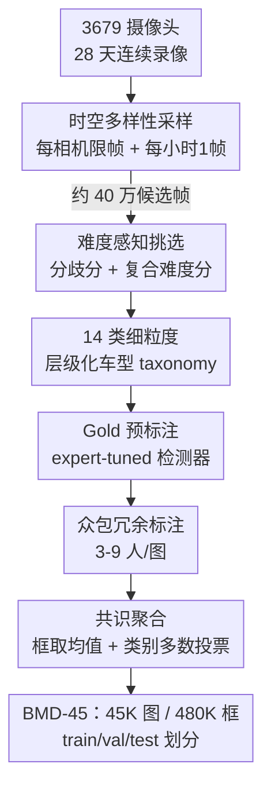

# BMD-45: A Large-Scale CCTV Vehicle Detection Dataset for Urban Traffic in Developing Cities

**会议**: CVPR 2026 (Findings Track)  
**arXiv**: [2604.24419](https://arxiv.org/abs/2604.24419)  
**代码/数据**: https://huggingface.co/datasets/iisc-aim/BMD-45 (有)  
**领域**: 自动驾驶 / 智能交通 / 目标检测数据集  
**关键词**: CCTV 车辆检测、固定摄像头、发展中国家交通、众包标注、跨域泛化

## 一句话总结
作者从印度班加罗尔 3679 个运营中的 Safe City 监控摄像头采集 4.6 万张图、48 万框、14 个细粒度车型，构建了首个大规模"固定 CCTV 视角 + 发展中国家无序交通"检测数据集 BMD-45，并用一套"多样性采样 + 难度感知挑选 + 众包共识标注"管线保证质量，实验揭示在 UA-DETRAC 上训练的检测器迁到本数据集只有 33.6% mAP、而 in-domain 训练可达 83.8%（2.5× 差距），坐实了地理与视角偏置带来的巨大域鸿沟。

## 研究背景与动机
**领域现状**：车辆检测的主流 benchmark 按采集平台分三类——车载第一视角（dashcam，如 KITTI/BDD100K/IDD）、无人机俯拍（aerial），以及城市基建固定摄像头（fixed CCTV）。固定 CCTV 因为城市本来就部署了成千上万个用于公共安全的探头、能持续大范围覆盖，对智能交通系统（ITS）的车流估计、事件响应最有用。

**现有痛点**：现有 fixed-camera 数据集要么"规模大但单调"，要么"地域相关但太小"。UA-DETRAC 有 140k 帧、121 万框，但它是为多目标跟踪设计的，时间冗余严重——121 万框其实只对应 8.2k 个独立车辆 ID，外观多样性极低，且只有 car/bus/van/others 四个粗类、拍的是中国高速结构化车流；TrafficCAM 虽是印度 CCTV 视角、含三轮车等区域车型，但只有 4.4k 帧、做的是分割，规模撑不起现代检测器训练。

**核心矛盾**：现有 benchmark 在**视角（ego vs 固定 CCTV）**和**地理（发达国家结构化车流 vs 全球南方密集无序车流）**两个维度同时存在偏置。车载视角的车辆是侧后近景、固定 CCTV 是高架斜俯视小目标且高度遮挡密集；发达国家没有三轮车（auto-rickshaw）、tempo-traveller、LCV 这些南亚特有车型。两者叠加导致"在哪训练就只能在哪用"。

**本文目标**：造一个同时满足"规模够大、视角是固定 CCTV、车型细粒度且含区域特有类、采集多样性高"的数据集，并量化现有数据集迁移到该场景的真实差距。

**切入角度**：班加罗尔是全球最堵城市之一、已有覆盖约 740 km² 的 Safe City 探头网，是天然的"密集无序交通 + 固定 CCTV"采集场；且印度车型分类可迁移到南亚/东南亚，地理聚焦不损通用性（类比 Cityscapes/CityFlow 也都单城市但被广泛采用）。

**核心 idea**：用"多样性 + 难度"双重采样从海量监控录像里挑信息量最大的帧，再用众包冗余标注 + 共识聚合压住标注噪声，造出 BMD-45，并把它当作暴露域鸿沟、训练鲁棒 ITS 感知的新基准。

## 方法详解

### 整体框架
BMD-45 不是一个模型，而是一条"从连续监控视频流 → 高质量检测标注数据集"的数据工程管线。输入是 3679 个摄像头 28 天的连续 CCTV 录像，输出是 45,986 张图、481,947 个共识标注框、14 类的可训练/可评测数据集。中间四步层层过滤：先用**时空多样性采样**把约 400k 候选帧筛出来防止位置偏置，再用**难度感知挑选**把信息量低的帧降权、把密集小目标和模型分歧大的难帧升权，然后用一个 expert-tuned 的检测器做**Gold 预标注**给众包打底，最后由众包志愿者多人独立标注、经**共识聚合**得到单一 ground truth。

### 关键设计

**1. 时空多样性采样：用"每相机限帧 + 每小时一帧"对抗视角泄漏**

监控录像天然时间冗余——同一相机连续几小时拍的几乎是同一个场景，直接采样会让 train/val/test 里塞满高度相似的帧，造成跨 split 的"相机视角泄漏"（模型其实是记住了相机而非学会检测）。作者对每个相机设帧数上限保证 urban/suburban/highway 场景均衡，时间上限制在白天（06:00–18:00，彩色模式）、每相机每小时最多取一帧覆盖早中晚车流。效果可量化：用 DINOv3 特征算 Vendi Score（多样性度量），BMD-45 的 train/val 达 225.7/223.0（$q{=}0.5$），而 TrafficCAM 只有 70.6/43.2；t-SNE 上 BMD-45 是连续铺开无明显簇，TrafficCAM 却挤成不到 10 个紧簇且 train/val/test 混在同簇——这正是泄漏的可视化证据

**2. 难度感知挑选：让标注预算花在"模型吵架"和"视觉复杂"的帧上**

把约 40 万候选帧无差别标注既贵又低效，大量简单帧对训练帮助甚微。作者借鉴 active selection 和 hard-example mining，给每帧算两个信号：一是**分歧分** $D_i^{\mathrm{norm}}$，基于多个检测器对每类预测框数量的方差和最大成对类别计数差异——不同模型对某类数到的框数差越大、说明这帧越不确定、越值得标；二是**复合难度分** $\Delta_i$，聚合归一化目标数、平均框面积、成对 IoU 重叠度和归一化分歧信号 $\widetilde{D}_i$，目标多、平均框小、相互重叠高、分歧大的帧得分高。再按 $\Delta_i$ 排序分层，从高难度层多采、同时保留一部分简单帧。test split 更进一步：先取被最多独立标注者标过的 10,000 帧保证 ground truth 可靠，再从中挑难度最高的 5,110 帧，使 test 故意比 train/val 更密更难，暴露均匀采样掩盖不了的性能差（具体公式见原文附录 C，⚠️ 细节以原文为准）

**3. Gold 预标注 + 众包冗余标注：用模型打底、用多人投票纠偏**

纯人工从零标注 48 万框不现实，纯模型标注又不可靠。作者先精标一个 3,017 张的 Gold Dataset（覆盖全部 14 类），微调七个 COCO 初始化的检测器，最好的 RT-DETRv2-X 在 Gold test 上达 70.3 mAP@[0.5:0.95]——强但不完美，刚好用来加速标注但仍需人工核验。用它为众包的 10 万张图生成预标注框，众包志愿者通过 hackathon 形式做四件事：核验预标框/类别、微调框坐标贴紧边界、补漏检、删误检。每张图由 3–9 人独立标注（均值 5.2），并周期性插入已知 ground truth 的 Gold 图做在线质检与反馈

**4. 共识聚合：框坐标取均值、类别取多数票，把多人标注收敛成单一真值**

多人标注必须聚合成一个 ground truth。作者把定位和分类分开处理：**框定位**——预标框带持久 ID，标注者只改不删，对每个 ID 取所有提交坐标的均值；标注者新增的框无 ID，用 60% IoU 阈值跨提交匹配再组内平均，既降个体偏差又保定位精度。**类别标签**——在 object 级做多数投票，每个框取得票最多的类别，平局（<0.5%）随机打破。可靠性可验证：分类标签对共识的成对一致率约 87%、Fleiss' kappa ≈0.862（强一致）；标签稳定性随标注人数快速收敛，$k{=}2$ 时 94.3% 一致、$k{=}5$（数据集均值）时 98.2%；共识标注对比 Gold 专家标签的真正例率 78.4%、假正例 5.9%、假负例 15.7%

## 实验关键数据

### 数据集规模与构成对比
| 数据集 | 视角 | 帧数 | 标注数 | 车型类数 | 相机数 | 地区 |
|--------|------|------|--------|---------|--------|------|
| IDD | Ego 第一视角 | 10k | 111.3k | 9 | – | 印度 |
| UA-DETRAC | 固定（非CCTV）| 140k | 1.21M | 4 | 24 | 中国 |
| TrafficCAM | 固定 CCTV | 4.3k | 84.2k | 9 | NA | 印度 |
| **BMD-45 (本文)** | 固定 CCTV | **45k** | **481.9k** | **14** | **3679** | 印度 |

BMD-45 在"相机数"和"细粒度类数"上碾压所有对手（3679 个相机 vs 次高的 24 个），UA-DETRAC 虽框多但只 8.2k 独立车辆 ID、外观多样性低。

### 核心域鸿沟：跨数据集训练 → BMD-45 val 评测
| 训练集 | 模型 | mAP@0.50:0.95 (BMD-45 val) |
|--------|------|------|
| UA-DETRAC | RT-DETRv2-X | 0.336 |
| BMD-45 (in-domain) | RT-DETRv2-X | **0.838** |
| UA-DETRAC | RF-DETR | 0.232 |
| BMD-45 (in-domain) | RF-DETR | **0.795** |
| BMD-45 (in-domain) | D-FINE | 0.828 |
| TrafficCAM | RT-DETRv2-X | 0.474 |
| BMD-45 (in-domain) | RT-DETRv2-X | **0.798** |

UA-DETRAC → BMD-45 仅 33.6% mAP，in-domain 训练 83.8%，**2.5× 差距**且即便扣除新车型类仍持续；TrafficCAM 同为印度 CCTV 视角迁移稍好（47.4%）但仍远低于 in-domain（79.8%）。

### 混合数据集消融（MHD 高难度 / MRS 随机采样）
| 训练集 | 评测设置 | 模型 | mAP@0.50:0.95 | mAP@0.50 |
|--------|---------|------|------|------|
| UA-DETRAC | MHD | RT-DETRv2-X | 0.56 | 0.71 |
| BMD-45 | MHD | RT-DETRv2-X | 0.64 | 0.83 |
| UA-DETRAC | MRS | RT-DETRv2-X | 0.57 | 0.73 |
| BMD-45 | MRS | RT-DETRv2-X | 0.63 | 0.82 |
| TrafficCAM | MHD | RT-DETRv2-X | 0.48 | 0.65 |
| BMD-45 | MHD | RT-DETRv2-X | 0.56 | 0.70 |

把 UA-DETRAC/TrafficCAM 用 BMD-45 子集增广后，无论随机还是高难度采样，BMD-45 训练的模型在所有混合 split 上都稳定更高，印证更宽类别覆盖和更多样条件带来更好泛化。

### 关键发现
- **视角错配是头号杀手**：IDD（第一视角但同为印度）在专家参考集上反而比 TrafficCAM（同为 CCTV 视角）的 mAP 更高（0.46 vs 0.39），说明地理相关也救不了视角鸿沟——dashcam（1–2m 高度、水平角）和高架 CCTV（4–8m、斜俯视）的车辆长宽比、可见面、遮挡模式根本不同。
- **规模 × 多样性 > 单纯框数**：UA-DETRAC 121 万框却迁移最差（zero-shot GroundingDINO 也仅 0.13），因为 8.2k 独立车辆的时间冗余压垮了外观多样性。
- **难度采样确实更难**：test split 故意选最难的 5110 帧，使其暴露出均匀采样看不到的性能差异，是一个"controlled yet demanding"基准。

## 亮点与洞察
- **用 Vendi Score + t-SNE 量化"采样多样性"**：把"我的数据集更多样"从口号变成可比数字（225.7 vs 70.6），并用 t-SNE 簇结构直接可视化对手的"相机视角泄漏"，这套诊断方法可复用到任何监控类数据集的质量审计。
- **难度感知采样把标注预算用在刀刃上**：分歧分（模型间吵架）+ 复合难度分（密集/小/重叠）双信号挑帧，对所有需要昂贵人工标注的检测/分割任务都能迁移——本质是把 active learning 思想前置到数据构建阶段。
- **"模型预标 + 众包冗余 + 共识聚合"三段式标注**很务实：RT-DETRv2-X 打底（70.3 mAP）省人力，3–9 人投票（kappa 0.862）压噪声，框取均值、类取多数票分开处理定位与分类——这是大规模检测标注的一个可直接照搬的工程范式。
- **最大的"啊哈"是 2.5× 的硬数字**：它把"地理/视角偏置"这种抽象批评钉死成一个无法辩驳的量化结论，对呼吁"全球南方"benchmark 极有说服力。

## 局限与展望
- **仅白天、单城市**：录像限制在 06:00–18:00 彩色模式，完全没有夜间/红外场景；虽含 twilight 低光但无真正夜景，而 ITS 夜间监控恰恰刚需。地理上单城市班加罗尔，作者用"印度车型可迁南亚/东南亚"和"Cityscapes 也单城市"辩护，但跨国泛化未实测。
- **test 标注扣留**：test 的 ground truth 不公开（类比 COCO），第三方只能提交评测，复现和误差分析受限。
- **共识标注本身有噪声**：对比专家 Gold，共识的假负率达 15.7%（漏标）、假正率 5.9%，密集小目标场景的标注上限受众包能力约束。
- **任务单一**：只做检测，未提供跟踪/分割标注，限制了在多目标跟踪、轨迹分析等下游 ITS 任务上的直接使用。
- **改进思路**：补夜间/雨天采集、扩到多城市验证跨国迁移、用更强的标注质检（如主动重标高分歧框）压低假负率、并发布跟踪/分割标注扩展任务覆盖。

## 相关工作与启发
- **vs UA-DETRAC**：它走"规模 + 跟踪"路线（140k 帧、4 粗类、中国高速），本文走"多样性 + 细粒度检测"路线（45k 帧、14 类、印度无序 CCTV）；本文框数虽少但独立外观远多，实验证明迁移到真实城市场景 UA-DETRAC 反而吃亏（33.6% vs 83.8%）。
- **vs TrafficCAM**：同为印度 CCTV 视角且含区域车型，但它只 4.3k 帧、做分割、靠 tracking 传播标注（拥挤场景易引噪），规模撑不起现代检测器；BMD-45 以 10× 规模 + 多样性采样 + 共识标注全面超越（47.4% vs 79.8%）。
- **vs IDD / Cityscapes 等第一视角**：地理相关（IDD 也是印度）但视角错配，迁移到固定 CCTV 仍掉点严重，印证"视角偏置"独立于"地理偏置"的存在。
- **vs COCO 通用检测**：BMD-45 沿用 COCO 风格 mAP@0.50:0.95 评测和 test 标注扣留策略，但聚焦 COCO 完全缺失的三轮车、tempo-traveller、LCV 等南亚车型，是对通用 benchmark 地域空白的补充。

## 评分
- 新颖性: ⭐⭐⭐⭐ 首个大规模固定 CCTV + 发展中国家无序交通检测集，地理/视角双偏置量化扎实，但方法层面是数据工程组合而非算法突破
- 实验充分度: ⭐⭐⭐⭐⭐ 5 个现代检测器 × 4 个数据集跨域评测 + 混合消融 + Vendi/t-SNE 多样性诊断，证据链完整
- 写作质量: ⭐⭐⭐⭐ 动机清晰、表格规范、域鸿沟论证有力，部分采样细节推到附录
- 价值: ⭐⭐⭐⭐⭐ 填补全球南方 ITS 感知数据空白，2.5× 域鸿沟结论对呼吁地理多样 benchmark 极具影响力

<!-- RELATED:START -->

## 相关论文

- [\[CVPR 2026\] Ghost-FWL: A Large-Scale Full-Waveform LiDAR Dataset for Ghost Detection and Removal](ghost-fwl_a_large-scale_full-waveform_lidar_dataset_for_ghost_detection_and_remo.md)
- [\[CVPR 2026\] SearchAD: Large-Scale Rare Image Retrieval Dataset for Autonomous Driving](searchad_large-scale_rare_image_retrieval_dataset_for_autonomous_driving.md)
- [\[NeurIPS 2025\] UrbanIng-V2X: A Large-Scale Multi-Vehicle Multi-Infrastructure Dataset Across Multiple Intersections for Cooperative Perception](../../NeurIPS2025/autonomous_driving/urbaning-v2x_a_large-scale_multi-vehicle_multi-infrastructure_dataset_across_mul.md)
- [\[ECCV 2024\] H-V2X: A Large Scale Highway Dataset for BEV Perception](../../ECCV2024/autonomous_driving/h-v2x_a_large_scale_highway_dataset_for_bev_perception.md)
- [\[CVPR 2026\] Real-World On-Vehicle Evaluation of Embedding-Based Anomaly Detection](real-world_on-vehicle_evaluation_of_embedding-based_anomaly_detection.md)

<!-- RELATED:END -->
