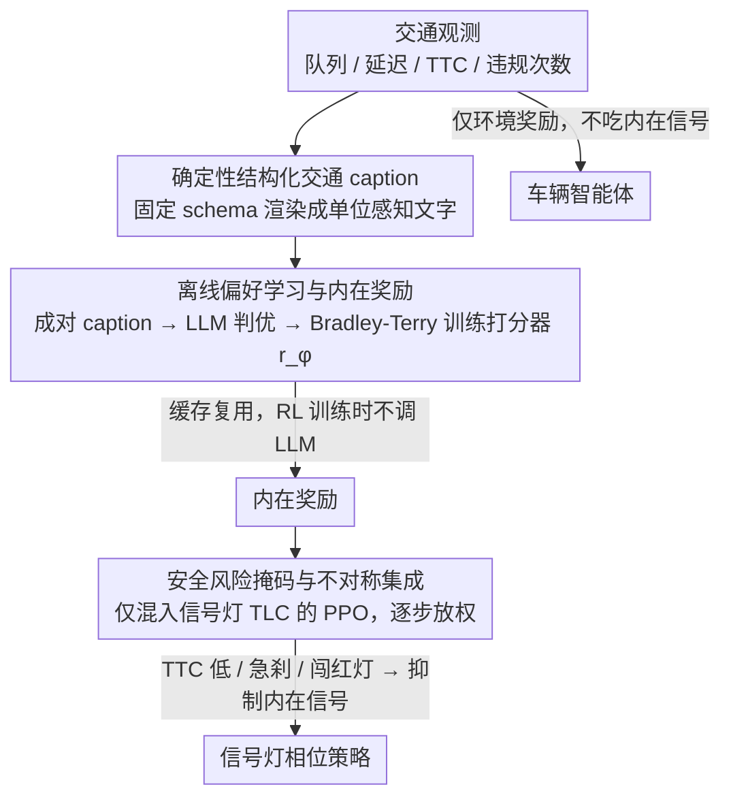

# C2T: LLM-Aligned Common-Sense Reward Learning for Traffic-Vehicle Coordination

**会议**: CVPR 2026  
**arXiv**: [2604.13098](https://arxiv.org/abs/2604.13098)  
**代码**: 无  
**领域**: 自动驾驶 / 交通控制  
**关键词**: 交通信号控制, 多智能体强化学习, LLM偏好学习, 内在奖励, 常识推理

## 一句话总结

提出 C2T 框架，通过将交通状态转换为结构化描述（caption），利用 LLM 进行离线偏好判断并蒸馏为内在奖励函数，替代手工设计的交通信号控制奖励，在 CityFlow 基准的多个真实城市网络上提升效率、安全性和能耗指标。

## 研究背景与动机

**领域现状**：基于 MARL 的交通信号控制（TSC）使用手工设计的效率奖励（如队列长度、交叉口压力、平均延迟）优化局部效率。

**现有痛点**：手工奖励是短视的局部代理指标，无法捕获安全、流量稳定性、舒适度等高级人类中心目标。激进清空交叉口可能导致振荡信号、急刹车和不安全间距，"纸面高效但部署脆弱"。

**核心矛盾**：缺乏能反映人类判断并预期长期效果（如车队形成）的"交通质量"概念，且需要在不修改模拟器或在线调用 LLM 的前提下实现。

**本文目标**：将交通质量本身作为监督信号，从 LLM 偏好中离线学习内在奖励，增强标准 MARL 训练管线。

**切入角度**：LLM 在比较结构良好的状态描述时能做出一致的成对判断，可作为"常识"知识源。

**核心 idea**：将交通状态渲染为确定性、单位感知的 caption → LLM 成对偏好判断 → 轻量偏好打分器 → 内在奖励注入标准 PPO。

## 方法详解

### 整体框架

C2T 想解决的是：MARL 交通信号控制只会优化队列长度、交叉口压力这类手工效率指标，但人类司机心里那套"交通质量好不好"（会不会激起振荡信号、急刹、危险跟车间距）没法用一行公式写出来。C2T 的办法是把这套"常识"从 LLM 里离线挖出来，变成一个内在奖励，再塞回标准的 PPO 训练。

整条管线分三步流过去：先用一套固定模板把每个时刻的交通观测渲染成一段结构化文字描述（caption）；然后成对采样这些 caption，让 LLM 判断哪个状态"更好"，把这些偏好标签蒸馏成一个轻量打分器，这个打分器输出的分数就是内在奖励；最后把内在奖励只混进交通灯控制器（TLC）的 PPO 目标里，车辆智能体仍然只看环境奖励，中间还加了一层安全风险掩码和逐步放权的混合调度。整个过程不改模拟器、不在训练回路里调用 LLM——所有 LLM 查询都是离线一次性做完缓存起来的。

### 关键设计

**1. 确定性结构化交通 caption：让 LLM 的判断可复现**

直接把交通画面或一堆原始数值丢给 LLM 让它评判，问题是它对自由文本极其敏感——同一个状态换个措辞、换个风格就可能给出相反的偏好，根本没法当稳定的监督信号。C2T 的做法是定一套确定性、单位感知的 schema，把队列、延迟、TTC（碰撞时间）、违规次数等关键变量逐项枚举出来，每项都带明确的语义标签和数值单位。这样同一个交通状态永远渲染成同一段文字，消除了措辞和风格的随机性。LLM 面对这种结构化定量描述时，成对比较的判断会高度一致，于是这段 caption 就成了可缓存、可复现的偏好来源。

**2. 离线偏好学习与内在奖励：把常识判断冻结成奖励函数**

有了稳定的 caption，下一个痛点是怎么把 LLM 的"常识"变成训练时能反复调用的东西——总不能每个时间步都去问一次 LLM，那延迟和可靠性都撑不住。C2T 成对采样 caption，让 LLM 给出决定性的偏好标签（拿不准、判断模糊的对子直接丢掉，只留明确的），然后用 Bradley-Terry 似然训练一个轻量打分器

$$r_\phi(o) = f_\phi(\text{tok}(c), x(o))$$

其中 $\text{tok}(c)$ 是 caption 的 token 化表示、$x(o)$ 是对应的数值特征。打分器还可以挂可选的安全 / 效率 / 能耗分头。关键在于所有 LLM 监督都是离线产生并缓存的：想换一套 prompt、或启用不同的分头，只要替换缓存重训打分器即可，训练 RL 时完全不碰 LLM。这样就把"在线问 LLM"的延迟、可靠性、扩展性问题一次性绕开了。

**3. 安全风险掩码与不对称集成：让安全优先、让训练别崩**

内在奖励是把双刃剑：它鼓励的"交通质量"如果压过了硬性安全约束，反而可能学出危险策略；而且两个智能体（信号灯和车辆）都吃内在信号的话，会引入额外的非稳态让训练更难收敛。C2T 用两个机制兜底。一是风险掩码：当 TTC 落到低百分位、出现急刹车集群、或发生红灯违规时，直接抑制内在信号，保证安全约束永远压过效率偏好。二是不对称集成：内在奖励只混进 TLC 的目标，车辆智能体仍只用环境奖励——因为信号相位选择才是塑造车队成形和网络节奏的主要手柄，让信号灯吃常识信号收益最大、副作用最小。混合权重还带一个调度：训练前期先让模型满足环境约束，再逐步吸收常识偏好，避免一上来就被内在信号带偏。

### 一个完整示例

以一个交叉口某时刻的观测为例走一遍：Stage 1 把它渲染成固定格式的 caption，比如"南北向队列 12 辆、东西向队列 3 辆、最小 TTC 2.1s、近 5 步急刹 1 次、红灯违规 0"。再取另一个候选状态的 caption（队列更均衡、最小 TTC 4.0s）。Stage 2 把这两段 caption 成对喂给 LLM，LLM 判定后者"更好"（更安全、更稳），这条偏好被缓存；打分器学完后，给后者打出更高的 $r_\phi$。Stage 3 训练时，信号灯智能体若选了导向后者的相位就拿到正的内在奖励——但如果此刻 TTC 已经跌破阈值，风险掩码会把这份内在奖励压掉，强制让安全项主导；车辆智能体全程只看环境奖励，不受这套内在信号影响。

### 损失函数 / 训练策略

偏好打分器用加权负对数似然 + L2 正则化 + 分数中心化训练。RL 侧是标准 PPO，每个奖励流（环境奖励、内在奖励）各自独立归一化和软裁剪后再按调度权重加权混合。

## 实验关键数据

### 主实验

| 方法 | 济南旅行时间↓ | 杭州旅行时间↓ | 纽约旅行时间↓ | TTC p10↑ |
|------|------------|------------|------------|---------|
| PressLight | 285.3s | 312.7s | 298.5s | 3.2s |
| CoLight | 278.1s | 305.2s | 291.3s | 3.5s |
| Advanced-CoLight | 272.5s | 298.8s | 285.7s | 3.8s |
| **C2T** | **265.2s** | **289.5s** | **278.1s** | **4.5s** |

### 消融实验

| 配置 | 旅行时间↓ | TTC p10↑ | 说明 |
|------|---------|---------|------|
| 完整 C2T | 265.2s | 4.5s | 内在奖励+安全掩码 |
| 无内在奖励 | 278.1s | 3.5s | 仅环境奖励 |
| 无安全掩码 | 268.5s | 3.8s | 内在奖励但无安全约束 |
| 仅 caption (无数值) | 270.3s | 4.2s | 结构化 caption 已有帮助 |

### 关键发现

- 内在奖励信号贡献最大（去掉后旅行时间增加 13 秒），安全掩码对 TTC 改善关键
- 仅有结构化 caption 也能改善性能，加入匹配数值进一步（但较小）提升
- C2T 的灵活性体现在可通过切换 prompt 产生"效率优先"vs"安全优先"策略

## 亮点与洞察

- 将 LLM 从在线决策者变为离线奖励设计者是一个明智的角色分配：避免了 LLM 在控制回路中的延迟和可靠性问题
- 确定性 schema 的 caption 设计使 LLM 判断可复现、可缓存，是工程上的关键决策
- 不对称集成（仅 TLC 接收内在奖励）的设计减少了多智能体非稳态性

## 局限与展望

- 在 CityFlow 模拟器上验证，真实世界部署效果未知
- LLM 偏好可能包含隐式偏差
- 仅考虑交通信号控制，未扩展到显式建模的自动驾驶车辆
- 可扩展到更多城市网络和极端天气条件

## 相关工作与启发

- **vs LLMLight**: LLMLight 将 LLM 直接放入控制回路，有延迟和可靠性问题；C2T 离线蒸馏无此问题
- **vs CoTV**: CoTV 用手工复合奖励（旅行时间+燃料+排放），C2T 从 LLM 偏好学习更全面的奖励

## 评分

- 新颖性: ⭐⭐⭐⭐ LLM 离线偏好学习用于交通奖励设计是新方向
- 实验充分度: ⭐⭐⭐⭐ 三城市+压力测试+详细消融
- 写作质量: ⭐⭐⭐⭐ 框架清晰
- 价值: ⭐⭐⭐⭐ 对RL奖励设计有通用借鉴意义

<!-- RELATED:START -->

## 相关论文

- [\[ICML 2026\] Threshold-Based Exclusive Batching for LLM Inference](../../ICML2026/autonomous_driving/threshold-based_exclusive_batching_for_llm_inference.md)
- [\[NeurIPS 2025\] RAW2Drive: Reinforcement Learning with Aligned World Models for End-to-End Autonomous Driving](../../NeurIPS2025/autonomous_driving/raw2drive_reinforcement_learning_with_aligned_world_models_for_end-to-end_autono.md)
- [\[AAAI 2026\] Generalising Traffic Forecasting to Regions without Traffic Observations](../../AAAI2026/autonomous_driving/generalising_traffic_forecasting_to_regions_without_traffic_observations.md)
- [\[ICCV 2025\] Foresight in Motion: Reinforcing Trajectory Prediction with Reward Heuristics](../../ICCV2025/autonomous_driving/foresight_in_motion_reinforcing_trajectory_prediction_with_reward_heuristics.md)
- [\[CVPR 2026\] Traffic Scene Generation from Natural Language Description for Autonomous Vehicles with Large Language Model](traffic_scene_generation_from_natural_language_description_for_autonomous_vehicl.md)

<!-- RELATED:END -->
