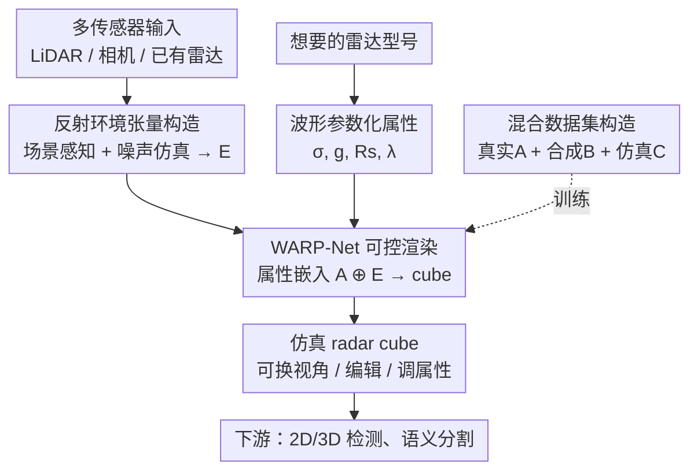

# Controllable Radar Simulation with Waveform Parameter Embedding

**会议**: CVPR 2026  
**arXiv**: [2506.03134](https://arxiv.org/abs/2506.03134)  
**代码**: https://github.com/zhuxing0/Ctrl-RS (有)  
**领域**: 自动驾驶 / 雷达仿真 / 传感器仿真  
**关键词**: 雷达, 雷达 cube 仿真, 波形参数, 可控仿真, 点扩散函数, 数据增强

## 一句话总结
Ctrl-RS 把雷达硬件属性抽象成 4 个可调的「波形参数」(对应点扩散函数在 Range/Doppler/Azimuth 三维的形状)，再用 WARP-Net 把多传感器构造的反射环境张量直接「画」成 range-azimuth-Doppler 雷达 cube，从而在 0.04s 内仿真出可换视角、可编辑、可调属性的逼真雷达数据，下游 2D/3D 检测与语义分割上能匹配甚至超过真实数据。

## 研究背景与动机

**领域现状**：雷达在恶劣天气下抗干扰、可靠，是自动驾驶感知的关键传感器，但真实雷达数据采集昂贵、且每种雷达型号分布各异。因此「雷达仿真」越来越重要。雷达输出的原始形态是一个 range-azimuth-Doppler 三维张量 (radar cube)，记录每个位置的反射强度和多普勒速度。现有仿真分两派：**生成式** (GAN/VAE/NeRF 直接生成 cube 切片) 和 **物理式** (建模电磁波从发射到接收的全过程)。

**现有痛点**：生成式纯数据驱动，不透明、无物理先验，导致两个硬伤——不同雷达系统间存在巨大域差 (domain gap)，每换一种雷达就得重新采数据；而且无法外推到训练时没见过的雷达属性，只能复现预设型号。物理式 (光线追踪 / 时域电磁仿真) 虽可解释、可控，但需要精确的雷达硬件规格和复杂信号处理算法，仿真一帧至少要 5s 以上，慢且依赖专有硬件参数。

**核心矛盾**：可控性 (物理式有、生成式无) 与 效率+真实感+易用性 (生成式有、物理式无) 之间存在 trade-off，没有方法能同时兼得。

**本文目标**：做一个既能像生成式一样快、又能像物理式一样按属性可控的雷达 cube 仿真器，且不依赖具体雷达硬件细节。

**切入角度**：作者借鉴 RadSimReal——雷达 cube 可视为各反射点的「标准 3D 反射信号」(即点扩散函数 PSF) 按反射强度加权叠加。关键观察是：不同雷达数据集的 PSF 三维波形长得很像，只是「胖瘦/陡缓」不同。那么只要用几个参数刻画这个波形的形状，就等价于刻画了雷达属性，无需任何硬件规格。

**核心 idea**：用「波形参数」($\sigma, g, Rs, \lambda$) 作为物理先验嵌入，去条件化一个数据驱动网络 WARP-Net，把多传感器构造的反射环境张量直接映射成对应雷达属性下的 cube——混合派 (hybrid) 拿走两派的长处。

## 方法详解

### 整体框架
Ctrl-RS 是一条从「环境仿真」到「雷达仿真」再到「下游任务」的完整 pipeline。输入是任意可得的传感器数据 (LiDAR 点云 / 单目图像 / 已有雷达) 加上一组想要的雷达波形参数，输出是该雷达属性下的仿真 radar cube $\mathbf{R_{\mathrm{sim}}} \in \mathbb{R}^{r \times d \times a}$ (实现里 $r=256, a=256, d=64$)。中间分两大步：先把场景的所有反射点 + 噪声反射点写进一个统一的反射环境张量 $\mathbf{E}$；再用波形参数嵌入条件化 WARP-Net，把 $\mathbf{E}$「渲染」成 cube。训练 WARP-Net 所需的、覆盖丰富雷达属性的数据，则靠混合数据集构造解决。

### 关键设计

**1. 多传感器反射环境张量：把「场景里有什么在反射」从渲染管线里解放出来**

传统物理仿真严格靠图形引擎做路径追踪来得到反射点，依赖精细场景建模、慢且封闭。本文把环境仿真做成一个独立、灵活的模块：构造统一的反射环境张量 $\mathbf{E} \in \mathbb{R}^{r \times d \times a}$，每个位置记录该反射点的空间位置、相对雷达速度和反射强度。难点在于反射点从哪来——作者验证可以直接「白嫖」其它传感器：LiDAR 点云直接当反射点、按物理公式算反射强度；单目图像用 VGGT 重建稠密点云、再用 Grounded-SAM 的实例 mask 抠出目标点云、稀疏随机采样后算强度；已有雷达则用 CFAR 峰值检测提反射点。虽然这些反射点不够精确，但实验证明 WARP-Net 对其有鲁棒性，这也意味着可以给海量自动驾驶数据集「补」上雷达信号。

更关键的是噪声建模。作者观察到真实 cube 里的噪声反射信号在波形上和场景反射信号非常像，只是在 range/azimuth/doppler 三维里随机分布。于是不像旧方法那样在仿真 cube 上直接叠高斯图像噪声，而是把噪声建模为「随机分布在三维空间里的噪声反射点」发出的雷达信号，和场景反射点一起映射进 $\mathbf{E}$。这让仿真出的 cube 连噪声纹理都逼真

**2. 波形参数化的雷达属性：用 4 个数代替整套硬件规格**

物理仿真要可控就得知道雷达的全套硬件细节，这是它难用的根源。本文把雷达 cube 建模为各反射点 PSF 的加权叠加：

$$\mathbf{R} = \sum_{i=1}^{K} I_i \cdot \mathbf{R_{\mathrm{std}}}(r_i, d_i, a_i)$$

其中 $I_i$ 是第 $i$ 个反射点的反射强度，$\mathbf{R_{\mathrm{std}}}$ 即标准 3D 反射信号 (PSF)。由于不同数据集的 PSF 波形相似，作者把它在三个维度上分别拟合为可分离的函数：$\mathbf{R_{\mathrm{std}}} = \mathbf{S}_R(r_i) * \mathbf{S}_D(d_i) * \mathbf{S}_A(a_i)$。其中 $\mathbf{S}_R$ 是高斯函数 (刻画 Range 分辨率与衰减)，$\mathbf{S}_D$ 是分段线性函数 (刻画 Doppler 展宽)，$\mathbf{S}_A$ 是窗函数的谱 (刻画 Azimuth 波束形状)。于是雷达属性就被压缩成 4 个波形参数：$\mathbf{S}_R$ 的标准差 $\sigma$、$\mathbf{S}_D$ 的梯度 $g$、$\mathbf{S}_A$ 的主瓣宽度 $Rs$ 和峰值比 $\lambda$。这 4 个参数既直观可视化、又能通过测量方法轻松获得，调一调就能改变仿真雷达的「型号」——这是整个可控性的物理基座

**3. WARP-Net 属性嵌入渲染：把物理先验喂进数据驱动网络**

有了 $\mathbf{E}$ (场景里有什么) 和波形参数 (用什么雷达看)，怎么把它们合成 cube？RadSimReal 要为每种雷达单独测量反射波形，无法「定义」属性。WARP-Net 则把 4 个波形参数广播成属性嵌入 $\mathbf{A} \in \mathbb{R}^{4 \times r \times d \times a}$ (4 个通道依次填 $\sigma, g, Rs, \lambda$)，与反射环境张量 $\mathbf{E}$ 拼接后送入一个 3D U-Net $U$：

$$\mathbf{R_{\mathrm{sim}}} = U(\mathrm{Concat}\{\mathbf{E}, \mathbf{A}\})$$

输出经 ReLU 得到仿真 cube。这一步是混合派的精髓：数据驱动的隐式学习保证了高效 (0.04s) 和真实感，而显式注入的波形参数让网络能感知并对齐不同雷达属性下的波形变化——同一个网络、同一套权重，换波形参数就换雷达，实现了生成式做不到的属性外推

**4. 三源混合数据集：用合成 + 自蒸馏补齐属性多样性**

WARP-Net 要学会「按属性渲染」，训练集就必须同时覆盖丰富的雷达属性和高质量的 cube，但真实雷达数据集只覆盖少数几种属性。作者把训练集拆成三部分互补：**真实集 A**——多个真实雷达 cube，每个用公式拟合测出波形参数当属性标签；**合成集 B**——借鉴 RadSimReal，预设密集的波形参数生成多种 PSF，按卷积叠加成合成 cube，质量略低但属性极其丰富，负责「广度」；**仿真集 C**——为每个真实数据集单独训一个不带属性嵌入的原版 3D U-Net (每个权重只学一种雷达属性)，再让它在没见过的场景上推理，生成高质量 cube。$N$ 个真实集可两两交叉配对，造出 $N \times (N-1)$ 个新仿真集，负责「质量 + 场景多样性」。三源拼起来既广又准，是 WARP-Net 能泛化到新属性的关键弹药

### 损失函数 / 训练策略
用 L1 损失训练 WARP-Net。但 $\mathbf{E}$ 里随机分布的噪声反射点数量远多于场景反射点，直接全局 L1 会让网络偏向拟合噪声、忽视场景信号。于是额外在所有场景反射点位置 $P_s$ 上再算一遍 L1 作为 $L_{\mathrm{scene}}$：

$$L = \|\mathbf{R_{\mathrm{sim}}} - \mathbf{R_{\mathrm{gt}}}\|_1 + L_{\mathrm{scene}}, \quad L_{\mathrm{scene}} = \|\mathbf{R_{\mathrm{sim}}}[P_s] - \mathbf{R_{\mathrm{gt}}}[P_s]\|_1$$

训练 50 epoch，batch size 3，AdamW + one-cycle 学习率 ($2 \times 10^{-4}$)，单张 A800 约一天，训练/推理显存 20.5GB / 2.5GB。

## 实验关键数据

### 主实验

仿真质量与效率 (PPE/PPSE 越低越好，$T_{\mathrm{sim}}$ 为单帧雷达仿真耗时)：

| 数据集 | 方法 | PPE | PPEs | PPSE | FID | $T_{\mathrm{sim}}$ |
|--------|------|-----|------|------|-----|------|
| RADDet | RadSimReal | 0.644 | 0.022 | 48.0 | 18.8 | 0.61s |
| RADDet | WARP-Net w/ $L_{\mathrm{scene}}$ | 0.267 | **0.009** | 20.0 | **1.1** | **0.04s** |
| Carrada | RadSimReal | 0.634 | 0.063 | 48.9 | 45.2 | 0.65s |
| Carrada | WARP-Net w/ $L_{\mathrm{scene}}$ | 0.271 | **0.012** | 20.1 | **12.6** | **0.04s** |

WARP-Net 的全局 PPE 比 RadSimReal 低一半多 (0.267 vs 0.644)、FID 从 18.8 降到 1.1，且雷达仿真本身只要 0.04s (RadSimReal 0.61s，传统物理仿真 ≥5s)。

下游 2D 检测 (RTMDet-Tiny，AP，括号为相对真实数据基线的提升)：

| 测试集 | 训练集 | AP | AP@0.5 | AP@0.75 |
|--------|--------|-----|--------|---------|
| RADDet | 真实 R. | 24.9 | 47.4 | 22.3 |
| RADDet | 纯仿真 (Sim-R-by-R + Sim-R-by-C) | 25.9 | 48.8 | 24.3 |
| RADDet | R. + 双仿真 | **28.5** (+3.6) | **54.7** (+7.3) | **25.7** (+3.4) |
| Carrada | 真实 C. | 12.8 | 36.6 | 6.4 |
| Carrada | 纯仿真 (Sim-C-by-C + Sim-C-by-R) | 24.0 | 49.8 | 19.6 |
| Carrada | C. + 双仿真 | **29.1** (+16.3) | **57.0** (+20.4) | **26.4** (+20.0) |

两个数据集上「纯仿真数据训练」就已超过真实数据，真实 + 仿真联合训练再涨一大截；Carrada 上提升尤其夸张 (AP +16.3)。

### 消融实验

| 配置 | 关键指标 (RADDet) | 说明 |
|------|---------|------|
| WARP-Net w/o $L_{\mathrm{scene}}$ | PPE 0.260 / PPEs 0.023 | 全局误差略低，但场景点误差偏高 |
| WARP-Net w/ $L_{\mathrm{scene}}$ | PPE 0.267 / PPEs **0.009** | 全局略升、场景点误差大降，监督有效 |

3D 检测 (RADDet baseline，AP@0.3 of RAD/RA)：真实 R. 为 55.50 / 70.91，R. + Sim-R-by-R + Sim-R-by-C 提升到 **59.66 (+4.16) / 78.02 (+7.11)**。

多视图语义分割 (Carrada，MVRSS baseline)：RD 视图 IoU 从真实的 54.4 提升到 C. + Sim-C-by-C 的 **65.1**，Dice 从 66.3 提到 77.9。

### 关键发现
- $L_{\mathrm{scene}}$ 的作用是「定向监督」：全局 L1 会被海量噪声点主导，加上场景点监督后场景反射误差 (PPEs) 从 0.023 降到 0.009，而代价只是全局误差从 0.260 微升到 0.267——证明把噪声当反射点建模 + 场景定向监督这套组合是对的。
- 仿真数据的价值不只是「替代」更是「增强」：纯仿真已超真实，但真实 + 仿真联合最佳，说明仿真数据带来了真实数据没覆盖的属性/场景多样性。
- 跨属性配对 (Sim-R-by-C / Sim-C-by-R) 同样有效，验证了波形参数嵌入真的让网络学会了「按指定雷达型号渲染」，而非记住单一型号。

## 亮点与洞察
- **把硬件规格压成 4 个可视化参数**：$\{\sigma, g, Rs, \lambda\}$ 直接对应 PSF 在三维上的「胖瘦/陡缓/旁瓣」，既是物理量又是网络的条件输入，这是「可控」与「易用」能兼得的关键——比起一整套雷达硬件 datasheet，调 4 个旋钮就能换雷达。
- **噪声 = 反射点**这个观察很巧：旧方法叠图像噪声，本文发现真实噪声波形其实和场景信号同形、只是随机散布，于是把噪声也当反射点喂给同一个渲染网络，连噪声纹理都仿真得逼真，这也是 FID 大降的原因。
- **环境仿真「白嫖」多传感器**：LiDAR/相机/已有雷达都能当反射点来源，意味着可以给现有自动驾驶数据集批量补雷达模态，这个「数据补全」思路可迁移到任何稀缺模态的合成。
- **自蒸馏造数据 (仿真集 C)**：先训 N 个单属性 U-Net，再交叉配对生成 $N(N-1)$ 个数据集，用「专才」模型给「通才」模型造高质量训练料，是数据增强里很实用的 trick。

## 局限与展望
- 环境仿真是整条 pipeline 的主要耗时来源 (雷达渲染只要 0.04s，但全流程在某些场景感知模式下更慢)，作者也承认大头在环境构造而非雷达仿真本身。
- 反射点来自 LiDAR/相机重建，精度有限——虽然实验证明 WARP-Net 鲁棒，但极端场景 (远距离、弱反射目标) 下重建误差可能放大，论文未充分压测。
- 波形参数只用了 4 个，作者坦言理论上更多参数能更精确刻画雷达属性，当前是「够用」的近似；PSF 三维可分离 (式 2) 也是一个简化假设，对强多径/复杂目标是否成立存疑 (⚠️ 以原文为准)。
- 评测主要在 RADDet/Carrada/nuScenes，雷达型号覆盖仍有限，对训练分布外的极端雷达属性外推能力尚缺系统验证。

## 相关工作与启发
- **vs RadSimReal**: 二者都用标准 3D 反射信号 (PSF) 把环境直连到 cube，摆脱了对雷达专有算法的依赖。但 RadSimReal 要为每种雷达单独测量 PSF、无法「定义」属性；本文把 PSF 进一步参数化成可调的波形参数并用 WARP-Net 学习，实现了属性的连续控制与外推，且仿真快约 15 倍 (0.04s vs 0.61s)、全局误差低一半。
- **vs 生成式仿真 (GAN/VAE/NeRF)**: 它们纯数据驱动、有域差且无法外推属性，每换雷达就要重采数据；本文注入波形参数物理先验，单一网络覆盖多属性，且能换视角/编辑场景。
- **vs 物理式仿真 (光线追踪/时域电磁)**: 物理式精确可控但需精细硬件规格、单帧 ≥5s；本文用混合架构在保留属性可控性的同时把速度提了两个数量级。

## 评分
- 新颖性: ⭐⭐⭐⭐⭐ 「波形参数化雷达属性 + 混合渲染网络」把可控性与效率/真实感首次同时拿下，物理先验注入数据驱动网络的方式很优雅
- 实验充分度: ⭐⭐⭐⭐ 覆盖仿真质量、效率、可控性 + 三类下游任务，纯仿真超真实的结论扎实；但极端属性外推和复杂多径场景验证偏少
- 写作质量: ⭐⭐⭐⭐ pipeline 三段式 (环境→雷达→下游) 叙述清晰，公式与图配合好；部分定义 (各拟合函数细节) 放在附录略影响自洽阅读
- 价值: ⭐⭐⭐⭐⭐ 直击自动驾驶仿真器缺高保真雷达的痛点，仿真数据可替代/增强真实数据，且能给现有数据集补雷达模态，落地价值高

<!-- RELATED:START -->

## 相关论文

- [\[CVPR 2026\] RLFTSim: Realistic and Controllable Multi-Agent Traffic Simulation via Reinforcement Learning Fine-Tuning](rlftsim_realistic_and_controllable_multi-agent_traffic_simulation_via_reinforcem.md)
- [\[CVPR 2026\] Ghost-FWL: A Large-Scale Full-Waveform LiDAR Dataset for Ghost Detection and Removal](ghost-fwl_a_large-scale_full-waveform_lidar_dataset_for_ghost_detection_and_remo.md)
- [\[CVPR 2026\] IntrinsicWeather: Controllable Weather Editing in Intrinsic Space](intrinsicweather_controllable_weather_editing_in_intrinsic_space.md)
- [\[CVPR 2026\] Real-World On-Vehicle Evaluation of Embedding-Based Anomaly Detection](real-world_on-vehicle_evaluation_of_embedding-based_anomaly_detection.md)
- [\[ECCV 2024\] Safe-Sim: Safety-Critical Closed-Loop Traffic Simulation with Diffusion-Controllable Adversaries](../../ECCV2024/autonomous_driving/safe-sim_safety-critical_closed-loop_traffic_simulation_with_diffusion-cont.md)

<!-- RELATED:END -->
