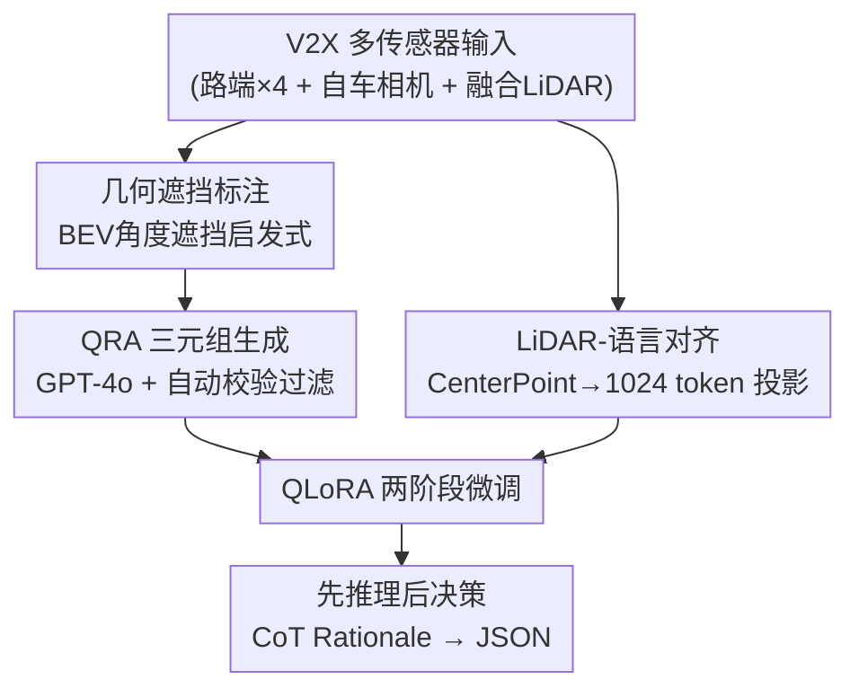

# D2-V2X: Depth-Driven Cooperative V2X Reasoning for Autonomous Driving

**会议**: CVPR 2026  
**arXiv**: [2605.24098](https://arxiv.org/abs/2605.24098)  
**代码**: https://github.com/KevinRichard1/D2-V2X (有)  
**领域**: 自动驾驶 / 多模态VLM / 协同感知  
**关键词**: V2X协同感知, 视觉语言模型, LiDAR-语言对齐, 思维链推理, 遮挡推理

## 一句话总结
针对单车 VLM 受传感器遮挡限制的问题，本文构建了一个把路端+车端 LiDAR 几何信息显式喂给 VLM 的协同推理基准 D2-V2X（8500 条「问题-推理-答案」三元组），并给出一个用 QLoRA 把体素化 LiDAR 特征对齐到 Qwen3-VL 隐空间的 baseline；它把遮挡危险物的召回率从近 0 提到 24.4%、可见物距离估计误差降低 77%，但同时暴露出「3D 特征→2D 像素投影」是当前 VLM 架构的根本瓶颈。

## 研究背景与动机
**领域现状**：把视觉语言模型（VLM）引入自动驾驶来做可解释的场景理解与决策是当前热门方向，主流做法是给单车的多视角图像（有时叠加 BEV 俯视图）配上语言问答，让模型直接「看图说话+做决策」。

**现有痛点**：单车、纯图像的 VLM 受限于自车视角的物理边界——探测距离有限、关键目标被前车/建筑遮挡时根本看不到。BEV 俯视图虽然朝空间感知迈了一步，但它是被压扁的 2D 表示，缺乏完整的 3D 深度信息，无法精确估计被遮挡目标的距离。

**核心矛盾**：V2X（车联万物）系统本可用路端基础设施的传感器补上自车的盲区，但现有 V2X 基准要么只用单模态、要么用多选题/端到端任务评测，**缺乏「同时利用 3D LiDAR + 协同 V2X + 思维链推理」的统一多模态数据集和 baseline**——也就是说，没有任何资源逼着 VLM 把「为什么这个被遮挡的目标是危险的」用语言+几何讲清楚。

**本文目标**：(1) 造一个能评测「协同空间推理」的基准；(2) 给出一个把协同 LiDAR 的 3D 几何接进 VLM 的可行架构；(3) 诚实地暴露这条路上的真实障碍。

**切入角度**：作者假设——如果强迫模型在输出最终驾驶决策（结构化 JSON）之前，先用自然语言写一段「推理（Rationale）」来显式articulate被遮挡物的空间关系，并把这段推理锚定在融合 LiDAR 的真实几何上（而非仅 2D 像素），模型的遮挡意识和决策质量都会提升。

**核心 idea**：用「问题→显式空间推理→结构化决策」的 QRA 格式 + 把体素化协同 LiDAR token 早融合进 VLM，来逼模型「先讲清 3D 几何再做决策」。

## 方法详解

### 整体框架
D2-V2X 包含两部分：一个**数据集构建管线**（造 8500 条 QRA 三元组）和一个**baseline 架构**（把协同 LiDAR 对齐进 Qwen3-VL）。数据侧：以 TUMTraf-V2X 数据集为底，用 4 路路端相机 + 自车相机 + 早融合的 V2X LiDAR，先用几何启发式标出哪些目标对自车是「被遮挡」的，再把这些空间元数据喂给 GPT-4o 生成「问题-推理-答案」三元组，最后过一道自动校验管线滤掉幻觉。模型侧：冻结的 CenterPoint 主干从融合 LiDAR 抽 3D 特征 → 轻量投影层压成 1024 个 token → 与图像、文本 embedding 按序拼接 → QLoRA 微调的 Qwen3-VL 输出「自然语言推理 + 结构化 JSON 决策」。

### 关键设计

**1. 几何遮挡标注启发式：用协同 LiDAR 反推「自车看不见但客观存在」的目标**

要造「协同推理」基准，第一步得知道哪些目标对自车是真遮挡——这正是单车标注做不到、必须靠路端+车端融合 LiDAR 才能确定的。作者的做法是把每个 3D 包围框相对自车原点的角度边界投影到 2D 鸟瞰（BEV）平面，按深度排序；如果某个目标的角度剖面被更近的障碍物大幅遮挡，就标为 occluded——它在自车相机里不可见，却在融合 LiDAR 里仍被定位。这个标签是整个数据集「遮挡推理」任务的 ground truth 来源，也是后面 Occlusion Recall 指标能成立的前提。

**2. QRA 三元组 + 自动校验：逼模型「先讲几何关系再下结论」并保证标注不幻觉**

现有驾驶 QA 多是多选题，模型可以蒙对而不真懂空间关系。本文把每条样本设计成「问题(Q)→推理(R)→答案(A)」三元组，R 必须用自然语言把被遮挡物的位置、距离、相对关系讲清，A 才给出结构化 JSON（决策、危险等级、计数、grounded 目标的 bbox/距离/传感器 id）。三类任务按比例分布：空间感知 30%、场景计数 30%、驾驶机动 40%，并用 4 种不同 persona 增加多样性。生成交给 GPT-4o，但关键在那道**自动校验管线**：它把每条生成结果与原始 ground truth 交叉比对，强制内部一致（如目标计数匹配），并用「动态容差范围」核对生成距离是否落在合理区间——初始 9000 条里约 500 条因目标幻觉或空间不一致被滤掉，留下 8500 条；另对 1% 随机子集做人工复核全部通过。

**3. LiDAR-语言早融合投影层：把稠密 3D 体素塞进 VLM 的 token 序列**

VLM 原生只吃图像+文本 token，3D LiDAR 进不来。作者不用压扁的 BEV 图（会丢深度），而是用冻结预训练的 CenterPoint 主干输出稠密空间特征图 $\mathbf{V}\in\mathbb{R}^{C\times H\times W}$，再设计一个轻量适配器 $f(\mathbf{V})$（2 层 2D 卷积 stem + MLP）把它投影成 $N=1024$ 个落在模型隐空间 $d_{model}$ 的 token。最终多模态序列按「图像→LiDAR→文本」顺序拼接：

$$\mathbf{E}_{input}=[\mathbf{E}_{img}\parallel f(\mathbf{V})^{\top}\parallel\mathbf{E}_{txt}]$$

其中 $\parallel$ 表示沿 token 维拼接，$\mathbf{E}_{input}\in\mathbb{R}^{(L_{img}+1024+L_{txt})\times d_{model}}$。这个固定顺序保证维度对齐、保留 VLM 期望的位置完整性。值得注意——这是**早融合且无跨注意力**，论文后面也承认这正是 3D→2D 投影瓶颈的架构成因之一

**4. 两阶段 QLoRA 训练：先暖身投影层、再联合微调，省算力又防破坏**

随机初始化的投影层若一上来就联合训练，会污染预训练好的 VLM 表示。作者用 4-bit QLoRA 分两阶段：第一阶段冻结 VLM 权重、只训适配器 1 个 epoch（学习率 $1\times10^{-3}$），让投影层先学会「说 VLM 的语言」；第二阶段用 $r=64$、$\alpha=128$ 的 QLoRA 配置对所有线性层 + 解冻的适配器做指令微调 3 个 epoch（学习率 $2\times10^{-5}$，AdamW，weight decay 0.05，有效 batch 64）。整个训练只用单张 A100——这种参数高效路线是「在不重训 8B 模型的前提下接进新模态」的关键

### 一个完整示例
以一条「空间感知」样本走一遍（对应论文 Figure 2）：
- **Q**：检查东南方向有没有隐藏车辆？
- **R（模型被强制先生成的推理）**：能看到一辆面包车，但在 $x{=}25.04, y{=}{-}27.33$ 处有一辆轿车被这辆面包车遮挡，探测距离 37.06 米——若不持续监控，这辆车可能成为隐患。
- **A（结构化 JSON）**：`{"decision":"monitor", "hazard_level":"medium", "count":1, "grounded_objects":[{"type":"car", "bbox":[720,245,862,339], "distance_m":37.06, "sensor_id":"s110_camera_basler_south1_8mm"}]}`

可以看到，正是融合 LiDAR 提供的 3D 坐标让模型「看见」了自车相机里完全被挡住的轿车，而 CoT 推理逼它把「被谁遮挡、在多远、是否危险」讲清后才下「monitor」的决策。

## 实验关键数据

评测指标：**Occ.**（遮挡召回，命中的隐藏目标占比）、**Occ.@10m/@20m**（限定距离阈值内的高精度召回）、**Vis. MAE**（可见物距离估计误差，越低越好）、**F1**（决策 macro-F1，4 类动作）、**BERT**（推理文本质量）、**mIoU**（2D 投影框质量）。

### 主实验（聚合性能，Occ.@10m，Table 1）

| 方法 | F1 | Occ.↑ | Occ.@10m↑ | Vis. MAE↓ | BERT | mIoU |
|------|----|----|------|------|------|------|
| Qwen3-VL（Zero-Shot） | 0.22 | 0.00 | 0.00 | 40.34 | 0.69 | 0.00 |
| Image w/ BEV (SFT) | 0.54 | 0.14 | 0.07 | **8.98** | 0.85 | **0.06** |
| Ego Multimodal (SFT) | 0.45 | 0.16 | 0.08 | 8.83 | 0.85 | 0.01 |
| D2-V2X w/o Rationale | 0.48 | 0.03 | 0.02 | **7.58** | 0.85 | 0.01 |
| **D2-V2X (Full)** | **0.54** | **0.24** | **0.11** | 9.16 | 0.84 | 0.01 |

关键读数：完整 D2-V2X 把遮挡召回从 zero-shot 的 0.00 提到 **0.24（24.4%）**，可见物 MAE 从 40.34 降到 9.16（**降 77%**），决策 F1 达 53.5（0.54）。但 mIoU 仅 0.01、远低于 Image w/ BEV 的 0.06——这就是论文反复强调的 **3D→2D 投影瓶颈**：模型能算出目标和距离，却画不准它在自车图像平面里的 2D 框。

### 消融实验（Rationale 的作用，Table 1 内对比）

| 配置 | Occ.↑ | Vis. MAE↓ | 说明 |
|------|------|------|------|
| D2-V2X (Full) | 0.24 | 9.16 | 完整：先推理后决策 |
| w/o Rationale | 0.03 | 7.58 | 去掉 CoT 推理：MAE 改善 17.2% 但遮挡召回崩塌 87.5% |

### 任务分解（Table 2，Occ.@20m）

| 任务 | 指标 | Ego Multimodal | D2-V2X (Full) |
|------|------|------|------|
| 空间感知 Spatial | Occ. | **0.35** | 0.33 |
| 场景计数 Counting | Occ. | 0.13 | **0.29** |
| 驾驶机动 Maneuver | F1 | 0.32 | 0.40 |

### 关键发现
- **协同 V2X 对全局任务增益最大**：相比单车模型，决策 F1 提升 20%、遮挡召回提升 50%；在场景计数任务上 Occ.@20m 较单车涨 62.5%、较无推理版翻三倍多——补盲区对「数清楚有几个隐藏目标」帮助最大。
- **CoT 推理是「精度 vs 决策」的取舍**：去掉 Rationale 后距离 MAE 改善 17.2%，但遮挡召回暴跌 87.5%（0.24→0.03），且 Maneuver F1 相对掉 8%。说明推理这一步牺牲了一点距离数字精度，换来了对隐藏危险的敏感度和正确的导航决策。
- **反直觉：V2X 对高度局部化任务反而略有损**：融合 V2X LiDAR 给出更完整的全局上下文，但为塞进固定 token 数，下采样更激进，丢了自车近处的高保真局部信息——所以在空间感知任务上 Ego-only（0.35）反超 Full（0.33）；驾驶机动的简单寻路上 Image w/ BEV 的俯视图也比压缩的 3D token 更直接。

## 亮点与洞察
- **诚实地把「失败」当贡献**：论文没有粉饰，而是把 3D→2D 投影（mIoU≈0.01、MAE 仍高到无法实车部署）明确立为「当前 VLM 架构的根本瓶颈」，为后续研究立了一个清晰靶子——这种「立 baseline + 暴露 open challenge」的写法在 benchmark 论文里很有价值。
- **QRA 格式 + 动态容差自动校验**很可复用：用「先讲推理再给结构化输出」逼模型 grounding，再用与 GT 交叉比对的容差校验滤 LLM 标注幻觉（9000→8500），这套「LLM 生成 + 几何核验」的数据管线可迁移到任何需要空间一致性标注的任务。
- **几何遮挡定义被量化**：把「遮挡」用 BEV 角度剖面被近物截断来形式化，使 Occlusion Recall 这个指标有了可计算的 ground truth，而非靠人凭感觉标。
- **早融合无跨注意力是性能天花板的根因**：作者自己点出把稠密 LiDAR 静态压成 1024 token、且不用 cross-attention，限制了细粒度对齐——这给「该用 Q-Former/cross-attn 还是更高分辨率 3D tokenization」留了明确改进口。

## 局限与展望
- **作者承认的局限**：(1) 数据仅来自单个路口，且依赖 LLM 标注可能引入未验证偏差；(2) 2D 几何遮挡启发式忽略 3D 高度剖面（高车可能仍部分可见）；(3) baseline 假设理想数据传输，未考虑通信时延等真实 V2X 难题；(4) 把稠密 LiDAR 压成静态 1024 token + 早融合无跨注意力，限制了细粒度多模态对齐。
- **自己发现的局限**：核心指标 Vis. MAE 仍高达约 9 米，距离「安全实车部署」差很远，论文也坦言这点；不同任务/距离阈值（@10m vs @20m）下的数字不可直接横比，Table 1 与 Table 2 用了不同阈值，读结论时需注意 caveat。决策 F1 的绝对值（0.53）也不高，说明协同推理整体仍处早期。
- **改进思路**：作者提出扩展到多样化路口、注入真实网络噪声、支持更高分辨率 3D tokenization；笔者认为用跨注意力做晚融合、或让投影 token 数随场景目标数自适应，可能直接缓解「全局上下文挤掉局部精度」的下采样难题。

## 相关工作与启发
- **vs V2X-ViT（协同感知）**：V2X-ViT 证明路端+车端融合在重遮挡路口显著优于单车感知，但它是纯感知/检测，不接语言推理；本文把同样的协同思想接进 VLM 并要求语言可解释的 CoT，优势是可解释决策，劣势是 VLM 的 3D→2D 投影还很弱。
- **vs V2V-LLM / 其他 V2X 语言模型**：这类工作把语言模型引入协同驾驶但多为单模态、省掉 LiDAR，因而缺乏精确 3D grounding；本文坚持喂体素化 LiDAR，距离估计和遮挡检测更扎实。
- **vs 现有驾驶 QA 基准（单车、多选题）**：现有基准用单车数据、多选或端到端评测，缺 3D 可解释性；D2-V2X 用协同多模态 + CoT 推理把决策显式锚定到空间几何，是首个三者统一的基准。
- **vs BEV-LLM / Image w/ BEV**：BEV 俯视图给简单寻路提供了强而直接的 2D 表示（本文 Maneuver 任务上 Image w/ BEV 的 F1 还更高），但缺 3D 深度；本文用真 3D 特征换来更好的全局遮挡推理，代价是局部精度。

## 评分
- 新颖性: ⭐⭐⭐⭐ 首个统一 3D LiDAR + 协同 V2X + CoT 推理的多模态基准，QRA 格式与几何遮挡标注有原创性
- 实验充分度: ⭐⭐⭐ 对比了 zero-shot/ego/BEV/无推理多个 baseline 并做任务分解，但仅单路口数据、单 A100、单一 backbone，覆盖面有限
- 写作质量: ⭐⭐⭐⭐ 逻辑清晰，难得地诚实暴露失败与瓶颈，indicator 定义讲得明白
- 价值: ⭐⭐⭐⭐ 作为「立 baseline + 暴露 3D→2D 投影 open challenge」的奠基性工作，对协同驾驶 VLM 方向有明确指引价值

<!-- RELATED:START -->

## 相关论文

- [\[CVPR 2026\] MindDriver: Introducing Progressive Multimodal Reasoning for Autonomous Driving](minddriver_introducing_progressive_multimodal_reasoning_for_autonomous_driving.md)
- [\[CVPR 2025\] V2X-R: Cooperative LiDAR-4D Radar Fusion with Denoising Diffusion for 3D Object Detection](../../CVPR2025/autonomous_driving/v2x-r_cooperative_lidar-4d_radar_fusion_with_denoising_diffusion_for_3d_object_d.md)
- [\[NeurIPS 2025\] V2X-Radar: A Multi-Modal Dataset with 4D Radar for Cooperative Perception](../../NeurIPS2025/autonomous_driving/v2x-radar_a_multi-modal_dataset_with_4d_radar_for_cooperative_perception.md)
- [\[CVPR 2026\] ColaVLA: Leveraging Cognitive Latent Reasoning for Hierarchical Parallel Trajectory Planning in Autonomous Driving](colavla_leveraging_cognitive_latent_reasoning_for_hierarchical_parallel_trajecto.md)
- [\[CVPR 2026\] HybridDriveVLA: Vision-Language-Action Model with Visual CoT reasoning and ToT Evaluation for Autonomous Driving](hybriddrivevla_vision-language-action_model_with_visual_cot_reasoning.md)

<!-- RELATED:END -->
