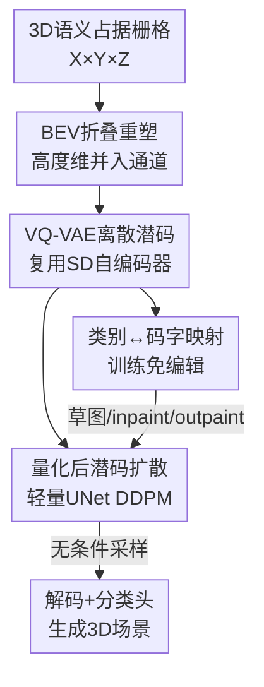

# EditSSC: Toward Editable Semantic Occupancy Scenes with Unconditional Diffusion Models

**会议**: CVPR 2026  
**arXiv**: [2606.09273](https://arxiv.org/abs/2606.09273)  
**代码**: https://astra-vision.github.io/EditSSC （项目主页）  
**领域**: 自动驾驶 / 3D语义占据生成 / 扩散模型  
**关键词**: 语义占据生成, BEV表示, VQ-VAE, 潜空间扩散, 训练免编辑

## 一句话总结
把 3D 语义占据栅格"压扁"成多通道 BEV 图像，直接复用 Stable Diffusion 的现成 VQ-VAE 和 UNet 做无条件场景生成，并利用向量量化码本天然形成的"类别↔码字"对应关系，实现无需重训练的草图引导、inpainting 与 outpainting 编辑；在 SemanticKITTI 上无条件生成超过 3D 专用基线。

## 研究背景与动机
**领域现状**：3D 语义场景生成对自动驾驶的数据增广和仿真很有价值。当前室外大场景生成（如 SemCity、SSD）几乎都依赖 **3D 专用架构**——把场景编码成三平面（triplane）潜表示，再配一个为三平面定制、需要跨平面共享特征的复杂 UNet。

**现有痛点**：这类 3D 专用设计带来两个问题。其一是**复杂**：triplane 编码器和适配的扩散网络都要从头设计、调参成本高。其二是**难编辑**：要在 triplane 上编辑场景（如 SSEditor），用户得在三个正交方向都画出类别轮廓，极不直观；并且 triplane 表示难以接入 LiDAR 这类条件信号。

**核心矛盾**：社区有一个"想当然"的信念——**自编码器重建得越好，生成质量就越高**，因此架构选择往往只看重建分数。但作者在 pilot study 中发现这个代理指标并不可靠：用一个 MLP 自编码器能做到近乎完美的重建（IoU 98.9 / mIoU 98.5），扩散生成却最差（FID 156.9），因为它的潜空间稀疏、不规则；反而重建分数更低的 VQ-VAE 扩散效果最好。**真正决定扩散质量的是潜空间的结构（平滑性、规整性），而不是重建保真度**。

**本文目标**：设计一个既简单、又"生而可编辑"的 3D 语义占据生成管线，把生成与编辑能力一起拿下，且尽量不引入 3D 专用模块。

**切入角度**：驾驶场景里物体基本铺在地面、很少垂直堆叠，所以沿两个水平轴展开的 **BEV（鸟瞰图）表示天然适合编辑**，只需 2D 条件即可；而向量量化（VQ）的**离散码本**正好提供了扩散所需的规整潜空间，还能反查出类别原型。

**核心 idea**：把 3D 占据栅格折叠成多通道 BEV 图像，**直接复用为图像设计的现成 2D 扩散管线（Stable Diffusion 的 VQ-VAE + 轻量 UNet）**，在量化后的离散潜码上做扩散，从而免费获得"类别↔码字"映射带来的训练免编辑能力。

## 方法详解

### 整体框架
EditSSC 是一个经典的两阶段潜扩散管线，但每个设计都围绕"可编辑"这个目标做选型。输入是 $X\times Y\times Z$ 的 3D 语义占据体素栅格（每个体素一个类别标签），输出是新生成（或被编辑）的同尺寸语义占据场景。

第一阶段训练 **VQ-VAE**：先把每个类别标签映射成 $D$ 维 embedding，再把高度维 $Z$ 和 embedding 维 $D$ 一起折叠进通道轴，得到一张 $X\times Y\times(Z\cdot D)$ 的多通道 BEV 图像，从而能直接喂给 Stable Diffusion 的图像自编码器；编码器把它压成离散潜码，解码器重建后经分类头映回体素类别。第二阶段在**量化后的** BEV 潜码上训练一个轻量 UNet 做 DDPM 扩散，从纯噪声迭代去噪生成新潜码再解码成场景。推理时，因为码本里每个码字几乎只对应一个语义类别，作者构建"类别↔码字"映射，配合 RePaint 式的部分约束去噪，实现草图引导 / inpainting / outpainting，全程**不需要任何重训练**。

### 关键设计

**1. BEV 折叠重塑：把 3D 占据当成多通道图像，免掉所有 3D 专用模块**

痛点在于：要做 3D 生成，主流必须设计 triplane 编码器和适配三平面的 UNet，复杂且难编辑。作者的做法极简——观察到驾驶场景沿水平面展开、垂直方向信息有限，于是把 $X\times Y\times Z\times D$ 的体素 embedding 张量沿高度维折叠进通道，得到 $X\times Y\times(Z\cdot D)$ 的 BEV "图像"。这样一来，只要把 Stable Diffusion 的 VQ-VAE 输入通道从 RGB 的 3 改成 $Z\cdot D$、相应调一下潜空间维度，**现成的 2D 图像自编码器就能直接吃 3D 占据数据**，解码端再 reshape 回 3D 体并接一个分类头预测每体素类别。它有效是因为：BEV 把"难编辑的三维体"变成了"易编辑的二维图像域"，下游可以无缝复用整条为图像打磨多年的扩散管线，而实验证明这种纯 2D 编码并不损失生成质量。

**2. 量化后潜码上扩散：用 VQ 的规整离散潜空间换取更好的扩散质量**

这一设计直击"重建好≠生成好"的核心矛盾。作者不在连续潜码（量化前）上扩散，而是在**量化后的离散潜码**上训练 DDPM。前向过程 $T=1000$ 步逐步加高斯噪声，$q(\mathbf{z}_t|\mathbf{z}_0)=\mathcal{N}(\sqrt{\bar\alpha_t}\,\mathbf{z}_0,(1-\bar\alpha_t)\mathbf{I})$；去噪网络采用 $x_0$ 参数化，直接预测干净潜码，损失为 $\mathcal{L}_D=\mathbb{E}_{t}\|\mathbf{z}_0-D_\phi(\mathbf{z}_t,t)\|_2^2$。UNet 用 Stable Diffusion 的结构，但**只在瓶颈前最低分辨率保留注意力层**，因为 BEV 潜图比自然图像简单，模型可大幅瘦身。为什么选量化后？一方面 pilot study 显示 VQ 带来的离散、紧凑潜空间比 MLP 那种"重建完美但稀疏不规整"的潜空间更适合扩散（FID 84.9 vs 156.9）；另一方面，离散码字才是下面训练免编辑能力的载体——这是与连续潜扩散最本质的区别。

**3. 类别↔码字映射：用码本的语义纯度换取零成本的训练免编辑**

痛点是现有可编辑方法（SSEditor）需要专门设计编辑机制、且 triplane 编辑不直观。作者发现一个被忽视的性质：VQ 码本里的码字与语义类别有强对应。用**纯度（purity）**——某码字所分配体素中属于其最高频类别的比例——来量化，发现绝大多数码字纯度都很高，几乎只对应单一类别。于是为每个类别挑选"被该类最频繁使用且纯度高"的码字，建立**类别↔码字映射**（两条标准高度相关）。有了它，用户在 BEV 上画的草图可直接被翻译成潜码：借鉴 RePaint，前 $K$ 步把已知区域强制替换为草图对应的码字、后 $T-K$ 步松开约束让模型自由细化边界与周边一致性；inpainting/outpainting 则在全部 $T$ 步保留已知区域、只生成缺失/外扩区域。整个过程**无需重训练、无需测试时适配**，编辑能力是架构选型的"免费副产物"——这正是把扩散放在量化后潜码上的回报。

### 损失函数 / 训练策略
VQ-VAE 阶段联合训练 embedding 层、分类头，损失为 $\mathcal{L}_{\text{VQ-VAE}}=\mathcal{L}_{\text{CE}}+\mathcal{L}_{\text{Lov\'asz}}+\lambda\mathcal{L}_{\text{quant}}$：交叉熵提供逐体素监督，Lovász-Softmax 直接优化 IoU、改善欠表示类别，量化损失 $\mathcal{L}_{\text{quant}}=\|\text{sg}[\mathbf{z}_e(\mathbf{x})]-\mathbf{e}\|_2^2+\beta\|\mathbf{z}_e(\mathbf{x})-\text{sg}[\mathbf{e}]\|_2^2$（$\text{sg}$ 为停梯度，$\beta$ 为 commitment 权重）。扩散阶段用 $x_0$ 参数化的 DDPM 损失。最终配置选 **512 码字 / 维度 8**，以保证 100% 码本利用率。

## 实验关键数据

### Pilot study：重建 ≠ 生成（核心动机验证）
在 SemCity 架构上换不同自编码器，对比"重建"与"扩散生成"性能：

| 自编码器 | 表示 | IoU↑ | mIoU↑ | FID↓ |
|---------|------|------|-------|------|
| SemCity AE | Triplane | 84.84 | 84.65 | 104.1 |
| SemCity AE | BEV | 80.30 | 77.84 | 120.1 |
| SemCity VQ-VAE | BEV | 80.10 | 68.35 | 97.5 |
| MLP | BEV | **98.90** | **98.50** | 156.9（最差） |

关键发现：MLP 重建近乎完美，扩散却最烂；VQ-VAE 重建最低，扩散反而最好。证明**潜空间结构比重建保真度更决定扩散质量**。

### 自编码器与无条件生成（vs SemCity 各变体）
| 方法 | IoU↑ | mIoU↑ | KID↓ | CKL↓ | Prec↑ |
|------|------|-------|------|------|-------|
| SemCity (triplane) | 84.84 | 84.65 | 104.1 | 0.0936 | 0.0329 |
| SemCity (BEV) | 80.30 | 77.84 | 120.1 | 0.1310 | 0.0453 |
| SemCity (BEV VQ-VAE) | 80.10 | 68.35 | 97.5 | 0.0968 | 0.0249 |
| **EditSSC (ours)** | 81.90 | 72.20 | **84.9** | **0.0818** | 0.0362 |

EditSSC 在 KID（领先 -6.6）和 CKL（-0.015）上大幅领先，说明生成场景更真实、且更忠实复现训练集类别分布——纯 2D 管线打过了带 3D 卷积的 BEV VQ-VAE 变体。

### LiDAR 条件生成（vs 通用 SSC 方法）
| 类别 | 方法 | IoU↑ | mIoU↑ |
|------|------|------|-------|
| SSC | JS3C-Net | 57.0 | 24.0 |
| SSC | DiffSSC | 60.3 | 26.7 |
| **可编辑 SSC** | **EditSSC (ours)** | 42.1 | 12.5 |

诚实地承认：在条件生成上 EditSSC 明显落后专用 SSC 方法，但它是**唯一同时支持 LiDAR 条件生成的可编辑 SSC**（SSEditor 因架构复杂不支持），作者把这作为待改进点。

### 消融实验
| 消融维度 | 配置 | 关键指标 | 说明 |
|---------|------|---------|------|
| VQ-VAE 码本 | 512 码 / dim 8 | FID 84.9，利用率 100% | 最终选择，性能竞争力 + 满利用率 |
| VQ-VAE 码本 | 2048 码 / dim 8 | FID 93.77，利用率 43.7% | 重建最高但码本大量浪费、FID 反升 |
| 扩散位置 | 量化前（连续） | FID 81.60，CKL 0.0435，不可编辑 | 单样本质量略好 |
| 扩散位置 | 量化后（离散） | FID 84.90，CKL 0.0362，**可编辑** | CKL/Recall 更好，且解锁编辑 |

### 关键发现
- **码本不是越大越好**：码本从 512 增到 2048，利用率从 100% 暴跌到 43.7%，大量码字从未被用、容量被浪费，FID 反而变差。512 码字在满利用率下就有竞争力。
- **量化前 vs 量化后扩散两者性能基本持平**：连续潜扩散 FID/KID 略好，离散潜扩散 CKL 和 Recall 更好（类别分布更忠实、多样性更高）。鉴于只有量化后才能编辑，作者认为这个微小代价完全值得。
- 数据集只有 SemanticKITTI（10 个训练序列、同一片德国街区），多样性有限——这正是作者强调编辑能力（生成训练分布外样本）价值的原因。

## 亮点与洞察
- **"把 3D 当 2D 图像"的折叠技巧最巧妙**：仅靠把高度维折进通道维，就让整条成熟的图像扩散管线（Stable Diffusion 的 VQ-VAE + UNet）零改动地服务 3D 占据生成，避开了 triplane 那套复杂的 3D 专用设计。
- **编辑能力是"白捡"的**：作者没有为编辑设计任何专门模块，而是发现 VQ 码本天然存在高纯度的"类别↔码字"对应，编辑只是推理时换码字 + 部分约束去噪，零重训练成本。这种"换个潜空间就解锁新能力"的思路很有迁移价值。
- **挑战"重建好=生成好"的惯性认知**：用 MLP（重建完美但扩散最差）和 VQ-VAE（重建一般但扩散最好）的对照，干净地证明了潜空间结构才是扩散的关键，这个洞察可迁移到任何潜扩散任务的自编码器选型。
- **诚实的负结果**：条件生成明显落后专用 SSC，作者没有藏，反而把它定位成"可编辑 SSC 这个新方向还需努力"，提升了论文可信度。

## 局限与展望
- **条件生成性能差距大**：LiDAR 条件生成 IoU 42.1 / mIoU 12.5，远低于专用 SSC（DiffSSC 60.3/26.7），可编辑性目前是以一定生成精度为代价换来的。
- **只在 SemanticKITTI 上验证**：单一数据集、且训练序列少、场景同质（同一片街区），泛化性与跨域能力未知；大码本利用率低也暗示数据多样性不足以填满码本容量。
- **编辑能力只有定性结果**：草图引导 / inpainting / outpainting 全靠图示展示，缺乏量化指标（如编辑保真度、用户研究），难以客观比较。
- **作者展望**：在保持设计简洁的前提下提升条件性能、扩充训练数据以更充分利用 VQ 码本、引入预训练 2D 扩散模型，以及借 BEV 表示接入文本等多模态条件实现 text-to-3D 场景生成。

## 相关工作与启发
- **vs SemCity / SSD（triplane 路线）**: 它们用三平面潜表示 + 定制 UNet 做室外 3D 生成，重建强但架构复杂、难编辑、难接条件。EditSSC 改用 BEV + 现成 2D VQ-VAE，无条件生成反而更优（KID 84.9 vs 104.1），且天然可编辑——优势是简洁与可编辑，劣势是条件生成精度。
- **vs SSEditor（可编辑路线）**: SSEditor 用三平面类别掩码做编辑，用户要在三个方向都画轮廓、不直观，且不支持 LiDAR 条件。EditSSC 在二维 BEV 上编辑更自然，且是唯一支持 LiDAR 条件的可编辑 SSC。
- **vs DiffSSC 等专用 SSC**: 专用 SSC 在 LiDAR 条件补全上精度高（IoU 60+），但不具备无条件生成与编辑能力。EditSSC 牺牲条件精度，换来生成 + 编辑的一体化与简洁性。
- **承接 [17]（图像潜扩散）的洞察**: 把"潜空间平滑/规整比重建保真更重要"的结论从 2D 图像迁移到 3D 占据生成，并用 VQ-VAE 落地，是一次有说服力的跨模态验证。

## 评分
- 新颖性: ⭐⭐⭐⭐ 折叠成 BEV + 复用 2D 管线 + 码本免训练编辑的组合思路清新，单点技术多为现有组件巧妙拼装
- 实验充分度: ⭐⭐⭐ pilot study 与消融很到位，但只在单一数据集、编辑能力缺量化评估、条件生成明显落后
- 写作质量: ⭐⭐⭐⭐ 动机推导（重建≠生成）清晰有力，方法叙述简洁，负结果诚实
- 价值: ⭐⭐⭐⭐ 为自动驾驶提供低成本、可编辑的场景生成路径，"换潜空间解锁编辑"的思路有迁移价值

<!-- RELATED:START -->

## 相关论文

- [\[CVPR 2026\] Monocular Open Vocabulary Occupancy Prediction for Indoor Scenes (LegoOcc)](monocular_open_vocabulary_occupancy_prediction_for_indoor_scenes.md)
- [\[CVPR 2026\] ReScene4D: Temporally Consistent Semantic Instance Segmentation of Evolving Indoor 3D Scenes](rescene4d_temporally_consistent_semantic_instance_segmentation_of_evolving_indoo.md)
- [\[CVPR 2026\] Panoramic Multimodal Semantic Occupancy Prediction for Quadruped Robots](panoramic_multimodal_semantic_occupancy_prediction.md)
- [\[CVPR 2026\] OneOcc: Semantic Occupancy Prediction for Legged Robots with a Single Panoramic Camera](oneocc_semantic_occupancy_prediction_for_legged_robots_with_a_single_panoramic_c.md)
- [\[CVPR 2025\] OccMamba: Semantic Occupancy Prediction with State Space Models](../../CVPR2025/autonomous_driving/occmamba_semantic_occupancy_prediction_with_state_space_models.md)

<!-- RELATED:END -->
