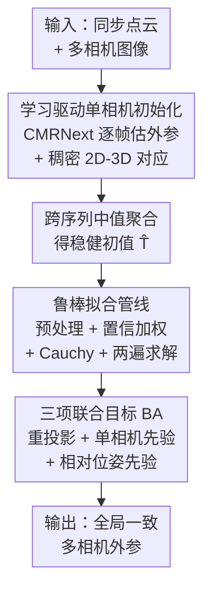

# Joint Multi-Camera LiDAR Extrinsic Calibration via Learned Pairwise Initialization and Geometric Refinement

**会议**: CVPR 2026  
**arXiv**: [2605.31576](https://arxiv.org/abs/2605.31576)  
**代码**: 无  
**领域**: 自动驾驶 / 多传感器标定 / 相机-LiDAR外参  
**关键词**: 相机-LiDAR标定, 多相机联合标定, 外参标定, 束调整, 跨模态匹配

## 一句话总结
针对"多相机各自独立标定 LiDAR 导致系统级不一致"的问题，本文提出两阶段框架：先用学习方法 CMRNext 给每个相机单独估初值，再用一个带"相对位姿先验"的多帧束调整把所有相机外参联合精化；在域外数据集 Walkley 上把平移误差从 108.6 cm 压到 3.1 cm，KITTI 上主相机达到 0.89 cm / 0.038° 精度。

## 研究背景与动机
**领域现状**：现代感知系统要把 LiDAR 的几何精度和相机的视觉语义融合起来（做检测、分割、场景理解），这一切的前提是准确的**相机-LiDAR 外参**——即把 3D 点投影到图像平面的刚体变换 $T_{L\to C}\in SE(3)$。近年来基于学习的标定方法（RegNet/CalibNet/LCCNet 回归类，以及 CMRNext 这类匹配类）显著提升了鲁棒性。

**现有痛点**：现实平台往往在一颗 LiDAR 周围装多个相机以扩大视场，但几乎所有学习方法都**把每个相机-LiDAR 对当成独立问题**单独标定。结果是每个相机单看精度都还行，**系统层面却互相不一致**——相机间相对位姿对不上，跨视角出现错位伪影。

**核心矛盾**：在多相机平台上，所有相机刚性固定在同一台车上，外参并不独立——它们通过共享的 LiDAR 坐标系被耦合，任意两相机的相对位姿被完全决定：$T_{C_i\to C_j}=T_{L\to C_j}T_{L\to C_i}^{-1}$。独立标定**丢掉了这个刚体约束**，等于浪费了相机之间能互相校正的信息。

**本文目标**：把"学到的成对（pairwise）匹配"的泛化能力，和"刚体约束下的多相机联合优化"结合起来，既提升单相机精度、又保证相机间一致性。

**切入角度**：学习类方法 CMRNext 擅长跨模态稠密匹配、给出可靠的初值和 2D-3D 对应；而经典几何优化（束调整）擅长在约束下做全局一致的精化。两者正好互补——用前者当前端、后者当后端的"刚体感知精化"。

**核心 idea**：用 CMRNext 的单相机预测做初始化，再用一个**显式带相对位姿先验的多帧束调整**把所有相机外参一起优化，把"成对预测"转成"全局一致的多相机标定"。

## 方法详解

### 整体框架
输入是若干帧同步的 LiDAR 点云 $\mathbf{P}^t$ 和多相机图像 $\{I_i^t\}$，输出是一组全局一致的外参 $\mathcal{T}=\{T_{L\to C_1},\dots,T_{L\to C_N}\}$（本文实验为两相机 $N=2$）。流程分两阶段：**阶段一**对每个相机独立跑 CMRNext，得到逐帧外参和稠密 2D-3D 对应，再跨序列取中值聚合成一个稳健初值 $\hat T_{L\to C_i}$；**阶段二**把所有相机外参拼成一个状态向量，用一个三项目标（重投影 + 单相机先验 + 相对位姿先验）的多帧束调整联合精化，并配一整套鲁棒拟合管线（Cauchy 损失、置信加权、对应预处理、两遍求解）。关键在于阶段二的相对位姿先验——它把"两相机相对位姿"这个刚体约束写进了优化目标，让信息能在相机之间传播。

### 关键设计

**1. 学习驱动的单相机初始化 + 中值聚合：给后端一个靠谱的起点**

束调整对初值很敏感，初值差就会陷入局部最优。本文不自己设计前端，而是直接复用 CMRNext：对每个同步的图像-点云对 $(I_i^t,\mathbf{P}^t)$，它预测渲染深度图与相机图像之间的稠密光流，从中抽出一组 2D-3D 对应 $\{(\bar{\mathbf{u}}_{ik},\mathbf{p}_k)\}$ 并估出逐帧外参 $\hat T_{L\to C_i}^t$。由于逐帧预测会抖，作者对整段序列的逐帧外参**取中值**得到单个稳健初值 $\hat T_{L\to C_i}$（中值天然抗离群帧）。这一步既提供了外参初值、又提供了带置信度的 2D-3D 对应，是阶段二两类输入的来源。匹配类前端的好处是泛化性强——即便在域外数据上单帧不准，至少能给出一个"够好"的起点让后端去救。

**2. 三项联合目标：把多相机刚体耦合显式写进优化**

这是全文的核心。每个外参用 6 维向量 $x_i=[\boldsymbol\omega_i^\top,\mathbf{t}_i^\top]^\top$（轴角 + 平移）参数化，经 $SE(3)$ 指数映射 $T_i=\exp(x_i)$ 还原，两相机拼成 12 维状态 $x=[x_1^\top\;x_2^\top]^\top$，并用阶段一的 $\log(\hat T_i)$ 初始化。优化目标含三项：

$$\min_{T_1,T_2}\ \underbrace{\sum_{i}\sum_k \rho\big(\|\mathbf{w}_{ik}(\bar{\mathbf{u}}_{ik}-\pi_i(T_i,\mathbf{p}_k))\|^2\big)}_{\text{重投影}}+\underbrace{\lambda\sum_i\|\log(\hat T_i^{-1}T_i)\|^2}_{\text{单相机先验}}+\underbrace{\mu\|\log(\hat T_{12}^{-1}T_2T_1^{-1})\|^2}_{\text{相对位姿先验}}$$

三项各司其职：**重投影项**让每个 LiDAR 点投影对齐到观测像素，是主拟合项；**单相机先验**在对应稀疏/噪声大时把每个外参拉回初值 $\hat T_i$，起稳定作用；**相对位姿先验**才是多相机的关键——它惩罚当前两相机相对位姿 $T_2T_1^{-1}$ 偏离阶段一隐含的相对位姿 $\hat T_{12}=\hat T_2\hat T_1^{-1}$，等于把式 (3) 的刚体耦合做成了软约束，让约束良好的那个视角能"借力"去校正较弱的视角，同时不让任一相机漂离太远。这正是独立标定做不到、而本文能做到的地方。

**3. 鲁棒拟合管线：让学到的对应里的离群点不毁掉优化**

阶段一给的对应里仍混着错配和大误差点（域外尤其多），直接最小二乘会被离群点带偏。作者叠了一套防护：① **Cauchy 鲁棒损失** $\rho(s)=\delta^2\log(1+s/\delta^2)$ 压制大残差（$\delta$ 以像素计，KITTI 取 4 px、Walkley 取 8 px）；② **置信加权** $r_{ik}=w_{ik}(\bar{\mathbf{u}}_{ik}-\pi_i(T_i,\mathbf{p}_k))$，权重随阶段一置信度 $c_{ik}$ 单调增（等价于广义最小二乘 $\sigma_{ik}^2\propto 1/w_{ik}^2$），高置信匹配影响更大；③ **对应预处理**——深度过滤（丢 $Z\le0$ 的点）、置信预筛（低于 $c_{\min}$ 丢）、$40\times25$ 网格空间下采样（每格只留最高置信的一条、每帧上限 $M_{\max}$），避免优化被某个密集区域主导；④ **两遍求解（fit-gate-refit）**：第一遍跑完后剔除无权重重投影误差超过 $\tau$ px 的对应（KITTI $\tau=3$、Walkley $\tau=16$），用剩下的内点从第一遍解再跑一遍得到最终 $T_1^*,T_2^*$。优化器用 Trust-Region Reflective（scipy 的 `least_squares`）。这套组合是域外能从 108 cm 救回 3 cm 的实际保障。

### 损失函数 / 训练策略
本文阶段二是**纯优化、不训练**：单相机外参在所有 $N$ 帧上联合估计一个静态外参（不精化逐帧位姿）。收敛容差设 $10^{-6}$，最大 2000 次函数评估。先验权重和鲁棒尺度按数据集随机搜索：KITTI $(\lambda,\mu)=(1,5)$、Walkley $(2,10)$。阶段一 CMRNext 直接用其预训练权重（KITTI 为域内，Walkley 为域外）。阶段二在 CPU 上跑，占总运行时间不到 5%。

## 实验关键数据

### 主实验
KITTI Sequence 00（域内，±1.5 m/±20° 扰动初始化），与已发表方法对比，主相机平移误差 $E_t$[cm] / 旋转误差 $E_R$[°]：

| 方法 | 主相机 $E_t$ | 主相机 $E_R$ | 副相机 $E_t$ | 副相机 $E_R$ |
|--------|------|------|------|------|
| LCCNet | 1.01 | 0.12 | 52.51 | 1.47 |
| CMRNet | 1.57 | 0.10 | 52.92 | 1.49 |
| CMRNext | 1.89 | 0.08 | 7.07 | 0.23 |
| Stage-1 (N=100) | 2.63 | 0.187 | 6.23 | 0.137 |
| **本文 (N=100)** | **0.89** | **0.038** | **4.97** | **0.030** |

本文 N=100 相对自身 Stage-1 在主相机上平移约 3×、旋转约 5× 提升，且优于所有列出的旧方法。

Walkley（域外，N=100）平移误差从大幅恶化的初值救回：

| 配置 | 主相机 $E_t$[cm] | 副相机 $E_t$[cm] | 相机间 IC-$\Delta t$[cm] |
|--------|------|------|------|
| CMRNext (Stage-1) | 87.2 | 108.6 | 87.0 |
| BA (仅重投影) | 25.7 | 3.57 | 23.9 |
| BA (仅先验, 无重投影) | 75.6 | 93.2 | 76.5 |
| **本文 (全部项)** | **22.6** | **3.14** | **21.0** |

### 消融实验
四配置隔离各阶段贡献（KITTI 域内 vs Walkley 域外），关键结论：

| 配置 | KITTI 表现 | Walkley 表现 | 说明 |
|------|---------|---------|------|
| Stage-1 only | 已很强 | 误差极大(87/108 cm) | 域内初值好、域外不可靠 |
| 仅重投影 BA | 略升 | 主恢复机制(救回到 25.7/3.57) | 数据拟合是大头 |
| 仅先验(无重投影) | 反而最差 | 几乎救不回(75.6/93.2 cm) | 先验单独无法恢复大误差 |
| 全方法 | 最优一致性 | 最优(22.6/3.14) | 先验做"稳定器+一致性" |

### 关键发现
- **重投影项是域外的主恢复机制**：Walkley 上把副相机从 108.6 cm 救到 3.57 cm 的主要是重投影 BA；先验项再把它精修到 3.14 cm 并改善相机间一致性。
- **先验项的作用随域不同而变**：域内（KITTI）初值已好，先验主要当"稳定器"，全方法相对仅重投影提升有限；域外初值差时，相对位姿先验让弱视角借强视角之力，提升最明显。
- **"仅先验无重投影"这一控制组证明**：大误差的恢复必须靠拟合学到的 2D-3D 对应，光有几何正则项救不回来（Walkley 上仅比 Stage-1 略好、还不如仅重投影）。
- **不牺牲单相机精度换一致性**：KITTI 上联合精化在提升相机间一致性的同时，单相机精度反而更好。

## 亮点与洞察
- **把"刚体耦合"写成一项软约束**：相对位姿先验 $\mu\|\log(\hat T_{12}^{-1}T_2T_1^{-1})\|^2$ 是全文最巧的一笔——它用一行残差就把"多相机不独立"这个被普遍忽略的几何事实塞进了优化，让强视角能救弱视角。这个思路可迁移到任意多传感器刚体平台（多相机、相机-IMU、多 LiDAR）的联合标定。
- **学习前端 + 几何后端的清晰分工**：前端（CMRNext）负责泛化和给初值/对应，后端（BA）负责刚体约束下的全局一致精化，各扬所长。这种"用学习给初值、用优化保一致"的范式很值得复用。
- **域内/域外对照设计很说明问题**：用 KITTI（域内强初值）和 Walkley（域外弱初值）两个互补数据集，干净地展示了"何时只需重投影、何时需要加先验"——这种把方法的适用边界讲清楚的实验态度比单纯刷 SOTA 更有参考价值。

## 局限与展望
- **作者承认的局限**：当帧数少且 CMRNext 已接近最佳（KITTI N=10）时，BA 几乎没有提升空间；Walkley 主相机残留约 22 cm 平移误差，说明域外对应质量仍是优化无法完全弥补的瓶颈。
- **只验证了两相机**：方法形式上支持 $N$ 个相机，但实验只做了 $N=2$，更多相机时联合优化的可扩展性和收敛性未验证。
- **依赖前端质量的下限**：整个框架建立在 CMRNext 能给出"够好"初值之上；若前端在某域彻底失效（对应几乎全错），后端的鲁棒管线也未必救得回（Walkley 主相机就是例证）。
- **改进思路（含作者展望）**：扩展到多于两相机的相机阵；引入在线滑窗 BA 做持续重标定；端到端联合训练对应网络与几何精化目标，让前端"为后端服务"地学。

## 相关工作与启发
- **vs CMRNext（前端基线）**：CMRNext 做单相机-LiDAR 的稠密跨模态匹配，泛化好但**只管成对、不管多相机一致性**；本文把它当阶段一前端，再加阶段二联合 BA 补上系统级一致性，副相机和相机间误差都明显更优。
- **vs LCCNet/CMRNet 等回归类**：它们直接回归外参，隐式学到数据集相关线索、跨配置泛化差（副相机误差高达 50+ cm）；本文用匹配类前端 + 显式几何优化，副相机精度大幅领先。
- **vs UniCal / Multi-Calib / Tu 等多传感器联合标定**：这些方法也追求全局一致，但**没有利用近年学习类成对匹配作为刚体感知精化的前端**；本文的差异正是"把学到的 pairwise 匹配 + 刚体先验 BA"组合起来，兼得泛化与一致性。

## 评分
- 新颖性: ⭐⭐⭐⭐ 把"多相机刚体耦合"做成显式相对位姿先验、并与学习前端组合，角度清晰但单项组件多为已有
- 实验充分度: ⭐⭐⭐ 域内/域外 + 四配置消融做得干净，但只验证两相机、无更大规模相机阵
- 写作质量: ⭐⭐⭐⭐ 动机—公式—消融逻辑顺畅，适用边界讲得诚实
- 价值: ⭐⭐⭐⭐ 对多相机平台标定是实用且可迁移的工程范式，域外救回效果突出

<!-- RELATED:START -->

## 相关论文

- [\[CVPR 2026\] LiREC-Net: A Target-Free and Learning-Based Network for LiDAR, RGB, and Event Calibration](lirec-net_a_target-free_and_learning-based_network_for_lidar_rgb_and_event_calib.md)
- [\[CVPR 2026\] Learning Geometric and Photometric Features from Panoramic LiDAR Scans for Outdoor Place Categorization](learning_geometric_and_photometric_features_from_p.md)
- [\[CVPR 2026\] SG-NLF: Spectral-Geometric Neural Fields for Pose-Free LiDAR View Synthesis](sgnlf_spectralgeometric_neural_fields_for_posefre.md)
- [\[CVPR 2026\] Mind the Hitch: Dynamic Calibration and Articulated Perception for Autonomous Trucks](mind_the_hitch_dynamic_calibration_and_articulated_perception_for_autonomous_tru.md)
- [\[CVPR 2026\] CoIn3D: Revisiting Configuration-Invariant Multi-Camera 3D Object Detection](coin3d_revisiting_configuration-invariant_multi-camera_3d_object_detection.md)

<!-- RELATED:END -->
