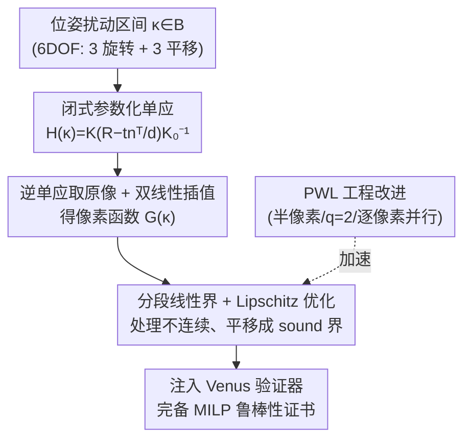

# Lipschitz Optimization for Formal Verification of Homographies

**会议**: CVPR 2026  
**arXiv**: [2605.23203](https://arxiv.org/abs/2605.23203)  
**代码**: https://github.com/jeangud/homography-verification (有)  
**领域**: 自动驾驶 / 神经网络形式化验证  
**关键词**: 形式化验证、单应变换、Lipschitz 优化、相机位姿鲁棒性、分段线性界

## 一句话总结
把"相机 6 自由度位姿扰动 → 像素值"写成闭式单应变换，再把 Batten 等人的分段线性 + Lipschitz 优化界从仿射变换推广到非仿射的投影变换，从而**首次**对神经网络做"相机运动鲁棒性"的形式化验证，相比前作最高加速 89%、界紧 7%，并在 VNN-COMP 网络与跑道可见性分类器上揭示了对 3D 视角扰动的系统性脆弱。

## 研究背景与动机
**领域现状**：要把视觉神经网络部署到航空、自动驾驶、医疗这些受监管的安全攸关场景，光有统计意义上的"测试集准确率"不够，监管机构要求**形式化鲁棒性保证**——数学上证明在某类扰动下网络输出不变。目前的神经网络验证（VNN）绝大多数只针对 $\ell_p$ 范数球扰动（像素级噪声、对比度、色调）或简单的 2D 仿射变换。

**现有痛点**：真实世界里很多扰动**源于场景的物理空间**（视角变化、相机抖动），在成像之前就发生，再经过投影几何映射到像素。用一个足够大的 $\ell_p$ 球去"罩住"这些扰动后的图像，会严重**过近似**真实的扰动流形——把一大堆根本不可能出现的噪声图也算进去，导致界太松、什么都证不出来。而相机运动鲁棒性恰恰是部署视觉系统的关键，却一直是未解问题。

**核心矛盾**：相机视角变化对应的是**非仿射的投影变换（单应）**，像素坐标映射带一个"除以光线深度"的分母（透视归一化），高度非线性且可能不连续；而现有能给出**完备**保证的验证方法（如基于 Lipschitz 优化的分段线性界）只处理仿射变换（分母恒为 1），无法表达透视效应。

**本文目标**：(1) 把 6 自由度位姿扰动诱导的单应写成闭式、可被验证器吃下的参数化形式；(2) 把分段线性界 + Lipschitz 优化推广到这种非仿射、可能不连续的变换上，给出可证紧的像素值界；(3) 用它在标准 benchmark 和真实安全攸关分类器上做第一手鲁棒性体检。

**切入角度**：作者观察到，对于**以平面结构为主**的场景（地面、交通标志、路面标线、机械臂工作平面），两个视角之间的映射严格是一个单应矩阵——这是一个既能表达透视、又解析可处理的"中间地带"，比 $\ell_p$ 球更贴合真实流形，又比"复杂仿真 + 代理网络 + 显式成像模型"轻量得多。

**核心 idea**：用"相机位姿 → 闭式单应 → 逆单应取原像 → 双线性插值得像素值"这条解析链路，把投影变换的像素函数 $G(\bm{\kappa})$ 显式写出来，再把它喂给推广后的 Lipschitz 分段线性界算法，得到可证完备的鲁棒性证书。

## 方法详解

### 整体框架
方法要解决的核心问题是：给定一张原图 $\bm{x_0}$ 和一组**相机位姿扰动区间** $\bm{\kappa}\in\mathcal{B}$（如偏航角 $\Delta\psi\in[0°,5°]$），证明网络对这区间内**所有**可能视角下的图像都给出相同输出。整体是一条解析 pipeline：先从位姿扰动推出闭式单应矩阵 $\bm{H}(\bm{\kappa})$，再对每个像素 $(i,j)$ 通过逆单应 $T^{-1}$ 求出它在原图中的浮点坐标并做双线性插值，得到像素值函数 $G(\bm{\kappa})$；然后在参数空间上拟合分段线性的上下界，用 Lipschitz 优化把"不可靠界"平移成"可靠（sound）界"；最后把每个像素的线性约束传进网络验证器（Venus）做完备验证。

### 关键设计

**1. 闭式参数化单应：把"相机怎么动"翻译成"像素怎么变"**

痛点是 $\ell_p$ 球根本表达不了视角变化，而显式成像仿真又太重。作者从经典多视几何出发，对一个平面特征（取世界系 $z=0$ 平面，法向 $\bm{\pi}^W=(0,0,1,0)^\top$），两个视角间的单应有标准形式 $\bm{H}=\bm{K}\left(\bm{R}-\tfrac{1}{d}\bm{t}\bm{n}^\top\right)\bm{K_0}^{-1}$，其中 $\bm{K}$ 是相机内参，$\bm{R},\bm{t}$ 是两视角间的相对旋转平移，$(\bm{n},d)$ 是平面参数。关键贡献是把它**完整参数化**成 12 维向量 $\bm{\kappa}=(\Delta\phi,\Delta\theta,\Delta\psi,\Delta x,\Delta y,\Delta z,\phi,\theta,\psi,x,y,z)^\top$——前 6 维是位姿扰动量（roll/pitch/yaw 三个欧拉角增量 + 三个平移增量），后 6 维是基准位姿，于是 $\bm{H}(\bm{\kappa})$ 成了一个对扰动可微的闭式函数。

为让界算法能吃下，作者进一步对单一扰动场景做解析化简。例如纯偏航 $\Delta\psi$ 时（相机中心固定），单应退化为 $\bm{H}=\bm{K}\bm{R}\bm{K}^{-1}$、与基准位姿无关，逆变换给出原图坐标的闭式：

$$u_0(\Delta\psi)=x_c+f\cdot\frac{f\sin\Delta\psi+(u-x_c)\cos\Delta\psi}{f\cos\Delta\psi-(u-x_c)\sin\Delta\psi},\quad v_0(\Delta\psi)=y_c+f\cdot\frac{v-y_c}{f\cos\Delta\psi-(u-x_c)\sin\Delta\psi}$$

注意分母里的 $f\cos\Delta\psi-(u-x_c)\sin\Delta\psi$ 正是"透视归一化"项——它就是仿射做不到、单应才有的透视失真来源。这一步让"无需仿真、无需代理网络、无需显式成像模型"就能把投影变换接进验证流水线。

**2. 把 Lipschitz 分段线性界推广到非仿射、不连续的投影变换**

前作 Batten 等人（PWL）只处理仿射变换，其像素函数处处连续、Lipschitz 常数好估。单应的麻烦在于上面那个分母会归零，使逆映射 $T^{-1}$ 在**临界角** $\Delta\psi_c=\arctan\!\big(\tfrac{f}{u-x_c}\big)$ 处不连续、破坏 Lipschitz 性质。作者的处理是：把可微定义域显式挖掉奇点 $\mathrm{Diff}(\mathcal{B})=\mathcal{B}\setminus\{\Delta\psi_c\!\!\pmod\pi\}$，并论证在小角度扰动（$\Delta\psi=0°$ 附近）下临界角落在 $[72°,90°]$、根本不在参数区间内，所以实际安全；即便像素坐标在临界角发散，插值用 padding 值兜底，$G$ 仍有界。

机制上，先把参数空间剖分 $\mathcal{B}=\biguplus_j\mathcal{B}_j$，每个子域采样 $n_s$ 个点、最小化误差拟合一条**不可靠**线性界（Eq. 11）；再对"界违反量"代价函数 $\underline{J}(\bm{\kappa})=\mathrm{LB}(\bm{\kappa})-G(\bm{\kappa})$ 跑 Lipschitz 最大化，求出带 $\epsilon$ 证书的解析上确界 $\widehat{\underline{J}^*}$，把界整体下移 $\mathrm{LB}^*(\bm{\kappa})=\mathrm{LB}(\bm{\kappa})-(\widehat{\underline{J}^*}+\epsilon)$，就得到**可靠下界**（上界对称处理）。为此作者推导了单应情形下梯度的解析最大值候选集（Eq. 13–14）：$u_0$ 方向的最大梯度落在区间端点或 $\arctan\!\big(\tfrac{x_c-u}{f}\big)$，$v_0$ 方向落在端点——这给出了正确、紧致的 Lipschitz 常数上界，是把方法从仿射搬到投影几何的理论核心。

**3. PWL 算法重写 + Venus 验证器适配：让"能证"变成"快且紧"**

光有理论还不够，作者把 PWL 重新实现并塞进 5 项工程改进：① 半像素修正得到精确梯度；② 把先前遗漏的 $\bm{\kappa}$ 值纳入 $\mathrm{Diff}(\mathcal{B})$、补出额外的 Lipschitz 常数候选；③ 从第一次迭代就对 $\mathcal{B}$ 二分，减少分支定界（BaB）步数；④ 上下界都用 $q=2$ 段分段线性，界更紧；⑤ 在**像素级并行**。同时改造完备验证器 Venus，让它的界传播框架能从线性输入约束（而非固定区间）推导预激活界，从而构造更紧的 ReLU 松弛、更好地约束底层 MILP。这套"前端建模 + 后端求解"解耦的设计让界与求解器无关，可移植到其他验证引擎。

### 一个完整示例
以 MNIST 上一个像素 $\bm{p}=(34,47)$ 受偏航扰动 $\Delta\psi\in[0°,10°]$ 为例：随着相机绕偏航轴转动，该像素对应的原图坐标沿 Eq. 10 的非线性路径移动（如 $\Delta\psi$ 某值时 $T^{-1}=(34.4,53.5)$），像素值经双线性插值从黑→白→灰非线性变化。算法在 $[0°,10°]$ 上剖分子域、采样拟合，得到一条带 0/1/2 个分裂点的分段线性界（图 5：线性曲线 0 分裂、PWL 1 分裂、本文复杂曲线 2 分裂），再用 Lipschitz 优化把虚线"不可靠界"下移成实线"可靠界"。对全图每个像素重复这一过程，得到整张变换图所有像素的可靠线性约束，最后整体送入 Venus 判定网络输出是否在该区间内恒定。

## 实验关键数据

实验环境为一台笔记本（Intel i7-13800H / 32GB / RTX 2000）。基准数据集选 VNN-COMP 的 MNIST、CIFAR-10、GTSRB（各取 100 张），外加在 LARD 数据集上训练的跑道可见性分类器。验证后端用 Venus（唯一支持分段线性界完备 MILP 的求解器）。

### 主实验：相比前作 PWL 的提速与紧度（2D 旋转，因 PWL 只支持仿射）

| 数据集 | 扰动 | 指标 | PWL | 本文 |
|--------|------|------|-----|------|
| MNIST | 5° | BaB 步数 ↓ | 124.0 | **17.5** |
| MNIST | 5° | 时间(s) ↓ | 87.6 | **7.0** |
| CIFAR-10 | 5° | 时间(s) ↓ | 910.3 | **98.7** |
| MNIST | 5° | 多面体面积(×10⁻³) ↓ | 9.48 | **9.42** |
| MNIST | 20° | BaB 步数 ↓ | 137.0 | **72.5** |
| CIFAR-10 | 20° | 时间(s) ↓ | 891.0 | **530.9** |

小角度扰动下 BaB 迭代减少 >71%、总加速 **89%**；大角度时因分裂未收敛候选的开销变主导，加速降到约 40%。固定 BaB 预算下，逐像素并行仍快 53–85%。$q=2$ 在复杂像素曲线上把界最多收紧 **7%**。

### VNN-COMP 网络鲁棒性体检（鲁棒样本比例 %，$\mathcal{B}$ 见下）

| 扰动 | 区间 | MNIST | CIFAR-10 | GTSRB |
|------|------|-------|----------|-------|
| $\Delta\phi$ roll | [0,5]° | 61 | 69 | 0 |
| $\Delta\theta$ pitch | [0,5]° | 5 | 10 | 0 |
| $\Delta\psi$ yaw | [0,5]° | 25 | 7 | 0 |
| $\Delta x$ | [0,1] m | 50 | 21 | 0 |
| $\Delta y$ | [0,1] m | 73 | 83 | 0 |
| $\Delta z$ | [0,1] m | 53 | 24 | 0 |

即便是经 PGD 对抗训练的网络对 pitch/yaw/$\Delta x$/$\Delta z$ 这类纯透视扰动也很脆弱；roll 和 $\Delta y$ 更鲁棒，因为在本文假设下它们恰好退化为仿射（旋转/错切），已被数据增广和 $\ell_p$ 攻击较好覆盖。最触目的是**自动驾驶 GTSRB 模型对所有 3D 扰动零认证鲁棒性**（178 个超时），印证这些网络连简单 $\ell_p$ 攻击都扛不住。

### 敏感性与案例研究

| 分析 | 配置 | 关键数字 |
|------|------|---------|
| 偏航幅度(MNIST 验证率%) | 1°/5°/10°/20° | 76 / 25 / 0 / 0 |
| padding(CIFAR-10, [0,5]°) | 黑/复制/反射 | 7 / 8 / 9 |
| 跑道分类器(LARD) | 10cm 平移 / 1° 旋转 | 仅 16% / 1% 认证 |

### 关键发现
- **幅度是头号敌人**：偏航从 1° 到 5° 验证率从 76% 崩到 25%，10° 后归零——大变换放大像素曲线非线性，需靠输入剖分缓解，这正契合"小角度近线性"的平面假设。
- **padding 影响鲁棒性**：复制/反射 padding（延续图像内容）比黑/灰边界 padding 更鲁棒，因为生硬边界引入分布偏移；但换成反射 padding 后整体结论不变，再次印证网络本身的脆弱。
- **安全攸关分类器堪忧**：未做鲁棒训练的跑道可见性分类器在 10cm 平移下仅 16%、1° 旋转下仅 1% 可认证，凸显相机运动鲁棒性在认证中的现实挑战。

## 亮点与洞察
- **把物理空间扰动接回验证主线**：核心洞察是"对平面场景，视角变化严格等于一个单应"，于是用解析单应替代笨重的成像仿真/代理网络，既贴合真实扰动流形又解析可处理——这套"位姿→闭式像素函数"的思路可迁移到任何以平面为主的几何扰动验证。
- **处理不连续的工程巧思**：面对透视分母归零导致的奇点，作者不是回避而是显式刻画临界角、证明其落在参数区间外，并补出梯度最大值的解析候选集，把一个"看似破坏 Lipschitz 性质"的难点干净化解。
- **前后端解耦、求解器无关**：变换建模（front end）与网络验证引擎（back end）分离，使界可移植到不同验证器，是很实用的系统设计。
- **诚实的"坏消息"价值**：论文最大贡献之一是首次系统揭示主流网络（含 PGD 训练、自动驾驶模型）对 3D 相机运动的脆弱，为监管认证提供了真实证据而非乐观假象。

## 局限与展望
- **强平面假设**：方法仅适用于"以平面结构为主、视差与遮挡有限"的场景；非平面、强视差场景下单应不再精确成立。
- **大变换退化**：随扰动幅度增大，分段线性界迅速变松、验证率崩塌（10° 偏航即归零），实用区间偏小，需要更激进的输入剖分或自适应分段。
- **完备验证固有的高耗时**：依赖完备 BaB 求解器，GTSRB 上验证时间高达数千秒、大量超时；可扩展性受限于网络规模。
- **只验证、不训练**：论文聚焦预训练模型的验证，未涉及如何**鲁棒训练**以抵御相机运动——作者把它列为明确的未来方向。
- **单参数为主的实验**：评测多为单一扰动维度（如纯偏航/纯平移），多自由度联合扰动的可扩展性与紧度还需进一步验证。

## 相关工作与启发
- **vs Batten et al. (PWL)**：PWL 用分段线性 + Lipschitz 优化给出 2D **仿射**变换的紧界，本文直接在其基础上推广到**非仿射单应**（处理透视分母与不连续），并重写实现带来 89% 加速、7% 更紧界——是"理论推广 + 工程优化"的双重超越。
- **vs Balunovic et al.**：他们把几何参数与像素值界关联、并验证双线性插值，但同样只限 2D 变换；本文把这条链路延伸到 3D 位姿诱导的投影变换。
- **vs $\ell_p$-norm 验证（α-β-CROWN / Venus / Marabou）**：主流完备/不完备验证器都围绕 $\ell_p$ 球，过近似真实扰动流形、无法直接表达视角变化；本文给出贴合流形的几何扰动建模，并复用 Venus 作为后端。
- **vs 统计/仿真方法**：统计方法只给概率保证、仿真+显式 3D 场景模型又过重；本文以单应作为"既能表达透视、又解析可验证"的原则性中间地带。

## 评分
- 新颖性: ⭐⭐⭐⭐⭐ 首次把形式化验证扩展到投影几何/相机运动鲁棒性，理论与系统都有实质推进
- 实验充分度: ⭐⭐⭐⭐ 覆盖三大 benchmark + 真实跑道分类器，含幅度/padding 敏感性，但多为单参数扰动
- 写作质量: ⭐⭐⭐⭐ 几何推导严谨、动机清晰，但公式密度高、对非验证背景读者门槛较陡
- 价值: ⭐⭐⭐⭐⭐ 直击航空/自动驾驶认证的真实痛点，揭示主流网络脆弱性，落地意义强

<!-- RELATED:START -->

## 相关论文

- [\[CVPR 2026\] Learnability-Driven Submodular Optimization for Active Roadside 3D Detection](learnability-driven_submodular_optimization_for_active_roadside_3d_detection.md)
- [\[CVPR 2025\] PIDLoc: Cross-View Pose Optimization Network Inspired by PID Controllers](../../CVPR2025/autonomous_driving/pidloc_cross-view_pose_optimization_network_inspired_by_pid_controllers.md)
- [\[ICCV 2025\] A Constrained Optimization Approach for Gaussian Splatting from Coarsely-posed Images and Noisy Lidar Point Clouds](../../ICCV2025/autonomous_driving/a_constrained_optimization_approach_for_gaussian_splatting_from_coarsely-posed_i.md)
- [\[ICCV 2025\] MAESTRO: Task-Relevant Optimization via Adaptive Feature Enhancement and Suppression for Multi-task 3D Perception](../../ICCV2025/autonomous_driving/maestro_task-relevant_optimization_via_adaptive_feature_enhancement_and_suppress.md)
- [\[ICCV 2025\] Adaptive Dual Uncertainty Optimization: Boosting Monocular 3D Object Detection under Test-Time Shifts](../../ICCV2025/autonomous_driving/adaptive_dual_uncertainty_optimization_boosting_monocular_3d_object_detection_un.md)

<!-- RELATED:END -->
