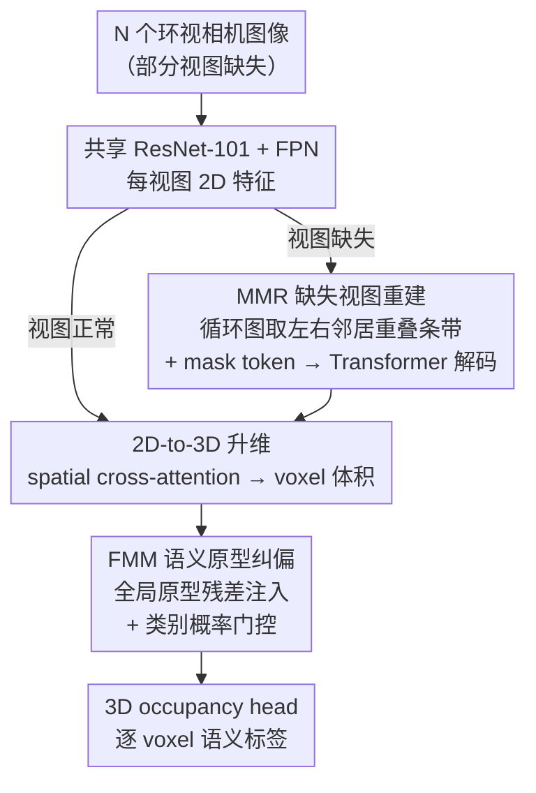

# M²-Occ: Resilient 3D Semantic Occupancy Prediction for Autonomous Driving with Incomplete Camera Inputs

**会议**: CVPR 2026  
**arXiv**: [2603.09737](https://arxiv.org/abs/2603.09737)  
**代码**: [github.com/qixi7up/M2-Occ](https://github.com/qixi7up/M2-Occ)  
**领域**: 自动驾驶 / 3D感知  
**关键词**: 语义占用预测, 传感器故障, 缺失视图重建, 语义原型, 鲁棒感知

## 一句话总结

M²-Occ 针对相机故障导致视图缺失的真实场景，提出 MMR（利用相邻相机 FoV 重叠在特征空间重建缺失视图表示）+ FMM（可学习语义原型 memory bank 精炼模糊 voxel 特征），在 SurroundOcc 基线上缺失后视摄像头 IoU +4.93%，缺失 5 个摄像头时仍维持 18.36% IoU（基线崩到 13.35%），且完整视图下性能不妥协。

## 研究背景与动机

**领域现状**：3D 语义占用预测（SOP）是自动驾驶的关键任务，用 voxel 级表示描述车辆周围的几何结构和语义信息。基于相机的方案（SurroundOcc、TPVFormer、VoxFormer）已取得不错进展，通常假设 6 个环视相机全部正常工作。

**被忽视的致命问题**：现实中相机经常出故障——镜头遮挡、硬件损坏、通信中断。即使只有一个相机失效，SurroundOcc 等模型性能就会**断崖式下降**。例如丢失后视摄像头时 IoU 从 32.38% 暴跌到 23.94%（-26%），这对安全关键系统是不可接受的。

**现有鲁棒性工作聚焦 BEV 而非 3D occupancy**：M-BEV、MetaBEV、SafeMap 等处理缺失视图的工作都针对 BEV 检测/地图构建，未涉及密集 3D 语义占用预测这一更困难的任务。

**核心思路**：模拟人类"从上下文推断未见区域 + 利用记忆补全信息"的能力：(a) MMR 利用相邻相机的 FoV 重叠区域在特征空间重建缺失视图；(b) FMM 用全局语义原型作为先验知识，精炼重建后仍模糊的 voxel 特征。

## 方法详解

### 整体框架

M²-Occ 要解决的是：当一部分环视相机故障、对应视图整块缺失时，怎么让 3D 语义占用预测不至于崩溃。它没有改动主干的占用预测流程，而是在标准 camera-only pipeline 的两个位置各插一个补救模块。整体怎么转：N 个环视相机图像（部分可能缺失）先过共享的 ResNet-101 + FPN 拿到每个视图的 2D 特征；缺失视图此时是一片空白，于是 MMR 在 2D 特征空间里把它"补"回来；补全后的多视图特征经 2D-to-3D 的 spatial cross-attention 升维成统一的 3D voxel 体积；FMM 再用一组全局语义原型对仍然模糊的 voxel 特征做一次"对照修正"；最后 3D occupancy head 输出逐 voxel 的语义标签。一句话：MMR 管几何补全，FMM 管语义纠偏。

### 关键设计

**1. MMR（Multi-view Masked Reconstruction）：在特征空间用相邻相机的重叠区域把缺失视图补回来**

缺一个相机为什么不必从零猜？因为 nuScenes 的 6 个环视相机视场本就有显著重叠——前左相机的右边缘和前相机的左边缘看的是同一片区域。MMR 正是吃这份天然冗余。它先把 6 个相机建成一个循环图，每个视图只认左右两个邻居 $\mathcal{N}(v_i) = \{v_{(i-1) \bmod N},\ v_{(i+1) \bmod N}\}$；当 $v_i$ 缺失时，从左右邻居的特征图里各裁出宽度为 $w_{ov}$ 的重叠边界条带，中间夹一个可学习的 mask token 拼成参考特征：

$$\mathbf{f}_{ref} = \text{Concat}(\mathbf{f}_{left}[:,-w_{ov}:],\ \mathbf{e}_{mask},\ \mathbf{f}_{right}[:,:w_{ov}])$$

这份 $\mathbf{f}_{ref}$ 只是粗糙的结构先验（边缘对得上、中间是空的），真正的细化交给一个 6 层、8 头的 Transformer decoder，加上可学习位置编码后解出近似完整视图的重建特征 $\hat{\mathbf{f}}_i = \mathcal{D}(\mathbf{f}_{ref} + \mathbf{p}_{pos})$。关键在于它选择在**特征空间**而不是像素空间重建——不去生成一张以假乱真的图，省掉了图像生成的高计算成本，也避免把生成噪声灌进下游。监督上只对被 mask 掉的视图算 L2 重建损失 $\mathcal{L}_{MMR} = \frac{1}{|\mathcal{M}|}\sum_{i \in \mathcal{M}} \|\hat{\mathbf{f}}_i - \mathbf{f}_i^{gt}\|_2^2$，刻意不监督正常视图，免得模型偷懒学成恒等映射。

**2. FMM（Feature Memory Module）：用全局语义原型给重建后仍模糊的 voxel 特征兜底**

MMR 能把几何结构大致补回来，但越靠近重叠区之外的中心盲区，重建特征越容易语义发虚——补出来一团东西，到底是车还是路面说不清。FMM 扮演"长期记忆"：它为每个语义类别存一份"理想长相"的原型特征，让模糊 voxel 去对照纠偏。论文比较了两种存法。Single-Proto 给每类只存一个全局质心 $\mathbf{m}_k$，靠动量滑动平均 $\mathbf{m}_k^{(t)} = (1-\lambda)\mathbf{m}_k^{(t-1)} + \lambda \cdot \bar{\mathbf{f}}_k$（$\lambda=0.1$）逐步更新，把 mini-batch 噪声平滑掉。Multi-Proto 则给每类存 $N_p$ 个子原型去捕捉类内差异（比如"卡车"里的皮卡和半挂车），查询时按 cosine 相似度加 softmax（温度 $\tau$）加权检索。直觉上 Multi-Proto 更精细，但在视图缺失这个场景里 visual evidence 本就稀疏，相似度路由反而容易被噪声带偏、把特征切得过碎——所以论文最终采用更稳的 Single-Proto。无论哪种，最后都以残差方式把原型注回 voxel 特征，并用预测类别概率 $P(k)$ 当门控：

$$\mathbf{x}' = \mathbf{x} + \sum_{k=1}^{K} P(k) \sum_{j=1}^{N_p} \alpha_{k,j} \mathbf{m}_{k,j}$$

这样模型越确信某 voxel 属于某类，就越大胆地用该类原型去稳住它，反之不强加先验。

### 一个完整示例：后视相机故障时一格 voxel 怎么被救回来

假设后视相机（Back）整块缺失。第一步，MMR 在循环图里找到它的左右邻居——后左（Back Left）和后右（Back Right）相机，各裁出 $w_{ov}$ 宽的重叠边界条带，夹上 mask token 拼成 $\mathbf{f}_{ref}$；6 层 decoder 把它解成后视视图的重建特征 $\hat{\mathbf{f}}_{back}$。第二步，重建特征连同其余 5 路真实特征一起做 2D-to-3D 变换，落到车后方那片 voxel 上——此时大尺度结构（路面、车身）已经基本成形，但某个边缘 voxel 语义仍发虚。第三步，FMM 给这个 voxel 算出类别概率，发现它大概率是 drive surface，于是把 drive surface 的全局原型按概率门控残差注入，把它"拉"向标准路面特征。最终在缺后视这一档，drive surface 的 IoU 从 27.51% 升到 35.02%，整体 IoU 从基线 23.94% 回到 28.87%。代价是高频细节在重建中被抹平，所以同一档里 pedestrian 反而从 12.50% 略降到 10.51%——大物体救回来了，小物体吃了亏。

### 损失函数 / 训练策略

训练用 **Random View Masking (RVM)**：每次随机丢掉若干视图的图像来模拟真实故障，思路类似 MAE 的 masking，但作用在整个相机视图级别而非 patch 级别，逼模型学会"缺谁补谁"。测试时则按固定模式 mask（单视图确定性故障 / 多视图随机 dropout）来量化鲁棒性。总损失就是 SurroundOcc 原始的占用预测损失再加上 MMR 的特征重建损失 $\mathcal{L}_{MMR}$，FMM 的原型靠动量更新、不额外引入显式损失项。

## 实验关键数据

### 主实验——单视图缺失

| 缺失视图 | 指标(IoU) | M²-Occ | SurroundOcc基线 | 提升 |
|---------|-----------|--------|----------------|------|
| 后视 (Back) | IoU | **28.87** | 23.94 | **+4.93** |
| 前视 (Front) | IoU | **30.40** | 25.03 | **+5.37** |
| 前左 (Front Left) | IoU | **31.25** | 30.74 | +0.51 |
| 前右 (Front Right) | IoU | **31.17** | 30.56 | +0.61 |
| 后左 (Back Left) | IoU | **31.08** | 30.35 | +0.73 |
| 后右 (Back Right) | IoU | **31.19** | 30.62 | +0.57 |
| 标准（无缺失） | IoU | 32.38 | 32.38 | 0（不妥协） |

- 后视和前视缺失时提升最大（+4.93/+5.37），因为这两个位置与相邻相机重叠最少，原始模型损失最严重
- 完整视图下性能不下降，说明 MMR+FMM 不引入负面干扰

### 多视图缺失扩展实验

| 缺失相机数 | 指标(IoU) | M²-Occ | 基线 | 提升 |
|-----------|-----------|--------|------|------|
| 1 个 | IoU | **30.66** | 28.42 | +2.24 |
| 3 个 | IoU | **26.06** | 20.52 | **+5.54** |
| 5 个 | IoU | **18.36** | 13.35 | **+5.01** |

- 随着缺失相机数增加，鲁棒性优势不断扩大
- 5 个相机缺失（仅剩 1 个）的极端情况下基线 IoU 崩溃到 13.35%，M²-Occ 仍维持 18.36%，保留了关键结构信息

### 消融实验

| 配置 | IoU | mIoU | 说明 |
|------|-----|------|------|
| 无缺失 baseline | 30.13 | 15.31 | 完整输入参考 |
| 有缺失 + 无恢复 | 26.76 | 13.21 | 缺失导致 -3.37 IoU |
| + MMR | 28.19 | 13.79 | 恢复几何结构 +1.43 |
| + MMR + Single-Proto | **28.38** | **13.55** | 最优组合 |
| + MMR + Multi-Proto | 27.76 | 12.15 | 多原型反而不稳定 |

### 关键发现

- **MMR 主要恢复大尺度几何结构**：drive surface、vehicle 等大物体 IoU 大幅提升（如缺失后视时 drive.surf. 从 27.51% 升至 35.02%），但小物体（行人、交通锥）反而可能下降，因为重建特征丢失了高频细节
- **Single-Proto 优于 Multi-Proto**：在视图缺失条件下，visual evidence 本就稀疏，Multi-Proto 的相似度路由反而放大噪声。简单稳定的单质心比精细但脆弱的多子原型更鲁棒
- **计算开销可控**：显存仅增加约 0.15 GB（2.5%），推理时延随缺失视图数线性增加（每个缺失视图需 MMR 重建一次）

## 亮点与洞察

- **问题定义精准**：首次系统研究 3D 语义占用预测在相机缺失条件下的鲁棒性，建立了完整的评估协议（单视图确定性故障 + 多视图随机 dropout），填补了一个重要的研究空白
- **特征空间而非像素空间重建**：MMR 选择在特征空间做重建，巧妙利用了相邻相机 FoV 重叠提供的自然冗余，避免了图像生成的高成本和不稳定性
- **全局语义原型作为 fallback**：FMM 的设计思路很实用——当局部重建特征质量不佳时，退回到全局统计先验（"这个区域应该长成车/路面的样子"），保证语义一致性

## 局限与展望

- **小物体性能下降**：MMR 恢复的特征丢失高频信息，行人/交通锥等小物体 IoU 反而可能下降（如缺失后视时 pedestrian 从 12.50% 降到 10.51%），这在安全关键场景是隐患
- **Multi-Proto 策略未奏效**：消融表明 Multi-Proto 不如 Single-Proto，但原因分析不够深入——可能需要更好的原型更新策略或噪声抑制机制
- **未考虑时序信息**：相邻帧可以提供额外的上下文弥补当前帧缺失，但 M²-Occ 是纯单帧方法
- **仅在 SurroundOcc 一个 baseline 上验证**：未展示在 TPVFormer、OccFormer 等其他主流 occupancy 方法上的泛化能力
- **推理延迟线性增加**：每个缺失视图需要单独运行 Transformer decoder 重建，5 个缺失视图时延迟从 0.50s 增到 1.25s（2.5x），可能不满足实时要求

## 相关工作与启发

- **vs M-BEV**：M-BEV 也用 masked view reconstruction 但针对 BEV 检测任务；M²-Occ 将其扩展到密集 3D occupancy 预测，并新增 FMM 做语义正则
- **vs MetaBEV**：MetaBEV 通过 LiDAR-Camera 跨模态融合处理传感器故障，需要 LiDAR 硬件；M²-Occ 纯相机方案，成本更低
- **vs MAE**：MAE 做 patch 级 masking 的自监督预训练；M²-Occ 的 MMR 做整个视图级别的 masking，且是有监督的（有完整视图的 GT 特征做监督）
- **启发**：FMM 的语义原型 memory bank 思路可以迁移到其他存在输入退化的感知任务（如雨天/雾天/夜间条件下的 3D 感知），作为通用的语义稳定化模块

## 评分

- 新颖性: ⭐⭐⭐⭐ 首次系统研究 occupancy prediction 的传感器缺失鲁棒性，MMR+FMM 组合合理
- 实验充分度: ⭐⭐⭐⭐ 系统的单/多视图缺失评估协议，消融完整，但仅一个 baseline
- 写作质量: ⭐⭐⭐⭐ 问题动机清晰，方法图直观，实验分析到位
- 价值: ⭐⭐⭐⭐ 解决了一个真实且被忽视的安全问题，对自动驾驶部署有实际意义

<!-- RELATED:START -->

## 相关论文

- [\[CVPR 2026\] OneOcc: Semantic Occupancy Prediction for Legged Robots with a Single Panoramic Camera](oneocc_semantic_occupancy_prediction_for_legged_robots_with_a_single_panoramic_c.md)
- [\[CVPR 2026\] Dr.Occ: Depth- and Region-Guided 3D Occupancy from Surround-View Cameras for Autonomous Driving](drocc_depth_region_guided_3d_occupancy.md)
- [\[CVPR 2026\] An Instance-Centric Panoptic Occupancy Prediction Benchmark for Autonomous Driving](an_instance-centric_panoptic_occupancy_prediction_benchmark_for_autonomous_drivi.md)
- [\[CVPR 2026\] Panoramic Multimodal Semantic Occupancy Prediction for Quadruped Robots](panoramic_multimodal_semantic_occupancy_prediction.md)
- [\[CVPR 2026\] TT-Occ: Test-Time 3D Occupancy Prediction](test-time_3d_occupancy_prediction.md)

<!-- RELATED:END -->
