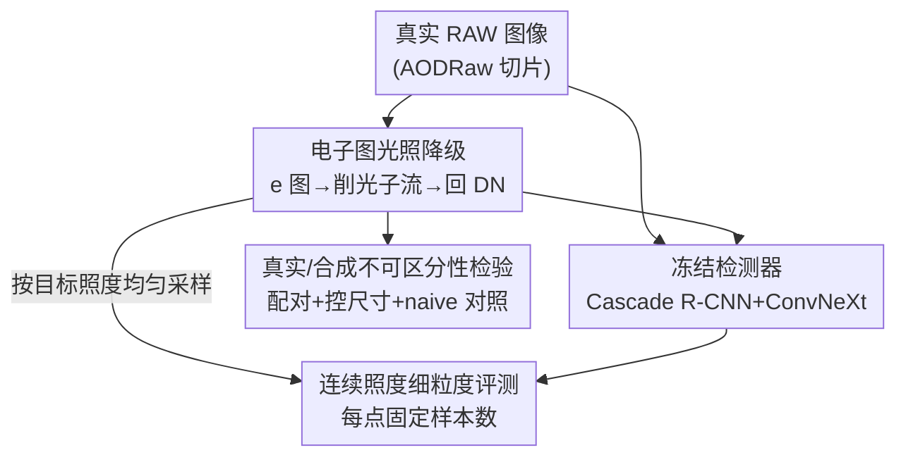

# Making the Discrete Continuous: Synthetic RAW Augmentations for Fine-Grained Evaluation of Person Detection Performance in Low Light

**会议**: CVPR 2026  
**arXiv**: [2605.22455](https://arxiv.org/abs/2605.22455)  
**代码**: 无（基于 AODRaw 官方仓库 + MMDetection）  
**领域**: 自动驾驶 / 目标检测 / 低光成像  
**关键词**: 合成 RAW 增强, 行人检测, 低光评测, 传感器噪声模型, 细粒度 benchmark

## 一句话总结
针对暗光下行人检测难以评测的问题，本文用一种物理建模的合成 RAW 光照降级增强，把真实数据里离散稀疏的光照变量"补成"连续可控的，从而细粒度刻画 SOTA 检测器随场景照度变化的真实性能，并实验证明合成暗光样本对检测器而言与真实暗光样本几乎不可区分。

## 研究背景与动机
**领域现状**：自动驾驶等安全攸关场景里，行人检测必须在暗光下也可靠。学界用 RAW 图像（未经 ISP 处理）训练/微调检测器，因为 RAW 动态范围更大、保留传感器线性与像素噪声独立性，在低光下检测效果优于 sRGB。AODRaw 就是这类 SOTA 数据集与模型的代表。

**现有痛点**：真实数据是**离散且稀疏**的——采集昂贵、受限于能拍到的真实场景，低光、低照度的样本是少数甚至直接落到分布外（OOD）。在 AODRaw 测试集里，平均包围盒内电子数低于 100 e 的行人实例不到 100 个。样本太少，导致这些关键区间根本没法做有统计意义的细粒度评测。

**核心矛盾**：照度和目标尺寸是影响检测的两大物理量，但真实数据里二者纠缠在一起（远处目标既暗又小），且低照度区间天然欠采样。于是出现一个误导性结论：在真实数据上评测，AODRaw 各项指标在整个可用照度范围内**近似恒定**，看上去"对光照极其鲁棒"——但这只是因为真正的暗样本压根没被采到。

**本文目标**：(1) 把离散稀疏的光照变量变成连续可控的，对暗光区间做细粒度性能刻画；(2) 在隔离尺寸干扰的受控环境下重做评测；(3) 验证合成暗光样本是否真能代表真实暗光样本。

**切入角度**：既然真实数据补不齐，那就**自己生产**。拥有数据生成管线就能在任意连续变量上主动选样、凑齐目标照度。关键是合成必须忠于相机传感器的噪声模型，否则评测无效。

**核心 idea**：用一套基于物理的 RAW 光照降级增强——把真实 RAW 还原成电子图、按目标照度稀疏化光子流、再数字化回 DN——生成噪声分布与真实一致的合成暗光样本，把离散的照度轴"填连续"。

## 方法详解

### 整体框架
方法本质是一条"真实 RAW → 合成暗光 RAW → 检测器评测"的受控管线。先用真实 RAW 图像反推出每个像素的电子数（physical units），按设定的目标照度等比削减光子流，再用调好的增益重新数字化回 DN，得到一张"更暗但其余特性不变、且噪声仍符合传感器模型"的合成图。然后把这些合成样本喂给冻结的 SOTA 检测器（AODRaw 微调的 Cascade R-CNN + ConvNeXt），在均匀采样的连续照度点上重做 AP/mAP 统计，并与真实暗光样本配对比较，确认两者对模型不可区分。

### 关键设计

**1. 噪声感知的电子图光照降级增强：把"变暗"做在物理量上而非像素值上**

真实 RAW 的噪声是**信号相关**的（不像 sRGB 假设的高斯白噪声），由 Poisson 散粒噪声（光子到达随机性）+ 高斯读出噪声组成，可用异方差高斯近似。如果像很多简单增强那样直接在像素值上等比压暗，噪声统计会被破坏，合成样本对模型就"假"。本文转而走物理路径：通过简单数字化关系把 DN 值数组 $y$ 还原到物理单位的电子数 $x$，

$$y = g\,x + b + \epsilon$$

其中增益 $g$（DN/e）、黑电平 $b$（DN）、平均读出噪声 $\epsilon$（DN）都可由实验或厂商给出，并受图像元数据里的 ISO 控制（DNG 文件位深 $d=14$，DN 取值 $0$ 到 $2^d-1$）。拿到电子图后，按目标照度**稀疏化光子流**（沿用 Cui 等人的强度削减算法），再转回 DN，必要时调整增益以保留 DN 量级。这样得到的暗图，噪声分布天然贴合传感器真实噪声模型——这正是它比朴素压暗更可信的原因

**2. 连续照度细粒度评测：用合成样本把离散的照度轴填密**

真实数据评测的硬伤是离散：作者把全照度范围切成 10 个区间、每个区间约含 500 个真正例（TP）来分别估精度/召回，但低照度处样本太少，逼得首尾两个区间在对数尺度上被迫拉得很宽，根本做不到细粒度刻画。合成数据则可以在感兴趣的低光范围内、按对数尺度**均匀间隔**选一系列目标照度，从一组 500 个高照度样本出发，每个真实样本对每个目标照度各生成一张合成样本。这样每个照度点都有固定数量、电子均值谱很窄的样本，从而能在连续轴上密集采点、隔离尺寸干扰。正是靠这个，作者发现了真实数据掩盖的真相：检测器并非"对光照鲁棒"，当增益/ISO 未相应调整时它会在极暗下失效

**3. 真实/合成不可区分性检验：用配对实验给合成数据的有效性兜底**

物理噪声模型只是理论保证，真正要回答的是"模型能不能把合成暗图和真实暗图区分开"。作者构造配对：从正常光类别选 $N$ 个高电子均值的真实行人 $a_i$，各配一个低电子均值的真实暗光行人 $b_i$，配对时**最小化二者面积差**以剔除尺寸这个混杂因子；再对每个 $a_i$ 降级照度使其电子均值匹配 $b_i$、并调增益匹配 $b_i$ 的 ISO，得到合成行人 $c_i$（低照度但保留 $a_i$ 其余特征）。随后比较检测器在真实集 B 与合成集 C 上的性能，用 $N=500$、3 次独立运行（6 个不相交集、共 3000 点）取均值加单倍标准差误差棒。同时用一个**朴素对照** $\tilde{\texttt{C}}$（在电子图上逐像素等比压暗、不做任何噪声调整）来凸显噪声感知的必要性——结果显示噪声感知增强稳定更接近真实指标，而朴素法做不到统计意义上的不可区分

## 实验关键数据

实验基于 AODRaw 测试子集：2260 张 4024×6048 的 Sony A7M4 RAW 图像、4690 个唯一行人、9650 个切片行人实例；检测器为 AODRaw 在切片 RAW 上微调的 Cascade R-CNN（ConvNeXt backbone）；评测固定 score 阈值 0.50，IOU 阈值 0.50–0.95 步长 0.05 计算 AP/mAP。

### 主实验：真实 vs 合成的照度-性能曲线

| 评测设置 | 采样方式 | 关键发现 |
|----------|----------|----------|
| 真实数据（§4.1） | 10 区间 / 每区间约 500 TP | 全照度范围内指标近似恒定，貌似"对光照鲁棒"（受稀疏真实数据所限） |
| 合成数据（§4.2） | 对数均匀采样 / 每点 500 GT | 揭示真实失效：电子均值 < 3.5 e 时**无任何检测**，AP 归零 |
| 合成数据（§4.2） | 同上 | mAP 在 1000 e → 10 e 之间从约 30% 降到 ≤10% |

### 消融 / 分析：噪声感知 vs 朴素增强（不可区分性，§4.3）

| 配置 | 指标表现 | 说明 |
|------|----------|------|
| 噪声感知 RAW 增强（本文） | mAP / AP75 / AP60 与真实统计不可区分 | 误差棒重叠、均值相近，合成≈真实 |
| 朴素逐像素压暗（对照） | 上述指标无法达到不可区分 | 缺噪声调整，统计上可被分辨 |
| 两种方法在 AP80（高 IOU） | 误差棒均不重叠 | 或因模型可辨，或因真实暗场标注质量较差、而合成保留了正常光标注质量 |

### 关键发现
- **真实评测会撒谎**：在真实稀疏数据上"指标恒定 = 鲁棒"是采样假象；一旦用合成样本把暗光区间填密，就暴露出 3.5 e 以下完全失效、mAP 随照度对数下滑的真实行为。3.5 e 这一阈值恰好对应测试集最低照度（< 3 e 即 OOD）。
- **噪声建模是有效性的关键**：只有噪声感知增强能让 mAP/AP75/AP60 与真实统计不可区分，朴素压暗不行——说明合成 RAW 必须尊重 Poisson-Gaussian 噪声结构才"以假乱真"。
- **高 IOU 仍露破绽**：AP80 上真实/合成误差棒不重叠，作者诚实指出这可能是模型能辨别，也可能是真实暗场标注质量本身不如合成（合成继承了正常光的高质量标注）。⚠️ 此处存在解释二义性，作者未下定论。

## 亮点与洞察
- **"把离散变连续"是个朴素却有力的评测视角**：当真实数据在关键区间欠采样时，与其抱怨样本不够，不如用忠于物理的合成管线主动凑齐目标变量取值，把不可统计的稀疏轴变成可细粒度刻画的连续轴。这套思路可迁移到任何"长尾连续变量 + 评测困难"的安全攸关场景（如雨雾浓度、运动模糊程度）。
- **暴露了一个真实的评测陷阱**：检测器"看起来鲁棒"很可能只是测试集没覆盖到真正困难的区间——这对自动驾驶这类安全攸关系统是危险的盲区。合成细粒度评测提供了一个低成本的体检手段。
- **在物理量（电子）而非数值（DN）上做增强**是最巧的一步：通过 $y=gx+b+\epsilon$ 回到电子图再操作，保证削光后噪声仍符合传感器模型，这是合成样本"不可区分"的根本原因，也是它优于 sRGB 域物理增强的地方。

## 局限与展望
- **只做评测、不做训练增广**：本文用合成数据刻画性能，但没验证把这些合成暗样本用于训练能否真正提升暗光检测——这是最自然的下一步。
- **单一数据集/单一模型**：全部实验绑定 AODRaw + 一个 Cascade R-CNN/ConvNeXt，结论能否推广到别的传感器、别的检测架构未知。
- **依赖准确的传感器标定参数**：增益 $g$、黑电平 $b$、读出噪声 $\epsilon$ 需由实验或厂商提供，参数不准会直接影响合成保真度。
- **高 IOU 的二义性未解决**：AP80 上真假可分到底是模型识破还是标注质量差异，作者没给出判别实验。
- **是短文体量**：方法与实验偏概念验证，规模与系统性消融有限。

## 相关工作与启发
- **vs 图形仿真 / 生成式合成数据**：CG 仿真和生成 AI 造数据普遍不充分考虑 CMOS 传感器噪声源，realism/fidelity 存疑；本文坚持以真实 RAW 为源、严格遵循 Poisson-Gaussian 噪声模型，换来"对模型不可区分"的合成质量。
- **vs 逆 ISP（sRGB→RAW 重建）**：逆 ISP 方法（如 Unprocessing、ReRAW）从 sRGB 反推 RAW 以补 RAW 数据稀缺；本文不做跨域重建，而是直接在真实 RAW 上做光照降级增强，避免引入重建误差。
- **vs 已有 RAW / sRGB 光照增强**：以往物理光照增强多在 sRGB 域、且没有完整 Poisson-Gaussian 噪声模型；本文把 Cui 等人的强度削减算法直接用在 RAW 上作为光照级增强，并配套增益/ISO 调整保持噪声一致性。

## 评分
- 新颖性: ⭐⭐⭐⭐ 视角新颖（合成把离散照度补连续做细粒度评测）且揭示了真实评测的鲁棒性假象，但技术组件多为已有方法组合
- 实验充分度: ⭐⭐⭐ 配对设计严谨、含 naive 对照与统计误差棒，但绑定单数据集单模型、属概念验证规模
- 写作质量: ⭐⭐⭐⭐ 动机层层递进、对自身结论的二义性诚实标注，逻辑清晰
- 价值: ⭐⭐⭐⭐ 为安全攸关场景提供低成本暗光评测体检手段，思路可迁移到其他长尾连续变量

<!-- RELATED:START -->

## 相关论文

- [\[CVPR 2026\] R4Det: 4D Radar-Camera Fusion for High-Performance 3D Object Detection](r4det_4d_radar-camera_fusion_for_high-performance_3d_object_detection.md)
- [\[AAAI 2026\] Fine-Grained Representation for Lane Topology Reasoning](../../AAAI2026/autonomous_driving/fine-grained_representation_for_lane_topology_reasoning.md)
- [\[CVPR 2026\] Plant Taxonomy Meets Plant Counting: A Fine-Grained, Taxonomic Dataset for Counting Hundreds of Plant Species](plant_taxonomy_meets_plant_counting_a_fine-grained_taxonomic_dataset_for_countin.md)
- [\[CVPR 2026\] Real-World On-Vehicle Evaluation of Embedding-Based Anomaly Detection](real-world_on-vehicle_evaluation_of_embedding-based_anomaly_detection.md)
- [\[CVPR 2026\] RESBev: Making BEV Perception More Robust](resbev_making_bev_perception_more_robust.md)

<!-- RELATED:END -->
