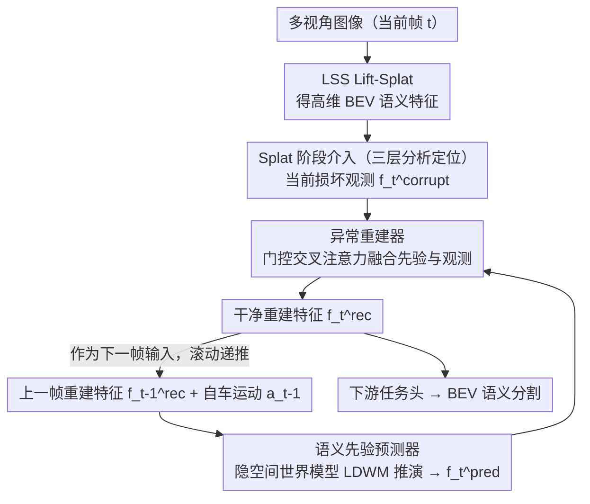

# RESBev: Making BEV Perception More Robust

**会议**: CVPR 2026  
**arXiv**: [2603.09529](https://arxiv.org/abs/2603.09529)  
**代码**: 无  
**领域**: 自动驾驶 / BEV感知鲁棒性  
**关键词**: BEV perception, 鲁棒性, 世界模型, 对抗攻击, 即插即用

## 一句话总结

提出 RESBev，一个即插即用的 BEV 感知鲁棒性增强框架，通过隐空间世界模型从历史干净帧预测当前 BEV 语义先验，再由异常重建器将先验与被损坏的当前观测通过交叉注意力融合，在 nuScenes 上为四种 LSS 模型在 10 种干扰（含自然损坏 + 对抗攻击）下平均提升 15~20 个 IoU 点，且能泛化到训练未见过的干扰类型。

## 研究背景与动机

**领域现状**：BEV 感知是自动驾驶的核心表示，LSS 系列方法（BEVFusion、BEVFormer、FIERY 等）在 nuScenes 等基准上表现出色。但这些模型在真实部署中极度脆弱——面对自然干扰（雾/暗/雪/相机崩溃/帧丢失）或对抗攻击（FGSM/PGD/C&W），IoU 可能从 33 暴跌到 9。

**现有痛点**：现有防御策略存在三大局限：(1) 多模态融合依赖昂贵的 LiDAR 传感器且假设冗余传感器可靠；(2) 简单时序聚合无法过滤对抗扰动（因为对抗特征在数值上与干净特征几乎相同）；(3) 对抗训练只能对付特定类型干扰，无法泛化；(4) 大多方法与特定架构紧耦合。

**核心矛盾**：对抗攻击在特征空间中产生的 MSE 极小但语义上灾难性——简单的注意力聚合无法区分被对抗攻击的特征和干净特征。需要一种能"绕过"当前损坏观测、从历史信息生成干净先验的机制。

**本文目标** 构建一个轻量、通用、可泛化的 BEV 鲁棒性增强方案，能插入任意 LSS 模型且同时应对自然干扰和对抗攻击。

**切入角度**：驾驶场景具有强时间一致性——当前帧的 BEV 状态可以从历史帧+自车运动合理预测。将鲁棒性问题重新构建为时序预测问题：用世界模型从历史干净帧生成当前的"期望状态"，再与实际观测选择性融合。

**核心 idea**：用隐空间世界模型预测当前帧的干净 BEV 语义先验，通过门控交叉注意力与当前损坏观测融合，实现对任意类型扰动的自适应恢复。

## 方法详解

### 整体框架

RESBev 想解决的事很具体：让任意一个 LSS 系列的 BEV 模型，在当前帧被雾、雪、帧丢失或对抗攻击破坏时仍能输出可用的 BEV 语义。它的核心判断是——驾驶场景有强时间一致性，所以"当前帧应该长什么样"完全可以从上一帧加自车运动推断出来，不必死磕已经被污染的当前观测。

整条管线插在 LSS 的 Splat 阶段（高维 BEV 语义特征处），由两个模块接力：先由**语义先验预测器**根据上一帧的干净重建特征 $f_{t-1}^{rec}$ 和自车运动 $a_{t-1}$ 预测出当前帧"本该是什么样"的先验 $f_t^{pred}$；再由**异常重建器**拿这个先验当锚，去当前损坏观测 $f_t^{corrupt}$ 里有选择地捞出真正可信的新信息，融合成最终的干净重建特征 $f_t^{rec}$。$f_t^{rec}$ 一方面喂给下游任务头出 BEV 分割，另一方面作为下一帧预测的输入，形成滚动递推。而到底在哪个环节、用什么机制介入，则由一组三层分析（空间 / 深度 / 机制）从对照实验里逼出来。

### 关键设计

**1. 三层分析定位"在哪介入、用什么机制"：把架构决策建立在消融数据上而非直觉**

最棘手的痛点是：LSS 管线那么长，到底该在哪个环节加鲁棒性模块、用预测还是用聚合？RESBev 没有拍脑袋，而是沿三个维度各跑一组对照实验来逼出答案。第一是**空间维度**——比较在图像空间（Lift 阶段）还是 BEV 空间（Splat 阶段）介入，发现持续干扰下图像特征剧烈波动、BEV 特征却相对稳定，因为 BEV 已经把多视角几何融合过一遍，时间一致性天然更高，所以选 Splat。第二是**深度维度**——在高维语义特征（Splat）上恢复，还是在低维任务输出（Shoot 阶段）上恢复？后者信息已被压缩成稀疏的分割结果，恢复后 IoU 只有 18.7，而前者保留了稠密语义，能到 31.6，于是选高维特征。第三是**机制维度**——用生成式预测（世界模型）还是时序注意力聚合？这里有个关键观察：对抗扰动在特征空间里和干净特征的 MSE 几乎为零，数值上看不出差别但语义上灾难性，所以靠注意力加权"挑出"干净特征根本行不通（聚合只拿到 20.17），而绕开当前观测、直接从历史生成先验的方式拿到 30.11。三组实验合起来，把"Splat 阶段 + 高维特征 + 生成式预测"这套组合从一堆候选里筛了出来。

**2. 语义先验预测器：在紧凑隐空间里用世界模型推演当前帧**

确定了用生成式预测后，问题变成怎么从上一帧高效地"想象"出当前帧。直接在稠密 BEV 特征空间建模状态转移既贵又难学，RESBev 的做法是先压到隐空间再推演：

$$f_t^{pred} = D\big(\text{LDWM}(\text{Concat}(E_{vis}(f_{t-1}^{rec}),\, E_{act}(a_{t-1})))\big)$$

视觉编码器 $E_{vis}$ 把上一帧的重建特征投到一个紧凑隐空间，动作编码器 $E_{act}$ 把自车的平移和旋转编码进去，两者拼接后送入一个 Transformer 世界模型（LDWM）建模"上一状态 + 这一步动作 → 当前状态"的转移，最后解码器 $D$ 再映射回稠密 BEV 特征。两个细节让它更稳：转移建模发生在低维隐空间，算得快；输入用的是上一帧已经清洗过的 $f_{t-1}^{rec}$ 而不是原始损坏特征，避免把噪声一路传下去。

**3. 异常重建器：门控交叉注意力，在"信先验"和"信观测"之间自适应权衡**

光有先验还不够——先验是从历史推出来的，处理不了突然驶入的车辆这类新事件，所以不能直接拿先验当结果。但当前观测又可能被污染，全盘吸收会引入噪声。异常重建器用一个带门控的残差融合来平衡这对矛盾：

$$f_t^{rec} = f_t^{pred} + \alpha \cdot \text{CrossAttn}\big(f_t^{pred},\, \text{Concat}(f_{t-1}^{rec},\, f_t^{corrupt})\big)$$

预测先验 $f_t^{pred}$ 作为 Query 去询问，上一帧重建特征和当前损坏观测拼起来作为 Key/Value 被检索，交叉注意力负责从中挑出与先验一致、值得信任的新信息。关键在那个可学习的门控因子 $\alpha \in [0,1]$：当前观测损坏越重，$\alpha$ 自动调小，结果几乎完全退回到历史先验；当前观测可靠时 $\alpha$ 调大，把新出现的物体融进来。先验作为残差主干保证底线，门控注意力作为可调增量补充细节，模型由此能对任意强度的扰动自适应地决定信多少。

### 损失函数 / 训练策略

训练目标从一个概率图模型推导出的 ELBO，含三项：预测先验对观测的重建似然、重建特征对任务标签的似然，以及一个 KL 正则项约束隐空间。Predictor 和 Reconstructor 联合训练；换到不同 LSS 基线时只需 few-shot 微调即可适配。实验用单卡 A100-80GB、batch size 16。

## 实验关键数据

### 主实验（训练中见过的干扰，三个严重程度的平均）

| 干扰类型 | LSS Vanilla | LSS+RESBev | 提升 | FIERY Vanilla | FIERY+RESBev | 提升 |
|---------|-------------|------------|------|--------------|-------------|------|
| FGSM | 10.28 | 28.42 | +18.14 | 11.89 | 32.46 | +20.57 |
| PGD | 9.17 | 31.47 | +22.30 | 8.03 | 32.44 | +24.41 |
| Fog | 9.93 | 28.39 | +18.46 | 12.98 | 31.79 | +18.81 |
| Frame Lost | 10.65 | 28.33 | +17.68 | 15.62 | 31.62 | +16.00 |
| **Overall Avg.** | **9.96** | **29.02** | **+19.06** | **12.08** | **31.98** | **+19.90** |

### 泛化到未见干扰

| 干扰类型 | LSS Vanilla | LSS+RESBev | GaussianLSS Vanilla | GaussianLSS+RESBev |
|---------|-------------|------------|--------------------|--------------------|
| C&W (未见) | 8.78 | 30.80 (+22.02) | 5.97 | 31.24 (+25.27) |
| Snow (未见) | 10.26 | 28.35 (+18.09) | 16.08 | 32.10 (+16.02) |
| Dark (未见) | 8.11 | 28.36 (+20.25) | 17.68 | 31.96 (+14.28) |
| Noise (未见) | 8.64 | 28.27 (+19.63) | 16.67 | 31.43 (+14.76) |
| **Overall Avg.** | **9.17** | **28.82 (+19.65)** | **13.96** | **31.66 (+17.70)** |

### 消融实验

| 配置 | LSS | SimpleBEV | GaussianLSS | FIERY |
|------|-----|-----------|-------------|-------|
| Predictor only | 26.67 | 30.11 | 29.16 | 29.79 |
| Predictor + Reconstructor | 29.00 | 32.80 | 31.59 | 31.98 |
| 提升 | +8.7% | +8.9% | +8.3% | +7.4% |

### 关键发现

- **对抗攻击恢复最强**：PGD 攻击下 FIERY 从 8.03 恢复到 32.44（+24.41），几乎完全恢复到接近 clean IoU
- **泛化性极强**：在 5 种训练未见的干扰上也获得 17~20 个 IoU 点提升，说明模型学到了通用的"正常状态应该是什么样"
- **连续损坏下稳定**：在 10 步连续损坏下 IoU 基本保持不变（FGSM: 28.42 → 28.58），无误差累积
- **Reconstructor 提升一致**：在所有 4 个基线上都带来 7~9% 的额外提升，说明从当前观测中选择性提取信息的价值
- GraphBEV baseline 在 clean 数据上最强（61.47），但在干扰下平均 IoU 仅 24，远不如 +RESBev 的各模型

## 亮点与洞察

- **将鲁棒性重构为时序预测问题**：这个视角转换非常巧妙——不是去修复当前损坏的特征，而是从历史中"预测"当前应该是什么,然后选择性地从当前观测中补充新信息。这种范式可推广到任何具有时序连续性的感知系统
- **三层分析驱动设计**：空间/深度/机制三个维度的消融为每个架构决策提供了定量依据，特别是"对抗扰动在特征空间中 MSE 极小但语义灾难"这个观察解释了为什么简单聚合不行
- **即插即用设计**：在 4 种不同的 LSS 模型上都有效，说明方案具有架构通用性。Few-shot 微调即可适配，部署成本低

## 局限与展望

- **依赖历史帧干净**：假设上一帧的重建特征是干净的。如果连续多帧都被攻击，误差可能逐帧积累（虽然实验显示 10 步内稳定，但更长序列未测试）
- **仅在 nuScenes 上评估**：没有在其他自动驾驶数据集（Waymo、KITTI）上验证
- **BEV 语义分割为唯一任务**：未验证对 3D 目标检测、运动预测等其他 BEV 下游任务的鲁棒性增强效果
- **计算开销未详细分析**：世界模型和交叉注意力的推理延迟未报告，对实时性要求高的自动驾驶场景可能是瓶颈

## 相关工作与启发

- **vs GraphBEV**: GraphBEV 通过图推理增强鲁棒性，clean 性能最强（61.47）但干扰下平均 IoU 仅 24，远不如 +RESBev 的各模型（29~32）
- **vs BEVFormer 时序聚合**: BEVFormer 通过时序 self-attention 聚合历史帧，但这种聚合无法区分干净和损坏特征；RESBev 通过生成式预测绕过当前损坏
- **vs 对抗训练**: 对抗训练只能对付训练中见过的攻击，RESBev 泛化到未见干扰类型

## 评分

- 新颖性: ⭐⭐⭐⭐ 将鲁棒性重构为时序预测问题的视角转换很有启发性
- 实验充分度: ⭐⭐⭐⭐⭐ 4个基线模型×10种干扰×3个严重程度，泛化到未见干扰，连续损坏测试
- 写作质量: ⭐⭐⭐⭐ 三层分析逻辑清晰，消融设计优秀
- 价值: ⭐⭐⭐⭐ 对自动驾驶安全部署有实际意义

<!-- RELATED:START -->

## 相关论文

- [\[CVPR 2026\] Learning Mutual View Information Graph for Adaptive Adversarial Collaborative Perception](learning_mutual_view_information_graph_for_adaptive_adversarial_collaborative_pe.md)
- [\[ECCV 2024\] H-V2X: A Large Scale Highway Dataset for BEV Perception](../../ECCV2024/autonomous_driving/h-v2x_a_large_scale_highway_dataset_for_bev_perception.md)
- [\[ECCV 2024\] Navigation Instruction Generation with BEV Perception and Large Language Models](../../ECCV2024/autonomous_driving/navigation_instruction_generation_with_bev_perception_and_large_language_models.md)
- [\[ECCV 2024\] GraphBEV: Towards Robust BEV Feature Alignment for Multi-Modal 3D Object Detection](../../ECCV2024/autonomous_driving/graphbev_towards_robust_bev_feature_alignment_for_multi-modal_3d_object_detectio.md)
- [\[CVPR 2026\] SABER: Spatially Consistent 3D Universal Adversarial Objects for BEV Detectors](saber_spatially_consistent_3d_universal_adversarial_objects_for_bev_detectors.md)

<!-- RELATED:END -->
