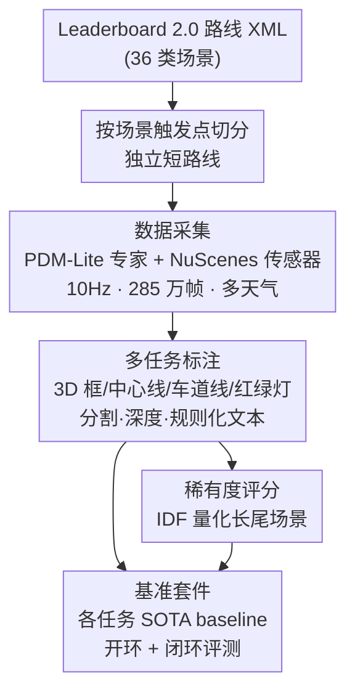

# TaCarla: A comprehensive benchmarking dataset for end-to-end autonomous driving

**会议**: CVPR 2026  
**arXiv**: [2602.23499](https://arxiv.org/abs/2602.23499)  
**代码**: https://github.com/atg93/TaCarla-Visualization (可视化代码) / 数据集托管于 HuggingFace  
**领域**: 自动驾驶 / 数据集与基准  
**关键词**: 端到端自动驾驶, CARLA Leaderboard 2.0, 闭环评测, 多任务标注, 稀有度评分

## 一句话总结
TaCarla 用 CARLA 0.9.15 + Leaderboard 2.0 的 36 类场景，以 PDM-Lite 规则专家 + NuScenes 360° 传感器配置采集了 285 万帧（文献中最大），同时支持 3D 检测 / 车道线 / 中心线 / 红绿灯 / 规划 / VLA 等多任务标注与开闭环评测，并提出一个基于 IDF 的"稀有度评分"来量化长尾场景，最后用一组 SOTA baseline 把这套基准跑通。

## 研究背景与动机

**领域现状**：端到端自动驾驶研究高度依赖数据质量，但真实数据集采集昂贵、闭环评测困难。CARLA Leaderboard 2.0 提供了一套覆盖长尾的多样化场景，成为开环+闭环联合评测的重要替代平台——即便最强方法在该挑战上的成功率也只有约 6%，说明这是一个远未饱和、且能暴露真实弱点的基准。

**现有痛点**：现有数据集"各缺一块"。带感知标注的数据集往往缺规划数据；规划数据集（如 NuPlan，1200 小时）则绝大多数是 ego 车一路直行，行为多样性极低、缺少闭环评测。在 Leaderboard 2.0 平台上的两个先驱数据集也各有硬伤：Bench2Drive 用 RL 专家采集，存在 ego 车**振荡（oscillation）**问题，且虽采了多任务数据却只报告规划结果；PDM-Lite 则是为 Transfuser 单一规划模型量身定制——只用 3 个前向相机 + 1 个 LiDAR，导致像"礼让后方应急车辆（YieldToEmergencyVehicle）"这类场景**根本没有传感器输入**能看到从后方驶来的车辆。

**核心矛盾**：专家策略的质量（决定行为多样性与是否有振荡）与传感器配置的通用性（决定能覆盖哪些任务/场景），在已有数据集里是"二选一"——Bench2Drive 行为多样但专家有振荡，PDM-Lite 专家稳健但传感器太窄。没有一个数据集能同时给到稳健专家 + 全向感知 + 多任务标注 + 闭环评测。

**本文目标**：构建一个同时服务模块化范式与端到端范式的"全栈"数据集，要求 (1) 用稳健专家消除振荡、保留行为多样性；(2) 用通用传感器配置覆盖全部场景与感知任务；(3) 为每个任务给出 SOTA baseline 形成可对比基准；(4) 量化长尾、支持 LLM/VLA 研究。

**切入角度**：把 Bench2Drive 与 PDM-Lite 的优点"缝"起来——用 PDM-Lite 的规则专家保证驾驶稳健、用 NuScenes 的 6 相机/5 雷达/1 LiDAR 配置保证 360° 覆盖与对常用感知模型的兼容。

**核心 idea**：以"稳健专家 + NuScenes 全向传感器 + 多任务标注 + 开闭环基准 + 稀有度评分"五件套，造出文献中最大（285 万帧）、最全的 CARLA 端到端自动驾驶数据集。

## 方法详解

### 整体框架
TaCarla 本质是一条"数据采集—多任务标注—长尾量化—基准跑通"的数据集构建流水线。输入是 Leaderboard 2.0 提供的训练/验证路线 XML（含 36 类场景）；采集端用 **PDM-Lite 规则专家**在 CARLA 0.9.15 中驾驶，挂载 **NuScenes 传感器套件**（6 RGB 相机 + 5 雷达 + 1 LiDAR，外加 BEV RGB、深度、实例/语义分割相机），以 10 Hz 录制 285 万帧、覆盖多种天气。原始 XML 里多个场景串在一条长路线上，作者按场景触发点把它们**切分成独立短路线**，以保证每类场景的样本可控、可统计。采集后对每帧生成多任务 ground truth（3D 框、车道分隔线、中心线、红绿灯、轨迹、分割/深度）以及**规则化文本标注**（供 VLA/LLM 用）。为应对"沿路直行被严重过采样"的类别失衡，作者用一个基于 IDF 的**稀有度评分**给每条文本标注的场景打分，识别长尾。最后在每个任务上挑选 SOTA 模型给出 baseline，并提供 NuPlan 风格的开环指标 + Leaderboard 2.0 原生的闭环指标。

### 关键设计

**1. 缝合式数据采集：稳健专家 + 全向传感器**

这一设计直击"专家质量 vs 传感器通用性二选一"的核心矛盾。专家侧选用 **PDM-Lite 规则专家**而非 Bench2Drive 的 RL 专家——规则专家驾驶确定、避免了 RL 智能体常见的轨迹振荡，从源头保证了标注轨迹的可学习性。传感器侧采用 **NuScenes 配置**（6 RGB 相机 + 5 雷达 + 1 LiDAR，安装位姿与 NuScenes 完全一致），提供 360° 覆盖，从而解决 PDM-Lite 因只有前向相机而在"后方应急车辆""相邻车道障碍变道"等场景里**无输入可看**的死角；位姿对齐 NuScenes 还让现有感知模型可以无缝迁移、两套数据可互相切换。在此之上额外采集 BEV RGB（类卫星图）、深度、实例/语义分割，覆盖端到端预训练所需的全部模态。采集规模达 285 万帧、10 Hz、多天气（表 1 给出云量/雾/降水/积水/湿度五个 0–100 参数的分布，按 very_low/low/medium/heavy 分桶），是文献中已知最大的同类数据集。

**2. 场景切分 + 多任务标注：让长尾、复杂机动可被采到也可被统计**

Leaderboard 2.0 的 XML 把多个场景串在一条长路线上，直接采集会让"直行跟车"淹没掉"变道避障"这类硬场景。作者按相邻两个场景之间的触发点**把长路线切成独立短路线**，使每类场景成为可计数、可平衡的单元。效果体现在表 2：在 Accident、ConstructionObstacle、HazardAtSideLane(TwoWays)、ParkedObstacle、ParkingCrossingPedestrian、YieldToEmergencyVehicle 等**需要变道（因此要同时观察前车与相邻车道）的复杂场景**上，TaCarla 的样本数显著多于 Bench2Drive 与 PDM-Lite（如 ParkedObstacleTwoWays：TaCarla 416 vs Bench2Drive 23 vs PDM-Lite 90）。标注侧覆盖 7 类目标（walker / car / police / ambulance / firetruck / crossbike / construction，其中 car 多达 793 万、应急车辆等稀有类只有数千），并给出中心线、车道分隔线、红绿灯（Town12/Town13 各约 23.9 万 / 18.8 万样本）等模块化范式所需的全套 GT，使同一份数据能同时训练检测、车道、规划等任务。

**3. 规则化文本标注 + IDF 稀有度评分：把"罕见"变成一个可计算的数**

为支持 LLM/VLA 研究并量化长尾，作者用一套**规则方法**从 3D 车道/物体/引导标注里抽取描述当前场景的文本（如"ego 正在跟随路线""ego 因前车减速""ego 正在超越自行车"）。在此之上提出一个把 **Inverse Document Frequency（IDF）** 改造来的**稀有度评分**：把每条文本标注 $W_t$ 看作一个文档、整个语料 $N$ 看作文档集，词越罕见、得分越高。未归一化稀有度为

$$\mathrm{Rarity}(W_t)=\frac{1}{|W_t|}\sum_{w\in W_t}\log\!\left(\frac{1+l_N}{1+\sum_{n\in N}\mathbf{1}_{\{w\in n\}}}\right)$$

其中 $l_N$ 是语料总句数，$\mathbf{1}_{\{w\in n\}}$ 是"词 $w$ 是否出现在句子 $n$"的指示函数；再做 min-max 归一化映射到 $[0,1]$：

$$\mathrm{FinalRarity}(W_t)=\frac{\mathrm{Rarity}(W_t)-\min(\mathrm{Rarity})}{\max(\mathrm{Rarity})-\min(\mathrm{Rarity})}$$

经验上它能有效区分常见与罕见事件：普通"沿路直行"场景得分约 0.0，越复杂/越异常的情形得分越高。这个分数不止是分析工具——表 8 里 PlanT\* 正是只用稀有度 > 0 的样本训练，闭环驾驶分从 52.95 提到 59.25，证明它能反过来指导采样、改善长尾学习。

### 损失函数 / 训练策略
本文是数据集/基准论文，不引入新损失。各任务沿用所选 SOTA 模型的原始训练配方：3D 检测用 RQR3D（非 Transformer、anchor-free 单阶段 + objectness 头，RegNetY-800MF + BiFPN 编码、Lift-Splat 投影到 BEV、参考 BevDet4D 做时序 warp）；车道/中心线用 TopoBDA（Bezier 可变形注意力）训 6 epoch；红绿灯用 FCOS+ResNet-50 训 12 epoch（lr 1e-3，第 8/11 epoch 衰减 0.1）；规划用 Transfuser（3 epoch）/ DiffusionDrive（6 epoch，20 anchors，2 步去噪）/ PlanT（50 epoch），lr 7.5e-5，8×A100、batch 64，训练时按驾驶分 >70 过滤、2 Hz 采样得到 4s/8 路点。

## 实验关键数据

### 主实验

**3D 目标检测（nuScenes 风格指标，mAP↑ / ATE·ASE·AOE·AVE↓）**：

| 配置 | mAP | mATE | mASE | mAOE | mAVE |
|------|-----|------|------|------|------|
| Camera-only | 0.32 | 0.43 | 0.33 | 0.37 | 0.32 |
| Camera-LiDAR | 0.55 | 0.19 | 0.31 | 0.37 | 0.22 |

加入 LiDAR 后 mAP 从 0.32 提到 0.55、平移误差 mATE 从 0.43 降到 0.19，符合"LiDAR 改善深度→定位/朝向更准"的预期；camera-only 因深度估计困难误差更大。稀有类（ambulance/firetruck）即便加 LiDAR 也只有 0.43/0.45 AP，暴露长尾难点。

**车道检测（TopoBDA，AP_f 基于 Fréchet 距离 / AP_c 基于 Chamfer 距离 / F1@1.5m）**：

| 任务 | AP_f | AP_c | F1 |
|------|------|------|----|
| 中心线检测 | 39.6 | 41.7 | 67.3 |
| 车道分隔线检测 | N/A | 32.1 | 64.3 |

车道分隔线的 AP_f 标为 N/A，因 Fréchet 距离强调方向性、对无方向的分隔线不适用。

**红绿灯检测（FCOS+ResNet-50，COCO 风格 AP）**：AP 59.5 / AP₅₀ 88.2。

**规划——开环（未见过的 Town13，1s/2s/4s 视界，ADE/FDE/AHE/FHE↓）**：

| 模型 | 4s ADE | 4s FDE | 2s ADE | 1s ADE |
|------|--------|--------|--------|--------|
| Transfuser | 2.29 | 4.97 | 0.91 | 0.40 |
| DiffusionDrive | 2.69 | 5.58 | 1.14 | 0.51 |
| PlanT | - | - | 1.03 | - |

**规划——闭环（Town13，Leaderboard 2.0 原生指标，驾驶分/路线分/惩罚↑）**：

| 模型 | Driving | Route | Penalty |
|------|---------|-------|---------|
| Transfuser | 17.18 | 65.67 | 0.283 |
| DiffusionDrive | 22.35 | 62.06 | 0.339 |
| PlanT | 52.95 | 81.67 | 0.658 |
| PlanT\*（稀有度>0 训练） | **59.25** | 81.59 | **0.705** |

### 消融实验

| 配置 | 关键指标 | 说明 |
|------|---------|------|
| 检测 camera-only | mAP 0.32 / mATE 0.43 | 仅相机，深度估计差→误差大 |
| 检测 camera-LiDAR | mAP 0.55 / mATE 0.19 | 加 LiDAR，定位/朝向显著改善 |
| PlanT（全量训练） | 闭环驾驶分 52.95 | 不做稀有度筛选 |
| PlanT\*（稀有度>0） | 闭环驾驶分 59.25 | 只用稀有场景训练，+6.3 分 |

### 关键发现
- **开环好 ≠ 闭环好**：DiffusionDrive 开环 ADE/FDE 比 Transfuser 略差，闭环驾驶分却更高（22.35 vs 17.18）；而 PlanT 开环数据残缺，闭环却最强（52.95）。说明该数据集提供闭环评测的价值——单看开环位移误差会误判模型优劣。
- **稀有度评分能直接提升闭环驾驶**：仅用稀有度 > 0 的样本训练 PlanT，闭环驾驶分 52.95→59.25、惩罚分 0.658→0.705，证明该评分不仅能分析长尾，还能当采样策略用。
- **LiDAR 对感知是刚需**：3D 检测 mAP 几乎翻倍（0.32→0.55），印证 360° + 多模态传感器配置相比 PDM-Lite 单前向相机的优势。
- **长尾类别仍是硬骨头**：ambulance/firetruck 样本仅数千，AP 远低于 car，说明即便是最大数据集，应急车辆等关键稀有类仍需专门处理。

## 亮点与洞察
- **"缝合优点"是务实且有效的数据集设计哲学**：不发明新专家、不设计新传感器，而是把 PDM-Lite 的稳健专家与 NuScenes 的全向配置组合，一举消除振荡 + 补齐死角，工程上低风险、研究上高价值。
- **把"罕见"做成一个可计算、可反哺训练的标量**：用 IDF 改造出稀有度评分，从文本标注侧量化长尾，并直接证明"按稀有度筛样本"能提升闭环驾驶分——这个 trick 可迁移到任何带文本/标签描述的失衡数据集做长尾重采样。
- **同源数据 + 开闭环双评测，揭示开环指标的误导性**：因为数据和评测同源，作者能并排展示"开环排名与闭环排名不一致"，这对端到端自动驾驶社区"只看 ADE/FDE"的惯例是一个有力提醒。
- **一份数据喂多任务**：同一采集同时支撑检测/车道/红绿灯/规划/分割/深度/VLA，降低了模块化与端到端范式之间的数据壁垒。

## 局限与展望
- **专家自身的分布偏置**：作者诚实承认 PDM 规则专家把速度限制在中等区间，导致速度分布出现"密度带"而非平滑连续；且 Leaderboard 2.0 XML 的路线结构让右转远多于左转，数据本身带有机动偏置。
- **仿真到现实的差距**：全部数据来自 CARLA 仿真，传感器噪声、外观真实性与真实路况存在 sim-to-real gap，迁移到真实车端仍需验证。
- **baseline 训练预算偏小**：多数模型只训了 3–12 epoch（如 Transfuser 3 epoch、检测/车道 6 epoch），报告的 baseline 未必反映模型在该数据集上的上限，横向比较需谨慎。
- **稀有度评分依赖规则化文本**：分数质量取决于规则抽取文本的覆盖度，规则没覆盖到的语义维度无法被稀有度感知。
- **展望**：作者提议把 Bench2Drive 与 TaCarla 合并训练——二者传感器配置相近但专家不同，混合或可互补各自专家的弱点、提升鲁棒性。

## 相关工作与启发
- **vs Bench2Drive**：同为 Leaderboard 2.0 数据集且传感器相近，但 Bench2Drive 用 RL 专家、存在轨迹振荡且只报告规划结果；TaCarla 改用 PDM-Lite 规则专家消除振荡，并把全部多任务都建成可对比基准，规模也更大（285 万 vs 200 万帧）。
- **vs PDM-Lite**：同用 PDM-Lite 专家，但 PDM-Lite 为 Transfuser 定制、只有 3 前向相机 + 1 LiDAR，在需要后向/侧向感知的场景里有死角；TaCarla 换成 NuScenes 360° 配置补齐覆盖，并扩展到多任务通用数据集（581,662 样本 → 285 万帧）。
- **vs NuPlan**：NuPlan 有 1200 小时真实规划数据但行为单一（大量直行）、缺闭环评测；TaCarla 借 Leaderboard 2.0 的 36 类场景显著提升行为多样性，并提供开环+闭环双评测。
- **启发**：把"专家选择"与"传感器配置"解耦、各取最优再缝合，是构建仿真数据集的可复用范式；IDF 式稀有度评分则给"如何量化并对抗数据集长尾"提供了一个轻量、通用的工具。

## 评分
- 新颖性: ⭐⭐⭐⭐ 不发明新模型，但"缝合稳健专家+全向传感器"+IDF 稀有度评分的组合，在数据集层面解决了真问题。
- 实验充分度: ⭐⭐⭐⭐ 覆盖检测/车道/红绿灯/规划多任务、开闭环双评测，并证明稀有度评分能反哺训练；但 baseline 训练预算偏小。
- 写作质量: ⭐⭐⭐⭐ 动机清晰、对比表（表 2/7/8）有说服力，对自身专家偏置坦诚交代。
- 价值: ⭐⭐⭐⭐⭐ 文献中最大的 CARLA 端到端数据集 + 完整基准 + 长尾量化工具，对自动驾驶社区是高复用资产。

<!-- RELATED:START -->

## 相关论文

- [\[CVPR 2026\] DriveMoE: Mixture-of-Experts for Vision-Language-Action Model in End-to-End Autonomous Driving](drivemoe_mixture-of-experts_for_vision-language-action_model_in_end-to-end_auton.md)
- [\[CVPR 2026\] Scaling-Aware Data Selection for End-to-End Autonomous Driving Systems](scaling-aware_data_selection_for_end-to-end_autonomous_driving_systems.md)
- [\[CVPR 2026\] CausalVAD: De-confounding End-to-End Autonomous Driving via Causal Intervention](causalvad_de-confounding_end-to-end_autonomous_driving_via_causal_intervention.md)
- [\[ICLR 2026\] ResWorld: Temporal Residual World Model for End-to-End Autonomous Driving](../../ICLR2026/autonomous_driving/resworld_temporal_residual_world_model_for_end-to-end_autonomous_driving.md)
- [\[AAAI 2026\] AdaptiveAD: Decoupling Scene Perception and Ego Status for End-to-End Autonomous Driving](../../AAAI2026/autonomous_driving/decoupling_scene_perception_and_ego_status_a_multi-context_fusion_approach_for_e.md)

<!-- RELATED:END -->
