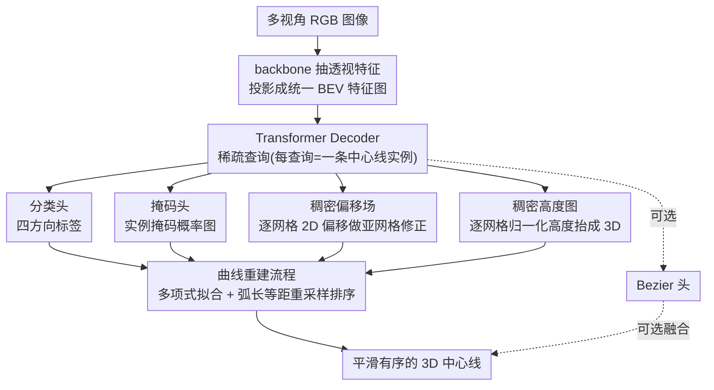

# TopoMaskV3: 3D Mask Head with Dense Offset and Height Predictions for Road Topology Understanding

**会议**: CVPR 2026  
**arXiv**: [2603.01558](https://arxiv.org/abs/2603.01558)  
**代码**: [项目页](https://artest08.github.io/TopoMaskV3.github.io/)  
**领域**: 自动驾驶  
**关键词**: 道路拓扑理解、掩码范式、偏移修正、高度预测、地理数据泄漏

## 一句话总结

本文提出 TopoMaskV3，通过引入稠密偏移场和稠密高度图两个预测头，将基于掩码的道路拓扑理解范式从 2D 弱模块升级为独立的 3D 中心线预测器，并首次在道路拓扑评估中引入地理不重叠划分和远距离基准，揭示了现有基准因地理重叠导致的性能虚高现象，在地理不重叠基准上达到 SOTA 28.5 OLS。

## 研究背景与动机

1. **领域现状**：道路拓扑理解不仅需要检测车道线等静态道路元素，更需要推断它们之间的复杂关系（如连接性、合并/分离、交通信号关联）。主流方法采用端到端 transformer 预测矢量化表示，以参数化 Bezier 曲线（TopoMLP）、路径级预测（LaneGAP）、或基于掩码的栅格化（TopoMaskV2）等形式输出。

2. **现有痛点**：TopoMaskV2 引入了基于掩码的范式——从栅格化掩码生成中心线，通过四方向标签编码流向。但它存在两个严重限制：（1）栅格化→矢量化的过程中产生离散化伪影，真实中心线很少与网格中心对齐；（2）仅支持 2D 输出，缺乏高度预测。这些限制迫使 TopoMaskV2 必须与参数化 Bezier 头融合才能获得竞争力。

3. **核心矛盾**：更深层的问题是评估公平性——现有 OpenLane-V2 基准使用时间划分（对动态目标合理），但道路是静态的，训练集和测试集地理位置重叠严重，模型可能通过"记住地图"而非真正学会泛化来获得高分。

4. **本文目标**：（1）将掩码范式升级为独立可用的 3D 预测器；（2）建立严格的道路拓扑泛化评估基准。

5. **切入角度**：在 BEV 空间中为每个网格像素预测到最近中心线点的偏移量和高度值，从根本上解决离散化误差和 2D 限制。

6. **核心 idea**：用稠密偏移场实现亚网格精度修正 + 稠密高度图实现 3D 提升，并设计地理不重叠基准来公平评估泛化。

## 方法详解

### 整体框架

TopoMaskV3 要解决的是：让基于掩码的中心线表示，不再依赖外挂的 Bezier 头，自己就能输出高精度的 3D 中心线。整条流水线从多视角 RGB 图像出发，backbone 抽出透视特征后投影成统一的 BEV 特征图，再由 transformer decoder 用稀疏查询（每个查询对应一条中心线实例）解码。关键在于解码端挂了五个并行预测头：分类头给四方向标签、掩码头给实例掩码概率图、偏移头给 2D 偏移场、高度头给高度图，外加一个可选的 Bezier 头。主路径只靠分类+掩码+偏移+高度就能拼出 3D 中心线；Bezier 头退化成可选的融合分支，需要时才和主路径做输出融合。换句话说，V2 里"掩码必须和 Bezier 融合"的依赖，在 V3 里被偏移场和高度图这两个新头拆解掉了。

### 关键设计

**1. 稠密偏移场：把中心点从网格中心解放出来**

V2 的痛点是栅格化伪影——真实中心线几乎不会正好穿过网格中心，但行/列期望提取法只能在网格中心采点，于是天然带着半个网格的系统误差。偏移场的思路是为 BEV 空间每个网格单元预测一个 2D 偏移向量 $\mathbf{o}_{ij} = \mathbf{O}(i,j,:)$，指向该网格中心到最近真实中心线点的方向，相当于给每个像素配一个"该往哪挪"的修正量。训练时用多点监督：对每个前景像素，目标偏移取 $\mathbf{o}_{ij}^{gt} = \Pi_\mathcal{C}((i,j)) - (i,j)$，其中 $\Pi_\mathcal{C}$ 是到连续中心线的最近点投影——不是只盯一个关键点，而是掩码覆盖的每个像素都给监督信号，训练信号因此更稠密。推理时有两种用法：单点提案只修正初始提取的中心点，多点提案则修正掩码区域内所有前景像素再聚合。它之所以有效，是因为亚网格精度不再需要靠提高 BEV 分辨率来换，偏移头几乎不增加计算量就突破了网格分辨率的天花板。

**2. 稠密高度图：用同一套框架把 2D 抬成 3D**

V2 的第二个硬伤是完全没有高度预测，输出只能停在 2D。高度头预测一张 $\mathbf{H} \in \mathbb{R}^{H_{BEV} \times W_{BEV}}$ 的图，每个网格对应一个归一化高度值，监督方式刻意和偏移场对齐——同样用多点最近点策略，$h_{ij}^{gt} = h_{norm}(\Pi_\mathcal{C}((i,j)))$。推理时先用偏移场把 $(x,y)$ 修正到位，再在修正后的位置采样对应高度值，直接拼成 3D 点。这里的设计巧思是"复用"：高度图和偏移场共享"稠密预测+多点监督"的同一套机制，不用为 z 轴另起炉灶，实现统一、几乎零额外设计成本，也让两个头能在同一份监督逻辑下协同训练。

**3. 曲线重建流程：把带噪的离散点收拾成平滑有序的中心线**

经过偏移和高度，得到的是一堆带噪的 3D 网格点，还不是可用的矢量中心线。重建流程先把网格坐标通过变换矩阵映射到真实世界坐标，再根据四方向标签挑多项式拟合的自变量——比如 up/down 走向的中心线用 $y=f(x)$ 拟合，避免在近垂直段出现一对多；同时拟合一张 3D 高度曲面 $z=g(x,y)$ 把高度也平滑掉；最后按弧长插值重采样成等距点并排序输出。这一步本质是用低阶多项式做一次全局平滑，把前面残留的离散化抖动抹平，换来高质量、点序规整的矢量结果。

### 一个完整示例：一条 up 走向中心线怎么落地

设 decoder 某个查询命中一条朝车头方向延伸的中心线。掩码头先给出它在 BEV 上覆盖的前景像素区域；对区域内每个像素，偏移头读出 $\mathbf{o}_{ij}$，把"卡在网格中心"的坐标朝真实中心线方向挪一小段（亚网格修正），高度头同步给出该位置的归一化高度。这样每个前景像素都变成一个修正后的 3D 候选点（多点提案聚合，比只修一个中心点更鲁棒）。接着重建流程登场：把这堆世界坐标点按四方向标签判定为 up 走向，于是用 $y=f(x)$ 拟合平面曲线、$z=g(x,y)$ 拟合高度，再沿弧长等距重采样、排序，最终输出一条平滑、点序正确、带高度的 3D 中心线。整条链路里没有出现 Bezier 头——这正是 V3 想证明的：掩码路径自己就够。

### 损失函数 / 训练策略

总损失把掩码分割损失、四方向分类交叉熵、偏移回归 L1 损失和高度回归 L1 损失加在一起。掩码概率阈值取 $\tau = 0.95$，曲线重建用 4 阶多项式。训练可选叠加 ML1M（混合 L1 匹配器）和 BDA（Bezier 可变形注意力）来增强。

## 实验关键数据

### 主实验

在地理不重叠 Near 划分上的 SOTA 对比（V1.1 指标+分数映射）：

| 方法 | DET_l | DET_l_ch | TOP_ll | OLS_l |
|------|-------|----------|--------|-------|
| TopoNet | 18.9 | 23.5 | 12.7 | 26.0 |
| TopoMLP | 15.6 | 22.4 | 14.5 | 25.3 |
| TopoLogic | 16.9 | 22.7 | 15.5 | 26.3 |
| TopoMaskV2 (Mask) | 16.4 | 20.1 | 10.9 | 23.2 |
| TopoMaskV2 (Fusion) | 18.5 | 23.8 | 11.7 | 25.5 |
| TopoBDA | 20.8 | 24.9 | 13.0 | 27.3 |
| **TopoMaskV3 (Mask)** | **19.3** | **25.6** | **13.6** | **27.3** |
| **TopoMaskV3 (Fusion)** | **20.5** | **26.2** | **15.1** | **28.5** |

### 消融实验

偏移+高度预测消融（多点提案方式）：

| 配置 | DET_l | DET_l_ch | TOP_ll | OLS_l |
|------|-------|----------|--------|-------|
| 无预测（基线） | 31.1 | 31.7 | 22.5 | 36.8 |
| 仅偏移 | 32.5 | 33.1 | 23.8 | 38.2 |
| 仅高度 | 32.6 | 37.2 | 23.4 | 39.4 |
| **偏移+高度** | **33.1** | **37.9** | **25.0** | **40.3** |

跨划分泛化性消融（相机，±50m）：

| 输出类型 | 原始(重叠) | Near | FarA | FarB | FarC |
|---------|-----------|------|------|------|------|
| Bezier | 43.4 | 27.8 | 22.2 | 20.9 | 27.8 |
| Mask | 40.8 | 26.4 | 21.2 | 20.0 | 27.1 |
| Fusion | 42.5 | 27.9 | 22.3 | 20.7 | 28.3 |

### 关键发现

- 高度预测的贡献大于偏移预测（OLS_l +2.6 vs +1.4），尤其在 DET_l_ch（空间定位）指标上
- 多点提案（修正所有前景像素）优于单点提案（仅修正初始中心点），OLS_l 40.3 vs 38.9
- **地理泄漏效应严重**：从原始划分到地理不重叠划分，所有方法性能骤降约 42%，说明标准基准严重虚高
- Bezier 头在重叠划分上表现最好，但泛化退化最严重；Mask 和 Fusion 头泛化更鲁棒
- LiDAR 融合在远距离（±100m）设置下收益最大（相对提升 40.8%），且在重叠划分上的相对增益大于不重叠划分，暗示 LiDAR 融合部分受益于地理记忆

## 亮点与洞察

- **将掩码头从"需要融合才能用"升级为"独立可用的 3D 预测器"**：TopoMaskV3 (Mask) 单独就能匹配 TopoBDA，这验证了掩码范式的潜力
- **地理数据泄漏分析是重要贡献**：首次在道路拓扑任务上系统揭示了地理重叠导致的性能虚高，对 HD 地图和拓扑社区都有警示意义
- **偏移场的多点监督策略很巧妙**：与传统关键点检测的偏移回归不同，这里每个前景像素都预测偏移，训练信号更稠密，推理时提供冗余修正
- **远距离基准（±100m）的引入很有前瞻性**：高速驾驶场景需要更远感知距离，±100m 基准更贴近实际需求

## 局限与展望

- 曲线重建流程（多项式拟合+弧长插值）不完全可微，限制了端到端优化
- 掩码范式在复杂交叉口处可能产生拓扑不一致（多条中心线掩码重叠）
- 地理不重叠划分下所有方法性能都很低（OLS_l < 30），说明道路拓扑泛化本身仍是巨大挑战
- 仅在 Argoverse2 数据上验证，缺少 NuScenes 等其他数据集的交叉验证

## 相关工作与启发

- **vs TopoMaskV2**: TopoMaskV3 解决了其两个核心限制（离散化误差+无高度预测），使掩码头从"辅助模块"变为"核心预测器"
- **vs TopoBDA**: TopoBDA 使用纯 Bezier 表示，在标准基准上领先但在不重叠基准上被 TopoMaskV3 超越，说明 Bezier 更容易过拟合地理信息
- **vs StreamMapNet/MapTR**: 这些 HD 地图工作提出了地理划分概念，TopoMaskV3 首次将其适配到更复杂的拓扑任务

## 评分

- 新颖性: ⭐⭐⭐⭐ 偏移+高度设计虽直觉，但多点监督和地理基准分析有深度
- 实验充分度: ⭐⭐⭐⭐⭐ 多划分/多传感器/多距离的系统分析，消融极其详尽
- 写作质量: ⭐⭐⭐⭐ 结构清晰，benchmark 分析透彻
- 价值: ⭐⭐⭐⭐ 掩码范式升级+公平基准贡献双重价值

<!-- RELATED:START -->

## 相关论文

- [\[ECCV 2024\] 4D Contrastive Superflows are Dense 3D Representation Learners](../../ECCV2024/autonomous_driving/4d_contrastive_superflows_are_dense_3d_representation_learners.md)
- [\[ECCV 2024\] TOD³Cap: Towards 3D Dense Captioning in Outdoor Scenes](../../ECCV2024/autonomous_driving/tod3cap_towards_3d_dense_captioning_in_outdoor_scenes.md)
- [\[ICLR 2026\] Multi-Head Low-Rank Attention (MLRA)](../../ICLR2026/autonomous_driving/multi-head_low-rank_attention.md)
- [\[AAAI 2026\] Minimum-Cost Network Flow with Dual Predictions](../../AAAI2026/autonomous_driving/minimum-cost_network_flow_with_dual_predictions.md)
- [\[CVPR 2025\] T²SG: Traffic Topology Scene Graph for Topology Reasoning in Autonomous Driving](../../CVPR2025/autonomous_driving/t2sg_traffic_topology_scene_graph_for_topology_reasoning_in_autonomous_driving.md)

<!-- RELATED:END -->
