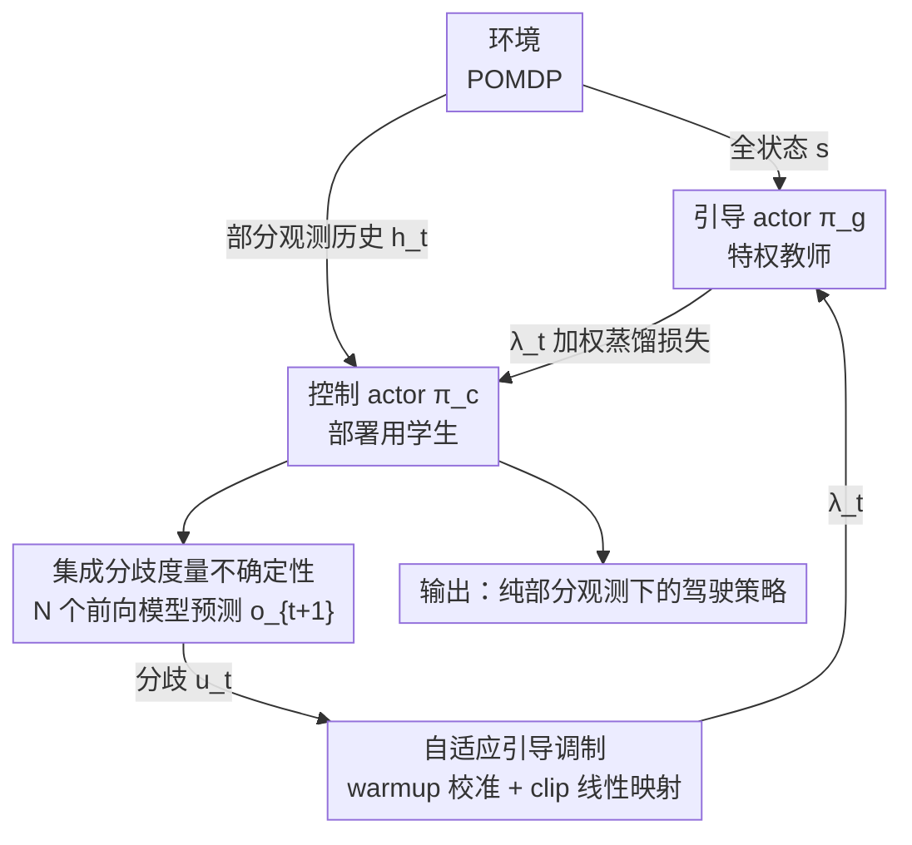

# When Does Adaptive Guidance Help? Belief-Aware Privileged Distillation for Autonomous Driving Under Partial Observability

**会议**: CVPR 2026  
**arXiv**: [2605.26155](https://arxiv.org/abs/2605.26155)  
**代码**: 无（论文称接收后释出）  
**领域**: 自动驾驶 / 强化学习 / 特权蒸馏  
**关键词**: 部分可观测、教师-学生蒸馏、集成不确定性、自适应引导、Highway-Env

## 一句话总结
本文给 Guided SAC（特权全状态教师→部分观测学生的蒸馏框架）加了一个"按认知不确定性自适应调节蒸馏系数 λ"的机制 BA-GSAC，并通过系统实验诚实地回答"自适应引导到底什么时候有用"——结论是：在轻/中度部分可观测下有效，但在重度遮挡下因"可观测性盲区"而退化成普通的 warmup 调度，甚至被一条最朴素的线性衰减曲线全面超越。

## 研究背景与动机

**领域现状**：自动驾驶本质是一个 POMDP——传感器遮挡、恶劣天气、有限视野让车辆永远拿不到真实全状态。强化学习（尤其熵正则化的 SAC）在连续控制上很强，但标准 SAC 假设全状态可观测，一旦关键状态维度被遮挡性能就大幅下降。为缓解这点，Guided SAC（GSAC）引入"教师-学生"框架：一个能看到全状态 $s$ 的**引导 actor** $\pi_g$，通过一个蒸馏网络把知识以 $\lambda$ 加权的蒸馏损失传给只能看部分观测历史 $h_t$ 的**控制 actor** $\pi_c$。

**现有痛点**：GSAC 全程用一个**固定的蒸馏系数 $\lambda$**。这带来两个失败模式：(1) 在智能体已经对环境建模良好的状态里，固定引导引入了多余的偏置，反而妨碍控制 actor 形成自己的有效策略；(2) 在新颖或高度不确定的状态里，固定系数可能在最需要引导时给得不够。

**核心矛盾**：最优的引导强度应该是**依状态、依不确定性**变化的，但固定 $\lambda$ 把它锁死成一个常数。

**本文目标**：把 $\lambda$ 做成自适应——不确定时加大引导、自信时减小引导；同时严肃回答一个被很多"自适应方法"略过的问题：**自适应引导到底什么时候真的有用？**

**切入角度**：作者假设一组**前向动力学模型的集成（ensemble）**可以当作认知不确定性的代理——集成成员对状态转移意见分歧大，说明智能体处于状态空间中不熟悉的区域，就该更多依赖特权教师；意见一致则可自主行动。

**核心 idea**：用"集成分歧度"驱动蒸馏系数 $\lambda_t$ 的自适应调制（uncertainty-high → 强引导，uncertainty-low → 弱引导），并把这套方法当成一个**测试床**去系统检验自适应引导的边界。

## 方法详解

### 整体框架
BA-GSAC 在 GSAC 的双 actor 结构之上挂了一条"不确定性感知"的旁路。环境一边把**全状态 $s$** 喂给引导 actor $\pi_g$、一边把**部分观测历史 $h_t=(o_{t-K},\dots,o_t)$** 喂给控制 actor $\pi_c$；两者交替与环境交互、共享一个吃全状态的 twin Q 网络（CTDE：训练时教师和 critic 用全状态，测试时只部署 $\pi_c$、无特权访问）。原本 GSAC 用固定 $\lambda$ 的蒸馏损失把 $\pi_g$ 的动作蒸给 $\pi_c$；本文的贡献是在下方加一组**前向动力学模型集成**，用它们对下一步观测预测的**两两分歧** $u_t$ 度量认知不确定性，再把 $u_t$ 经一个 clip-线性映射转成**自适应系数 $\lambda_t$**，回灌到蒸馏损失里。

观测建模为 $o_t=O(s_t)=M_t\odot s_t+\epsilon_t$，其中 $M_t\in\{0,1\}^{|\mathcal{S}|}$ 是逐车逐步独立的随机遮挡掩码、$\epsilon_t\sim\mathcal{N}(0,\sigma^2 I)$ 是传感噪声。注意被遮挡的车辆特征在输入和预测目标里**都是 0**——这埋下了后面"可观测性盲区"的伏笔。

### 关键设计

**1. 集成分歧度量认知不确定性：用"模型们吵不吵"代替显式信念**

要让引导强度跟着不确定性走，先得有一个能在线算、又便宜的不确定性信号。本文维护 $N$ 个前向动力学模型 $\{f_{\phi_i}\}_{i=1}^N$（各是 2 层、64 隐单元的 MLP），独立用 MSE 训练去预测下一步部分观测 $\hat{o}_{t+1}^{(i)}=f_{\phi_i}(h_t,a_t)$。每个成员只靠**不同随机初始化**取得多样性（不做 bootstrap 重采样，作者引文献说随机初始化即可提供足够分歧）。认知不确定性定义为成员间的两两平均分歧：

$$u(h_t,a_t)=\frac{2}{N(N-1)}\sum_{i<j}\|\hat{o}_{t+1}^{(i)}-\hat{o}_{t+1}^{(j)}\|^2.$$

这个量在数据稀疏的状态区域高、在熟悉区域低，并且会随数据积累而下降——从而和不可约的偶然不确定性（aleatoric）区分开。一个刻意的工程选择是：输入/目标都用**未归一化的原始运动学特征**，以保留被遮挡维度的"零结构"；代价是分歧幅度可能被高量纲特征（如速度 vs 位置）主导，这是个被作者明确承认的局限。

**2. 自适应引导调制 + warmup 百分位校准：把分歧值映射成 λ_t**

有了 $u_t$，就用一个 clip 后的线性映射把它转成蒸馏系数：

$$\lambda_t=\lambda_{\min}+(\lambda_{\max}-\lambda_{\min})\cdot\sigma\!\left(\frac{u_t-u_{\text{lo}}}{u_{\text{hi}}-u_{\text{lo}}}\right),$$

其中 $\sigma(\cdot)=\mathrm{clip}(\cdot,0,1)$。难点是 $u_{\text{lo}},u_{\text{hi}}$ 这两个参考界怎么定——直接拍数会变成环境相关的调参。本文用**warmup 校准**：训练前 $W$ 步收集 $\{u_t\}$，取第 10、90 百分位作为 $u_{\text{lo}}=P_{10},\,u_{\text{hi}}=P_{90}$，这样阈值是数据驱动的、跨环境免调。warmup 期间 $\lambda_t$ 锁在 $\lambda_{\max}$（即"强引导热身"），且回放缓冲区在各引导方法间用同一交替-actor 协议种入，保证起点公平。最终控制 actor 目标为 $J_c^{\text{BA}}=\mathbb{E}[Q(s,a)-\alpha\log\pi_c(a|h_t)]-\lambda_t\|\pi_c(h_t)-D(h_t)\|^2$，其余更新（critic、教师、蒸馏网 $D$、集成、target 网）按 Algorithm 1 逐步执行。

**3. 可观测性盲区（observability blindness）诊断 + 全状态目标修复：本文真正的"洞见型贡献"**

这是全文最有价值的部分，也是它从"又一个自适应 trick"升格为"系统研究"的关键。作者发现：在重度遮挡（50% occlusion）下，$\lambda_t$ 会在约 3K 步内迅速塌缩到 $\lambda_{\min}$，自适应机制基本失效。根因不在 warmup 长度，而在**集成的预测目标空间**：因为集成预测的是**部分观测** $\hat{o}_{t+1}$，而被遮挡车辆的特征在输入和目标里都是 0，集成在这些维度上**轻松取得低误差**，于是分歧很低——它能建模"看得见的东西"，却对"缺失的东西"结构性失明。换句话说，越是遮挡严重、越该不确定的时候，集成反而越"自信"，把 $\lambda_t$ 拉到底。作者据此提出一个**架构性修复**：用引导 actor 的特权访问，把集成训练目标换成**全状态预测** $\hat{s}_{t+1}=f_{\phi_i}(h_t,a_t)$——遮挡车辆出现在目标里但不在输入里，逼集成对缺失信息产生分歧。该修复只需换训练目标、不改架构，但论文**未做实证验证**，明确标注为面向未来的设计建议（⚠️ 以原文为准）。

### 损失函数 / 训练策略
控制 actor 用 RL 目标 + 自适应蒸馏项 $J_c^{\text{BA}}$（见上）；引导 actor 用标准最大熵目标 $J_g=\mathbb{E}[Q(s,a)-\alpha\log\pi_g(a|s)]$；蒸馏网 $D$ 用监督损失拟合 $\pi_g$ 的动作；集成各成员用 MSE 独立训练。关键超参：$\lambda_t\in[0.01,0.5]$（$\lambda_{\max}=0.5$ 是 GSAC 默认值的 5 倍）、集成 $N=5$、warmup $W=800$、历史 $K=3$、Adam（lr $3\times10^{-4}$）、$\gamma=0.99$、缓冲区 50K、共训 50K 步。集成相比无集成约多 25% 计算开销。

## 实验关键数据

### 主实验
环境为 Highway-Env 的 highway-v0（连续动作，观测为 ego + 最近 4 车的运动学特征 5×5=25 维），按噪声 σ 与遮挡率构造三档部分可观测：轻度（σ=0.02, 遮挡 10%）、中度（σ=0.05, 25%）、重度（σ=0.10, 50%）。指标为最后 5 个评估检查点的平均 return。**重度全部用 3 个种子（42/123/7）评估，轻/中度部分方法单种子（指示性）**。

| 方法 | 轻度‡ | 中度‡ | 重度†（3 种子均值） |
|------|-------|-------|-------------------|
| Vanilla SAC | 136.6±6.6 | 81.9±23.6 | 75.2±12.6 |
| Fixed λ=0.01 | 138.2±8.5 | 121.7±13.9 | 96.2±28.7 |
| GSAC (λ=0.1) | 114.2±37.3 | 117.0±32.1 | **105.6±23.4** |
| BA-GSAC (本文) | **138.8±9.4** | **126.6±7.6** | 89.2±11.9 |
| Linear decay | — | — | **116.5（CV 8.9%）** |

‡单种子，±为最后 5 检查点的 std（非跨种子）；†3 种子均值±std。

重度 POMDP 的逐种子细节（最能说明问题）：

| 方法 | s42 | s123 | s7 | 均值 | CV% | Min（最差种子）|
|------|-----|------|----|------|-----|------|
| Vanilla SAC | 71.8 | 61.7 | 92.0 | 75.2 | 16.8 | 61.7 |
| Fixed λ=0.01 | 55.6 | 115.8 | 117.3 | 96.2 | 29.8 | 55.6 |
| GSAC (λ=0.1) | 131.1 | 74.7 | 110.9 | 105.6 | 22.2 | 74.7 |
| Linear decay | 117.7 | 128.5 | 103.3 | **116.5** | **8.9** | **103.3** |
| BA-GSAC | 98.8 | 72.5 | 96.3 | 89.2 | 13.3 | 72.5 |

### 消融实验（均在中度 POMDP 下）
| 配置 | 关键指标（Last-5 Avg） | 说明 |
|------|----------------------|------|
| 引导模式：None（vanilla SAC） | 81.9±23.6 | 无引导无历史 |
| 引导模式：Fixed (λ=0.1) | 117.0±32.1 | 固定系数，方差最大 |
| 引导模式：Threshold（二值门控）| 122.4±15.8 | 用 warmup 中位数当阈值硬切 |
| 引导模式：Adaptive（本文）| **126.6±7.6** | 平滑线性映射，均值最高且最稳 |
| 集成 N=1 / 3 / 5 / 7 | 112.4 / 121.8 / 126.6 / 125.1 | N=5 最优，N=7 略降并多 38% 时间 |
| 历史 K=1 / 2 / 3 / 5 | 108.7 / 118.3 / 126.6 / 121.9 | K=3 最优 |
| warmup W=800 / 2000 / 3000 / 5000（重度，种子 42）| 134.0 / 78.3 / 96.9 / 106.8 | **延长 warmup 反而更差** |

### 关键发现
- **自适应几乎只在前 ~3K 步起作用**：在所有 POMDP 级别下 $\lambda_t$ 都在约 3K 步内塌到 $\lambda_{\min}$；重度下 $\lambda_t$ 超过 $\lambda_{\min}+0.01$ 的步数仅占 ~5.6%，轻/中度更短（~3%）。所以"自适应"实质上是**早期 warmup 调度效应**，而非持续的状态自适应调制——这是作者自己点破的、很诚实的结论。
- **warmup 的价值真实但有限**：固定 λ=0.01 在重度下 CV 高达 29.8%（甚至超过 λ=0.1 的 22.2%），呈近双峰——种子 42 只有 55.6 而另两种子 ~116；说明极低的常数引导无法在不利种子里把学习"点着"，而 BA-GSAC 的强 warmup 能可靠把所有种子带过临界初期，CV 降到 13.3%。
- **最反直觉的结论**：一条**确定性线性衰减**（同样 $\lambda_{\max}=0.5\to\lambda_{\min}=0.01$、无集成）在重度下均值（116.5）、CV（8.9%）、最差种子（103.3）三项全面优于 BA-GSAC——证明稳定收益来自"调度"而非"集成"，集成的价值仅剩**诊断作用**（暴露 observability blindness），还省 ~25% 算力。
- **延长 warmup 帮倒忙**：W 从 800 加到 2000 反而掉到 78.3±52.5——控制 actor 对强引导形成依赖，等 $\lambda_t$ 塌缩时反而失稳；W=800 在依赖成形前就完成过渡。

## 亮点与洞察
- **把一个"自适应方法"诚实地当成研究问题来做**：标题就是问句"When does adaptive guidance help?"，并且用固定 λ=0.01、线性衰减两条对照基线把自己方法的功劳一层层剥开——最后承认收益主要来自调度而非集成。这种"自我证伪"式写作在工程论文里很难得，可复用的是这套"用更简单基线逐步归因"的实验方法论。
- **observability blindness 是真正可迁移的洞见**：它指出"集成不确定性在 POMDP 下的预测目标空间是一个关键设计选择"——预测部分观测会让集成对遮挡维度结构性失明。这个发现对任何"用集成做基于模型的探索/不确定性"的 POMDP 工作都有警示意义，而修复方案（改成全状态目标、借特权访问）几乎零成本。
- **尾部风险 vs 均值的取舍**：作者在安全攸关驾驶里主张同时报告 Min/CV 而非只看均值——一个均值略低但 worst-case 更高的策略可能更可取。这个评测视角值得迁移到其他安全敏感 RL 任务。

## 局限性 / 可改进方向
- **i.i.d. 逐步遮挡不是"硬 POMDP"**：作者自己承认这更接近"带噪的观测丢失"，不产生需要长时程信念跟踪的持久隐藏状态；时间相关的遮挡可能才会让自适应机制真正发挥价值，但未做。
- **核心修复未验证**：全状态集成目标只是受分析驱动的设计建议，没有实证；论文的正向结论因此偏弱。
- **评测面窄**：只在 Highway-Env 单环境、运动学特征上做；缺循环基线（GRU-SAC 等）作更公平的 POMDP 对照；轻/中度只单种子、指标只用环境默认 reward（速度+车道保持+碰撞惩罚），缺横向偏移/jerk/车头时距等细粒度安全指标；$\lambda_{\max}$ 未消融。
- **改进思路**：先把全状态集成目标真正跑出来验证能否解决 $\lambda_t$ 塌缩；再在 MetaDrive 等更真实模拟器 + 时间相关遮挡下，验证"突发不确定性事件（行人突现、盲交叉口出车）"场景下集成相比预定调度的优势——这正是作者认为 25% 算力开销唯一值得的地方。

## 相关工作与启发
- **vs GSAC（固定 λ）**：GSAC 全程固定蒸馏强度，本文让 λ 随集成分歧自适应。但本文最终诚实地说明：在 i.i.d. 遮挡下自适应相对固定的优势主要来自早期 warmup 调度，重度下甚至不如固定 GSAC 的均值（89.2 vs 105.6），只在 CV 上更稳。
- **vs 线性衰减调度**：线性衰减是本文设的"诚实基线"，结果它在重度下三项指标全胜 BA-GSAC——直接证明集成机器对性能无增益，价值仅在诊断。作者指出 warmup-then-decay 在结构上与 DAgger 式 mixing 调度神似。
- **vs SUNRISE / 基于集成的 RL**：以往集成 RL 默认全状态或学习潜变量目标，因此"原始被遮挡观测下的失败模式"被普遍忽略；本文的 observability blindness 正是填补了"预测目标空间 × 部分可观测"这一交叉点的分析空白。
- **vs DreamerV3 / RSSM 等潜变量世界模型**：它们用学习的潜状态处理部分可观测、不确定性表征更丰富；本文选集成是图简单且兼容 GSAC，但承认潜状态模型可能给出更好的不确定性。

## 评分
- 新颖性: ⭐⭐⭐ 方法层面（集成分歧调 λ）增量有限，但 observability blindness 的诊断角度有新意。
- 实验充分度: ⭐⭐⭐ 消融全面、归因严谨，但单环境 + 轻/中度单种子 + 核心修复未验证，统计强度偏弱。
- 写作质量: ⭐⭐⭐⭐⭐ 罕见的诚实与自洽，把"自适应不如线性衰减"如实写出，归因链条清晰。
- 价值: ⭐⭐⭐⭐ 给"不确定性感知的教师-学生框架"设计提供了实打实的负面教训和可执行建议。

<!-- RELATED:START -->

## 相关论文

- [\[CVPR 2026\] Scaling-Aware Data Selection for End-to-End Autonomous Driving Systems](scaling-aware_data_selection_for_end-to-end_autonomous_driving_systems.md)
- [\[CVPR 2026\] MeanFuser: Fast One-Step Multi-Modal Trajectory Generation and Adaptive Reconstruction via MeanFlow for End-to-End Autonomous Driving](meanfuser_fast_one-step_multi-modal_trajectory_generation_and_adaptive_reconstru.md)
- [\[AAAI 2026\] Walking Further: Semantic-aware Multimodal Gait Recognition Under Long-Range Conditions](../../AAAI2026/autonomous_driving/walking_further_semantic-aware_multimodal_gait_recognition_under_long-range_cond.md)
- [\[ICLR 2026\] Adaptive Augmentation-Aware Latent Learning for Robust LiDAR Semantic Segmentation](../../ICLR2026/autonomous_driving/adaptive_augmentation-aware_latent_learning_for_robust_lidar_semantic_segmentati.md)
- [\[CVPR 2026\] Deformable Gaussian Occupancy: Decoupling Rigid and Nonrigid Motion with Factorized Distillation](deformable_gaussian_occupancy_decoupling_rigid_and_nonrigid_motion_with_factoriz.md)

<!-- RELATED:END -->
