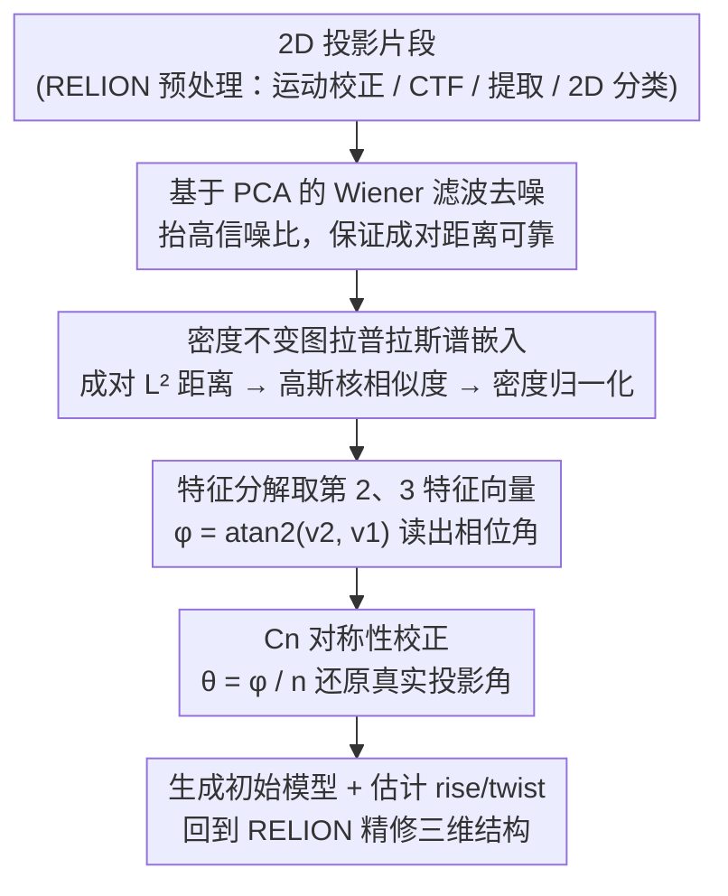

# SHREC: A Spectral Embedding-Based Approach for Ab-Initio Reconstruction of Helical Molecules

**会议**: CVPR 2026  
**arXiv**: [2603.12307](https://arxiv.org/abs/2603.12307)  
**代码**: 无  
**领域**:计算生物
**关键词**: cryo-EM, 螺旋结构重建, 谱嵌入, 图拉普拉斯, 流形学习  

## 一句话总结

提出 SHREC 算法，通过谱嵌入（spectral embedding）从冷冻电镜 2D 投影图像中直接恢复螺旋分子片段的投影角度，无需预先知道螺旋对称参数（rise/twist），实现了真正的 ab-initio 螺旋结构重建。

## 研究背景与动机

### 1. 领域现状

冷冻电镜（cryo-EM）已成为确定生物大分子三维结构的主流技术，能够达到近原子分辨率。对于螺旋状组装体（如病毒外壳、细菌分泌系统鞘等），重建流程需要确定螺旋对称参数——离散螺旋的 rise（沿轴平移量 $\Delta x$）和 twist（绕轴旋转角 $\Delta\theta$）。

### 2. 痛点

传统方法（Fourier-Bessel 方法、IHRSR 迭代方法、RELION/cryoSPARC 流程）都**依赖螺旋对称参数的初始估计**。这些参数通常通过试错法、低分辨率功率谱分析或专家经验获得。错误的对称参数会导致根本性的错误重建，即使最终分辨率看起来很高。

### 3. 核心矛盾

- Fourier-Bessel 方法的功率谱可能对应多种合法的 rise/twist 组合，存在固有歧义
- IHRSR 方法对初始值敏感，可能收敛到错误解
- 现有软件（RELION、cryoSPARC）虽改进了优化技术，但仍假设对称参数已知或可穷举搜索

### 4. 要解决什么

**消除螺旋重建对先验对称参数的依赖**——直接从 2D 投影图像数据中恢复各片段的投影角度，实现真正的 ab-initio 重建。

### 5. 切入角度

利用一个关键数学洞察：**螺旋片段的投影图像构成一个一维流形**（微分同胚于圆 $S^1$）。这个流形可以通过图拉普拉斯的谱嵌入技术恢复。

### 6. 核心 idea

基于谱嵌入框架，将高维投影图像映射到低维空间（圆上），从嵌入坐标直接提取投影角度。整个过程仅需知道标本的轴向对称群阶数 $C_n$，不需要 rise/twist 参数。

## 方法详解

### 整体框架

SHREC 想解决一件事：在不知道螺旋 rise/twist 的前提下，直接从一堆 2D 投影片段里把每张图对应的投影角度找回来，进而重建三维结构。它建立在一个几何观察上——同一根螺旋上不同位置切下来的片段，本质上只是同一个参考片段绕轴转了不同角度，于是所有片段的投影排起来就落在一个一维的圆上；把图像嵌进这个圆、读出每张图在圆上的相位角，角度问题就解决了。

整条流程串成四步：先在 RELION 里做常规预处理（运动校正、CTF 估计、片段提取、2D 分类对齐）；再用基于 PCA 的 Wiener 滤波把极低信噪比的图像去噪，否则后面的成对距离会被噪声淹没；接着进入核心的谱角度恢复——构建图拉普拉斯、特征分解、从前两个特征向量读出每张图的角度并按对称性校正；最后用恢复出的角度生成初始模型、估计螺旋参数，回到 RELION 做精修。

### 关键设计

**1. 螺旋投影的流形结构理论：把"高维图像集合"证明成"一维闭合流形"**

整个方法能成立的前提，是数据真的躺在一条低维流形上——否则图拉普拉斯的谱分解恢复不出任何有意义的几何。论文从连续螺旋的一个等价性出发：沿螺旋轴平移一段距离，等价于绕轴旋转一个角度（Lemma 1.4：$\psi(\mathbf{r} - t\hat{\mathbf{x}}) = \psi(R_x(\tfrac{2\pi}{P}t)\mathbf{r})$）。这意味着从螺旋不同位置切下的片段彼此只差一个绕轴旋转角，于是所有片段投影都等价于同一个参考片段从不同角度看过去的样子，集合在 $L^2$ 空间里构成一个参数化为 $S^1$ 的闭合一维子流形。正是这条结论把"为每张图估一个未知投影角"的高维难题，压缩成了"在一个圆上定位"的一维问题。

**2. 基于 PCA 的 Wiener 滤波去噪：在算距离之前先把信噪比抬上来**

cryo-EM 图像的信噪比极低，如果直接拿原图算成对 $L^2$ 距离，距离矩阵会被噪声主导、流形结构当场被破坏。所以谱嵌入的第一步其实是去噪：对所有投影图像做 PCA，低阶主成分主要装信号、高阶主成分主要装噪声，于是从高阶主成分估计噪声功率谱 $\hat{P}_{NN}$（径向平均以满足各向同性假设），再用 $\hat{P}_{SS} = \max(0,\,\hat{P}_{YY} - \hat{P}_{NN})$ 估出信号功率谱，最后构造 Wiener 滤波器 $G(\mathbf{f}) = \hat{P}_{SS} / (\hat{P}_{SS} + \hat{P}_{NN})$ 逐张滤波。去噪后的距离才真正反映片段间的几何差异，后面的圆形嵌入也才稳定。

**3. 密度不变图拉普拉斯谱嵌入：从成对距离把图像摊到圆上、读出相位角**

知道数据在圆上还不够，得有办法把每张图真正放到圆上的对应位置。SHREC 先算去噪后所有片段两两之间的 $L^2$ 距离，用高斯核 $W_{ij} = \exp(-d_{ij}^2 / 2\varepsilon)$ 构造相似度矩阵，再做一次密度归一化得到密度不变图拉普拉斯

$$\tilde{\mathbf{L}} = \mathbf{I} - \tilde{\mathbf{D}}^{-1}\tilde{\mathbf{W}}, \qquad \tilde{\mathbf{W}} = \mathbf{D}^{-1}\mathbf{W}\mathbf{D}^{-1}.$$

之所以要这层归一化，是因为投影角度在实际数据里分布并不均匀，普通拉普拉斯会把采样密集的地方拉变形；密度不变版本剔掉了采样密度的影响，让嵌入只反映流形本身的几何。对一维闭合流形来说，拉普拉斯-贝尔特拉米算子的特征函数恰好是 $\cos$ 和 $\sin$，所以取第 2、3 特征向量当坐标，嵌入结果天然近似一个圆，每张图的角度直接由 $\varphi_j = \text{atan2}(\tilde{\mathbf{v}}_2(j), \tilde{\mathbf{v}}_1(j))$ 读出。实验里所有数据集的二维嵌入都呈现清晰的圆形拓扑，正是这步在起作用。

**4. $C_n$ 对称性校正：把嵌入角除以 $n$ 还原真实投影角**

如果标本本身带 $C_n$ 轴向循环对称，那么投影角每转过 $2\pi/n$ 就把整条流形走了一遍，嵌入角因此被"折叠"了 $n$ 次。具体地，嵌入角 $\varphi_j$ 与真实投影角 $\theta_j$ 的关系是 $\varphi_j \approx \pm n\theta_j + \phi_0 \pmod{2\pi}$，所以只要把读出的相位角除以群阶数 $n$ 就能还原：$\theta_j = \varphi_j / n$。不做这步校正，角度会被压缩 $n$ 倍、重建直接失真——这也是为什么整套方法唯一需要的先验，就是这个 $C_n$ 阶数。

**5. 离散螺旋的理论扩展：证明真实离散螺旋只是理想流形附近的有界扰动**

前面的流形理论建立在理想连续螺旋上，而真实生物结构是离散的——每个亚基隔着一个有限 rise。论文补上一条误差界（Theorem 4.5），证明离散螺旋的投影偏离理想流形 $\mathcal{M}_{\text{ideal}}$ 的距离有上界：

$$d(\Pi(t), \mathcal{M}_{\text{ideal}}) \leq \tfrac{1}{2}\Delta x \cdot M_x(\psi) \cdot B^{3/2}.$$

偏差正比于 rise $\Delta x$ 和结构沿轴方向的梯度 $M_x(\psi)$，也就是说只要 rise 足够小、结构沿轴足够光滑，离散带来的偏离就能当成有界噪声处理，连续理论照样适用。这条界从理论上佐证了把连续螺旋方法用到实际离散结构上的合理性。

### 损失函数 / 训练策略

本文不涉及深度学习训练，核心是一个非参数的谱方法。数值上最关键的一步是对称矩阵 $\mathbf{S} = \tilde{\mathbf{D}}^{-1/2}\tilde{\mathbf{W}}\tilde{\mathbf{D}}^{-1/2}$ 的特征分解（比直接分解非对称的 $\tilde{\mathbf{D}}^{-1}\tilde{\mathbf{W}}$ 更稳定）。主要超参数有三个：最近邻数 $k$（通常取 $N/2$ 或 $N$）、核带宽 $\varepsilon$（默认取最近邻距离的第 95 百分位数）、PCA 降维维度（通常 256）。

## 实验关键数据

### 主实验

在三个公开的螺旋结构数据集上验证了完整的 SHREC 重建流程。

**表 1：三个数据集的重建分辨率对比**

| 数据集 | 分子 | 对称性 | 片段数 | SHREC 分辨率 (半图 FSC 0.143) | 与发布图对比 (FSC 0.5) | 发布图分辨率 |
|:---|:---|:---|:---|:---|:---|:---|
| EMPIAR-10022 | 烟草花叶病毒 (TMV) | 未说明 | 19,054 | **3.66 Å** | 3.9 Å | 3.35 Å |
| EMPIAR-10019 | VipA/VipB 鞘 | $C_6$ | 15,896 | **3.66 Å** | 4.0 Å | 3.5 Å |
| EMPIAR-10869 | MakA 毒素 | $C_1$ | 32,532 | **8.23 Å** | 8.0 Å | 3.65 Å |

**表 2：螺旋对称参数恢复精度**

| 数据集 | 参数 | SHREC 估计值 | 发布值 | 偏差 |
|:---|:---|:---|:---|:---|
| EMPIAR-10022 | twist $\Delta\theta$ | $-22.036°$ | $22.03°$ | $0.006°$（手性相反） |
| EMPIAR-10022 | rise $\Delta x$ | $1.412$ Å | $1.408$ Å | $0.004$ Å |
| EMPIAR-10019 | twist $\Delta\theta$ | $29.41°$ | $29.4°$ | $0.01°$ |
| EMPIAR-10019 | rise $\Delta x$ | $21.78$ Å | $21.78$ Å | $0$ Å |
| EMPIAR-10869 | twist $\Delta\theta$ | $-48.594°$ | $48.590°$ | $0.004°$（手性相反） |
| EMPIAR-10869 | rise $\Delta x$ | $5.829$ Å | $5.841$ Å | $0.012$ Å |

### 消融实验

论文没有标准消融实验，但通过三个数据集系统地展示了不同复杂度下的表现：
- **EMPIAR-10022（TMV）**：经典高质量螺旋数据，SHREC 达到接近发布水平的分辨率
- **EMPIAR-10019（VipA/VipB）**：具有 $C_6$ 对称性的更复杂结构，初始模型视觉质量较低，需要 HI3D 工具辅助估计参数，最终分辨率仍然优异
- **EMPIAR-10869（MakA）**：$C_1$ 无额外对称性的挑战性数据集，最终分辨率（8.23 Å）与发布值（3.65 Å）差距较大，表明方法在低对称性/低信噪比条件下仍有局限

### 关键发现

1. **对称参数恢复极其精确**：三个数据集的 rise/twist 估计值与发布值偏差均在 0.01° 和 0.01 Å 以内
2. **手性歧义存在但可控**：EMPIAR-10022 和 EMPIAR-10869 重建出了镜像结构（左手性 vs 右手性），这是投影操作的固有歧义（Lemma 1.1），但 twist 的绝对值正确
3. **谱嵌入的圆形结构清晰可见**：所有数据集的 2D 嵌入都展现出预期的圆形拓扑，验证了理论分析
4. **初始模型仅用少量片段即可生成**：EMPIAR-10022 用 3,023 个片段（占总数 16%）生成初始模型，再用全部 19,054 个片段精修

## 亮点与洞察

1. **理论优美且完整**：从连续螺旋的翻译-旋转等价性出发，严格证明投影流形结构，再扩展到离散螺旋并给出误差界，数学推导链条完整
2. **关键洞察极具穿透力**：螺旋体沿轴平移 = 绕轴旋转，因此所有片段投影等价于同一片段从不同角度的投影，构成 $S^1$ 流形——这将高维问题降为一维角度恢复
3. **与 RELION 生态深度集成**：SHREC 不是孤立算法，而是嵌入到 RELION 工作流中，降低了实际使用门槛
4. **仅需最少先验知识**：只需要 $C_n$ 对称群阶数和分子外半径，远少于传统方法

## 局限与展望

1. **EMPIAR-10869 分辨率差距大**（8.23 Å vs 3.65 Å）：$C_1$ 对称的低信噪比数据仍是挑战
2. **螺旋参数估计仍非全自动**：初始模型生成后，rise/twist 的估计依赖外部工具（HI3D）或手动测量（ImageJ）
3. **常速参数化假设**（Eq. 38）：假设流形参数化速度近似恒定，对于结构特征分布不均匀的分子可能失效
4. **手性歧义未解决**：仍需额外信息（如已知手性）确定正确的对映体
5. **未与深度学习方法对比**：未探索 CryoDRGN 等基于深度学习的方法在螺旋重建上的表现

## 相关工作与启发

- **Fourier-Bessel 方法**（De Rosier & Klug 1968）：利用螺旋傅里叶变换的层线结构，但对噪声和结构缺陷敏感
- **IHRSR**（Egelman 2007）：迭代实空间重建，提高了鲁棒性但依赖初始对称估计
- **RELION 螺旋流程**（He & Scheres 2017）：将单颗粒分析策略整合到螺旋重建中，但仍需对称参数
- **图拉普拉斯断层成像**（Coifman et al. 2008）：SHREC 的直接理论基础，将 1D 投影的 2D 物体的角度恢复推广到 2D 投影的 3D 螺旋体
- **启发**：谱嵌入在结构生物学中的应用潜力巨大——任何具有连续对称性的结构重建问题都可能受益于类似的流形恢复思路

## 评分

⭐⭐⭐⭐ 理论严谨且优美的工作，将谱方法应用于冷冻电镜螺旋重建并消除了对先验对称参数的依赖，在两个数据集上达到接近已发布水平的分辨率，但第三个数据集的分辨率差距和螺旋参数估计的非全自动化是明显不足。

<!-- RELATED:START -->

## 相关论文

- [\[CVPR 2026\] Hyperbolic Busemann Neural Networks](hyperbolic_busemann_neural_networks.md)
- [\[CVPR 2026\] CryoHype: Reconstructing a Thousand Cryo-EM Structures with Transformer-Based Hypernetworks](cryohype_reconstructing_a_thousand_cryo-em_structures_with_transformer-based_hyp.md)
- [\[ICCV 2025\] CryoFastAR: Fast Cryo-EM Ab initio Reconstruction Made Easy](../../ICCV2025/computational_biology/cryofastar_fast_cryoem_ab_initio_reconstruction_made_easy.md)
- [\[CVPR 2026\] Stronger Normalization-Free Transformers](stronger_normalization-free_transformers.md)
- [\[CVPR 2026\] Multimodal Protein Language Models for Enzyme Kinetic Parameters: From Substrate Recognition to Conformational Adaptation](multimodal_protein_language_models_for_enzyme_kinetic_parameters_from_substrate_.md)

<!-- RELATED:END -->
