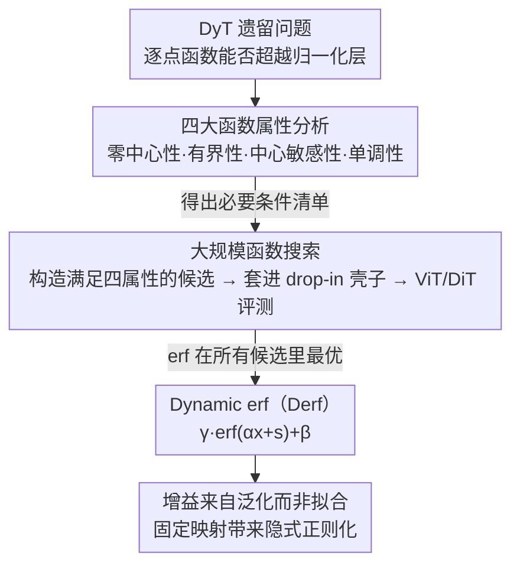

# Stronger Normalization-Free Transformers

**会议**: CVPR 2026  
**arXiv**: [2512.10938](https://arxiv.org/abs/2512.10938)  
**代码**: 有 (论文中提供链接)  
**领域**:计算生物
**关键词**: 无归一化Transformer, 逐点函数, Derf, 归一化层替代, 泛化性

## 一句话总结
通过系统分析逐点函数替代归一化层所需的四个关键属性（零中心性、有界性、中心敏感性、单调性），在大规模搜索中发现 $\text{Derf}(x) = \text{erf}(\alpha x + s)$ 是最优的归一化层替代函数，在视觉识别、图像生成、语音表示和DNA序列建模等多个领域持续超越LayerNorm和DyT，且性能增益主要来自更强的泛化而非拟合能力。

## 研究背景与动机

1. **领域现状**：归一化层（BatchNorm、LayerNorm、RMSNorm）是现代深度网络的核心组件，通过调节中间激活的分布来稳定训练和加速收敛。最近Dynamic Tanh (DyT) 证明了逐点函数 $\tanh(\alpha x)$ 可以作为归一化层的drop-in替代，达到相当的性能。

2. **现有痛点**：
    - 归一化层依赖激活统计量（均值、方差），带来额外的内存访问和同步开销。
    - 某些归一化对batch size敏感，小batch下训练不稳定。
    - DyT虽然成功匹配了归一化层性能，但未能超越它——大家接受"无归一化≈有归一化"但还没人证明"无归一化>有归一化"。

3. **核心矛盾**：DyT建立了逐点函数可以替代归一化层的基础，但设计空间中还有哪些函数可能更好？什么样的函数属性才是关键的？能否找到超越归一化层的逐点函数？

4. **本文目标**
    - 系统理解逐点函数的哪些属性影响训练动态和最终性能
    - 在候选函数集合中搜索最优设计
    - 证明逐点函数不仅能替代归一化层，还能超越它

5. **切入角度**：从函数的内在属性出发（零中心性、有界性、中心敏感性、单调性），通过控制变量实验隔离每个属性的影响，再基于这些原则指导函数搜索。

6. **核心 idea**：满足四个关键属性的S形逐点函数 $\text{erf}(\alpha x + s)$ 不仅能替代归一化层，还能通过更强的泛化能力持续超越它。

## 方法详解

### 整体框架
这篇论文想回答一个被 DyT 留下的问题：既然逐点函数 $\tanh(\alpha x)$ 能替代归一化层，那设计空间里到底有没有更好的函数，又是哪些数学属性在起决定作用。它把工作拆成"先理解、再搜索"两步——先用控制变量实验把逐点函数的关键属性逐一摸清，再在满足这些属性的候选函数里做大规模搜索，最后落到一个具体的替代方案 Derf。所有逐点函数都统一写成 $y = \gamma \cdot f(\alpha x + s) + \beta$ 这个 drop-in 形式：拿掉对激活统计量（均值、方差）的依赖，只留 $\alpha$、$s$ 两个可学习标量加上仿射的 $\gamma$、$\beta$，直接替换 pre-attention、pre-FFN 和最后那层归一化。

### 关键设计

**1. 四大函数属性分析：先搞清楚什么样的函数才配替代归一化层**

DyT 当初只凭直觉选了 $\tanh$，没人说清"为什么是它、换别的行不行"。本文在 ViT-Base 上用控制变量法，把候选函数的形状拆成四个可单独扰动的属性来逐一测。**零中心性**要求输出围绕零平衡：给函数加水平/垂直偏移 $\lambda$，$|\lambda| \le 0.5$ 时几乎无影响，$|\lambda| \ge 2$ 直接训练崩溃。**有界性**关乎优化稳定：给无界函数（如 arcsinh）加 clipping 后性能一致提升，反过来把有界函数掺进线性项使其变无界则性能下降——而且增长率有上限，logquad$(x)$ 是仍能收敛的最快增长函数，再快就发散。**中心敏感性**指原点附近的响应不能平：在原点周围引入平坦区域后，平坦区越大（$\lambda$ 越大）性能越差，$\lambda \ge 3$ 时崩溃，原因是绝大部分激活都挤在零附近，这里的斜率直接决定信号能不能往下传。**单调性**保持激活的相对大小关系：单调递增或递减都能正常训练，但 hump 形、振荡这类非单调函数性能明显掉。这四条合起来，就是一份"能替代归一化层"的必要条件清单。

**2. 大规模函数搜索：把直觉选函数换成系统筛选**

很多 S 形函数长得几乎一样，但实测性能差得明显，光靠肉眼挑不可靠。本文从一批常用标量函数和 CDF（多项式、有理、指数、对数、三角等）出发，通过平移、缩放、镜像、旋转、clipping 等变换，构造出一批同时满足上述四属性的候选，再统一套进 $y = \gamma \cdot f(\alpha x + s) + \beta$ 的壳子，在 ViT-Base（Top-1 Acc）、DiT-B/4 和 DiT-L/4（FID）上逐个评测。结果是 $\text{erf}(x)$ 在所有候选里都最好：ViT-B 拿到 82.8%（LayerNorm 是 82.3%），DiT-L/4 的 FID 降到 43.94（LayerNorm 45.91）。换句话说，"满足四属性"只是入场券，同样合格的函数之间还有可观差距，搜索才能把最优的那个挑出来。

**3. Dynamic erf（Derf）：四属性的天选函数**

搜索的赢家 $\text{erf}(x)$ 恰好天然满足全部四条——零中心、有界于 $[-1, 1]$、原点处斜率最大因而最敏感、严格单调递增，于是直接定为最终方案：

$$\text{Derf}(x) = \gamma \cdot \text{erf}(\alpha x + s) + \beta, \qquad \text{erf}(x) = \frac{2}{\sqrt{\pi}} \int_0^x e^{-t^2}\, dt$$

其中 $\alpha$ 初始化为 0.5、$s$ 初始化为 0、$\gamma$ 全 1、$\beta$ 全 0。注意 $s$ 是一个标量而非逐通道的向量——实验证明做成向量并没有额外收益，所以保持最简。相比 $\tanh$ 的指数饱和，$\text{erf}$ 作为高斯 CDF 的平滑形状在原点附近过渡更缓，可能更利于梯度传播，这也是它在数学特性上压过 DyT 的根源。

**4. 增益来自泛化而非拟合：解释 Derf 为什么反而赢**

一个反直觉的现象是，把训练好的模型切到评估模式再算训练损失，所有模型和规模上排序都稳定为 Norm < Derf < DyT——也就是说 Derf 的拟合能力其实比归一化层更弱，测试性能却更好。本文把这归因于隐式正则化：归一化层靠激活统计量做自适应、表达力强但也更容易过拟合；逐点函数是一个固定映射，全部可学习量只有 $\alpha$、$s$ 两个标量，自适应能力被刻意压住，反而限制了过拟合、换来更强的泛化。这条"参数少 → 拟合弱 → 泛化强"的因果链，正好和 dropout 一类经典正则化思路对得上，也是这篇从"能替代"跨到"能超越"的关键论据。

## 实验关键数据

### 主实验

| 模型/任务 | LayerNorm | DyT | Derf | ΔLN |
|-----------|-----------|-----|------|-----|
| ViT-B (ImageNet Acc↑) | 82.3% | 82.5% | **82.8%** | +0.5% |
| ViT-L (ImageNet Acc↑) | 83.1% | 83.6% | **83.8%** | +0.7% |
| DiT-B/4 (FID↓) | 64.93 | 63.94 | **63.23** | -1.70 |
| DiT-L/4 (FID↓) | 45.91 | 45.66 | **43.94** | -1.97 |
| DiT-XL/2 (FID↓) | 19.94 | 20.83 | **18.92** | -1.02 |
| wav2vec 2.0 Base (Loss↓) | 1.95 | 1.95 | **1.93** | -0.02 |
| wav2vec 2.0 Large (Loss↓) | 1.92 | 1.91 | **1.90** | -0.02 |
| HyenaDNA (Acc↑) | 85.2% | 85.2% | **85.7%** | +0.5% |
| Caduceus (Acc↑) | 86.9% | 86.9% | **87.3%** | +0.4% |
| GPT-2 (Loss↓) | 2.94 | 2.97 | **2.94** | 0.00 |

### 消融实验 - 函数搜索结果

| 函数 | ViT-B Acc↑ | DiT-L/4 FID↓ |
|------|-----------|-------------|
| erf(x) **[Derf]** | **82.8%** | **43.94** |
| tanh(x) [DyT] | 82.6% | 45.48 |
| satursin(x) | 82.6% | 44.83 |
| arctan(x) | 82.4% | 46.62 |
| isru(x) | 82.3% | 45.93 |
| linearclip(x) | 82.3% | 45.49 |
| LayerNorm | 82.3% | 45.91 |

### 消融实验 - 可学习偏移s的效果

| 函数 | 无s | 有s | 说明 |
|------|-----|-----|------|
| erf(x) | 82.6% | 82.8% | s贡献+0.2% |
| tanh(x) | 82.5% | 82.6% | s贡献+0.1% |
| isru(x) | 82.2% | 82.3% | s贡献+0.1% |

### 关键发现
- **Derf在所有领域一致超越LayerNorm和DyT**：ViT、DiT、wav2vec、DNA模型均取得最优，唯GPT-2与LN持平（仍优于DyT）。
- **erf比tanh好不仅因为偏移s**：去掉s后erf(82.6%)仍高于tanh带s(82.6%)，在DiT上差距更明显（63.39 vs 63.94）。
- **增益来自泛化而非拟合**：Derf训练损失高于LN但测试性能更好，说明逐点函数的简单性起到了隐式正则化作用。
- **四属性中有界性和中心敏感性影响最大**：违反有界性可能导致训练崩溃，违反中心敏感性直接导致性能断崖式下降。

## 亮点与洞察
- **从"能替代"到"能超越"的跨越**：DyT证明逐点函数≈归一化层，Derf证明逐点函数>归一化层，完成了无归一化Transformer研究的关键一步。这个结果暗示归一化层可能不是最优的激活调节方式。
- **四属性分析是可复用的设计原则**：未来设计任何逐点函数替代方案时，这四个属性提供了明确的必要条件检查清单。这种系统性分析方法本身就是贡献。
- **隐式正则化解释很有洞察力**：逐点函数固定映射（不依赖统计量）→限制自适应能力→降低过拟合→更好泛化。这个因果链条解释了为什么"更弱的拟合=更好的性能"，与dropout等经典正则化思路一脉相承。

## 局限与展望
- GPT-2上Derf仅与LN持平，在更大规模LLM（如GPT-3级别）上是否仍有优势待验证。
- 所有实验从头训练，未讨论在已有归一化层的预训练模型上如何迁移到Derf（微调还是重头训练？）。
- 函数搜索仍然是手工构造候选集+grid search，能否用可微搜索或元学习自动发现更好的函数？
- 未讨论Derf在混合精度训练（FP16/BF16）下的数值稳定性——erf函数在低精度下的计算精度如何？
- 增益幅度虽然一致但绝对值不大（如ViT-B +0.5%），是否值得工程上的切换成本需要考虑。

## 相关工作与启发
- **vs DyT (Dynamic Tanh)**：Derf在所有任务上超越DyT，主要因为erf(x)的数学特性（高斯CDF）比tanh的指数饱和更适合激活调节。ViT-B上+0.3%，DiT-L/4上FID低1.72。
- **vs LayerNorm**：Derf以更弱的拟合能力实现了更好的泛化，证明了归一化层中基于统计量的自适应可能导致轻微过拟合。
- **vs RMSNorm**：在Caduceus（默认RMSNorm）上Derf也超越了+0.4%，说明Derf的优势不限于替代LN。

## 评分
- 新颖性: ⭐⭐⭐⭐ 四属性分析系统性强，erf的选择有充分实验支持
- 实验充分度: ⭐⭐⭐⭐⭐ 跨越视觉、语音、DNA、语言四个领域，消融极其详尽
- 写作质量: ⭐⭐⭐⭐⭐ 从属性分析到函数搜索到最终方案的逻辑链非常清晰
- 价值: ⭐⭐⭐⭐ 证明逐点函数可超越归一化层是重要的研究信号，Derf本身是实用的drop-in替代

<!-- RELATED:START -->

## 相关论文

- [\[ICML 2025\] Supercharging Graph Transformers with Advective Diffusion](../../ICML2025/computational_biology/supercharging_graph_transformers_with_advective_diffusion.md)
- [\[NeurIPS 2025\] Generalizable Insights for Graph Transformers in Theory and Practice](../../NeurIPS2025/computational_biology/generalizable_insights_for_graph_transformers_in_theory_and_practice.md)
- [\[ICLR 2026\] Contact-Guided 3D Genome Structure Generation of E. coli via Diffusion Transformers](../../ICLR2026/computational_biology/contact-guided_3d_genome_structure_generation_of_e_coli_via_diffusion_transforme.md)
- [\[ICLR 2026\] ConfHit: Conformal Generative Design with Oracle Free Guarantees](../../ICLR2026/computational_biology/confhit_conformal_generative_design_with_oracle_free_guarantees.md)
- [\[ICML 2026\] CARD: Coarse-to-fine Autoregressive Modeling with Radix-based Decomposition for Transferable Free Energy Estimation](../../ICML2026/computational_biology/card_coarse-to-fine_autoregressive_modeling_with_radix-based_decomposition_for_t.md)

<!-- RELATED:END -->
