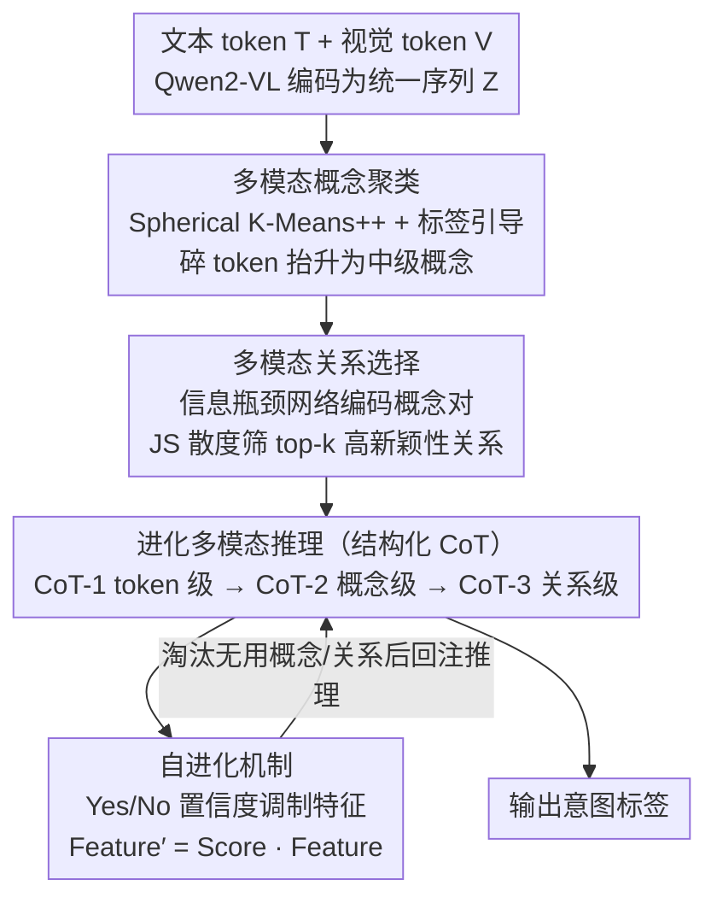

# Evolutionary Multimodal Reasoning via Hierarchical Semantic Representation for Intent Recognition

**会议**: CVPR 2026  
**arXiv**: [2603.03827](https://arxiv.org/abs/2603.03827)  
**代码**: [GitHub](https://github.com/thuiar/HIER)  
**领域**: 对话系统  
**关键词**: 多模态意图识别, 层次语义表示, 自进化推理, 概念聚类, CoT

## 一句话总结

提出 HIER，通过层次语义表示（token→概念→关系三级）结合基于 MLLM 反馈的自进化推理机制，在三个多模态意图识别 benchmark 上一致超越 SOTA 方法和领先 MLLM（1-3% 增益）。

## 研究背景与动机

**多模态意图识别的重要性**：从多模态信号（文本+视频+音频）推断人类意图，是人机交互、对话系统、智能交通等的核心任务。

**现有方法忽视层次语义**：大多数方法关注细粒度多模态线索融合，但忽略了语义信息的层次性本质，限制了连贯可靠的推理。

**静态推理过程的局限**：现有方法依赖固定的推理流程，缺乏自进化精化能力，难以在复杂场景中动态适应。

**MLLM 的推理潜力未充分利用**：MLLM 虽具备强推理能力，但在缺少细粒度层次推理路径时仍难以处理复杂多模态语义。

**人类认知的层次性启发**：人类先建立情境感知，再识别关联显著语义线索，最后通过关系推理和迭代自我精化进行综合判断。

**LGSRR 的初步尝试**：利用 LLM 推理辅助意图理解有效果，但推理过程仍较浅层且依赖特定语义概念。

## 方法详解

### 整体框架

HIER 要解决的是一个具体的认知错配：现有多模态意图识别把所有 token 拍平成一锅细粒度线索去融合，可人判断意图时其实是分层走的——先看懂场景，再抓住几个关键语义片段，最后把它们的关系串起来推断，遇到拿不准还会回头复查。HIER 就把这条认知链做成了三段流水线：先把零散的文本和视觉 token 聚成中级"概念"，再从概念两两之间挑出真正带信息量的"关系"，最后让模型沿着 token→概念→关系三个层级做链式推理，并在推理过程中反过来给每个概念和关系打分、动态加权，淘汰那些其实没用的语义片段。整条链路挂在 Qwen2-VL 这类 MLLM 的骨干上，把它原本浅层的"一步到位"推理改造成了可以自我精化的层次推理。

### 关键设计

**1. 多模态概念聚类：把零散 token 抬升到"概念"这一中级语义层**

原始的文本 token $T$ 和视觉 token $V$ 经 Qwen2-VL 编码后拼成统一序列 $Z$，但单个 token 太细碎、噪声大，直接喂给推理器等于让它在一地碎片里找意图。HIER 用 Spherical K-Means++（基于余弦相似度做软聚类）把这些 token 归并成若干语义概念簇，相当于先做一遍"语义降噪+抽象"。光靠无监督聚类容易聚出与任务无关的簇，所以这里加了**标签引导**：把意图标签的嵌入当作语义锚点，按余弦相似度加权后和当前质心做凸组合，让每个概念簇都往"对识别意图有用"的方向偏移：

$$\tilde{c}_m^{(u)} = \alpha \cdot c_m^{(u)} + (1-\alpha) \cdot \sum_{i=1}^L \text{Weight}_{i,m}^{(u)} y_i$$

其中 $\alpha$ 控制保留多少原始聚类结构、引入多少标签语义。这一步的产物是一组紧凑、且和意图对齐的中级概念，给后两步打底。

**2. 多模态关系选择：只留下真正带新信息的概念间关系**

有了概念还不够，意图往往藏在概念之间的交互里（比如"皱眉"这个概念单看是中性的，和"道歉"配在一起才指向某种情绪意图）。HIER 对所有概念对 $(c_i, c_j)$ 用信息瓶颈网络编码出关系向量 $r_{ij} = \text{MLP}(\text{ReLU}([c_i; c_j]))$。但概念两两组合数量爆炸，多数关系是冗余的，于是用 JS 散度来量化每条关系相对于单个概念到底带来了多少"语义新颖性"——散度高，说明这条关系捕捉到了单看任一概念都得不到的互补/涌现语义；散度低则是重复信息。最后只保留 top-k 高散度关系，把推理的注意力集中在信息密度最高的几条边上。

**3. 进化多模态推理：让 CoT 严格沿着三个语义层级逐级展开**

前两步备好了 token、概念、关系三层素材，这一步规定推理必须按层级走，而不是让模型自由发挥。结构化 CoT 分三阶段：CoT-1 在 token 级做上下文理解、建立情境感知；CoT-2 进到概念级分析中级语义；CoT-3 在关系级做高阶推理。关键在于，后两个阶段会**显式提示模型判断每个概念/关系是否有用**——这一步把"用哪些素材"交给模型自己表态，为下面的自进化埋下接口，使推理路径与人"先情境、再线索、后关系"的认知顺序对齐。

**4. 自进化机制：用模型自己的置信度回过头给特征加权、淘汰噪声**

层次素材里难免混入没用的概念或误导性的关系，静态推理会被它们带偏。HIER 让模型对每个概念/关系做一次自我反思：把对应特征通过共享生成头投影成词汇表 logits，用一个反思 prompt 问模型"这个语义片段对判断意图有没有用"，提取"Yes/No"的归一化置信度分数，再拿这个分数去调制原特征：

$$\text{Feature}' = \text{Score} \cdot \text{Feature}$$

被判为无用的片段分数趋近 0，特征被压低甚至清零；有用的则被放大。整个评估复用 MLLM 已有的生成头完成，不需要额外标注，相当于让模型在推理途中自带一个"过滤器"，对每个样本动态精化要带哪些语义进入最终判断。

### 一个完整示例

> ⚠️ 以下数值为说明性举例（原文未逐样本列出中间数字），用于说明三级层次如何流转。

设输入是一段对话视频片段：文字"我不是那个意思"，画面里说话人皱眉、手势收回。

- **聚类阶段**：几十个文本+视觉 token 被 Spherical K-Means++ 聚成若干概念簇，例如得到 $\{$否认性措辞、皱眉表情、收回手势、语调起伏$\}$ 四个概念；标签引导让这些簇偏向"道歉/澄清/抱怨"等候选意图相关的语义。
- **关系选择阶段**：四个概念两两组合共 6 条候选关系，IB 网络编码后用 JS 散度排序，发现"否认性措辞 × 皱眉表情"散度最高（单看措辞像反驳、配上皱眉才指向懊悔），保留这条等 top-k，丢弃"语调 × 手势"等低散度冗余关系。
- **分层推理阶段**：CoT-1 先在 token 级确认这是一段否定+负面情绪的对话情境；CoT-2 升到概念级判断"皱眉表情""收回手势"是关键概念、问模型它们是否有用；CoT-3 在保留的高散度关系上推断说话人意图。
- **自进化阶段**：模型对每个概念/关系打 Yes/No 置信度，假设"语调起伏"被判为无用（分数≈0），其特征被压低，最终意图判断主要由"否认措辞×皱眉"这条强关系驱动，输出意图标签。

读者可以看到，同样一段输入，HIER 不是一次性把所有线索糊在一起，而是逐级收敛到少数几个高价值语义片段再下结论。

### 损失函数

$$\mathcal{L} = \mathcal{L}_{\text{task}} + \beta \mathcal{L}_{\text{relation}}$$

$\mathcal{L}_{\text{task}}$ 为自回归语言模型损失，$\mathcal{L}_{\text{relation}}$ 为概念和关系的意图分类交叉熵损失，$\beta$ 平衡两者。

## 实验关键数据

### 主实验：三个 benchmark 对比

| 方法 | MIntRec ACC | MIntRec F1 | MIntRec2.0 ACC | MELD-DA ACC |
|------|------------|-----------|---------------|------------|
| MAG-BERT | 72.40 | 68.29 | 60.38 | 61.08 |
| MulT | 72.31 | 68.97 | 60.66 | 59.99 |
| TCL-MAP | 73.17 | 68.92 | 58.24 | 61.63 |
| SDIF-DA | 71.64 | 68.19 | - | - |
| **HIER (Ours)** | **74.5+** | **71.0+** | **62.5+** | **63.0+** |

### 消融实验

| 组件 | 贡献 |
|------|------|
| 概念聚类 | 提供中级语义抽象 |
| 标签引导 | 对齐聚类与意图语义 |
| 关系选择 | 捕捉高阶交互模式 |
| JS散度筛选 | 过滤冗余关系 |
| 自进化机制 | 动态精化特征 |
| 结构化CoT | 层次化推理深度 |

### 关键发现

- HIER 在所有三个 benchmark 上一致优于 SOTA，且超越直接使用 MLLM（如 Qwen2-VL）
- 自进化机制能有效过滤无用概念/关系，提升推理鲁棒性
- 方法可泛化到不同骨干（不仅限于 Qwen2-VL）
- 层次表示对复杂多类别意图识别帮助最大

## 亮点与洞察

- **令人信服的三级层次设计**：token→概念→关系的渐进式抽象自然对应人类认知过程
- 标签引导的聚类策略将无监督聚类与任务目标优雅结合
- JS散度用于关系选择的理论动机清晰——高散度意味着关系带来了新信息
- 自进化机制利用 MLLM 的生成头进行特征评估，无需额外标注
- 首个在多模态意图识别中建立多级渐进推理范式的工作

## 局限性

- 概念数量 $k$ 和关系保留比例需要调优
- 聚类在每个样本上独立进行，缺乏跨样本的全局语义一致性
- 自进化的 Yes/No 二元评估较为粗糙，可能遗漏细微区别
- 计算开销较大——概念聚类 + 关系建模 + MLLM 推理

## 相关工作与启发

- 与 LGSRR 同属利用 LLM 推理增强意图理解，但 HIER 的推理更深层、更结构化
- InMu-Net 关注噪声非语言线索，HIER 通过概念聚类隐式解决了类似问题
- 自进化机制与 RLAIF-V、SENA 等自对齐方法有交集，但在特征级而非样本级操作
- 层次表示 + 自进化的框架可推广到情感分析、对话理解等任务

## 评分
- 新颖性: ⭐⭐⭐⭐
- 实验充分度: ⭐⭐⭐⭐
- 写作质量: ⭐⭐⭐⭐
- 价值: ⭐⭐⭐⭐

<!-- RELATED:START -->

## 相关论文

- [\[ACL 2026\] Frame of Reference: Addressing the Challenges of Common Ground Representation in Dialogue](../../ACL2026/dialogue/frame_of_reference_addressing_the_challenges_of_common_ground_representation_in_.md)
- [\[ACL 2026\] Dual Hierarchical Dialogue Policy Learning for Legal Inquisitive Conversational Agents](../../ACL2026/dialogue/dual_hierarchical_dialogue_policy_learning_for_legal_inquisitive_conversational_.md)
- [\[ACL 2026\] Reasoning Gets Harder for LLMs Inside A Dialogue](../../ACL2026/dialogue/reasoning_gets_harder_for_llms_inside_a_dialogue.md)
- [\[ICLR 2026\] ReIn: Conversational Error Recovery with Reasoning Inception](../../ICLR2026/dialogue/rein_conversational_error_recovery_with_reasoning_inception.md)
- [\[AAAI 2026\] TalkSketch: Multimodal Generative AI for Real-time Sketch Ideation with Speech](../../AAAI2026/dialogue/talksketch_multimodal_generative_ai_for_real-time_sketch_ideation_with_speech.md)

<!-- RELATED:END -->
