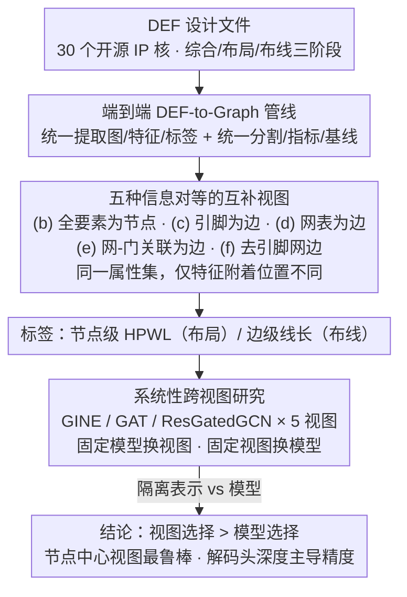

# R2G: A Multi-View Circuit Graph Benchmark Suite from RTL to GDSII

**会议**: CVPR 2026  
**arXiv**: [2604.08810](https://arxiv.org/abs/2604.08810)  
**代码**: [https://github.com/ShenShan123/R2G](https://github.com/ShenShan123/R2G)  
**领域**: 图学习  
**关键词**: circuit graph, GNN benchmark, multi-view, physical design, EDA

## 一句话总结

提出 R2G，首个标准化的多视图电路图基准套件，在 30 个 IP 核上提供 5 种阶段感知的图表示（具有信息对等性），系统研究发现图表示选择比 GNN 模型选择对性能影响更大。

## 研究背景与动机

图神经网络在物理设计任务（如拥塞预测、线长估计）中应用日益广泛，但进展被不一致的电路表示和缺乏控制变量的评估协议阻碍。现有 EDA 数据集将图表示和任务标签耦合在一起，使得无法区分模型精度来源于架构优势还是表示选择。

R2G 的核心贡献：将表示选择从模型选择中解耦，通过固定电路和任务、仅改变图视图来隔离表示效应，成为首个控制变量的电路图基准。

## 方法详解

### 整体框架

R2G 要解决的是 EDA-ML 领域一个方法学痛点：现有电路图数据集把"图表示"和"任务标签"绑死，模型精度到底来自架构强还是表示选得好，根本分不清。R2G 的破法是控制变量——固定电路和任务，只换图视图。它从标准 DEF 设计文件直接抽出五种阶段感知的图视图，每种编码相同的属性集、只是特征附着的位置不同（信息对等性），覆盖综合、布局、布线三个物理设计阶段，从而把表示效应单独隔离出来研究。

### 关键设计

**1. 五种信息对等的互补视图：把"表示"做成可单独拨动的旋钮**

要单独研究表示的影响，前提是不同视图之间除了结构别的都一样，否则比的就不是表示而是信息量。R2G 为同一批后端电路设计了五种互补视图——(b) 全要素为节点（门、引脚、网表、IO 全是节点）、(c) 引脚为边、(d) 网表为边、(e) 网-门关联为边（二部图形式）、(f) 去掉引脚节点的网边视图。五种视图编码完全相同的属性集，差别只在于这些特征附着在节点上还是边上（信息对等性）。这种信息对等性是整个控制变量实验成立的关键前提——任何性能差异都只能归因于表示结构本身，而非信息量多寡。

**2. 端到端 DEF-to-Graph 管线：让基准既统一又可复现**

电路图基准要可信，得保证大家用的是同一套提取、分割和指标。R2G 从标准 DEF 文件直接提取图结构、特征和标签，配套统一的数据分割、领域指标和可复现基线。数据上覆盖 30 个开源 IP 核，规模从 ~500 到 >10⁶ 节点/边，类别涵盖音频控制器（ss_pcm、ac97_ctrl）、加密核（des3_area、SHA256、AES）、视频控制器（vga_lcd）等，横跨综合、布局、布线三个阶段，保证结论不是只在某一类电路上成立。

**3. 系统性跨视图研究：用同一批 GNN 扫遍五种视图**

光有视图和管线还不够，得真把表示效应量出来。R2G 用 GINE、GAT、ResGatedGCN 三种代表性 GNN 在五种视图上系统跑实验，固定模型换视图、固定视图换模型，最终隔离出"表示 vs 模型"各自的贡献——这才支撑起论文"视图选择比模型选择更影响性能"的核心结论。

### 损失函数 / 训练策略

节点级布局任务（HPWL 预测）和边级布线任务（线长预测）使用标准回归损失，配统一的训练/验证/测试分割确保可复现性。

## 实验关键数据

### 关键发现

| 发现 | 数据 | 说明 |
|------|------|------|
| 视图 > 模型 | Test R² 跨视图变化 >0.3 | 固定 GNN 下视图选择主导性能 |
| 模型排名翻转 | 不同视图下最优模型不同 | 表示-模型耦合严重 |
| 节点中心视图最鲁棒 | 视图 (b) 跨阶段最优 | 在布局和布线上均表现最佳 |
| 解码头深度关键 | 3-4层 head: R²从-0.17到0.99 | 远超 GNN 深度的影响 |

### 关键洞察

- 图表示选择比 GNN 架构选择重要得多
- 解码头深度（3-4层）是精度的主要驱动因素
- 节点中心视图在布局和布线阶段均泛化最好
- 五种视图保持信息对等性（相同属性集，仅特征附着位置不同），这是控制变量实验的关键前提
- Head 深度从 1 层增加到 4 层时，布局任务 R² 从 -0.17 跳升至 0.99，布线任务从 NaN 变为收敛
- 不同视图下最优 GNN 模型不同，表示-模型耦合严重

## 亮点与洞察

- 首次将图表示作为独立变量进行控制实验
- "视图选择主导模型选择"的发现对 EDA-ML 社区有重要指导意义
- 解码头深度的惊人重要性可能改变 GNN 架构设计思路
- 信息对等性设计是严格消融的基础

## 局限与展望

- 仅 30 个 IP 核，多样性有限
- 五种视图未穷尽所有可能的电路表示
- 主要聚焦后端物理设计，前端逻辑设计未涉及
- 未探索异构图神经网络（如区分单元和网络节点类型）在多视图上的表现
- 数据集规模从 ~500 到 >10⁶ 节点/边，跨度大但每个规模段的样本数有限
- R2G 继承了 OGB 等图 ML 基准的最佳实践：统一分割、可扩展加载器、可复现基线
- 现有 EDA 数据集将图表示和任务标签耦合，R2G 通过解耦实现了首个控制变量实验

## 评分

- 新颖性：⭐⭐⭐⭐⭐ — 首个控制变量的多视图电路图基准
- 技术深度：⭐⭐⭐⭐ — 信息对等性设计严谨，确保实验的可控性
- 实验充分度：⭐⭐⭐⭐ — 系统性跨视图跨模型实验
- 实用价值：⭐⭐⭐⭐ — 为 EDA-ML 研究提供标准化工具，代码和数据集开源

<!-- RELATED:START -->

## 相关论文

- [\[ICML 2026\] View Space：跨任意图的表示学习](../../ICML2026/graph_learning/view_space_learning_representation_across_arbitrary_graphs.md)
- [\[AAAI 2026\] Skill Path: Unveiling Language Skills from Circuit Graphs](../../AAAI2026/graph_learning/skill_path_unveiling_language_skills_from_circuit_graphs.md)
- [\[CVPR 2026\] M3KG-RAG: Multi-hop Multimodal Knowledge Graph-enhanced Retrieval-Augmented Generation](m3kg_rag_multi_hop_multimodal_knowledge_graph_enhanced_retrieval_augmented_genera.md)
- [\[NeurIPS 2025\] FALCON: An ML Framework for Fully Automated Layout-Constrained Analog Circuit Design](../../NeurIPS2025/graph_learning/falcon_an_ml_framework_for_fully_automated_layout-constrained_analog_circuit_des.md)
- [\[AAAI 2026\] S-DAG: A Subject-Based Directed Acyclic Graph for Multi-Agent Heterogeneous Reasoning](../../AAAI2026/graph_learning/s-dag_a_subject-based_directed_acyclic_graph_for_multi-agent.md)

<!-- RELATED:END -->
