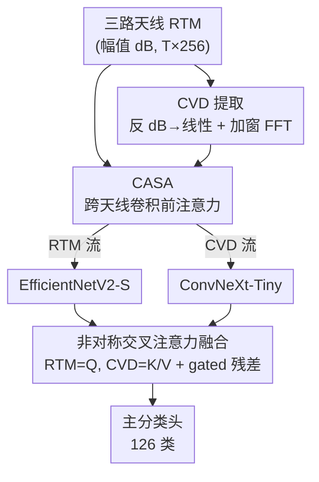

# CAST: Channel-Aware Spatial Transfer Learning with Pseudo-Image Radar for Sign Language Recognition

**会议**: CVPR 2026 (MSLR Workshop, Track 2)  
**arXiv**: [2605.08663](https://arxiv.org/abs/2605.08663)  
**代码**: https://github.com/Shakhoyat/CAST-at-SignEval2026 (有)  
**领域**: 人体理解 / 手语识别 / 毫米波雷达感知  
**关键词**: 60 GHz 雷达, Range-Time Map, 节奏速度图, 跨天线注意力, 双流融合

## 一句话总结
针对只有幅值（无相位）的 60 GHz 雷达 Range-Time Map（RTM）做隐私友好的孤立手语识别，CAST 用三个「物理感知」模块——先反 dB 压缩再做 FFT 提取节奏速度图（CVD）、对 L 形天线阵做卷积前注意力、再用 RTM 当 query 的非对称交叉注意力融合双流——在 MultiMeDaLIS 126 类上把单模型 Top-1 从 77.2% 提到 80.5%（+3.3%）。

## 研究背景与动机

**领域现状**：基于摄像头的手语识别在受控实验室里已经很强，多模态系统在意大利手语 MultiMeDaLIS 上能报到 99%+ 准确率。但摄像头在医院等场景受隐私/合规约束——聋哑患者多，却不能随便拍。60 GHz 毫米波雷达成为隐私友好的替代：它捕捉手臂运动学却天然匿名化（看不到人脸/外观）。CVPR 2026 MSLR 挑战赛 Track 2 把这个场景做成 benchmark：只给三路接收天线的 RTM（幅值），不给视频、深度、也不给复数（相位）雷达数据。

**现有痛点**：常规做法把 RTM 当成三通道 RGB 图、直接喂 ImageNet 预训练的 2D CNN。这样会丢掉 RTM 的两个关键物理属性：① **速度盲（velocity blindness）**——RTM 时间轴编码的是按时间顺序的运动学（kinematics）而非空间，当成静态图后时间维被压扁，速度和周期性（区分相似手语的关键）就消失了；② **天线几何无视（antenna-geometry ignorance）**——三个接收天线呈 L 形排列（两个方位 RX1/RX2 + 一个俯仰 RX3），当成 RGB 通道就抹掉了天线间距和几何信息。

**核心矛盾**：在「只有幅值、无相位、13 fps 低帧率」的硬约束下，标准 Doppler 提取（需要复数数据）做不了，但运动的节奏信息又恰恰最能区分相似手语。如何从被 dB 压缩过的纯幅值 RTM 里「物理正确地」恢复节奏信息，是矛盾点。

**本文目标**：在雷达-only 约束下，把上述两个被丢弃的物理属性重新利用起来，分解为三个子问题——从幅值恢复节奏、保留天线协方差、让两路表征有效互补。

**切入角度**：作者不追求复杂相位反演（数据里根本没有），而是用一连串「最小但物理正确」的修正：对 log 数据做 FFT 在数学上不自洽（log 把乘性调制变成加性，违反傅里叶线性叠加假设，产生谐波伪峰），所以先反 dB 到线性再 FFT 就能恢复物理可解释的节奏。

**核心 idea**：用「物理感知的信号表征 + 预训练视觉骨干」双流，比单纯堆集成更划算——CVD 取节奏（how/怎么动）、RTM 取空间结构（where/在哪），用非对称交叉注意力让 RTM 按需向 CVD 取速度信息。

## 方法详解

### 整体框架
CAST 是一个双流架构。输入是同一手语样本的三路天线 RTM（float32 dB 数组，形状 $T\times 256$，$T\approx 20\text{–}43$ 帧）。**顶流**处理归一化 RTM，**底流**先把 RTM 转成节奏速度图 CVD。两路各自先经过 CASA 模块（对三路天线做卷积前注意力重加权），再分别进 EfficientNetV2-S（RTM 流）和 ConvNeXt-Tiny（CVD 流）两个预训练骨干提特征。两路特征线性投影到共享维度 $d=512$ 后，用**非对称交叉注意力**融合：RTM 当 query，CVD 当 key/value，让 RTM 在自身空间结构不够判别时主动检索 CVD 的速度信息；一个 learned gate 控制残差，当 CVD 对某样本无贡献时整体回退到 RTM-only。最后融合特征过主分类头（126 类），训练时两路各加一个辅助头做独立监督。

### 关键设计

**1. CVD 提取：先反 dB 再 FFT，避免 log 数据的谐波伪峰**

痛点是数据集 RTM 以 $20\log_{10}(\text{amplitude})$ 的 dB 形式存储，而对 log 数据直接做傅里叶变换在数学上是错的。理想的幅值正弦调制 $A(1+m\cos(2\pi f_0 t))$ 经 log 压缩后变成 $\log A + \log(1+m\cos(2\pi f_0 t))$；把后一项按 $|m|<1$ 做泰勒展开会得到 $m\cos(2\pi f_0 t)-\tfrac{m^2}{2}\cos^2(2\pi f_0 t)+\cdots$，含 $2f_0,3f_0,\dots$ 全部高阶谐波——这些是傅里叶轴上的人造频率，分类器会把它们学成错误的频谱特征。MultiMeDaLIS 的 dB 动态范围 $>40$ dB 会放大这种伪影。修正只需一阶近似的反 dB：$\mathbf{R}_{\mathrm{lin}}=10^{\mathbf{R}_{\mathrm{dB}}/20}$。之后沿时间轴加 **Blackman-Harris 窗**（$>92$ dB 旁瓣抑制，压住宽峰的躯干反射以免掩盖更弱的手部节奏），零填充到 $N_{\mathrm{FFT}}=128$ 做 FFT，取幅值正频段 $\mathbf{C}[k,r]$，丢掉 $k=0$ 直流再转回 dB 压缩动态范围 $\mathrm{CVD}[r,k]=20\log_{10}(\mathbf{C}[k,r]+\epsilon)$，得到每天线 $256\times 64$ 的 CVD。13 fps 下 Nyquist $\approx 6.5$ Hz，足以覆盖手语 1–4 Hz 的重复率。消融显示去掉线性化直接掉 1.7%，是单点贡献最大的一处

**2. CASA 跨天线空间注意力：在卷积前保留接收机间幅值协方差**

L 形三天线（方位 RX1/RX2 + 俯仰 RX3）虽然没相位做不了确定性 AoA 估计，但跨阵列的幅值差和遮挡模式仍带空间信息（横向运动在更近的方位天线信号更强，纵向运动通过幅值变化体现在俯仰通道）。把三路当 RGB 堆叠，等于要求骨干网络从数据里硬学阵列几何——数据量不够、学不准。CASA 反过来把三天线当一个**有序空间序列**处理：每个天线 $i$ 先过一个 $1\to16$ 的 $3\times3$ 卷积 + BN + ReLU + 池化压成嵌入 $\mathbf{z}_i$，三者堆成 $\mathbf{Z}\in\mathbb{R}^{3\times d}$，过多头自注意力 $\hat{\mathbf{Z}}=\text{LayerNorm}(\mathbf{Z}+\text{MHA}(\mathbf{Z},\mathbf{Z},\mathbf{Z}))$，再用 MLP 门生成每天线重加权系数 $\alpha_i=\sigma(\text{MLP}(\hat{\mathbf{z}}_i))$、作用回原始通道 $\mathbf{x}_i'=\alpha_i\cdot\mathbf{x}_i$，重新堆成标准 $3\times H\times W$ 张量喂任意预训练骨干。关键在于注意力发生在**第一层卷积之前**、作用于原始天线表征而非已混合特征——这也是它比事后接 SE/CBAM（只能恢复约一半增益）更有效的原因。每个 CASA 仅约 750 参数，两个模块共约 1500 参数（$<0.01\%$ 的 EfficientNetV2-S）

**3. 非对称交叉注意力融合：RTM 当 query 按需取 CVD 速度，gated 残差保底回退**

RTM 表示手势的空间结构（where），CVD 捕捉运动动态（how），二者地位不对称：空间结构是主，速度是「当结构不够判别时才需要的补充」。所以融合也设计成非对称的（受 CrossViT 启发）：RTM 投影特征当 query，CVD 当 key 和 value，$\mathbf{e}=\text{MHA}(\tilde{\mathbf{f}}_{\text{rtm}},\tilde{\mathbf{f}}_{\text{cvd}},\tilde{\mathbf{f}}_{\text{cvd}})$（8 头，dropout 0.1），过 GELU/扩张比 4 的 FFN 得 $\mathbf{e}'$。再用一个 learned gate 平衡残差：$\mathbf{g}=\sigma(W_g[\tilde{\mathbf{f}}_{\text{rtm}};\mathbf{e}']+b_g)$，$\mathbf{f}_{\text{fused}}=\mathbf{g}\odot\mathbf{e}'+(1-\mathbf{g})\odot\tilde{\mathbf{f}}_{\text{rtm}}$。这个门的意义是：当某样本的 CVD 流没有判别信息（如短手势节奏不足）时，gate 把它整个压掉、模型只靠 RTM——避免劣质 CVD 拖累。消融显示对称交叉注意力（两路都当 Q）反而掉 0.6%，证实 RTM 该当 query；换成简单拼接掉 1.2%

> ⚠️ 骨干分配也是刻意设计：EfficientNetV2-S 的 fused-MBConv 适配 RTM 的纹理状模式，ConvNeXt-Tiny 的深度可分离结构适配 CVD 的频谱峰结构，互换两者掉 0.6%。这点并入「双流架构」一并理解，不单列为设计点。

### 损失函数 / 训练策略
总损失为主头 + 两路辅助头的交叉熵（label smoothing $\epsilon_{ls}=0.1$）：$\mathcal{L}=\mathcal{L}_{\text{main}}+\lambda_{\text{aux}}(\mathcal{L}_{\text{rtm}}+\mathcal{L}_{\text{cvd}})$，$\lambda_{\text{aux}}=0.3$。辅助损失防止某一路在联合训练中塌缩成「被动特征提取器」。除标准 MixUp/CutMix/SpecAugment 外，引入四种雷达专用增广：时间扭曲（模拟执行速度差异）、幅值扭曲（模拟 RCS 变化）、模拟多径（延迟+衰减副本）、天线 dropout（随机置零一路天线，提升对天线失效的鲁棒）。优化用 AdamW（lr $3\times10^{-4}$，weight decay 0.05）+ 余弦退火，70 epoch，第 56 epoch 起 SWA + EMA（decay 0.9995），推理用 7 checkpoint 集成 + 5 视图 TTA。

## 实验关键数据

数据集 MultiMeDaLIS：126 类意大利手语（100 医疗术语 + 26 字母），Infineon BGT60TR13C 60 GHz FMCW 雷达采集，117 标注 session（约 14,742 样本）+ 39 无标注验证 session（约 4,914 样本）。开发用 5-fold 分层交叉验证（按类别分层，**未按 session/签名者分组**，故 CV 分数可能偏乐观）。

### 主实验

| 配置（5-fold CV / Kaggle） | Top-1 Acc (%) | 说明 |
|------|------|------|
| EfficientNetV2-S（单 fold 基线）⋆ | 77.2±1.3 | 最好的单模型基线 |
| ConvNeXt-Tiny（单 fold 基线）⋆ | 76.8±1.5 | — |
| + CVD only（无 CASA, concat）⋆ | 78.1±1.2 | 加 CVD 流 |
| + CASA only（无 CVD）⋆ | 77.9±1.4 | 加跨天线注意力 |
| + CVD + CASA（concat 融合）⋆ | 79.3±1.1 | 二者叠加，仍用拼接 |
| **CAST full（非对称融合）⋆** | **80.5±0.9** | 完整模型，单模型 SOTA |
| 6 通道 RTM+伪 RDM (Swin-S) | 78.6±1.3 | 朴素 6 通道融合 |
| CAST（7-checkpoint 单次）† | 81.73 | Kaggle 单次 90/10 |
| 基线 10 模型集成 + 2-TTA † | 84.88 | 算力远超 CAST 单次 |
| ScoreMaximizer（30 模型 concat）† | 83.90 | 堆 30 模型仍不及 baseline |

⋆ = 单模型同协议公平对比；† = Kaggle 公榜（39 held-out session）。在公平的单模型对比下，CAST 80.5% 比最好单模型基线 77.2% 提升 **3.3%**，比最好的朴素 6 通道融合（78.1%）提升 2.4%；改善是可叠加的：CVD 单独 +0.9%、CASA +0.7%、非对称融合再 +1.2%。Nadeau–Bengio 校正配对 t 检验给出校正 $t=3.911$（$df=4$，超过阈值 2.776），$p=0.017$，统计显著。

### 消融实验

| 配置 | Top-1 Acc (%) | 说明 |
|------|------|------|
| Full CAST | 80.5±0.9 | 完整模型 |
| 不做线性化（直接对 dB 做 FFT） | 78.8±1.3 | **掉 1.7%，单点最大** |
| Hamming 窗代替 Blackman-Harris | 80.1±1.0 | 旁瓣抑制弱（−43 dB），掉 0.4% |
| 不做零填充（$N_{\mathrm{FFT}}=T$） | 79.7±1.1 | 零填充贡献 0.8% |
| CWT 标度图代替 FFT-CVD | 80.2±1.0 | 性能相当但算力更高，故弃用 |
| 移除 CASA（标准三通道堆叠） | 79.8±1.1 | 掉 0.7% |
| SE 通道注意力代替 CASA | 79.9±1.0 | 仅恢复约一半增益 |
| CASA 1 头代替 4 头 | 80.2±1.0 | 仅差 0.3%（3 token 表达力有限） |
| 拼接代替交叉注意力 | 79.3±1.1 | 掉 1.2% |
| 对称交叉注意力（两路都当 Q） | 79.9±1.0 | 掉 0.6%，证实 RTM 该当 Q |
| RTM-only（无 CVD 流） | 77.9±1.4 | 约等于单骨干基线 |
| CVD-only（无 RTM 流） | 74.6±1.8 | 比完整模型低 5.9% |
| 互换骨干 | 79.9±1.1 | 掉 0.6% |
| 无辅助损失 / 无物理增广 / 无 SWA·EMA | 79.6 / 79.8 / 79.2 | 各训练 trick 均有正贡献 |

### 关键发现
- **dB-to-linear 线性化是贡献最大的单点**：去掉它掉 1.7%，比 CVD 单独带来的 +0.9% 还大——因为交叉注意力会把被污染的 CVD 误差放大并传回 RTM 流，验证了「log 数据 FFT 产生谐波伪影」的物理论证。
- **CVD 单独不够、但互补**：CVD-only 仅 74.6%，RTM-only 77.9%，但二者非对称融合后 80.5%，说明节奏频率单独不足以区分 126 类，却提供了关键互补信息。
- **物理感知 > 盲目堆集成**：30 模型的 ScoreMaximizer（朴素拼接 RTM + 伪 RDM）只有 83.90%，反而不及更简单的 10 模型基线（84.88%），印证「物理感知表征比单纯扩大集成更有效」。
- **失败模式来自传感器物理而非分类器**：约 30% 验证错误集中在两簇——短手势（<15 帧，CVD 不足两个振荡周期成噪声，约 12%）与手指拼写字母混淆（如 67_N↔56_M，13 fps 无相位下 RTM 包络与 CVD 几乎一样，约 18%）。

## 亮点与洞察
- **把信号处理的「常识错误」写成可量化的贡献点**：「对 dB 数据直接做 FFT 会产生谐波伪峰」是 DSP 常识，但作者把它在手语雷达任务里量化成 1.7% 的实打实掉点，并给出泰勒展开的物理论证——这种「先讲清物理为什么错，再用一行 $10^{\mathbf{R}_{\mathrm{dB}}/20}$ 修正」的叙事非常干净。
- **非对称融合 + gated 残差的「保底」哲学很巧**：承认两个模态地位不对等（RTM 主、CVD 辅），用 gate 在 CVD 失效时整体回退到 RTM-only，把「多模态可能互相拖累」这个老问题用一个 $\sigma$ 门优雅化解——可迁移到任何「主模态 + 易失效辅模态」的融合场景。
- **极轻量的卷积前注意力**：CASA 仅约 750 参数却作用在原始天线上、而非事后特征，证明「注意力放在哪一层」比「注意力本身」更重要；这个「pre-backbone 重加权」思路可迁移到任意多传感器/多通道原始输入。
- **诚实区分公平对比与公榜分数**：作者反复强调 80.5% vs 77.2% 才是同协议公平对比，81.73% vs 84.88% 只是算力差（CAST 单次 vs 基线 10 模型），这种克制在比赛技术报告里少见。

## 局限与展望
- **13 fps 低帧率是硬天花板**：Nyquist 仅 6.5 Hz，CVD 只能给粗粒度节奏，手指级 micro-Doppler（需 >100 fps + 相位）物理上不可达——这是任务约束而非方法缺陷，但也限定了上限。
- **CV 折叠按类别而非 session/签名者分层**：同一签名者可能同时出现在训练和验证集，作者自己承认报告的 CV 分数可能偏乐观，应谨慎看待。
- **CASA 在仅 3 天线时增益有限**（+0.7%），4 头 vs 1 头仅差 0.3%，其价值预计要在更大天线阵列上才显著——当前 3 token 注意力的表达力本就接近标量重加权。
- **未完成 5-fold CAST 集成**：受比赛算力/时间限制，CAST 只跑了单次 90/10，没法和基线 10 模型做完全公平的集成对比；作者列为未来工作，并计划探索可学习时频表征、把 CASA 扩展为时空注意力。

## 相关工作与启发
- **vs TRACE（最相关先验）**: TRACE 用残差自编码器把 $128\times1024$ 的 RDM 压到 256 维瓶颈 + 6 层 8 头 Transformer，在同样 126 类上达 93.6%。但 TRACE 用的是**完整复数 Range-Doppler 数据**、分辨率和帧率都远高于本文的 RTM，作者明确指出二者准确率不可直接比——CAST 是在更苛刻的「幅值-only」约束下做的。
- **vs 朴素 6 通道融合 / ScoreMaximizer**: 都是把 RTM 和伪 RDM 直接拼通道喂大模型/堆集成，Swin-S 78.6%、30 模型也只 83.90%。CAST 用物理感知的双流 + 非对称融合，单模型就把核心机制讲清楚，证明「表征对了比模型多了更重要」。
- **vs 视频/多模态系统（FusionEnsemble-Net 99.44%）**: 它们靠 RGB 或复数雷达，在隐私受限场景不可用；CAST 的 80.5%–84.88% 为「纯雷达隐私友好」设定建立了一个有意义的性能下界。
- **vs SE / CBAM 通道注意力**: 这些事后注意力作用于已混合特征，只能恢复 CASA 约一半的增益——启发是「在原始信号层做跨传感器注意力」比在深层特征上做更有物理意义。

## 评分
- 新颖性: ⭐⭐⭐⭐ 单个模块（反 dB+FFT、跨天线注意力、非对称融合）都不算全新，但「为幅值-only 雷达手语量身定制的物理感知组合」+ 把 DSP 常识量化成贡献，整体很扎实。
- 实验充分度: ⭐⭐⭐⭐ 消融逐模块拆解、带 Nadeau–Bengio 校正显著性检验和失败模式分析；扣分在 CV 未按 session 分层、未完成 5-fold 集成对比。
- 写作质量: ⭐⭐⭐⭐⭐ 物理论证清晰、对「公平对比 vs 公榜分数」的区分诚实克制，可读性高。
- 价值: ⭐⭐⭐⭐ 为隐私受限的雷达手语识别提供了可复现的强基线和明确的物理感知设计原则，对多传感器/多通道融合有迁移价值。

<!-- RELATED:START -->

## 相关论文

- [\[CVPR 2026\] Sign Language Recognition in the Age of LLMs](sign_language_recognition_llms.md)
- [\[CVPR 2026\] Target-Side Paraphrase Augmentation for Sign Language Translation with Large Language Models](target-side_paraphrase_augmentation_for_sign_language_translation_with_large_lan.md)
- [\[ACL 2026\] Hybrid Autoregressive-Diffusion Model for Real-Time Sign Language Production](../../ACL2026/human_understanding/hybrid_autoregressive-diffusion_model_for_real-time_sign_language_production.md)
- [\[ECCV 2024\] A Simple Baseline for Spoken Language to Sign Language Translation with 3D Avatars](../../ECCV2024/human_understanding/a_simple_baseline_for_spoken_language_to_sign_language_trans.md)
- [\[CVPR 2026\] Active Inference for Micro-Gesture Recognition: EFE-Guided Temporal Sampling and Adaptive Learning](active_inference_for_micro-gesture_recognition_efe-guided_temporal_sampling_and_.md)

<!-- RELATED:END -->
