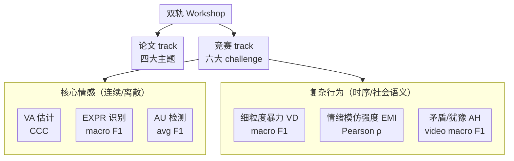

# From Affect to Complex Behavior: 第 10 届 ABAW Workshop & Competition

**会议**: CVPR 2026 Workshop  
**arXiv**: [2605.27451](https://arxiv.org/abs/2605.27451)  
**代码**: 竞赛主页 https://affective-behavior-analysis-in-the-wild.github.io/10th (各队代码见 leaderboard)  
**领域**: 多模态情感行为分析 / Human-Centered AI / Benchmark  
**关键词**: 情感计算, in-the-wild, 多模态融合, valence-arousal, 行为理解

## 一句话总结
这是 CVPR 2026 第 10 届 ABAW（Affective & Behavior Analysis in-the-Wild）Workshop 与 Competition 的官方综述论文，系统介绍了「论文 track + 六大竞赛 challenge」的双轨结构、各 challenge 的数据集/评测指标/baseline/获胜方案，并借此勾勒出情感行为分析从「孤立标签识别」走向「多模态、时序、社会语义化复杂行为理解」的领域演进轨迹。

## 研究背景与动机
**领域现状**：情感（affect，如 valence-arousal、表情、动作单元 AU）与行为（behavior，如姿态、手势、语音、注意力、犹豫、暴力）是人类沟通与决策的核心。这些信号天然是**多模态**的——人不会只靠单一通道表达情绪，而是面部表情、头部运动、注视、肢体、语音、语义内容乃至生理信号的动态组合。因此现代 AI 越来越倾向用多模态学习联合建模真实场景中的人。

**现有痛点**：早期研究多聚焦于受控环境下的**单模态、孤立标签识别**（一帧给一个表情类别）。但真实世界（in-the-wild）充满了时序动态、跨模态融合难题、缺失/噪声模态、人口统计学偏见、隐私与可信度问题，单模态窄任务的范式无法支撑 healthcare、教育、HCI、机器人、自动驾驶等落地需求。

**核心矛盾**：领域既需要**统一的大规模 in-the-wild benchmark** 来横向比较方法，又需要把任务从「静态情感标签」推向「时序演化、社会语义化的复杂行为」（如情绪模仿强度、矛盾/犹豫、细粒度暴力），而后者缺乏标准数据与评测协议。

**本文目标**：作为综述/立场论文，它不提单一新方法，而是：① 用一个持续 10 届的 workshop+competition 把社区组织起来；② 提供六个覆盖「核心情感 → 复杂行为」谱系的标准化 challenge；③ 通过 paper track 与获胜方案的共性，总结当前 multimodal human-centered AI 的有效配方。

**核心 idea**：用「双轨 workshop（论文 track 标方向 + 竞赛 track 定 benchmark）+ 六大渐进式 challenge」作为一个长期演进的平台，把碎片化的情感行为研究牵引到「多模态、时序、社会语义」的统一坐标系下。

## 方法详解
本文不是算法论文，所谓「方法」即这届 workshop 的**组织结构与竞赛设计**。整体上它由一个论文 track（四大主题）和一个竞赛 track（六个 challenge）组成，竞赛全部建立在大规模 in-the-wild 数据集（Aff-Wild2、DVD、HUME-Vidmimic2、BAH）之上，每个 challenge 给定数据划分、评测指标和官方 baseline，再由各参赛队提交方案打榜。

### 整体框架
ABAW 维持「论文 + 竞赛」双轨。论文 track 收录四个主题方向的工作：**姿态/运动/行为估计**、**情感建模与多模态学习**、**Benchmark/数据集/评测协议**、**公平性/鲁棒性/部署**。竞赛 track 设六个 challenge，从「连续情感」「离散情感」一路延伸到「复杂行为」，每个 challenge 都遵循同一套流程：发布 in-the-wild 数据 → 给定 subject-independent 的 train/val/test 划分 → 选手在隐藏 test 上提交预测（每队≤5 次）→ 用约定指标排名。下图按「情感复杂度递增」给出六大 challenge 的组织：

### 关键设计

**1. 双轨结构：论文 track 探方向 + 竞赛 track 定 benchmark**

单纯办 workshop 收论文容易方向发散、缺乏可比性；单纯办竞赛又只见排行榜、不见思想。ABAW 把两者绑在一起：论文 track 用四大主题（姿态运动、情感多模态、benchmark 数据集、公平鲁棒部署）划定社区关心的前沿；竞赛 track 用统一数据和指标提供「同一把尺子」，让方法可横向比较。两轨互补——论文里提出的可靠性感知融合、分布建模、test-time adaptation 等思路，正是竞赛获胜方案反复用到的工具，形成「探索→benchmark 验证」的闭环。

**2. 六大渐进式 challenge：从孤立情感标签到社会语义复杂行为**

这是本届最核心的设计意图。六个 challenge 不是随意拼凑，而是沿「情感复杂度」单调递增排列：前三个是**核心情感**——连续的 Valence-Arousal 估计（$\mathcal{P}_{VA}=\frac{CCC_a+CCC_v}{2}$，CCC 同时惩罚相关性偏差与均方差）、离散的 8 类表情识别（macro $F_1$）、12 个面部动作单元 AU 检测（avg $F_1$）；后三个跳到**复杂行为**——细粒度暴力检测（逐帧 violent/non-violent）、情绪模仿强度 EMI（预测 Admiration/Amusement 等 6 个维度强度，用平均 Pearson $\rho$）、视频级矛盾/犹豫 AH 二分类。这种排布把「一帧一标签」的传统情感计算，平滑接到「需要时序、跨模态、社会语境推理」的行为理解，等于给整个领域画了一条演进路线图。

**3. in-the-wild 数据 + subject-independent 协议：保证 benchmark 的真实性与可泛化性**

要让 benchmark 有意义，数据必须贴近真实且评测不能作弊。六个 challenge 全部采用大规模 in-the-wild 数据：Aff-Wild2（594 视频、约 299 万帧用于 VA）、DVD 暴力数据集子集（172 视频、约 139 万帧）、HUME-Vidmimic2（1.5 万+ 视频、30+ 小时，参与者用网络摄像头模仿种子视频）、BAH（1,427 视频、300 名加拿大参与者，模拟在线行为干预场景）。关键约束是**subject/speaker independence**——同一个人只出现在 train/val/test 之一，杜绝身份泄漏带来的虚高分数；测试集标签隐藏、限提交次数（≤5），逼出真正的泛化能力而非过拟合 leaderboard。

**4. 从获胜方案提炼的共性配方：强预训练 + 多模态可靠性感知融合 + 时序建模**

综述还隐含一个「方法学结论」：几乎所有 challenge 的获胜队都收敛到相似配方。视觉侧用强预训练 backbone（DINOv2 / CLIP / ResNet-50 / ConvNeXt / BEiT），音频侧用 WavLM / Wav2Vec2 / AST，文本侧引入 LLM/语义特征（如 EMI 冠军 TAEMI 用 Text-Anchored Dual Cross-Attention 让文本去对齐、过滤含噪的视听信号）；融合则普遍采用**可靠性感知**机制（cross-modal MoE、reliability-guided fusion、gated fusion）来应对缺失/噪声模态，并用 Transformer/Mamba/状态空间模型/BiLSTM 做时序建模。这与论文 track 里「Trust What You Fuse」「Beyond the Mean」等工作的主张高度一致，共同指向「强表征 + 鲁棒融合 + 时序推理 + 部署感知」的设计范式

### 一个完整示例
以 **Valence-Arousal 估计 challenge** 走一遍流程，体会双轨与配方如何落地：组织方先从 Aff-Wild2 取 594 个视频（356 train / 76 val / 162 test，subject-independent），用 Behavior4All 工具提取人脸框与 5 个关键点、裁剪对齐到 $112\times112\times3$ 并归一化到 $[-1,1]$ 发给选手；官方 baseline 用 ImageNet 预训练的 ResNet-50，验证集 CCC 仅 0.22。冠军队 RAS 套用了上面的「共性配方」：面部用 GRADA 编码器 + Transformer 时序、行为特征用 Qwen3-VL + Mamba、音频用 WavLM，最后用 cross-modal MoE / 可靠性感知方案融合，test 集总 CCC 冲到 0.62（baseline 0.20）。可以看到，一个 challenge 同时验证了「benchmark 真实性（in-the-wild + subject-independent）」和「方法配方（强预训练多模态 + 可靠融合 + 时序）」两件事。

## 实验关键数据
这里的「实验」即六大 challenge 的 leaderboard。下表汇总各 challenge 的数据规模、指标、baseline 与冠军成绩。

### 主实验：六大 challenge leaderboard 概览

| Challenge | 数据集 | 指标 | Baseline | 冠军队 | 冠军成绩 |
|-----------|--------|------|----------|--------|----------|
| VA 估计 | Aff-Wild2 (594 视频/2.99M 帧) | avg CCC | 0.20 | RAS | **0.62** |
| EXPR 识别 (8 类) | Aff-Wild2 (548 视频/2.62M 帧) | macro F1 | 0.225 | EagleonPamir1 | **0.391** |
| AU 检测 (12 AU) | Aff-Wild2 (542 视频/2.63M 帧) | avg F1 | 0.365 | USTC-IAT-United | **0.51** |
| 细粒度暴力 VD | DVD 子集 (172 视频/1.39M 帧) | macro F1 | 0.504 | HSEmotion | **0.587** |
| 情绪模仿强度 EMI | HUME-Vidmimic2 (15k+ 视频/30h+) | avg Pearson ρ | 0.27 (A/V/AV) | USTC-IAT-United (TAEMI) | **0.708** |
| 矛盾/犹豫 AH | BAH (1,427 视频/300 人) | video macro F1 | 0.343 | VisPBF (BROTHER) | **0.727** |

### 各 challenge 前排对比（test 集）

| Challenge | 第 1 | 第 2 | 第 3 |
|-----------|------|------|------|
| VA (CCC) | RAS 0.62 | EmoDX 0.58 | IMLAB 0.53 |
| EXPR (macro F1) | EagleonPamir1 0.391 | HSEmotion 0.386 | USTC-IAT-United 0.36 |
| AU (avg F1) | USTC-IAT-United 0.51 | HSEmotion 0.49 | —（仅 2 队超 baseline） |
| EMI (ρ) | USTC-IAT-United 0.708 | CASIA26 0.674 | MimicMetric 0.57 |
| AH (macro F1) | VisPBF 0.727 | Fennec 0.715 | LEYA 0.714 |

### 关键发现
- **多模态融合是普遍胜负手**：六个 challenge 的冠军无一例外是多模态方案，且相对 baseline 提升巨大（如 VA 从 0.20→0.62、EMI 从 0.27→0.708、AH 从 0.343→0.727），单模态 baseline 全面落后。
- **任务越复杂，绝对分越低**：核心情感里 EXPR（8 类不均衡，"Other" 类多达 51 万帧）和 AU（12 个长尾 AU）即便冠军也只有 0.39 / 0.51，说明细粒度离散情感仍是硬骨头；而 AH/EMI 这类有强文本/社会线索的任务反而能冲到 0.7+。
- **AU 检测难到「只有 2 队超 baseline」**：12 个 AU 高度类别不平衡（AU25 lips part 高达 159 万帧，AU24 仅 6 万），获胜方案普遍靠 per-AU 类权重 + 逐 AU 阈值调优 + 时序平滑等校准技巧而非纯模型堆叠。
- **文本/语义引导在复杂行为任务上价值突出**：EMI 冠军 TAEMI 用文本锚定的双向交叉注意力过滤噪声视听信号，AH 前排（Fennec 的 ConflictAwareAH）显式计算跨模态「冲突特征」（模态嵌入的绝对差）来捕捉矛盾信号——这类「用语言/不一致性做线索」的设计是复杂行为任务的新趋势。

## 亮点与洞察
- **把领域演进「编码」进竞赛任务排布**：六大 challenge 沿情感复杂度单调递增，本身就是一份可执行的领域路线图——这比单纯写一篇 survey 更有牵引力，社区会跟着 benchmark 走。
- **subject/speaker-independent 是被低估的设计**：在情感数据上身份泄漏极易造成虚高，强制 subject-independent + 隐藏 test + 限提交，是让 leaderboard 可信的关键工程纪律，可直接迁移到任何「以人为中心」的 benchmark 构建。
- **获胜方案的趋同揭示了当前范式**：「强预训练单模态编码器 + 可靠性感知跨模态融合 + 时序模型（Transformer/Mamba/SSM/BiLSTM）+ 部署感知校准」几乎是 2026 年 in-the-wild 情感行为分析的标准答案，新入场者可直接以此为起点。
- **论文 track 与竞赛 track 的思想互喂**：论文里的 reliability-aware fusion、annotation distribution modeling、topology-guided TTA 等想法，在竞赛冠军方案里得到实证，体现「探索—验证」闭环的价值。

## 局限与展望
- **作为综述，不含原创方法与统一的深度分析**：本文是组织性汇报，对各队方案只做段落式概述，缺乏统一实验设置下的受控对比与失败分析，读者无法从中得到「哪个组件到底贡献多少」的可复现结论。
- **跨 challenge 分数不可直接比较**：不同 challenge 用不同指标（CCC / macro F1 / Pearson ρ）、不同数据规模与难度，0.391（EXPR）和 0.727（AH）的高低不代表方法优劣，横向解读需谨慎 ⚠️。
- **公平性/隐私虽被列为主题，但竞赛端尚无对应指标**：论文 track 强调 fairness/robustness/deployment，但六大 challenge 仍以准确率类指标排名，未把人口统计学偏见、隐私、可信度纳入打榜，存在「呼吁与考核脱节」。
- **改进方向**：未来可引入「鲁棒性/公平性」子榜、统一多模态缺失场景的标准评测、以及对获胜方案做受控消融的官方复现，把竞赛从「比分」推向「比可信」。

## 相关工作与启发
- **vs 单届会议 challenge（如一次性 grand challenge）**: 一次性竞赛难以沉淀长期 benchmark；ABAW 通过 10 届持续迭代，任务从多任务学习、合成数据学习逐步扩展到情绪模仿、矛盾犹豫、细粒度暴力，形成可追溯的演进谱系，这是其作为「平台」而非「赛事」的独特价值。
- **vs 纯 survey 综述**: 传统 survey 只梳理文献、不产出新数据与可比结果；本文以 competition 为载体，既综述方向又交付 benchmark 与 leaderboard，把「写综述」升级为「办平台」。
- **vs 单模态情感识别基线（ResNet-50 / VGG16 baseline）**: 官方 baseline 全是单模态、弱时序，正是用来反衬多模态方案优势的「锚点」；冠军方案普遍 2-3 倍超越，印证了 in-the-wild 场景下多模态 + 时序 + 可靠融合的必要性。

## 评分
- 新颖性: ⭐⭐⭐ 作为第 10 届综述无原创算法，但「用渐进式竞赛编码领域演进」的组织设计有独到价值
- 实验充分度: ⭐⭐⭐⭐ 六大 challenge、四个大规模 in-the-wild 数据集、完整 leaderboard，benchmark 覆盖面极广
- 写作质量: ⭐⭐⭐⭐ 结构清晰，数据集/指标/baseline/获胜方案逐一交代，便于查阅
- 价值: ⭐⭐⭐⭐ 为情感行为分析提供标准 benchmark 与方法风向标，对社区方向牵引作用强

<!-- RELATED:START -->

## 相关论文

- [\[CVPR 2026\] Team LEYA in 10th ABAW Competition: Multimodal Ambivalence/Hesitancy Recognition Approach](team_leya_in_10th_abaw_competition_multimodal_ambi.md)
- [\[CVPR 2025\] HSEmotion Team at ABAW-10 Competition: Facial Expression Recognition, Valence-Arousal Estimation, Action Unit Detection and Fine-Grained Violence Classification](../../CVPR2025/human_understanding/hsemotion_team_at_abaw-10_competition_facial_expression_recognition_valence-arou.md)
- [\[CVPR 2026\] HUM4D: A Dataset and Evaluation for Complex 4D Markerless Human Motion Capture](hum4d_markerless_motion_capture.md)
- [\[ICLR 2026\] PersonaX: Multimodal Datasets with LLM-Inferred Behavior Traits](../../ICLR2026/human_understanding/personax_multimodal_datasets_with_llm-inferred_behavior_traits.md)
- [\[ICLR 2026\] Event-T2M: Event-level Conditioning for Complex Text-to-Motion Synthesis](../../ICLR2026/human_understanding/event-t2m_event-level_conditioning_for_complex_text-to-motion_synthesis.md)

<!-- RELATED:END -->
