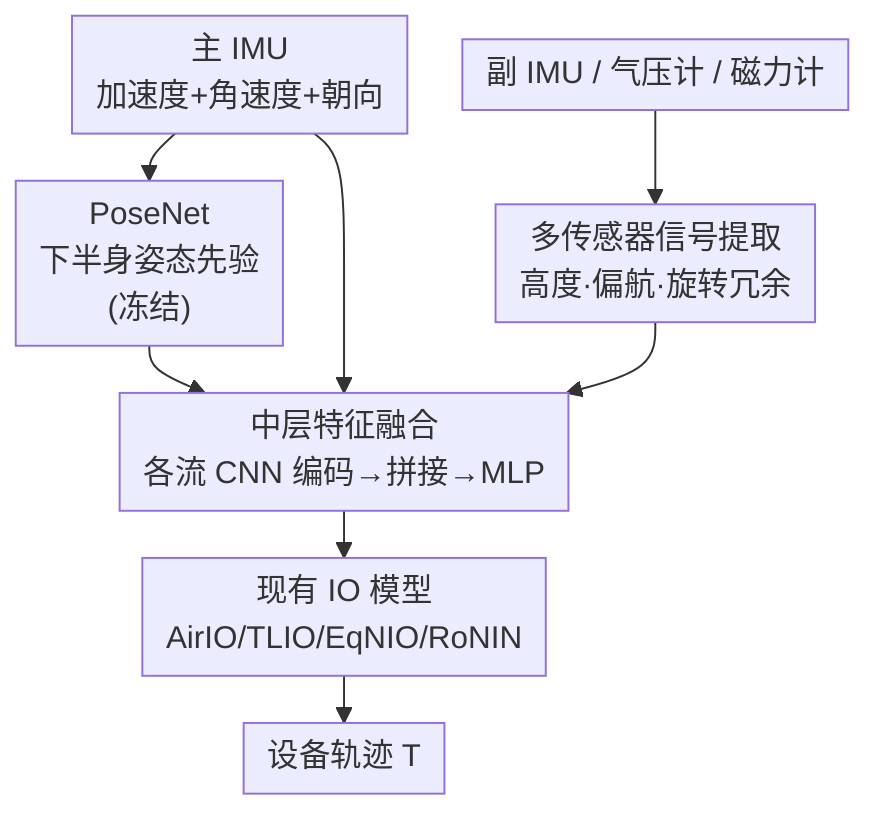

# MARIO: Motion-Augmented Real-Time Multi-Sensor Inertial Odometry

**会议**: CVPR 2026  
**arXiv**: [2606.02996](https://arxiv.org/abs/2606.02996)  
**代码**: https://spice-lab.org/projects/MARIO/ (项目主页)  
**领域**: 惯性里程计 / 人体运动追踪 / 多传感器融合  
**关键词**: 惯性里程计, IMU, 人体姿态先验, 多传感器融合, AR 眼镜

## 一句话总结
针对纯 IMU 惯性里程计长期漂移严重的问题，MARIO 用一个从单个头戴 IMU 学出来的「下半身姿态先验」给运动估计注入人体运动学约束，再融合 AR 眼镜上现成的气压计/磁力计/副 IMU 信号，在大规模日常活动数据集 Nymeria 上把位置漂移最多降低 42%，且能 315 FPS 实时运行。

## 研究背景与动机
**领域现状**：惯性里程计（IO）只用 IMU（加速度计 + 陀螺仪）估计设备 6-DoF 轨迹，体积小、功耗低、不受光照/隐私限制，是 AR 眼镜和可穿戴设备做无相机运动追踪的理想方案。近年的学习式 IO（RoNIN、TLIO、AirIO、EqNIO 等）用数据驱动的运动先验替代手工启发式，靠在大规模人体运动数据上预训练提升了泛化性。

**现有痛点**：这些方法本质上仍是「对带噪的加速度做双重积分」，误差会随时间累积成漂移。它们大多依赖单个 IMU，把 IMU 信号当成抽象的时间序列来回归位移，**没有显式利用「IMU 戴在人身上」这一事实所蕴含的人体运动学结构**。在 5 倍于以往规模、动作多样的日常活动数据集 Nymeria 上，漂移和噪声尤其严重。

**核心矛盾**：信号源（噪声 IMU）信息有限，而单纯积分会无界放大噪声；但人在走/动时，身体姿态（尤其下肢步态）本身对全局位移有强约束——现有方法把这层物理结构丢掉了。

**本文目标**：(1) 给 IO 注入人体运动学约束以抑制漂移；(2) 把 AR 眼镜上本来就有、却几乎没被神经 IO 用过的辅助传感器（气压计、磁力计、副 IMU）利用起来，进一步稳住长期高度和朝向。

**切入角度**：作者的关键洞察是——戴在身上的 IMU 追踪的其实是「人体运动学」，而不只是一串待积分的加速度。于是用一个从单 IMU 学出来的姿态先验当「时空运动学锚点」，把物理上合理的运动约束传播进位移估计。

**核心 idea**：用「IMU 推断的下半身 SMPL 姿态先验 + AR 眼镜现成多传感器中层融合」给已有 IO 架构做即插即用的增强，让无相机追踪更准更稳。

## 方法详解

### 整体框架
MARIO 不是一个全新的 IO 网络，而是一个**可挂到现有 IO 架构上的增强框架**，由两块组成：(1) **PoseNet**——从单个头戴 IMU 流学一个人体姿态先验，提供运动学结构和时间一致性；(2) **多传感器融合模块**——把气压计、磁力计、副 IMU 的物理信号各自抽成 1D/特征，和冻结 PoseNet 的姿态特征一起做中层融合，再喂给已有 IO 模型回归轨迹。整个增强对底层 IO 模型保持不可知，作者把它接到 AirIO、TLIO、EqNIO、RoNIN-LSTM 四个代表性架构上验证通用性。

输入是主 IMU 的线加速度、角速度（及辅助传感器），输出是设备轨迹 $T$。流程自上而下为：主 IMU 一路进 PoseNet 出姿态、辅助传感器各自抽物理量，所有流在中层做特征拼接后过 MLP，最后接现有 IO 模型出轨迹。

### 关键设计

**1. PoseNet：用单 IMU 学下半身姿态先验，当运动学锚点**

痛点是现有 IO 把 IMU 当抽象时间序列积分，丢掉了「人怎么动」的物理结构。MARIO 让一个轻量网络 PoseNet 从单个头戴 IMU 直接预测 SMPL 人体姿态（用 6D 旋转表示），把这个姿态当作时空运动学锚点注入运动估计。网络沿用 AirIO 的特征抽取思路，是 CNN+GRU 的混合结构：时序 CNN 先抽局部惯性动态，堆叠 GRU 再依次预测关节位置和 SMPL 旋转。关键取舍是**只估计 9 个关节**（骨盆 + 下肢），因为下肢步态主导全局位移，而从头戴 IMU 推手臂/手是欠约束的，索性砍掉以降复杂度——所以每个时刻 PoseNet 输出一个 $9\times 6\mathrm{D}$ 的姿态向量送进融合模块。它之所以有效，是因为下半身姿态对「人往哪走、走多快」给了物理上自洽的强约束，直接缓解了积分漂移。训练用关节位置/旋转的 $\ell_2$ 损失加关节角速度的 Huber 损失（$\delta=0.005$）保证时间平滑，PoseNet 在 Nymeria 上单独训练并**全程冻结**

**2. 多传感器信号提取：把 AR 眼镜现成传感器变成可用的高度/朝向约束**

纯 IMU 在垂直高度和水平朝向上最容易长期漂移，而 AR 眼镜（如 Meta Aria）上本就有气压计、磁力计和副 IMU 却几乎没被神经 IO 用过。MARIO 把每种传感器转成有物理意义的低维信号：**气压计**用国际标准大气模型的测高公式 $h \approx K\left(1-(p/P_0)^n\right)$ 把气压换成高度，再滑动平均去噪得到 1D 垂直速度，给高度一个强锚点；**磁力计**结合 IMU 估的重力做倾斜补偿，算出偏航角 $\psi=\operatorname{atan2}((\mathbf{E})_z,(\mathbf{N})_z)$ 作为绝对朝向参考，抑制 heading 漂移；**副 IMU**则利用刚体上不同位置加速度计读数 $\mathbf{a}=\mathbf{a}_0+\boldsymbol{\alpha}\times\mathbf{r}+\boldsymbol{\omega}\times(\boldsymbol{\omega}\times\mathbf{r})+\mathbf{b}+\mathbf{n}$ 中的旋转项，两个空间分离的 IMU 提升旋转可观测性、把平移加速度和旋转诱导项解耦，同时提供降噪冗余（Aria 眼镜主/副 IMU 分别在左右镜腿）。这些信号补的正是 IMU 最缺的「绝对高度 + 绝对朝向」

**3. 中层特征融合：在 IO 隐状态层面拼接而非早期堆原始信号**

把姿态和多传感器塞进 IO 有早拼、晚拼之分。MARIO 选**中层特征融合**：每个辅助流（磁力计、气压计、副 IMU）先时间对齐到主 IMU，再各自过一个小的因果时序 CNN 得到逐步特征 $f_{\text{mag}}(t),f_{\text{baro}}(t),f_{\text{imu2}}(t)$，姿态流 $f_{\text{pose}}(t)$ 和主 IMU 流 $f_{\text{imu}}(t)$ 用同样架构编码，然后在时刻 $t$ 拼成

$$f_{\text{fusion}}(t)=[\,f_{\text{imu}}(t);f_{\text{mag}}(t);f_{\text{baro}}(t);f_{\text{imu2}}(t);f_{\text{pose}}(t)\,]$$

拼接特征过一个 MLP 融合层，再接现有 IO 模型估计运动状态。之所以不在原始信号层早拼（直接把姿态参数和加速度/陀螺拼一起），是因为不同模态量纲/语义差异大，早拼会互相干扰；消融显示 raw concat 反而把 AirIO+Pose 的 ATE 从 5.22m 拖到 9.74m，中层融合（ours）则稳定最优

### 损失函数 / 训练策略
PoseNet 总目标 $\mathcal{L}=\lambda_{\text{pos}}\mathcal{L}_{\text{pos}}+\lambda_{\text{ang}}\mathcal{L}_{\text{ang}}+\lambda_{\text{vel}}\mathcal{L}_{\text{vel}}$，其中位置/旋转用 $\ell_2$、角速度用 Huber，权重 $\lambda_{\text{pos}}=\lambda_{\text{ang}}=0.05$、$\lambda_{\text{vel}}=1$。所有信号重采样到 200 Hz，气压/磁力计插值对齐到 IMU 频率。训练时用真值朝向、测试时用陀螺仪推断的朝向；对 TLIO/EqNIO/RoNIN-LSTM 从第一轮就训练协方差分支以在 Nymeria 上更稳。原始加速度按已知朝向减去重力做重力补偿——消融证明去重力比保留原始加速度信息量更大。

## 实验关键数据

### 主实验（Nymeria，单 IMU 与多传感器两组，越低越好）
在 4 个底层 IO 架构上，加 PoseNet（+Pose）和加全部传感器（+All）都一致提升。

| 模型 | 指标 | Base | +Pose | +All |
|------|------|------|-------|------|
| AirIO | ATE (m) | 6.85 | 5.22 | **4.64** |
| AirIO | Drift (%) | 3.56 | 2.35 | **2.16** |
| TLIO | ATE (m) | 10.19 | 7.97 | **5.73** |
| TLIO | Drift (%) | 6.46 | 4.94 | **3.64** |
| EqNIO | ATE (m) | 7.63 | 7.65 | **4.52** |
| RoNIN-LSTM | ATE (m) | 9.10 | 6.83 | **5.89** |

全系统（+All）在 Nymeria 上：AirIO 降 ATE 32%（6.85→4.64）、降漂移 39%；TLIO 降 ATE 44%（10.19→5.73）、降漂移 44%；EqNIO/RoNIN-LSTM 分别降 ATE 41%/35%。摘要里「最多降 42% 漂移」对应跨数据集/指标的综合幅度。在 Aria Everyday（用 Nymeria 预训练、不微调）上仍有 29–32% 的 ATE 提升，姿态先验跨域迁移把漂移最多降 53%。效率上 AirIO+All 单次推理 133.6M FLOPs、A40 上 315 FPS，可实时部署。

### 消融实验
| 配置 | ATE (m) | Drift (%) | 说明 |
|------|---------|-----------|------|
| AirIO + All (w/ g 保留重力) | 6.121 | 3.58 | 不做重力补偿 |
| AirIO + All (w/o g 去重力) | **4.641** | **2.16** | 去重力，信息量更大 |
| AirIO + Pose (raw concat) | 9.739 | 6.08 | 原始信号早拼，最差 |
| AirIO + Pose (cross attn) | 5.767 | 2.64 | 交叉注意力融合 |
| AirIO + Pose (ours 中层) | **5.218** | **2.35** | 中层特征融合最优 |

TLIO 数据集上（该集只有 IMU、无辅助传感器）单独验证姿态先验：加 PoseNet 让 4 个模型 ATE 一致提升 2–16%，证明姿态先验跨数据集泛化。

### 关键发现
- **姿态先验是单 IMU 场景下的最大贡献项**：在没有辅助传感器的 TLIO 集上，仅 +Pose 就稳定提升 ATE 2–16%，说明人体运动学约束本身就有效，不依赖额外硬件。
- **气压计对垂直稳定特别有效**：各架构的垂直 ATE（V 分量）在加气压计后明显下降（如 TLIO 的 V 从 1.09 降到 0.81）。
- **融合方式比融合内容更关键**：同样是 Pose，raw concat（9.74m）比中层融合（5.22m）差近一倍，早期拼接原始多模态信号反而有害。
- **EqNIO 单加 Pose 几乎无效甚至微升**（ATE 7.63→7.65、Drift 3.93→4.30），但 +All 又大幅改善（4.52），说明姿态先验和多传感器存在互补性。

## 亮点与洞察
- **「IMU 测的是人体运动学而非待积分加速度」这一视角很妙**：把追踪问题从「信号积分」重构为「人怎么动」，下半身 9 关节姿态先验成了抑制漂移的物理锚点，而且只需单个头戴 IMU 就能学出来。
- **充分榨干现有硬件**：气压计/磁力计/副 IMU 本就长在 AR 眼镜上、零额外成本，作者把每种都转成有明确物理含义的低维信号（测高公式、倾斜补偿偏航、双 IMU 旋转可观测性），而非黑盒堆特征。
- **即插即用的工程价值高**：作为对底层 IO 不可知的增强，能套到 AirIO/TLIO/EqNIO/RoNIN 上一致涨点，这种「先验 + 融合」范式可迁移到其他可穿戴追踪任务（如足部/腕部 IMU 定位）。
- **去重力这个小消融提醒**：减去重力分量后的线加速度比原始加速度信息量更大（ATE 6.12→4.64），是 IMU 任务里值得复用的预处理细节。

## 局限与展望
- **PoseNet 只估下半身 9 关节**：手臂/手部运动被显式排除（头戴 IMU 下欠约束），对以上肢为主、下肢几乎不动的场景（久坐操作）姿态先验可能信息不足。
- **强依赖 Nymeria 训练**：姿态先验仅在 Nymeria 上训练并冻结，虽显示了到 AEA/TLIO 的迁移，但对与 Nymeria 动作分布差异大的人群/场景泛化性仍待验证。
- **磁力计室内易受磁干扰**：作者也承认室内磁场扰动会影响朝向估计，论文未深入讨论扰动检测/拒绝机制（相比 MagShield 等专门方法）。
- **辅助传感器依赖特定硬件**：完整收益建立在 Aria 这类带双 IMU + 气压 + 磁力的眼镜上，普通单 IMU 设备只能享受 +Pose 部分。

## 相关工作与启发
- **vs TLIO / RoNIN / AirIO / EqNIO**：这些是底层 IO 架构（学习式位移/速度回归），MARIO 不与它们竞争而是**在其之上挂姿态先验 + 多传感器融合**，把它们当 backbone 一致增强，属正交贡献。
- **vs IDOL / MagShield / BaroPoser**：IDOL 用磁力计估朝向、BaroPoser 用气压恢复高度、MagShield 用磁信号纠错——MARIO 把这几类辅助信号**统一进一个中层融合框架**并叠加姿态先验，而非单独用某一种传感器。
- **vs IMUPoser / MobilePoser / DIP 等稀疏 IMU 动捕**：那些工作目标是从多个 IMU 重建全身姿态，MARIO 反过来——**从单 IMU 学姿态先验，目的不是动捕本身而是给里程计当约束**，姿态是手段不是终点。
- **vs VIO / LIO**：相机/激光雷达虽精度高但功耗大、有隐私和环境限制，MARIO 走纯惯性 + 轻量辅助传感器路线，更适合 AR 眼镜这类受限平台。

## 评分
- 新颖性: ⭐⭐⭐⭐ 「IMU 即人体运动学」的视角 + 现成多传感器中层融合组合新颖，但单项技术多为已知组件的巧妙拼装
- 实验充分度: ⭐⭐⭐⭐⭐ 4 个底层架构 × 3 个数据集 × 多组消融（姿态/去重力/融合策略），覆盖全面且含 FLOPs/FPS 实时性验证
- 写作质量: ⭐⭐⭐⭐ 动机清晰、公式完整，表格信息密度高但原文表格排版较拥挤
- 价值: ⭐⭐⭐⭐ 即插即用、零额外硬件成本、可实时，对 AR/可穿戴无相机追踪有直接落地价值

<!-- RELATED:START -->

## 相关论文

- [\[CVPR 2026\] Ultra Diffusion Poser: Diffusion-Based Human Motion Tracking From Sparse Inertial Sensors and Ranging-Based Between-Sensor Distances](ultra_diffusion_poser_diffusion-based_human_motion_tracking_from_sparse_inertial.md)
- [\[CVPR 2026\] Avatar Forcing: Real-Time Interactive Head Avatar Generation for Natural Conversation](avatar_forcing_real-time_interactive_head_avatar_generation_for_natural_conversa.md)
- [\[CVPR 2026\] ReMoGen: Real-time Human Interaction-to-Reaction Generation via Modular Learning from Diverse Data](remogen_real-time_human_interaction-to-reaction_generation_via_modular_learning_.md)
- [\[CVPR 2026\] MMGait: Towards Multi-Modal Gait Recognition](mmgait_multi_modal_gait_recognition.md)
- [\[ACL 2026\] Hybrid Autoregressive-Diffusion Model for Real-Time Sign Language Production](../../ACL2026/human_understanding/hybrid_autoregressive-diffusion_model_for_real-time_sign_language_production.md)

<!-- RELATED:END -->
