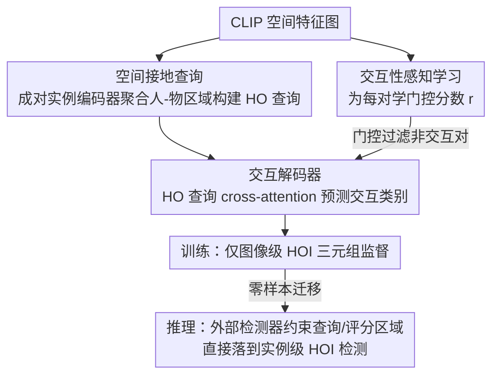

# RegFormer: Transferable Relational Grounding for Efficient Weakly-Supervised HOI Detection

**会议**: CVPR 2026  
**arXiv**: [2604.00507](https://arxiv.org/abs/2604.00507)  
**代码**: [https://github.com/mlvlab/RegFormer](https://github.com/mlvlab/RegFormer)  
**领域**: 人体理解  
**关键词**: 人-物交互检测, 弱监督, 关系接地, 交互性学习, 零样本迁移

## 一句话总结

RegFormer 提出一个轻量级关系接地 Transformer 模块，在仅图像级标注的弱监督下，通过空间接地查询和交互性感知学习，直接从图像级推理迁移到实例级 HOI 检测，无需额外训练，性能接近全监督方法。

## 研究背景与动机

HOI 检测需要定位人和物体并识别它们的交互关系。全监督方法需要为每对人-物标注交互标签，成本极高。弱监督方法只使用图像级标注（哪些 HOI 三元组出现在图像中），但面临两个关键问题。

**计算效率**：现有方法需要枚举所有人-物对并分别处理，对数增加时计算成本剧增。**假阳性**：非交互的人-物组合产生大量假阳性，干扰准确的实例级推理。

## 方法详解

### 整体框架

RegFormer 想解决的是弱监督 HOI 检测的一个尴尬：只有图像级标签（"这张图里有人骑自行车"），却要在推理时落到实例级（"是哪个人骑哪辆车"），而以往做法要么枚举所有人-物对算得很慢，要么被大量非交互的配对淹没。它的思路是把"关系"直接接地到空间特征图上学，让一个轻量 Transformer 在图像级训练时就把交互所需的空间线索吃进查询里，到了推理阶段再借外部检测器把这些线索约束到具体实例上——整条链路是：从 CLIP 空间特征图构建空间接地的 HO 查询 → 成对实例编码器编码人-物关系 → 交互解码器预测交互类别，同时一条交互性分支给每对打分做门控。训练只用图像级三元组，推理时无需再训一遍就能迁到实例级。

### 关键设计

**1. 空间接地查询：让 HO 查询天生带上空间关系，而不绑死某个检测器**

弱监督下如果直接拿检测器的实例特征来配对，分类器就和这个检测器强耦合了，换一个检测器整个模型得重训。RegFormer 改成以 CLIP 的空间特征图为底，HO 查询通过聚合人-物对相关区域的特征来构建，于是查询本身就携带了"谁在哪、相对位置如何"的空间信息。这样模型是在隐式地学交互需要的空间关系，而不是死记某个检测器输出的实例 embedding，迁移时才不会被检测器绑架。

**2. 交互性感知学习：用一个学出来的门控分数把非交互配对压下去**

弱监督设置里最大的噪声来源，就是那些根本没在交互的人-物组合——它们会制造一堆假阳性干扰实例级推理。RegFormer 为每对人-物学一个交互性得分，靠隐式的定位信号判断这一对是不是真在交互，再把这个分数当成显式的"门控"，推理时直接过滤掉低分的非交互对。相比把所有配对一视同仁地送进分类器，这条分支等于先做了一道筛选，假阳性被压在门外，留下的才是值得细判交互类别的候选。

**3. 图像级到实例级的零样本迁移：训练学到的空间线索，推理时直接拿来约束实例**

通常弱监督到实例级中间要补一个适配/桥接步骤，RegFormer 想省掉它。关键在于：训练阶段学到的空间接地交互线索本来就是"位置感知"的，所以推理时只要用外部检测器给出的人/物实例去约束 HO 查询的构建区域和交互性评分区域，这些已经学好的线索就能直接区分不同的实例对，无需额外训练。换句话说，图像级学到的"哪里像在交互"被原封不动地复用到"这个人和这个物是否在交互"，迁移是零样本的。

### 损失函数 / 训练策略

多标签分类损失（图像级）+ 交互性评分的正则化，仅使用图像级 HOI 三元组标注训练。

## 实验关键数据

### 主实验

| 方法 | 监督 | HICO-DET mAP | V-COCO AP | 推理效率 |
|------|------|-------------|-----------|---------|
| 全监督 SOTA | 全 | 高 | 高 | — |
| 之前弱监督 SOTA | 弱 | 中 | 中 | 慢 |
| **RegFormer** | **弱** | **接近全监督** | **接近全监督** | **高效** |

RegFormer 以弱监督达到接近全监督的性能，且推理效率远优于之前的弱监督方法。

### 消融实验

| 配置 | mAP | 假阳性率 | 说明 |
|------|-----|---------|------|
| 无空间接地 | 低 | 高 | 查询缺乏空间信息 |
| 无交互性评分 | 中 | 高 | 假阳性多 |
| 完整 RegFormer | 最优 | 低 | 两者协同 |

### 关键发现

- 空间接地查询使模型能从图像级学习到实例级需要的定位线索
- 交互性评分有效抑制假阳性，实例对数增加时推理时间仅微幅增长
- 弱监督性能接近全监督，大幅降低标注需求

## 亮点与洞察

- **弱监督→实例级的零样本迁移**：这是一个优雅的设计——训练时只需图像级标签，推理时直接用于实例级检测，无需桥接步骤
- **轻量高效**：实例对数增加时推理时间几乎不变，解决了弱监督 HOI 的关键效率瓶颈
- **检测器无关**：不与特定检测器耦合，更换检测器无需重新训练

## 局限与展望

- 仍依赖外部检测器的检测质量
- 对罕见交互类别的泛化能力可能受限于训练数据分布
- 弱监督标注虽便宜但仍需人工

## 相关工作与启发

- **vs ML-Decoder**: ML-Decoder 需要反复裁切配对区域，计算量随实例对数线性增长
- **vs 全监督 HOI (QPIC/CDN)**: RegFormer 用弱标注达到接近效果，标注成本大幅降低

## 评分

- 新颖性: ⭐⭐⭐⭐ 零样本迁移的设计巧妙
- 实验充分度: ⭐⭐⭐⭐ 多基准+效率分析
- 写作质量: ⭐⭐⭐⭐ 清晰简洁
- 价值: ⭐⭐⭐⭐ 降低HOI检测标注需求有实际意义

<!-- RELATED:START -->

## 相关论文

- [\[ICCV 2025\] Weakly Supervised Visible-Infrared Person Re-Identification via Heterogeneous Expert Collaborative Consistency Learning](../../ICCV2025/human_understanding/weakly_supervised_visible-infrared_person_re-identification_via_heterogeneous_ex.md)
- [\[ICCV 2025\] Bi-Level Optimization for Self-Supervised AI-Generated Face Detection](../../ICCV2025/human_understanding/bi-level_optimization_for_self-supervised_ai-generated_face_detection.md)
- [\[CVPR 2026\] Unleashing Vision-Language Semantics for Deepfake Video Detection](unleashing_vision-language_semantics_for_deepfake_video_detection.md)
- [\[CVPR 2026\] Efficient Onboard Spacecraft Pose Estimation with Event Cameras and Neuromorphic Hardware](efficient_onboard_spacecraft_pose_estimation_with_event_cameras_and_neuromorphic_hardware.md)
- [\[CVPR 2026\] TriLite: Efficient WSOL with Universal Visual Features and Tri-Region Disentanglement](trilite_efficient_weakly_supervised_object_localization_with_universal_visual_fe.md)

<!-- RELATED:END -->
