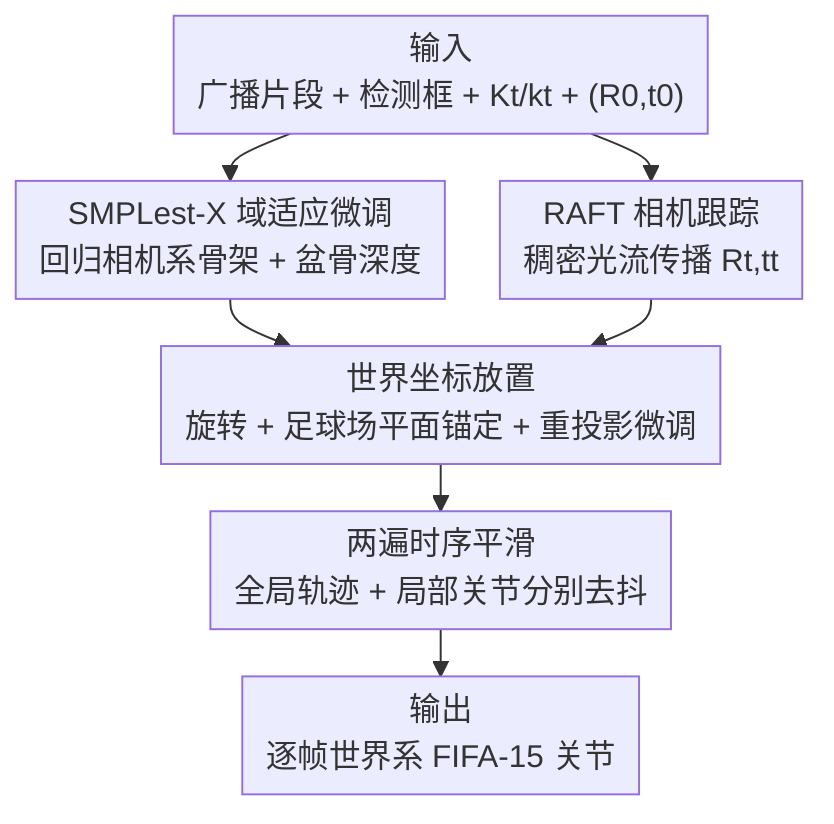

# SMART: SMPLest-X Mesh Adaptation and RAFT Tracking for Soccer Pose Estimation

**会议**: CVPR 2026  
**arXiv**: [2605.31551](https://arxiv.org/abs/2605.31551)  
**代码**: 无  
**领域**: 人体理解 / 3D 人体姿态估计  
**关键词**: 足球姿态估计, SMPLest-X, RAFT 光流, 相机跟踪, 时序平滑

## 一句话总结
针对 FIFA 2026 骨架跟踪挑战赛（从广播转播视频估计球员世界坐标系下的 3D 姿态），本文用「域适应微调的 SMPLest-X 恢复球员骨架 + RAFT 稠密光流跟踪相机 + 足球场平面锚定 + 两遍时序平滑」的四阶段流水线，把竞赛分数从基线的 1.053 降到验证集 0.647（提升 38.6%）、测试集 0.593。

## 研究背景与动机
**领域现状**：FIFA 骨架跟踪挑战赛要求从世界杯广播转播视频中，恢复每个球员在**共享世界坐标系**下逐帧的 3D 关节位置（FIFA-15 骨架：鼻子、左右肩肘腕髋膝踝、大脚趾共 15 个关节，根关节为左右髋中点）。难点不是单纯的人体姿态，而是要把「人在图里的相对姿态」和「相机在动的绝对外参」两件事同时算准，再拼到真实球场坐标里。

**现有痛点**：竞赛官方基线用 SAM-3D-Body 做 3D lifter、用 Lucas-Kanade 稀疏光流在 714 个预标注球场地标上传播相机位姿，验证集只拿到 1.053 分。两端都弱：① 通用 3D 姿态模型在广播足球场景下有严重域差——球员在画面里很小、视角很广、还经常被遮挡；② 稀疏光流在草地纹理 + 频繁推拉镜头（zoom）下对应点不稳，导致相机轨迹漂移。

**核心矛盾**：竞赛分数 $\mathcal{L}=\text{Global MPJPE}+5\times\text{Local MPJPE}$，对**局部姿态质量**（去掉根关节后的关节误差）赋予 5 倍权重，但同时绝对世界坐标（Global）误差又强烈依赖相机外参是否准。也就是说，**「人姿态准」和「人放得准」要同时解决**，而前者靠 lifter、后者靠相机跟踪，两条线必须各自做对再融合。

**本文目标**：在不使用任何竞赛帧训练的前提下，分别把（a）球员骨架恢复、（b）相机位姿传播、（c）世界坐标放置、（d）时序去抖四件事做扎实。

**切入角度**：作者观察到 Global 误差约占总分 55%，相机跟踪才是主瓶颈，于是把官方的稀疏光流换成 RAFT 稠密光流；同时发现 lifter 的域差主要靠**深度监督**就能补上（pelvis 深度是世界坐标接地的最关键量）。

**核心 idea**：用域适应微调的 SMPLest-X 当 lifter、用带异常剔除的 RAFT 稠密光流当相机跟踪器，再用足球场平面物理约束把球员「踩」到地面上，最后两遍时序平滑去抖。

## 方法详解

### 整体框架
整个系统是一条清晰的四阶段串行流水线，输入是带逐帧球员检测框、相机内参 $K_t$、畸变系数 $k_t$ 和初始相机位姿 $(R_0,t_0)$ 的广播视频片段，输出是每个球员逐帧在共享世界坐标系下的 FIFA-15 关节坐标。四个阶段各管一件事：① **SMPLest-X 域适应微调**从球员图像裁剪里回归出相机坐标系下的根关节相对骨架 + 绝对盆骨深度；② **RAFT 相机跟踪**从初始位姿出发逐帧传播相机旋转 $R_t$ 与平移 $t_t$；③ **世界坐标放置**把骨架旋转到世界系、用相机内参把球员脚部射线打到球场平面上锚定，再做重投影微调；④ **两遍时序平滑**分别清理全局轨迹和局部关节抖动。注意内参 $K_t$ 逐帧变化以适配广播制作中持续的变焦，所以相机这条线只需传播外参 $(R_t,t_t)$。

### 关键设计

**1. SMPLest-X 域适应微调：用深度监督补上广播足球的域差**

直接拿现成的 SMPLest-X（ViT-H 主干、6.87 亿参数，基于 SMPL-X 参数化人体模型）跑广播足球只有 0.846 分——球员小、视角广、半遮挡让它失准。作者的做法是只解冻 SMPLest-X 的 decoder 和预测头（ViT-H 主干冻结），在 WorldPose 数据集上用多任务损失微调：$\mathcal{L}_{\text{train}}=\lambda_1\mathcal{L}_{\text{3D}}+\lambda_2\mathcal{L}_{\text{2D}}+\lambda_3\mathcal{L}_{\text{depth}}$，其中 $\mathcal{L}_{\text{3D}}$ 是加权 MPJPE（手腕/脚踝/大脚趾等末端关节 3 倍权重），$\mathcal{L}_{\text{2D}}$ 是投影关键点的 L2，$\mathcal{L}_{\text{depth}}$ 是相机系盆骨深度的 L1。关键洞察是：**盆骨深度监督是世界坐标接地最重要的单一因素**——消融里去掉它，局部 MPJPE 就卡在 0.067 m 上不去，无论怎么加增强都没用。FIFA-15 关节不再单独学一个模块，而是从恢复出的 10475 顶点网格上按固定的「关节↔顶点」查表读出。此外用了广播增强（随机缩放裁剪、对称翻转、颜色抖动）来模拟转播画面的多样性。

**2. RAFT 稠密光流 + MAD 异常剔除：让相机跟踪在动球员遍布的画面里不漂移**

因为内参逐帧给定，相机这条线只需传播外参 $R_t\in SO(3)$ 和 $t_t\in\mathbb{R}^3$。作者把官方基线的 Lucas-Kanade 稀疏跟踪换成 RAFT-small：逐帧算 $I_{t-1}\to I_t$ 的稠密光流，在 714 个投影球场地标的凸包内以 stride-4 采样，得到比纯地标跟踪多约 50 倍的对应点。但球员在画面里大量移动会污染背景单应估计——直接用稠密光流反而和 Lucas-Kanade 打平（0.043°），因为球员轮廓上的噪声抵消了对应点变多的收益。**真正起作用的是 MAD（绝对中位差）异常剔除**：用 $3\sigma$ 阈值去掉被球员运动污染的光流向量，再用 RANSAC 拟合帧间单应、分解出 $(R_t,t_t)$，旋转误差降到 0.041°；同时拒绝 $|\Delta R|>60°$ 的更新防跟踪崩溃，检测到球场线交点时再用 EPnP 在首帧校正绝对相机位置。RAFT-large 翻倍算力却没有进一步收益，所以选 RAFT-small + MAD。

**3. 足球场平面锚定的世界坐标放置：用物理约束把球员「踩」到地面**

有了逐帧相机位姿，要把相机系骨架抬到世界系，分三步。先旋转：$\hat{\mathbf{S}}_t=R_t\,\mathbf{S}_t^{(\mathrm{cam})}$，并把 SMPLest-X 预测的相机系盆骨平移投到世界系 $\mathbf{p}_t=R_t\,\mathbf{p}_t^{(\mathrm{cam})}+t_t$ 作初始位置。**核心是足球场平面锚定**：把检测框里最低的脚部像素用 $K_t$ 反投影成相机射线，与已知的球场平面方程求交得到地面接触点 $\mathbf{f}_t$，再把所有关节平移使下脚踝对齐到 $\mathbf{f}_t$：$\mathbf{J}_{t,j}=\hat{\mathbf{S}}_{t,j}-\hat{\mathbf{S}}_{t,\mathrm{ankle}}+\mathbf{f}_t$。没有这个约束，骨架会浮在任意高度，全局和局部误差都被放大；消融显示加上后全局 MPJPE 降 44 mm、局部降 12 mm，说明接地不仅修绝对位置、还修了根相对的尺度。最后用两段 L-BFGS（先 50 步把骨架质心移到检测框中心，再 50 步对齐投影关节和 2D 关键点）做重投影微调。

**4. 两遍时序平滑：全局轨迹和局部关节分开去抖，互不干扰**

逐帧预测会因检测噪声和遮挡下的错误关联裁剪产生抖动。作者做两遍平滑。第一遍清理全局根轨迹：MAD 异常检测标出「瞬移」跳变，用线性插值替换，再用高斯滤波（$\sigma=3$ 帧，钳制在 0.35 m/帧）去残留高频噪声。第二遍独立平滑根相对关节偏移，用更窄的高斯（$\sigma=1.5$ 帧）去单帧抖动、同时保留踢球等快速肢体动作；这一步冻结世界质心，使两遍互不干扰。作者还试过训练一个滑窗时序细化网络（27 帧窗、隐藏维 128），虽然在 WorldPose 验证集上把局部 MPJPE 降了 22%，但竞赛分数反而变差（0.680 vs 0.647），因为它过度平滑了训练分布里没充分覆盖的快速动作——所以最终只用高斯平滑。

### 损失函数 / 训练策略
- **多任务损失**：$\mathcal{L}_{\text{train}}=\lambda_1\mathcal{L}_{\text{3D}}+\lambda_2\mathcal{L}_{\text{2D}}+\lambda_3\mathcal{L}_{\text{depth}}$，权重 $\lambda_1{=}1.0,\lambda_2{=}0.1,\lambda_3{=}0.5$；末端关节（手腕 5,6、脚踝 11,12、大脚趾 13,14）3 倍权重，其余 1.0。
- **微调配置**：冻结 ViT-H 主干，只训 decoder + 预测头；15 epoch、batch 16、Adam、LR $2\times10^{-6}$、AMP 混合精度、单张 24 GB A10G。
- **数据划分**：在 WorldPose 的 89 个片段上按**片段边界**做分层划分（70 训练 / 19 验证，零帧重叠，相机高度与视角分布匹配），不用任何竞赛帧训练。

## 实验关键数据

### 主实验
竞赛数据是 2022 世界杯广播视频 20 个序列（50 fps、1920×1080，6 验证 / 14 测试）。分数越低越好。

| 数据集 | Global↓ (m) | Local↓ (m) | Score↓ | 对比基线 |
|--------|-------------|------------|--------|----------|
| FIFA Baseline（验证集） | 0.602 | 0.090 | 1.053 | — |
| Ours（验证集） | 0.370 | 0.055 | **0.647** | ↓38.6% |
| Ours（测试集） | 0.324 | 0.054 | **0.593** | 强泛化 |

### 消融实验

**微调策略增量消融（验证集，从 SMPLest-X pretrained 起均已用 RAFT 跟踪 + 脚部射线放置）：**

| 配置 | Global (m) | Local (m) | Score | 说明 |
|------|-----------|-----------|-------|------|
| FIFA Baseline (SAM-3D) | 0.602 | 0.090 | 1.053 | 官方基线 |
| SAM-3D + MLP | 0.470 | 0.079 | 0.864 | 学一个放置 MLP，但跨相机高度泛化差 |
| SMPLest-X pretrained | 0.522 | 0.065 | 0.846 | 现成 lifter，存在域差 |
| + naïve fine-tune | 0.425 | 0.079 | 0.820 | 时间序划分 + 标准 3D loss，**局部反而变差**（过拟合视角）|
| + foot-plane anchoring | 0.381 | 0.067 | 0.714 | 球场平面锚定，全局 −44 mm、局部 −12 mm |
| + improved training (ours) | 0.370 | 0.055 | **0.647** | 分层划分 + 深度监督 + 广播增强 |

**相机跟踪器消融（在 WorldPose 验证 19 片段上对 GT 相机位姿测旋转误差）：**

| 跟踪器 | 旋转误差 (°)↓ | ms/帧 | 说明 |
|--------|--------------|-------|------|
| ECC homography | 0.107 | — | 无法忽略动球员，背景单应被污染漂移 |
| Lucas-Kanade（基线） | 0.043 | — | 靠 RANSAC 剔除球员特征点 |
| RAFT-small, no filter | 0.043 | 55 | 球员轮廓噪声抵消了稠密对应优势 |
| RAFT-small + MAD（ours） | **0.041** | 55 | MAD 剔除污染像素 |
| RAFT-large + MAD | 0.041 | 110 | 翻倍算力无增益 |

### 关键发现
- **深度监督是局部精度的决定因素**：去掉 $\mathcal{L}_{\text{depth}}$，局部 MPJPE 就卡在 0.067 m，加多少增强都救不回来。
- **「朴素微调」会害了局部精度**：按时间顺序划分时相邻片段相机视角几乎一致，模型过拟合训练视角，导致 held-out 局部 MPJPE 从 0.065 升到 0.079 m——这正是要做**分层片段边界划分**的原因。
- **稠密光流本身不够，MAD 异常剔除才是关键**：RAFT 不加过滤和 Lucas-Kanade 打平，加 MAD 才把旋转误差压下来。
- **学习式时序细化网络弄巧成拙**：虽在 WorldPose 上降局部 22%，但竞赛上过度平滑快速动作，分数变差，最终弃用。
- **Global 误差是主瓶颈**：约占总分 55%，激烈变焦序列会让球场平面看起来形变、扰乱单应，全局误差最多翻倍。

## 亮点与洞察
- **把竞赛误差解剖到「谁是瓶颈」再下手**：作者明确算出 Global 占 55%、相机跟踪是主瓶颈，于是优先升级相机跟踪器而非一味堆 lifter——这种「先定位再优化」的工程思路很值得借鉴。
- **物理约束 > 学一个模块**：用「最低脚部像素反投影到已知球场平面」这种纯几何锚定，比「学一个放置 MLP」（SAM-3D+MLP 的 0.864）更鲁棒，因为前者对相机高度变化天然不敏感。这个「能用几何约束就别学」的取舍在受限标注场景里很实用。
- **深度监督是世界坐标接地的隐藏关键**：很多人会以为世界坐标误差主要靠相机外参，本文证明 lifter 端的盆骨深度监督同样决定性，这个 insight 可迁移到任何「单目相对姿态 → 绝对世界坐标」的任务。
- **「更强的模型/网络不一定更好」反复出现**：RAFT-large 无增益、学习式时序细化反而掉分——提醒在竞赛/落地里要按实际分布验证而非迷信容量。

## 局限与展望
- **作者承认的局限**：① 跳水/扑救等极端姿态在 WorldPose 中欠表示，SMPLest-X 处理不好，且球员腾空时足球场平面锚定直接失效；② SMPLest-X 是逐帧模型，遮挡下脆弱，需要时序感知的 lifter；③ 6.87 亿参数的 ViT-H 主导推理开销，换 ViT-S 可约 4 倍提速但有精度损失。
- **自己发现的局限**：这是一篇**竞赛挑战赛技术报告**，方法是多个成熟组件（SMPLest-X / RAFT / RANSAC / EPnP / 高斯平滑）的工程化组装，新颖性更多体现在「组装与调参的判断力」而非单点算法创新；评估只在单一竞赛数据集（世界杯 2022 广播 + WorldPose），泛化到其他运动/转播风格未验证。
- **改进思路**：用时序感知的 lifter 替代逐帧 SMPLest-X 以抗遮挡；对腾空球员设计专门的非平面锚定（如弹道/轨迹约束）；针对激烈变焦序列显式建模球场平面形变以压低 Global 误差。

## 相关工作与启发
- **vs FIFA 官方基线（SAM-3D-Body + Lucas-Kanade）**：基线用 SAM-3D 当 lifter、稀疏光流跟相机，1.053 分。本文两端都换（SMPLest-X 微调 + RAFT 稠密光流 + MAD），并加足球场平面锚定，降到 0.647，区别在于「更强且域适应的 lifter + 更稠密且抗污染的相机跟踪 + 物理接地约束」。
- **vs WorldPose [1]**：WorldPose 是提供广播足球片段 + 伪 3D 真值的数据集，本文把它当微调数据源，并在其上做相机跟踪器的旋转误差评估。
- **vs SAM-3D + 学习式放置 MLP**：作者试过用 MLP 从相机几何 + 脚部射线特征预测髋部绝对位置（0.864），但跨相机高度泛化差，遂转向 SMPLest-X + 几何锚定，体现「学习模块在分布外不稳、几何约束更可靠」的取舍。

## 评分
- 新颖性: ⭐⭐⭐ 竞赛挑战赛报告，亮点在成熟组件的工程化组装与瓶颈定位，单点算法创新有限。
- 实验充分度: ⭐⭐⭐⭐ 三组增量消融（微调策略 / 相机跟踪 / 时序细化）讲清了每个设计的贡献，但仅限单一竞赛数据集。
- 写作质量: ⭐⭐⭐⭐ 流水线四阶段表述清晰，消融逻辑严谨，把「为什么这样选」交代得很到位。
- 价值: ⭐⭐⭐⭐ 对「单目广播视频 → 世界坐标 3D 姿态」的工程落地很有参考性，深度监督和几何锚定的 insight 可迁移。

<!-- RELATED:START -->

## 相关论文

- [\[CVPR 2025\] CRISP: Object Pose and Shape Estimation with Test-Time Adaptation](../../CVPR2025/human_understanding/crisp_object_pose_and_shape_estimation_with_test-time_adaptation.md)
- [\[CVPR 2026\] Humanoid-GPT: Scaling Data and Structure for Zero-Shot Motion Tracking](humanoid-gpt_scaling_data_and_structure_for_zero-shot_motion_tracking.md)
- [\[CVPR 2026\] LAMP: Localization Aware Multi-camera People Tracking in Metric 3D World](lamp_localization_aware_multi-camera_people_tracking_in_metric_3d_world.md)
- [\[AAAI 2026\] Robust Long-term Test-Time Adaptation for 3D Human Pose Estimation through Motion Discretization](../../AAAI2026/human_understanding/robust_long-term_test-time_adaptation_for_3d_human_pose_estimation_through_motio.md)
- [\[CVPR 2026\] FSMC-Pose: Frequency and Spatial Fusion with Multiscale Self-calibration for Cattle Mounting Pose Estimation](fsmc-pose_frequency_and_spatial_fusion_with_multiscale_selfcalibration_for_cattle.md)

<!-- RELATED:END -->
