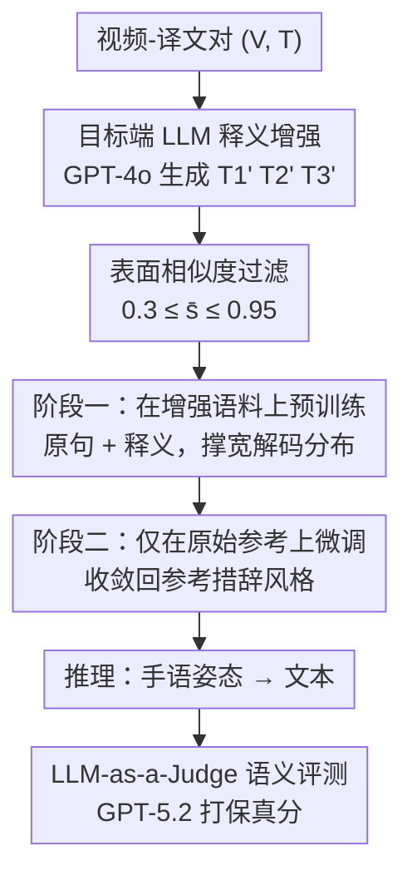

# Target-Side Paraphrase Augmentation for Sign Language Translation with Large Language Models

**会议**: CVPR 2026  
**arXiv**: [2605.31393](https://arxiv.org/abs/2605.31393)  
**代码**: 无（论文称代码与数据集匿名公开，待 review 后释出）  
**领域**: 手语翻译 / 数据增强 / LLM  
**关键词**: 手语翻译, 目标端释义增强, GPT-4o, 两阶段训练, LLM-as-a-Judge

## 一句话总结
针对手语翻译数据稀缺的问题，本文不增强手语视频侧，而是用 GPT-4o 把每条参考译文改写成多条语义保真的释义、构成"目标端增强"语料，配合"先在增强语料预训练、再回到原始参考微调"的两阶段训练，让 PHOENIX14T 的 BLEU-4 从 9.56 提到 10.33，并用 LLM-as-a-Judge 揭示出 BLEU 低估了语义保真度上 +45% 的真实提升。

## 研究背景与动机

**领域现状**：手语翻译（Sign Language Translation, SLT）把手语视频映射成口语文本，横跨 CV 与 NLP。主流做法从早期"视频→gloss→文本"的两阶段管线，转向"视频直接→文本"的 gloss-free 路线，普遍基于 Transformer 编码器-解码器，并出现了 Sign2GPT、Signformer 等轻量高效架构。

**现有痛点**：SLT 的根本瓶颈是**配对语料极度稀缺**——成对的"手语视频/译文"很难大规模采集；同时目标词表呈**重尾分布**，大量词只出现寥寥几次（如本文 LSA-T 数据集 50% 是只出现一次的单例词）。数据少 + 长尾，解码器很容易记住训练集里那一种固定表述，泛化不出来。

**核心矛盾**：低资源机器翻译里数据增强是标配，但在 SLT 里增强几乎都做在**手语侧**（用手语生成模型、姿态扰动造更多视频）。手语侧增强工程代价大、且生成质量难保证；而真正廉价、却一直被忽视的是**文本侧**——同一段手语内容，口语本来就有多种合法的表述方式，但每条样本只给了解码器一个参考答案。

**本文目标**：在不动手语输入的前提下，给解码器**多暴露几种"同义不同表面形式"的目标文本**，从而缓解过拟合单一表述；并搞清楚这种增强在什么样的语料上有效、什么样的语料上无效。

**切入角度**：既然 LLM（GPT-4o）已经很会做语义保真的释义改写，那就让它为每条参考译文批量生成可控释义，把"一对一"的监督变成"一对多"，相当于免费给解码器灌入了多种合法的口语实现方式。

**核心 idea**：用 LLM 做**目标端释义增强**（手语固定、改写译文）+ **两阶段训练**（先在释义扩增语料上预训练、再在原始参考上微调收敛回参考风格），并首次把 LLM-as-a-Judge 引入 SLT 评测，揭示词面重叠指标（BLEU）系统性低估了语义层面的真实增益。

## 方法详解

### 整体框架
方法本身不碰手语识别模型，骨架沿用 Signformer 风格的姿态版编码器-解码器 Transformer：MediaPipe Holistic 从每帧抽出 33 个身体关键点、左右各 21 个手部关键点和一部分面部关键点，拼成每帧特征向量，经线性投影喂进编码器（替代原版 CNN 帧 token），解码器自回归生成目标语言文本。这套姿态表征强调发音性的运动、压掉背景与光照变化，换来轻量可控的实验平台——本文要研究的不是"识别更准"，而是"在同一骨架下，加不加增强差多少"。

真正的贡献链是三步：① **离线**用 GPT-4o 给每条参考译文 $T$ 生成 3 条释义 $T_1', T_2', T_3'$，并用表面相似度过滤掉跑题或近乎复制的变体；② **训练阶段一**在"原句 + 保留下来的释义"扩增语料上预训练，把解码器的输出分布撑宽；③ **训练阶段二**只在原始参考上微调，把分布重新收敛回参考的措辞风格，但保留阶段一获得的更广词汇暴露。推理时模型照常从手语姿态直接翻译成文本。最后用 GPT-5.2 当裁判，对译文打语义保真分，补上 BLEU 看不到的那部分增益。

### 关键设计

**1. 目标端 LLM 释义增强：固定手语、只改译文，把一对一监督变成一对多**

针对"每条样本只给解码器一种参考表述、容易记死模板"的痛点。对每个视频-句子对 $(V, T)$，用 GPT-4o 生成 $N=3$ 条释义 $T_1', T_2', T_3'$，要求**保持原意**的同时允许受控的词汇与句法变化；prompt 强制输出结构化 JSON，并显式要求保留时态、语域和命题内容（不能把"天气由低压区决定"改写成意思偏移的句子）。训练时每条样本被物化成 4 个实例：$(V,T)$、$(V,T_1')$、$(V,T_2')$、$(V,T_3')$——手语输入完全不变，变的只是它对应的合法口语表述。这样解码器看到的是"同一段手语 → 多种可接受的表面实现"，被迫学习语义而非死记某一句模板。这与以往 SLT 增强都做在手语侧形成对照：文本侧改写几乎零额外采集成本，且 LLM 的释义质量远高于早期基于启发式规则的 gloss-to-text 改写。

**2. 表面相似度过滤：用上下界卡住"既不跑题、也不照抄"的释义**

LLM 释义有两种失败模式——改得太狠导致语义漂移，或改得太轻几乎是原句复制。本文用四种表面相似度度量的均值来过滤：字符级 Jaccard、词级 Jaccard、归一化 Levenshtein、trigram 重叠，记为 $\bar{s}(T, T_i')$。只保留落在区间内的变体：

$$0.3 \le \bar{s}(T, T_i') \le 0.95$$

且无条件丢弃完全重复的句子。下界 $0.3$ 把和原句相似度过低（很可能意思已经变了）的变体拒掉；上界 $0.95$ 把几乎是原句复制、增强不出新信息的近似副本去掉。注意这是个纯**表面形式**的过滤器，便宜、可解释，目的是控制释义的"改写幅度"落在有用区间，而不是去判断语义是否正确（语义正确性交给 prompt 约束和后面的 LLM 裁判）。

**3. 两阶段训练：先用增强语料撑宽分布，再用原始参考收敛回风格**

如果直接把释义混进训练集一锅炖，解码器的输出分布会被释义的多样措辞带偏，推理时反而生成出和参考风格不一致的句子（在单参考 BLEU 下要吃亏）。本文把训练拆成两段：**阶段一**在增强语料（原句 + 每条 3 个释义）上预训练，让解码器接触到更宽的词汇与句式分布；**阶段二**只在原始参考上微调，把分布重新对齐到参考的措辞风格，同时不丢掉阶段一获得的更广词汇暴露。作者强调这个两阶段调度是方法的核心——预训练负责"撑宽"，微调负责"回中"，两者缺一则要么风格跑偏、要么没吃到增强红利。两个条件（baseline 与 +Augmentation）共用完全相同的超参、teacher forcing + 交叉熵、warm-up-and-decay 学习率、label smoothing 与按验证损失早停，保证对比公平。

**4. LLM-as-a-Judge 语义评测：补上 BLEU 看不见的语义增益**

增强鼓励模型接受"多种合法实现"，但 BLEU 只奖励与**单一参考**的词面重叠——一个语义正确但用词不同的译文会被 BLEU 惩罚，造成"BLEU 涨得少 ≠ 实际没进步"的方法学错配。为此本文首次在 SLT 上引入 LLM-as-a-Judge：用 GPT-5.2 给译文的语义保真度与语言质量打分。这条评测之所以成立，是因为既有工作表明 LLM 裁判与人类偏好高度一致、LLM 翻译评测器与人工判断有竞争力的相关性。作者也诚实地标注了局限：裁判（GPT-5.2）与增强生成器（GPT-4o）虽架构不同，但可能共享训练血统、引入潜在对齐偏置，故语义打分应作为**补充证据**、理想情况下还需人工验证。

### 损失函数 / 训练策略
两个条件都用标准的 teacher forcing + token 级交叉熵；学习率采用 warm-up 后衰减；加 label smoothing；按验证损失早停。+Augmentation 条件的唯一区别是前面多一段在增强语料上的预训练（阶段一），随后在原始参考上微调（阶段二），且阶段一/二与 baseline 共用同一套超参与早停设置。

## 实验关键数据

### 主实验
在三个互补难度的数据集上测 case-insensitive BLEU-4：

| 数据集（手语→目标语言） | Baseline BLEU-4 | +Augmentation | 变化 |
|--------|------|------|------|
| PHOENIX14T（DGS→德语） | 9.56 | 10.33 | **+0.77** |
| GSL（希腊手语→希腊语） | 94.38 | 92.22 | −2.16 |
| LSA-T（阿根廷手语→西班牙语） | 1.18 | 1.19 | +0.01 |

三个数据集的语料特性差异是理解结果的关键：

| 统计量 | PHOENIX14T | GSL | LSA-T |
|--------|-----------|-----|-------|
| 真实场景拍摄 | 是 | 否 | 是 |
| 唯一句子占比 | 79.93% | 3.21% | 95.79% |
| 词表规模 | 2,887 | N/A | 14,239 |
| 单例词占比 | 37.3% | 0% | 50.21% |

PHOENIX14T 处于"中等词汇多样性"的甜区，释义暴露让解码器跳出记住的模板、泛化更好，BLEU +0.77；GSL 是高度受控、句子高度重复的录制（仅 3.21% 唯一句子、BLEU 基线已近饱和 94.38），增强只会让模型生成"语义正确但用词不同"的句子，被单参考 BLEU 惩罚而略掉到 92.22；LSA-T 长尾极端稀疏（50% 单例词、基线仅 ~1.2 BLEU），瓶颈在手语侧数据稀缺，目标端改写无能为力，两条件几乎不变。

### 语义评测（LLM-as-a-Judge, GPT-5.2）
| 数据集 | Baseline | Augmented | 变化 |
|--------|----------|-----------|------|
| PHOENIX14T | 2.51 | 3.65 | **+45.0%** |
| GSL | 7.72 | 8.77 | +13.6% |

在 PHOENIX14T 上，语义保真度从 2.51 升到 3.65（+45%），"流畅但错误"的译文占比从 54.8% 降到 35.5%，成对偏好以 52.9% vs 13.1% 压倒性偏向增强版；GSL 即便词面指标近饱和，语义分仍从 7.72 升到 8.77（+13.6%）。这印证了核心论点：BLEU 的小幅变化严重低估了语义层面的真实提升。

### 关键发现
- **增强不是普惠的**：效果强烈取决于语料在"程式化 ↔ 长尾稀疏"光谱上的位置——中等多样性（PHOENIX14T）受益最大，近饱和（GSL）和极端稀疏（LSA-T）都几乎或反而吃亏。
- **BLEU 与语义评测背离**：GSL 上 BLEU 掉 2.16，但语义分反升 13.6%，直接暴露了单参考词面指标在"接受多种合法表述"场景下的失效。
- **目标端增强治不了手语侧稀疏**：LSA-T 的瓶颈是手语视频数据本身太少且长尾，改写译文这一侧动作完全帮不上忙。

## 亮点与洞察
- **换个方向做增强**：SLT 增强长期默认做在难、贵的手语视频侧；本文指出文本侧才是近乎零成本的入口——手语固定、只改译文，把一对一监督变一对多，这个视角切换本身就很巧。
- **两阶段调度是点睛**：用"预训练撑宽 + 微调回中"解决了"释义多样性会把解码器风格带偏"的隐患，让增强的红利落袋而不损害参考风格对齐，是可迁移到任何低资源 MT 的训练 trick。
- **诚实地用评测拆穿指标**：作者没有粉饰 GSL 上 BLEU 下降，而是顺势引入 LLM-as-a-Judge 证明那是"BLEU 的错、不是模型的错"，并主动承认裁判与生成器同源可能带来偏置——这种把负结果转成洞察的写法值得学。
- **可迁移性**：表面相似度上下界过滤释义（卡住"既不跑题也不照抄"）是个通用、便宜、可解释的数据清洗器，任何 LLM 造数据的低资源任务都能直接复用。

## 局限与展望
- **作者承认的局限**：增强对长尾稀疏（LSA-T）和近饱和（GSL）语料无效甚至有害，只在中等多样性语料上有正收益；姿态版骨架本身可能弱于图像版模型，绝对 BLEU 偏低。
- **评测可信度存疑**：裁判 GPT-5.2 与增强生成器 GPT-4o 可能共享训练血统，语义打分只能作为补充证据，理想情况下需人工验证。
- **自己发现的局限**：PHOENIX14T 的绝对增益其实很小（BLEU 9.56→10.33），且只在一个"甜区"数据集上成立，结论的普适性有限；单参考 BLEU 的天然缺陷意味着该方法在标准 benchmark 上很难"看起来很强"。
- **改进思路**：作者建议把目标端文本增强与手语侧增强结合、改用多参考评测、并用开源 LLM 替换 GPT-4o，以判清增益究竟来自"增强原理本身"还是"特定生成器的能力"。

## 相关工作与启发
- **vs 手语侧增强（生产模型 / 生成方法）**：他们造更多手语视频，工程贵、质量难控；本文反其道只改目标文本，几乎零采集成本，但天然治不了手语侧数据稀缺（LSA-T 上失效）。
- **vs gloss-to-text 启发式释义规则**：早期工作用人工启发式规则做 gloss 到文本的释义，覆盖窄、表述生硬；本文用 GPT-4o 生成保真且多样的自然语言释义，质量与多样性都高出一截。
- **vs Sign2GPT / Signformer**：这些工作聚焦更强的视频→文本架构；本文不改架构、复用 Signformer 骨架，把增益完全归到数据与训练调度上，使"加不加增强"的对照更干净。

## 评分
- 新颖性: ⭐⭐⭐⭐ 首次把 LLM 目标端释义增强 + LLM-as-a-Judge 引入 SLT，方向切换巧但单项技术较朴素
- 实验充分度: ⭐⭐⭐⭐ 三个互补难度数据集 + 语义评测交叉验证，结论分层清晰；但绝对增益小、缺多参考与人工评测
- 写作质量: ⭐⭐⭐⭐⭐ 论点诚实、负结果转洞察、语料特性与结果对应讲得很透
- 价值: ⭐⭐⭐⭐ 提供了低成本、可迁移的目标端增强配方与"BLEU 低估语义"的有力证据，对低资源 SLT/MT 实用

<!-- RELATED:START -->

## 相关论文

- [\[CVPR 2026\] Sign Language Recognition in the Age of LLMs](sign_language_recognition_llms.md)
- [\[CVPR 2025\] Lost in Translation, Found in Context: Sign Language Translation with Contextual Cues](../../CVPR2025/human_understanding/lost_in_translation_found_in_context_sign_language_translation_with_contextual_c.md)
- [\[ECCV 2024\] A Simple Baseline for Spoken Language to Sign Language Translation with 3D Avatars](../../ECCV2024/human_understanding/a_simple_baseline_for_spoken_language_to_sign_language_trans.md)
- [\[CVPR 2026\] Unleashing Vision-Language Semantics for Deepfake Video Detection](unleashing_vision-language_semantics_for_deepfake_video_detection.md)
- [\[CVPR 2026\] LaScA: Language-Conditioned Scalable Modelling of Affective Dynamics](lasca_language-conditioned_scalable_modelling_of_affective_dynamics.md)

<!-- RELATED:END -->
